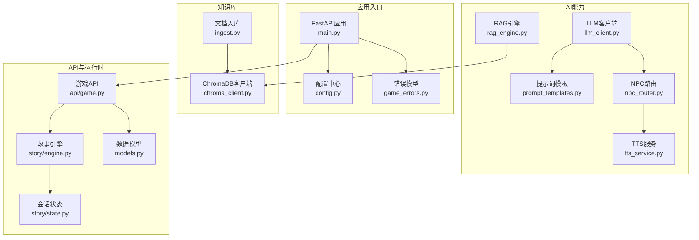
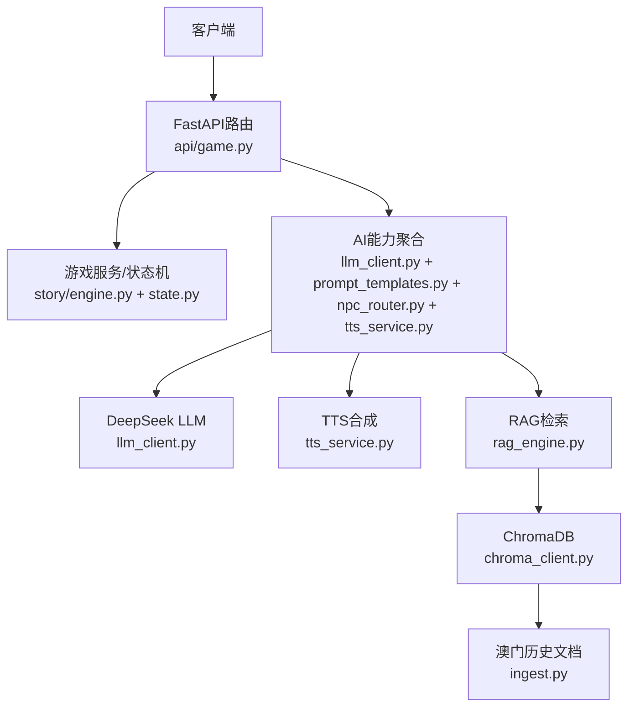
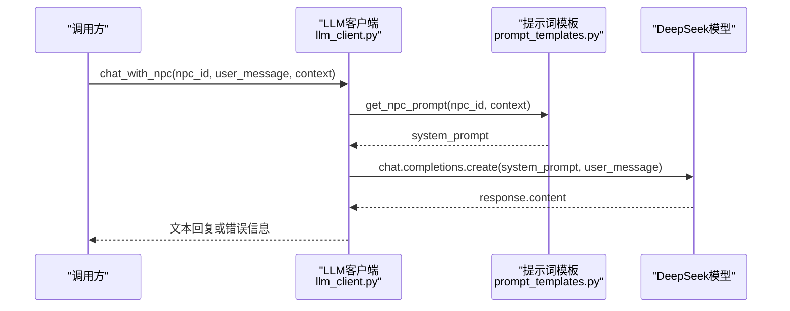
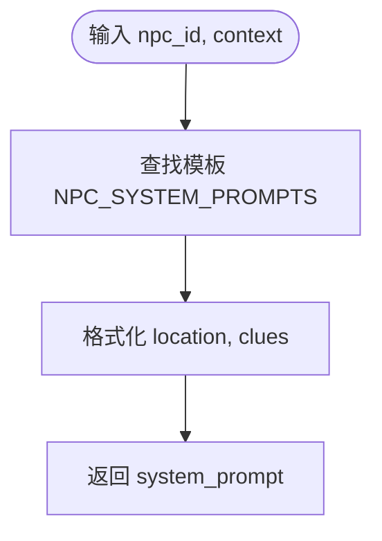
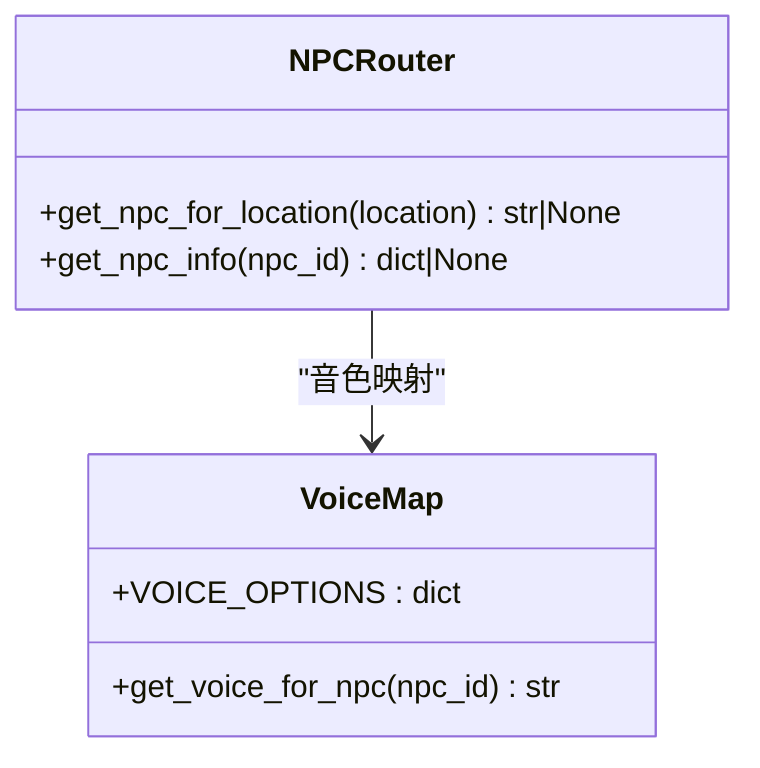
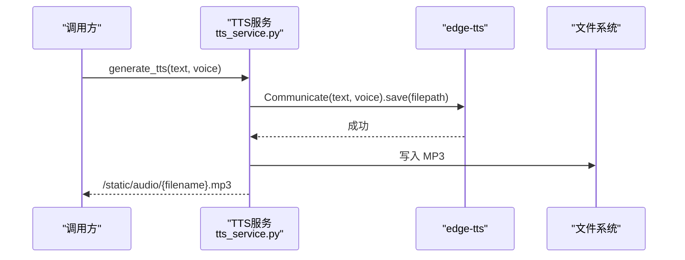
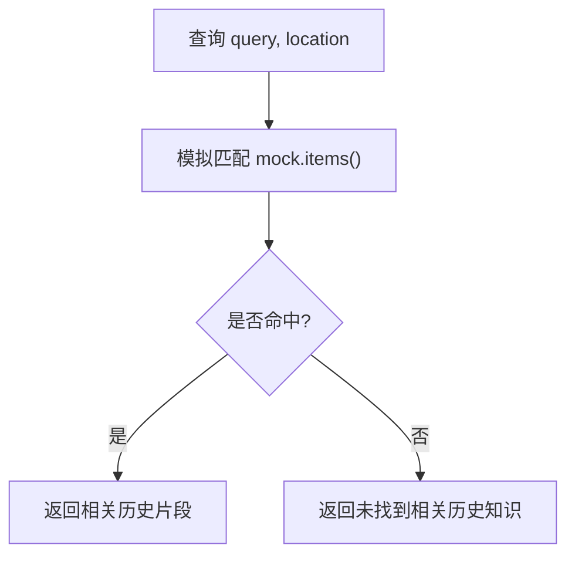
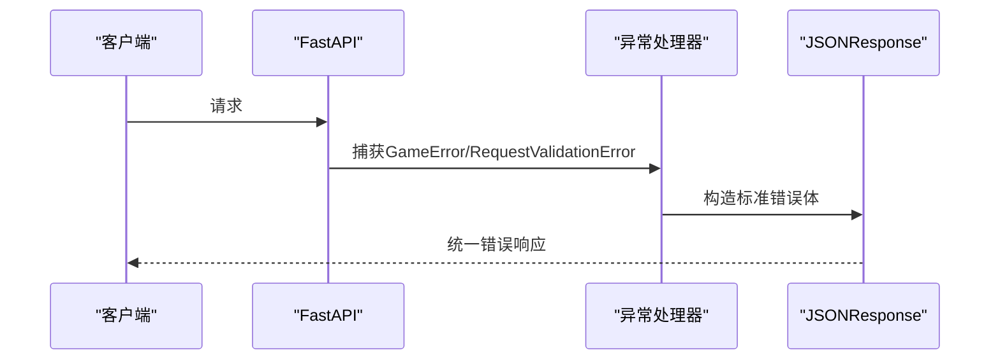
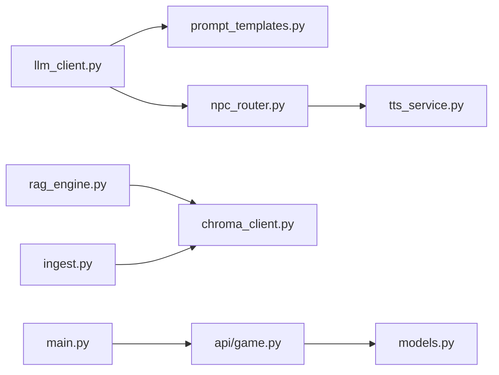
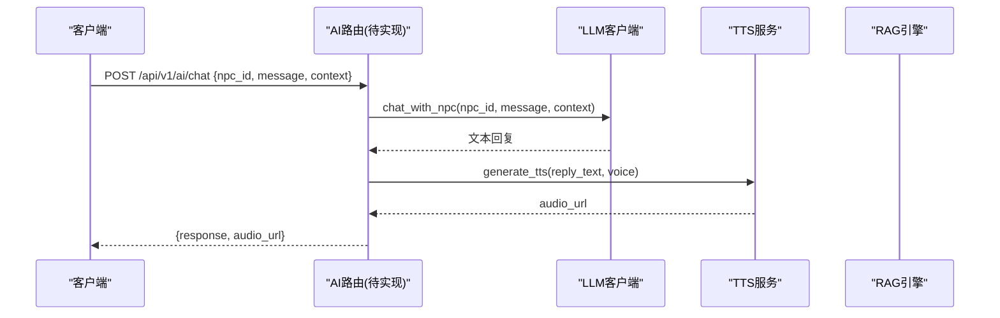

# AI服务系统

<cite>
**本文引用的文件**   
- [main.py](file://backend/app/main.py)
- [llm_client.py](file://backend/app/ai/llm_client.py)
- [npc_router.py](file://backend/app/ai/npc_router.py)
- [prompt_templates.py](file://backend/app/ai/prompt_templates.py)
- [tts_service.py](file://backend/app/ai/tts_service.py)
- [rag_engine.py](file://backend/app/ai/rag_engine.py)
- [chroma_client.py](file://backend/app/knowledge/chroma_client.py)
- [ingest.py](file://backend/app/knowledge/ingest.py)
- [config.py](file://backend/app/config.py)
- [game_errors.py](file://backend/app/game_errors.py)
- [models.py](file://backend/app/models.py)
- [game.py](file://backend/app/api/game.py)
- [engine.py](file://backend/app/story/engine.py)
- [state.py](file://backend/app/story/state.py)
</cite>

## 目录
1. [简介](#简介)
2. [项目结构](#项目结构)
3. [核心组件](#核心组件)
4. [架构总览](#架构总览)
5. [详细组件分析](#详细组件分析)
6. [依赖关系分析](#依赖关系分析)
7. [性能考量](#性能考量)
8. [故障排查指南](#故障排查指南)
9. [结论](#结论)
10. [附录](#附录)

## 简介
本技术文档面向AI开发者，系统化阐述澳秘 Macau Mystery AI服务系统的实现与集成要点。重点覆盖：
- DeepSeek LLM客户端封装（基于OpenAI兼容接口）
- 提示词工程设计与上下文管理机制
- NPC角色路由系统与性格设定框架、方言支持
- TTS语音合成服务的配置、音频格式处理与缓存策略
- RAG知识库的向量检索、语义搜索算法与相似度计算现状与扩展方案
- AI服务调用示例、错误处理方案与性能优化技巧
- 完整集成指南与最佳实践

## 项目结构
后端采用FastAPI构建，模块化组织AI能力、知识检索、游戏运行时与API路由。关键模块如下：
- AI层：LLM客户端、NPC路由、提示词模板、TTS服务、RAG引擎
- 知识层：ChromaDB客户端与文档入库脚本
- 应用层：主应用装配、配置管理、错误模型、数据模型
- 故事运行时：剧本加载、会话状态、选择处理

**图表来源** 
- [main.py:17-107](file://backend/app/main.py#L17-L107)
- [config.py:38-77](file://backend/app/config.py#L38-L77)
- [game_errors.py:7-20](file://backend/app/game_errors.py#L7-L20)
- [llm_client.py:1-32](file://backend/app/ai/llm_client.py#L1-L32)
- [prompt_templates.py:1-37](file://backend/app/ai/prompt_templates.py#L1-L37)
- [npc_router.py:1-18](file://backend/app/ai/npc_router.py#L1-L18)
- [tts_service.py:1-25](file://backend/app/ai/tts_service.py#L1-L25)
- [rag_engine.py:1-13](file://backend/app/ai/rag_engine.py#L1-L13)
- [chroma_client.py:1-19](file://backend/app/knowledge/chroma_client.py#L1-L19)
- [ingest.py:1-36](file://backend/app/knowledge/ingest.py#L1-L36)
- [game.py:1-37](file://backend/app/api/game.py#L1-L37)
- [engine.py:1-37](file://backend/app/story/engine.py#L1-L37)
- [state.py:1-54](file://backend/app/story/state.py#L1-L54)
- [models.py:1-146](file://backend/app/models.py#L1-L146)

**章节来源**
- [main.py:17-107](file://backend/app/main.py#L17-L107)
- [config.py:38-77](file://backend/app/config.py#L38-L77)

## 核心组件
- LLM客户端：通过AsyncOpenAI对接DeepSeek（SiliconFlow），提供聊天与NPC对话封装，统一temperature与max_tokens参数。
- 提示词工程：按NPC ID映射系统提示模板，动态注入location与clues上下文，控制输出长度与语言风格。
- NPC路由：根据地理位置匹配NPC身份，返回对应voice与名称，驱动TTS音色选择。
- TTS服务：使用edge-tts生成MP3音频，落盘至静态目录并返回URL；可按NPC映射音色。
- RAG引擎：当前为模拟检索，后续可接入ChromaDB进行向量检索与语义相似度计算。
- 配置与错误：集中式Settings与GameError异常体系，保障跨模块一致性与稳定错误码。

**章节来源**
- [llm_client.py:1-32](file://backend/app/ai/llm_client.py#L1-L32)
- [prompt_templates.py:1-37](file://backend/app/ai/prompt_templates.py#L1-L37)
- [npc_router.py:1-18](file://backend/app/ai/npc_router.py#L1-L18)
- [tts_service.py:1-25](file://backend/app/ai/tts_service.py#L1-L25)
- [rag_engine.py:1-13](file://backend/app/ai/rag_engine.py#L1-L13)
- [config.py:38-77](file://backend/app/config.py#L38-L77)
- [game_errors.py:7-20](file://backend/app/game_errors.py#L7-L20)

## 架构总览
系统以FastAPI为入口，挂载多组API路由；AI能力由独立模块提供，知识库通过ChromaDB持久化，故事运行时负责会话与剧情推进。

**图表来源** 
- [game.py:1-37](file://backend/app/api/game.py#L1-L37)
- [engine.py:1-37](file://backend/app/story/engine.py#L1-L37)
- [state.py:1-54](file://backend/app/story/state.py#L1-L54)
- [llm_client.py:1-32](file://backend/app/ai/llm_client.py#L1-L32)
- [prompt_templates.py:1-37](file://backend/app/ai/prompt_templates.py#L1-L37)
- [npc_router.py:1-18](file://backend/app/ai/npc_router.py#L1-L18)
- [tts_service.py:1-25](file://backend/app/ai/tts_service.py#L1-L25)
- [rag_engine.py:1-13](file://backend/app/ai/rag_engine.py#L1-L13)
- [chroma_client.py:1-19](file://backend/app/knowledge/chroma_client.py#L1-L19)
- [ingest.py:1-36](file://backend/app/knowledge/ingest.py#L1-L36)

## 详细组件分析

### LLM客户端封装（DeepSeek via SiliconFlow）
- 异步客户端初始化，读取环境变量配置API Key与Base URL，默认模型为DeepSeek-V3。
- chat_with_llm统一system/user消息构造，限制max_tokens与temperature，异常捕获后返回友好错误文本。
- chat_with_npc组合NPC提示词与用户消息，简化上层调用。

**图表来源** 
- [llm_client.py:12-31](file://backend/app/ai/llm_client.py#L12-L31)
- [prompt_templates.py:32-36](file://backend/app/ai/prompt_templates.py#L32-L36)

**章节来源**
- [llm_client.py:1-32](file://backend/app/ai/llm_client.py#L1-L32)
- [prompt_templates.py:1-37](file://backend/app/ai/prompt_templates.py#L1-L37)

### 提示词工程与上下文管理
- NPC_SYSTEM_PROMPTS定义各角色说话风格、场景与线索占位符。
- get_npc_prompt将context中的location与clues注入模板，确保每次对话具备情境感知。
- 建议扩展：加入对话历史摘要、玩家意图标签、安全过滤规则等。

**图表来源** 
- [prompt_templates.py:3-36](file://backend/app/ai/prompt_templates.py#L3-L36)

**章节来源**
- [prompt_templates.py:1-37](file://backend/app/ai/prompt_templates.py#L1-L37)

### NPC角色路由与方言支持
- NPC_PERSONAS维护角色ID到名称、位置、语音音色的映射。
- get_npc_for_location按location精确匹配返回npc_id；get_npc_info返回完整信息。
- 方言支持：通过edge-tts的zh-HK与zh-CN系列Neural音色实现粤语与普通话区分。

**图表来源** 
- [npc_router.py:2-17](file://backend/app/ai/npc_router.py#L2-L17)
- [tts_service.py:4-24](file://backend/app/ai/tts_service.py#L4-L24)

**章节来源**
- [npc_router.py:1-18](file://backend/app/ai/npc_router.py#L1-L18)
- [tts_service.py:1-25](file://backend/app/ai/tts_service.py#L1-L25)

### TTS语音合成服务
- 使用edge-tts生成MP3音频，随机文件名避免冲突，写入static/audio目录。
- VOICE_OPTIONS与NPC映射保持一致，便于按角色自动选择音色。
- 缓存策略：当前未实现去重与缓存，建议引入文本指纹+哈希缓存与过期策略。

**图表来源** 
- [tts_service.py:14-20](file://backend/app/ai/tts_service.py#L14-L20)

**章节来源**
- [tts_service.py:1-25](file://backend/app/ai/tts_service.py#L1-L25)

### RAG知识库与向量检索
- rag_query当前为模拟实现，按location与query关键字匹配返回历史片段。
- chroma_client提供单例PersistentClient与集合获取，用于后续向量入库与检索。
- ingest_documents将txt文档按句号切分为chunk，upsert到ChromaDB集合，附带source与chunk元数据。

**图表来源** 
- [rag_engine.py:3-12](file://backend/app/ai/rag_engine.py#L3-L12)
- [chroma_client.py:7-18](file://backend/app/knowledge/chroma_client.py#L7-L18)
- [ingest.py:6-31](file://backend/app/knowledge/ingest.py#L6-L31)

**章节来源**
- [rag_engine.py:1-13](file://backend/app/ai/rag_engine.py#L1-L13)
- [chroma_client.py:1-19](file://backend/app/knowledge/chroma_client.py#L1-L19)
- [ingest.py:1-36](file://backend/app/knowledge/ingest.py#L1-L36)

### 应用入口与错误处理
- create_app装配CORS、异常处理器、路由与健康检查端点。
- GameError统一业务异常，包含status_code、code、message与details字段。
- 请求校验失败时返回标准化VALIDATION_ERROR响应。

**图表来源** 
- [main.py:38-74](file://backend/app/main.py#L38-L74)
- [game_errors.py:7-20](file://backend/app/game_errors.py#L7-L20)

**章节来源**
- [main.py:17-107](file://backend/app/main.py#L17-L107)
- [game_errors.py:7-20](file://backend/app/game_errors.py#L7-L20)

### 数据模型与API契约
- models.py定义游戏交互、聊天、TTS与UGC生成的Pydantic模型，保证前后端一致性。
- ChatRequest/ChatResponse/TtsResponse为AI能力对外暴露的数据结构。

**章节来源**
- [models.py:95-109](file://backend/app/models.py#L95-L109)

## 依赖关系分析
- 模块耦合度：AI层相对独立，通过函数级接口被上层调用；知识库与RAG解耦，便于替换实现。
- 外部依赖：OpenAI兼容SDK、edge-tts、ChromaDB；配置通过环境变量注入。
- 潜在循环依赖：当前未发现循环导入；提示词模板与LLM客户端单向依赖。

**图表来源** 
- [llm_client.py:1-32](file://backend/app/ai/llm_client.py#L1-L32)
- [prompt_templates.py:1-37](file://backend/app/ai/prompt_templates.py#L1-L37)
- [npc_router.py:1-18](file://backend/app/ai/npc_router.py#L1-L18)
- [tts_service.py:1-25](file://backend/app/ai/tts_service.py#L1-L25)
- [rag_engine.py:1-13](file://backend/app/ai/rag_engine.py#L1-L13)
- [chroma_client.py:1-19](file://backend/app/knowledge/chroma_client.py#L1-L19)
- [ingest.py:1-36](file://backend/app/knowledge/ingest.py#L1-L36)
- [main.py:17-107](file://backend/app/main.py#L17-L107)
- [game.py:1-37](file://backend/app/api/game.py#L1-L37)
- [models.py:1-146](file://backend/app/models.py#L1-L146)

**章节来源**
- [main.py:17-107](file://backend/app/main.py#L17-L107)
- [game.py:1-37](file://backend/app/api/game.py#L1-L37)

## 性能考量
- LLM调用：限制max_tokens与temperature，减少网络往返与生成开销；建议增加重试与超时控制。
- TTS合成：并发保存可能引发IO瓶颈；建议引入任务队列与结果缓存（文本指纹→音频URL）。
- RAG检索：当前模拟匹配O(n)，应迁移至ChromaDB向量检索，利用近似最近邻提升召回效率。
- 数据库事务：选择操作使用幂等记录与事务保护，避免重复提交与竞态条件。

[本节为通用指导，不直接分析具体文件]

## 故障排查指南
- LLM调用失败：检查SILICONFLOW_API_KEY与BASE_URL是否正确；查看异常日志与返回的错误文本。
- TTS生成失败：确认edge-tts已安装且可用；检查static/audio目录权限与磁盘空间。
- RAG无结果：验证ingest是否执行成功；检查ChromaDB集合是否存在与文档分块是否合理。
- 请求校验错误：核对models.py中字段约束（如pattern、min_length、max_length）。

**章节来源**
- [llm_client.py:23-25](file://backend/app/ai/llm_client.py#L23-L25)
- [tts_service.py:14-20](file://backend/app/ai/tts_service.py#L14-L20)
- [ingest.py:17-31](file://backend/app/knowledge/ingest.py#L17-L31)
- [models.py:12-14](file://backend/app/models.py#L12-L14)

## 结论
本系统以模块化方式整合了LLM、TTS与RAG能力，并通过清晰的API契约与错误模型保障稳定性。建议在后续迭代中完善RAG向量检索、TTS缓存与LLM容错机制，以提升整体性能与用户体验。

[本节为总结性内容，不直接分析具体文件]

## 附录

### AI服务调用示例（概念流程）
- 发起NPC对话：传入npc_id、user_message与context（含location与clues），返回文本与可选音频URL。
- 生成TTS音频：传入文本与voice，返回音频URL。
- RAG检索：传入query与location，返回相关历史片段列表。

[此图为概念流程图，不直接映射具体代码文件]

### 集成指南与最佳实践
- 环境变量：设置SILICONFLOW_API_KEY、SILICONFLOW_BASE_URL、LLM_MODEL等。
- 知识库准备：运行ingest_documents将澳门历史文档切片入库ChromaDB。
- 错误处理：统一使用GameError与标准化JSON错误体，前端据此展示友好提示。
- 性能优化：启用TTS文本指纹缓存、LLM重试与超时、RAG向量索引。

[本节为通用指导，不直接分析具体文件]