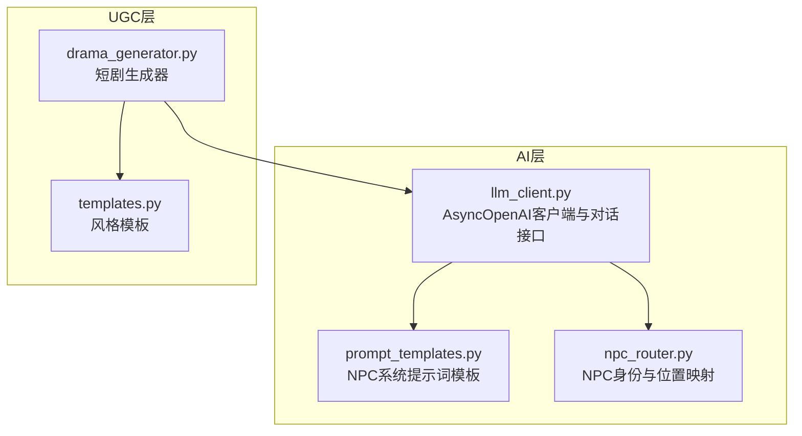
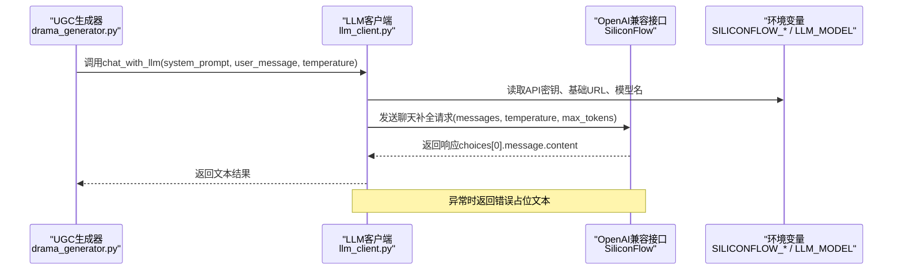
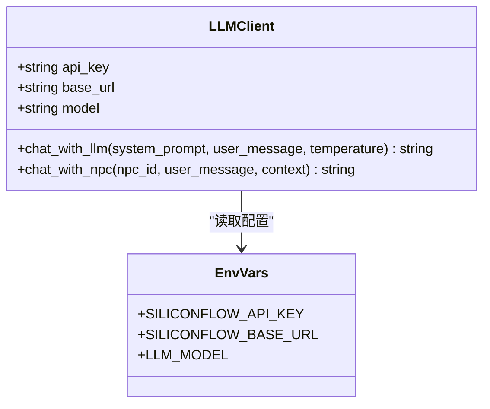
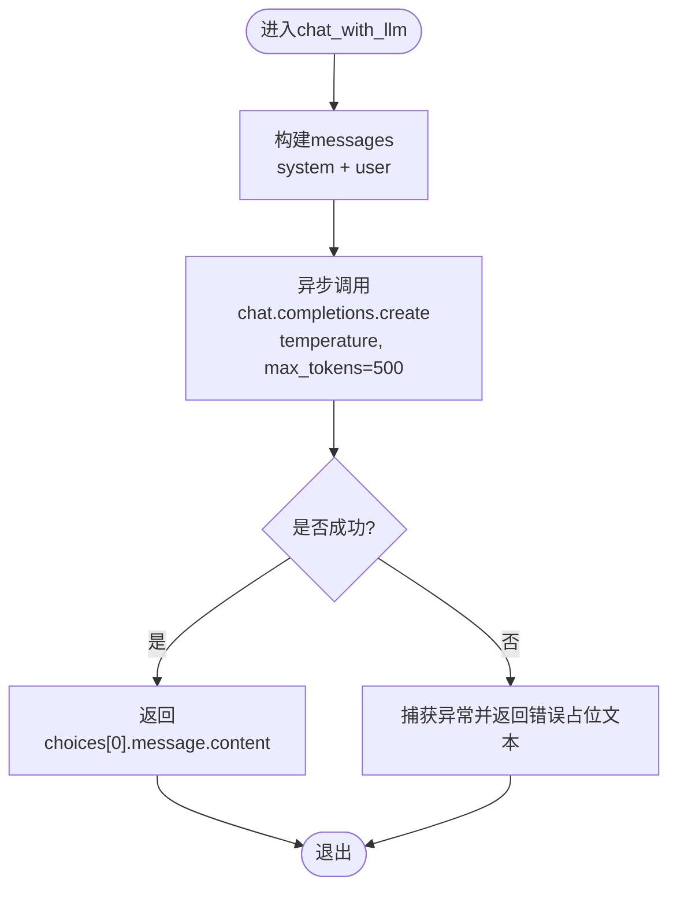
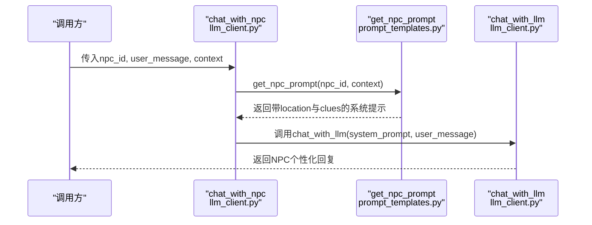
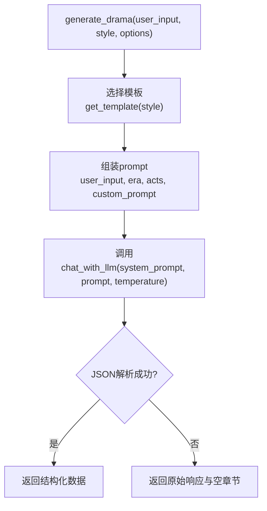
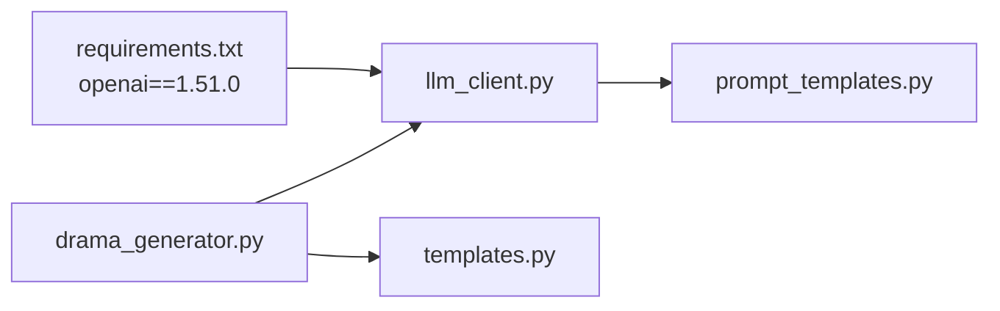

# LLM集成服务

<cite>
**本文引用的文件**   
- [llm_client.py](file://backend/app/ai/llm_client.py)
- [prompt_templates.py](file://backend/app/ai/prompt_templates.py)
- [npc_router.py](file://backend/app/ai/npc_router.py)
- [drama_generator.py](file://backend/app/ugc/drama_generator.py)
- [templates.py](file://backend/app/ugc/templates.py)
- [requirements.txt](file://backend/requirements.txt)
</cite>

## 目录
1. [简介](#简介)
2. [项目结构](#项目结构)
3. [核心组件](#核心组件)
4. [架构总览](#架构总览)
5. [详细组件分析](#详细组件分析)
6. [依赖关系分析](#依赖关系分析)
7. [性能考虑](#性能考虑)
8. [故障排查指南](#故障排查指南)
9. [结论](#结论)
10. [附录：调用示例与最佳实践](#附录调用示例与最佳实践)

## 简介
本技术文档聚焦于DeepSeek LLM客户端的集成方案，基于OpenAI兼容接口通过SiliconFlow网关访问DeepSeek模型。文档涵盖AsyncOpenAI客户端初始化、API密钥与环境变量管理、基础URL配置；详解chat_with_llm函数（系统提示词、用户消息、温度参数、最大令牌限制）与chat_with_npc函数（NPC ID与上下文驱动的个性化回复）的实现逻辑；并给出错误处理机制、重试策略建议与性能优化建议，最后提供完整的调用示例路径以便快速上手。

## 项目结构
LLM相关能力集中在backend/app/ai目录下，配合UGC生成模块使用：
- llm_client.py：封装AsyncOpenAI客户端与对话接口
- prompt_templates.py：NPC系统提示词模板
- npc_router.py：NPC身份与位置映射
- drama_generator.py：UGC短剧生成器，演示如何调用LLM
- templates.py：不同风格的提示词模板

**图表来源** 
- [llm_client.py:1-32](file://backend/app/ai/llm_client.py#L1-L32)
- [prompt_templates.py:1-37](file://backend/app/ai/prompt_templates.py#L1-L37)
- [npc_router.py:1-18](file://backend/app/ai/npc_router.py#L1-L18)
- [drama_generator.py:1-21](file://backend/app/ugc/drama_generator.py#L1-L21)
- [templates.py:1-15](file://backend/app/ugc/templates.py#L1-L15)

**章节来源**
- [llm_client.py:1-32](file://backend/app/ai/llm_client.py#L1-L32)
- [prompt_templates.py:1-37](file://backend/app/ai/prompt_templates.py#L1-L37)
- [npc_router.py:1-18](file://backend/app/ai/npc_router.py#L1-L18)
- [drama_generator.py:1-21](file://backend/app/ugc/drama_generator.py#L1-L21)
- [templates.py:1-15](file://backend/app/ugc/templates.py#L1-L15)

## 核心组件
- AsyncOpenAI客户端初始化与配置
  - 通过环境变量SILICONFLOW_API_KEY设置API密钥
  - 通过环境变量SILICONFLOW_BASE_URL设置基础URL（默认指向SiliconFlow v1端点）
  - 通过环境变量LLM_MODEL指定模型名称（默认deepseek-ai/DeepSeek-V3）
- chat_with_llm函数
  - 接收system_prompt、user_message、temperature（默认0.7）
  - 调用client.chat.completions.create，固定max_tokens=500
  - 返回choices[0].message.content或空字符串
  - 异常捕获并返回友好错误信息
- chat_with_npc函数
  - 根据npc_id从prompt_templates获取系统提示词
  - 将context中的location与clues注入模板
  - 委托给chat_with_llm完成对话

**章节来源**
- [llm_client.py:5-25](file://backend/app/ai/llm_client.py#L5-L25)
- [llm_client.py:28-32](file://backend/app/ai/llm_client.py#L28-L32)
- [prompt_templates.py:32-37](file://backend/app/ai/prompt_templates.py#L32-L37)

## 架构总览
下图展示了从UGC生成到NPC对话的端到端流程，以及LLM客户端与环境变量的交互关系。

**图表来源**
- [llm_client.py:5-25](file://backend/app/ai/llm_client.py#L5-L25)
- [drama_generator.py:12-15](file://backend/app/ugc/drama_generator.py#L12-L15)

## 详细组件分析

### AsyncOpenAI客户端与配置
- 客户端实例化
  - 使用openai.AsyncOpenAI，传入api_key与base_url
  - 默认base_url为https://api.siliconflow.cn/v1
  - MODEL由环境变量LLM_MODEL决定，默认deepseek-ai/DeepSeek-V3
- 环境变量优先级
  - 若未设置SILICONFLOW_API_KEY，则使用占位符sk-placeholder（仅用于开发/测试）
  - 生产环境必须设置有效的API密钥与正确的base_url

**图表来源**
- [llm_client.py:5-9](file://backend/app/ai/llm_client.py#L5-L9)

**章节来源**
- [llm_client.py:5-9](file://backend/app/ai/llm_client.py#L5-L9)

### chat_with_llm函数实现逻辑
- 输入参数
  - system_prompt：系统级指令，定义角色与行为约束
  - user_message：用户消息内容
  - temperature：采样温度，默认0.7，控制创造性与稳定性
- 调用过程
  - 构造messages数组，包含system与user两条消息
  - 设置max_tokens=500限制输出长度
  - 异步调用client.chat.completions.create
- 输出与错误处理
  - 成功：返回response.choices[0].message.content或空字符串
  - 失败：捕获异常并打印错误，返回包含错误信息的占位文本

**图表来源**
- [llm_client.py:12-25](file://backend/app/ai/llm_client.py#L12-L25)

**章节来源**
- [llm_client.py:12-25](file://backend/app/ai/llm_client.py#L12-L25)

### chat_with_npc函数与NPC个性化
- 输入参数
  - npc_id：NPC标识，如mage_temple_keeper等
  - user_message：用户消息
  - context：可选字典，包含location与clues
- 处理流程
  - 从prompt_templates.get_npc_prompt(npc_id, context)获取系统提示词
  - 将location与clues注入模板，形成个性化系统提示
  - 调用chat_with_llm完成对话

**图表来源**
- [llm_client.py:28-32](file://backend/app/ai/llm_client.py#L28-L32)
- [prompt_templates.py:32-37](file://backend/app/ai/prompt_templates.py#L32-L37)

**章节来源**
- [llm_client.py:28-32](file://backend/app/ai/llm_client.py#L28-L32)
- [prompt_templates.py:32-37](file://backend/app/ai/prompt_templates.py#L32-L37)

### UGC短剧生成器示例
- 功能概述
  - 根据用户输入与风格模板生成短剧剧本
  - 支持era与acts等选项，并可追加自定义提示
- 调用方式
  - 选择模板后，组装prompt并调用chat_with_llm
  - 返回JSON解析结果，失败时回退为原始响应

**图表来源**
- [drama_generator.py:5-21](file://backend/app/ugc/drama_generator.py#L5-L21)
- [templates.py:1-15](file://backend/app/ugc/templates.py#L1-L15)

**章节来源**
- [drama_generator.py:5-21](file://backend/app/ugc/drama_generator.py#L5-L21)
- [templates.py:1-15](file://backend/app/ugc/templates.py#L1-L15)

## 依赖关系分析
- 外部依赖
  - openai==1.51.0：提供AsyncOpenAI客户端与chat.completions接口
- 内部依赖
  - llm_client依赖prompt_templates（NPC系统提示词）
  - drama_generator依赖llm_client与templates（风格模板）

**图表来源**
- [requirements.txt:8](file://backend/requirements.txt#L8)
- [llm_client.py:1-32](file://backend/app/ai/llm_client.py#L1-L32)
- [drama_generator.py:1-21](file://backend/app/ugc/drama_generator.py#L1-L21)

**章节来源**
- [requirements.txt:1-17](file://backend/requirements.txt#L1-L17)
- [llm_client.py:1-32](file://backend/app/ai/llm_client.py#L1-L32)
- [drama_generator.py:1-21](file://backend/app/ugc/drama_generator.py#L1-L21)

## 性能考虑
- 连接复用
  - AsyncOpenAI客户端在模块级别单例化，避免重复创建连接开销
- 并发与异步
  - 使用await进行异步调用，适合高并发场景
- 输出长度控制
  - 固定max_tokens=500，防止过长响应导致延迟与成本上升
- 温度参数调优
  - 默认0.7平衡创造性与稳定性；UGC模板中可调整至0.8~0.95以增强创意
- 缓存与批处理
  - 对相同system_prompt与user_message的请求可引入缓存层减少重复调用
- 资源监控
  - 记录调用耗时与错误率，结合日志与指标系统进行监控

[本节为通用指导，不直接分析具体文件]

## 故障排查指南
- 常见问题
  - 未设置SILICONFLOW_API_KEY：客户端会使用占位符，可能导致认证失败
  - SILICONFLOW_BASE_URL不正确：无法连接到SiliconFlow服务
  - LLM_MODEL不存在：模型名称错误或不可用
  - 网络超时或服务不可用：需检查网络与后端状态
- 错误处理现状
  - chat_with_llm捕获异常并返回包含错误信息的占位文本
  - 建议在更高层统一处理错误码与重试策略
- 建议的重试策略
  - 指数退避重试（例如1s、2s、4s），最多重试3次
  - 针对HTTP 429/5xx进行重试，4xx错误不重试
  - 增加熔断器以避免雪崩效应

**章节来源**
- [llm_client.py:23-25](file://backend/app/ai/llm_client.py#L23-L25)

## 结论
本项目通过AsyncOpenAI客户端与SiliconFlow网关实现了DeepSeek模型的稳定接入。chat_with_llm与chat_with_npc提供了简洁易用的对话接口，结合NPC模板与UGC模板，能够灵活生成个性化内容与短剧剧本。当前错误处理较为简单，建议在生产环境中引入重试、熔断与监控机制以提升鲁棒性与可观测性。

[本节为总结性内容，不直接分析具体文件]

## 附录：调用示例与最佳实践
- 初始化与配置
  - 设置环境变量SILICONFLOW_API_KEY、SILICONFLOW_BASE_URL、LLM_MODEL
  - 确保base_url指向SiliconFlow v1端点
- 基本对话调用
  - 调用chat_with_llm(system_prompt, user_message, temperature)
  - 参考路径：[llm_client.py:12-25](file://backend/app/ai/llm_client.py#L12-L25)
- NPC个性化对话
  - 调用chat_with_npc(npc_id, user_message, context)
  - 参考路径：[llm_client.py:28-32](file://backend/app/ai/llm_client.py#L28-L32)
- UGC短剧生成
  - 调用generate_drama(user_input, style, options)
  - 参考路径：[drama_generator.py:5-21](file://backend/app/ugc/drama_generator.py#L5-L21)
- 最佳实践
  - 合理设置temperature与max_tokens以平衡质量与成本
  - 对敏感信息进行脱敏后再发送给LLM
  - 在业务层统一处理错误与重试，提升用户体验

[本节为操作指引，不直接分析具体文件]