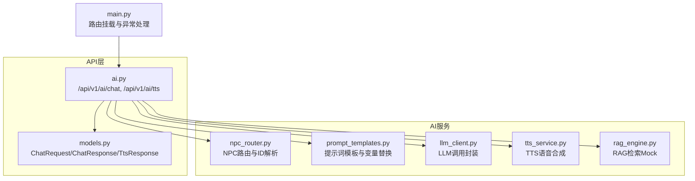
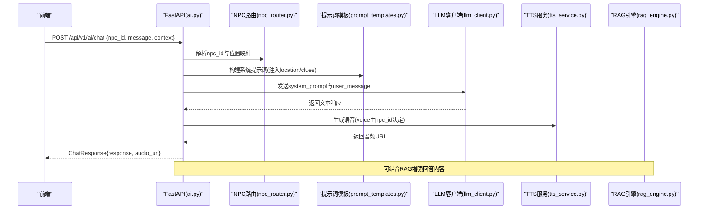
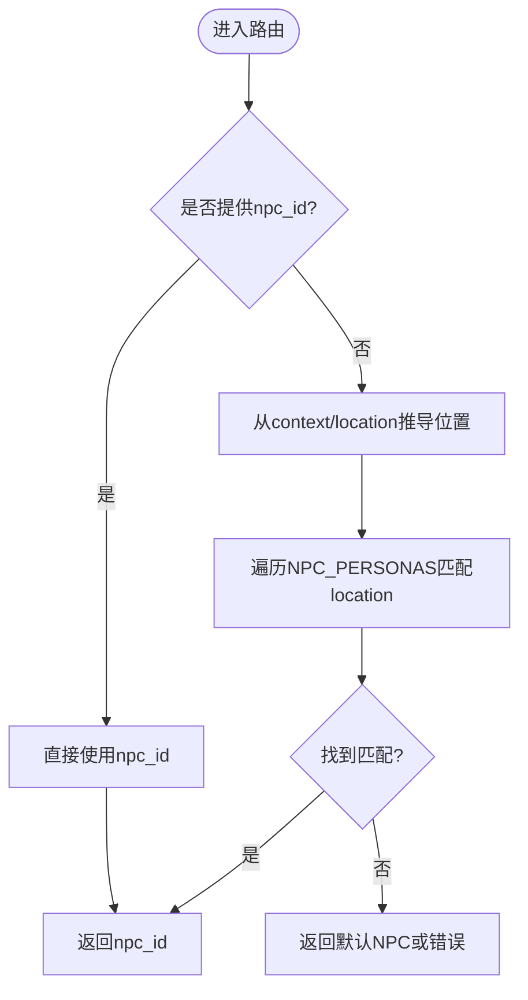
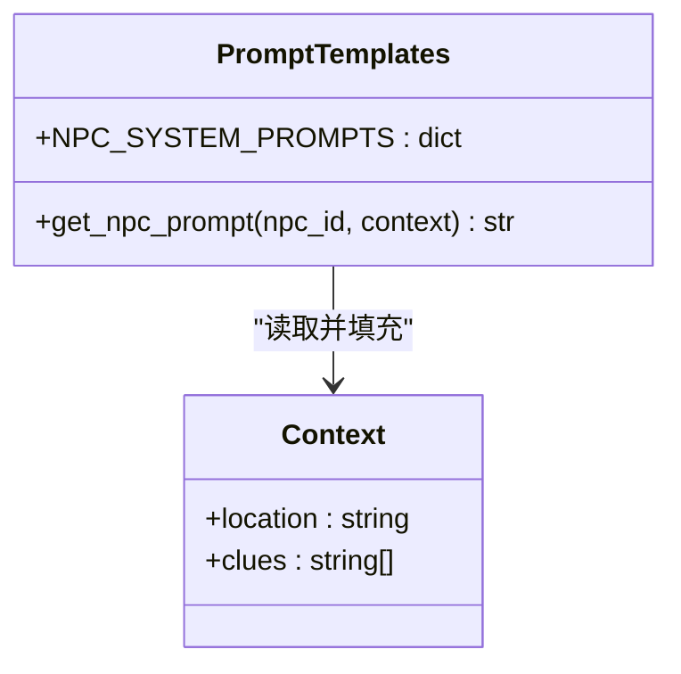
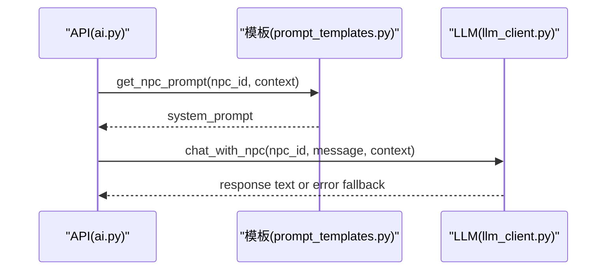
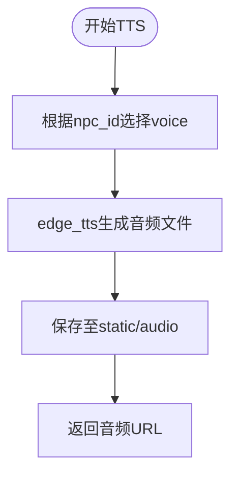
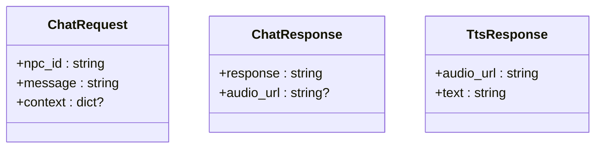
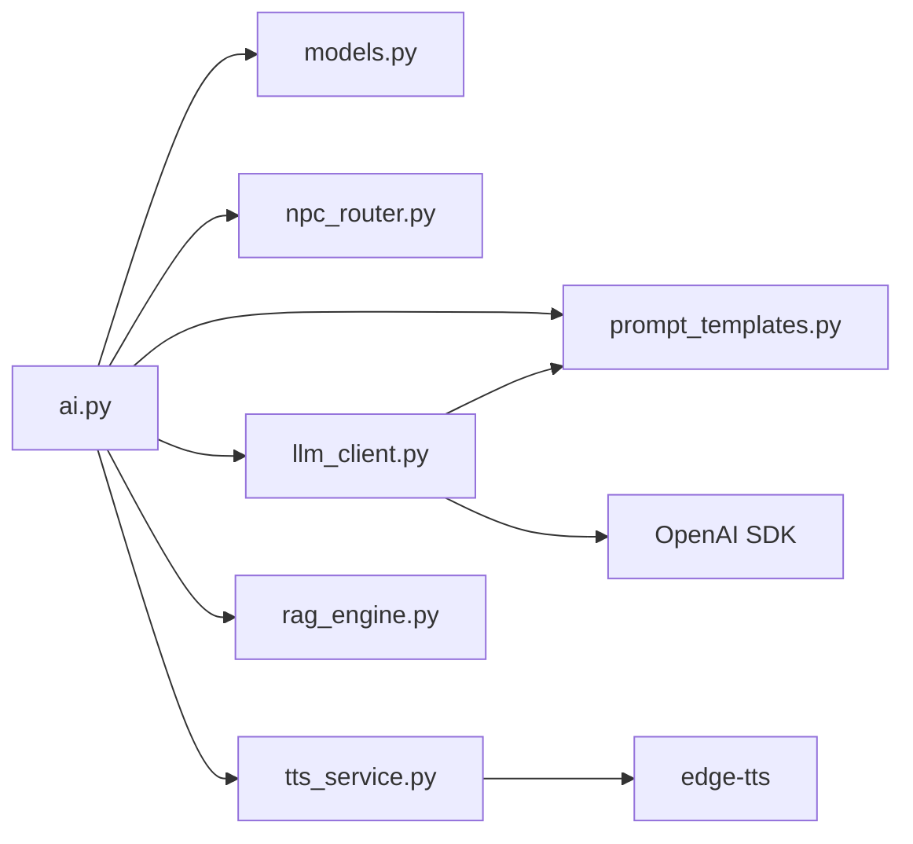

# NPC角色系统

<cite>
**本文引用的文件**   
- [npc_router.py](file://backend/app/ai/npc_router.py)
- [prompt_templates.py](file://backend/app/ai/prompt_templates.py)
- [llm_client.py](file://backend/app/ai/llm_client.py)
- [tts_service.py](file://backend/app/ai/tts_service.py)
- [rag_engine.py](file://backend/app/ai/rag_engine.py)
- [ai.py](file://backend/app/api/ai.py)
- [models.py](file://backend/app/models.py)
- [main.py](file://backend/app/main.py)
</cite>

## 目录
1. [简介](#简介)
2. [项目结构](#项目结构)
3. [核心组件](#核心组件)
4. [架构总览](#架构总览)
5. [详细组件分析](#详细组件分析)
6. [依赖关系分析](#依赖关系分析)
7. [性能考量](#性能考量)
8. [故障排查指南](#故障排查指南)
9. [结论](#结论)
10. [附录：开发指南与示例](#附录开发指南与示例)

## 简介
本技术文档围绕NPC角色系统，系统性阐述以下方面：
- NPC路由机制：角色ID解析、匹配算法与路由分发逻辑
- 提示词模板系统：模板结构定义、变量替换机制与动态内容生成
- NPC性格设定框架：角色背景、说话风格、方言特征与行为模式
- NPC注册流程、模板管理接口与自定义NPC开发指南
- 实际代码示例展示如何创建新NPC角色与定制对话行为

该体系由FastAPI API层、AI服务（LLM/TTS/RAG）、NPC路由与提示词模板等模块组成，形成“请求→路由→模板→模型→语音”的完整链路。

## 项目结构
与NPC系统相关的后端代码主要位于 backend/app/ai 与 backend/app/api 下：
- AI子模块
  - npc_router.py：NPC身份与位置映射、角色ID解析
  - prompt_templates.py：NPC系统提示词模板与变量替换
  - llm_client.py：大模型调用封装（OpenAI兼容）
  - tts_service.py：文本转语音（edge-tts）
  - rag_engine.py：检索增强生成（当前为Mock）
- API层
  - ai.py：暴露 /api/v1/ai/chat 与 /api/v1/ai/tts 接口
  - models.py：ChatRequest/ChatResponse/TtsResponse等数据模型
- 应用入口
  - main.py：挂载路由与全局异常处理

**图表来源** 
- [ai.py:1-29](file://backend/app/api/ai.py#L1-L29)
- [models.py:95-108](file://backend/app/models.py#L95-L108)
- [npc_router.py:1-18](file://backend/app/ai/npc_router.py#L1-L18)
- [prompt_templates.py:1-37](file://backend/app/ai/prompt_templates.py#L1-L37)
- [llm_client.py:1-32](file://backend/app/ai/llm_client.py#L1-L32)
- [tts_service.py:1-25](file://backend/app/ai/tts_service.py#L1-L25)
- [rag_engine.py:1-13](file://backend/app/ai/rag_engine.py#L1-L13)
- [main.py:84-96](file://backend/app/main.py#L84-L96)

**章节来源**
- [ai.py:1-29](file://backend/app/api/ai.py#L1-L29)
- [models.py:95-108](file://backend/app/models.py#L95-L108)
- [main.py:84-96](file://backend/app/main.py#L84-L96)

## 核心组件
- NPC路由与ID解析
  - 通过NPC_PERSONAS字典维护角色ID到名称、位置、语音的映射
  - get_npc_for_location(location)根据场景位置返回对应NPC ID
  - get_npc_info(npc_id)按ID获取NPC元信息
- 提示词模板系统
  - NPC_SYSTEM_PROMPTS定义各角色的系统提示词模板
  - get_npc_prompt(npc_id, context)将location与clues等上下文变量注入模板
- LLM客户端
  - chat_with_llm(system_prompt, user_message, temperature)调用OpenAI兼容接口
  - chat_with_npc(npc_id, user_message, context)组合模板与LLM调用
- TTS服务
  - generate_tts(text, voice)使用edge-tts生成音频并返回静态路径
  - get_voice_for_npc(npc_id)按角色选择语音
- RAG引擎（占位）
  - rag_query(query, location)基于Mock返回历史知识片段

**章节来源**
- [npc_router.py:1-18](file://backend/app/ai/npc_router.py#L1-L18)
- [prompt_templates.py:1-37](file://backend/app/ai/prompt_templates.py#L1-L37)
- [llm_client.py:1-32](file://backend/app/ai/llm_client.py#L1-L32)
- [tts_service.py:1-25](file://backend/app/ai/tts_service.py#L1-L25)
- [rag_engine.py:1-13](file://backend/app/ai/rag_engine.py#L1-L13)

## 架构总览
下图展示了从前端发起对话到生成语音的端到端流程。

**图表来源** 
- [ai.py:15-21](file://backend/app/api/ai.py#L15-L21)
- [npc_router.py:10-17](file://backend/app/ai/npc_router.py#L10-L17)
- [prompt_templates.py:32-36](file://backend/app/ai/prompt_templates.py#L32-L36)
- [llm_client.py:28-31](file://backend/app/ai/llm_client.py#L28-L31)
- [tts_service.py:14-24](file://backend/app/ai/tts_service.py#L14-L24)
- [rag_engine.py:3-12](file://backend/app/ai/rag_engine.py#L3-L12)

## 详细组件分析

### NPC路由机制
- 角色ID解析与匹配
  - NPC_PERSONAS集中管理角色ID、名称、位置与语音
  - get_npc_for_location(location)遍历匹配location字段，返回首个命中ID或None
  - get_npc_info(npc_id)直接按ID取元信息
- 路由分发逻辑
  - API层接收ChatRequest后，优先使用npc_id进行路由；若需按位置推断，则调用get_npc_for_location
  - 未命中时返回默认友好提示（模板兜底）

**图表来源** 
- [npc_router.py:10-17](file://backend/app/ai/npc_router.py#L10-L17)

**章节来源**
- [npc_router.py:1-18](file://backend/app/ai/npc_router.py#L1-L18)

### 提示词模板系统
- 模板结构定义
  - NPC_SYSTEM_PROMPTS以角色ID为键，值为包含角色背景、说话风格、场景与线索占位的字符串模板
- 变量替换机制
  - get_npc_prompt(npc_id, context)从context提取location与clues，使用format填充模板
  - 缺失上下文时提供空值兜底，保证模板始终可渲染
- 动态内容生成
  - 结合RAG结果可在context中注入历史知识片段，增强回答相关性

**图表来源** 
- [prompt_templates.py:3-36](file://backend/app/ai/prompt_templates.py#L3-L36)

**章节来源**
- [prompt_templates.py:1-37](file://backend/app/ai/prompt_templates.py#L1-L37)

### LLM客户端与对话流程
- 调用封装
  - chat_with_llm负责构造messages、设置temperature与max_tokens，并返回文本
  - chat_with_npc组合模板与LLM调用，简化上层调用
- 错误处理
  - 捕获异常并返回带错误信息的降级响应

**图表来源** 
- [llm_client.py:28-31](file://backend/app/ai/llm_client.py#L28-L31)
- [prompt_templates.py:32-36](file://backend/app/ai/prompt_templates.py#L32-L36)

**章节来源**
- [llm_client.py:1-32](file://backend/app/ai/llm_client.py#L1-L32)

### TTS语音合成
- 语音选择
  - VOICE_OPTIONS按npc_id映射到具体语音
  - get_voice_for_npc(npc_id)用于快速查找
- 生成流程
  - generate_tts(text, voice)创建音频文件并返回静态访问路径
  - 音频目录自动创建，确保部署环境可用

**图表来源** 
- [tts_service.py:14-24](file://backend/app/ai/tts_service.py#L14-L24)

**章节来源**
- [tts_service.py:1-25](file://backend/app/ai/tts_service.py#L1-L25)

### RAG检索增强（当前Mock）
- 功能说明
  - rag_query(query, location)基于关键词匹配返回相关历史知识片段
- 扩展建议
  - 后续接入ChromaDB实现向量检索，提升召回质量

**章节来源**
- [rag_engine.py:1-13](file://backend/app/ai/rag_engine.py#L1-L13)

### API接口与数据模型
- 接口定义
  - /api/v1/ai/chat：接收ChatRequest，返回ChatResponse（含可选audio_url）
  - /api/v1/ai/tts：接收text与voice，返回TtsResponse
- 数据模型
  - ChatRequest：npc_id、message、context
  - ChatResponse：response、audio_url
  - TtsResponse：audio_url、text

**图表来源** 
- [models.py:95-108](file://backend/app/models.py#L95-L108)
- [ai.py:15-28](file://backend/app/api/ai.py#L15-L28)

**章节来源**
- [ai.py:1-29](file://backend/app/api/ai.py#L1-L29)
- [models.py:95-108](file://backend/app/models.py#L95-L108)

## 依赖关系分析
- 模块耦合
  - api.ai依赖models、npc_router、prompt_templates、llm_client、tts_service
  - llm_client依赖prompt_templates与OpenAI兼容客户端
  - tts_service独立，仅依赖文件系统与edge_tts
- 外部依赖
  - OpenAI兼容SDK（SiliconFlow）
  - edge-tts（本地音频生成）
  - ChromaDB（预留，当前Mock）

**图表来源** 
- [ai.py:1-29](file://backend/app/api/ai.py#L1-L29)
- [llm_client.py:1-32](file://backend/app/ai/llm_client.py#L1-L32)
- [tts_service.py:1-25](file://backend/app/ai/tts_service.py#L1-L25)
- [rag_engine.py:1-13](file://backend/app/ai/rag_engine.py#L1-L13)

**章节来源**
- [ai.py:1-29](file://backend/app/api/ai.py#L1-L29)
- [llm_client.py:1-32](file://backend/app/ai/llm_client.py#L1-L32)
- [tts_service.py:1-25](file://backend/app/ai/tts_service.py#L1-L25)
- [rag_engine.py:1-13](file://backend/app/ai/rag_engine.py#L1-L13)

## 性能考量
- LLM调用
  - 合理设置temperature与max_tokens，避免过长响应导致延迟
  - 对频繁请求考虑缓存常见问答或结果
- TTS生成
  - 音频文件落盘带来I/O开销，建议异步生成与CDN缓存
  - 复用相同文本的音频以减少重复生成
- RAG检索
  - Mock实现简单匹配，未来引入向量检索时需关注索引构建与查询延迟
- 并发与幂等
  - 当前AI接口无幂等设计，如需重试保障可增加request_id校验与去重

[本节为通用指导，不直接分析具体文件]

## 故障排查指南
- LLM调用失败
  - 检查环境变量SILICONFLOW_API_KEY与SILICONFLOW_BASE_URL配置
  - 查看chat_with_llm中的异常打印与降级返回
- TTS生成失败
  - 确认static/audio目录存在且可写
  - 检查edge_tts安装与网络连通性
- 模板渲染异常
  - 确保context中包含location与clues字段，避免format报错
- 路由未命中
  - 核对NPC_PERSONAS中的location与传入位置一致
  - 未命中时将回退到默认提示

**章节来源**
- [llm_client.py:23-25](file://backend/app/ai/llm_client.py#L23-L25)
- [tts_service.py:14-20](file://backend/app/ai/tts_service.py#L14-L20)
- [prompt_templates.py:32-36](file://backend/app/ai/prompt_templates.py#L32-L36)
- [npc_router.py:10-17](file://backend/app/ai/npc_router.py#L10-L17)

## 结论
NPC角色系统以清晰的分层与模块化设计实现了“路由→模板→模型→语音”的完整链路。当前版本已具备基础能力，后续可通过RAG增强、缓存优化与幂等设计进一步提升体验与稳定性。开发者可按本文档指南快速扩展新NPC与对话行为。

[本节为总结，不直接分析具体文件]

## 附录：开发指南与示例

### NPC角色注册流程
- 在NPC_PERSONAS中添加新角色ID、名称、位置与语音映射
- 在NPC_SYSTEM_PROMPTS中为新角色编写系统提示词模板，包含背景、风格与占位符
- 如需要，更新VOICE_OPTIONS以绑定专属语音
- 验证get_npc_for_location与get_npc_info能正确解析与返回

**章节来源**
- [npc_router.py:2-8](file://backend/app/ai/npc_router.py#L2-L8)
- [prompt_templates.py:3-29](file://backend/app/ai/prompt_templates.py#L3-L29)
- [tts_service.py:4-10](file://backend/app/ai/tts_service.py#L4-L10)

### 模板管理接口
- 使用get_npc_prompt(npc_id, context)动态生成系统提示词
- 在context中注入location与clues，必要时加入RAG检索结果
- 保持模板简洁明确，控制输出长度与风格一致性

**章节来源**
- [prompt_templates.py:32-36](file://backend/app/ai/prompt_templates.py#L32-L36)

### 自定义NPC开发指南
- 新增NPC
  - 在npc_router.py的NPC_PERSONAS添加条目
  - 在prompt_templates.py的NPC_SYSTEM_PROMPTS编写模板
  - 在tts_service.py的VOICE_OPTIONS绑定语音
- 集成对话
  - 通过ai.py的/chat接口调用chat_with_npc
  - 前端传递npc_id、message与context（location、clues）
- 测试与验证
  - 使用curl或前端调试工具验证响应内容与音频URL
  - 检查日志与异常处理分支

**章节来源**
- [npc_router.py:10-17](file://backend/app/ai/npc_router.py#L10-L17)
- [prompt_templates.py:32-36](file://backend/app/ai/prompt_templates.py#L32-L36)
- [llm_client.py:28-31](file://backend/app/ai/llm_client.py#L28-L31)
- [tts_service.py:14-24](file://backend/app/ai/tts_service.py#L14-L24)
- [ai.py:15-21](file://backend/app/api/ai.py#L15-L21)

### 实际代码示例（路径引用）
- 创建新NPC角色
  - 参考：[npc_router.py:2-8](file://backend/app/ai/npc_router.py#L2-L8)、[prompt_templates.py:3-29](file://backend/app/ai/prompt_templates.py#L3-L29)、[tts_service.py:4-10](file://backend/app/ai/tts_service.py#L4-L10)
- 定制对话行为
  - 参考：[llm_client.py:28-31](file://backend/app/ai/llm_client.py#L28-L31)、[prompt_templates.py:32-36](file://backend/app/ai/prompt_templates.py#L32-L36)
- 调用AI对话接口
  - 参考：[ai.py:15-21](file://backend/app/api/ai.py#L15-L21)、[models.py:95-108](file://backend/app/models.py#L95-L108)