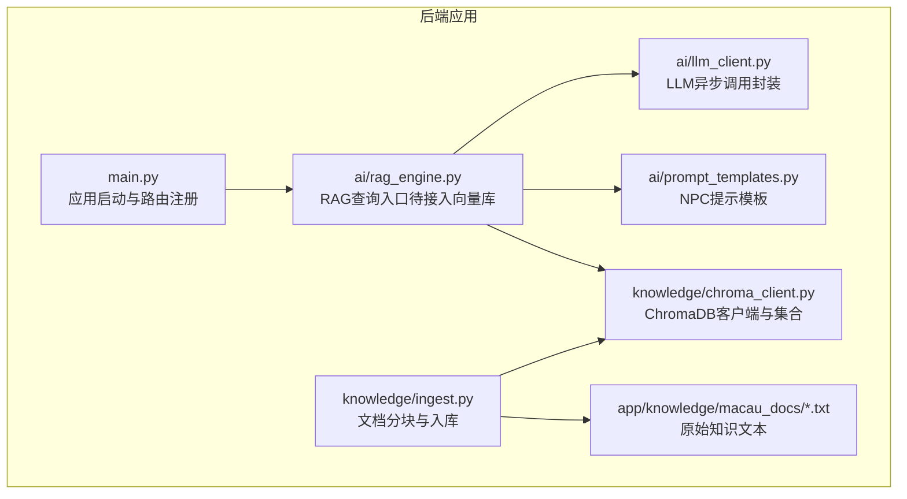
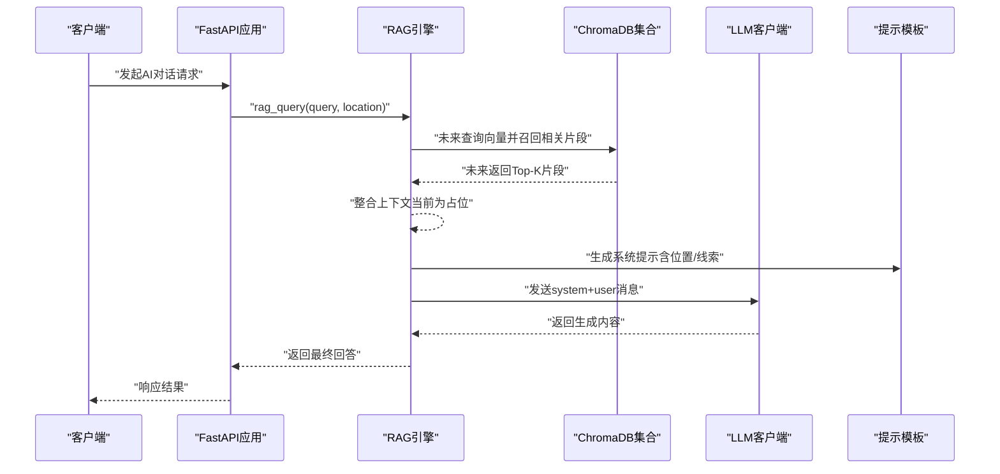
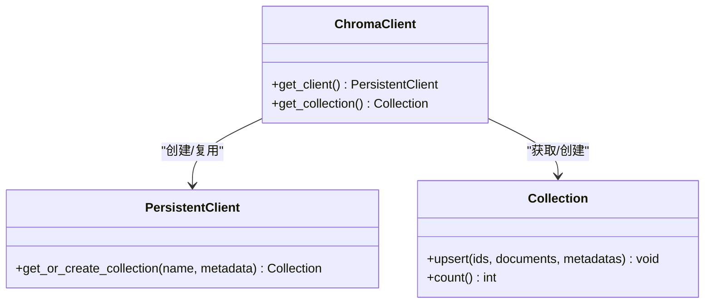
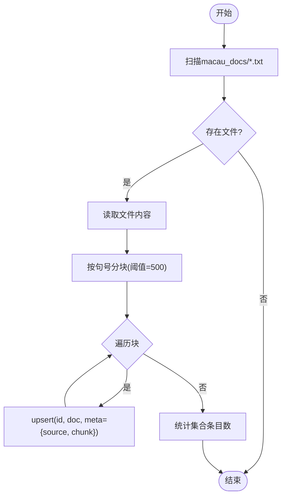
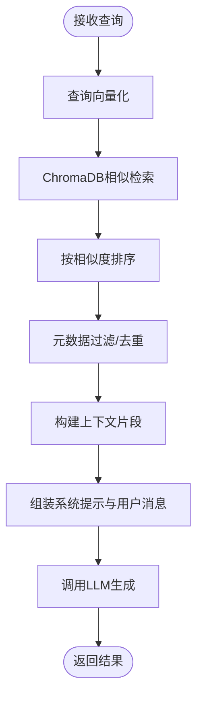
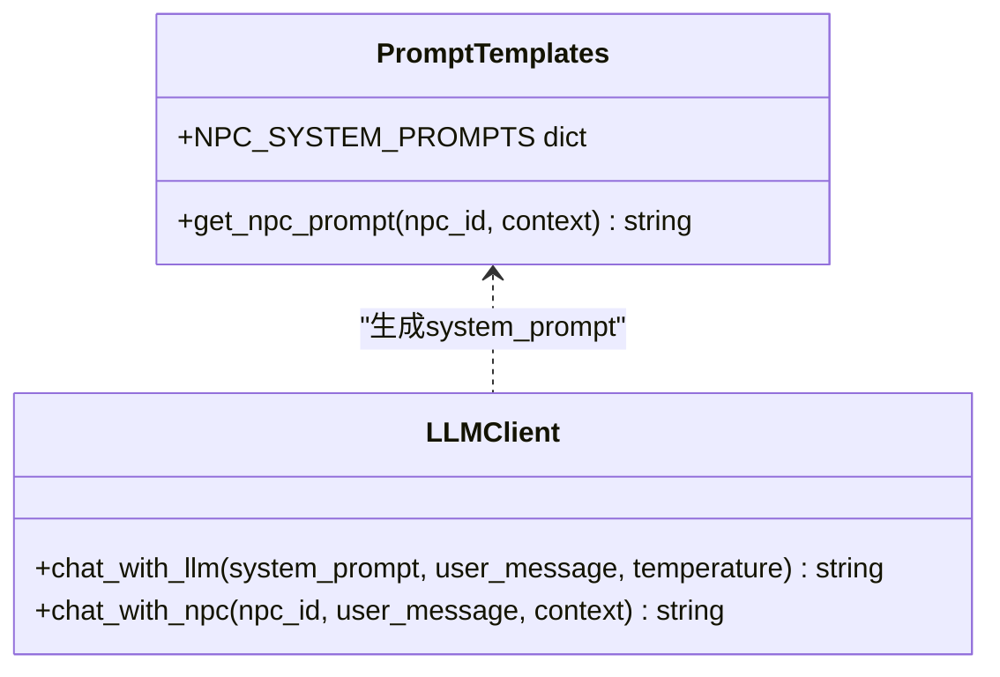
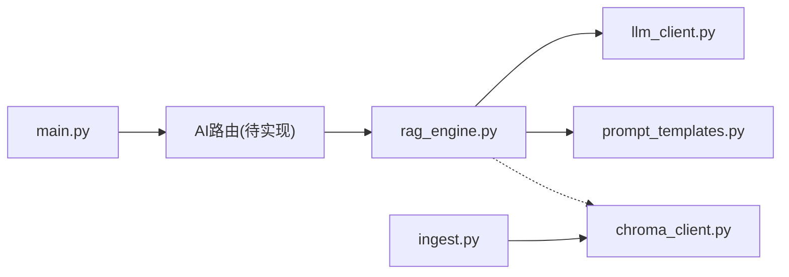

# RAG知识库系统

<cite>
**本文引用的文件**   
- [chroma_client.py](file://backend/app/knowledge/chroma_client.py)
- [ingest.py](file://backend/app/knowledge/ingest.py)
- [rag_engine.py](file://backend/app/ai/rag_engine.py)
- [llm_client.py](file://backend/app/ai/llm_client.py)
- [prompt_templates.py](file://backend/app/ai/prompt_templates.py)
- [main.py](file://backend/app/main.py)
- [requirements.txt](file://backend/requirements.txt)
- [a_ma_temple.txt](file://backend/app/knowledge/macau_docs/a_ma_temple.txt)
</cite>

## 目录
1. [简介](#简介)
2. [项目结构](#项目结构)
3. [核心组件](#核心组件)
4. [架构总览](#架构总览)
5. [详细组件分析](#详细组件分析)
6. [依赖关系分析](#依赖关系分析)
7. [性能考虑](#性能考虑)
8. [故障排查指南](#故障排查指南)
9. [结论](#结论)
10. [附录：代码示例与使用指引](#附录代码示例与使用指引)

## 简介
本技术文档面向RAG（检索增强生成）知识库系统，聚焦于向量数据库集成、文档嵌入与分块、语义搜索实现、上下文构建与提示词增强，以及知识库维护与监控。当前仓库实现了ChromaDB本地持久化客户端与集合管理、基于中文句号切分的文本分块与入库流程、以及一个待接入向量检索的RAG引擎骨架；同时提供LLM调用与NPC人设提示模板，便于后续将检索结果融入对话生成。

## 项目结构
RAG相关代码主要位于后端模块：
- knowledge：ChromaDB客户端与知识入库脚本
- ai：RAG引擎、LLM客户端、提示模板
- api：FastAPI路由挂载（RAG尚未暴露独立API）
- 资源：macau_docs下的澳门历史文本样例

图表来源
- [main.py:17-96](file://backend/app/main.py#L17-L96)
- [rag_engine.py:1-13](file://backend/app/ai/rag_engine.py#L1-L13)
- [llm_client.py:1-32](file://backend/app/ai/llm_client.py#L1-L32)
- [prompt_templates.py:1-37](file://backend/app/ai/prompt_templates.py#L1-L37)
- [chroma_client.py:1-19](file://backend/app/knowledge/chroma_client.py#L1-L19)
- [ingest.py:1-36](file://backend/app/knowledge/ingest.py#L1-L36)

章节来源
- [main.py:17-96](file://backend/app/main.py#L17-L96)
- [requirements.txt:1-17](file://backend/requirements.txt#L1-L17)

## 核心组件
- ChromaDB客户端与集合管理：单例式全局缓存，懒加载创建持久化客户端与集合“macau_history”，附带描述性元数据。
- 文档入库与分块：按中文句号进行句子级拼接，达到阈值后切分为块，逐块upsert到集合，附带来源文件名与块序号元数据。
- RAG引擎：当前为占位实现，返回预置答案或默认提示；预留接入ChromaDB的扩展点。
- LLM客户端：通过OpenAI兼容接口调用DeepSeek模型，支持温度与最大token控制，异常回退友好。
- 提示模板：定义多类NPC人设的系统提示，支持动态注入场景与线索信息。

章节来源
- [chroma_client.py:1-19](file://backend/app/knowledge/chroma_client.py#L1-L19)
- [ingest.py:1-36](file://backend/app/knowledge/ingest.py#L1-L36)
- [rag_engine.py:1-13](file://backend/app/ai/rag_engine.py#L1-L13)
- [llm_client.py:1-32](file://backend/app/ai/llm_client.py#L1-L32)
- [prompt_templates.py:1-37](file://backend/app/ai/prompt_templates.py#L1-L37)

## 架构总览
下图展示从用户请求到RAG检索与LLM生成的端到端流程（概念图）。当前阶段RAG检索为占位逻辑，实际检索将在完成向量化与相似度计算后替换。

[该图为概念流程图，不直接映射具体源码，故无图表来源]

## 详细组件分析

### ChromaDB客户端与集合管理
- 设计要点
  - 全局单例：避免重复初始化客户端与集合，提升性能与一致性。
  - 持久化存储：使用本地路径作为向量库存储，便于开发与演示。
  - 集合命名与元数据：固定集合名“macau_history”，附带描述性元数据便于识别。
- 关键行为
  - get_client：首次调用时创建PersistentClient，后续复用。
  - get_collection：首次调用时获取或创建集合，后续复用。

图表来源
- [chroma_client.py:1-19](file://backend/app/knowledge/chroma_client.py#L1-L19)

章节来源
- [chroma_client.py:1-19](file://backend/app/knowledge/chroma_client.py#L1-L19)

### 文档入库与分块算法
- 分块策略
  - 以中文句号“。”为边界进行句子切分，逐步拼接直到超过chunk_size阈值，再输出一个块。
  - 每个块保留完整句读，减少语义割裂。
- 入库流程
  - 遍历macau_docs下所有.txt文件，读取全文。
  - 对每份文本执行分块，逐块upsert到集合，元数据包含source与chunk序号。
  - 统计并打印总块数与集合条目数。

图表来源
- [ingest.py:1-36](file://backend/app/knowledge/ingest.py#L1-L36)

章节来源
- [ingest.py:1-36](file://backend/app/knowledge/ingest.py#L1-L36)
- [a_ma_temple.txt:1-7](file://backend/app/knowledge/macau_docs/a_ma_temple.txt#L1-L7)

### RAG引擎与语义搜索
- 现状
  - rag_query为占位实现，根据query或location关键字匹配预设答案，未接入ChromaDB。
- 目标实现
  - 查询向量化：将自然语言查询转换为向量（需引入Embedding模型）。
  - 相似度检索：在ChromaDB中执行相似性搜索，返回Top-K相关片段。
  - 结果排序：按相似度分数降序排列，结合元数据进行去重与过滤。
  - 上下文构建：将Top-K片段拼接为上下文，注入提示模板。
  - 生成回答：调用LLM生成最终回复。

图表来源
- [rag_engine.py:1-13](file://backend/app/ai/rag_engine.py#L1-L13)

章节来源
- [rag_engine.py:1-13](file://backend/app/ai/rag_engine.py#L1-L13)

### 上下文构建与提示词增强
- NPC提示模板
  - 定义多个人设（如妈阁庙看庙老伯、亚婆井前地阿婆等），统一格式包含角色设定、说话风格、当前场景与玩家线索。
  - 提供get_npc_prompt函数，按npc_id与上下文动态填充变量。
- 上下文来源
  - 当前RAG未产出上下文，后续应将检索到的相关片段作为clues注入模板。

图表来源
- [prompt_templates.py:1-37](file://backend/app/ai/prompt_templates.py#L1-L37)
- [llm_client.py:1-32](file://backend/app/ai/llm_client.py#L1-L32)

章节来源
- [prompt_templates.py:1-37](file://backend/app/ai/prompt_templates.py#L1-L37)
- [llm_client.py:1-32](file://backend/app/ai/llm_client.py#L1-L32)

### LLM客户端与错误处理
- 功能
  - 通过AsyncOpenAI客户端调用DeepSeek模型，支持temperature与max_tokens参数。
  - 异常捕获并返回友好错误信息，保证服务可用性。
- 扩展点
  - 可配置base_url与api_key，适配不同供应商或代理。

章节来源
- [llm_client.py:1-32](file://backend/app/ai/llm_client.py#L1-L32)

## 依赖关系分析
- 运行时依赖
  - FastAPI、Uvicorn用于Web服务与ASGI运行。
  - OpenAI SDK用于LLM调用。
  - ChromaDB用于向量检索。
  - Pydantic、httpx等辅助库。
- 模块耦合
  - main.py负责路由挂载，暂未挂载RAG相关API。
  - rag_engine.py目前未导入chroma_client，处于解耦状态，便于后续接入。
  - ingest.py依赖chroma_client进行集合操作。

图表来源
- [main.py:84-96](file://backend/app/main.py#L84-L96)
- [rag_engine.py:1-13](file://backend/app/ai/rag_engine.py#L1-L13)
- [llm_client.py:1-32](file://backend/app/ai/llm_client.py#L1-L32)
- [prompt_templates.py:1-37](file://backend/app/ai/prompt_templates.py#L1-L37)
- [chroma_client.py:1-19](file://backend/app/knowledge/chroma_client.py#L1-L19)
- [ingest.py:1-36](file://backend/app/knowledge/ingest.py#L1-L36)

章节来源
- [main.py:84-96](file://backend/app/main.py#L84-L96)
- [requirements.txt:1-17](file://backend/requirements.txt#L1-L17)

## 性能考虑
- 向量检索
  - 建议启用合适的索引策略（如HNSW），根据数据规模调整ef_construction与M参数。
  - 批量upsert可减少网络往返，提高入库吞吐。
- 分块大小
  - 当前chunk_size=500，适合中文长段落；可根据下游模型上下文窗口与检索精度调优。
- LLM调用
  - 合理设置temperature与max_tokens，平衡创造性与成本。
  - 连接池与重试机制可降低失败率。
- 内存与并发
  - 单例客户端避免重复初始化开销；在高并发场景下注意线程安全与连接限制。

[本节为通用指导，不直接分析具体文件]

## 故障排查指南
- ChromaDB连接问题
  - 检查本地路径./chroma_db是否可写，权限是否正确。
  - 确认集合名称一致，避免重复创建导致冲突。
- 入库失败
  - 确认macau_docs目录存在且包含.txt文件。
  - 检查编码是否为UTF-8，避免读取异常。
- RAG检索为空
  - 当前为占位实现，需先完成向量化与相似度检索接入。
  - 验证集合条目数大于0，确保已执行过ingest_documents。
- LLM调用失败
  - 检查环境变量SILICONFLOW_API_KEY与BASE_URL配置。
  - 查看异常日志，定位网络或鉴权问题。

章节来源
- [chroma_client.py:1-19](file://backend/app/knowledge/chroma_client.py#L1-L19)
- [ingest.py:1-36](file://backend/app/knowledge/ingest.py#L1-L36)
- [llm_client.py:1-32](file://backend/app/ai/llm_client.py#L1-L32)

## 结论
当前RAG知识库系统已完成ChromaDB客户端与集合管理、中文文本分块与入库流程，以及LLM调用与提示模板框架。RAG检索部分仍为占位实现，下一步应重点完成查询向量化、相似度检索与上下文构建，使检索结果真正驱动LLM生成高质量回答。通过合理的分块策略、索引优化与监控手段，可进一步提升检索精度与系统稳定性。

[本节为总结性内容，不直接分析具体文件]

## 附录：代码示例与使用指引
- 初始化ChromaDB与集合
  - 参考：[chroma_client.py:7-18](file://backend/app/knowledge/chroma_client.py#L7-L18)
- 执行文档入库
  - 参考：[ingest.py:17-32](file://backend/app/knowledge/ingest.py#L17-L32)
- 调用RAG查询（当前为占位）
  - 参考：[rag_engine.py:3-12](file://backend/app/ai/rag_engine.py#L3-L12)
- 生成NPC对话
  - 参考：[llm_client.py:28-31](file://backend/app/ai/llm_client.py#L28-L31)、[prompt_templates.py:32-36](file://backend/app/ai/prompt_templates.py#L32-L36)

[本节提供文件路径引用，不包含具体代码内容]