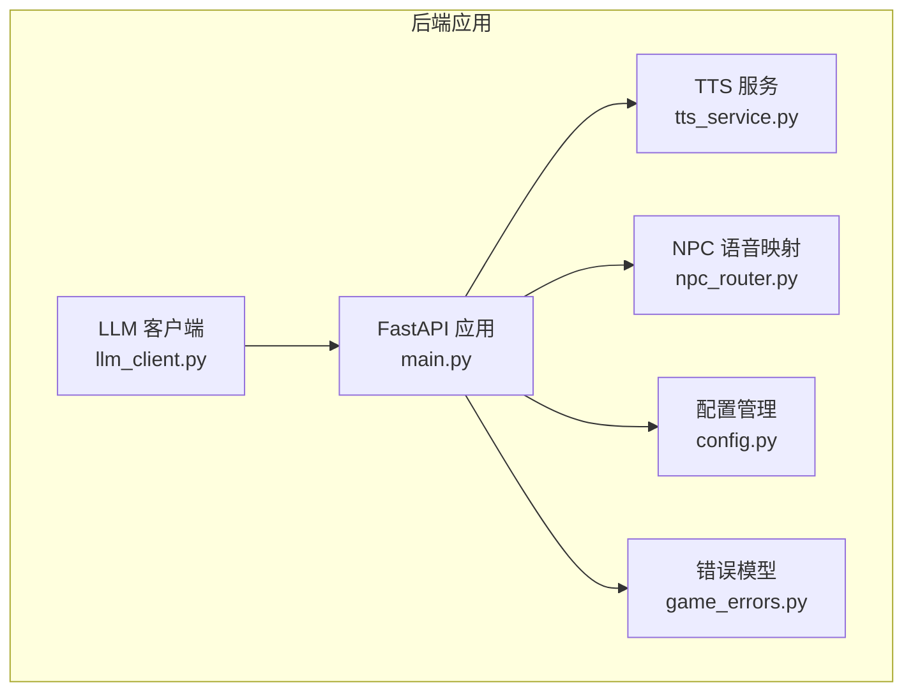
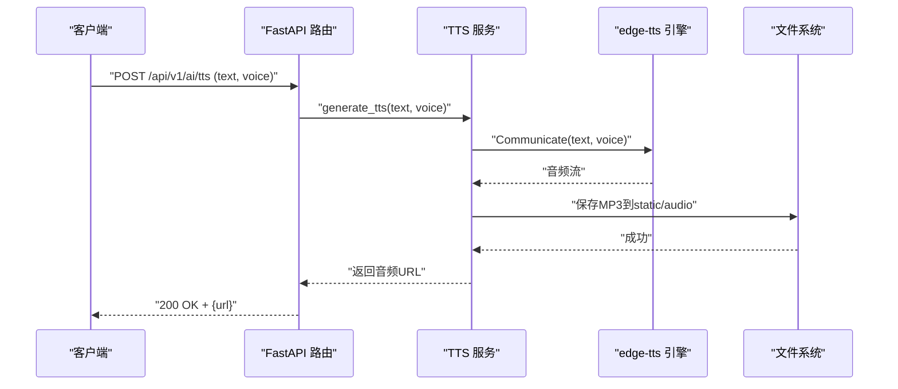
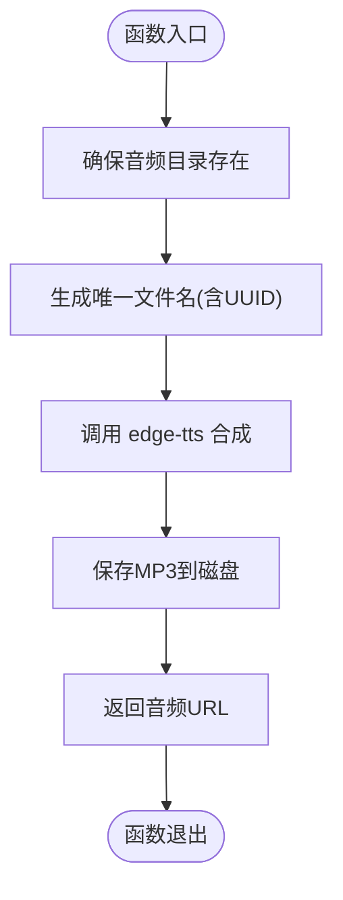
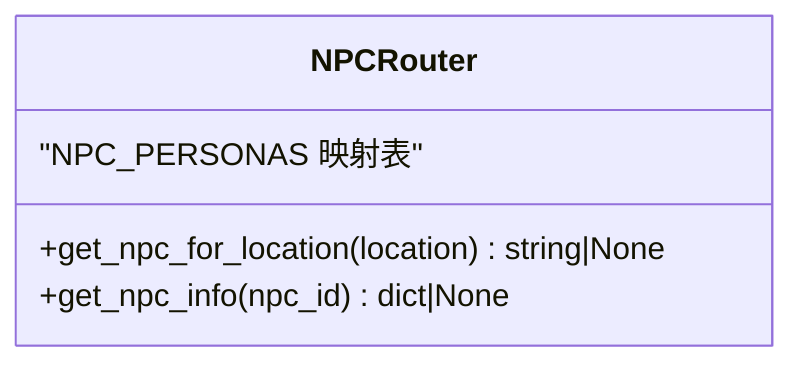
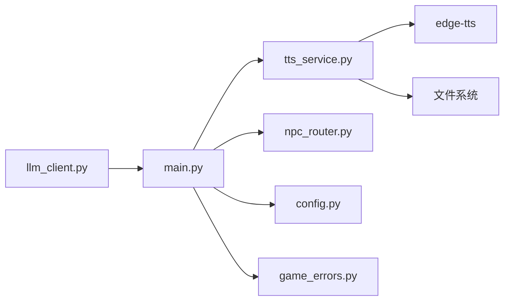

# TTS语音合成服务

<cite>
**本文引用的文件**   
- [tts_service.py](file://backend/app/ai/tts_service.py)
- [npc_router.py](file://backend/app/ai/npc_router.py)
- [main.py](file://backend/app/main.py)
- [config.py](file://backend/app/config.py)
- [game_errors.py](file://backend/app/game_errors.py)
- [llm_client.py](file://backend/app/ai/llm_client.py)
</cite>

## 目录
1. [简介](#简介)
2. [项目结构](#项目结构)
3. [核心组件](#核心组件)
4. [架构总览](#架构总览)
5. [详细组件分析](#详细组件分析)
6. [依赖关系分析](#依赖关系分析)
7. [性能考虑](#性能考虑)
8. [故障排查指南](#故障排查指南)
9. [结论](#结论)
10. [附录：API接口与使用示例](#附录api接口与使用示例)

## 简介
本技术文档围绕TTS（文本转语音）语音合成服务，系统阐述其配置选项、音频处理流程、缓存策略设计、错误处理机制，以及面向批量合成与实时播放的API使用方式。当前实现基于edge-tts进行云端语音合成，提供NPC角色到语音模型的映射，并将生成的音频以MP3格式持久化至静态目录，供前端通过HTTP访问。

## 项目结构
TTS相关代码位于后端AI模块中，主要包含：
- 语音合成服务：封装edge-tts调用、音频保存与路径返回
- NPC语音映射：将NPC标识映射到具体语音模型
- 应用入口与路由注册：统一挂载API路由并配置全局异常处理
- 配置管理：集中读取环境变量与默认值
- 错误模型：统一的业务异常定义

图表来源
- [main.py:17-111](file://backend/app/main.py#L17-L111)
- [tts_service.py:1-25](file://backend/app/ai/tts_service.py#L1-L25)
- [npc_router.py:1-18](file://backend/app/ai/npc_router.py#L1-L18)
- [config.py:1-77](file://backend/app/config.py#L1-L77)
- [game_errors.py:1-20](file://backend/app/game_errors.py#L1-L20)
- [llm_client.py:1-32](file://backend/app/ai/llm_client.py#L1-L32)

章节来源
- [main.py:17-111](file://backend/app/main.py#L17-L111)
- [tts_service.py:1-25](file://backend/app/ai/tts_service.py#L1-L25)
- [npc_router.py:1-18](file://backend/app/ai/npc_router.py#L1-L18)
- [config.py:1-77](file://backend/app/config.py#L1-L77)
- [game_errors.py:1-20](file://backend/app/game_errors.py#L1-L20)
- [llm_client.py:1-32](file://backend/app/ai/llm_client.py#L1-L32)

## 核心组件
- TTS 服务
  - 功能：接收文本与语音模型，调用edge-tts生成MP3音频，保存到静态目录，返回可访问URL
  - 关键能力：异步合成、随机文件名避免冲突、自动创建输出目录
- NPC 语音映射
  - 功能：根据NPC ID或位置信息选择对应语音模型，保证角色音色一致性
- 应用入口
  - 功能：注册路由、配置CORS、统一异常处理与健康检查
- 配置管理
  - 功能：集中读取环境变量，提供默认值与校验
- 错误模型
  - 功能：统一业务异常结构与响应格式

章节来源
- [tts_service.py:14-24](file://backend/app/ai/tts_service.py#L14-L24)
- [npc_router.py:10-17](file://backend/app/ai/npc_router.py#L10-L17)
- [main.py:17-111](file://backend/app/main.py#L17-L111)
- [config.py:38-77](file://backend/app/config.py#L38-L77)
- [game_errors.py:7-20](file://backend/app/game_errors.py#L7-L20)

## 架构总览
TTS服务在FastAPI应用中作为AI子模块被集成。典型调用链为：前端请求进入FastAPI路由，路由调用TTS服务完成文本到音频的合成，返回音频URL；前端可直接播放或通过流式传输播放。

图表来源
- [main.py:84-96](file://backend/app/main.py#L84-L96)
- [tts_service.py:14-20](file://backend/app/ai/tts_service.py#L14-L20)

## 详细组件分析

### TTS 服务组件
- 输入参数
  - text: 待合成的文本
  - voice: 语音模型标识（如“zh-CN-XiaoxiaoNeural”等）
- 处理流程
  - 确保输出目录存在
  - 生成唯一文件名（前缀+UUID片段），后缀固定为mp3
  - 调用edge-tts异步合成并保存
  - 返回相对URL路径
- 复杂度与性能
  - 时间复杂度：O(n)，n为文本长度（受edge-tts内部实现影响）
  - 空间复杂度：O(m)，m为生成音频大小（磁盘IO为主）
- 优化建议
  - 引入文本哈希与缓存键，命中则直接返回已存在音频URL
  - 增加并发控制与队列，避免瞬时高并发导致边缘服务限流
  - 对长文本进行分段合成与拼接，降低单次请求延迟

图表来源
- [tts_service.py:14-20](file://backend/app/ai/tts_service.py#L14-L20)

章节来源
- [tts_service.py:14-20](file://backend/app/ai/tts_service.py#L14-L20)

### NPC 语音映射组件
- 功能说明
  - 根据NPC ID或位置信息返回对应的语音模型，确保角色音色一致
- 数据结构
  - NPC_PERSONAS：维护NPC标识、名称、位置与语音模型映射
- 使用场景
  - 在对话生成后，根据NPC定位选择语音模型进行TTS合成

图表来源
- [npc_router.py:2-17](file://backend/app/ai/npc_router.py#L2-L17)

章节来源
- [npc_router.py:10-17](file://backend/app/ai/npc_router.py#L10-L17)

### 应用入口与路由注册
- 功能说明
  - 创建FastAPI应用实例，注册各子路由（游戏、AI、UGC、管理员、认证等）
  - 配置CORS中间件，允许跨域请求
  - 注册全局异常处理器，统一错误响应格式
- 健康检查
  - 提供健康检查端点，检测数据库可用性

章节来源
- [main.py:17-111](file://backend/app/main.py#L17-L111)

### 配置管理
- 功能说明
  - 集中读取环境变量，提供默认值与类型校验
  - 支持数据库连接、CORS源、演示数据开关、令牌有效期等配置项
- 扩展建议
  - 新增TTS相关配置项（如超时、重试次数、缓存开关、最大并发等）

章节来源
- [config.py:38-77](file://backend/app/config.py#L38-L77)

### 错误模型
- 功能说明
  - 定义统一的业务异常结构，包含状态码、错误码、消息与详情
- 使用场景
  - 在TTS服务或上游路由中抛出GameError，由FastAPI统一捕获并返回标准化JSON

章节来源
- [game_errors.py:7-20](file://backend/app/game_errors.py#L7-L20)

## 依赖关系分析
- 外部依赖
  - edge-tts：用于云端语音合成
- 内部依赖
  - FastAPI路由与中间件
  - 文件系统（静态音频目录）
  - 可选：LLM客户端（用于对话生成，非TTS必需）

图表来源
- [main.py:84-96](file://backend/app/main.py#L84-L96)
- [tts_service.py:1-2](file://backend/app/ai/tts_service.py#L1-L2)
- [config.py:1-10](file://backend/app/config.py#L1-L10)
- [game_errors.py:1-5](file://backend/app/game_errors.py#L1-L5)
- [llm_client.py:1-8](file://backend/app/ai/llm_client.py#L1-L8)

章节来源
- [main.py:84-96](file://backend/app/main.py#L84-L96)
- [tts_service.py:1-2](file://backend/app/ai/tts_service.py#L1-L2)
- [config.py:1-10](file://backend/app/config.py#L1-L10)
- [game_errors.py:1-5](file://backend/app/game_errors.py#L1-L5)
- [llm_client.py:1-8](file://backend/app/ai/llm_client.py#L1-L8)

## 性能考虑
- 合成延迟
  - 网络往返与边缘服务处理是主要瓶颈，建议增加超时与重试策略
- 并发与限流
  - 在高并发场景下，需限制并发数与请求速率，避免触发边缘服务限流
- 缓存命中率
  - 通过文本哈希与缓存键提升命中率，减少重复合成
- 存储与I/O
  - 合理设置静态目录权限与磁盘容量监控，避免写满导致失败

[本节为通用指导，不直接分析具体文件]

## 故障排查指南
- 常见问题
  - 网络异常：edge-tts调用失败或超时
  - 合成失败：文本过长、非法字符或语音模型不可用
  - 音频损坏：写入中断或编码异常
- 处理方案
  - 在网络层增加重试与退避策略
  - 对输入文本进行清洗与长度限制
  - 校验输出文件大小与完整性
  - 使用统一异常模型返回结构化错误信息

章节来源
- [game_errors.py:7-20](file://backend/app/game_errors.py#L7-L20)
- [llm_client.py:12-25](file://backend/app/ai/llm_client.py#L12-L25)

## 结论
当前TTS服务实现了基础的文本到语音合成功能，具备NPC语音映射与静态音频存储能力。为进一步提升稳定性与性能，建议引入文本哈希缓存、并发控制、超时重试与错误分类处理，同时完善API契约与使用示例，便于前端集成与批量合成场景落地。

[本节为总结性内容，不直接分析具体文件]

## 附录：API接口与使用示例
- 接口定义
  - 端点：/api/v1/ai/tts（需在main.py中注册路由）
  - 方法：POST
  - 请求体：{ "text": "待合成文本", "voice": "语音模型标识" }
  - 响应体：{ "url": "/static/audio/tts_xxx.mp3" }
  - 状态码：200成功，422参数校验错误，500服务端错误
- 使用示例
  - 批量合成：前端循环调用接口，收集多个音频URL后合并播放
  - 实时播放：前端获取URL后通过HTML Audio元素或流式播放器播放
- 注意事项
  - 确保static/audio目录可写
  - 合理设置CORS以允许前端跨域访问
  - 对长文本进行分段合成以提升响应速度

[本节为概念性说明，不直接分析具体文件]