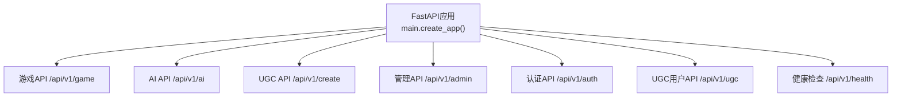
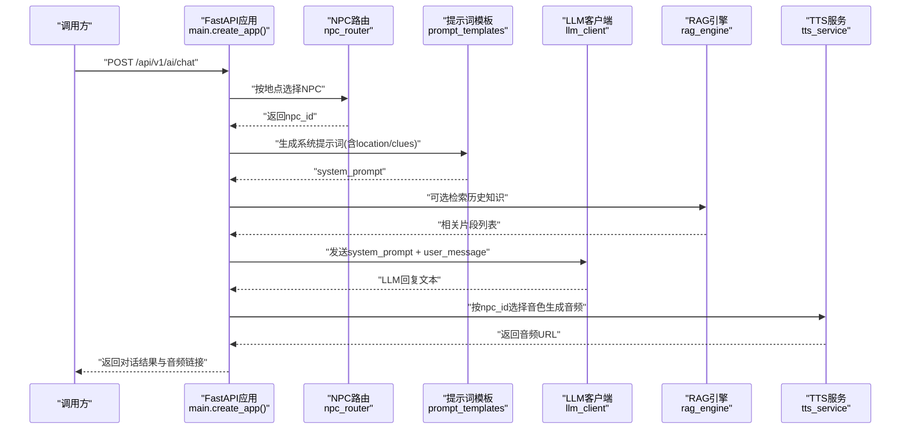
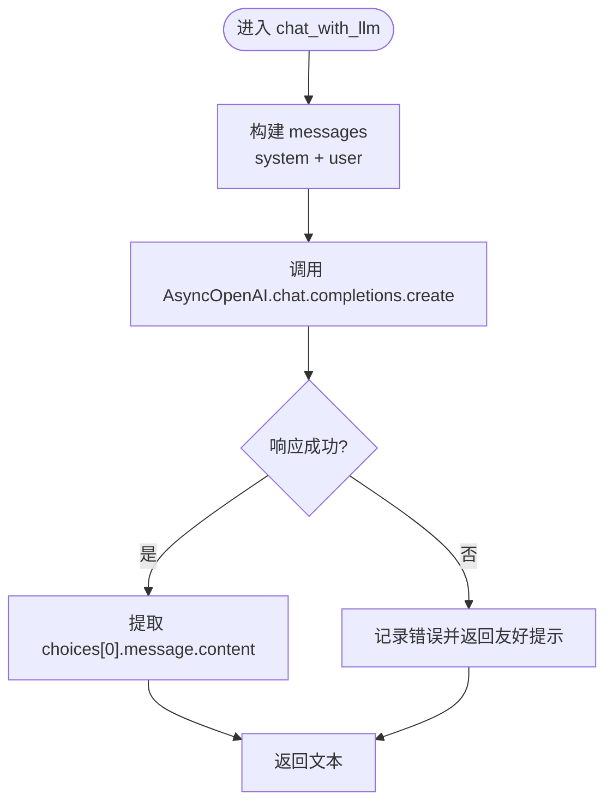
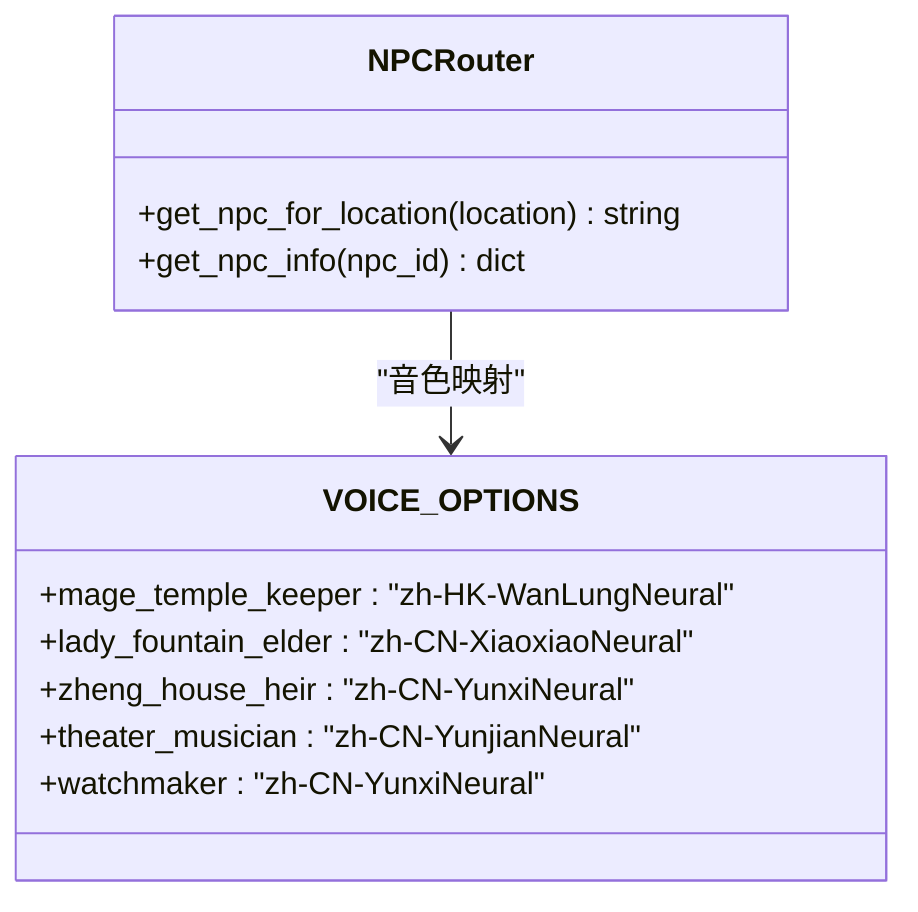
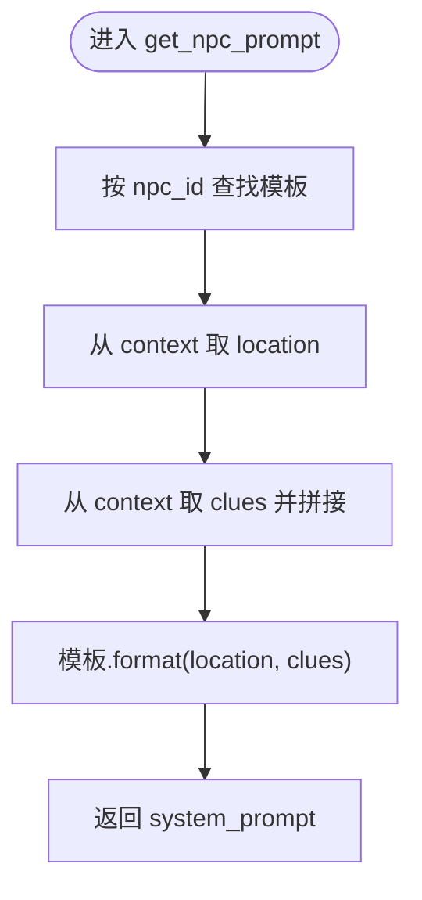
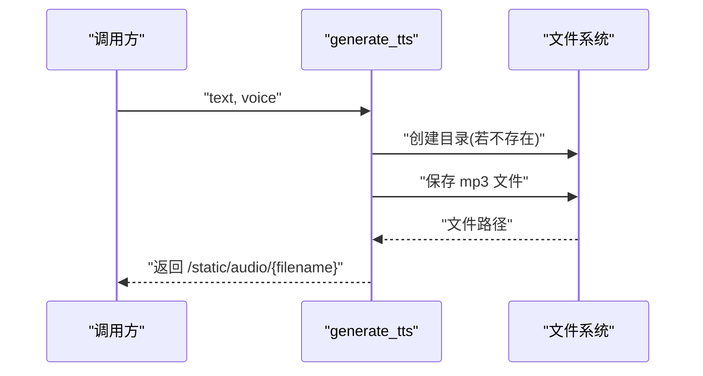
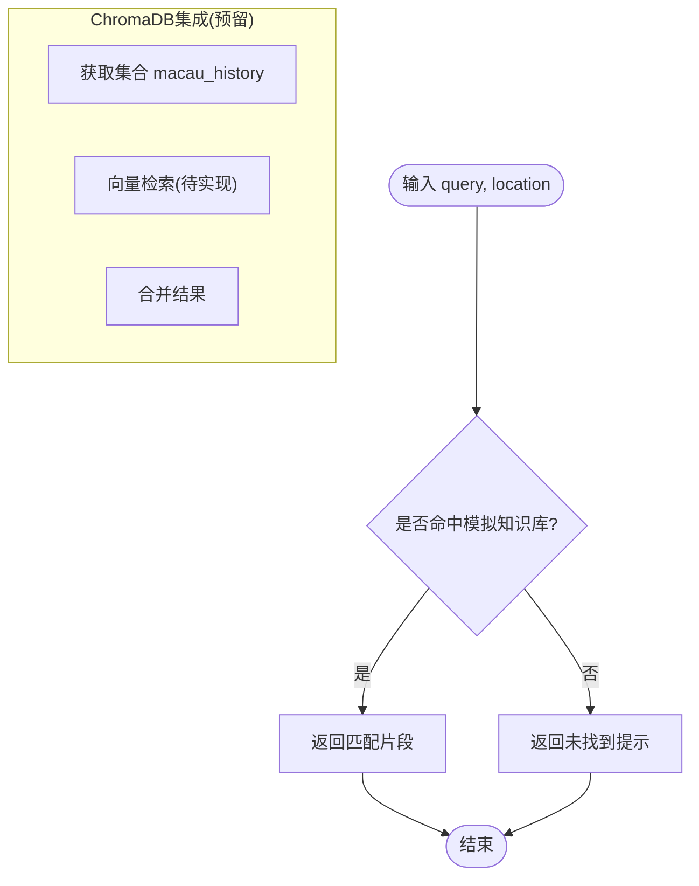
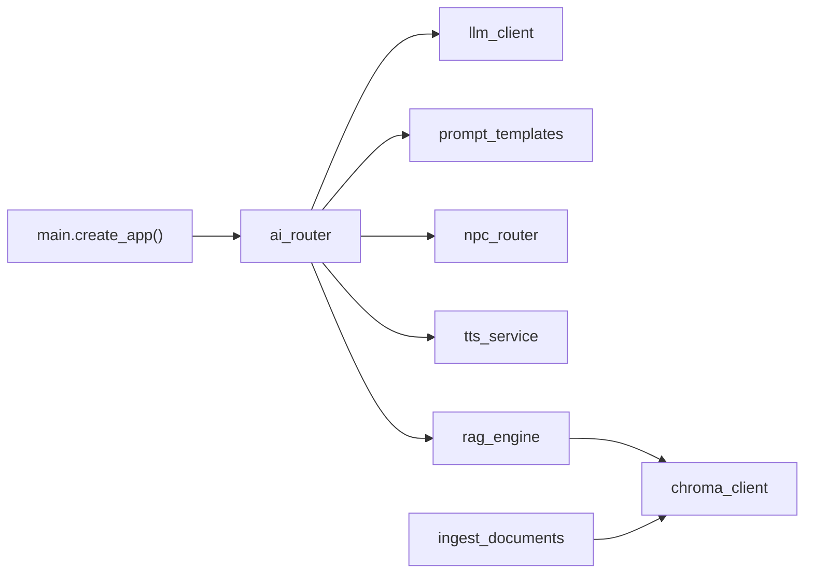

# AI服务API

<cite>
**本文引用的文件**   
- [main.py](file://backend/app/main.py)
- [llm_client.py](file://backend/app/ai/llm_client.py)
- [npc_router.py](file://backend/app/ai/npc_router.py)
- [prompt_templates.py](file://backend/app/ai/prompt_templates.py)
- [tts_service.py](file://backend/app/ai/tts_service.py)
- [rag_engine.py](file://backend/app/ai/rag_engine.py)
- [chroma_client.py](file://backend/app/knowledge/chroma_client.py)
- [ingest.py](file://backend/app/knowledge/ingest.py)
- [config.py](file://backend/app/config.py)
</cite>

## 目录
1. [简介](#简介)
2. [项目结构](#项目结构)
3. [核心组件](#核心组件)
4. [架构总览](#架构总览)
5. [详细组件分析](#详细组件分析)
6. [依赖关系分析](#依赖关系分析)
7. [性能与优化](#性能与优化)
8. [故障排除指南](#故障排除指南)
9. [结论](#结论)
10. [附录：API规范与调用示例](#附录api规范与调用示例)

## 简介
本文件面向AI服务API，覆盖以下能力：
- LLM对话接口：基于OpenAI兼容接口的异步聊天封装，支持系统提示词与用户消息。
- NPC角色路由：按地点映射NPC身份，并生成对应的人设提示词。
- TTS语音合成：将文本转换为音频文件，支持多角色音色。
- RAG知识检索：当前为模拟实现，预留ChromaDB向量库集成点，提供文档切分、入库与语义检索扩展入口。
- 上下文管理：通过模板注入location与clues等上下文信息，驱动NPC回答风格与内容。
- 多语言支持：TTS使用区域化语音（如zh-HK、zh-CN），LLM输出以中文为主，可按需扩展。

## 项目结构
后端采用FastAPI应用，统一在应用启动时挂载各模块路由与健康检查。AI相关能力集中在app/ai与app/knowledge两个子包中：
- app/ai：LLM客户端、NPC路由、提示词模板、TTS服务、RAG引擎。
- app/knowledge：ChromaDB客户端与文档导入脚本。
- main.py：应用创建、异常处理、CORS、路由注册与健康检查。

图表来源
- [main.py:17-106](file://backend/app/main.py#L17-L106)

章节来源
- [main.py:17-106](file://backend/app/main.py#L17-L106)

## 核心组件
- LLM客户端：封装异步聊天请求，默认模型与环境变量配置，错误回退为友好提示。
- NPC路由：维护NPC人设与地点映射，提供根据地点选择NPC与获取人设信息的工具函数。
- 提示词模板：为不同NPC定义系统提示词模板，支持动态注入location与clues。
- TTS服务：基于edge-tts生成音频文件，返回静态资源路径；支持按NPC选择音色。
- RAG引擎：当前为内存模拟检索，预留接入ChromaDB的接口位置。
- ChromaDB客户端：单例持久化客户端与集合管理。
- 文档导入：读取本地txt文档，按句号切分为块，批量upsert到向量库集合。

章节来源
- [llm_client.py:1-32](file://backend/app/ai/llm_client.py#L1-L32)
- [npc_router.py:1-18](file://backend/app/ai/npc_router.py#L1-L18)
- [prompt_templates.py:1-37](file://backend/app/ai/prompt_templates.py#L1-L37)
- [tts_service.py:1-25](file://backend/app/ai/tts_service.py#L1-L25)
- [rag_engine.py:1-13](file://backend/app/ai/rag_engine.py#L1-L13)
- [chroma_client.py:1-19](file://backend/app/knowledge/chroma_client.py#L1-L19)
- [ingest.py:1-36](file://backend/app/knowledge/ingest.py#L1-L36)

## 架构总览
下图展示AI服务的关键交互：前端或上游服务调用AI路由（由main.py挂载），内部依次经过NPC路由、提示词模板、LLM客户端与可选的RAG检索，最终可由TTS服务生成语音。

图表来源
- [main.py:84-96](file://backend/app/main.py#L84-L96)
- [npc_router.py:10-17](file://backend/app/ai/npc_router.py#L10-L17)
- [prompt_templates.py:32-36](file://backend/app/ai/prompt_templates.py#L32-L36)
- [llm_client.py:12-31](file://backend/app/ai/llm_client.py#L12-L31)
- [rag_engine.py:3-12](file://backend/app/ai/rag_engine.py#L3-L12)
- [tts_service.py:14-24](file://backend/app/ai/tts_service.py#L14-L24)

## 详细组件分析

### LLM对话接口
- 功能要点
  - 使用AsyncOpenAI进行异步聊天调用，支持temperature与max_tokens参数。
  - 默认模型与环境变量配置，便于切换提供商与模型。
  - 错误捕获后返回友好提示，避免上层崩溃。
- 数据流
  - 接收system_prompt与user_message，构造messages数组，调用chat.completions.create。
  - 返回choices[0].message.content，空值时回退为空字符串。
- 扩展建议
  - 增加重试与超时控制、令牌计数与限流、多轮对话上下文累积。
  - 可结合RAG引擎将检索结果拼接入system_prompt或user_message。

图表来源
- [llm_client.py:12-25](file://backend/app/ai/llm_client.py#L12-L25)

章节来源
- [llm_client.py:1-32](file://backend/app/ai/llm_client.py#L1-L32)

### NPC角色路由
- 功能要点
  - 维护NPC ID到名称、地点、音色的映射表。
  - 提供按地点查找NPC ID与按ID获取信息的工具方法。
- 使用场景
  - 对话前根据玩家所在地点选择NPC，确保人设一致。
  - TTS服务根据NPC ID选择对应音色。

图表来源
- [npc_router.py:2-17](file://backend/app/ai/npc_router.py#L2-L17)
- [tts_service.py:4-10](file://backend/app/ai/tts_service.py#L4-L10)

章节来源
- [npc_router.py:1-18](file://backend/app/ai/npc_router.py#L1-L18)

### 提示词模板系统
- 功能要点
  - 为每个NPC定义系统提示词模板，包含说话风格、场景与线索注入点。
  - get_npc_prompt根据npc_id与context动态填充location与clues。
- 上下文管理
  - context.location用于限定场景。
  - context.clues为已收集线索列表，拼接为逗号分隔字符串注入模板。

图表来源
- [prompt_templates.py:3-29](file://backend/app/ai/prompt_templates.py#L3-L29)
- [prompt_templates.py:32-36](file://backend/app/ai/prompt_templates.py#L32-L36)

章节来源
- [prompt_templates.py:1-37](file://backend/app/ai/prompt_templates.py#L1-L37)

### TTS语音合成
- 功能要点
  - 使用edge-tts将文本转为mp3，保存到static/audio目录。
  - 文件名随机生成，返回静态资源URL。
  - 提供按NPC ID选择音色的方法。
- 注意事项
  - 需要确保static/audio目录存在且可写。
  - 生产环境建议接入对象存储或CDN，避免本地磁盘瓶颈。

图表来源
- [tts_service.py:14-20](file://backend/app/ai/tts_service.py#L14-L20)

章节来源
- [tts_service.py:1-25](file://backend/app/ai/tts_service.py#L1-L25)

### RAG知识检索与向量数据库
- 当前实现
  - rag_query为模拟实现，基于关键词匹配返回预设知识片段。
  - 预留接入ChromaDB的接口位置，便于后续替换为真实向量检索。
- 向量库客户端
  - chroma_client提供单例PersistentClient与集合macau_history。
- 文档导入
  - ingest_documents读取macau_docs下的txt文件，按句号切分块，批量upsert到集合。
  - 每块附带source与chunk元数据，便于溯源。

图表来源
- [rag_engine.py:3-12](file://backend/app/ai/rag_engine.py#L3-L12)
- [chroma_client.py:7-18](file://backend/app/knowledge/chroma_client.py#L7-L18)
- [ingest.py:17-32](file://backend/app/knowledge/ingest.py#L17-L32)

章节来源
- [rag_engine.py:1-13](file://backend/app/ai/rag_engine.py#L1-L13)
- [chroma_client.py:1-19](file://backend/app/knowledge/chroma_client.py#L1-L19)
- [ingest.py:1-36](file://backend/app/knowledge/ingest.py#L1-L36)

## 依赖关系分析
- 应用层依赖
  - main.py负责路由注册与异常处理，统一暴露/api/v1/*命名空间。
  - AI相关路由由ai_router挂载至/api/v1/ai。
- 组件耦合
  - llm_client依赖环境变量配置与OpenAI兼容SDK。
  - prompt_templates被llm_client与上层路由共同使用。
  - npc_router与tts_service共享NPC到音色的映射。
  - rag_engine与chroma_client解耦，便于替换实现。
- 外部依赖
  - OpenAI兼容接口（SiliconFlow）。
  - edge-tts用于语音合成。
  - chromadb用于向量数据库（预留）。

图表来源
- [main.py:84-96](file://backend/app/main.py#L84-L96)
- [llm_client.py:1-32](file://backend/app/ai/llm_client.py#L1-L32)
- [prompt_templates.py:1-37](file://backend/app/ai/prompt_templates.py#L1-L37)
- [npc_router.py:1-18](file://backend/app/ai/npc_router.py#L1-L18)
- [tts_service.py:1-25](file://backend/app/ai/tts_service.py#L1-L25)
- [rag_engine.py:1-13](file://backend/app/ai/rag_engine.py#L1-L13)
- [chroma_client.py:1-19](file://backend/app/knowledge/chroma_client.py#L1-L19)
- [ingest.py:1-36](file://backend/app/knowledge/ingest.py#L1-L36)

章节来源
- [main.py:84-96](file://backend/app/main.py#L84-L96)

## 性能与优化
- 并发与异步
  - LLM调用使用AsyncOpenAI，避免阻塞事件循环。
  - 建议对TTS生成任务进行队列化与异步处理，避免同步IO影响吞吐。
- 缓存策略
  - 可对常见问答结果做键值缓存（如按query+npc_id哈希），减少重复LLM调用。
  - 对TTS生成的音频可按文本指纹缓存，避免重复生成。
- 限流与配额
  - 建议在网关或中间件层实现速率限制（如每秒请求数、令牌桶）。
  - 针对LLM调用设置最大并发与重试退避，防止雪崩。
- 向量检索优化
  - 合理设置chunk大小与嵌入维度，提升召回质量与查询速度。
  - 引入分页与Top-K限制，减少返回数据量。
- 配置与运行环境
  - 通过config.py集中管理数据库、CORS、演示数据开关等配置。
  - 生产环境关闭演示数据初始化，提高启动效率。

章节来源
- [config.py:38-76](file://backend/app/config.py#L38-L76)

## 故障排除指南
- 常见问题
  - LLM调用失败：检查SILICONFLOW_API_KEY与SILICONFLOW_BASE_URL环境变量是否正确。
  - TTS生成失败：确认static/audio目录存在且有写入权限。
  - 向量库未就绪：确保chroma_db目录存在并可访问，执行ingest_documents完成索引。
- 错误处理
  - 应用层统一GameError与请求校验异常处理，返回结构化错误体。
  - LLM客户端捕获异常并返回友好提示，避免上层崩溃。
- 调试建议
  - 启用日志记录关键步骤（NPC选择、提示词生成、LLM调用、TTS生成）。
  - 使用健康检查端点验证数据库状态与服务可用性。

章节来源
- [main.py:38-74](file://backend/app/main.py#L38-L74)
- [llm_client.py:23-25](file://backend/app/ai/llm_client.py#L23-L25)
- [tts_service.py:14-20](file://backend/app/ai/tts_service.py#L14-L20)
- [rag_engine.py:3-12](file://backend/app/ai/rag_engine.py#L3-L12)

## 结论
本AI服务API围绕LLM对话、NPC人设、TTS语音与RAG检索构建了完整链路。当前RAG为模拟实现，预留ChromaDB集成点，便于后续扩展为真实向量检索。通过统一的异常处理与配置管理，服务具备良好的可维护性与可扩展性。建议在生产环境中完善缓存、限流与监控，以提升稳定性与性能。

## 附录：API规范与调用示例

### 通用约定
- 基础路径：/api/v1
- 版本：v1
- 内容类型：application/json
- 错误格式：{error:{code,message,details}}

### AI对话接口
- 端点：POST /api/v1/ai/chat
- 请求体
  - location: string，玩家所在地点（用于NPC选择与提示词注入）
  - user_message: string，用户输入
  - context: object，可选，包含location与clues（已收集线索列表）
- 响应体
  - reply: string，LLM回复文本
  - audio_url: string，TTS生成的音频URL（可选）
- 调用示例
  - 请求：{location:"妈阁庙", user_message:"请介绍妈阁庙的历史", context:{location:"妈阁庙", clues:["妈祖","明代"]}}
  - 响应：{reply:"...（中文回复）...", audio_url:"/static/audio/tts_xxx.mp3"}
- 错误处理
  - 网络或模型异常：返回错误码与提示信息
  - 参数缺失：返回VALIDATION_ERROR

章节来源
- [llm_client.py:12-31](file://backend/app/ai/llm_client.py#L12-L31)
- [npc_router.py:10-17](file://backend/app/ai/npc_router.py#L10-L17)
- [prompt_templates.py:32-36](file://backend/app/ai/prompt_templates.py#L32-L36)
- [tts_service.py:14-24](file://backend/app/ai/tts_service.py#L14-L24)

### NPC角色路由接口
- 端点：GET /api/v1/ai/npc?location=xxx
- 说明：根据地点返回匹配的npc_id与基本信息
- 响应体
  - npc_id: string
  - name: string
  - location: string
  - voice: string
- 调用示例
  - 请求：/api/v1/ai/npc?location=亚婆井前地
  - 响应：{npc_id:"lady_fountain_elder", name:"亚婆井阿婆", location:"亚婆井前地", voice:"zh-CN-XiaoxiaoNeural"}

章节来源
- [npc_router.py:10-17](file://backend/app/ai/npc_router.py#L10-L17)

### TTS语音合成接口
- 端点：POST /api/v1/ai/tts
- 请求体
  - text: string，待合成文本
  - voice: string，可选，默认zh-CN-XiaoxiaoNeural
- 响应体
  - audio_url: string，音频文件URL
- 调用示例
  - 请求：{text:"欢迎来到澳门历史之旅", voice:"zh-CN-YunxiNeural"}
  - 响应：{audio_url:"/static/audio/tts_xxx.mp3"}

章节来源
- [tts_service.py:14-24](file://backend/app/ai/tts_service.py#L14-L24)

### RAG知识检索接口
- 端点：POST /api/v1/ai/rag
- 请求体
  - query: string，检索问题
  - location: string，可选，关联地点
- 响应体
  - results: list<string>，相关历史知识片段
- 调用示例
  - 请求：{query:"妈阁庙的历史", location:"妈阁庙"}
  - 响应：{results:["妈阁庙是澳门现存最古老的庙宇之一..."]}

章节来源
- [rag_engine.py:3-12](file://backend/app/ai/rag_engine.py#L3-L12)

### 向量数据库与文档索引管理
- 文档导入
  - 命令：python -m app.knowledge.ingest
  - 作用：读取macau_docs/*.txt，切分并upsert到ChromaDB集合macau_history
- 集合管理
  - 客户端：chroma_client.get_collection()
  - 集合名：macau_history
  - 元数据：source（文件名）、chunk（块序号）

章节来源
- [ingest.py:17-32](file://backend/app/knowledge/ingest.py#L17-L32)
- [chroma_client.py:7-18](file://backend/app/knowledge/chroma_client.py#L7-L18)

### 第三方服务集成指南
- LLM提供商（SiliconFlow/OpenAI兼容）
  - 环境变量：SILICONFLOW_API_KEY、SILICONFLOW_BASE_URL、LLM_MODEL
  - 建议：设置超时与重试策略，监控令牌消耗
- TTS服务（edge-tts）
  - 依赖：安装edge-tts库
  - 存储：static/audio目录需可写，生产环境建议迁移至对象存储
- 向量数据库（ChromaDB）
  - 依赖：安装chromadb库
  - 数据：确保macau_docs目录存在且包含有效txt文件

章节来源
- [llm_client.py:5-9](file://backend/app/ai/llm_client.py#L5-L9)
- [tts_service.py:11-20](file://backend/app/ai/tts_service.py#L11-L20)
- [chroma_client.py:7-18](file://backend/app/knowledge/chroma_client.py#L7-L18)
- [ingest.py:17-32](file://backend/app/knowledge/ingest.py#L17-L32)

### 错误处理与重试机制
- 应用级异常
  - GameError：业务错误，统一返回结构化错误体
  - RequestValidationError：请求校验失败，返回字段级错误详情
- LLM客户端异常
  - 捕获异常并返回友好提示，避免上层崩溃
- 重试建议
  - 在网络抖动或服务不可用时，指数退避重试（最多3次）
  - 对幂等操作（如选择提交）使用request_id去重

章节来源
- [main.py:38-74](file://backend/app/main.py#L38-L74)
- [llm_client.py:23-25](file://backend/app/ai/llm_client.py#L23-L25)