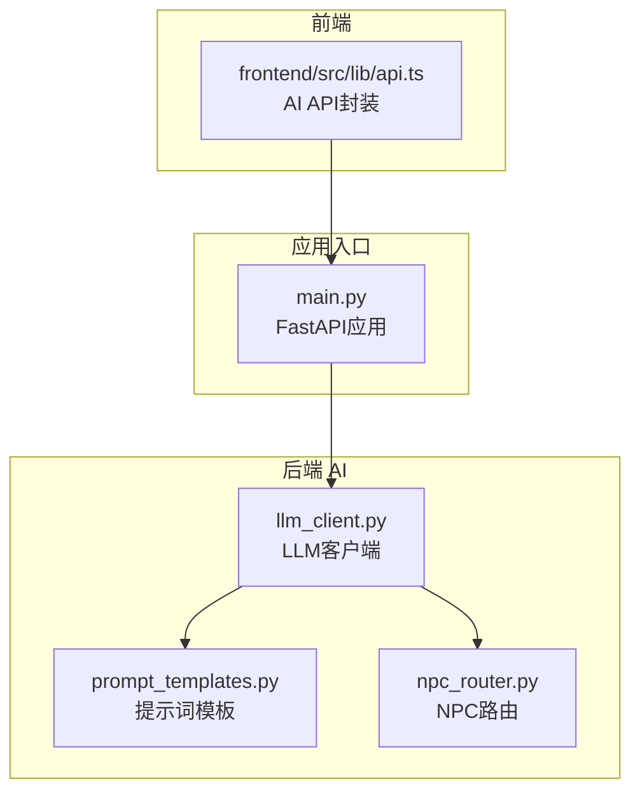
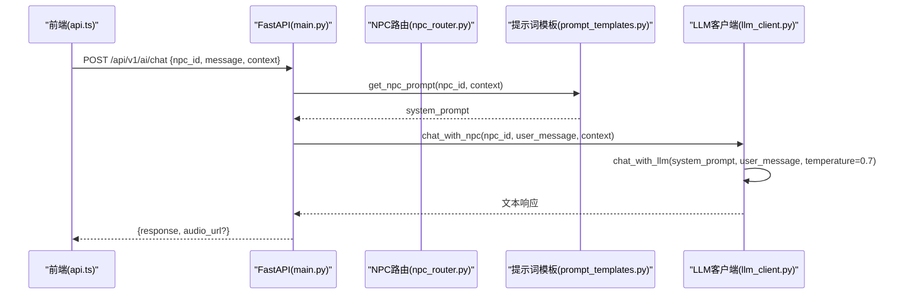
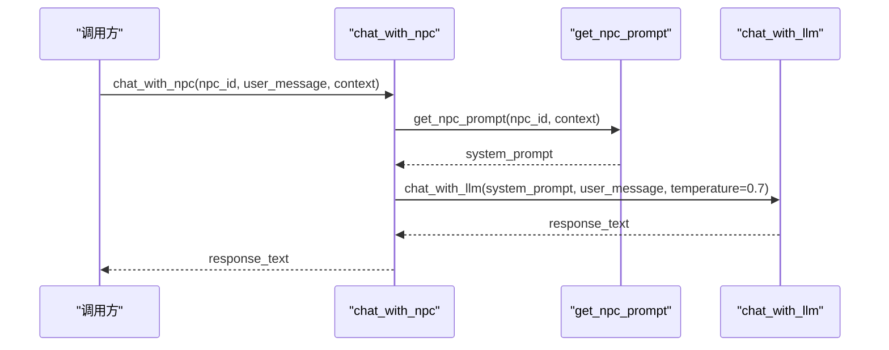
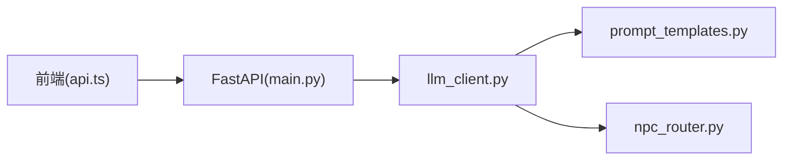
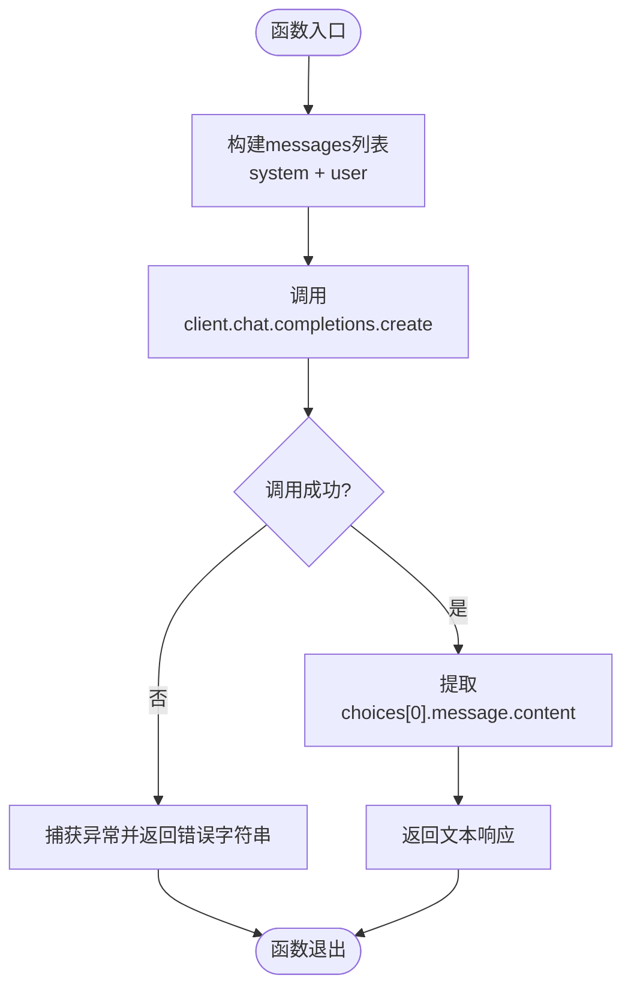

# LLM对话接口

<cite>
**本文引用的文件**
- [llm_client.py](file://backend/app/ai/llm_client.py)
- [prompt_templates.py](file://backend/app/ai/prompt_templates.py)
- [npc_router.py](file://backend/app/ai/npc_router.py)
- [main.py](file://backend/app/main.py)
- [api.ts](file://frontend/src/lib/api.ts)
</cite>

## 目录
1. [简介](#简介)
2. [项目结构](#项目结构)
3. [核心组件](#核心组件)
4. [架构总览](#架构总览)
5. [详细组件分析](#详细组件分析)
6. [依赖关系分析](#依赖关系分析)
7. [性能考量](#性能考量)
8. [故障排查指南](#故障排查指南)
9. [结论](#结论)
10. [附录](#附录)

## 简介
本文件为LLM对话接口的详细API文档，聚焦于两个核心函数：chat_with_llm与chat_with_npc。内容涵盖接口规范（参数、返回值、错误处理）、DeepSeek LLM客户端配置（模型选择、温度等）、提示词模板系统的使用与扩展、完整调用示例（系统提示词构建、用户消息处理、响应解析）、异步调用模式、超时与重试策略建议，以及性能优化与最佳实践。

## 项目结构
后端AI能力集中在backend/app/ai目录下，包含LLM客户端、NPC路由、提示词模板、RAG引擎与TTS服务；前端通过统一的API封装调用AI接口。

图表来源
- [llm_client.py:1-32](file://backend/app/ai/llm_client.py#L1-L32)
- [prompt_templates.py:1-37](file://backend/app/ai/prompt_templates.py#L1-L37)
- [npc_router.py:1-18](file://backend/app/ai/npc_router.py#L1-L18)
- [main.py:84-96](file://backend/app/main.py#L84-L96)
- [api.ts:115-126](file://frontend/src/lib/api.ts#L115-L126)

章节来源
- [llm_client.py:1-32](file://backend/app/ai/llm_client.py#L1-L32)
- [prompt_templates.py:1-37](file://backend/app/ai/prompt_templates.py#L1-L37)
- [npc_router.py:1-18](file://backend/app/ai/npc_router.py#L1-L18)
- [main.py:84-96](file://backend/app/main.py#L84-L96)
- [api.ts:115-126](file://frontend/src/lib/api.ts#L115-L126)

## 核心组件
- LLM客户端：基于OpenAI兼容的AsyncOpenAI客户端，默认对接SiliconFlow网关，使用环境变量配置API Key与Base URL，并支持通过环境变量切换模型名称。提供两个异步方法：
  - chat_with_llm：通用对话接口，接收system_prompt与user_message，返回字符串响应。
  - chat_with_npc：NPC对话包装器，自动根据npc_id与context生成系统提示词，再调用chat_with_llm。
- 提示词模板：集中管理各NPC的系统提示词模板，支持动态注入location与clues等上下文信息。
- NPC路由：维护NPC身份映射（id、name、location、voice），并提供按位置查找NPC与获取NPC信息的工具函数。

章节来源
- [llm_client.py:1-32](file://backend/app/ai/llm_client.py#L1-L32)
- [prompt_templates.py:1-37](file://backend/app/ai/prompt_templates.py#L1-L37)
- [npc_router.py:1-18](file://backend/app/ai/npc_router.py#L1-L18)

## 架构总览
下图展示了从前端到后端的AI对话请求流程，包括HTTP路由注册、LLM客户端调用与提示词模板组装。

图表来源
- [main.py:84-96](file://backend/app/main.py#L84-L96)
- [api.ts:115-126](file://frontend/src/lib/api.ts#L115-L126)
- [prompt_templates.py:32-37](file://backend/app/ai/prompt_templates.py#L32-L37)
- [llm_client.py:12-31](file://backend/app/ai/llm_client.py#L12-L31)

## 详细组件分析

### 组件A：LLM客户端（llm_client.py）
- 客户端初始化
  - 使用AsyncOpenAI，通过环境变量SILICONFLOW_API_KEY与SILICONFLOW_BASE_URL配置认证与网关地址。
  - 模型名称由LLM_MODEL环境变量控制，默认值为deepseek-ai/DeepSeek-V3。
- 接口定义
  - chat_with_llm(system_prompt: str, user_message: str, temperature: float = 0.7) -> str
    - 参数：
      - system_prompt：系统提示词，用于设定角色与行为约束。
      - user_message：用户输入消息。
      - temperature：采样温度，默认0.7，控制输出随机性。
    - 返回：纯文本字符串。若调用异常，返回以“[模型调用失败: ...]”开头的错误提示字符串。
    - 错误处理：捕获所有异常并打印日志，返回友好错误字符串。
  - chat_with_npc(npc_id: str, user_message: str, context: dict | None = None) -> str
    - 参数：
      - npc_id：NPC标识符。
      - user_message：用户输入消息。
      - context：可选上下文字典，可包含location与clues等字段。
    - 返回：纯文本字符串。内部通过提示词模板生成system_prompt后调用chat_with_llm。
- 调用时序

图表来源
- [llm_client.py:12-31](file://backend/app/ai/llm_client.py#L12-L31)
- [prompt_templates.py:32-37](file://backend/app/ai/prompt_templates.py#L32-L37)

章节来源
- [llm_client.py:1-32](file://backend/app/ai/llm_client.py#L1-L32)

### 组件B：提示词模板（prompt_templates.py）
- 模板结构
  - NPC_SYSTEM_PROMPTS：以npc_id为键的系统提示词模板集合，每个模板包含角色背景、说话风格、当前场景与线索占位符。
  - get_npc_prompt(npc_id, context)：根据npc_id选择模板，并从context中提取location与clues进行格式化，返回最终system_prompt。
- 自定义扩展指南
  - 新增NPC：在NPC_SYSTEM_PROMPTS中添加新键值对，并在npc_router.py中补充NPC_PERSONAS映射。
  - 动态上下文：在context中增加新字段，并在get_npc_prompt中进行提取与格式化。
  - 语言与长度限制：模板内已约定中文回答与字数限制，可按需调整。

章节来源
- [prompt_templates.py:1-37](file://backend/app/ai/prompt_templates.py#L1-L37)

### 组件C：NPC路由（npc_router.py）
- NPC_PERSONAS：维护NPC的身份信息（name、location、voice）。
- 工具函数
  - get_npc_for_location(location)：根据地点返回对应的npc_id。
  - get_npc_info(npc_id)：根据npc_id返回NPC详细信息。
- 使用建议
  - 在前端或业务层根据用户所在地点选择npc_id，再调用chat_with_npc。

章节来源
- [npc_router.py:1-18](file://backend/app/ai/npc_router.py#L1-L18)

### 组件D：API路由与错误处理（main.py）
- 路由注册
  - ai_router挂载至/api/v1/ai前缀，对外暴露AI相关接口。
- 错误处理
  - GameError统一错误格式，包含code、message与details。
  - RequestValidationError针对请求校验失败返回标准化错误体。
- 健康检查
  - /api/v1/health返回服务状态与数据库可用性。

章节来源
- [main.py:38-74](file://backend/app/main.py#L38-L74)
- [main.py:84-96](file://backend/app/main.py#L84-L96)
- [main.py:98-105](file://backend/app/main.py#L98-L105)

## 依赖关系分析
- 模块耦合
  - llm_client.py依赖openai库与环境变量，不直接依赖其他业务模块。
  - prompt_templates.py为纯模板逻辑，无外部依赖。
  - npc_router.py为静态映射与查询工具，无外部依赖。
- 外部集成点
  - OpenAI兼容的LLM网关（SiliconFlow），通过环境变量配置。
  - FastAPI应用生命周期与中间件（CORS、异常处理器）。

图表来源
- [api.ts:115-126](file://frontend/src/lib/api.ts#L115-L126)
- [main.py:84-96](file://backend/app/main.py#L84-L96)
- [llm_client.py:1-10](file://backend/app/ai/llm_client.py#L1-L10)
- [prompt_templates.py:1-10](file://backend/app/ai/prompt_templates.py#L1-L10)
- [npc_router.py:1-10](file://backend/app/ai/npc_router.py#L1-L10)

章节来源
- [llm_client.py:1-10](file://backend/app/ai/llm_client.py#L1-L10)
- [prompt_templates.py:1-10](file://backend/app/ai/prompt_templates.py#L1-L10)
- [npc_router.py:1-10](file://backend/app/ai/npc_router.py#L1-L10)
- [main.py:84-96](file://backend/app/main.py#L84-L96)
- [api.ts:115-126](file://frontend/src/lib/api.ts#L115-L126)

## 性能考量
- 异步调用
  - 使用AsyncOpenAI与async def确保非阻塞I/O，提升并发处理能力。
- 超时与重试
  - 当前实现未显式设置超时与重试。建议在客户端层添加超时（如connect_timeout与read_timeout）与指数退避重试策略，避免长时间阻塞与瞬时网络抖动影响。
- 缓存与幂等
  - 对于相同system_prompt与user_message的请求，可在上层引入缓存（如Redis）以减少重复调用。
  - 结合request_id实现幂等，避免重复生成。
- 资源控制
  - 合理设置max_tokens与temperature，控制输出长度与随机性，降低Token消耗与延迟。
- 连接池与复用
  - AsyncOpenAI实例全局复用，减少连接开销。

[本节为通用指导，无需特定文件引用]

## 故障排查指南
- 常见错误
  - 模型调用失败：当OpenAI调用抛出异常时，返回以“[模型调用失败: ...]”开头的字符串。检查环境变量SILICONFLOW_API_KEY与SILICONFLOW_BASE_URL是否正确。
  - 模板缺失：若npc_id不在NPC_SYSTEM_PROMPTS中，将回退到默认模板“你是一个友善的NPC”。确认npc_id与模板映射一致。
  - 请求校验失败：FastAPI会返回VALIDATION_ERROR，检查请求体字段类型与必填项。
- 定位步骤
  - 查看后端日志中的“LLM Error”输出，确认异常原因。
  - 验证环境变量的有效性（API Key、Base URL、模型名）。
  - 检查前端传入的npc_id、message与context是否符合预期。

章节来源
- [llm_client.py:23-25](file://backend/app/ai/llm_client.py#L23-L25)
- [prompt_templates.py:32-37](file://backend/app/ai/prompt_templates.py#L32-L37)
- [main.py:51-74](file://backend/app/main.py#L51-L74)

## 结论
本接口通过简洁的异步函数封装了LLM对话能力，结合提示词模板与NPC路由实现了角色化对话。建议在现有基础上完善超时、重试与缓存机制，进一步提升稳定性与性能。同时，模板系统与NPC映射的可扩展性为后续多角色、多场景对话提供了良好基础。

[本节为总结性内容，无需特定文件引用]

## 附录

### API规范摘要
- 接口路径
  - POST /api/v1/ai/chat
- 请求体
  - npc_id: string（必需）
  - message: string（必需）
  - context: object（可选，包含location、clues等）
- 响应体
  - response: string（必需）
  - audio_url: string（可选）
- 错误码
  - VALIDATION_ERROR：请求校验失败
  - 业务错误：由GameError统一返回，包含code、message、details

章节来源
- [api.ts:115-126](file://frontend/src/lib/api.ts#L115-L126)
- [main.py:38-74](file://backend/app/main.py#L38-L74)

### 调用示例（端到端）
- 系统提示词构建
  - 使用get_npc_prompt(npc_id, context)生成system_prompt，其中location与clues来自context。
- 用户消息处理
  - 将用户输入作为user_message传入chat_with_npc。
- 响应解析
  - 返回纯文本字符串，前端可直接展示；如需语音，可调用TTS接口获取audio_url。

章节来源
- [prompt_templates.py:32-37](file://backend/app/ai/prompt_templates.py#L32-L37)
- [llm_client.py:28-31](file://backend/app/ai/llm_client.py#L28-L31)
- [api.ts:115-126](file://frontend/src/lib/api.ts#L115-L126)

### 配置与环境变量
- SILICONFLOW_API_KEY：SiliconFlow API密钥
- SILICONFLOW_BASE_URL：SiliconFlow网关地址（默认https://api.siliconflow.cn/v1）
- LLM_MODEL：模型名称（默认deepseek-ai/DeepSeek-V3）

章节来源
- [llm_client.py:5-9](file://backend/app/ai/llm_client.py#L5-L9)

### 流程图：chat_with_llm核心逻辑

图表来源
- [llm_client.py:12-25](file://backend/app/ai/llm_client.py#L12-L25)