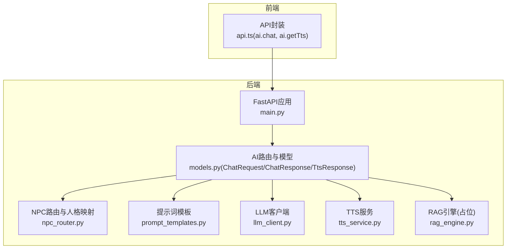
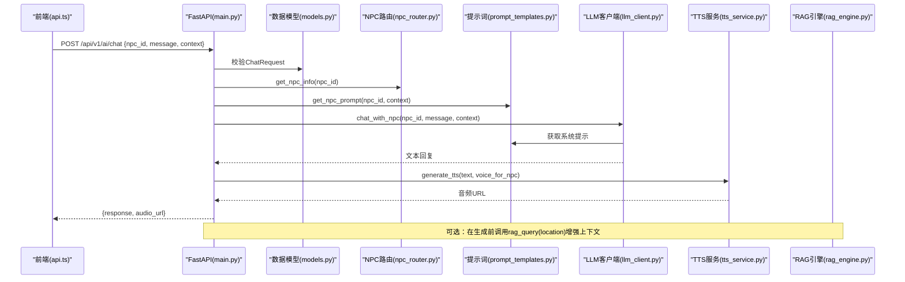
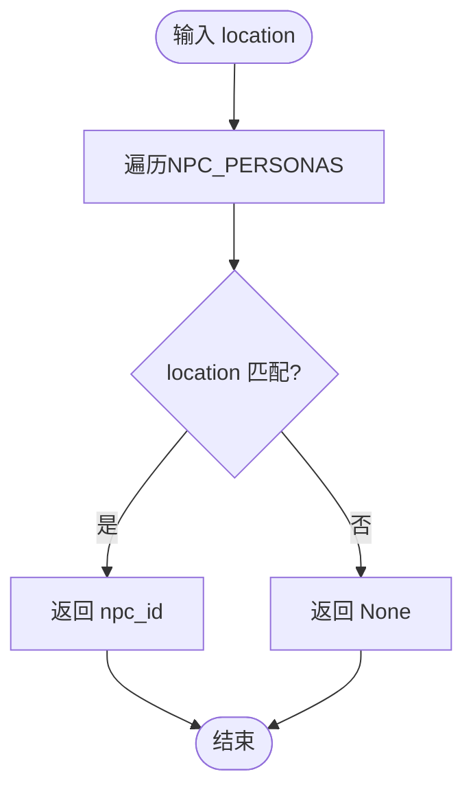
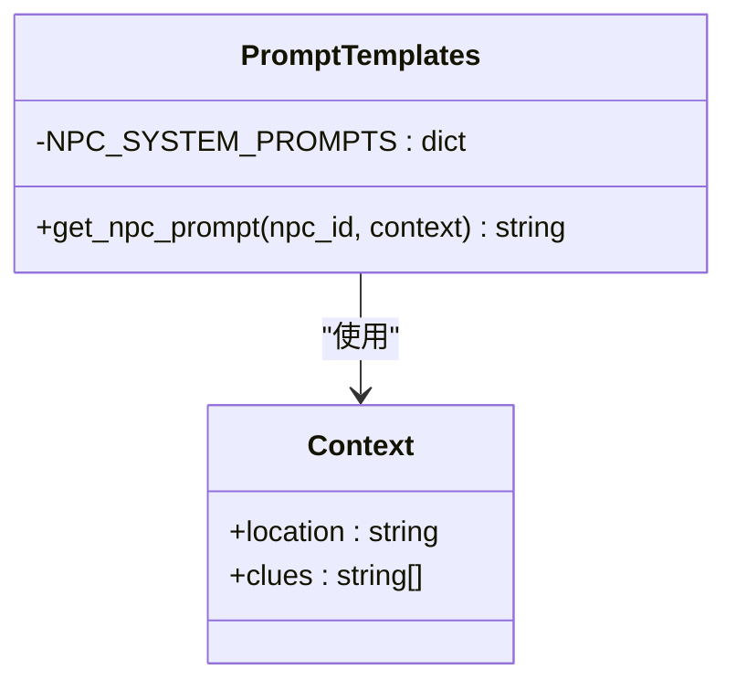
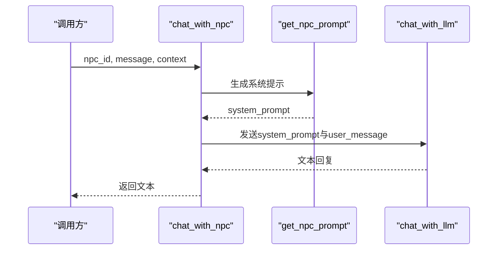
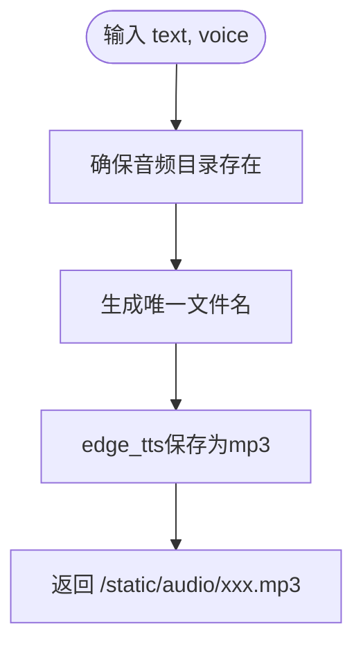
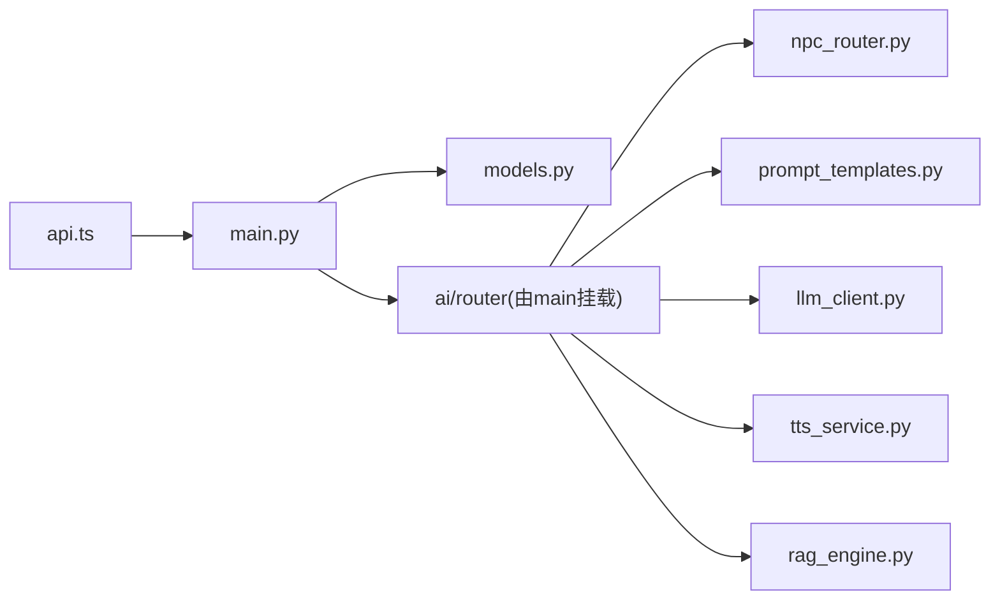

# NPC角色路由接口

<cite>
**本文引用的文件**   
- [npc_router.py](file://backend/app/ai/npc_router.py)
- [prompt_templates.py](file://backend/app/ai/prompt_templates.py)
- [llm_client.py](file://backend/app/ai/llm_client.py)
- [tts_service.py](file://backend/app/ai/tts_service.py)
- [rag_engine.py](file://backend/app/ai/rag_engine.py)
- [models.py](file://backend/app/models.py)
- [main.py](file://backend/app/main.py)
- [api.ts](file://frontend/src/lib/api.ts)
</cite>

## 目录
1. [简介](#简介)
2. [项目结构](#项目结构)
3. [核心组件](#核心组件)
4. [架构总览](#架构总览)
5. [详细组件分析](#详细组件分析)
6. [依赖关系分析](#依赖关系分析)
7. [性能与优化](#性能与优化)
8. [故障排除指南](#故障排除指南)
9. [结论](#结论)
10. [附录：API定义与示例](#附录api定义与示例)

## 简介
本文件面向“NPC角色路由接口”的完整技术文档，覆盖以下目标：
- NPC角色的注册机制、路由匹配算法与上下文传递方式
- 角色配置文件格式、性格设定参数与行为规则定义
- 多语言支持、方言识别与个性化回复生成
- NPC角色创建与管理示例（属性配置、对话风格定制、场景适配）
- 角色状态管理、会话隔离与性能优化策略
- 故障排除与调试方法

本项目通过FastAPI暴露AI相关接口，结合LLM客户端、TTS服务、RAG引擎与NPC路由模板，实现基于地点与线索的NPC对话生成与语音合成。

## 项目结构
与NPC角色路由相关的后端模块集中在 backend/app/ai 下，前端通过统一的请求封装调用 /api/v1/ai 前缀的接口。

**图示来源** 
- [main.py:84-96](file://backend/app/main.py#L84-L96)
- [models.py:95-108](file://backend/app/models.py#L95-L108)
- [npc_router.py:1-18](file://backend/app/ai/npc_router.py#L1-L18)
- [prompt_templates.py:1-37](file://backend/app/ai/prompt_templates.py#L1-L37)
- [llm_client.py:1-32](file://backend/app/ai/llm_client.py#L1-L32)
- [tts_service.py:1-25](file://backend/app/ai/tts_service.py#L1-L25)
- [rag_engine.py:1-13](file://backend/app/ai/rag_engine.py#L1-L13)
- [api.ts:115-126](file://frontend/src/lib/api.ts#L115-L126)

**章节来源**
- [main.py:84-96](file://backend/app/main.py#L84-L96)
- [models.py:95-108](file://backend/app/models.py#L95-L108)
- [api.ts:115-126](file://frontend/src/lib/api.ts#L115-L126)

## 核心组件
- NPC路由与人格映射：根据地点或ID选择对应NPC人格，并返回名称、位置与语音音色。
- 提示词模板：为每个NPC提供系统级人设与对话约束，注入当前场景与线索。
- LLM客户端：封装异步OpenAI兼容调用，负责将系统提示与用户消息发送给大模型。
- TTS服务：将文本转换为音频，按NPC绑定音色输出静态路径。
- RAG引擎：检索增强生成占位实现，后续可接入向量库。
- 数据模型：定义聊天请求/响应与TTS响应的数据结构。

**章节来源**
- [npc_router.py:1-18](file://backend/app/ai/npc_router.py#L1-L18)
- [prompt_templates.py:1-37](file://backend/app/ai/prompt_templates.py#L1-L37)
- [llm_client.py:1-32](file://backend/app/ai/llm_client.py#L1-L32)
- [tts_service.py:1-25](file://backend/app/ai/tts_service.py#L1-L25)
- [rag_engine.py:1-13](file://backend/app/ai/rag_engine.py#L1-L13)
- [models.py:95-108](file://backend/app/models.py#L95-L108)

## 架构总览
下图展示一次NPC对话从前端到后端的完整调用链，包括LLM与TTS的协作流程。

**图示来源** 
- [main.py:84-96](file://backend/app/main.py#L84-L96)
- [models.py:95-108](file://backend/app/models.py#L95-L108)
- [npc_router.py:10-17](file://backend/app/ai/npc_router.py#L10-L17)
- [prompt_templates.py:32-36](file://backend/app/ai/prompt_templates.py#L32-L36)
- [llm_client.py:28-31](file://backend/app/ai/llm_client.py#L28-L31)
- [tts_service.py:14-24](file://backend/app/ai/tts_service.py#L14-L24)
- [rag_engine.py:3-12](file://backend/app/ai/rag_engine.py#L3-L12)
- [api.ts:115-126](file://frontend/src/lib/api.ts#L115-L126)

## 详细组件分析

### NPC路由与人格映射
- 功能：维护NPC ID到人格信息的映射，支持按地点反查NPC ID与按ID查询信息。
- 匹配算法：线性遍历查找location字段；可扩展为哈希索引提升性能。
- 扩展点：新增NPC只需在映射中增加条目，并在TTS与提示词模板中补齐对应配置。

**图示来源** 
- [npc_router.py:10-14](file://backend/app/ai/npc_router.py#L10-L14)

**章节来源**
- [npc_router.py:1-18](file://backend/app/ai/npc_router.py#L1-L18)

### 提示词模板与上下文注入
- 功能：为每个NPC提供系统级人设、说话特点与长度限制，并注入当前场景与线索列表。
- 上下文键：location（字符串）、clues（字符串数组）。
- 默认回退：未知NPC时回退到通用友好提示。

**图示来源** 
- [prompt_templates.py:32-36](file://backend/app/ai/prompt_templates.py#L32-L36)

**章节来源**
- [prompt_templates.py:1-37](file://backend/app/ai/prompt_templates.py#L1-L37)

### LLM客户端与NPC对话
- 功能：封装异步OpenAI兼容调用，支持temperature与max_tokens控制。
- NPC对话：先拼装系统提示，再发送用户消息，返回文本内容。
- 错误处理：捕获异常并返回带错误信息的降级文本。

**图示来源** 
- [llm_client.py:28-31](file://backend/app/ai/llm_client.py#L28-L31)
- [prompt_templates.py:32-36](file://backend/app/ai/prompt_templates.py#L32-L36)

**章节来源**
- [llm_client.py:1-32](file://backend/app/ai/llm_client.py#L1-L32)

### TTS服务与音色绑定
- 功能：将文本转为MP3音频，按NPC绑定音色，返回静态资源路径。
- 音色映射：每个NPC有固定voice，未命中则回退默认音色。
- 存储：音频写入static/audio目录，便于前端直接播放。

**图示来源** 
- [tts_service.py:14-24](file://backend/app/ai/tts_service.py#L14-L24)

**章节来源**
- [tts_service.py:1-25](file://backend/app/ai/tts_service.py#L1-L25)

### RAG引擎（占位）
- 功能：基于关键词匹配返回历史知识片段，后续可替换为ChromaDB等向量检索。
- 使用建议：在生成NPC回复前，依据location与query检索背景知识，注入context以提升准确性。

**章节来源**
- [rag_engine.py:1-13](file://backend/app/ai/rag_engine.py#L1-L13)

### 数据模型与接口契约
- ChatRequest：包含npc_id、message、context（可选）。
- ChatResponse：包含response与可选audio_url。
- TtsResponse：包含audio_url与text。

**章节来源**
- [models.py:95-108](file://backend/app/models.py#L95-L108)

## 依赖关系分析
- main.py：挂载各子路由，统一错误处理与CORS设置。
- models.py：定义AI相关请求/响应结构。
- npc_router.py：NPC人格映射与地点匹配。
- prompt_templates.py：NPC系统提示模板。
- llm_client.py：LLM调用封装。
- tts_service.py：TTS生成与音色映射。
- rag_engine.py：RAG占位实现。
- api.ts：前端对AI接口的封装调用。

**图示来源** 
- [main.py:84-96](file://backend/app/main.py#L84-L96)
- [models.py:95-108](file://backend/app/models.py#L95-L108)
- [npc_router.py:1-18](file://backend/app/ai/npc_router.py#L1-L18)
- [prompt_templates.py:1-37](file://backend/app/ai/prompt_templates.py#L1-L37)
- [llm_client.py:1-32](file://backend/app/ai/llm_client.py#L1-L32)
- [tts_service.py:1-25](file://backend/app/ai/tts_service.py#L1-L25)
- [rag_engine.py:1-13](file://backend/app/ai/rag_engine.py#L1-L13)
- [api.ts:115-126](file://frontend/src/lib/api.ts#L115-L126)

**章节来源**
- [main.py:84-96](file://backend/app/main.py#L84-L96)
- [api.ts:115-126](file://frontend/src/lib/api.ts#L115-L126)

## 性能与优化
- 路由匹配优化：将NPC_PERSONAS改为哈希表并按location建立反向索引，避免线性扫描。
- 并发与缓存：对频繁使用的提示词模板进行内存缓存（如lru_cache），减少格式化开销。
- I/O优化：TTS音频文件采用异步保存与命名去重，避免重复生成；可引入对象存储与CDN加速。
- LLM调用：合理设置temperature与max_tokens，必要时加入重试与超时控制。
- RAG集成：接入向量数据库后，使用embedding缓存与批量检索降低延迟。
- 会话隔离：若未来引入会话级NPC状态，建议使用Redis或内存字典按session_id隔离。

[本节为通用指导，不直接分析具体文件]

## 故障排除指南
- LLM调用失败：检查环境变量SILICONFLOW_API_KEY与SILICONFLOW_BASE_URL是否正确；查看日志中的错误信息。
- TTS生成失败：确认edge-tts可用性与音频目录权限；检查voice是否有效。
- 提示词缺失：确保npc_id存在于NPC_PERSONAS与NPC_SYSTEM_PROMPTS中，否则回退到通用提示。
- 上下文为空：确认前端传入context包含location与clues键，避免模板填充为空。
- CORS问题：检查main.py中允许的origin列表是否包含前端域名。

**章节来源**
- [llm_client.py:23-25](file://backend/app/ai/llm_client.py#L23-L25)
- [tts_service.py:14-20](file://backend/app/ai/tts_service.py#L14-L20)
- [prompt_templates.py:32-36](file://backend/app/ai/prompt_templates.py#L32-L36)
- [main.py:76-82](file://backend/app/main.py#L76-L82)

## 结论
本方案以轻量化的NPC路由与提示词模板为核心，结合LLM与TTS服务，快速实现了澳门文化主题的多角色对话体验。通过清晰的接口契约与模块化设计，易于扩展新NPC、方言与多语言支持，并为后续RAG与性能优化预留了空间。

[本节为总结性内容，不直接分析具体文件]

## 附录：API定义与示例

### 接口概览
- 基础路径：/api/v1/ai
- 主要端点：
  - POST /api/v1/ai/chat：NPC对话
  - GET /api/v1/ai/tts：文本转语音

### 请求与响应模型
- ChatRequest
  - npc_id: string（必填）
  - message: string（必填）
  - context: object（可选）
    - location: string
    - clues: string[]
- ChatResponse
  - response: string
  - audio_url: string（可选）
- TtsResponse
  - audio_url: string
  - text: string

**章节来源**
- [models.py:95-108](file://backend/app/models.py#L95-L108)

### 调用示例（前端）
- 发起NPC对话：调用aiApi.chat(npcId, message, context)，返回{response, audio_url?}
- 生成语音：调用aiApi.getTts(text, voice?)，返回{audio_url}

**章节来源**
- [api.ts:115-126](file://frontend/src/lib/api.ts#L115-L126)

### 角色配置与行为规则
- 角色注册：在NPC_PERSONAS中添加npc_id、name、location、voice
- 性格设定：在NPC_SYSTEM_PROMPTS中定义system prompt，包含说话特点、场景与线索注入
- 行为规则：通过提示词约束回复长度与语言（如中文、150字以内）

**章节来源**
- [npc_router.py:2-8](file://backend/app/ai/npc_router.py#L2-L8)
- [prompt_templates.py:3-29](file://backend/app/ai/prompt_templates.py#L3-L29)

### 多语言与方言支持
- 多语言：可在提示词模板中指定输出语言，或在context中传入language键
- 方言识别：通过location推断方言倾向（如粤语），在提示词中体现口语词汇
- 音色选择：按NPC绑定不同voice，支持zh-HK与zh-CN系列

**章节来源**
- [prompt_templates.py:4-28](file://backend/app/ai/prompt_templates.py#L4-L28)
- [tts_service.py:4-10](file://backend/app/ai/tts_service.py#L4-L10)

### 场景适配与状态管理
- 场景适配：context.location与context.clues用于动态调整NPC回答
- 状态管理：当前版本无持久化NPC状态；如需会话级记忆，可引入Redis或数据库记录
- 会话隔离：建议在后续版本中按session_id隔离上下文与缓存

**章节来源**
- [prompt_templates.py:32-36](file://backend/app/ai/prompt_templates.py#L32-L36)