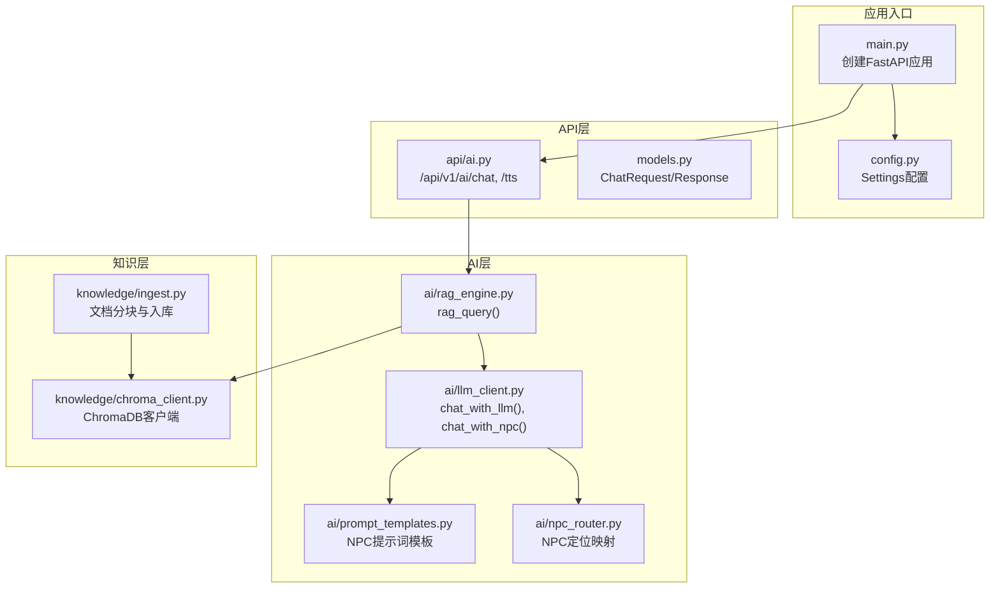
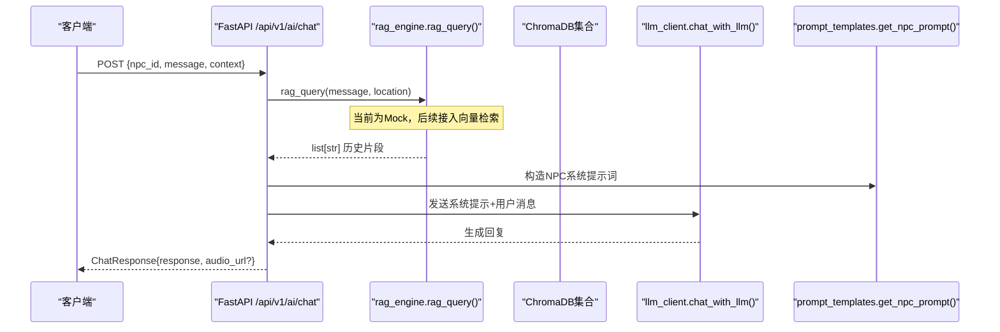
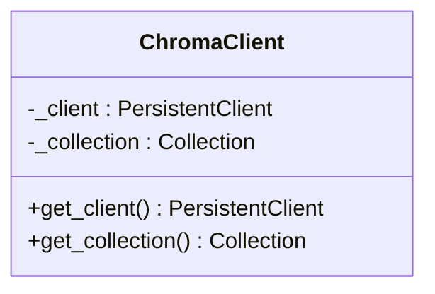
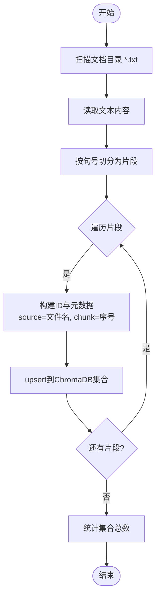
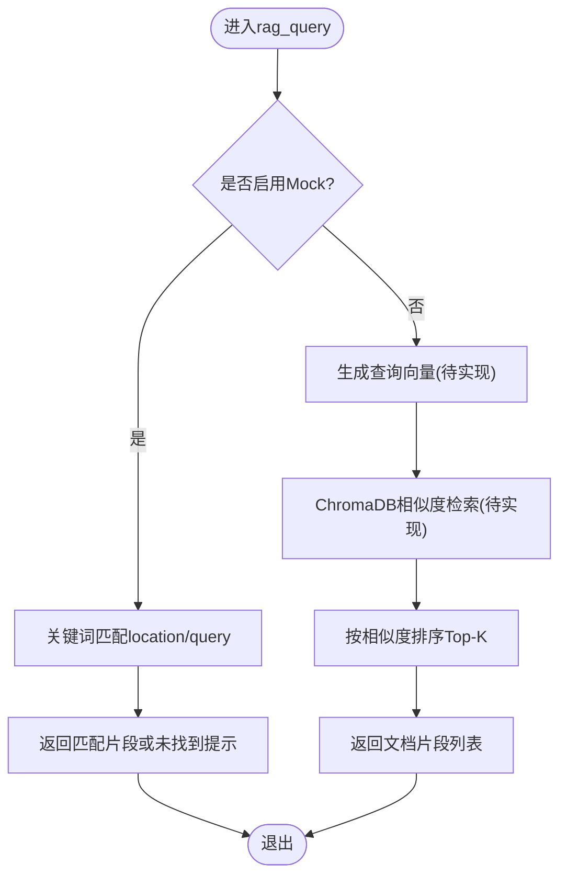
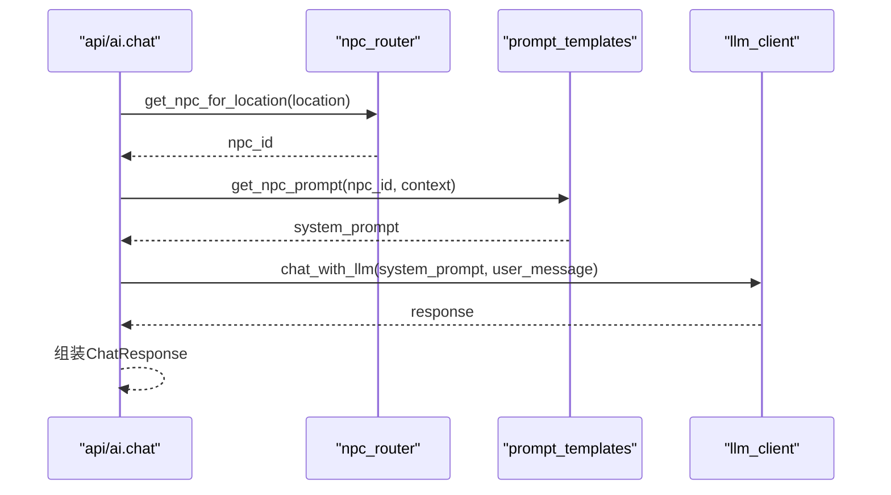
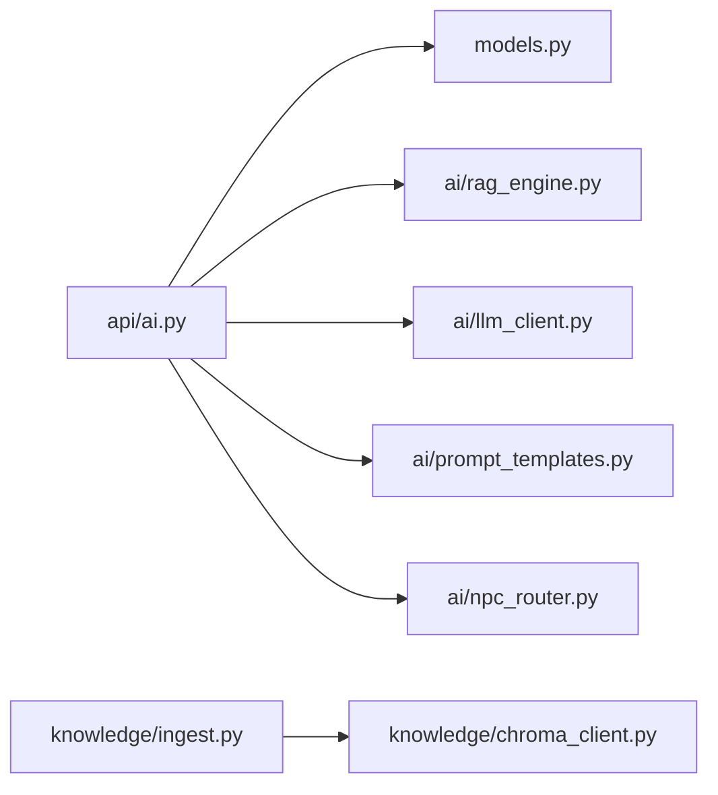

# RAG知识检索接口

<cite>
**本文引用的文件**   
- [backend/app/knowledge/chroma_client.py](file://backend/app/knowledge/chroma_client.py)
- [backend/app/knowledge/ingest.py](file://backend/app/knowledge/ingest.py)
- [backend/app/ai/rag_engine.py](file://backend/app/ai/rag_engine.py)
- [backend/app/api/ai.py](file://backend/app/api/ai.py)
- [backend/app/models.py](file://backend/app/models.py)
- [backend/app/main.py](file://backend/app/main.py)
- [backend/app/config.py](file://backend/app/config.py)
- [backend/app/ai/llm_client.py](file://backend/app/ai/llm_client.py)
- [backend/app/ai/prompt_templates.py](file://backend/app/ai/prompt_templates.py)
- [backend/app/ai/npc_router.py](file://backend/app/ai/npc_router.py)
</cite>

## 目录
1. [简介](#简介)
2. [项目结构](#项目结构)
3. [核心组件](#核心组件)
4. [架构总览](#架构总览)
5. [详细组件分析](#详细组件分析)
6. [依赖关系分析](#依赖关系分析)
7. [性能考虑](#性能考虑)
8. [故障排查指南](#故障排查指南)
9. [结论](#结论)
10. [附录：API定义与示例](#附录api定义与示例)

## 简介
本文件为“RAG知识检索接口”的详细技术文档，聚焦向量数据库查询、语义搜索与文档索引管理。当前仓库实现了ChromaDB客户端与文档入库流程，并提供RAG引擎的占位实现；LLM调用与NPC对话路由已就绪，便于后续接入真实向量检索与生成式回答。文档涵盖数据导入、分块策略、元数据管理、相似度计算、批量操作、增量更新、索引优化、缓存策略、扩展性设计以及故障恢复与一致性保证方案，并给出端到端使用示例。

## 项目结构
后端采用FastAPI模块化组织，RAG相关代码集中在knowledge与ai两个子模块：
- knowledge：ChromaDB客户端封装与文档摄取（分块、上库）
- ai：RAG引擎、LLM客户端、提示词模板、NPC路由
- api：对外暴露的HTTP路由（当前AI聊天为Mock，预留接入点）
- models：请求/响应模型定义
- main：应用启动、中间件、路由注册与健康检查
- config：运行时配置（CORS、数据库等）

**图示来源** 
- [backend/app/main.py:17-111](file://backend/app/main.py#L17-L111)
- [backend/app/api/ai.py:1-29](file://backend/app/api/ai.py#L1-L29)
- [backend/app/ai/rag_engine.py:1-13](file://backend/app/ai/rag_engine.py#L1-L13)
- [backend/app/ai/llm_client.py:1-32](file://backend/app/ai/llm_client.py#L1-L32)
- [backend/app/ai/prompt_templates.py:1-37](file://backend/app/ai/prompt_templates.py#L1-L37)
- [backend/app/ai/npc_router.py:1-18](file://backend/app/ai/npc_router.py#L1-L18)
- [backend/app/knowledge/chroma_client.py:1-19](file://backend/app/knowledge/chroma_client.py#L1-L19)
- [backend/app/knowledge/ingest.py:1-36](file://backend/app/knowledge/ingest.py#L1-L36)
- [backend/app/config.py:1-77](file://backend/app/config.py#L1-L77)

**章节来源**
- [backend/app/main.py:17-111](file://backend/app/main.py#L17-L111)
- [backend/app/config.py:1-77](file://backend/app/config.py#L1-L77)

## 核心组件
- ChromaDB客户端：提供持久化客户端与集合获取，单例模式避免重复初始化。
- 文档摄取：按句号切分文本为片段，生成唯一ID与元数据（来源文件、片段序号），批量upsert到集合。
- RAG引擎：当前为Mock实现，预留接入ChromaDB与嵌入向量的扩展点。
- LLM客户端：基于OpenAI兼容接口的异步调用，支持系统提示词与用户消息。
- 提示词模板：为不同NPC角色注入场景与线索上下文。
- NPC路由：根据位置选择对应NPC身份与音色。

**章节来源**
- [backend/app/knowledge/chroma_client.py:1-19](file://backend/app/knowledge/chroma_client.py#L1-L19)
- [backend/app/knowledge/ingest.py:1-36](file://backend/app/knowledge/ingest.py#L1-L36)
- [backend/app/ai/rag_engine.py:1-13](file://backend/app/ai/rag_engine.py#L1-L13)
- [backend/app/ai/llm_client.py:1-32](file://backend/app/ai/llm_client.py#L1-L32)
- [backend/app/ai/prompt_templates.py:1-37](file://backend/app/ai/prompt_templates.py#L1-L37)
- [backend/app/ai/npc_router.py:1-18](file://backend/app/ai/npc_router.py#L1-L18)

## 架构总览
RAG整体流程分为两条主线：
- 知识入库线：读取本地txt文档 → 分句切块 → 生成ID与元数据 → upsert至ChromaDB集合
- 知识检索线：接收用户查询 → 构建语义向量（待实现）→ 相似度检索 → 返回Top-K片段 → 结合LLM生成回答（可选）

**图示来源** 
- [backend/app/api/ai.py:15-21](file://backend/app/api/ai.py#L15-L21)
- [backend/app/ai/rag_engine.py:3-12](file://backend/app/ai/rag_engine.py#L3-L12)
- [backend/app/ai/llm_client.py:12-31](file://backend/app/ai/llm_client.py#L12-L31)
- [backend/app/ai/prompt_templates.py:32-36](file://backend/app/ai/prompt_templates.py#L32-L36)

## 详细组件分析

### ChromaDB客户端
- 职责：维护全局PersistentClient与Collection实例，懒加载避免重复开销。
- 关键点：
  - 路径固定为./chroma_db，生产环境建议通过环境变量或配置中心注入。
  - 集合名称macau_history，附带描述元数据便于治理。
- 扩展建议：
  - 增加连接池与重试机制。
  - 支持多集合命名空间（如按版本或业务域）。

**图示来源** 
- [backend/app/knowledge/chroma_client.py:1-19](file://backend/app/knowledge/chroma_client.py#L1-L19)

**章节来源**
- [backend/app/knowledge/chroma_client.py:1-19](file://backend/app/knowledge/chroma_client.py#L1-L19)

### 文档摄取与分块
- 职责：扫描指定目录下的txt文件，按句号切分为片段，生成唯一ID与元数据后批量写入集合。
- 分块策略：
  - 以中文句号“。”为边界进行切分，控制每段长度不超过chunk_size（默认500字符）。
  - 保持句子完整性，避免跨句截断。
- 元数据管理：
  - source：原始文件名，便于溯源与过滤。
  - chunk：片段序号，用于排序与拼接。
- 幂等性：
  - 使用upsert，相同id会覆盖旧记录，适合增量更新。

**图示来源** 
- [backend/app/knowledge/ingest.py:6-32](file://backend/app/knowledge/ingest.py#L6-L32)

**章节来源**
- [backend/app/knowledge/ingest.py:1-36](file://backend/app/knowledge/ingest.py#L1-L36)

### RAG引擎（检索增强生成）
- 现状：当前为Mock实现，基于关键词匹配返回预设片段。
- 目标：接入ChromaDB进行语义检索，结合LLM生成回答。
- 接口：
  - rag_query(query, location) -> list[str]

**图示来源** 
- [backend/app/ai/rag_engine.py:3-12](file://backend/app/ai/rag_engine.py#L3-L12)

**章节来源**
- [backend/app/ai/rag_engine.py:1-13](file://backend/app/ai/rag_engine.py#L1-L13)

### LLM客户端与NPC对话
- 职责：通过OpenAI兼容接口调用大模型，支持系统提示词与温度、最大token等参数。
- NPC路由：根据位置选择NPC身份，注入场景与线索上下文到提示词模板。
- 错误处理：捕获异常并返回友好提示。

**图示来源** 
- [backend/app/api/ai.py:15-21](file://backend/app/api/ai.py#L15-L21)
- [backend/app/ai/npc_router.py:10-17](file://backend/app/ai/npc_router.py#L10-L17)
- [backend/app/ai/prompt_templates.py:32-36](file://backend/app/ai/prompt_templates.py#L32-L36)
- [backend/app/ai/llm_client.py:12-31](file://backend/app/ai/llm_client.py#L12-L31)

**章节来源**
- [backend/app/ai/llm_client.py:1-32](file://backend/app/ai/llm_client.py#L1-L32)
- [backend/app/ai/prompt_templates.py:1-37](file://backend/app/ai/prompt_templates.py#L1-L37)
- [backend/app/ai/npc_router.py:1-18](file://backend/app/ai/npc_router.py#L1-L18)
- [backend/app/api/ai.py:1-29](file://backend/app/api/ai.py#L1-L29)

### 配置与应用启动
- 配置项：数据库URL、CORS源、运行环境、演示数据开关、认证令牌TTL、演示账号等。
- 启动流程：注册中间件、挂载路由、健康检查、异常处理器。

**章节来源**
- [backend/app/config.py:1-77](file://backend/app/config.py#L1-L77)
- [backend/app/main.py:17-111](file://backend/app/main.py#L17-L111)

## 依赖关系分析
- 模块耦合：
  - api/ai依赖models与ai/rag_engine、ai/llm_client、ai/prompt_templates、ai/npc_router。
  - knowledge/ingest依赖knowledge/chroma_client。
  - rag_engine当前未直接依赖chroma_client，但应逐步集成。
- 外部依赖：
  - chromadb：向量数据库客户端。
  - openai：异步LLM客户端。
- 潜在循环依赖：当前无循环引用；未来在rag_engine中引入chroma_client时需注意导入顺序与延迟加载。

**图示来源** 
- [backend/app/api/ai.py:1-29](file://backend/app/api/ai.py#L1-L29)
- [backend/app/models.py:95-108](file://backend/app/models.py#L95-L108)
- [backend/app/ai/rag_engine.py:1-13](file://backend/app/ai/rag_engine.py#L1-L13)
- [backend/app/ai/llm_client.py:1-32](file://backend/app/ai/llm_client.py#L1-L32)
- [backend/app/ai/prompt_templates.py:1-37](file://backend/app/ai/prompt_templates.py#L1-L37)
- [backend/app/ai/npc_router.py:1-18](file://backend/app/ai/npc_router.py#L1-L18)
- [backend/app/knowledge/ingest.py:1-36](file://backend/app/knowledge/ingest.py#L1-L36)
- [backend/app/knowledge/chroma_client.py:1-19](file://backend/app/knowledge/chroma_client.py#L1-L19)

**章节来源**
- [backend/app/main.py:84-96](file://backend/app/main.py#L84-L96)

## 性能考虑
- 向量检索性能：
  - 合理设置chunk_size，避免过短导致信息碎片化，过长影响相似度精度。
  - 对高频查询结果做内存缓存（LRU），降低重复检索开销。
- 并发与I/O：
  - 使用异步LLM调用与ChromaDB客户端，避免阻塞事件循环。
  - 批量upsert减少网络往返。
- 资源与存储：
  - ChromaDB持久化路径需监控磁盘占用，定期清理无用集合或归档历史版本。
  - 为LLM调用设置超时与重试上限，防止雪崩。
- 可扩展性：
  - 将ChromaDB客户端抽象为可插拔接口，支持替换为Milvus、Weaviate等。
  - 嵌入模型可通过配置切换（如bge-m3、text-embedding-ada-002）。

[本节为通用指导，不直接分析具体文件]

## 故障排查指南
- 常见问题：
  - ChromaDB路径不存在或权限不足：检查./chroma_db是否存在且可写。
  - 文档目录缺失：确保DOCS_DIR存在且包含*.txt文件。
  - LLM调用失败：检查SILICONFLOW_API_KEY与BASE_URL是否正确，网络可达。
  - CORS跨域问题：确认CORS_ORIGINS包含前端地址。
- 诊断步骤：
  - 查看健康检查接口状态码与数据库可用性。
  - 打印ingest日志，确认片段数量与集合计数一致。
  - 在rag_query中增加调试输出，验证Mock返回是否符合预期。
- 恢复策略：
  - 对ChromaDB集合执行重建（删除后重新ingest）。
  - 对LLM调用增加指数退避重试与熔断。

**章节来源**
- [backend/app/main.py:98-105](file://backend/app/main.py#L98-L105)
- [backend/app/knowledge/ingest.py:17-32](file://backend/app/knowledge/ingest.py#L17-L32)
- [backend/app/ai/llm_client.py:12-25](file://backend/app/ai/llm_client.py#L12-L25)

## 结论
当前仓库已具备RAG的基础骨架：ChromaDB客户端与文档摄取流程完备，LLM与NPC对话链路清晰。下一步重点是将rag_engine与ChromaDB深度集成，实现真正的语义检索与相似度排序，并结合缓存与批处理提升性能。同时完善配置化管理与监控告警，保障生产稳定性与可观测性。

[本节为总结性内容，不直接分析具体文件]

## 附录：API定义与示例

### 接口定义
- POST /api/v1/ai/chat
  - 请求体：ChatRequest（npc_id, message, context）
  - 响应体：ChatResponse（response, audio_url?）
- GET /api/v1/ai/tts
  - 查询参数：text, voice
  - 响应体：TtsResponse（audio_url, text）

**章节来源**
- [backend/app/api/ai.py:15-28](file://backend/app/api/ai.py#L15-L28)
- [backend/app/models.py:95-108](file://backend/app/models.py#L95-L108)

### 完整检索示例（端到端）
- 步骤：
  1) 准备知识库：运行ingest_documents，将macau_docs/*.txt分块并入库ChromaDB。
  2) 发起检索：POST /api/v1/ai/chat，携带npc_id、message与context（含location与clues）。
  3) 结果处理：解析ChatResponse.response，必要时结合audio_url播放语音。
- 注意事项：
  - 当前rag_query为Mock，返回结果为关键词匹配；接入ChromaDB后将返回语义相似片段。
  - 建议在context中传入location与已收集线索，提升NPC回答的相关性与沉浸感。

**章节来源**
- [backend/app/knowledge/ingest.py:17-32](file://backend/app/knowledge/ingest.py#L17-L32)
- [backend/app/ai/rag_engine.py:3-12](file://backend/app/ai/rag_engine.py#L3-L12)
- [backend/app/api/ai.py:15-21](file://backend/app/api/ai.py#L15-L21)

### 批量操作与增量更新
- 批量入库：ingest_documents遍历所有txt文件，逐文件内按片段upsert，天然支持批量写入。
- 增量更新：
  - 新增文档：再次运行ingest_documents，新文件会被扫描并入库。
  - 修改文档：由于upsert按id覆盖，若需保留历史版本，可在id中加入版本号或时间戳。
  - 删除文档：ChromaDB集合未提供批量删除接口，可在应用层维护映射表，查询时过滤。

**章节来源**
- [backend/app/knowledge/ingest.py:23-31](file://backend/app/knowledge/ingest.py#L23-L31)

### 索引优化建议
- 分块策略：
  - 调整chunk_size以平衡召回率与精确度；中文可按标点与段落双重切分。
  - 为每个片段附加更丰富的元数据（如标题、作者、发布时间），便于过滤与排序。
- 相似度算法：
  - 选择合适的嵌入模型与距离度量（余弦相似度常用）。
  - 对查询进行去噪与同义词扩展，提升召回质量。
- 缓存策略：
  - 对热门查询结果进行短期缓存（如Redis），设置TTL与失效策略。
  - 对嵌入向量进行缓存，避免重复计算。

[本节为通用指导，不直接分析具体文件]