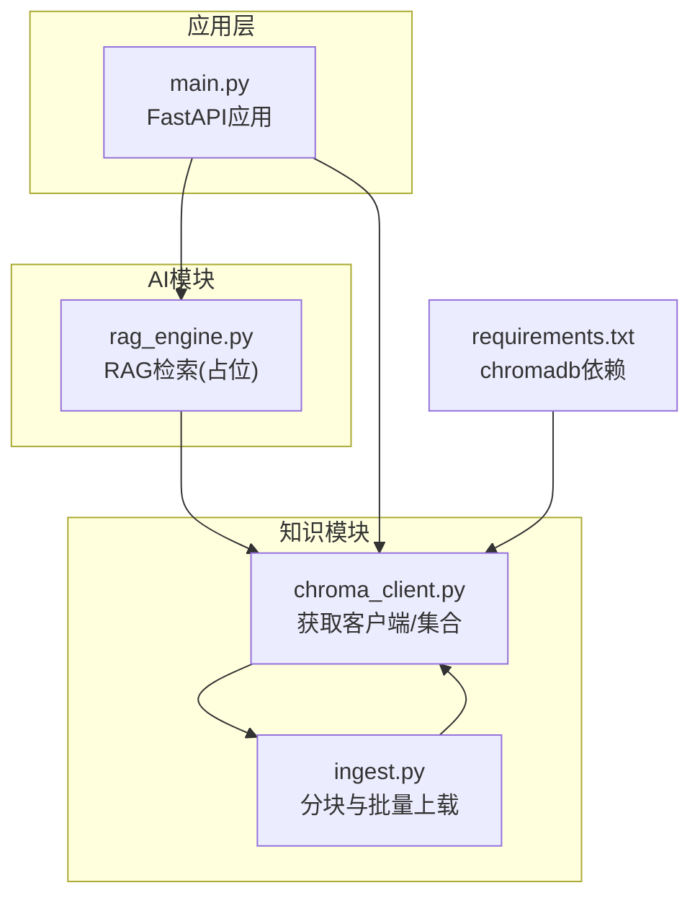
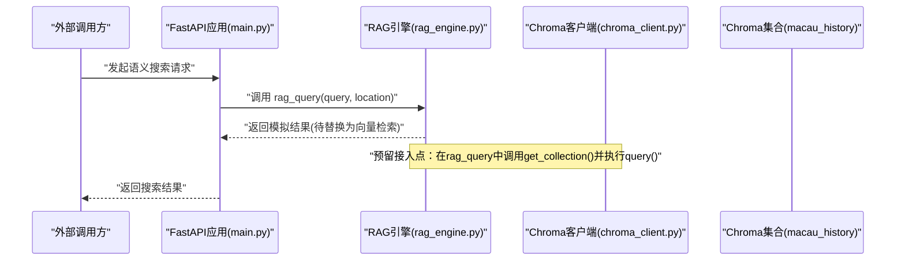
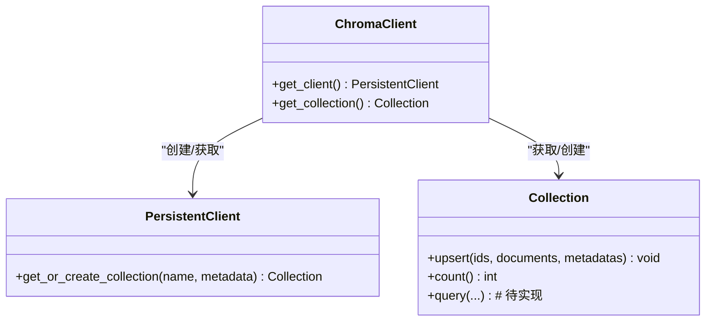
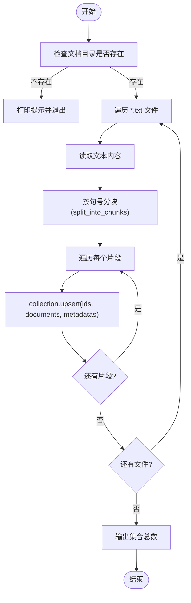
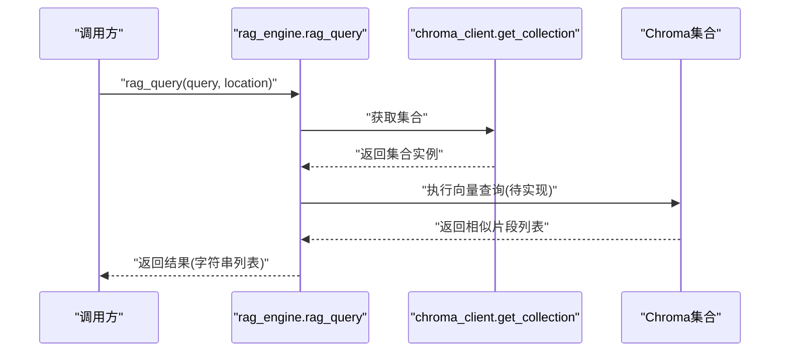
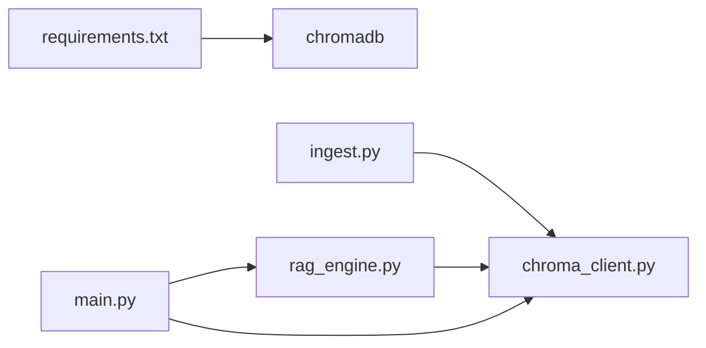
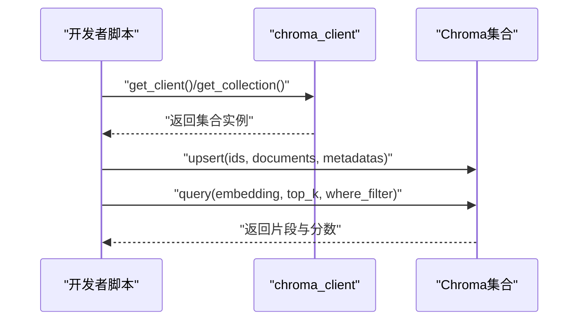

# 向量数据库接口

<cite>
**本文引用的文件**   
- [chroma_client.py](file://backend/app/knowledge/chroma_client.py)
- [ingest.py](file://backend/app/knowledge/ingest.py)
- [rag_engine.py](file://backend/app/ai/rag_engine.py)
- [main.py](file://backend/app/main.py)
- [requirements.txt](file://backend/requirements.txt)
</cite>

## 目录
1. [简介](#简介)
2. [项目结构](#项目结构)
3. [核心组件](#核心组件)
4. [架构总览](#架构总览)
5. [详细组件分析](#详细组件分析)
6. [依赖关系分析](#依赖关系分析)
7. [性能考虑](#性能考虑)
8. [故障排查指南](#故障排查指南)
9. [结论](#结论)
10. [附录：API与使用示例](#附录api与使用示例)

## 简介
本文件面向后端服务中的向量知识库模块，聚焦于基于 ChromaDB 的向量存储、查询与管理能力。当前仓库已实现：
- 集合创建与获取（持久化客户端）
- 文档分块与批量上载（upsert）
- RAG 检索引擎占位（待接入向量检索）

本文将系统化说明现有接口的职责边界、数据结构约定、扩展点与最佳实践，并给出后续接入向量检索的完整方案建议（包括嵌入生成、索引策略、过滤与批处理）。

## 项目结构
与向量数据库相关的代码主要位于 knowledge 与 ai 两个子模块：
- knowledge.chroma_client：ChromaDB 持久化客户端与集合单例
- knowledge.ingest：文本分块与批量 upsert 入库
- ai.rag_engine：RAG 检索引擎（当前为模拟实现，预留接入点）
- main：应用入口与路由注册（用于后续挂载向量检索 API）
- requirements.txt：依赖声明（包含 chromadb）

图表来源
- [chroma_client.py:1-18](file://backend/app/knowledge/chroma_client.py#L1-L18)
- [ingest.py:1-36](file://backend/app/knowledge/ingest.py#L1-L36)
- [rag_engine.py:1-13](file://backend/app/ai/rag_engine.py#L1-L13)
- [main.py:84-96](file://backend/app/main.py#L84-L96)
- [requirements.txt:9](file://backend/requirements.txt#L9)

章节来源
- [chroma_client.py:1-18](file://backend/app/knowledge/chroma_client.py#L1-L18)
- [ingest.py:1-36](file://backend/app/knowledge/ingest.py#L1-L36)
- [rag_engine.py:1-13](file://backend/app/ai/rag_engine.py#L1-L13)
- [main.py:84-96](file://backend/app/main.py#L84-L96)
- [requirements.txt:9](file://backend/requirements.txt#L9)

## 核心组件
- 客户端与集合管理
  - 提供进程级单例的 PersistentClient 与集合实例，避免重复初始化开销
  - 集合名称固定为“macau_history”，附带描述性元数据
- 文档摄取
  - 按句号切分中文文本为片段（默认长度阈值约500字符）
  - 对每个片段执行 upsert，附带 source 与 chunk 序号等元数据
- RAG 检索引擎
  - 当前为内存模拟返回；函数签名预留 query 与 location 参数，便于后续接入向量检索

章节来源
- [chroma_client.py:7-18](file://backend/app/knowledge/chroma_client.py#L7-L18)
- [ingest.py:6-32](file://backend/app/knowledge/ingest.py#L6-L32)
- [rag_engine.py:3-12](file://backend/app/ai/rag_engine.py#L3-L12)

## 架构总览
下图展示从应用入口到向量库的调用路径与扩展点。当前 RAG 引擎未实际调用 ChromaDB，但提供了清晰的集成位置。

图表来源
- [main.py:84-96](file://backend/app/main.py#L84-L96)
- [rag_engine.py:3-12](file://backend/app/ai/rag_engine.py#L3-L12)
- [chroma_client.py:7-18](file://backend/app/knowledge/chroma_client.py#L7-L18)

## 详细组件分析

### ChromaDB 客户端与集合
- 职责
  - get_client：懒加载并缓存进程内 PersistentClient，指向本地 ./chroma_db 目录
  - get_collection：懒加载并缓存集合 macau_history，附带描述元数据
- 设计要点
  - 全局单例减少连接与集合打开成本
  - 通过 get_or_create_collection 确保集合存在且可复用
- 扩展建议
  - 增加维度与距离度量配置（如 embedding_dim、metric）
  - 支持多集合命名空间（按业务域隔离）

图表来源
- [chroma_client.py:7-18](file://backend/app/knowledge/chroma_client.py#L7-L18)

章节来源
- [chroma_client.py:7-18](file://backend/app/knowledge/chroma_client.py#L7-L18)

### 文档摄取与批量上载
- 职责
  - split_into_chunks：按中文句号进行分块，控制每块近似长度
  - ingest_documents：遍历 docs 目录，读取文本、分块、逐块 upsert 至集合
- 数据结构约定
  - ids：唯一标识，形如 “文件名_chunk_序号”
  - documents：原始文本片段
  - metadatas：{"source": 文件名, "chunk": 序号}
- 错误处理
  - 若文档目录不存在则打印提示并退出
  - 逐文件处理，单个失败不影响其他文件
- 优化建议
  - 批量 upsert 合并多个片段以减少往返
  - 预计算 id 列表与元数据列表，减少循环内拼接

图表来源
- [ingest.py:6-32](file://backend/app/knowledge/ingest.py#L6-L32)

章节来源
- [ingest.py:6-32](file://backend/app/knowledge/ingest.py#L6-L32)

### RAG 检索引擎（占位）
- 现状
  - rag_query 当前返回内存模拟结果，未调用 ChromaDB
- 接入点
  - 在函数体内调用 get_collection() 获取集合
  - 将 query 转换为嵌入向量后执行集合查询（需配合嵌入模型）
  - 根据相似度排序返回 top-k 片段，并可结合 location 做二次过滤
- 返回值约定
  - 返回字符串列表，表示相关历史知识片段

图表来源
- [rag_engine.py:3-12](file://backend/app/ai/rag_engine.py#L3-L12)
- [chroma_client.py:13-18](file://backend/app/knowledge/chroma_client.py#L13-L18)

章节来源
- [rag_engine.py:3-12](file://backend/app/ai/rag_engine.py#L3-L12)

## 依赖关系分析
- 运行时依赖
  - chromadb==0.5.11：向量数据库客户端
  - fastapi/uvicorn：Web 框架与服务启动
- 模块耦合
  - ingest 依赖 chroma_client 提供的集合
  - rag_engine 预留依赖 chroma_client 的集合访问
  - main 负责路由注册，未来可将向量检索 API 挂载到 /api/v1/ai

图表来源
- [requirements.txt:9](file://backend/requirements.txt#L9)
- [ingest.py:17-32](file://backend/app/knowledge/ingest.py#L17-L32)
- [rag_engine.py:3-12](file://backend/app/ai/rag_engine.py#L3-L12)
- [main.py:84-96](file://backend/app/main.py#L84-L96)

章节来源
- [requirements.txt:9](file://backend/requirements.txt#L9)
- [ingest.py:17-32](file://backend/app/knowledge/ingest.py#L17-L32)
- [rag_engine.py:3-12](file://backend/app/ai/rag_engine.py#L3-L12)
- [main.py:84-96](file://backend/app/main.py#L84-L96)

## 性能考虑
- 索引与集合配置
  - 建议在集合创建时显式指定 embedding 维度与距离度量（如 cosine），以匹配所用嵌入模型
  - 合理设置集合元数据，便于后续按来源或版本筛选
- 批处理与事务
  - 将多个片段的 ids/documents/metadatas 合并为一次 upsert，降低网络与磁盘 IO
  - 对于大规模导入，可在应用层实现分批提交与重试机制
- 查询优化
  - 限制返回数量 top_k，避免过大响应体
  - 先进行粗排（向量相似度），再结合元数据进行精排（如按来源权重）
- 缓存策略
  - 对高频查询结果进行短期缓存（如 LRU），注意失效策略
  - 对嵌入向量可考虑缓存，避免重复计算
- 资源与存储
  - 使用持久化客户端与集合单例，减少启动开销
  - 定期清理无用片段与重建索引，保持集合规模可控

[本节为通用指导，不直接分析具体文件]

## 故障排查指南
- 常见问题
  - 文档目录不存在：ingest 会打印提示并退出，检查 DOCS_DIR 路径与权限
  - 集合未创建：首次运行会自动创建；若异常，检查 chroma_db 目录写入权限
  - 重复 ID：upsert 会覆盖已有记录，确保 id 唯一性
- 日志与诊断
  - 在 ingest 过程中打印每个文件的片段数与总数，便于定位问题
  - 在 rag_query 中增加关键步骤日志（如查询耗时、命中数量）
- 恢复措施
  - 删除 chroma_db 目录后重新运行 ingest 以重建索引
  - 对失败批次进行增量补录

章节来源
- [ingest.py:17-32](file://backend/app/knowledge/ingest.py#L17-L32)

## 结论
当前仓库已具备 ChromaDB 的基础能力：持久化客户端与集合单例、文档分块与批量 upsert。RAG 检索引擎仍为占位实现，预留了清晰的接入点。下一步应完成嵌入向量的生成与存储、向量查询与过滤、以及对外 API 的封装与优化，以实现完整的语义检索能力。

[本节为总结性内容，不直接分析具体文件]

## 附录：API与使用示例
以下示例仅展示调用流程与数据结构约定，不包含具体代码实现。

- 连接数据库与获取集合
  - 调用 get_client() 获取持久化客户端
  - 调用 get_collection() 获取或创建集合 macau_history
- 插入向量与元数据
  - 准备 ids、documents、metadatas 三个列表
  - 调用 collection.upsert(ids, documents, metadatas) 批量上载
- 执行语义搜索
  - 将用户查询转换为嵌入向量
  - 调用集合的查询接口，传入向量与 top_k
  - 可选：通过 metadatas 进行过滤（如 source、chunk）
- 处理查询结果
  - 返回片段文本与相关度分数
  - 可按业务规则进行重排与摘要

[本图为概念流程图，不映射具体源码行号]