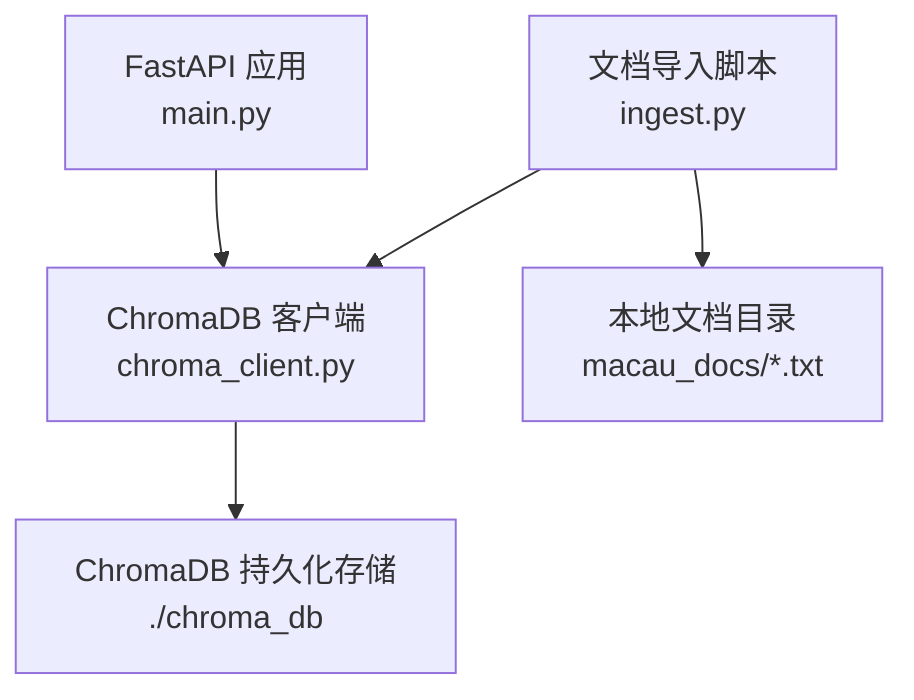
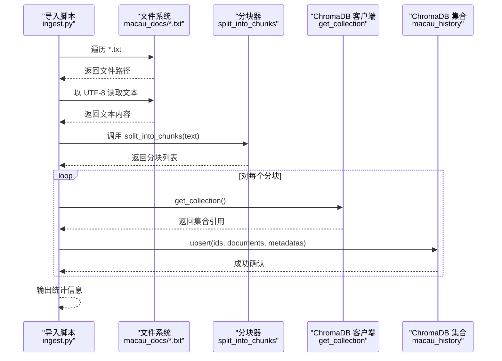
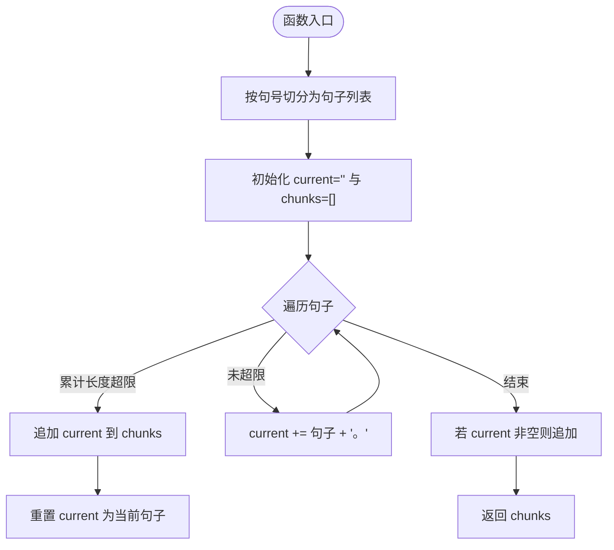
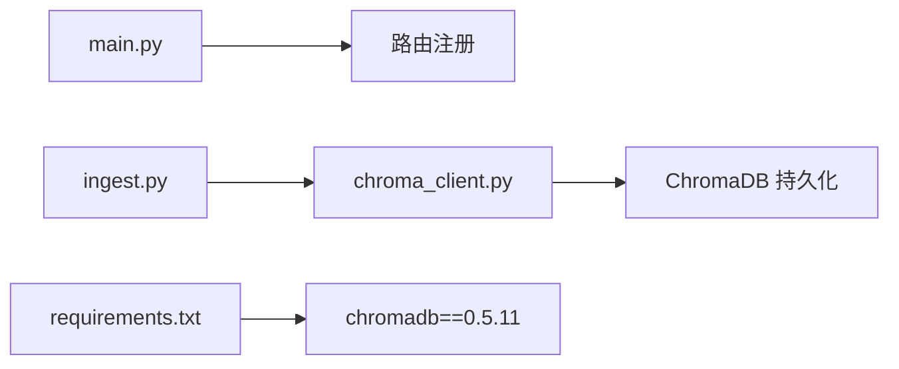

# 文档导入接口

<cite>
**本文引用的文件**   
- [ingest.py](file://backend/app/knowledge/ingest.py)
- [chroma_client.py](file://backend/app/knowledge/chroma_client.py)
- [main.py](file://backend/app/main.py)
- [requirements.txt](file://backend/requirements.txt)
- [a_ma_temple.txt](file://backend/app/knowledge/macau_docs/a_ma_temple.txt)
- [dom_pedro_theatre.txt](file://backend/app/knowledge/macau_docs/dom_pedro_theatre.txt)
</cite>

## 目录
1. [简介](#简介)
2. [项目结构](#项目结构)
3. [核心组件](#核心组件)
4. [架构总览](#架构总览)
5. [详细组件分析](#详细组件分析)
6. [依赖关系分析](#依赖关系分析)
7. [性能考虑](#性能考虑)
8. [故障排查指南](#故障排查指南)
9. [结论](#结论)
10. [附录：API 规范与示例](#附录api-规范与示例)

## 简介
本文件面向“文档导入接口”的完整实现说明，覆盖文档预处理、分块策略、向量化入库流程，以及批量导入、增量更新与冲突处理方案。当前代码库已提供基于本地文本文件的知识库导入能力（TXT），并集成 ChromaDB 进行向量检索存储。本文在现有实现基础上，给出可扩展的设计建议与最佳实践，帮助读者在不改动现有代码的前提下理解并扩展该能力。

## 项目结构
与文档导入相关的关键位置如下：
- 知识库客户端：backend/app/knowledge/chroma_client.py
- 文档导入脚本：backend/app/knowledge/ingest.py
- 应用入口与路由挂载：backend/app/main.py
- 依赖声明：backend/requirements.txt
- 示例文档：backend/app/knowledge/macau_docs/*.txt

图表来源 
- [main.py:17-110](file://backend/app/main.py#L17-L110)
- [chroma_client.py:1-19](file://backend/app/knowledge/chroma_client.py#L1-L19)
- [ingest.py:1-36](file://backend/app/knowledge/ingest.py#L1-L36)

章节来源
- [main.py:17-110](file://backend/app/main.py#L17-L110)
- [chroma_client.py:1-19](file://backend/app/knowledge/chroma_client.py#L1-L19)
- [ingest.py:1-36](file://backend/app/knowledge/ingest.py#L1-L36)

## 核心组件
- 文档分块器：按中文句号切分，控制每块长度上限，避免过长片段影响检索质量。
- 文档读取器：从 macau_docs 目录扫描 *.txt 文件，UTF-8 编码读取。
- 向量入库器：将每个分块以唯一 ID 写入 ChromaDB 集合，附带源文件名与分块序号等元数据。
- ChromaDB 客户端：单例模式管理持久化客户端与集合，确保进程内复用。

章节来源
- [ingest.py:6-15](file://backend/app/knowledge/ingest.py#L6-L15)
- [ingest.py:17-33](file://backend/app/knowledge/ingest.py#L17-L33)
- [chroma_client.py:7-18](file://backend/app/knowledge/chroma_client.py#L7-L18)

## 架构总览
下图展示从本地 TXT 到向量库的端到端流程，包括分块、元数据标注与 upsert 操作。

图表来源 
- [ingest.py:17-33](file://backend/app/knowledge/ingest.py#L17-L33)
- [chroma_client.py:13-18](file://backend/app/knowledge/chroma_client.py#L13-L18)

## 详细组件分析

### 分块算法与配置
- 切分规则：以中文句号“。”为边界进行句子级切分，累积拼接直到超过 chunk_size 阈值后截断为新块。
- 默认参数：chunk_size=500（字符数）。
- 上下文保持：当前实现未使用重叠（overlap）机制；如需增强语义连贯性，可在相邻块间引入固定比例的重叠句段。
- 复杂度：线性时间 O(n)，n 为文本长度；空间复杂度 O(n) 用于构建分块列表。

图表来源 
- [ingest.py:6-15](file://backend/app/knowledge/ingest.py#L6-L15)

章节来源
- [ingest.py:6-15](file://backend/app/knowledge/ingest.py#L6-L15)

### 文档读取与预处理
- 支持格式：当前仅支持 TXT（*.txt）。
- 编码处理：强制 UTF-8 编码读取。
- 清洗规则：当前未做额外清洗（如去除空白、HTML 标签等），可直接扩展正则或第三方库进行清洗。
- 错误处理：若目录不存在则打印提示并退出；文件读取异常需在上层捕获并记录日志。

章节来源
- [ingest.py:17-33](file://backend/app/knowledge/ingest.py#L17-L33)

### 向量入库与元数据
- 集合名称：macau_history
- 元数据结构：每条记录包含 source（源文件名）、chunk（分块序号）
- ID 生成策略：{文件名前缀}_chunk_{索引}，保证同文件内唯一
- 写入方式：upsert，具备幂等覆盖能力（相同 ID 会覆盖旧值）

章节来源
- [ingest.py:28-31](file://backend/app/knowledge/ingest.py#L28-L31)
- [chroma_client.py:13-18](file://backend/app/knowledge/chroma_client.py#L13-L18)

### 批量导入与增量更新
- 批量导入：脚本自动扫描 macau_docs 目录下所有 *.txt 并依次入库。
- 增量更新：由于采用 upsert 且 ID 稳定，重复运行可安全覆盖已有分块，实现增量更新。
- 冲突处理：ID 冲突时直接覆盖；如需保留历史版本，可在 ID 中附加版本号或时间戳。

章节来源
- [ingest.py:23-32](file://backend/app/knowledge/ingest.py#L23-L32)

### 向量化机制
- 当前实现未显式调用嵌入模型，ChromaDB 会在 upsert 时根据配置完成向量化（由 chromadb 内部负责）。
- 如需自定义嵌入模型或维度，应在 ChromaDB 客户端初始化时指定相应参数。

章节来源
- [chroma_client.py:1-18](file://backend/app/knowledge/chroma_client.py#L1-L18)

## 依赖关系分析
- FastAPI 应用通过 main.py 启动，但文档导入目前以独立脚本 ingest.py 执行，未暴露 HTTP API。
- ChromaDB 作为外部依赖，版本在 requirements.txt 中声明。

图表来源 
- [main.py:84-96](file://backend/app/main.py#L84-L96)
- [ingest.py:17-33](file://backend/app/knowledge/ingest.py#L17-L33)
- [chroma_client.py:1-18](file://backend/app/knowledge/chroma_client.py#L1-L18)
- [requirements.txt:9](file://backend/requirements.txt#L9-L9)

章节来源
- [main.py:84-96](file://backend/app/main.py#L84-L96)
- [requirements.txt:1-17](file://backend/requirements.txt#L1-L17)

## 性能考虑
- 分块复杂度：O(n)，适合中等规模文本；超大文件建议流式读取与分批处理。
- 写入吞吐：ChromaDB upsert 为批量操作，建议合并批次以提升吞吐。
- 内存占用：一次性加载全文至内存，建议对大文件进行分块读取。
- 并发导入：当前为串行处理，可通过线程池或异步任务提升并行度。

[本节为通用指导，不直接分析具体文件]

## 故障排查指南
- 目录不存在：当 macau_docs 目录缺失时，导入脚本会打印提示并退出。请检查路径与权限。
- 编码错误：确保所有 TXT 文件为 UTF-8 编码，否则读取时会抛出异常。
- 集合创建失败：检查 ChromaDB 路径 ./chroma_db 是否可写，以及磁盘空间是否充足。
- 重复导入导致覆盖：因 ID 稳定，重复运行会覆盖旧分块。如需保留历史，请在 ID 中加入版本标识。

章节来源
- [ingest.py:20-22](file://backend/app/knowledge/ingest.py#L20-L22)
- [chroma_client.py:10-11](file://backend/app/knowledge/chroma_client.py#L10-L11)

## 结论
当前实现提供了简洁可靠的 TXT 文档导入与向量入库能力，适用于快速搭建知识库原型。建议在后续迭代中补充以下能力：
- 多格式支持（PDF、DOCX）与文本清洗
- 分块重叠与上下文保持
- 增量版本管理与冲突解决策略
- 通过 FastAPI 暴露导入 API，便于前端触发与进度反馈

[本节为总结性内容，不直接分析具体文件]

## 附录：API 规范与示例

### 支持的文档格式与编码
- 当前支持：TXT（UTF-8）
- 建议扩展：PDF、DOCX（需解析为纯文本后再进入分块流程）

章节来源
- [ingest.py:23-26](file://backend/app/knowledge/ingest.py#L23-L26)

### 文本清洗规则（建议）
- 去除多余空白与不可见字符
- 清理 HTML/XML 标签与脚本
- 统一标点与全角半角
- 过滤无意义段落（如页眉页脚、目录）

[本节为通用建议，不直接分析具体文件]

### 分块算法配置
- 默认 chunk_size=500
- 建议根据下游嵌入模型最大 token 限制调整
- 可选 overlap=10%~20%，提升跨块语义连续性

章节来源
- [ingest.py:6-15](file://backend/app/knowledge/ingest.py#L6-L15)

### 元数据字段
- source：源文件名称
- chunk：分块序号
- 建议扩展：version、created_at、updated_at、author、tags

章节来源
- [ingest.py:29-30](file://backend/app/knowledge/ingest.py#L29-L30)

### 版本控制与冲突处理
- 当前策略：ID 稳定，重复 upsert 覆盖旧值
- 建议策略：ID 中包含版本号或时间戳，保留历史；查询时按版本筛选

[本节为通用建议，不直接分析具体文件]

### 导入示例（命令行）
- 准备 macau_docs 目录并放入 *.txt 文件
- 运行 ingest.py 主程序，自动扫描并入库
- 查看 ChromaDB 集合计数确认结果

章节来源
- [ingest.py:34-35](file://backend/app/knowledge/ingest.py#L34-L35)

### 错误处理最佳实践
- 文件读取异常：捕获并记录日志，跳过坏文件继续处理
- 目录不存在：提前校验并给出明确提示
- 写入失败：重试机制与回滚策略，确保一致性

章节来源
- [ingest.py:20-22](file://backend/app/knowledge/ingest.py#L20-L22)

### 示例文档
- a_ma_temple.txt：妈阁庙相关介绍
- dom_pedro_theatre.txt：岗顶剧院相关介绍

章节来源
- [a_ma_temple.txt:1-7](file://backend/app/knowledge/macau_docs/a_ma_temple.txt#L1-L7)
- [dom_pedro_theatre.txt:1-1](file://backend/app/knowledge/macau_docs/dom_pedro_theatre.txt#L1-L1)