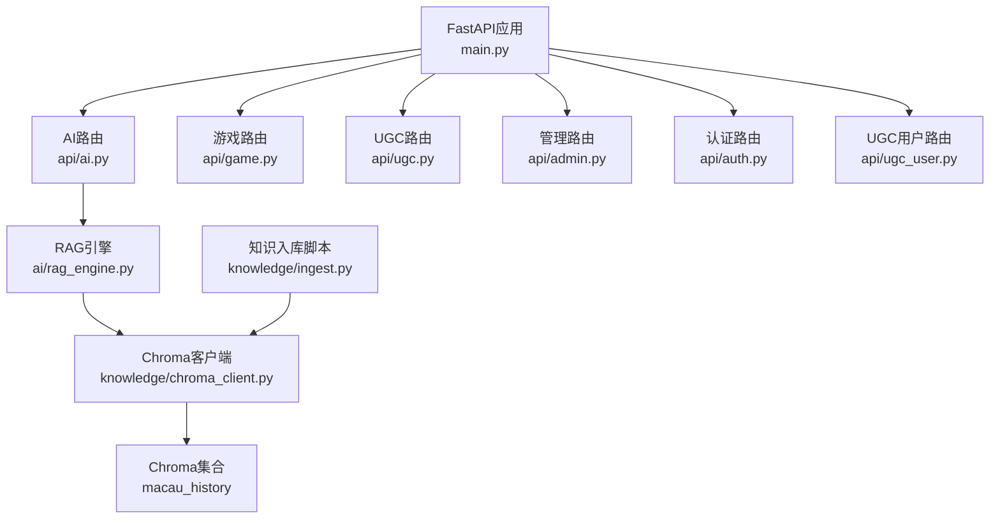
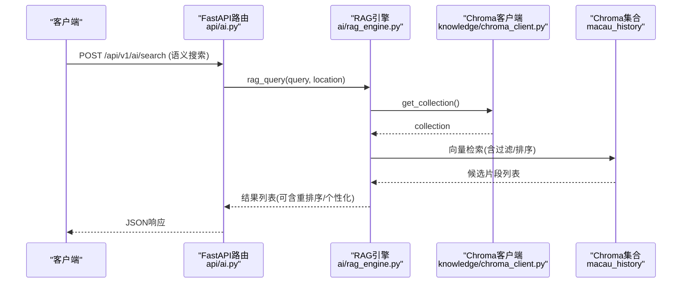
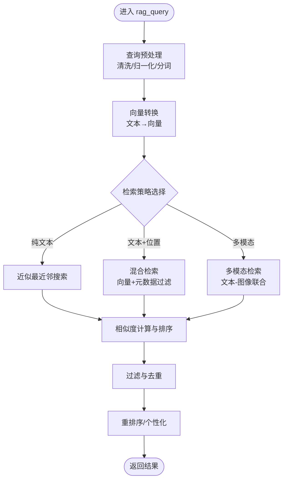
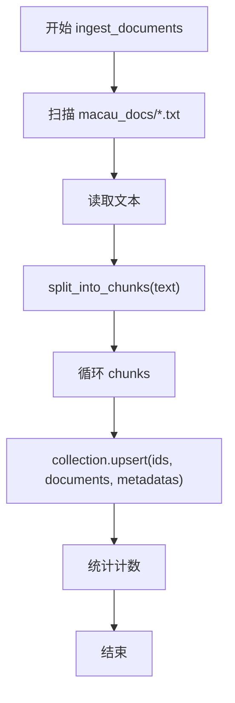
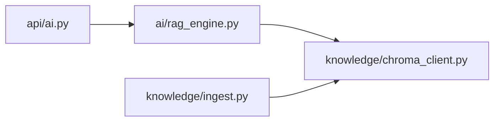

# 语义搜索接口

<cite>
**本文引用的文件**   
- [backend/app/main.py](file://backend/app/main.py)
- [backend/app/api/ai.py](file://backend/app/api/ai.py)
- [backend/app/ai/rag_engine.py](file://backend/app/ai/rag_engine.py)
- [backend/app/knowledge/chroma_client.py](file://backend/app/knowledge/chroma_client.py)
- [backend/app/knowledge/ingest.py](file://backend/app/knowledge/ingest.py)
- [backend/app/models.py](file://backend/app/models.py)
</cite>

## 目录
1. [简介](#简介)
2. [项目结构](#项目结构)
3. [核心组件](#核心组件)
4. [架构总览](#架构总览)
5. [详细组件分析](#详细组件分析)
6. [依赖关系分析](#依赖关系分析)
7. [性能考量](#性能考量)
8. [故障排查指南](#故障排查指南)
9. [结论](#结论)
10. [附录：API定义与示例](#附录api定义与示例)

## 简介
本文件为“语义搜索接口”的完整技术文档，面向开发者与产品人员，系统阐述基于内容的知识检索算法、相似度计算与结果排序机制，并给出查询处理流程（预处理、向量转换、检索策略选择）、多模态搜索支持（文本-文本、文本-图像混合检索）、搜索结果过滤与重排序、个性化推荐能力，以及性能优化（近似最近邻搜索、索引优化、缓存策略）和调优指南。当前仓库实现了RAG引擎的占位实现与ChromaDB知识库的接入准备，后续可按本文指引完成端到端落地。

## 项目结构
后端采用FastAPI模块化路由组织，AI与知识检索相关代码集中在app/ai与app/knowledge两个子模块中；入口应用通过lifespan进行初始化，并注册各业务路由。

图表来源
- [backend/app/main.py:17-111](file://backend/app/main.py#L17-L111)
- [backend/app/api/ai.py:1-29](file://backend/app/api/ai.py#L1-L29)
- [backend/app/ai/rag_engine.py:1-13](file://backend/app/ai/rag_engine.py#L1-L13)
- [backend/app/knowledge/chroma_client.py:1-19](file://backend/app/knowledge/chroma_client.py#L1-L19)
- [backend/app/knowledge/ingest.py:1-36](file://backend/app/knowledge/ingest.py#L1-L36)

章节来源
- [backend/app/main.py:17-111](file://backend/app/main.py#L17-L111)
- [backend/app/api/ai.py:1-29](file://backend/app/api/ai.py#L1-L29)

## 核心组件
- RAG引擎（ai/rag_engine.py）：提供语义检索函数，当前为Mock实现，预留接入ChromaDB扩展点。
- Chroma客户端（knowledge/chroma_client.py）：封装ChromaDB持久化客户端与集合获取，单例模式避免重复创建。
- 知识入库（knowledge/ingest.py）：将本地txt文档按句切分后批量upsert到Chroma集合，附带元数据（source、chunk）。
- AI路由（api/ai.py）：对外暴露聊天与TTS接口，当前NPC对话为Mock，预留接入LLM与RAG。
- 模型定义（models.py）：统一请求/响应数据结构，便于FastAPI自动校验与序列化。

章节来源
- [backend/app/ai/rag_engine.py:1-13](file://backend/app/ai/rag_engine.py#L1-L13)
- [backend/app/knowledge/chroma_client.py:1-19](file://backend/app/knowledge/chroma_client.py#L1-L19)
- [backend/app/knowledge/ingest.py:1-36](file://backend/app/knowledge/ingest.py#L1-L36)
- [backend/app/api/ai.py:1-29](file://backend/app/api/ai.py#L1-L29)
- [backend/app/models.py:95-108](file://backend/app/models.py#L95-L108)

## 架构总览
下图展示从HTTP请求到知识检索的调用链，以及未来可扩展的多模态与重排序路径。

图表来源
- [backend/app/api/ai.py:15-21](file://backend/app/api/ai.py#L15-L21)
- [backend/app/ai/rag_engine.py:3-12](file://backend/app/ai/rag_engine.py#L3-L12)
- [backend/app/knowledge/chroma_client.py:13-18](file://backend/app/knowledge/chroma_client.py#L13-L18)

## 详细组件分析

### RAG引擎（ai/rag_engine.py）
- 职责：对外提供语义检索函数，当前以字典匹配作为Mock，返回与查询或位置相关的历史片段。
- 扩展点：预留接入ChromaDB的调用位置，可在该函数内完成查询预处理、向量化、检索与结果组装。
- 复杂度：当前为O(n)字典遍历，n为固定条目数；替换为向量检索后可达亚线性时间。

图表来源
- [backend/app/ai/rag_engine.py:3-12](file://backend/app/ai/rag_engine.py#L3-L12)

章节来源
- [backend/app/ai/rag_engine.py:1-13](file://backend/app/ai/rag_engine.py#L1-L13)

### Chroma客户端（knowledge/chroma_client.py）
- 职责：提供全局单例的ChromaDB客户端与集合访问器，确保进程内复用连接与集合对象。
- 关键点：使用PersistentClient持久化存储；集合名为macau_history，附带描述性metadata。
- 建议：在生产环境增加重试、超时与异常捕获；可引入连接池与健康检查。

章节来源
- [backend/app/knowledge/chroma_client.py:1-19](file://backend/app/knowledge/chroma_client.py#L1-L19)

### 知识入库（knowledge/ingest.py）
- 职责：读取本地txt文档，按句号切分为块，逐块upsert到Chroma集合，附带source与chunk元数据。
- 切分策略：按句子边界切分，控制块大小，避免过长导致嵌入质量下降。
- 扩展建议：支持增量更新、冲突ID处理、批量写入与失败重试。

图表来源
- [backend/app/knowledge/ingest.py:17-32](file://backend/app/knowledge/ingest.py#L17-L32)

章节来源
- [backend/app/knowledge/ingest.py:1-36](file://backend/app/knowledge/ingest.py#L1-L36)

### AI路由（api/ai.py）
- 职责：暴露聊天与TTS接口；当前NPC对话为Mock，预留接入LLM与RAG。
- 语义搜索扩展：可新增POST /api/v1/ai/search端点，接收query与location等参数，调用RAG引擎并返回结构化结果。

章节来源
- [backend/app/api/ai.py:15-21](file://backend/app/api/ai.py#L15-L21)

### 模型定义（models.py）
- 职责：统一ChatRequest、ChatResponse、TtsResponse等数据结构，供FastAPI自动校验与序列化。
- 语义搜索建议：新增SearchRequest/SearchResponse模型，包含query、top_k、filters、reorder_by等字段。

章节来源
- [backend/app/models.py:95-108](file://backend/app/models.py#L95-L108)

## 依赖关系分析
- 路由层依赖RAG引擎；RAG引擎依赖Chroma客户端；入库脚本依赖Chroma客户端。
- 无循环依赖；模块职责清晰，易于扩展。

图表来源
- [backend/app/api/ai.py:1-29](file://backend/app/api/ai.py#L1-L29)
- [backend/app/ai/rag_engine.py:1-13](file://backend/app/ai/rag_engine.py#L1-L13)
- [backend/app/knowledge/chroma_client.py:1-19](file://backend/app/knowledge/chroma_client.py#L1-L19)
- [backend/app/knowledge/ingest.py:1-36](file://backend/app/knowledge/ingest.py#L1-L36)

章节来源
- [backend/app/main.py:84-96](file://backend/app/main.py#L84-L96)

## 性能考量
- 近似最近邻搜索（ANN）：在Chroma中启用合适的索引（如HNSW），根据数据规模调整m、ef_construction与ef_search参数，平衡召回率与延迟。
- 向量维度与模型：选择与任务匹配的嵌入模型，控制向量维度以降低内存与计算开销。
- 批处理与并发：入库阶段使用批量upsert；检索阶段限制top_k，减少网络与序列化成本。
- 缓存策略：对高频查询结果做短期缓存（内存或Redis），设置合理TTL与失效策略。
- 元数据过滤：利用source、chunk等元数据进行预过滤，缩小检索范围，提升命中率与速度。
- 监控与度量：记录QPS、P95/P99延迟、召回率、错误率，持续优化。

[本节为通用指导，不直接分析具体文件]

## 故障排查指南
- 数据库未迁移：启动时报错提示需先执行alembic升级。
- 验证错误：非游戏路由的请求校验错误会返回标准JSON格式的错误信息。
- LLM调用失败：若接入LLM，需检查API Key与Base URL配置，捕获异常并降级返回。
- Chroma连接问题：检查持久化路径权限、磁盘空间与集合是否存在。

章节来源
- [backend/app/main.py:38-74](file://backend/app/main.py#L38-L74)
- [backend/app/ai/llm_client.py:12-31](file://backend/app/ai/llm_client.py#L12-L31)

## 结论
当前仓库已具备语义搜索的基础设施：RAG引擎占位、Chroma客户端与入库脚本。下一步应完善查询预处理、向量化、检索策略选择、过滤与重排序，并补充多模态支持与性能优化。通过清晰的模块划分与可扩展设计，可快速迭代出高性能、高可用的语义搜索服务。

[本节为总结性内容，不直接分析具体文件]

## 附录：API定义与示例

### 现有AI接口
- POST /api/v1/ai/chat
  - 请求体：ChatRequest（npc_id, message, context）
  - 响应体：ChatResponse（response, audio_url）
  - 说明：当前为Mock NPC对话，后续可接入LLM与RAG增强上下文。

- GET /api/v1/ai/tts
  - 参数：text, voice
  - 响应体：TtsResponse（audio_url, text）
  - 说明：语音合成，当前返回空音频URL。

章节来源
- [backend/app/api/ai.py:15-28](file://backend/app/api/ai.py#L15-L28)
- [backend/app/models.py:95-108](file://backend/app/models.py#L95-L108)

### 语义搜索接口（建议新增）
- POST /api/v1/ai/search
  - 请求体：SearchRequest
    - query: string（必填）
    - top_k: int（默认5）
    - filters: dict（可选，如source、location）
    - reorder_by: string（可选，如score、recency）
    - personalization: dict（可选，如user_profile）
  - 响应体：SearchResponse
    - results: list[Document]
      - id: string
      - score: float
      - document: string
      - metadata: dict
    - usage: UsageInfo
      - tokens: int
      - latency_ms: int

- 查询处理流程
  - 预处理：清洗、去噪、分词、同义词扩展
  - 向量转换：文本→向量（可支持图像特征拼接）
  - 检索策略：ANN检索 + 元数据过滤
  - 相似度计算：余弦相似度或内积
  - 排序与重排：分数加权、多样性打散、个性化偏好
  - 输出：Top-K结果及解释信息

- 多模态支持
  - 文本-文本：标准向量检索
  - 文本-图像：图像编码为向量，与文本向量在同一空间检索；或双塔检索后融合打分

- 性能优化
  - 索引：HNSW/IVF-PQ等
  - 缓存：热点查询结果缓存
  - 批处理：批量嵌入与检索
  - 监控：延迟、吞吐、召回率指标

[本节为概念性设计与建议，不直接映射到具体代码文件]