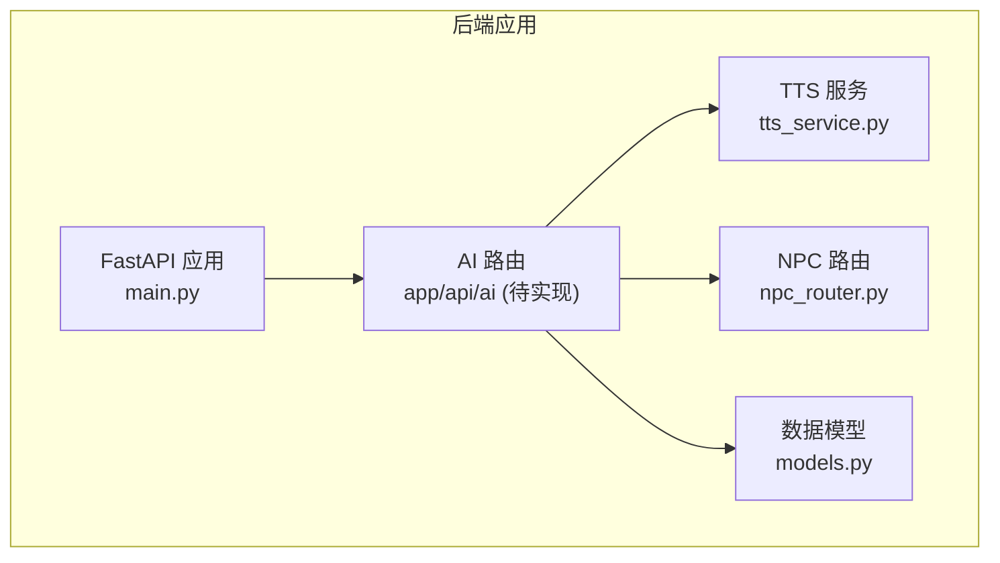
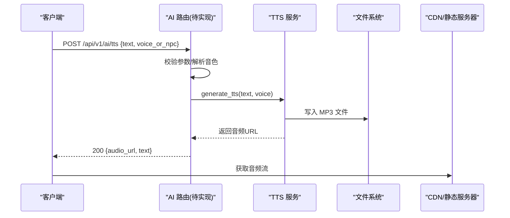
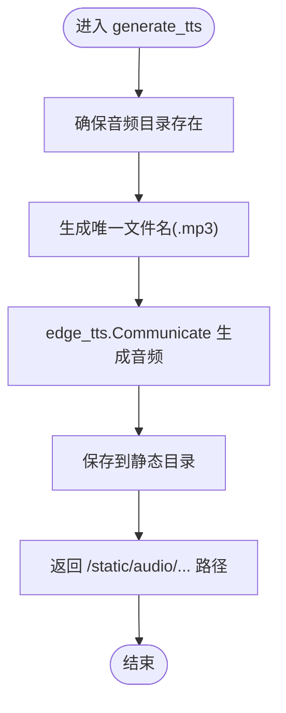
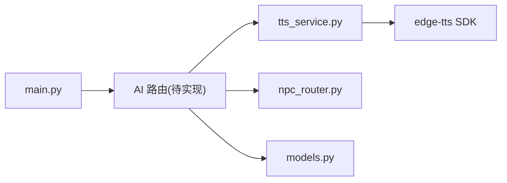

# TTS语音合成接口

<cite>
**本文引用的文件**   
- [tts_service.py](file://backend/app/ai/tts_service.py)
- [npc_router.py](file://backend/app/ai/npc_router.py)
- [models.py](file://backend/app/models.py)
- [main.py](file://backend/app/main.py)
</cite>

## 目录
1. [简介](#简介)
2. [项目结构](#项目结构)
3. [核心组件](#核心组件)
4. [架构总览](#架构总览)
5. [详细组件分析](#详细组件分析)
6. [依赖关系分析](#依赖关系分析)
7. [性能与并发](#性能与并发)
8. [音频质量与存储策略](#音频质量与存储策略)
9. [CDN集成指南](#cdn集成指南)
10. [故障排查](#故障排查)
11. [结论](#结论)
12. [附录：API定义与示例](#附录api定义与示例)

## 简介
本文件面向“文本转语音（TTS）”能力，提供统一的接口规范与实现说明。当前仓库实现了基于 edge-tts 的异步语音合成服务，支持按角色（NPC）选择音色、生成 MP3 音频并返回可访问的静态路径。文档涵盖：
- 接口规范：请求/响应模型、字段含义与约束
- Edge-TTS 集成配置：音色映射、默认值与扩展点
- 音频文件管理：存储位置、命名规则与生命周期
- 缓存策略：建议方案与落地方式
- 多语言与方言：当前可用音色与扩展方法
- 情感表达控制：通过 SSML 或参数化文本注入
- 异步处理与并发：基于 FastAPI 的异步调用与资源管理
- 音频质量优化：采样率、码率、时长限制等实践建议
- 存储与 CDN：本地静态目录与 CDN 回源、缓存头设置

## 项目结构
TTS 相关代码集中在后端 AI 模块中，包含：
- 语音合成服务：封装 edge-tts 调用、音频落盘与路径返回
- NPC 路由：为不同角色分配固定音色
- 数据模型：统一 TTS 请求/响应结构
- 应用入口：注册路由与全局中间件（CORS、异常处理）

图表来源 
- [main.py:17-111](file://backend/app/main.py#L17-L111)
- [tts_service.py:1-25](file://backend/app/ai/tts_service.py#L1-L25)
- [npc_router.py:1-18](file://backend/app/ai/npc_router.py#L1-L18)
- [models.py:100-146](file://backend/app/models.py#L100-L146)

章节来源
- [main.py:17-111](file://backend/app/main.py#L17-L111)
- [tts_service.py:1-25](file://backend/app/ai/tts_service.py#L1-L25)
- [npc_router.py:1-18](file://backend/app/ai/npc_router.py#L1-L18)
- [models.py:100-146](file://backend/app/models.py#L100-L146)

## 核心组件
- TTS 服务（edge-tts 封装）
  - 异步生成 MP3 音频，写入静态目录，返回相对路径
  - 提供 NPC 到音色的映射查询
- NPC 路由（角色与音色绑定）
  - 根据 NPC ID 返回预设音色
- 数据模型（Pydantic）
  - TtsResponse：返回 audio_url 与 text
  - ChatResponse：对话响应中包含可选 audio_url
  - GenerateRequest/GenerateResponse：用于脚本生成（与 TTS 解耦）

章节来源
- [tts_service.py:1-25](file://backend/app/ai/tts_service.py#L1-L25)
- [npc_router.py:1-18](file://backend/app/ai/npc_router.py#L1-L18)
- [models.py:100-146](file://backend/app/models.py#L100-L146)

## 架构总览
TTS 调用流程（概念性）：
- 客户端发起 TTS 请求（文本、音色/角色、可选风格）
- API 层校验输入，解析角色与音色
- 调用 TTS 服务生成 MP3 并落盘
- 返回音频 URL（静态路径），前端可直接播放或通过 CDN 加载

图表来源 
- [tts_service.py:14-20](file://backend/app/ai/tts_service.py#L14-L20)
- [npc_router.py:10-17](file://backend/app/ai/npc_router.py#L10-L17)
- [models.py:106-108](file://backend/app/models.py#L106-L108)

## 详细组件分析

### TTS 服务（edge-tts 封装）
- 功能要点
  - 异步生成 MP3，使用 uuid 前缀保证文件名唯一
  - 自动创建静态音频目录
  - 返回以 /static/audio/ 开头的相对路径
  - 提供 get_voice_for_npc(npc_id) 获取对应音色
- 关键数据结构
  - VOICE_OPTIONS：NPC ID 到 Neural 音色的映射
  - AUDIO_DIR：音频保存目录（静态目录）
- 复杂度与性能
  - I/O 阻塞由 edge-tts 内部处理；调用方使用 await 避免阻塞事件循环
  - 文件写入为顺序写，单进程并发受限于磁盘 IO 与网络延迟
- 错误处理
  - 未显式捕获异常，建议在 API 层进行 try/except 包装并返回标准错误体
- 可扩展点
  - 增加语速、音量、SSML 标签注入
  - 接入缓存（按文本+音色哈希）减少重复生成

图表来源 
- [tts_service.py:14-20](file://backend/app/ai/tts_service.py#L14-L20)

章节来源
- [tts_service.py:1-25](file://backend/app/ai/tts_service.py#L1-L25)

### NPC 路由（角色与音色绑定）
- 功能要点
  - 维护 NPC 信息（名称、地点、音色）
  - 提供按地点查找 NPC ID 与按 ID 获取信息的函数
- 使用场景
  - 在 AI 路由中根据 NPC ID 选择音色，再调用 TTS 服务
- 扩展建议
  - 将 NPC 信息迁移至配置或数据库，便于动态更新

章节来源
- [npc_router.py:1-18](file://backend/app/ai/npc_router.py#L1-L18)

### 数据模型（Pydantic）
- TtsResponse
  - audio_url：音频访问路径
  - text：原始文本
- ChatResponse
  - response：文本回复
  - audio_url：可选音频路径
- GenerateRequest/GenerateResponse
  - 用于脚本生成，与 TTS 解耦

章节来源
- [models.py:100-146](file://backend/app/models.py#L100-L146)

## 依赖关系分析
- 外部依赖
  - edge-tts：第三方 TTS SDK，负责文本到音频转换
- 内部依赖
  - main.py：注册路由、CORS、异常处理
  - npc_router.py：NPC 到音色的映射
  - models.py：统一请求/响应结构

图表来源 
- [main.py:84-96](file://backend/app/main.py#L84-L96)
- [tts_service.py:2](file://backend/app/ai/tts_service.py#L2)
- [npc_router.py:1-18](file://backend/app/ai/npc_router.py#L1-L18)
- [models.py:100-146](file://backend/app/models.py#L100-L146)

章节来源
- [main.py:84-96](file://backend/app/main.py#L84-L96)
- [tts_service.py:1-25](file://backend/app/ai/tts_service.py#L1-L25)
- [npc_router.py:1-18](file://backend/app/ai/npc_router.py#L1-L18)
- [models.py:100-146](file://backend/app/models.py#L100-L146)

## 性能与并发
- 异步处理
  - TTS 生成使用 await，不会阻塞事件循环
- 并发控制
  - 建议对同一文本+音色的请求做去重（队列合并）
  - 引入任务队列（如 Celery/RQ）或内存锁，避免重复生成
- 资源管理
  - 音频文件清理策略：按时间或大小阈值定期清理
  - 静态目录权限与磁盘容量监控

[本节为通用指导，不直接分析具体文件]

## 音频质量与存储策略
- 音频格式
  - 当前输出 MP3，适合 Web 播放与 CDN 分发
- 质量参数
  - 建议通过 edge-tts 的参数或 SSML 控制语速、停顿、音量
  - 若需更高音质，可考虑 WAV/FLAC 但体积较大
- 存储策略
  - 本地静态目录：/static/audio/
  - 命名规则：tts_{uuid前缀}.mp3
  - 生命周期：可按业务需求定时清理或归档

章节来源
- [tts_service.py:11-20](file://backend/app/ai/tts_service.py#L11-L20)

## CDN集成指南
- 静态资源托管
  - 将 /static/audio/ 目录挂载到 CDN 或对象存储（如 OSS/S3）
- 缓存头设置
  - 对音频文件设置较长的 Cache-Control（如 max-age=31536000）
  - 使用 ETag/Last-Modified 提升命中率
- 回源策略
  - 首次命中回源到后端，后端写入本地后由 CDN 抓取
  - 或在后端直传对象存储，CDN 仅作为分发层

[本节为通用指导，不直接分析具体文件]

## 故障排查
- 常见问题
  - 音频目录不存在：服务会自动创建，检查运行用户权限
  - 磁盘空间不足：监控磁盘使用量，及时清理历史音频
  - 网络超时：edge-tts 依赖外部服务，需检查网络连通性与限流
- 日志与监控
  - 记录生成耗时、失败次数、文件大小分布
  - 对异常进行统一捕获并返回标准错误体

[本节为通用指导，不直接分析具体文件]

## 结论
当前 TTS 能力已具备基础实现：异步生成 MP3、NPC 音色映射、静态路径返回。后续可在以下方面增强：
- 完善 API 路由与参数校验
- 引入缓存与去重机制
- 支持更多语言/方言与情感表达（SSML）
- 接入 CDN 与对象存储，提升分发效率

[本节为总结性内容，不直接分析具体文件]

## 附录：API定义与示例

### 接口定义
- 端点
  - POST /api/v1/ai/tts
- 请求体
  - text：必填，要合成的文本
  - voice：可选，指定音色（如 zh-CN-XiaoxiaoNeural）；也可传入 npc_id，由 NPC 路由解析
  - style：可选，风格标识（如 suspense），用于提示词或后续扩展
  - options：可选，扩展参数（如语速、音量、SSML 片段）
- 响应体
  - audio_url：音频访问路径（/static/audio/*.mp3）
  - text：原始文本

### 示例
- 基本合成
  - 请求：{text: "欢迎来到澳门神秘之旅", voice: "zh-CN-XiaoxiaoNeural"}
  - 响应：{audio_url: "/static/audio/tts_abc123.mp3", text: "欢迎来到澳门神秘之旅"}
- 按角色合成
  - 请求：{text: "你好，我是看庙老伯", voice: "mage_temple_keeper"}
  - 响应：{audio_url: "/static/audio/tts_def456.mp3", text: "你好，我是看庙老伯"}

章节来源
- [models.py:106-108](file://backend/app/models.py#L106-L108)
- [tts_service.py:14-20](file://backend/app/ai/tts_service.py#L14-L20)
- [npc_router.py:10-17](file://backend/app/ai/npc_router.py#L10-L17)