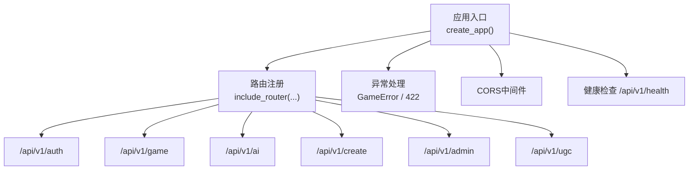
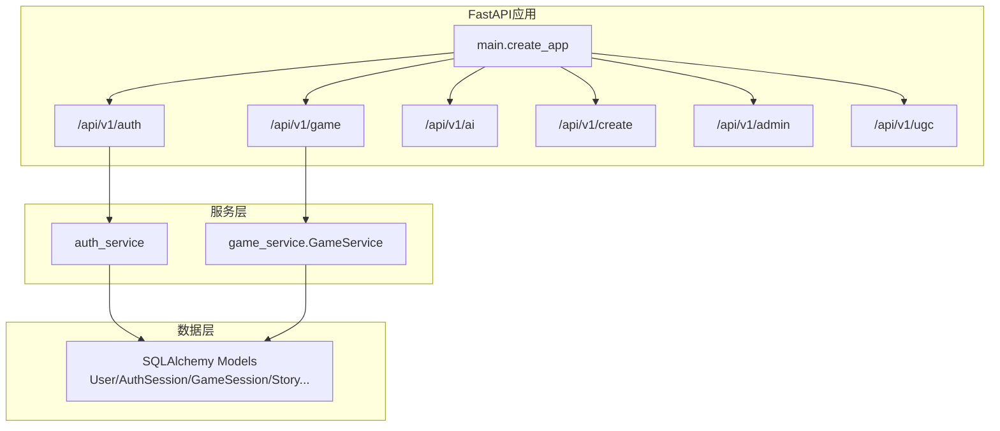
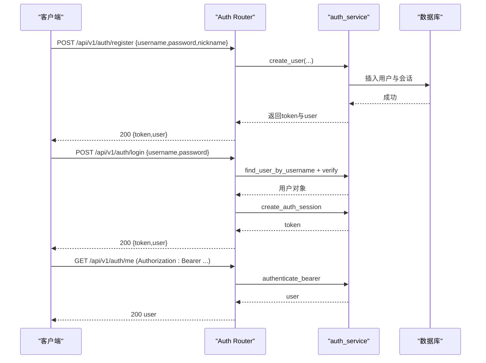
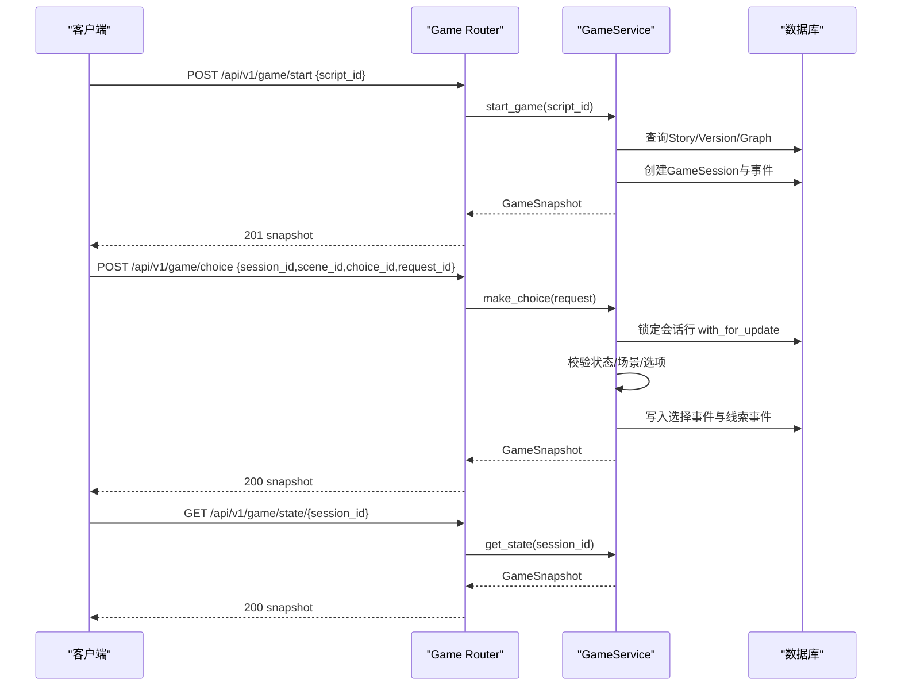
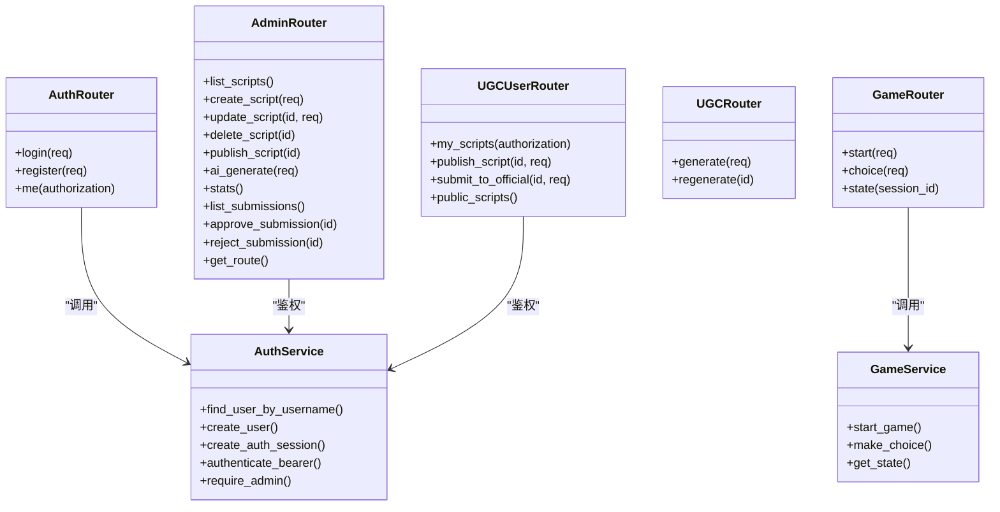
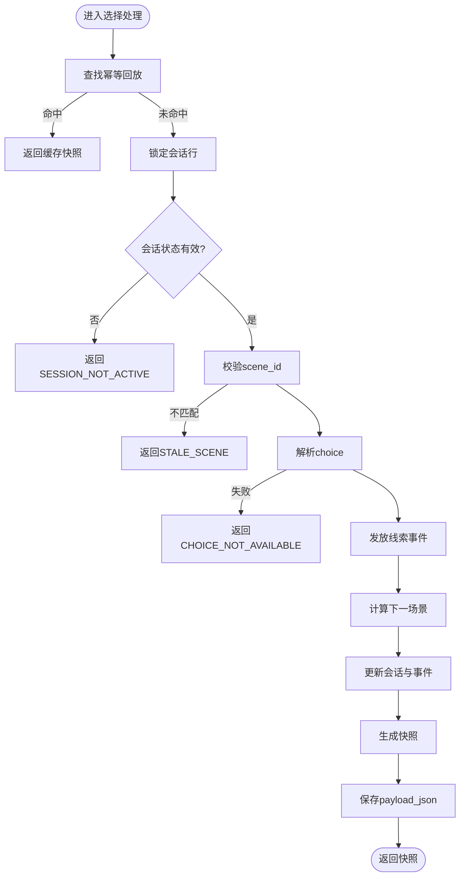

# API接口文档

<cite>
**本文引用的文件**   
- [main.py](file://backend/app/main.py)
- [auth.py](file://backend/app/api/auth.py)
- [game.py](file://backend/app/api/game.py)
- [ai.py](file://backend/app/api/ai.py)
- [ugc.py](file://backend/app/api/ugc.py)
- [ugc_user.py](file://backend/app/api/ugc_user.py)
- [admin.py](file://backend/app/api/admin.py)
- [models.py](file://backend/app/models.py)
- [game_service.py](file://backend/app/game_service.py)
- [auth_service.py](file://backend/app/auth_service.py)
- [config.py](file://backend/app/config.py)
- [db_models.py](file://backend/app/db_models.py)
- [README.md](file://README.md)
- [test_auth_api.py](file://backend/tests/test_auth_api.py)
- [test_game_api.py](file://backend/tests/test_game_api.py)
</cite>

## 目录
1. [简介](#简介)
2. [项目结构](#项目结构)
3. [核心组件](#核心组件)
4. [架构总览](#架构总览)
5. [详细组件分析](#详细组件分析)
6. [依赖关系分析](#依赖关系分析)
7. [性能与限流](#性能与限流)
8. [错误码与状态码](#错误码与状态码)
9. [客户端集成指南](#客户端集成指南)
10. [调试与排障](#调试与排障)
11. [结论](#结论)

## 简介
本文件为澳秘 Macau Mystery 的完整API接口文档，覆盖认证授权、游戏核心、AI服务、UGC创作与管理后台等全部RESTful端点。文档包含HTTP方法、URL模式、请求参数、响应格式、示例、错误码说明、版本管理、安全策略以及客户端集成与调试建议，帮助使用者与集成开发者快速准确地对接后端服务。

## 项目结构
后端采用FastAPI模块化路由组织，按功能域划分：
- 认证授权：/api/v1/auth
- 游戏核心：/api/v1/game
- AI服务：/api/v1/ai
- UGC创作：/api/v1/create
- 用户UGC：/api/v1/ugc
- 管理后台：/api/v1/admin
- 健康检查：/api/v1/health

**图表来源** 
- [main.py:17-106](file://backend/app/main.py#L17-L106)

**章节来源**
- [main.py:17-106](file://backend/app/main.py#L17-L106)
- [README.md:1-59](file://README.md#L1-L59)

## 核心组件
- 应用生命周期与全局异常处理：统一封装业务异常与校验异常，返回一致的错误信封。
- 路由聚合：按模块挂载到不同前缀，便于权限控制与限流扩展。
- 配置中心：集中读取环境变量（数据库、CORS、演示数据开关、Token TTL等）。
- 模型与契约：Pydantic模型定义所有请求/响应结构，保证强类型校验。

**章节来源**
- [main.py:17-106](file://backend/app/main.py#L17-L106)
- [config.py:38-77](file://backend/app/config.py#L38-L77)
- [models.py:1-146](file://backend/app/models.py#L1-L146)

## 架构总览
系统由FastAPI应用承载，各子模块通过Router暴露API；游戏核心通过Service层访问持久化模型，确保事务与幂等；认证基于Bearer Token并持久化会话；AI与UGC当前为Mock实现，预留扩展点。

**图表来源** 
- [main.py:84-96](file://backend/app/main.py#L84-L96)
- [auth_service.py:100-131](file://backend/app/auth_service.py#L100-L131)
- [game_service.py:31-62](file://backend/app/game_service.py#L31-L62)
- [db_models.py:24-160](file://backend/app/db_models.py#L24-L160)

## 详细组件分析

### 认证授权API（/api/v1/auth）
- POST /api/v1/auth/register
  - 请求体：username、password、nickname（可选）
  - 响应：token、user（id、username、nickname、role）
  - 行为：用户名唯一性校验、密码长度校验、创建用户与会话、返回令牌
- POST /api/v1/auth/login
  - 请求体：username、password
  - 响应：token、user
  - 行为：校验凭据、创建会话、返回令牌
- GET /api/v1/auth/me
  - 鉴权：Authorization: Bearer <token>
  - 响应：user（id、username、nickname、role）
  - 行为：验证令牌有效性并返回用户信息

**图表来源** 
- [auth.py:64-97](file://backend/app/api/auth.py#L64-L97)
- [auth_service.py:59-97](file://backend/app/auth_service.py#L59-L97)
- [auth_service.py:100-131](file://backend/app/auth_service.py#L100-L131)

**章节来源**
- [auth.py:24-97](file://backend/app/api/auth.py#L24-L97)
- [auth_service.py:27-97](file://backend/app/auth_service.py#L27-L97)
- [auth_service.py:100-131](file://backend/app/auth_service.py#L100-L131)
- [test_auth_api.py:57-127](file://backend/tests/test_auth_api.py#L57-L127)

### 游戏核心API（/api/v1/game）
- POST /api/v1/game/start
  - 请求体：script_id（已发布故事slug）
  - 响应：GameSnapshot（session_id、status、story、scene、clues、progress、awarded_clues、ending）
  - 行为：加载活跃版本、构建图、初始化会话与事件、返回初始场景
- POST /api/v1/game/choice
  - 请求体：session_id、scene_id、choice_id、request_id（幂等键）
  - 响应：GameSnapshot
  - 行为：并发锁、状态校验、选项解析、线索发放、下一场景推进、记录事件、幂等回放
- GET /api/v1/game/state/{session_id}
  - 路径参数：session_id
  - 响应：GameSnapshot（不含awarded_clues）
  - 行为：恢复会话快照

**图表来源** 
- [game.py:15-37](file://backend/app/api/game.py#L15-L37)
- [game_service.py:35-62](file://backend/app/game_service.py#L35-L62)
- [game_service.py:70-193](file://backend/app/game_service.py#L70-L193)
- [models.py:12-92](file://backend/app/models.py#L12-L92)

**章节来源**
- [game.py:1-37](file://backend/app/api/game.py#L1-L37)
- [game_service.py:31-193](file://backend/app/game_service.py#L31-L193)
- [models.py:12-92](file://backend/app/models.py#L12-L92)
- [test_game_api.py:72-127](file://backend/tests/test_game_api.py#L72-L127)

### AI服务API（/api/v1/ai）
- POST /api/v1/ai/chat
  - 请求体：npc_id、message、context（可选）
  - 响应：response、audio_url（可选）
  - 行为：当前Mock返回预设对话，预留接入LLM
- GET /api/v1/ai/tts
  - 查询参数：text、voice（默认zh-CN-XiaoxiaoNeural）
  - 响应：audio_url、text
  - 行为：当前Mock返回空音频URL，预留接入TTS

**章节来源**
- [ai.py:1-29](file://backend/app/api/ai.py#L1-L29)
- [models.py:95-109](file://backend/app/models.py#L95-L109)

### UGC创作API（/api/v1/create）
- POST /api/v1/create/generate
  - 请求体：input、style（默认suspense）、options（可选）
  - 响应：script_id、title、chapters、style、era
  - 行为：当前Mock生成短剧结构，预留接入DeepSeek
- POST /api/v1/create/regenerate/{script_id}
  - 路径参数：script_id
  - 响应：{script_id, status}

**章节来源**
- [ugc.py:1-35](file://backend/app/api/ugc.py#L1-L35)
- [models.py:111-123](file://backend/app/models.py#L111-L123)

### 用户UGC API（/api/v1/ugc）
- GET /api/v1/ugc/my-scripts
  - 鉴权：Authorization: Bearer <token>
  - 响应：用户脚本列表
- POST /api/v1/ugc/publish/{script_id}
  - 鉴权：Authorization: Bearer <token>
  - 请求体：is_public（布尔）
  - 响应：更新后的脚本元信息
- POST /api/v1/ugc/submit/{script_id}
  - 鉴权：Authorization: Bearer <token>
  - 请求体：message（可选）
  - 响应：submission_id、status
- GET /api/v1/ugc/public
  - 响应：公开脚本列表（摘要）

**章节来源**
- [ugc_user.py:1-96](file://backend/app/api/ugc_user.py#L1-L96)

### 管理后台API（/api/v1/admin）
- GET /api/v1/admin/scripts
  - 鉴权：Authorization: Bearer <token>（需admin角色）
  - 响应：脚本列表（内存存储）
- POST /api/v1/admin/scripts
  - 鉴权：Authorization: Bearer <token>（需admin角色）
  - 请求体：title、description（可选）
  - 响应：新建脚本元信息
- PUT /api/v1/admin/scripts/{script_id}
  - 鉴权：Authorization: Bearer <token>（需admin角色）
  - 请求体：title/description/status（可选）
  - 响应：更新后脚本元信息
- DELETE /api/v1/admin/scripts/{script_id}
  - 鉴权：Authorization: Bearer <token>（需admin角色）
  - 响应：删除确认
- POST /api/v1/admin/scripts/{script_id}/publish
  - 鉴权：Authorization: Bearer <token>（需admin角色）
  - 响应：切换状态
- POST /api/v1/admin/scripts/ai-generate
  - 鉴权：Authorization: Bearer <token>（需admin角色）
  - 请求体：input、mode（quick/polish）
  - 响应：生成的脚本元信息与章节（Mock）
- GET /api/v1/admin/stats
  - 响应：统计（total_scripts、total_players、total_views、published、drafts）
- GET /api/v1/admin/submissions
  - 鉴权：Authorization: Bearer <token>（需admin角色）
  - 响应：提交审核列表
- POST /api/v1/admin/submissions/{sub_id}/approve
  - 鉴权：Authorization: Bearer <token>（需admin角色）
  - 响应：{status: approved}
- POST /api/v1/admin/submissions/{sub_id}/reject
  - 鉴权：Authorization: Bearer <token>（需admin角色）
  - 响应：{status: rejected}
- GET /api/v1/admin/route
  - 响应：路线配置（优先返回已发布脚本的route，否则默认）

**章节来源**
- [admin.py:1-218](file://backend/app/api/admin.py#L1-L218)

### 健康检查
- GET /api/v1/health
  - 响应：{"status":"ok","database":"ok","version":app.version} 或 503 {"status":"degraded","database":"unavailable","version":app.version}

**章节来源**
- [main.py:98-106](file://backend/app/main.py#L98-L106)

## 依赖关系分析
- 路由层依赖：
  - auth.py 依赖 auth_service（用户与会话管理）
  - game.py 依赖 game_service（游戏流程与事务）
  - ai.py、ugc.py、ugc_user.py、admin.py 各自独立逻辑，部分复用认证辅助
- 服务层依赖：
  - game_service 依赖 db_models（ORM实体）、config（环境配置）、story合约与运行时
  - auth_service 依赖 db_models（User/AuthSession）、config（Token TTL）
- 数据层：
  - db_models 定义 Story、StoryVersion、GameSession、GameEvent、SessionClue、User、AuthSession 等实体及约束

**图表来源** 
- [auth.py:24-97](file://backend/app/api/auth.py#L24-L97)
- [game.py:1-37](file://backend/app/api/game.py#L1-L37)
- [admin.py:1-218](file://backend/app/api/admin.py#L1-L218)
- [ugc.py:1-35](file://backend/app/api/ugc.py#L1-L35)
- [ugc_user.py:1-96](file://backend/app/api/ugc_user.py#L1-L96)
- [auth_service.py:100-131](file://backend/app/auth_service.py#L100-L131)
- [game_service.py:31-62](file://backend/app/game_service.py#L31-L62)

**章节来源**
- [db_models.py:24-160](file://backend/app/db_models.py#L24-L160)

## 性能与限流
- 并发与一致性：
  - choice操作使用数据库行级锁（with_for_update）与事务边界，避免重复推进同一场景。
  - SQLite下显式BEGIN IMMEDIATE保障并发写安全。
- 幂等性：
  - request_id用于去重与回放，重复提交返回相同结果，冲突时返回IDEMPOTENCY_CONFLICT。
- 媒体准备检查：
  - 生产环境下校验视频媒体ready，未就绪返回STORY_NOT_READY。
- 限流策略：
  - 当前未内置限流中间件，可在应用层增加速率限制（如基于IP/用户令牌计数），或在网关层实现。

**章节来源**
- [game_service.py:70-193](file://backend/app/game_service.py#L70-L193)
- [game_service.py:227-234](file://backend/app/game_service.py#L227-L234)

## 错误码与状态码
- HTTP状态码：
  - 200/201：成功
  - 401：未认证或令牌无效
  - 403：权限不足（非admin访问管理接口）
  - 404：资源不存在（故事/会话/脚本）
  - 409：冲突（会话已完成、场景不匹配、幂等冲突）
  - 422：请求校验失败（VALIDATION_ERROR）
  - 503：服务降级（数据库不可用、故事媒体未就绪）
- 业务错误码（error.code）：
  - VALIDATION_ERROR：字段、类型或格式不合法
  - SESSION_NOT_FOUND：会话不存在
  - STORY_NOT_FOUND：故事不存在
  - STORY_NOT_PUBLISHED：故事未发布
  - STORY_NOT_READY：故事版本或媒体未就绪
  - CHOICE_NOT_AVAILABLE：选项不属于当前场景
  - SESSION_COMPLETED：会话已结束
  - SESSION_NOT_ACTIVE：会话不可继续
  - STALE_SCENE：提交的场景不是当前场景
  - IDEMPOTENCY_CONFLICT：request_id已用于不同的选择请求
  - IDEMPOTENCY_RECORD_CORRUPTED：幂等响应记录异常
  - STORY_DATA_CORRUPTED：剧情数据异常

**图表来源** 
- [game_service.py:84-193](file://backend/app/game_service.py#L84-L193)

**章节来源**
- [game_errors.py:1-20](file://backend/app/game_errors.py#L1-L20)
- [main.py:38-74](file://backend/app/main.py#L38-L74)
- [test_game_api.py:172-210](file://backend/tests/test_game_api.py#L172-L210)

## 客户端集成指南
- 基础URL：http://localhost:8000（开发环境）
- 版本前缀：/api/v1/*
- 认证方式：
  - 登录/注册后获取token
  - 后续请求在Header中携带 Authorization: Bearer <token>
- 关键端点调用顺序：
  - 先调用 /api/v1/game/start 获取 session_id 与初始 scene
  - 根据 scene.choices 中的 choice_id 调用 /api/v1/game/choice，每次传入唯一的 request_id
  - 需要恢复进度时调用 /api/v1/game/state/{session_id}
- 示例流程（文字描述）：
  - 注册/登录后保存token
  - 启动游戏得到快照，渲染首场景与选项
  - 用户选择后发起choice请求，服务端返回新快照
  - 若达到结局，快照status为completed且包含ending
- 前端代理：
  - 前端已配置API代理，无需额外跨域设置（CORS由后端配置）

**章节来源**
- [README.md:20-33](file://README.md#L20-L33)
- [test_game_api.py:72-127](file://backend/tests/test_game_api.py#L72-L127)

## 调试与排障
- 本地运行后端：
  - 安装依赖后执行 uvicorn app.main:app --reload
  - 访问 http://localhost:8000/docs 查看自动生成的OpenAPI文档
- 常见问题：
  - 数据库未迁移：启动时报错提示执行 alembic upgrade head
  - 401未认证：检查Authorization头是否包含Bearer与有效token
  - 409冲突：检查scene_id与request_id是否正确，避免重复提交
  - 503服务降级：检查数据库连接与媒体资源准备状态
- 测试用例参考：
  - 认证与权限：test_auth_api.py
  - 游戏流程与错误：test_game_api.py

**章节来源**
- [README.md:20-28](file://README.md#L20-L28)
- [main.py:22-34](file://backend/app/main.py#L22-L34)
- [test_auth_api.py:57-127](file://backend/tests/test_auth_api.py#L57-L127)
- [test_game_api.py:172-210](file://backend/tests/test_game_api.py#L172-L210)

## 结论
本API文档覆盖了Macau Mystery平台的核心接口规范与集成要点。通过统一的错误信封、严格的模型校验、事务与幂等保障，以及清晰的鉴权与权限控制，确保了稳定可靠的交互体验。建议在网关层补充限流与审计能力，并在AI与UGC模块逐步替换Mock为真实服务，以提升整体质量与可观测性。