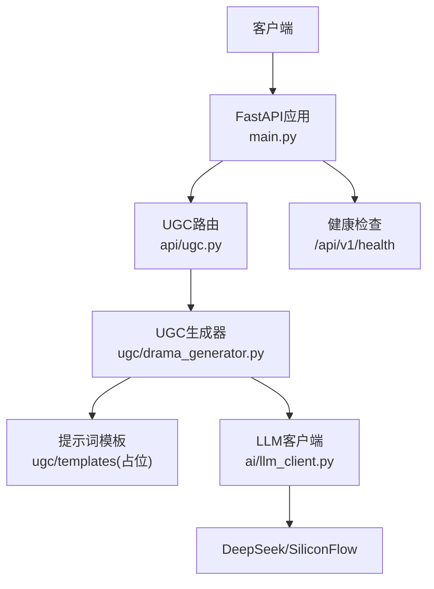
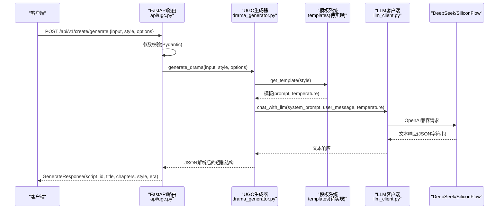
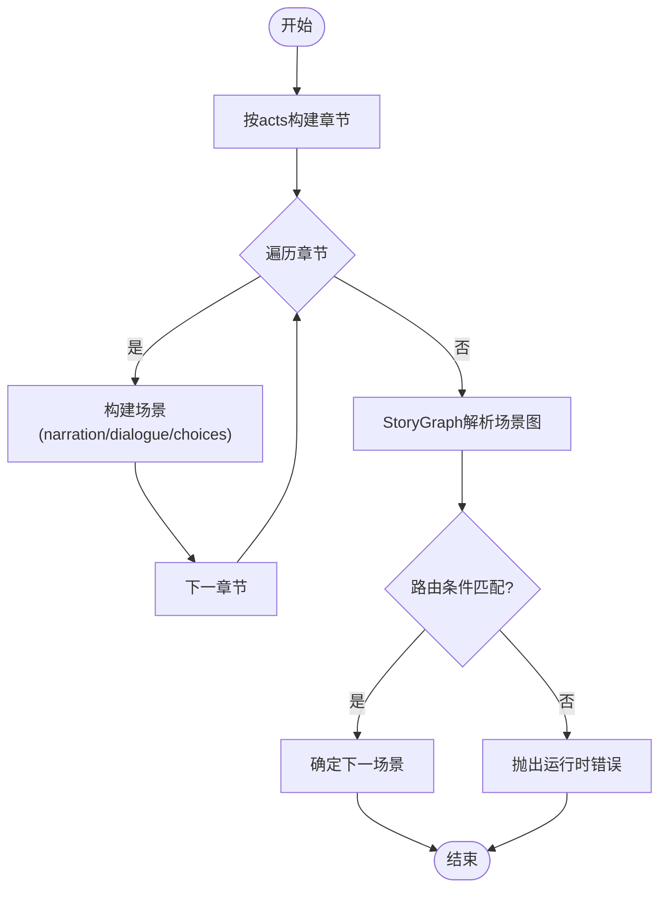
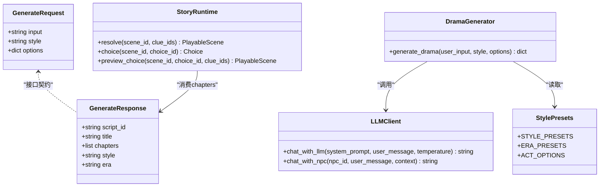
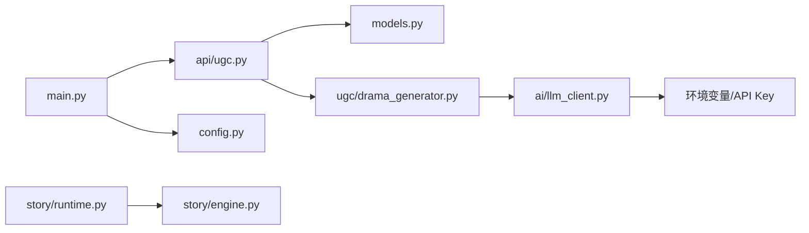

# AI生成API

<cite>
**本文引用的文件**   
- [backend/app/api/ugc.py](file://backend/app/api/ugc.py)
- [backend/app/models.py](file://backend/app/models.py)
- [backend/app/ugc/drama_generator.py](file://backend/app/ugc/drama_generator.py)
- [backend/app/ugc/style_presets.py](file://backend/app/ugc/style_presets.py)
- [backend/app/ai/llm_client.py](file://backend/app/ai/llm_client.py)
- [backend/app/ai/prompt_templates.py](file://backend/app/ai/prompt_templates.py)
- [backend/app/main.py](file://backend/app/main.py)
- [backend/app/config.py](file://backend/app/config.py)
- [backend/app/game_errors.py](file://backend/app/game_errors.py)
- [backend/app/story/engine.py](file://backend/app/story/engine.py)
- [backend/app/story/runtime.py](file://backend/app/story/runtime.py)
</cite>

## 目录
1. [简介](#简介)
2. [项目结构](#项目结构)
3. [核心组件](#核心组件)
4. [架构总览](#架构总览)
5. [详细组件分析](#详细组件分析)
6. [依赖关系分析](#依赖关系分析)
7. [性能考虑](#性能考虑)
8. [故障排查指南](#故障排查指南)
9. [结论](#结论)
10. [附录](#附录)

## 简介
本文件面向“一句话生成短剧”的AI生成API，提供从接口定义、输入参数与风格预设、Mock实现到未来DeepSeek集成的完整说明。文档涵盖：
- 接口契约与请求/响应模型
- 风格预设（悬疑推理、爱情故事、喜剧冒险、悲剧史诗）及时代与幕数配置
- 当前Mock实现逻辑与后续接入DeepSeek的架构设计
- 剧本章节生成算法、场景构建流程与对话生成机制
- 完整的API调用示例与错误处理方案
- 性能优化策略、缓存机制与异步处理模式
- 生成质量评估与内容过滤机制

## 项目结构
后端采用FastAPI模块化路由组织，AI能力集中在app/ai与app/ugc两个子模块中：
- API层：路由与请求校验（/api/v1/create）
- UGC生成器：模板拼装、LLM调用入口（drama_generator）
- LLM客户端：OpenAI兼容接口封装（SiliconFlow/DeepSeek）
- 风格预设：风格、时代、幕数枚举
- 故事引擎与运行时：用于解析与执行已验证的剧本结构（为后续真实生成产物落地提供基础）

图表来源
- [backend/app/main.py:17-111](file://backend/app/main.py#L17-L111)
- [backend/app/api/ugc.py:1-35](file://backend/app/api/ugc.py#L1-L35)
- [backend/app/ugc/drama_generator.py:1-21](file://backend/app/ugc/drama_generator.py#L1-L21)
- [backend/app/ai/llm_client.py:1-32](file://backend/app/ai/llm_client.py#L1-L32)

章节来源
- [backend/app/main.py:17-111](file://backend/app/main.py#L17-L111)
- [backend/app/config.py:1-77](file://backend/app/config.py#L1-L77)

## 核心组件
- UGC生成接口：POST /api/v1/create/generate，接收一句话输入、风格与选项，返回脚本ID、标题、章节列表等
- Mock实现：快速返回结构化章节与场景，便于前端联调
- LLM客户端：基于AsyncOpenAI封装，支持temperature、max_tokens等参数
- 风格预设：风格、时代、幕数等可配置项
- 故事运行时：对已验证的剧本进行图遍历、选择分支与线索判定

章节来源
- [backend/app/api/ugc.py:1-35](file://backend/app/api/ugc.py#L1-L35)
- [backend/app/models.py:111-123](file://backend/app/models.py#L111-L123)
- [backend/app/ugc/drama_generator.py:1-21](file://backend/app/ugc/drama_generator.py#L1-L21)
- [backend/app/ugc/style_presets.py:1-15](file://backend/app/ugc/style_presets.py#L1-L15)
- [backend/app/ai/llm_client.py:1-32](file://backend/app/ai/llm_client.py#L1-L32)
- [backend/app/story/runtime.py:22-80](file://backend/app/story/runtime.py#L22-L80)

## 架构总览
整体调用链路如下：
- 客户端发起生成请求至FastAPI路由
- 路由层进行参数校验（Pydantic），随后进入UGC生成器
- 生成器根据风格模板拼装提示词，调用LLM客户端
- LLM客户端通过OpenAI兼容接口访问DeepSeek（或SiliconFlow代理）
- 当前阶段返回Mock数据；未来将替换为真实LLM输出并做JSON解析与校验

图表来源
- [backend/app/api/ugc.py:8-29](file://backend/app/api/ugc.py#L8-L29)
- [backend/app/ugc/drama_generator.py:5-21](file://backend/app/ugc/drama_generator.py#L5-L21)
- [backend/app/ai/llm_client.py:12-25](file://backend/app/ai/llm_client.py#L12-L25)

## 详细组件分析

### 接口契约与参数规范
- 端点：POST /api/v1/create/generate
- 请求体模型：GenerateRequest
  - input: 用户的一句话描述（必填）
  - style: 风格ID（默认"suspense"）
  - options: 可选字典，包含era（时代）、acts（幕数）、custom_prompt（额外要求）等
- 响应模型：GenerateResponse
  - script_id: 生成的脚本唯一标识
  - title: 短剧标题
  - chapters: 章节数组（每个章节包含scenes、dialogue、choices等）
  - style: 使用的风格
  - era: 时代设定

章节来源
- [backend/app/models.py:111-123](file://backend/app/models.py#L111-L123)
- [backend/app/api/ugc.py:8-29](file://backend/app/api/ugc.py#L8-L29)

### 风格预设与配置
- 风格预设：悬疑推理、爱情故事、喜剧冒险、悲剧史诗
- 时代预设：清代、民国、现代、架空
- 幕数选项：3幕、5幕、7幕
- 模板系统：按风格获取对应prompt与temperature，支持追加custom_prompt

章节来源
- [backend/app/ugc/style_presets.py:1-15](file://backend/app/ugc/style_presets.py#L1-L15)
- [backend/app/ugc/drama_generator.py:5-15](file://backend/app/ugc/drama_generator.py#L5-L15)

### 当前Mock实现逻辑
- 路由直接构造三段式章节，每章一个场景，包含旁白、NPC对话与两个选择项
- 标题由输入前缀拼接，script_id为随机短ID
- 该实现用于快速联调，后续将被真实LLM生成替代

章节来源
- [backend/app/api/ugc.py:8-29](file://backend/app/api/ugc.py#L8-L29)

### 未来DeepSeek集成架构
- 使用AsyncOpenAI封装，通过环境变量配置API Key与Base URL
- MODEL默认指向deepseek-ai/DeepSeek-V3
- chat_with_llm支持system_prompt、user_message与temperature，限制max_tokens
- drama_generator将组装提示词并调用chat_with_llm，解析返回JSON

章节来源
- [backend/app/ai/llm_client.py:1-32](file://backend/app/ai/llm_client.py#L1-L32)
- [backend/app/ugc/drama_generator.py:5-21](file://backend/app/ugc/drama_generator.py#L5-L21)

### 剧本章节生成算法与场景构建流程
- 章节生成：按acts数量循环创建章节，每章至少一个场景
- 场景构建：包含id、narration（旁白）、dialogue（NPC对话）、choices（分支选择）
- 运行时解析：StoryGraph负责场景图遍历、路由条件匹配与选择预览
- 选择与线索：支持min_clue_count、all_clues、any_clues等条件，保证剧情分支可控

图表来源
- [backend/app/api/ugc.py:12-23](file://backend/app/api/ugc.py#L12-L23)
- [backend/app/story/runtime.py:37-48](file://backend/app/story/runtime.py#L37-L48)
- [backend/app/story/runtime.py:75-79](file://backend/app/story/runtime.py#L75-L79)

章节来源
- [backend/app/api/ugc.py:12-23](file://backend/app/api/ugc.py#L12-L23)
- [backend/app/story/runtime.py:22-80](file://backend/app/story/runtime.py#L22-L80)

### 对话生成机制
- NPC对话由LLM客户端统一封装，支持传入system_prompt与user_message
- prompt_templates提供不同NPC人设的系统提示，便于角色化回复
- 未来可将章节中的dialogue字段交由LLM动态生成，结合上下文与线索

章节来源
- [backend/app/ai/llm_client.py:12-31](file://backend/app/ai/llm_client.py#L12-L31)
- [backend/app/ai/prompt_templates.py:1-37](file://backend/app/ai/prompt_templates.py#L1-L37)

### 类关系与数据结构

图表来源
- [backend/app/models.py:111-123](file://backend/app/models.py#L111-L123)
- [backend/app/ugc/drama_generator.py:5-21](file://backend/app/ugc/drama_generator.py#L5-L21)
- [backend/app/ai/llm_client.py:12-31](file://backend/app/ai/llm_client.py#L12-L31)
- [backend/app/ugc/style_presets.py:1-15](file://backend/app/ugc/style_presets.py#L1-L15)
- [backend/app/story/runtime.py:37-61](file://backend/app/story/runtime.py#L37-L61)

## 依赖关系分析
- FastAPI主应用注册路由，包含create、ai、game、admin、auth、ugc等模块
- UGC路由依赖models进行请求/响应校验
- UGC生成器依赖模板系统与LLM客户端
- LLM客户端依赖环境变量配置与OpenAI兼容SDK
- 故事运行时依赖已验证的剧本结构，用于场景图解析与分支控制

图表来源
- [backend/app/main.py:84-96](file://backend/app/main.py#L84-L96)
- [backend/app/api/ugc.py:1-35](file://backend/app/api/ugc.py#L1-L35)
- [backend/app/ugc/drama_generator.py:1-21](file://backend/app/ugc/drama_generator.py#L1-L21)
- [backend/app/ai/llm_client.py:1-32](file://backend/app/ai/llm_client.py#L1-L32)
- [backend/app/config.py:1-77](file://backend/app/config.py#L1-L77)
- [backend/app/story/runtime.py:22-80](file://backend/app/story/runtime.py#L22-L80)
- [backend/app/story/engine.py:9-37](file://backend/app/story/engine.py#L9-L37)

章节来源
- [backend/app/main.py:84-96](file://backend/app/main.py#L84-L96)
- [backend/app/config.py:1-77](file://backend/app/config.py#L1-L77)

## 性能考虑
- 异步I/O：FastAPI与LLM客户端均使用async，避免阻塞请求线程
- 并发限制：建议在生产环境设置合理的并发上限与超时时间
- 缓存策略：可对热门风格的模板与常见输入的前缀结果进行短期缓存（Redis/Memcached）
- 流式输出：未来可引入流式响应以降低首字节延迟
- 资源管理：合理设置max_tokens与temperature，减少无效长文本生成

[本节为通用指导，不直接分析具体文件]

## 故障排查指南
- 请求校验失败：FastAPI会返回422，包含errors数组，列出路径、消息与类型
- 数据库不可用：健康检查返回503，状态degraded
- LLM调用异常：LLM客户端捕获异常并返回错误信息，需检查环境变量与网络
- 自定义业务错误：GameError统一格式，包含code、message与details

章节来源
- [backend/app/main.py:51-74](file://backend/app/main.py#L51-L74)
- [backend/app/main.py:98-105](file://backend/app/main.py#L98-L105)
- [backend/app/ai/llm_client.py:23-25](file://backend/app/ai/llm_client.py#L23-L25)
- [backend/app/game_errors.py:7-20](file://backend/app/game_errors.py#L7-L20)

## 结论
当前“一句话生成短剧”API以Mock为主，便于快速验证前后端交互与数据结构。未来通过DeepSeek集成，将实现真正的LLM驱动内容生成，并结合故事运行时进行场景图解析与分支控制。建议在上线前完善模板系统、增加内容过滤与质量评估机制，并引入缓存与流式响应以提升性能与用户体验。

[本节为总结性内容，不直接分析具体文件]

## 附录

### API调用示例
- 请求
  - 方法：POST
  - 路径：/api/v1/create/generate
  - 请求体：{ "input": "在澳门妈阁庙发生的一起神秘失踪案", "style": "suspense", "options": { "era": "qing", "acts": 3, "custom_prompt": "加入粤语对白元素" } }
- 响应
  - 状态码：200
  - 响应体：{ "script_id": "a1b2c3d4", "title": "AI生成短剧: 在澳门妈阁庙...", "chapters": [...], "style": "suspense", "era": "qing" }

章节来源
- [backend/app/models.py:111-123](file://backend/app/models.py#L111-L123)
- [backend/app/api/ugc.py:8-29](file://backend/app/api/ugc.py#L8-L29)

### 错误处理方案
- 参数校验错误：422，包含errors数组
- 业务错误：自定义GameError，统一error.code/message/details
- LLM错误：返回错误信息字符串，前端可做降级展示

章节来源
- [backend/app/main.py:51-74](file://backend/app/main.py#L51-L74)
- [backend/app/game_errors.py:7-20](file://backend/app/game_errors.py#L7-L20)
- [backend/app/ai/llm_client.py:23-25](file://backend/app/ai/llm_client.py#L23-L25)

### 生成质量评估与内容过滤
- 质量评估：可在LLM返回后对JSON结构进行校验，统计章节数、场景数、对话长度等指标
- 内容过滤：对敏感词、不当内容进行正则或规则过滤，必要时回退到Mock或重试
- 安全策略：限制max_tokens与temperature，避免过长或过于发散的内容

[本节为通用指导，不直接分析具体文件]