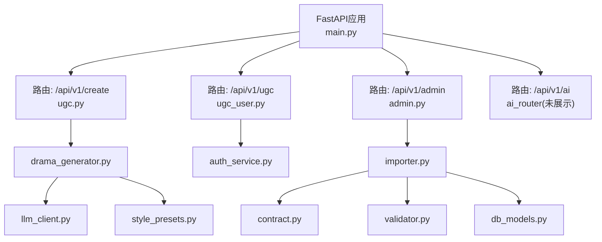
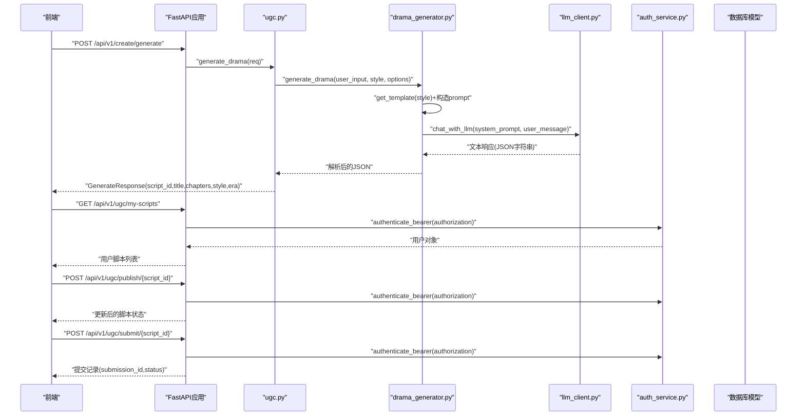
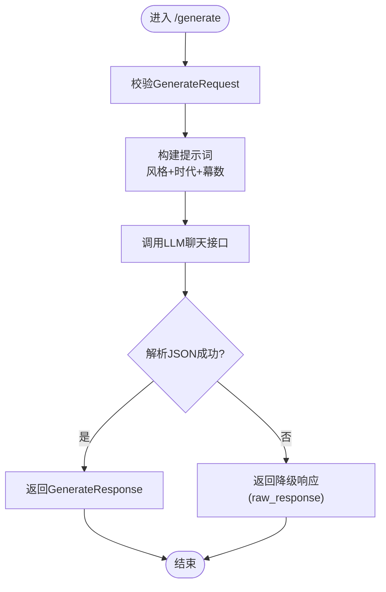
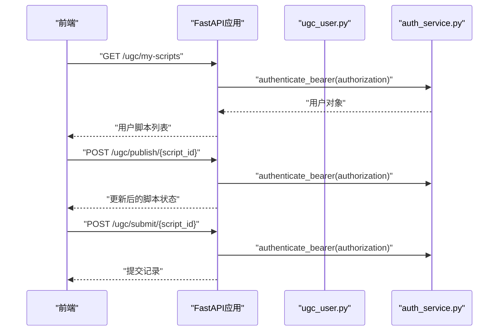
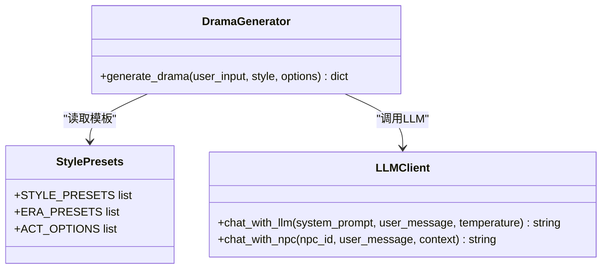
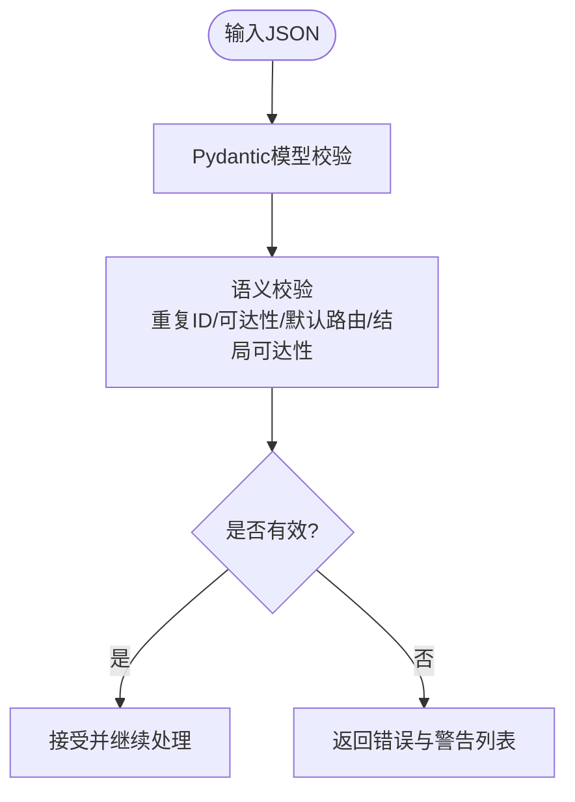
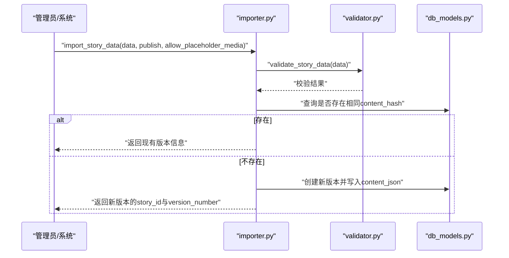
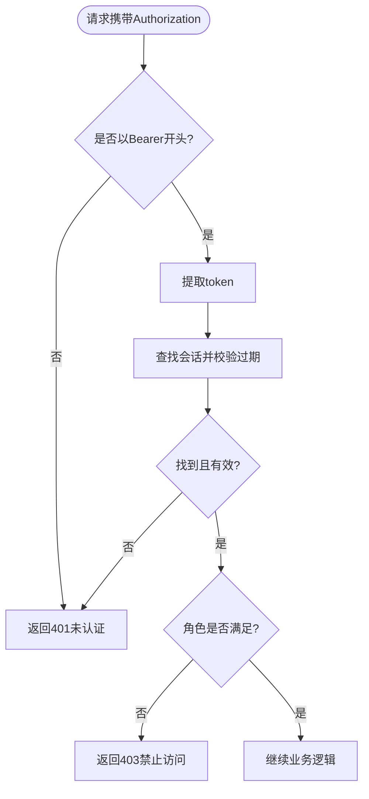
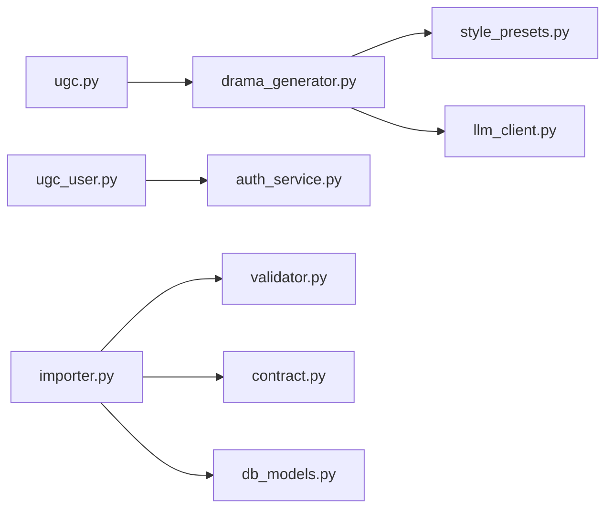

# UGC创作API

<cite>
**本文引用的文件**   
- [backend/app/main.py](file://backend/app/main.py)
- [backend/app/api/ugc.py](file://backend/app/api/ugc.py)
- [backend/app/api/ugc_user.py](file://backend/app/api/ugc_user.py)
- [backend/app/models.py](file://backend/app/models.py)
- [backend/app/ugc/drama_generator.py](file://backend/app/ugc/drama_generator.py)
- [backend/app/ugc/style_presets.py](file://backend/app/ugc/style_presets.py)
- [backend/app/ai/llm_client.py](file://backend/app/ai/llm_client.py)
- [backend/app/story/contract.py](file://backend/app/story/contract.py)
- [backend/app/story/validator.py](file://backend/app/story/validator.py)
- [backend/app/story/importer.py](file://backend/app/story/importer.py)
- [backend/app/story/script_loader.py](file://backend/app/story/script_loader.py)
- [backend/app/auth_service.py](file://backend/app/auth_service.py)
- [backend/app/db_models.py](file://backend/app/db_models.py)
- [backend/app/story/scripts/macau_mystery_demo.json](file://backend/app/story/scripts/macau_mystery_demo.json)
</cite>

## 目录
1. [简介](#简介)
2. [项目结构](#项目结构)
3. [核心组件](#核心组件)
4. [架构总览](#架构总览)
5. [详细组件分析](#详细组件分析)
6. [依赖关系分析](#依赖关系分析)
7. [性能考虑](#性能考虑)
8. [故障排查指南](#故障排查指南)
9. [结论](#结论)
10. [附录](#附录)

## 简介
本文件为UGC创作API的完整技术文档，覆盖用户内容创作、AI辅助生成、风格预设与内容管理的接口规范；包含剧本创建、编辑、发布与版本管理流程；描述AI生成算法工作原理、风格模板系统与内容校验机制；提供JSON格式的剧本结构定义与API调用示例；说明内容审核流程、权限控制与版权保护机制；并给出批量操作接口、导入导出功能与性能优化建议。

## 项目结构
后端采用FastAPI模块化路由组织：
- 应用入口与中间件、健康检查、路由注册在应用主文件中完成。
- UGC创作相关接口位于“create”与“ugc”两个路由组下，分别负责AI生成与用户脚本管理。
- AI能力通过LLM客户端与提示词模板驱动。
- 剧本数据结构由严格契约模型定义，并由验证器进行结构与语义校验。
- 导入与版本管理通过导入器实现，持久化到数据库模型中。

**图表来源** 
- [backend/app/main.py:84-96](file://backend/app/main.py#L84-L96)
- [backend/app/api/ugc.py:1-35](file://backend/app/api/ugc.py#L1-L35)
- [backend/app/api/ugc_user.py:1-96](file://backend/app/api/ugc_user.py#L1-L96)
- [backend/app/ugc/drama_generator.py:1-21](file://backend/app/ugc/drama_generator.py#L1-L21)
- [backend/app/ugc/style_presets.py:1-15](file://backend/app/ugc/style_presets.py#L1-L15)
- [backend/app/ai/llm_client.py:1-32](file://backend/app/ai/llm_client.py#L1-L32)
- [backend/app/story/importer.py:1-161](file://backend/app/story/importer.py#L1-L161)
- [backend/app/story/contract.py:1-128](file://backend/app/story/contract.py#L1-L128)
- [backend/app/story/validator.py:1-251](file://backend/app/story/validator.py#L1-L251)
- [backend/app/auth_service.py:1-153](file://backend/app/auth_service.py#L1-L153)
- [backend/app/db_models.py:1-160](file://backend/app/db_models.py#L1-L160)

**章节来源**
- [backend/app/main.py:17-111](file://backend/app/main.py#L17-L111)

## 核心组件
- UGC创作接口（/api/v1/create）
  - POST /generate：基于输入一句话生成短剧（当前Mock，后续接入DeepSeek）。
  - POST /regenerate/{script_id}：重新生成指定脚本。
- 用户脚本管理（/api/v1/ugc）
  - GET /my-scripts：列出当前用户的脚本。
  - POST /publish/{script_id}：设置公开或私有并发布。
  - POST /submit/{script_id}：提交至官方审核。
  - GET /public：列出所有已公开的脚本。
- 数据模型（Pydantic）
  - GenerateRequest/GenerateResponse：生成请求与响应结构。
  - ScriptMeta/ScriptCreateRequest/ScriptUpdateRequest：脚本元信息与更新请求。
- AI生成引擎
  - drama_generator：根据风格模板与选项构造提示词，调用LLM返回JSON。
  - llm_client：封装OpenAI兼容接口的异步聊天调用。
- 风格与时代预设
  - style_presets：风格、时代、幕数等枚举配置。
- 剧本契约与校验
  - contract：严格的数据契约（schema_version、story_id、title、entry_scene、chapters、clues等）。
  - validator：结构性与语义性校验（重复ID、可达性、默认路由、结局可达性等）。
- 导入与版本管理
  - importer：导入JSON、去重哈希、版本递增、发布状态管理。
  - db_models：Story、StoryVersion、GameSession、User、AuthSession等持久化模型。
- 认证与鉴权
  - auth_service：Bearer令牌校验、角色校验、演示账户初始化。

**章节来源**
- [backend/app/api/ugc.py:1-35](file://backend/app/api/ugc.py#L1-L35)
- [backend/app/api/ugc_user.py:1-96](file://backend/app/api/ugc_user.py#L1-L96)
- [backend/app/models.py:111-146](file://backend/app/models.py#L111-L146)
- [backend/app/ugc/drama_generator.py:1-21](file://backend/app/ugc/drama_generator.py#L1-L21)
- [backend/app/ugc/style_presets.py:1-15](file://backend/app/ugc/style_presets.py#L1-L15)
- [backend/app/ai/llm_client.py:1-32](file://backend/app/ai/llm_client.py#L1-L32)
- [backend/app/story/contract.py:1-128](file://backend/app/story/contract.py#L1-L128)
- [backend/app/story/validator.py:1-251](file://backend/app/story/validator.py#L1-L251)
- [backend/app/story/importer.py:1-161](file://backend/app/story/importer.py#L1-L161)
- [backend/app/db_models.py:24-160](file://backend/app/db_models.py#L24-L160)
- [backend/app/auth_service.py:100-130](file://backend/app/auth_service.py#L100-L130)

## 架构总览
UGC创作API的整体交互流程如下：
- 前端调用 /api/v1/create/generate 触发AI生成，内部使用 drama_generator 构建提示词并调用 llm_client 获取结果。
- 用户脚本管理通过 /api/v1/ugc/* 接口完成列表、发布与提交审核，鉴权由 auth_service 提供。
- 剧本导入与版本管理通过 importer 将JSON校验后写入数据库，维护版本与发布状态。
- 健康检查与健康探针由 main.py 暴露。

**图表来源** 
- [backend/app/main.py:84-96](file://backend/app/main.py#L84-L96)
- [backend/app/api/ugc.py:8-35](file://backend/app/api/ugc.py#L8-L35)
- [backend/app/ugc/drama_generator.py:5-21](file://backend/app/ugc/drama_generator.py#L5-L21)
- [backend/app/ai/llm_client.py:12-25](file://backend/app/ai/llm_client.py#L12-L25)
- [backend/app/api/ugc_user.py:31-77](file://backend/app/api/ugc_user.py#L31-L77)
- [backend/app/auth_service.py:100-123](file://backend/app/auth_service.py#L100-L123)

## 详细组件分析

### UGC创作接口（/api/v1/create）
- POST /generate
  - 入参：GenerateRequest(input, style, options)。
  - 行为：当前返回Mock章节，后续替换为真实LLM生成。
  - 出参：GenerateResponse(script_id, title, chapters, style, era)。
- POST /regenerate/{script_id}
  - 行为：占位接口，返回脚本ID与状态。

**图表来源** 
- [backend/app/api/ugc.py:8-29](file://backend/app/api/ugc.py#L8-L29)
- [backend/app/ugc/drama_generator.py:5-21](file://backend/app/ugc/drama_generator.py#L5-L21)
- [backend/app/ai/llm_client.py:12-25](file://backend/app/ai/llm_client.py#L12-L25)

**章节来源**
- [backend/app/api/ugc.py:1-35](file://backend/app/api/ugc.py#L1-L35)
- [backend/app/models.py:111-123](file://backend/app/models.py#L111-L123)

### 用户脚本管理（/api/v1/ugc）
- GET /my-scripts：需Bearer认证，返回当前用户脚本列表。
- POST /publish/{script_id}：需Bearer认证，仅作者可修改，支持公开/私有切换。
- POST /submit/{script_id}：需Bearer认证，仅公开脚本可提交审核。
- GET /public：无需认证，列出所有公开脚本。

**图表来源** 
- [backend/app/api/ugc_user.py:31-77](file://backend/app/api/ugc_user.py#L31-L77)
- [backend/app/auth_service.py:100-123](file://backend/app/auth_service.py#L100-L123)

**章节来源**
- [backend/app/api/ugc_user.py:1-96](file://backend/app/api/ugc_user.py#L1-L96)

### AI生成引擎与风格模板
- drama_generator：根据风格模板与选项构造提示词，调用LLM返回JSON。
- style_presets：定义风格、时代、幕数等预设。
- llm_client：封装OpenAI兼容接口，支持temperature与max_tokens参数。

**图表来源** 
- [backend/app/ugc/drama_generator.py:1-21](file://backend/app/ugc/drama_generator.py#L1-L21)
- [backend/app/ugc/style_presets.py:1-15](file://backend/app/ugc/style_presets.py#L1-L15)
- [backend/app/ai/llm_client.py:1-32](file://backend/app/ai/llm_client.py#L1-L32)

**章节来源**
- [backend/app/ugc/drama_generator.py:1-21](file://backend/app/ugc/drama_generator.py#L1-L21)
- [backend/app/ugc/style_presets.py:1-15](file://backend/app/ugc/style_presets.py#L1-L15)
- [backend/app/ai/llm_client.py:1-32](file://backend/app/ai/llm_client.py#L1-L32)

### 剧本契约与校验
- contract：严格定义Schema版本、故事标识、标题、入口场景、章节、线索等字段类型与约束。
- validator：对重复ID、可达性、默认路由、结局可达性等进行校验，输出错误与警告。

**图表来源** 
- [backend/app/story/contract.py:1-128](file://backend/app/story/contract.py#L1-L128)
- [backend/app/story/validator.py:40-190](file://backend/app/story/validator.py#L40-L190)

**章节来源**
- [backend/app/story/contract.py:1-128](file://backend/app/story/contract.py#L1-L128)
- [backend/app/story/validator.py:1-251](file://backend/app/story/validator.py#L1-L251)

### 导入与版本管理
- importer：加载JSON、计算内容哈希、去重、版本递增、发布状态管理。
- db_models：Story与StoryVersion关联，维护active_version_id与published_at。

**图表来源** 
- [backend/app/story/importer.py:59-135](file://backend/app/story/importer.py#L59-L135)
- [backend/app/story/validator.py:40-52](file://backend/app/story/validator.py#L40-L52)
- [backend/app/db_models.py:24-71](file://backend/app/db_models.py#L24-L71)

**章节来源**
- [backend/app/story/importer.py:1-161](file://backend/app/story/importer.py#L1-L161)
- [backend/app/db_models.py:24-71](file://backend/app/db_models.py#L24-L71)

### 认证与权限控制
- auth_service：Bearer令牌校验、过期时间检查、角色校验（admin/user）。
- ugc_user：所有写操作均需Bearer认证，确保仅作者可修改自身脚本。

**图表来源** 
- [backend/app/auth_service.py:100-130](file://backend/app/auth_service.py#L100-L130)
- [backend/app/api/ugc_user.py:31-77](file://backend/app/api/ugc_user.py#L31-L77)

**章节来源**
- [backend/app/auth_service.py:1-153](file://backend/app/auth_service.py#L1-L153)
- [backend/app/api/ugc_user.py:1-96](file://backend/app/api/ugc_user.py#L1-L96)

### 剧本结构定义（JSON）
- schema_version：固定为1。
- story_id：唯一标识。
- title：标题。
- description：可选描述。
- entry_scene：入口场景ID（必须为video节点）。
- chapters：章节数组，每个章节包含id、title、location、gps、scenes。
- scenes：视频场景、结局场景、路由器场景三种类型。
- clues：线索定义字典。

参考示例文件路径：[macau_mystery_demo.json:1-149](file://backend/app/story/scripts/macau_mystery_demo.json#L1-L149)

**章节来源**
- [backend/app/story/contract.py:120-128](file://backend/app/story/contract.py#L120-L128)
- [backend/app/story/scripts/macau_mystery_demo.json:1-149](file://backend/app/story/scripts/macau_mystery_demo.json#L1-L149)

## 依赖关系分析
- 路由层依赖：
  - create路由依赖drama_generator与llm_client。
  - ugc路由依赖auth_service与内存存储（生产应替换为数据库）。
- 数据层依赖：
  - importer依赖validator与contract进行校验。
  - db_models定义持久化实体与关系。
- 外部依赖：
  - OpenAI兼容接口（SiliconFlow）用于LLM调用。

**图表来源** 
- [backend/app/api/ugc.py:1-35](file://backend/app/api/ugc.py#L1-L35)
- [backend/app/ugc/drama_generator.py:1-21](file://backend/app/ugc/drama_generator.py#L1-L21)
- [backend/app/ugc/style_presets.py:1-15](file://backend/app/ugc/style_presets.py#L1-L15)
- [backend/app/ai/llm_client.py:1-32](file://backend/app/ai/llm_client.py#L1-L32)
- [backend/app/api/ugc_user.py:1-96](file://backend/app/api/ugc_user.py#L1-L96)
- [backend/app/auth_service.py:1-153](file://backend/app/auth_service.py#L1-L153)
- [backend/app/story/importer.py:1-161](file://backend/app/story/importer.py#L1-L161)
- [backend/app/story/validator.py:1-251](file://backend/app/story/validator.py#L1-L251)
- [backend/app/story/contract.py:1-128](file://backend/app/story/contract.py#L1-L128)
- [backend/app/db_models.py:1-160](file://backend/app/db_models.py#L1-L160)

**章节来源**
- [backend/app/main.py:84-96](file://backend/app/main.py#L84-L96)

## 性能考虑
- LLM调用优化
  - 合理设置temperature与max_tokens，避免过长响应。
  - 缓存常用模板与风格配置，减少重复构造。
- 校验与导入
  - 使用结构化校验（Pydantic）尽早失败，减少无效数据处理。
  - 内容哈希去重避免重复写入。
- 并发与资源
  - 异步IO提升吞吐，注意数据库连接池与事务边界。
  - 对外部服务（LLM）调用增加超时与重试策略。
- 存储与查询
  - 索引常用字段（如slug、story_id、version_number）。
  - 分页与过滤公共脚本列表，避免全表扫描。

[本节为通用指导，不直接分析具体文件]

## 故障排查指南
- 常见错误码与原因
  - 401 未认证：缺少或无效的Bearer令牌。
  - 403 禁止访问：非作者或无管理员权限。
  - 404 未找到：脚本不存在。
  - 422 请求校验错误：字段类型或格式不合法。
- 调试步骤
  - 检查Authorization头是否正确携带。
  - 查看请求体是否符合Pydantic模型定义。
  - 确认数据库迁移已完成（alembic upgrade head）。
  - 查看LLM调用日志与错误信息。

**章节来源**
- [backend/app/main.py:38-74](file://backend/app/main.py#L38-L74)
- [backend/app/auth_service.py:100-130](file://backend/app/auth_service.py#L100-L130)
- [backend/app/api/ugc_user.py:44-77](file://backend/app/api/ugc_user.py#L44-L77)

## 结论
本UGC创作API提供了从AI生成到用户脚本管理与审核的完整链路，结合严格的剧本契约与校验机制，确保内容质量与一致性。通过清晰的权限控制与版本管理，支持安全的内容发布与迭代。建议在后续阶段完善持久化存储、增强错误处理与监控指标，以提升稳定性与可观测性。

[本节为总结性内容，不直接分析具体文件]

## 附录

### API调用示例（JSON格式）
- 生成短剧
  - 请求：POST /api/v1/create/generate
  - 请求体：{ "input": "一句话剧情", "style": "suspense", "options": { "era": "qing", "acts": 3 } }
  - 响应：{ "script_id": "...", "title": "...", "chapters": [...], "style": "...", "era": "..." }
- 列出我的脚本
  - 请求：GET /api/v1/ugc/my-scripts
  - 头部：Authorization: Bearer <token>
  - 响应：[ { "id": "...", "title": "...", "is_public": true/false, ... } ]
- 发布脚本
  - 请求：POST /api/v1/ugc/publish/{script_id}
  - 头部：Authorization: Bearer <token>
  - 请求体：{ "is_public": true }
  - 响应：更新后的脚本对象
- 提交审核
  - 请求：POST /api/v1/ugc/submit/{script_id}
  - 头部：Authorization: Bearer <token>
  - 请求体：{ "message": "请审核" }
  - 响应：{ "submission_id": "...", "status": "pending" }

**章节来源**
- [backend/app/api/ugc.py:8-35](file://backend/app/api/ugc.py#L8-L35)
- [backend/app/api/ugc_user.py:37-77](file://backend/app/api/ugc_user.py#L37-L77)
- [backend/app/models.py:111-123](file://backend/app/models.py#L111-L123)

### 批量操作与导入导出
- 导入
  - 使用importer导入JSON文件，支持发布与占位媒体开关。
- 导出
  - 可通过数据库查询Story与StoryVersion的content_json导出。
- 批量
  - 当前为内存存储，生产环境建议提供批量导入/导出接口。

**章节来源**
- [backend/app/story/importer.py:138-161](file://backend/app/story/importer.py#L138-L161)
- [backend/app/db_models.py:24-71](file://backend/app/db_models.py#L24-L71)

### 内容审核流程
- 用户提交后，状态为pending。
- 管理员通过/admin/submissions接口查看与审批（approve/reject）。
- 审核通过后，脚本可被公开或纳入官方推荐。

**章节来源**
- [backend/app/api/ugc_user.py:56-77](file://backend/app/api/ugc_user.py#L56-L77)
- [backend/app/api/admin.py:185-209](file://backend/app/api/admin.py#L185-L209)

### 版权保护机制
- 内容哈希：对JSON内容进行规范化序列化后计算SHA256，避免重复与篡改。
- 版本隔离：每个版本独立存储，支持回滚与对比。
- 权限控制：仅作者可修改自身脚本，管理员可审核与发布。

**章节来源**
- [backend/app/story/importer.py:52-56](file://backend/app/story/importer.py#L52-L56)
- [backend/app/db_models.py:52-71](file://backend/app/db_models.py#L52-L71)
- [backend/app/auth_service.py:126-130](file://backend/app/auth_service.py#L126-L130)