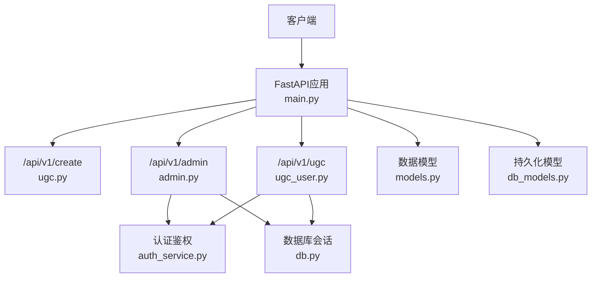
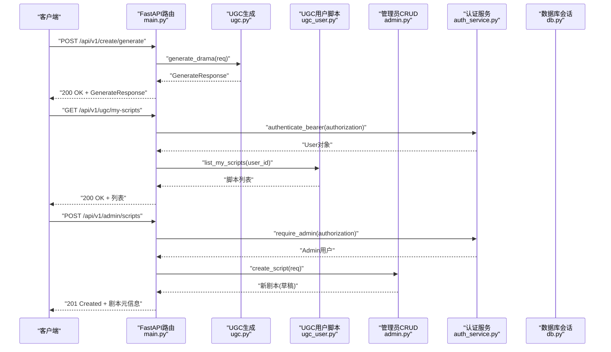
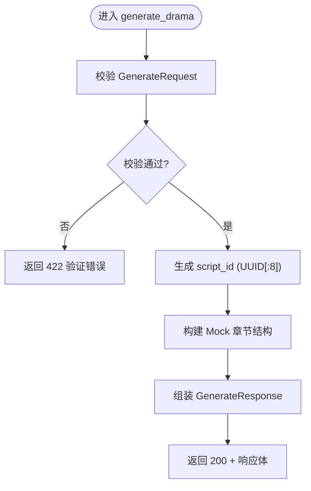
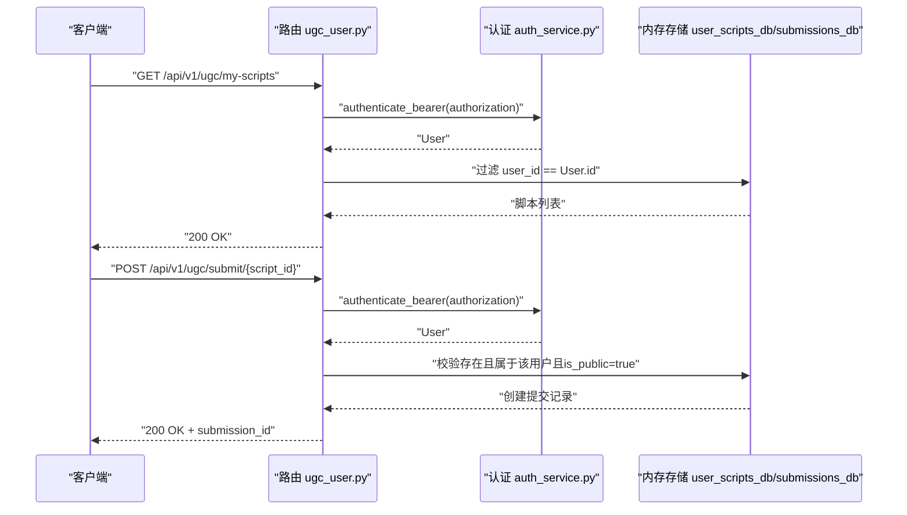
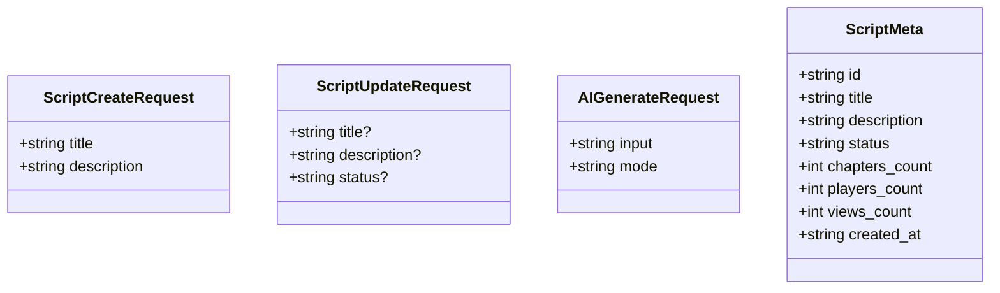
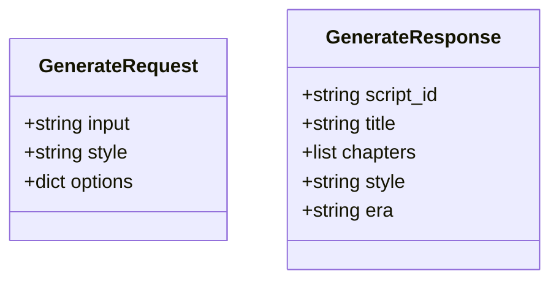
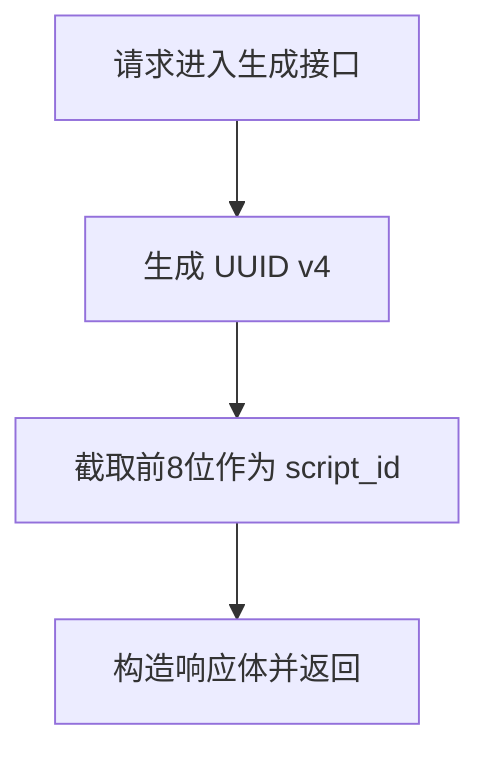
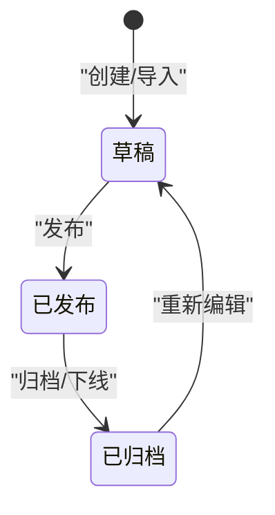
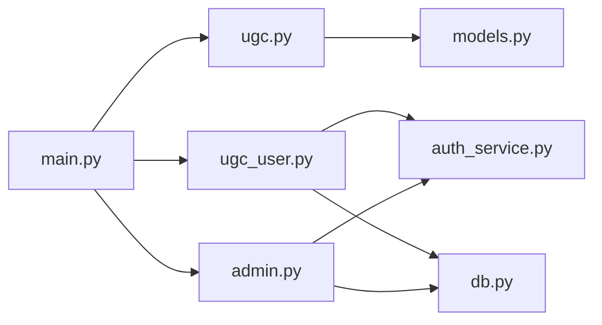

# 内容管理API

<cite>
**本文引用的文件**   
- [main.py](file://backend/app/main.py)
- [ugc.py](file://backend/app/api/ugc.py)
- [ugc_user.py](file://backend/app/api/ugc_user.py)
- [admin.py](file://backend/app/api/admin.py)
- [models.py](file://backend/app/models.py)
- [db_models.py](file://backend/app/db_models.py)
- [auth_service.py](file://backend/app/auth_service.py)
- [db.py](file://backend/app/db.py)
- [config.py](file://backend/app/config.py)
- [game_errors.py](file://backend/app/game_errors.py)
</cite>

## 目录
1. [简介](#简介)
2. [项目结构](#项目结构)
3. [核心组件](#核心组件)
4. [架构总览](#架构总览)
5. [详细组件分析](#详细组件分析)
6. [依赖关系分析](#依赖关系分析)
7. [性能考虑](#性能考虑)
8. [故障排查指南](#故障排查指南)
9. [结论](#结论)
10. [附录](#附录)

## 简介
本文件面向UGC（用户生成内容）内容管理API，聚焦“剧本”的CRUD与AI生成能力。文档涵盖：
- 生成接口GenerateRequest与GenerateResponse的数据结构与校验规则
- 脚本ID生成机制、版本管理与状态流转
- 完整的API调用示例（请求头、请求体、响应体）
- 错误处理、异常与边界条件说明
- 管理员侧的剧本CRUD与发布流程

## 项目结构
后端采用FastAPI模块化路由组织，UGC相关能力分布在以下模块：
- /api/v1/create：UGC创作入口（当前为Mock生成）
- /api/v1/ugc：用户脚本发布、提交审核与公开列表
- /api/v1/admin：管理员剧本CRUD、统计、提交审核与路线配置
- 数据模型定义集中在models.py与db_models.py
- 认证鉴权通过auth_service完成，数据库会话由db提供

**图表来源** 
- [main.py:84-96](file://backend/app/main.py#L84-L96)
- [ugc.py:1-35](file://backend/app/api/ugc.py#L1-L35)
- [ugc_user.py:1-96](file://backend/app/api/ugc_user.py#L1-L96)
- [admin.py:1-218](file://backend/app/api/admin.py#L1-L218)
- [models.py:111-146](file://backend/app/models.py#L111-L146)
- [db_models.py:24-71](file://backend/app/db_models.py#L24-L71)
- [auth_service.py:100-124](file://backend/app/auth_service.py#L100-L124)
- [db.py:30-33](file://backend/app/db.py#L30-L33)

**章节来源**
- [main.py:84-96](file://backend/app/main.py#L84-L96)

## 核心组件
- 生成接口（UGC创作）
  - POST /api/v1/create/generate：基于输入一句话生成短剧（当前Mock）
  - 返回GenerateResponse，包含script_id、title、chapters、style、era
- 用户脚本管理（UGC用户）
  - GET /api/v1/ugc/my-scripts：列出我的脚本（需认证）
  - POST /api/v1/ugc/publish/{script_id}：设置公开/私有并更新状态
  - POST /api/v1/ugc/submit/{script_id}：提交至官方审核
  - GET /api/v1/ugc/public：公开脚本列表
- 管理员剧本CRUD（Admin）
  - GET /api/v1/admin/scripts：列出所有剧本
  - POST /api/v1/admin/scripts：创建剧本（默认draft）
  - PUT /api/v1/admin/scripts/{id}：更新标题、描述、状态等
  - DELETE /api/v1/admin/scripts/{id}：删除剧本
  - POST /api/v1/admin/scripts/{id}/publish：切换发布状态
  - POST /api/v1/admin/scripts/ai-generate：管理员AI快速生成草稿

**章节来源**
- [ugc.py:8-29](file://backend/app/api/ugc.py#L8-L29)
- [ugc_user.py:37-95](file://backend/app/api/ugc_user.py#L37-L95)
- [admin.py:71-168](file://backend/app/api/admin.py#L71-L168)

## 架构总览
下图展示UGC内容管理的端到端调用路径与数据流向。

**图表来源** 
- [main.py:84-96](file://backend/app/main.py#L84-L96)
- [ugc.py:8-29](file://backend/app/api/ugc.py#L8-L29)
- [ugc_user.py:31-40](file://backend/app/api/ugc_user.py#L31-L40)
- [admin.py:75-91](file://backend/app/api/admin.py#L75-L91)
- [auth_service.py:100-124](file://backend/app/auth_service.py#L100-L124)
- [db.py:30-33](file://backend/app/db.py#L30-L33)

## 详细组件分析

### 生成接口：POST /api/v1/create/generate
- 功能：根据一句话输入生成短剧（当前为Mock实现），后续可接入LLM
- 请求体：GenerateRequest
  - input: 必填字符串，用于生成剧情
  - style: 可选字符串，默认"suspense"
  - options: 可选字典，支持如era、acts、custom_prompt等扩展参数
- 响应体：GenerateResponse
  - script_id: 生成的脚本ID（当前为UUID前8位）
  - title: 标题（基于input截取生成）
  - chapters: 章节数组（当前Mock，每章含场景、旁白、对话、选择）
  - style: 风格
  - era: 时代（从options中取，默认清代）
- 输入校验：由Pydantic自动校验类型与必填项；若不符合将触发统一验证错误处理器
- 错误处理：未定义业务异常时，使用FastAPI默认422或HTTPException

**图表来源** 
- [ugc.py:8-29](file://backend/app/api/ugc.py#L8-L29)
- [models.py:111-123](file://backend/app/models.py#L111-L123)

**章节来源**
- [ugc.py:8-29](file://backend/app/api/ugc.py#L8-L29)
- [models.py:111-123](file://backend/app/models.py#L111-L123)

### 用户脚本管理：/api/v1/ugc
- GET /api/v1/ugc/my-scripts
  - 认证：需要Authorization: Bearer <token>
  - 返回：当前用户的脚本列表（内存存储）
- POST /api/v1/ugc/publish/{script_id}
  - 认证：需要Authorization: Bearer <token>
  - 请求体：PublishRequest { is_public: bool }
  - 行为：更新is_public与status（public/private）
  - 错误：404脚本不存在、403非本人脚本
- POST /api/v1/ugc/submit/{script_id}
  - 认证：需要Authorization: Bearer <token>
  - 请求体：SubmitRequest { message: string }
  - 行为：创建提交记录（submissions_db），标记已提交
  - 错误：404脚本不存在、403非本人脚本、400必须为公开脚本
- GET /api/v1/ugc/public
  - 无认证：返回所有公开脚本的摘要列表

**图表来源** 
- [ugc_user.py:31-77](file://backend/app/api/ugc_user.py#L31-L77)
- [auth_service.py:100-124](file://backend/app/auth_service.py#L100-L124)

**章节来源**
- [ugc_user.py:22-95](file://backend/app/api/ugc_user.py#L22-L95)
- [auth_service.py:100-124](file://backend/app/auth_service.py#L100-L124)

### 管理员剧本CRUD：/api/v1/admin/scripts
- GET /api/v1/admin/scripts：列出所有剧本（无需认证，但建议结合鉴权）
- POST /api/v1/admin/scripts：创建剧本（需管理员认证）
  - 请求体：ScriptCreateRequest { title, description? }
  - 返回：新剧本元信息（默认status=draft）
- PUT /api/v1/admin/scripts/{id}：更新字段（title/description/status）
- DELETE /api/v1/admin/scripts/{id}：删除剧本
- POST /api/v1/admin/scripts/{id}/publish：切换published/draft
- POST /api/v1/admin/scripts/ai-generate：管理员AI快速生成草稿（当前Mock）

**图表来源** 
- [admin.py:42-64](file://backend/app/api/admin.py#L42-L64)

**章节来源**
- [admin.py:71-168](file://backend/app/api/admin.py#L71-L168)

### 数据模型与校验
- GenerateRequest/GenerateResponse：定义于models.py，用于UGC生成接口
- ScriptCreateRequest/ScriptUpdateRequest/AIGenerateRequest：定义于admin.py，用于管理员CRUD与AI生成
- 其他游戏相关模型（GameStartRequest、GameSnapshot等）位于models.py，与本UGC文档不直接相关

**图表来源** 
- [models.py:111-123](file://backend/app/models.py#L111-L123)

**章节来源**
- [models.py:111-123](file://backend/app/models.py#L111-L123)

### 脚本ID生成机制
- UGC生成接口：script_id = str(uuid.uuid4())[:8]（8位短ID）
- 管理员AI生成：new_id = str(uuid.uuid4())[:8]
- 持久化层（故事版本）：使用UUID v4作为主键，并通过content_hash与version_number进行唯一性约束

**图表来源** 
- [ugc.py:11](file://backend/app/api/ugc.py#L11)
- [admin.py:128](file://backend/app/api/admin.py#L128)
- [db_models.py:27](file://backend/app/db_models.py#L27)

**章节来源**
- [ugc.py:11](file://backend/app/api/ugc.py#L11)
- [admin.py:128](file://backend/app/api/admin.py#L128)
- [db_models.py:27](file://backend/app/db_models.py#L27)

### 版本管理与状态流转
- 故事版本模型（StoryVersion）：
  - version_number：版本号（整数）
  - schema_version：Schema版本
  - status：draft/published/retired
  - content_json：内容JSON
  - content_hash：内容哈希（用于去重）
  - published_at：发布时间
- 故事（Story）：
  - active_version_id：指向当前活跃版本
  - status：draft/published/retired
- 管理员发布接口：切换published/draft状态

**图表来源** 
- [db_models.py:24-71](file://backend/app/db_models.py#L24-L71)
- [admin.py:115-122](file://backend/app/api/admin.py#L115-L122)

**章节来源**
- [db_models.py:24-71](file://backend/app/db_models.py#L24-L71)
- [admin.py:115-122](file://backend/app/api/admin.py#L115-L122)

### 完整API调用示例
以下为常用接口的请求与响应示例（以文本形式呈现）：

- 生成短剧（UGC）
  - 方法：POST
  - 路径：/api/v1/create/generate
  - 请求头：Content-Type: application/json
  - 请求体：{ "input": "澳门历史悬疑短剧", "style": "suspense", "options": { "era": "清代", "acts": 3 } }
  - 响应体：{ "script_id": "a1b2c3d4", "title": "AI生成短剧: 澳门历史悬疑短剧", "chapters": [...], "style": "suspense", "era": "清代" }

- 列出我的脚本（UGC用户）
  - 方法：GET
  - 路径：/api/v1/ugc/my-scripts
  - 请求头：Authorization: Bearer <token>, Content-Type: application/json
  - 响应体：[ { "id": "...", "title": "...", "is_public": true/false, ... } ]

- 发布/取消公开（UGC用户）
  - 方法：POST
  - 路径：/api/v1/ugc/publish/{script_id}
  - 请求头：Authorization: Bearer <token>, Content-Type: application/json
  - 请求体：{ "is_public": true }
  - 响应体：{ "id": "...", "title": "...", "is_public": true, "status": "public" }

- 提交至官方审核（UGC用户）
  - 方法：POST
  - 路径：/api/v1/ugc/submit/{script_id}
  - 请求头：Authorization: Bearer <token>, Content-Type: application/json
  - 请求体：{ "message": "请审核此剧本" }
  - 响应体：{ "submission_id": "...", "status": "pending" }

- 管理员创建剧本
  - 方法：POST
  - 路径：/api/v1/admin/scripts
  - 请求头：Authorization: Bearer <admin_token>, Content-Type: application/json
  - 请求体：{ "title": "新剧本", "description": "简介" }
  - 响应体：{ "id": "100", "title": "新剧本", "status": "draft", ... }

- 管理员AI快速生成
  - 方法：POST
  - 路径：/api/v1/admin/scripts/ai-generate
  - 请求头：Authorization: Bearer <admin_token>, Content-Type: application/json
  - 请求体：{ "input": "一段创意", "mode": "quick" }
  - 响应体：{ "id": "e5f6g7h8", "title": "AI Generated: 一段创意", "chapters": [...], "status": "draft", ... }

**章节来源**
- [ugc.py:8-29](file://backend/app/api/ugc.py#L8-L29)
- [ugc_user.py:37-77](file://backend/app/api/ugc_user.py#L37-L77)
- [admin.py:75-168](file://backend/app/api/admin.py#L75-L168)

## 依赖关系分析
- 路由注册：main.py集中注册各子路由，包括ugc、ugc_user、admin
- 认证依赖：ugc_user与admin均依赖auth_service.authenticate_bearer/require_admin
- 数据库依赖：ugc_user与admin在需要时使用get_db_session获取AsyncSession
- 模型依赖：ugc.py依赖models.GenerateRequest/GenerateResponse；admin.py定义自身请求模型

**图表来源** 
- [main.py:84-96](file://backend/app/main.py#L84-L96)
- [ugc_user.py:9-13](file://backend/app/api/ugc_user.py#L9-L13)
- [admin.py:9-13](file://backend/app/api/admin.py#L9-L13)
- [auth_service.py:100-124](file://backend/app/auth_service.py#L100-L124)
- [db.py:30-33](file://backend/app/db.py#L30-L33)
- [models.py:111-123](file://backend/app/models.py#L111-L123)

**章节来源**
- [main.py:84-96](file://backend/app/main.py#L84-L96)

## 性能考虑
- 当前UGC与Admin脚本存储为内存字典，适合开发演示，生产环境应替换为持久化存储
- 生成接口为Mock，实际接入LLM时需考虑异步调用、超时与重试策略
- 数据库连接池与SQLite PRAGMA优化已在db.py中启用，注意并发写入时的锁与超时
- 建议在UGC生成链路引入缓存（如按input+style+options哈希缓存结果）以减少重复计算

## 故障排查指南
- 认证失败（401）
  - 检查Authorization头是否包含Bearer token
  - 确认token未过期且用户处于激活状态
- 权限不足（403）
  - 管理员接口需admin角色
  - 用户脚本操作需确保脚本属于当前用户
- 资源不存在（404）
  - 检查script_id是否存在于内存存储或数据库
- 请求校验失败（422）
  - 查看错误详情中的path、message、type定位字段问题
- 健康检查
  - GET /api/v1/health：若数据库不可用返回503

**章节来源**
- [auth_service.py:100-124](file://backend/app/auth_service.py#L100-L124)
- [ugc_user.py:44-77](file://backend/app/api/ugc_user.py#L44-L77)
- [admin.py:94-122](file://backend/app/api/admin.py#L94-L122)
- [main.py:98-105](file://backend/app/main.py#L98-L105)

## 结论
本UGC内容管理API提供了从生成到发布、审核的全流程能力。当前UGC生成为Mock实现，管理员CRUD与用户脚本管理已具备基础功能。生产部署建议：
- 将内存存储替换为持久化数据库
- 接入真实LLM生成引擎，完善错误与重试机制
- 强化输入校验与输出Schema一致性
- 增加审计日志与限流保护

## 附录
- 配置项（环境变量）
  - DATABASE_URL：数据库连接串
  - CORS_ORIGINS：允许的跨域来源
  - AUTH_TOKEN_TTL_HOURS：令牌有效期（小时）
  - BOOTSTRAP_DEMO_STORY/BOOTSTRAP_DEMO_USERS：是否初始化演示数据
- 错误模型
  - GameError：统一业务错误封装，包含code、message、details

**章节来源**
- [config.py:39-76](file://backend/app/config.py#L39-L76)
- [game_errors.py:7-20](file://backend/app/game_errors.py#L7-L20)