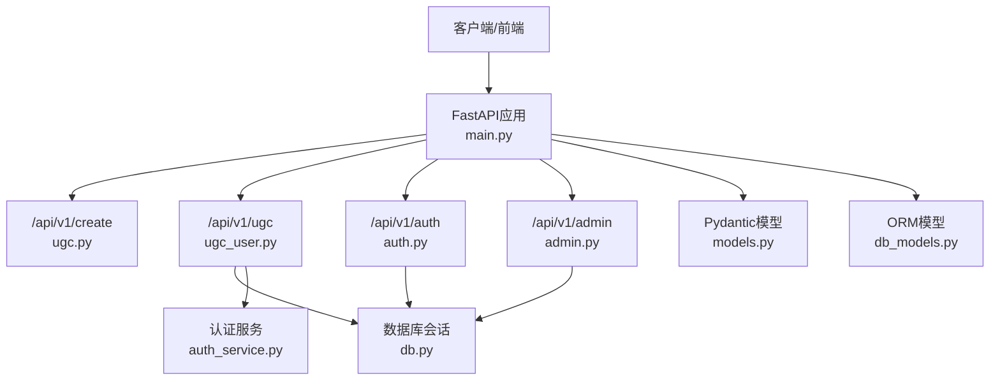
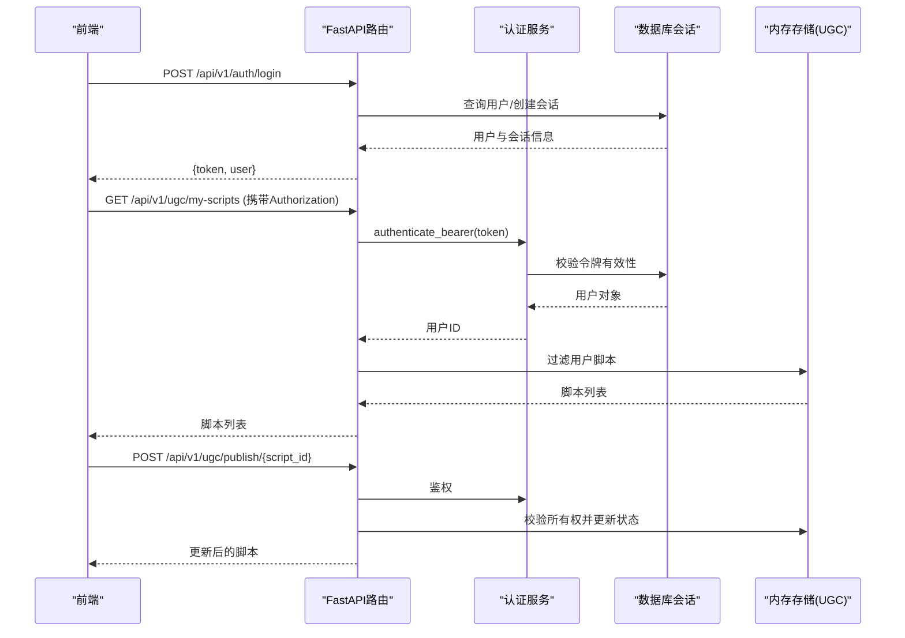
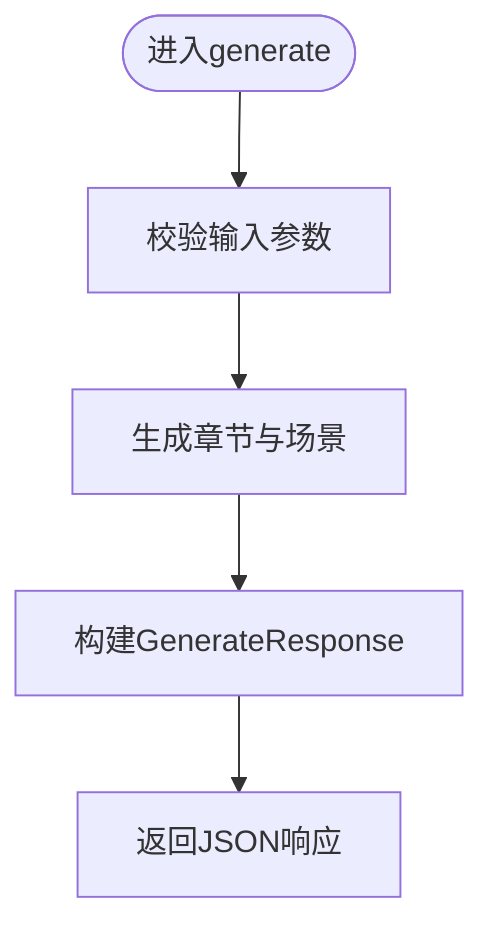
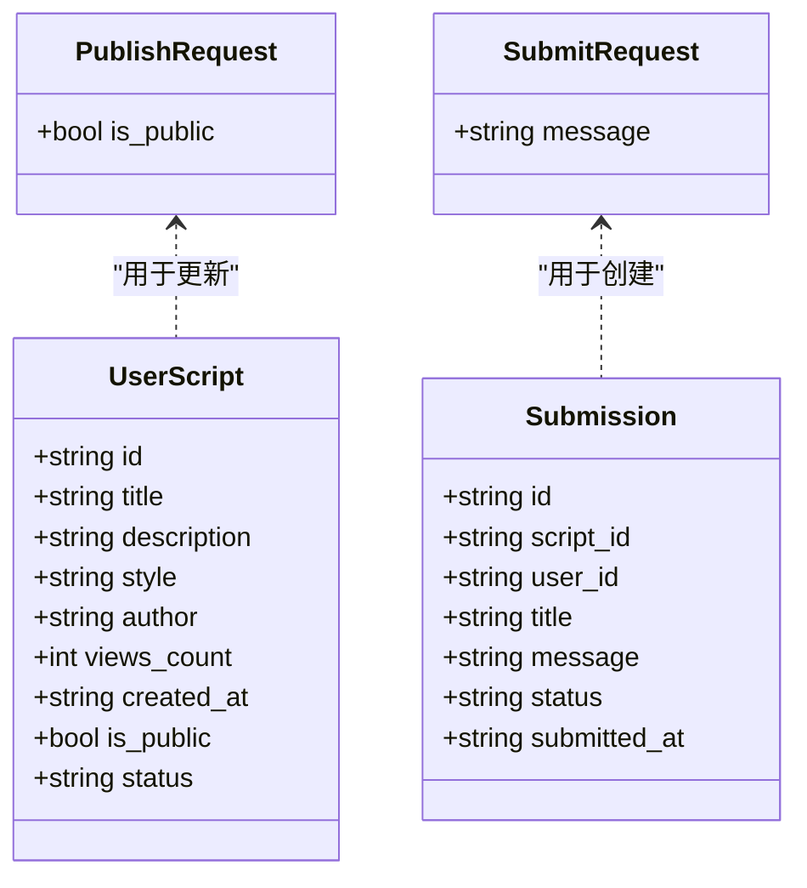
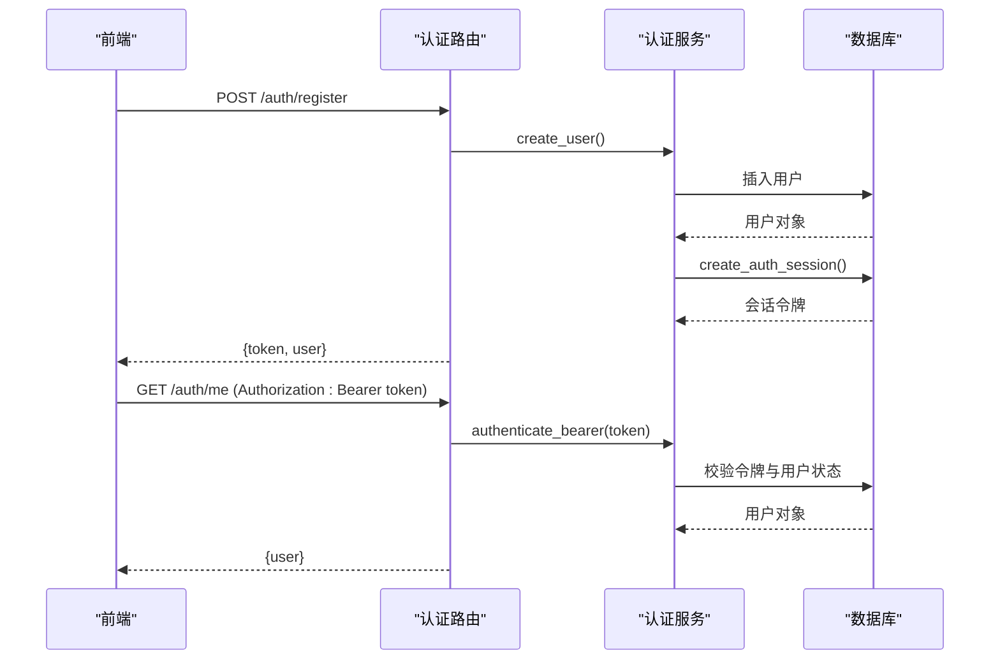
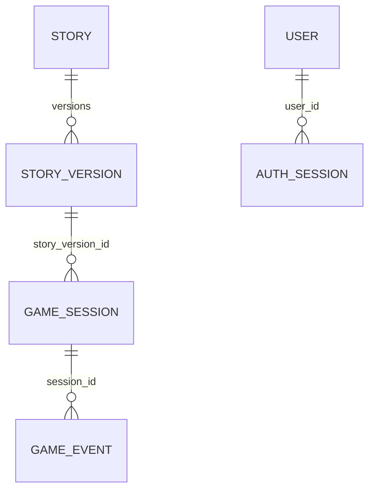
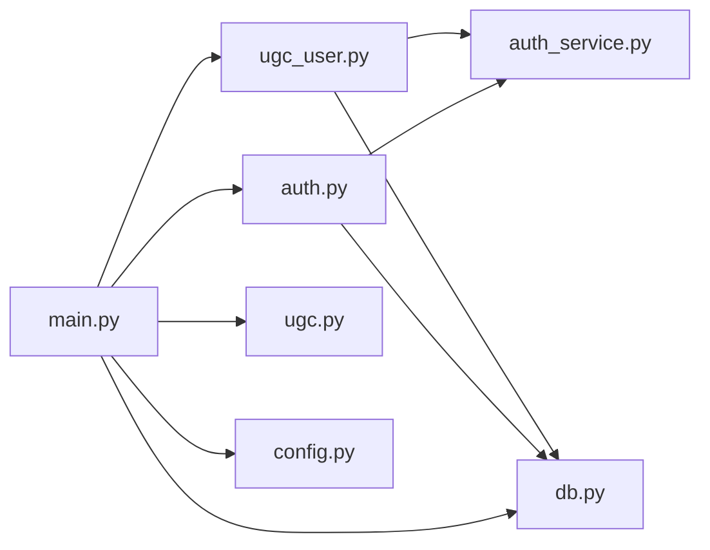

# 用户内容API

<cite>
**本文引用的文件**   
- [backend/app/main.py](file://backend/app/main.py)
- [backend/app/api/ugc.py](file://backend/app/api/ugc.py)
- [backend/app/api/ugc_user.py](file://backend/app/api/ugc_user.py)
- [backend/app/models.py](file://backend/app/models.py)
- [backend/app/db_models.py](file://backend/app/db_models.py)
- [backend/app/auth_service.py](file://backend/app/auth_service.py)
- [backend/app/config.py](file://backend/app/config.py)
- [backend/app/db.py](file://backend/app/db.py)
- [backend/app/game_errors.py](file://backend/app/game_errors.py)
- [frontend/src/lib/api.ts](file://frontend/src/lib/api.ts)
</cite>

## 目录
1. [简介](#简介)
2. [项目结构](#项目结构)
3. [核心组件](#核心组件)
4. [架构总览](#架构总览)
5. [详细组件分析](#详细组件分析)
6. [依赖关系分析](#依赖关系分析)
7. [性能考虑](#性能考虑)
8. [故障排查指南](#故障排查指南)
9. [结论](#结论)
10. [附录](#附录)

## 简介
本文件面向“用户内容管理API”的完整文档，聚焦于用户个人内容的CRUD、剧本上传、编辑、发布与分享，权限控制、所有权验证、访问控制、批量操作（导入/导出/批量更新）、内容审核流程、版权保护与侵权处理、内容统计、版本历史与协作编辑、文件存储策略、媒体资源管理与CDN集成方案。当前代码库已实现UGC生成、用户脚本列表/发布/提交官方审核的基础能力，并具备完善的认证鉴权、数据库模型与错误处理机制。

## 项目结构
后端采用FastAPI模块化路由组织，按功能划分：
- /api/v1/create：UGC内容生成（AI生成短剧）
- /api/v1/ugc：用户UGC脚本管理（我的剧本、公开列表、发布、提交审核）
- /api/v1/auth：用户注册/登录/获取当前用户
- /api/v1/admin：管理员接口（前端调用预留）
- 数据层：SQLAlchemy异步ORM模型、会话与引擎配置
- 配置：环境变量驱动的运行时设置（数据库、CORS、Token TTL等）

**图表来源** 
- [backend/app/main.py:84-96](file://backend/app/main.py#L84-L96)
- [backend/app/api/ugc.py:1-35](file://backend/app/api/ugc.py#L1-L35)
- [backend/app/api/ugc_user.py:1-96](file://backend/app/api/ugc_user.py#L1-L96)
- [backend/app/api/auth.py:1-97](file://backend/app/api/auth.py#L1-L97)

**章节来源**
- [backend/app/main.py:17-111](file://backend/app/main.py#L17-L111)
- [backend/app/config.py:38-77](file://backend/app/config.py#L38-L77)

## 核心组件
- UGC生成路由：提供一句话生成短剧与重新生成能力，返回结构化章节与元信息。
- 用户UGC路由：支持列出我的剧本、公开列表、发布/私有切换、提交官方审核。
- 认证服务：基于Bearer Token的持久化会话校验，支持用户名/密码注册登录与当前用户查询。
- 数据模型：Pydantic请求/响应模型与SQLAlchemy ORM模型，涵盖故事、版本、会话、事件、用户与会话令牌。
- 配置与数据库：异步引擎、会话工厂、健康检查、CORS与演示数据初始化。

**章节来源**
- [backend/app/api/ugc.py:1-35](file://backend/app/api/ugc.py#L1-L35)
- [backend/app/api/ugc_user.py:1-96](file://backend/app/api/ugc_user.py#L1-L96)
- [backend/app/models.py:111-146](file://backend/app/models.py#L111-L146)
- [backend/app/db_models.py:24-71](file://backend/app/db_models.py#L24-L71)
- [backend/app/auth_service.py:100-131](file://backend/app/auth_service.py#L100-L131)
- [backend/app/db.py:12-42](file://backend/app/db.py#L12-L42)

## 架构总览
整体采用分层架构：
- 表现层：FastAPI路由与Pydantic模型定义
- 业务层：认证服务、UGC逻辑（当前为内存模拟，可扩展至持久化）
- 数据层：SQLAlchemy异步ORM与数据库连接
- 横切关注点：异常处理、CORS、健康检查、配置注入

**图表来源** 
- [backend/app/api/auth.py:64-97](file://backend/app/api/auth.py#L64-L97)
- [backend/app/auth_service.py:100-131](file://backend/app/auth_service.py#L100-L131)
- [backend/app/api/ugc_user.py:37-77](file://backend/app/api/ugc_user.py#L37-L77)

## 详细组件分析

### UGC生成接口（/api/v1/create）
- 端点
  - POST /api/v1/create/generate：输入一句话与风格选项，返回生成的剧本ID、标题、章节结构与样式信息。
  - POST /api/v1/create/regenerate/{script_id}：根据已有脚本ID重新生成。
- 行为说明
  - 当前为Mock实现，后续可接入LLM服务。
  - 返回结构包含章节、场景、对话与选择项。
- 使用建议
  - 前端在生成后缓存结果，支持再生成与发布到UGC空间。

**图表来源** 
- [backend/app/api/ugc.py:8-29](file://backend/app/api/ugc.py#L8-L29)

**章节来源**
- [backend/app/api/ugc.py:1-35](file://backend/app/api/ugc.py#L1-L35)
- [backend/app/models.py:111-123](file://backend/app/models.py#L111-L123)

### 用户UGC脚本管理（/api/v1/ugc）
- 端点
  - GET /api/v1/ugc/my-scripts：列出当前用户的脚本（需鉴权）。
  - GET /api/v1/ugc/public：列出所有公开脚本。
  - POST /api/v1/ugc/publish/{script_id}：切换公开/私有并发布。
  - POST /api/v1/ugc/submit/{script_id}：提交脚本至官方审核。
- 权限与所有权
  - 通过Bearer Token鉴权，解析用户ID。
  - 发布与提交均校验脚本归属，非所有者返回403。
- 审核流程
  - 提交成功后生成提交记录，状态为pending，供管理员后续审核。
- 数据结构
  - 脚本字段包括id、title、description、style、author、views_count、created_at、is_public、status等。

**图表来源** 
- [backend/app/api/ugc_user.py:22-28](file://backend/app/api/ugc_user.py#L22-L28)
- [backend/app/api/ugc_user.py:79-94](file://backend/app/api/ugc_user.py#L79-L94)

**章节来源**
- [backend/app/api/ugc_user.py:1-96](file://backend/app/api/ugc_user.py#L1-L96)
- [backend/app/auth_service.py:100-131](file://backend/app/auth_service.py#L100-L131)

### 认证与授权（/api/v1/auth）
- 端点
  - POST /api/v1/auth/register：注册用户，返回token与用户信息。
  - POST /api/v1/auth/login：登录，返回token与用户信息。
  - GET /api/v1/auth/me：获取当前用户信息（需鉴权）。
- 鉴权机制
  - 使用Bearer Token，服务端持久化AuthSession，校验过期与活跃状态。
  - 支持用户名规范化、密码强度校验、昵称长度限制。
- 安全建议
  - 生产环境应启用HTTPS、最小权限原则与令牌轮换。

**图表来源** 
- [backend/app/api/auth.py:64-97](file://backend/app/api/auth.py#L64-L97)
- [backend/app/auth_service.py:83-124](file://backend/app/auth_service.py#L83-L124)

**章节来源**
- [backend/app/api/auth.py:1-97](file://backend/app/api/auth.py#L1-L97)
- [backend/app/auth_service.py:1-153](file://backend/app/auth_service.py#L1-153)

### 数据模型与版本历史
- 故事与版本
  - Story：故事主表，包含slug、标题、描述、状态、active_version_id、时间戳。
  - StoryVersion：版本表，包含version_number、schema_version、status、content_json、content_hash、时间戳。
  - 唯一约束保证同一故事的版本号与内容哈希唯一性。
- 游戏会话与事件
  - GameSession：会话状态、当前场景、结束场景、时间戳。
  - GameEvent：事件序列号、类型、场景/选择键、请求ID、负载JSON。
- 用户与会话令牌
  - User：用户名、昵称、密码哈希、角色、活跃状态。
  - AuthSession：令牌摘要、用户ID、创建/最后使用/过期时间。

**图表来源** 
- [backend/app/db_models.py:24-71](file://backend/app/db_models.py#L24-L71)
- [backend/app/db_models.py:74-113](file://backend/app/db_models.py#L74-L113)
- [backend/app/db_models.py:128-160](file://backend/app/db_models.py#L128-L160)

**章节来源**
- [backend/app/db_models.py:1-160](file://backend/app/db_models.py#L1-L160)

### 批量操作接口（导入/导出/批量更新）
- 现状
  - 后端未暴露批量导入/导出/批量更新的REST端点。
  - 前端adminApi预留了批量相关方法（如listSubmissions、reviewSubmission、getStats），但后端尚未实现对应路由。
- 建议扩展
  - 新增POST /api/v1/admin/scripts/import：接收JSON数组或ZIP包，批量导入脚本。
  - 新增GET /api/v1/admin/scripts/export：导出脚本清单与元数据。
  - 新增PATCH /api/v1/admin/scripts/batch-update：批量更新状态/标签/可见性等。
  - 结合任务队列（如Celery/RQ）处理大体积导入导出。

[本节为概念性扩展建议，不直接分析具体文件]

### 内容审核流程、版权保护与侵权处理
- 审核流程
  - 用户提交脚本后，生成提交记录（status=pending），管理员可在后台查看与审核。
  - 审核通过后，可将脚本标记为正式公开；拒绝则保持私有或退回修改。
- 版权保护
  - 利用StoryVersion.content_hash进行内容指纹校验，避免重复与篡改。
  - 建议在UGC入口增加版权声明与原创声明勾选，记录提交时间与作者。
- 侵权处理
  - 提供举报接口（如POST /api/v1/ugc/report/{script_id}），收集证据与处理工单。
  - 审核阶段加入敏感词与图像指纹比对，必要时自动下架并通知作者。

**章节来源**
- [backend/app/api/ugc_user.py:56-77](file://backend/app/api/ugc_user.py#L56-L77)
- [backend/app/db_models.py:52-71](file://backend/app/db_models.py#L52-L71)

### 内容统计、版本历史与协作编辑
- 内容统计
  - 公开脚本列表包含views_count字段，可用于统计播放量。
  - 建议扩展统计维度：收藏数、评论数、下载量、完播率等。
- 版本历史
  - StoryVersion记录每次变更，支持回滚与对比。
  - 发布时更新Story.active_version_id指向最新版本。
- 协作编辑
  - 当前为单机内存存储，建议引入分布式锁与冲突合并策略（如Operational Transformation或CRDT）。
  - 支持多作者权限（编辑者/审阅者/发布者）与变更审计日志。

**章节来源**
- [backend/app/api/ugc_user.py:79-94](file://backend/app/api/ugc_user.py#L79-L94)
- [backend/app/db_models.py:24-71](file://backend/app/db_models.py#L24-L71)

### 文件存储策略、媒体资源管理与CDN集成
- 存储策略
  - 媒体资源（视频、图片、音频）建议对象存储（如S3兼容服务），按用户ID与脚本ID分桶与路径组织。
  - 元数据（URL、MIME类型、时长）存入数据库，便于检索与统计。
- 媒体资源管理
  - 上传流程：前端直传对象存储，服务端仅保存元数据与签名。
  - 转码与缩略图：异步任务生成多分辨率与封面图，提升加载体验。
- CDN集成
  - 为媒体URL配置CDN域名，启用缓存与防盗链。
  - 对热资源预热，降低首屏延迟。

[本节为通用实践建议，不直接分析具体文件]

## 依赖关系分析
- 路由依赖
  - ugc_user依赖auth_service进行鉴权，依赖db提供会话。
  - auth路由依赖auth_service与db_models进行用户与会话管理。
- 配置与数据库
  - main.py组装路由与健康检查，依赖config与db模块。
  - db.py提供引擎与会话工厂，支持SQLite与PostgreSQL等。

**图表来源** 
- [backend/app/main.py:84-96](file://backend/app/main.py#L84-L96)
- [backend/app/api/ugc_user.py:1-13](file://backend/app/api/ugc_user.py#L1-L13)
- [backend/app/api/auth.py:1-25](file://backend/app/api/auth.py#L1-L25)

**章节来源**
- [backend/app/main.py:84-96](file://backend/app/main.py#L84-L96)
- [backend/app/db.py:12-42](file://backend/app/db.py#L12-L42)

## 性能考虑
- 数据库
  - 使用异步会话减少阻塞，合理索引（如story.slug、story_versions.story_id+version_number）。
  - SQLite下开启外键与busy_timeout，避免并发写入冲突。
- 鉴权
  - 令牌校验频繁，建议引入Redis缓存最近使用的令牌摘要与用户映射。
- 存储与CDN
  - 媒体资源走对象存储与CDN，服务端只返回URL，减少带宽压力。
  - 压缩与按需转码，降低传输体积。
- 批量操作
  - 导入导出使用分页与流式处理，避免一次性加载大数据集。

[本节为通用优化建议，不直接分析具体文件]

## 故障排查指南
- 常见错误
  - 401 未认证：检查Authorization头是否包含Bearer token，确认令牌未过期且用户活跃。
  - 403 无权限：检查脚本归属与用户角色，确保操作者为所有者或管理员。
  - 404 资源不存在：确认script_id有效且存在于内存存储或数据库。
  - 422 请求校验失败：检查请求体字段类型与格式，参考Pydantic模型定义。
- 诊断步骤
  - 查看健康检查端点确认数据库连通性。
  - 启用调试日志，定位异常堆栈与请求上下文。
  - 核对CORS配置，确保跨域请求被允许。

**章节来源**
- [backend/app/game_errors.py:1-20](file://backend/app/game_errors.py#L1-20)
- [backend/app/main.py:38-74](file://backend/app/main.py#L38-L74)
- [backend/app/db.py:35-42](file://backend/app/db.py#L35-L42)

## 结论
当前UGC API已具备基础的生成、列表、发布与提交审核能力，配合完善的认证鉴权与数据模型，为后续扩展提供了坚实基础。建议优先完善批量操作、审核工作流、版权保护与统计指标，同时引入对象存储与CDN以提升媒体资源管理能力。协作编辑与版本历史可通过现有ORM模型扩展实现，确保数据安全与可追溯性。

## 附录
- 前端调用示例
  - 生成与再生成：/create/generate、/create/regenerate/{script_id}
  - 用户UGC：/ugc/my-scripts、/ugc/public、/ugc/publish/{script_id}、/ugc/submit/{script_id}
  - 认证：/auth/register、/auth/login、/auth/me

**章节来源**
- [frontend/src/lib/api.ts:132-154](file://frontend/src/lib/api.ts#L132-L154)
- [frontend/src/lib/api.ts:201-215](file://frontend/src/lib/api.ts#L201-L215)