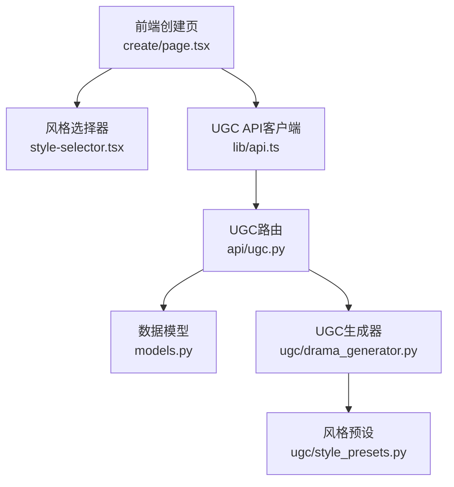
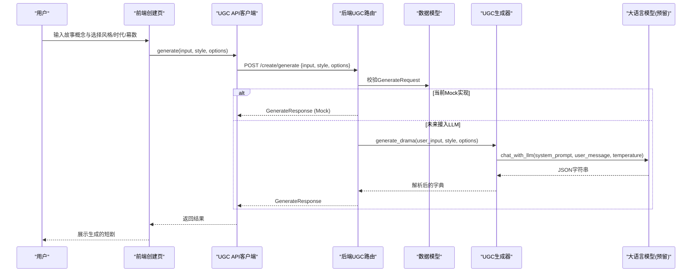
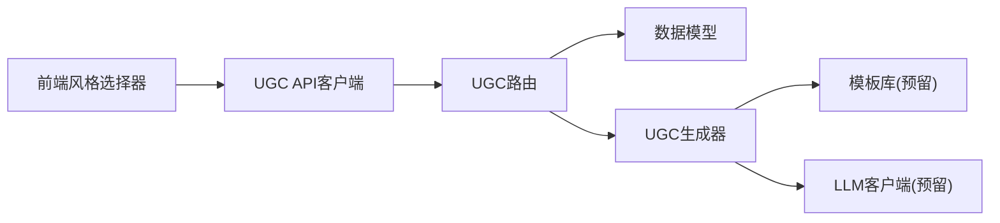

# 风格预设API

<cite>
**本文引用的文件**   
- [backend/app/ugc/style_presets.py](file://backend/app/ugc/style_presets.py)
- [backend/app/ugc/drama_generator.py](file://backend/app/ugc/drama_generator.py)
- [backend/app/api/ugc.py](file://backend/app/api/ugc.py)
- [backend/app/models.py](file://backend/app/models.py)
- [frontend/src/components/style-selector.tsx](file://frontend/src/components/style-selector.tsx)
- [frontend/src/app/create/page.tsx](file://frontend/src/app/create/page.tsx)
- [frontend/src/lib/api.ts](file://frontend/src/lib/api.ts)
</cite>

## 目录
1. [简介](#简介)
2. [项目结构](#项目结构)
3. [核心组件](#核心组件)
4. [架构总览](#架构总览)
5. [详细组件分析](#详细组件分析)
6. [依赖关系分析](#依赖关系分析)
7. [性能考量](#性能考量)
8. [故障排查指南](#故障排查指南)
9. [结论](#结论)
10. [附录](#附录)

## 简介
本文件面向“风格预设API”的完整说明，覆盖风格模板的定义、使用方法、参数传递与默认值、自定义扩展机制、不同风格的生成效果对比与最佳实践，以及风格与时代背景（如清代、民国等）的关联关系。文档同时提供前后端交互流程、错误处理策略与性能优化建议，帮助开发者快速理解并高效使用风格预设能力。

## 项目结构
风格预设系统由前端选择器、后端API路由、模型定义与UGC生成模块共同构成：
- 前端通过样式选择器组件收集用户输入的风格、时代背景与幕数，并通过UGC API发起生成请求。
- 后端API接收请求，校验并转发到UGC生成逻辑；当前为Mock实现，预留接入LLM的接口。
- 模型层定义了请求与响应的数据结构，确保前后端契约一致。
- UGC生成模块负责根据风格与选项拼装提示词，调用LLM并返回结构化结果。

图表来源 
- [frontend/src/app/create/page.tsx:1-135](file://frontend/src/app/create/page.tsx#L1-L135)
- [frontend/src/components/style-selector.tsx:1-121](file://frontend/src/components/style-selector.tsx#L1-L121)
- [frontend/src/lib/api.ts:132-154](file://frontend/src/lib/api.ts#L132-L154)
- [backend/app/api/ugc.py:1-35](file://backend/app/api/ugc.py#L1-L35)
- [backend/app/models.py:111-123](file://backend/app/models.py#L111-L123)
- [backend/app/ugc/drama_generator.py:1-21](file://backend/app/ugc/drama_generator.py#L1-L21)
- [backend/app/ugc/style_presets.py:1-15](file://backend/app/ugc/style_presets.py#L1-L15)

章节来源
- [frontend/src/app/create/page.tsx:1-135](file://frontend/src/app/create/page.tsx#L1-L135)
- [frontend/src/components/style-selector.tsx:1-121](file://frontend/src/components/style-selector.tsx#L1-L121)
- [frontend/src/lib/api.ts:132-154](file://frontend/src/lib/api.ts#L132-L154)
- [backend/app/api/ugc.py:1-35](file://backend/app/api/ugc.py#L1-L35)
- [backend/app/models.py:111-123](file://backend/app/models.py#L111-L123)
- [backend/app/ugc/drama_generator.py:1-21](file://backend/app/ugc/drama_generator.py#L1-L21)
- [backend/app/ugc/style_presets.py:1-15](file://backend/app/ugc/style_presets.py#L1-L15)

## 核心组件
- 风格预设定义：包含风格ID、标签、图标；时代预设（清代、民国、现代、架空）；幕数选项（3幕、5幕、7幕）。
- UGC API路由：暴露POST /create/generate与POST /create/regenerate/{script_id}两个端点，当前返回Mock数据。
- 数据模型：GenerateRequest与GenerateResponse定义输入输出结构，支持可选options字段用于传递era、acts、custom_prompt等。
- UGC生成器：根据风格模板与选项拼装提示词，调用LLM并解析JSON响应；若解析失败则返回兜底结构。
- 前端风格选择器：提供风格、时代、幕数的可视化选择，并将用户选择封装为options对象提交。

章节来源
- [backend/app/ugc/style_presets.py:1-15](file://backend/app/ugc/style_presets.py#L1-L15)
- [backend/app/api/ugc.py:1-35](file://backend/app/api/ugc.py#L1-L35)
- [backend/app/models.py:111-123](file://backend/app/models.py#L111-L123)
- [backend/app/ugc/drama_generator.py:1-21](file://backend/app/ugc/drama_generator.py#L1-L21)
- [frontend/src/components/style-selector.tsx:1-121](file://frontend/src/components/style-selector.tsx#L1-L121)

## 架构总览
风格预设API的整体交互流程如下：
- 用户在创建页面输入故事概念，选择风格、时代与幕数，并可展开高级选项填写自定义提示词。
- 前端调用UGC API的generate端点，将input、style与options（含era、acts、custom_prompt）一并提交。
- 后端路由接收请求，构造响应（当前为Mock），并在后续版本中可接入LLM进行真实生成。
- 生成结果包含脚本ID、标题、章节列表、风格与时代信息，前端据此渲染结果页。

图表来源 
- [frontend/src/app/create/page.tsx:30-47](file://frontend/src/app/create/page.tsx#L30-L47)
- [frontend/src/lib/api.ts:132-154](file://frontend/src/lib/api.ts#L132-L154)
- [backend/app/api/ugc.py:8-29](file://backend/app/api/ugc.py#L8-L29)
- [backend/app/models.py:111-123](file://backend/app/models.py#L111-L123)
- [backend/app/ugc/drama_generator.py:5-20](file://backend/app/ugc/drama_generator.py#L5-L20)

## 详细组件分析

### 风格预设定义与语义
- 风格预设：悬疑推理、爱情故事、喜剧冒险、悲剧史诗，每个风格具备唯一id与显示标签，便于前端渲染与后端路由匹配。
- 时代预设：清代、民国、现代、架空，体现历史或虚构背景，影响叙事语境与语言风格。
- 幕数选项：3幕、5幕、7幕，控制剧本结构与节奏。

章节来源
- [backend/app/ugc/style_presets.py:2-14](file://backend/app/ugc/style_presets.py#L2-L14)
- [frontend/src/components/style-selector.tsx:21-39](file://frontend/src/components/style-selector.tsx#L21-L39)

### 前端风格选择器与参数组装
- 风格选择器组件提供可视化按钮组，支持切换风格、时代与幕数，并通过回调函数更新父组件状态。
- 创建页将用户选择封装为options对象，其中era为字符串（如qing）、acts为整数（如3）、custom_prompt为可选字符串。
- 前端调用UGC API时，将input、style与options一并序列化提交。

章节来源
- [frontend/src/components/style-selector.tsx:41-121](file://frontend/src/components/style-selector.tsx#L41-L121)
- [frontend/src/app/create/page.tsx:30-47](file://frontend/src/app/create/page.tsx#L30-L47)
- [frontend/src/lib/api.ts:132-154](file://frontend/src/lib/api.ts#L132-L154)

### 后端API路由与数据模型
- UGC路由提供POST /create/generate，接收GenerateRequest，返回GenerateResponse。当前实现为Mock，直接构造示例章节与元数据。
- 数据模型定义：
  - GenerateRequest：包含input（必填）、style（默认"suspense"）、options（可选字典）。
  - GenerateResponse：包含script_id、title、chapters、style、era。
- 路由在返回时保留style与era，便于前端展示与后续处理。

章节来源
- [backend/app/api/ugc.py:8-29](file://backend/app/api/ugc.py#L8-L29)
- [backend/app/models.py:111-123](file://backend/app/models.py#L111-L123)

### UGC生成器与提示词拼装
- 生成器函数接收user_input、style与options，从模板库获取对应风格的prompt模板。
- 从options中提取era与acts，若未提供则使用默认值（清代、3幕）。
- 若存在custom_prompt，将其追加到提示词末尾作为额外要求。
- 调用LLM接口（预留）并尝试解析JSON响应；若解析失败，返回兜底结构以避免崩溃。

章节来源
- [backend/app/ugc/drama_generator.py:5-20](file://backend/app/ugc/drama_generator.py#L5-L20)

### 风格与时代背景的关联关系
- 风格决定叙事基调与语言风格（如悬疑推理强调线索与反转，爱情强调情感纠葛）。
- 时代背景影响文化元素、用语习惯与场景设定（清代注重历史细节，民国融合中西文化，现代贴近当代生活，架空允许自由创作）。
- 幕数控制剧情节奏与结构复杂度（3幕简洁紧凑，5幕平衡展开，7幕丰富铺陈）。

章节来源
- [backend/app/ugc/style_presets.py:2-14](file://backend/app/ugc/style_presets.py#L2-L14)
- [frontend/src/components/style-selector.tsx:21-39](file://frontend/src/components/style-selector.tsx#L21-L39)

### 风格组合使用方法与高级定制
- 基础组合：选择一种风格+一个时代+一个幕数，即可生成符合预期的短剧。
- 高级定制：在options中传入custom_prompt，进一步约束AI生成内容（如特定人物设定、情节走向、语言风格）。
- 推荐实践：
  - 悬疑推理 + 清代 + 5幕：适合构建复杂谜团与历史氛围。
  - 爱情故事 + 民国 + 3幕：适合快节奏情感冲突与时代特色。
  - 喜剧冒险 + 现代 + 7幕：适合多线叙事与轻松幽默。
  - 悲剧史诗 + 架空 + 5幕：适合宏大主题与深刻反思。

章节来源
- [frontend/src/app/create/page.tsx:88-111](file://frontend/src/app/create/page.tsx#L88-L111)
- [backend/app/ugc/drama_generator.py:10-11](file://backend/app/ugc/drama_generator.py#L10-L11)

### 生成效果对比与最佳实践
- 风格对比：
  - 悬疑推理：强调悬念设置、线索埋设与反转设计。
  - 爱情故事：侧重情感描写、人物关系与内心独白。
  - 喜剧冒险：突出误会、巧合与幽默桥段。
  - 悲剧史诗：聚焦命运冲突、牺牲精神与历史厚重感。
- 时代对比：
  - 清代：传统礼仪、方言词汇、历史地标。
  - 民国：中西交融、社会变革、文化碰撞。
  - 现代：都市生活、科技元素、当代议题。
  - 架空：自由设定、奇幻元素、隐喻表达。
- 最佳实践：
  - 明确故事核心冲突，结合风格强化叙事张力。
  - 利用时代背景增强沉浸感与文化真实性。
  - 合理选择幕数以平衡节奏与信息密度。
  - 使用custom_prompt精准引导AI输出，避免偏离预期。

章节来源
- [frontend/src/components/style-selector.tsx:21-39](file://frontend/src/components/style-selector.tsx#L21-L39)
- [backend/app/ugc/drama_generator.py:5-20](file://backend/app/ugc/drama_generator.py#L5-L20)

## 依赖关系分析
风格预设API的依赖关系清晰，前后端通过HTTP协议解耦，模型层确保契约一致性：
- 前端依赖StyleSelector组件与UGC API客户端。
- 后端依赖FastAPI路由、Pydantic模型与UGC生成器。
- UGC生成器依赖模板库与LLM客户端（预留）。

图表来源 
- [frontend/src/components/style-selector.tsx:1-121](file://frontend/src/components/style-selector.tsx#L1-L121)
- [frontend/src/lib/api.ts:132-154](file://frontend/src/lib/api.ts#L132-L154)
- [backend/app/api/ugc.py:1-35](file://backend/app/api/ugc.py#L1-L35)
- [backend/app/models.py:111-123](file://backend/app/models.py#L111-L123)
- [backend/app/ugc/drama_generator.py:1-21](file://backend/app/ugc/drama_generator.py#L1-L21)

章节来源
- [frontend/src/components/style-selector.tsx:1-121](file://frontend/src/components/style-selector.tsx#L1-L121)
- [frontend/src/lib/api.ts:132-154](file://frontend/src/lib/api.ts#L132-L154)
- [backend/app/api/ugc.py:1-35](file://backend/app/api/ugc.py#L1-L35)
- [backend/app/models.py:111-123](file://backend/app/models.py#L111-L123)
- [backend/app/ugc/drama_generator.py:1-21](file://backend/app/ugc/drama_generator.py#L1-L21)

## 性能考量
- 当前UGC路由为Mock实现，无外部依赖，响应速度快。
- 未来接入LLM时需注意：
  - 异步处理：使用async/await避免阻塞主线程。
  - 超时控制：设置合理的请求超时与重试机制。
  - 缓存策略：对相同输入与选项的结果进行缓存，减少重复计算。
  - 流式输出：对于长文本生成，考虑流式传输提升用户体验。
- 前端加载状态管理：在生成过程中显示加载指示，避免用户重复提交。

[本节为通用指导，无需引用具体文件]

## 故障排查指南
- 常见错误：
  - JSON解析失败：LLM返回非JSON格式，生成器已提供兜底结构，检查raw_response字段定位问题。
  - 参数缺失：确保options中包含必要的era与acts，否则使用默认值。
  - 网络异常：检查API_BASE配置与网络连接状态。
- 调试建议：
  - 在前端控制台打印请求与响应数据。
  - 在后端日志中记录关键步骤与异常堆栈。
  - 使用Mock模式验证前端集成，再逐步替换为真实LLM。

章节来源
- [backend/app/ugc/drama_generator.py:16-20](file://backend/app/ugc/drama_generator.py#L16-L20)
- [frontend/src/lib/api.ts:3-15](file://frontend/src/lib/api.ts#L3-L15)

## 结论
风格预设API为互动短剧创作提供了灵活且可扩展的能力。通过清晰的前后端契约、可视化的风格选择器与强大的提示词拼装机制，用户能够轻松定制符合期望的短剧内容。未来接入LLM后，系统将具备更强的生成能力与个性化服务。建议在实际使用中结合风格与时代背景，合理选择幕数与高级选项，以获得最佳创作体验。

[本节为总结性内容，无需引用具体文件]

## 附录
- 风格ID与标签映射：
  - suspense: 悬疑推理
  - romance: 爱情故事
  - comedy: 喜剧冒险
  - tragedy: 悲剧史诗
- 时代ID与标签映射：
  - qing: 清代
  - ming: 民国
  - modern: 现代
  - fantasy: 架空
- 幕数选项：
  - 3: 3幕
  - 5: 5幕
  - 7: 7幕

章节来源
- [backend/app/ugc/style_presets.py:2-14](file://backend/app/ugc/style_presets.py#L2-L14)
- [frontend/src/components/style-selector.tsx:21-39](file://frontend/src/components/style-selector.tsx#L21-L39)