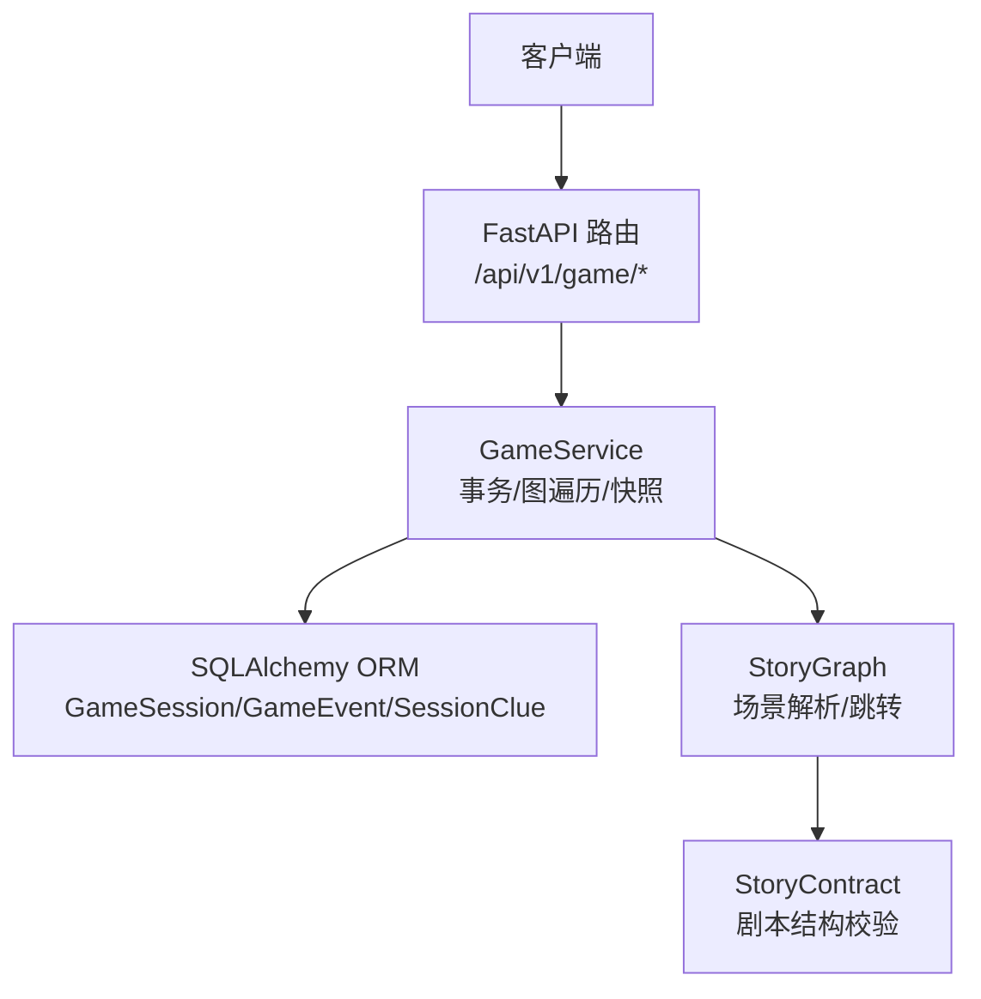
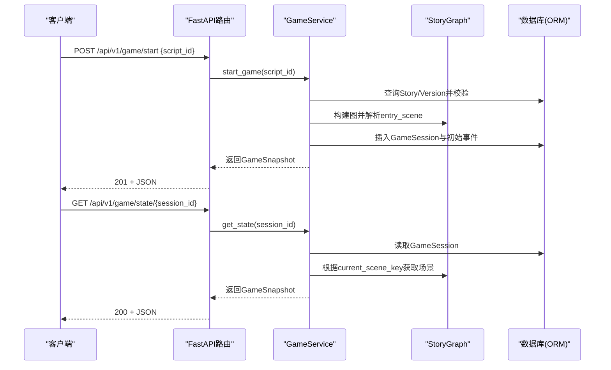
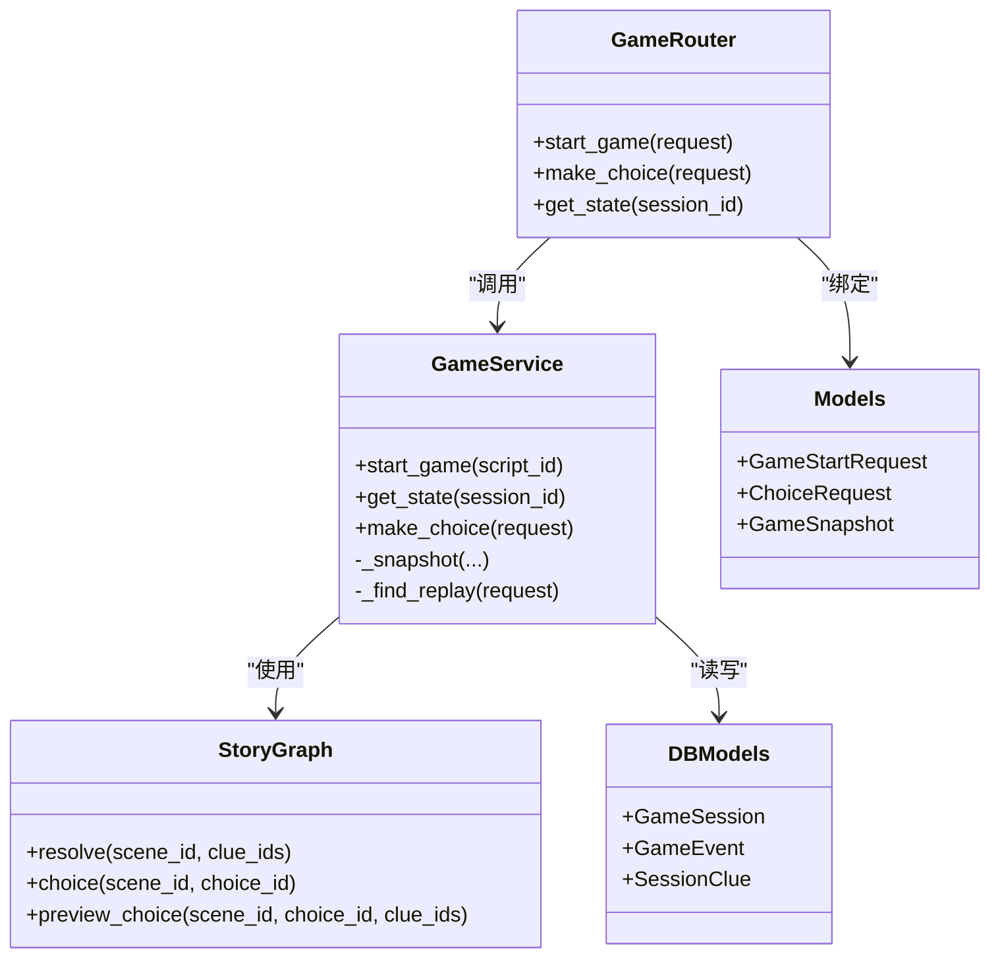
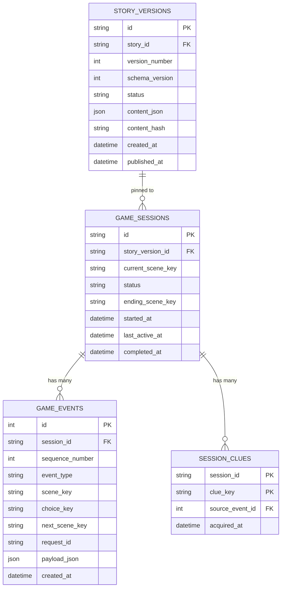

# 游戏会话管理API

<cite>
**本文引用的文件**   
- [backend/app/api/game.py](file://backend/app/api/game.py)
- [backend/app/game_service.py](file://backend/app/game_service.py)
- [backend/app/models.py](file://backend/app/models.py)
- [backend/app/db_models.py](file://backend/app/db_models.py)
- [backend/app/story/runtime.py](file://backend/app/story/runtime.py)
- [backend/app/story/contract.py](file://backend/app/story/contract.py)
- [backend/app/game_errors.py](file://backend/app/game_errors.py)
- [backend/app/main.py](file://backend/app/main.py)
- [backend/tests/test_game_api.py](file://backend/tests/test_game_api.py)
</cite>

## 目录
1. [简介](#简介)
2. [项目结构](#项目结构)
3. [核心组件](#核心组件)
4. [架构总览](#架构总览)
5. [详细接口说明](#详细接口说明)
6. [依赖关系分析](#依赖关系分析)
7. [性能与并发特性](#性能与并发特性)
8. [故障排查指南](#故障排查指南)
9. [结论](#结论)
10. [附录：数据模型与存储策略](#附录数据模型与存储策略)

## 简介
本文件面向“游戏会话管理API”，聚焦于以下能力：
- 创建游戏会话（POST /api/v1/game/start）
- 查询会话状态（GET /api/v1/game/state/{session_id}）
- 选择推进（POST /api/v1/game/choice，用于完整生命周期演示）
文档将详细说明请求参数、响应数据结构、错误处理、幂等性、持久化机制与数据存储策略，并提供完整的JSON示例与异常状态码说明。

## 项目结构
后端采用FastAPI路由 + Service层 + SQLAlchemy ORM的清晰分层：
- API层：定义HTTP端点与请求/响应模型绑定
- Service层：封装事务、业务规则、图遍历与快照生成
- 数据层：ORM模型与数据库表映射
- 故事运行时：校验与解析剧本图结构，支持场景跳转与线索判定

图表来源
- [backend/app/api/game.py:12-37](file://backend/app/api/game.py#L12-L37)
- [backend/app/game_service.py:31-62](file://backend/app/game_service.py#L31-L62)
- [backend/app/db_models.py:74-126](file://backend/app/db_models.py#L74-L126)
- [backend/app/story/runtime.py:22-80](file://backend/app/story/runtime.py#L22-L80)
- [backend/app/story/contract.py:120-128](file://backend/app/story/contract.py#L120-L128)

章节来源
- [backend/app/api/game.py:12-37](file://backend/app/api/game.py#L12-L37)
- [backend/app/game_service.py:31-62](file://backend/app/game_service.py#L31-L62)
- [backend/app/db_models.py:74-126](file://backend/app/db_models.py#L74-L126)
- [backend/app/story/runtime.py:22-80](file://backend/app/story/runtime.py#L22-L80)
- [backend/app/story/contract.py:120-128](file://backend/app/story/contract.py#L120-L128)

## 核心组件
- GameService：实现会话创建、状态查询、选择推进、事件记录、线索授予、幂等回放与快照生成
- StoryGraph：基于已发布版本的剧本文档构建可执行图，负责场景上下文、跳转与选项验证
- Pydantic模型：统一请求/响应契约，包含严格的字段校验与类型约束
- 错误体系：GameError提供稳定的错误码与消息，配合全局异常处理器输出统一格式

章节来源
- [backend/app/game_service.py:31-194](file://backend/app/game_service.py#L31-L194)
- [backend/app/story/runtime.py:22-80](file://backend/app/story/runtime.py#L22-L80)
- [backend/app/models.py:12-92](file://backend/app/models.py#L12-L92)
- [backend/app/game_errors.py:7-20](file://backend/app/game_errors.py#L7-20)

## 架构总览
整体调用链如下：
- 客户端发起HTTP请求到FastAPI路由
- 路由将请求体绑定为Pydantic模型并调用GameService方法
- GameService在事务中操作ORM模型，读取/写入会话、事件与线索
- 通过StoryGraph解析当前场景与选项，生成快照返回

图表来源
- [backend/app/api/game.py:15-36](file://backend/app/api/game.py#L15-L36)
- [backend/app/game_service.py:35-68](file://backend/app/game_service.py#L35-L68)
- [backend/app/story/runtime.py:31-48](file://backend/app/story/runtime.py#L31-L48)
- [backend/app/db_models.py:74-112](file://backend/app/db_models.py#L74-L112)

## 详细接口说明

### 通用约定
- 基础路径：/api/v1/game
- 成功响应：直接返回业务数据对象（如GameSnapshot）
- 失败响应：统一包裹在error字段中，包含code、message、details
- 状态码：由业务异常或框架校验决定（见错误处理部分）

章节来源
- [backend/app/main.py:38-74](file://backend/app/main.py#L38-L74)
- [backend/app/game_errors.py:7-20](file://backend/app/game_errors.py#L7-20)

### 创建游戏会话：POST /api/v1/game/start
- 功能：根据已发布的剧本脚本ID启动一个新游戏会话，返回初始场景与媒体信息
- 请求体：GameStartRequest
  - script_id: 字符串，长度2~64，匹配正则 ^[a-z][a-z0-9_]*$，表示要启动的已发布剧本标识
- 响应体：GameStartResponse（即GameSnapshot），包含：
  - session_id: UUID，新会话的唯一标识
  - status: "active"
  - story: 包含story id、title、version（已发布版本编号）
  - scene: 初始场景信息（type="video"），包含chapter、media、choices（每个choice含id、text、preload.scene_id与preload.media）
  - clues: 空列表（初始无线索）
  - progress: current_chapter与total_chapters
  - awarded_clues: 首次启动时为空
  - ending: 首次启动时为null
- 状态码：
  - 201：成功创建
  - 404：STORY_NOT_FOUND（未找到该脚本）
  - 409：STORY_NOT_PUBLISHED（脚本未发布）
  - 503：STORY_NOT_READY（没有可用版本或媒体未就绪）
- 错误处理：
  - 若故事数据损坏或媒体未就绪，抛出GameError，经全局异常处理器返回统一error结构

章节来源
- [backend/app/api/game.py:15-21](file://backend/app/api/game.py#L15-L21)
- [backend/app/models.py:12-14](file://backend/app/models.py#L12-L14)
- [backend/app/models.py:72-92](file://backend/app/models.py#L72-L92)
- [backend/app/game_service.py:35-61](file://backend/app/game_service.py#L35-L61)
- [backend/app/game_service.py:195-208](file://backend/app/game_service.py#L195-L208)
- [backend/app/game_service.py:227-234](file://backend/app/game_service.py#L227-L234)
- [backend/app/main.py:38-49](file://backend/app/main.py#L38-L49)

#### 请求/响应示例
- 请求示例
{
  "script_id": "macau_mystery_demo"
}
- 成功响应示例（201）
{
  "session_id": "e1b2c3d4-...-uuid",
  "status": "active",
  "story": {
    "id": "story_xxx",
    "title": "澳门谜案",
    "version": 1
  },
  "scene": {
    "id": "scene_start",
    "type": "video",
    "chapter": {
      "id": "ch1",
      "title": "第一章",
      "location": "议事亭前地"
    },
    "media": {
      "video_url": "https://cdn.example.com/video.mp4",
      "poster_url": "https://cdn.example.com/poster.jpg",
      "mime_type": "video/mp4",
      "duration_ms": 120000
    },
    "choices": [
      {
        "id": "inspect_letter",
        "text": "检查信件",
        "preload": {
          "scene_id": "scene_letter",
          "media": {
            "video_url": "https://cdn.example.com/letter.mp4",
            "poster_url": "https://cdn.example.com/letter_poster.jpg",
            "mime_type": "video/mp4",
            "duration_ms": 60000
          }
        }
      },
      {
        "id": "leave_quietly",
        "text": "悄悄离开",
        "preload": {
          "scene_id": "scene_direct",
          "media": { ... }
        }
      }
    ]
  },
  "clues": [],
  "progress": {
    "current_chapter": 1,
    "total_chapters": 3
  },
  "awarded_clues": null,
  "ending": null
}
- 错误响应示例（404）
{
  "error": {
    "code": "STORY_NOT_FOUND",
    "message": "故事不存在",
    "details": {}
  }
}

章节来源
- [backend/tests/test_game_api.py:72-76](file://backend/tests/test_game_api.py#L72-L76)
- [backend/tests/test_game_api.py:172-179](file://backend/tests/test_game_api.py#L172-L179)

### 查询会话状态：GET /api/v1/game/state/{session_id}
- 功能：根据会话ID返回当前会话的快照，包括当前场景、线索、进度与结局信息
- 路径参数：
  - session_id: UUID，唯一标识一个游戏会话
- 响应体：GameState（即GameSnapshot），字段含义如下：
  - session_id: 会话ID
  - status: "active" 或 "completed"
  - story: 包含story id、title、version（会话绑定的已发布版本）
  - scene: 当前场景信息（type可能为"video"或"ending"），包含chapter、media、choices（ending场景choices为空）
  - clues: 已获得的线索列表，每项包含id、title、description、icon、acquired_at
  - progress: current_chapter与total_chapters
  - awarded_clues: 仅在make_choice成功后携带本次新增线索；查询接口不携带
  - ending: 若当前场景为EndingScene则包含id与ending_code，否则为null
- 状态码：
  - 200：成功
  - 404：SESSION_NOT_FOUND（会话不存在）
- 错误处理：
  - 会话不存在时抛出GameError，经全局异常处理器返回统一error结构

章节来源
- [backend/app/api/game.py:31-36](file://backend/app/api/game.py#L31-L36)
- [backend/app/game_service.py:63-68](file://backend/app/game_service.py#L63-L68)
- [backend/app/models.py:72-92](file://backend/app/models.py#L72-L92)
- [backend/tests/test_game_api.py:129-140](file://backend/tests/test_game_api.py#L129-L140)

#### 请求/响应示例
- 请求示例
GET /api/v1/game/state/e1b2c3d4-...-uuid
- 成功响应示例（200）
{
  "session_id": "e1b2c3d4-...-uuid",
  "status": "active",
  "story": {
    "id": "story_xxx",
    "title": "澳门谜案",
    "version": 1
  },
  "scene": {
    "id": "scene_letter",
    "type": "video",
    "chapter": {
      "id": "ch1",
      "title": "第一章",
      "location": "议事亭前地"
    },
    "media": {
      "video_url": "https://cdn.example.com/letter.mp4",
      "poster_url": "https://cdn.example.com/letter_poster.jpg",
      "mime_type": "video/mp4",
      "duration_ms": 60000
    },
    "choices": [
      {
        "id": "continue_with_clue",
        "text": "带着线索继续",
        "preload": {
          "scene_id": "scene_merge",
          "media": { ... }
        }
      }
    ]
  },
  "clues": [
    {
      "id": "letter_fragment",
      "title": "信件残片",
      "description": "一封被撕毁的信纸片段",
      "icon": "icon_letter.png",
      "acquired_at": "2026-01-01T12:00:00Z"
    }
  ],
  "progress": {
    "current_chapter": 1,
    "total_chapters": 3
  },
  "awarded_clues": null,
  "ending": null
}
- 错误响应示例（404）
{
  "error": {
    "code": "SESSION_NOT_FOUND",
    "message": "游戏会话不存在",
    "details": {}
  }
}

章节来源
- [backend/tests/test_game_api.py:129-140](file://backend/tests/test_game_api.py#L129-L140)

### 选择推进：POST /api/v1/game/choice（用于完整生命周期）
- 功能：在当前场景选择一个选项，推进剧情，可能获得线索，最终到达结局
- 请求体：ChoiceRequest
  - session_id: UUID
  - scene_id: 字符串，当前场景ID（必须与会话当前场景一致）
  - choice_id: 字符串，选择的选项ID
  - request_id: UUID，幂等键，确保同一选择只生效一次
- 响应体：ChoiceResponse（即GameSnapshot），包含本次推进后的快照，以及awarded_clues（本次新增线索）
- 状态码：
  - 200：成功
  - 409：SESSION_COMPLETED（会话已结束）、SESSION_NOT_ACTIVE（不可继续）、STALE_SCENE（提交的场景不是当前场景）、CHOICE_NOT_AVAILABLE（选项不属于当前场景）、IDEMPOTENCY_CONFLICT（request_id冲突但请求不同）
  - 500：STORY_DATA_CORRUPTED（故事数据损坏）
- 幂等性：
  - 相同request_id重复提交会返回相同的响应（幂等回放）
  - 若request_id已用于不同的选择请求，返回幂等冲突错误

章节来源
- [backend/app/api/game.py:23-28](file://backend/app/api/game.py#L23-L28)
- [backend/app/models.py:83-92](file://backend/app/models.py#L83-L92)
- [backend/app/game_service.py:70-193](file://backend/app/game_service.py#L70-L193)
- [backend/app/game_service.py:353-376](file://backend/app/game_service.py#L353-L376)
- [backend/tests/test_game_api.py:90-127](file://backend/tests/test_game_api.py#L90-L127)
- [backend/tests/test_game_api.py:129-149](file://backend/tests/test_game_api.py#L129-L149)

## 依赖关系分析
- API路由依赖Pydantic模型进行请求校验，并将结果交给GameService
- GameService依赖ORM模型读写数据库，依赖StoryGraph解析剧本图
- StoryGraph依赖StoryContract定义的严格数据结构
- 全局异常处理器统一GameError与请求校验错误的响应格式

图表来源
- [backend/app/api/game.py:12-36](file://backend/app/api/game.py#L12-L36)
- [backend/app/game_service.py:31-194](file://backend/app/game_service.py#L31-L194)
- [backend/app/story/runtime.py:22-80](file://backend/app/story/runtime.py#L22-L80)
- [backend/app/models.py:12-92](file://backend/app/models.py#L12-L92)
- [backend/app/db_models.py:74-126](file://backend/app/db_models.py#L74-L126)

章节来源
- [backend/app/api/game.py:12-36](file://backend/app/api/game.py#L12-L36)
- [backend/app/game_service.py:31-194](file://backend/app/game_service.py#L31-L194)
- [backend/app/story/runtime.py:22-80](file://backend/app/story/runtime.py#L22-L80)
- [backend/app/models.py:12-92](file://backend/app/models.py#L12-L92)
- [backend/app/db_models.py:74-126](file://backend/app/db_models.py#L74-L126)

## 性能与并发特性
- 并发安全：
  - make_choice对会话行加锁（with_for_update），避免并发选择导致的状态竞争
  - SQLite下显式BEGIN IMMEDIATE保证串行化
- 幂等回放：
  - 通过GameEvent.request_id去重，重复提交返回相同响应
- 资源准备：
  - 生产环境会校验媒体是否ready，未就绪则拒绝启动

章节来源
- [backend/app/game_service.py:70-83](file://backend/app/game_service.py#L70-L83)
- [backend/app/game_service.py:89-98](file://backend/app/game_service.py#L89-L98)
- [backend/app/game_service.py:353-376](file://backend/app/game_service.py#L353-L376)
- [backend/app/game_service.py:227-234](file://backend/app/game_service.py#L227-L234)

## 故障排查指南
- 常见错误码与处理建议：
  - STORY_NOT_FOUND（404）：确认script_id是否存在且已发布
  - SESSION_NOT_FOUND（404）：确认session_id有效且未被清理
  - VALIDATION_ERROR（422）：检查请求字段类型、长度与正则匹配
  - SESSION_COMPLETED（409）：会话已结束，无法继续选择
  - STALE_SCENE（409）：提交的scene_id与当前会话不一致，需先拉取最新state
  - CHOICE_NOT_AVAILABLE（409）：choice_id不属于当前场景
  - IDEMPOTENCY_CONFLICT（409）：request_id已用于不同请求，更换新的request_id
  - STORY_NOT_READY（503）：故事版本或媒体未就绪，等待资源准备完成
- 调试步骤：
  - 先调用GET /api/v1/game/state/{session_id}确认当前场景与线索
  - 使用新的request_id重试幂等操作
  - 检查数据库中的GameEvent与SessionClue记录定位问题

章节来源
- [backend/app/main.py:38-74](file://backend/app/main.py#L38-L74)
- [backend/app/game_service.py:100-123](file://backend/app/game_service.py#L100-L123)
- [backend/app/game_service.py:353-376](file://backend/app/game_service.py#L353-L376)
- [backend/tests/test_game_api.py:172-184](file://backend/tests/test_game_api.py#L172-L184)

## 结论
游戏会话管理API以清晰的层次结构与严格的契约校验，提供了稳定可靠的会话创建、状态查询与选择推进能力。通过事务与行级锁保障并发安全，借助事件与幂等键实现可靠回放与一致性。统一的错误处理与详细的响应模型便于前端集成与问题定位。

## 附录：数据模型与存储策略
- 会话与事件：
  - GameSession：保存会话ID、关联的版本ID、当前场景、状态、时间戳
  - GameEvent：记录每次操作的事件序列号、类型、场景与选择、请求ID与负载
  - SessionClue：记录会话内获得的线索及其来源事件与时间
- 版本与内容：
  - Story与StoryVersion：存储已发布的故事内容与版本信息，content_json为严格校验的剧本文档
- 存储策略：
  - 所有写操作在事务中进行，SQLite显式BEGIN IMMEDIATE，PostgreSQL使用with_for_update
  - 事件表具备唯一约束（session_id+sequence_number、session_id+request_id），保证顺序与幂等
  - 线索表按会话与线索键主键，避免重复授予

图表来源
- [backend/app/db_models.py:74-126](file://backend/app/db_models.py#L74-L126)
- [backend/app/db_models.py:52-71](file://backend/app/db_models.py#L52-L71)

章节来源
- [backend/app/db_models.py:74-126](file://backend/app/db_models.py#L74-L126)
- [backend/app/db_models.py:52-71](file://backend/app/db_models.py#L52-L71)