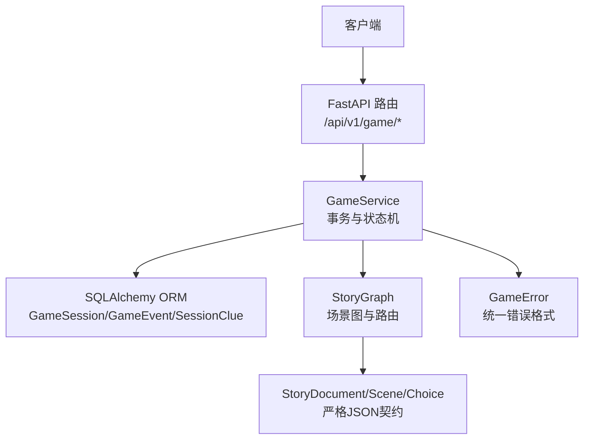
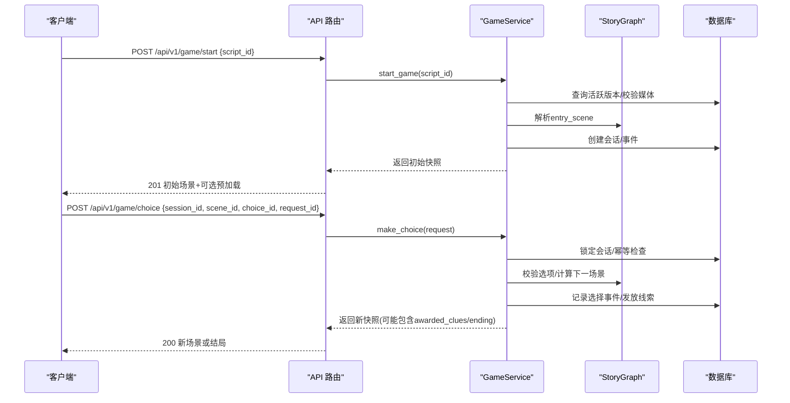
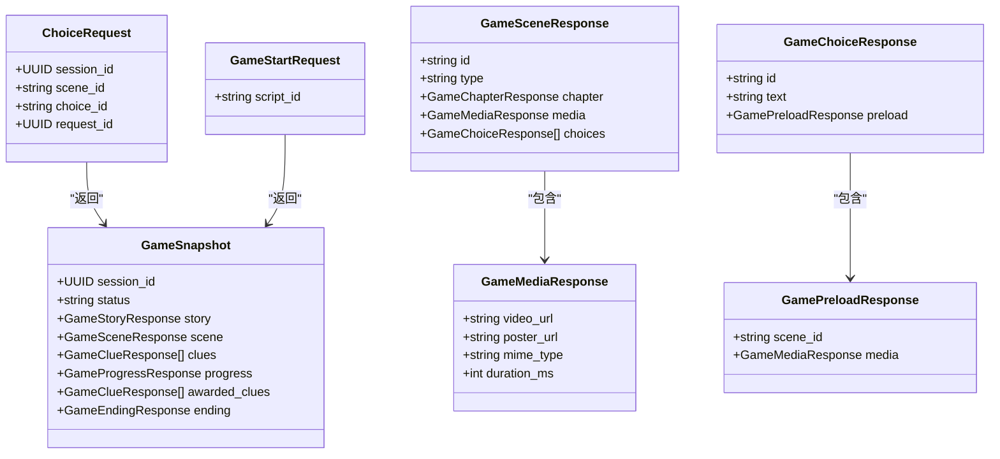
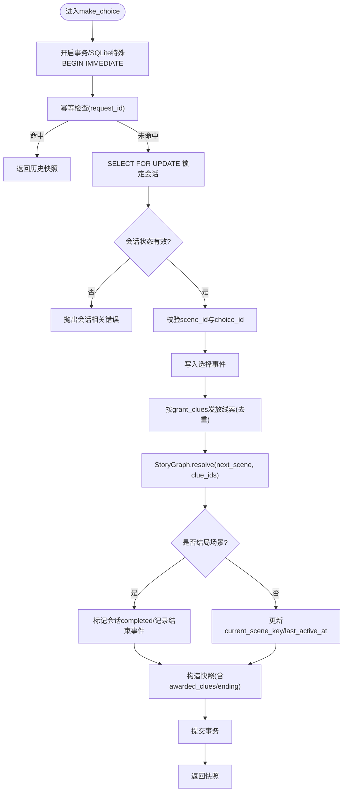
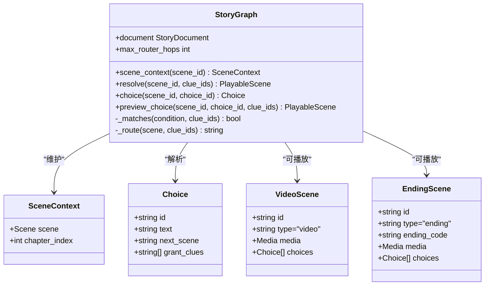
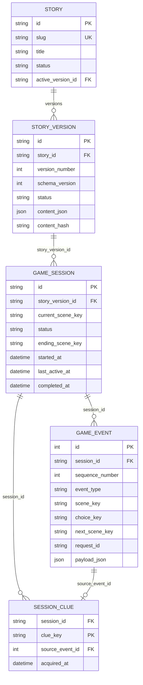
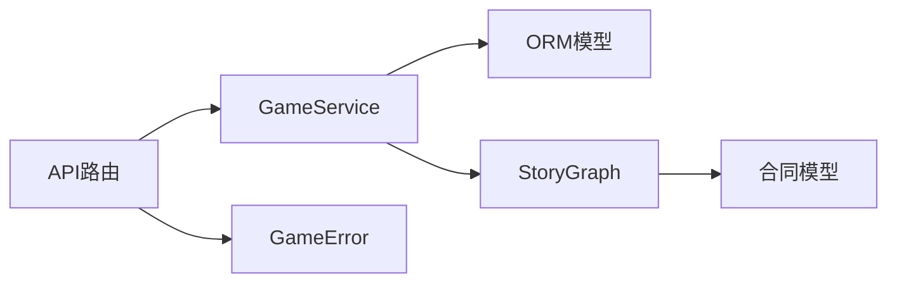

# 游戏核心API

<cite>
**本文引用的文件**   
- [main.py](file://backend/app/main.py)
- [game.py](file://backend/app/api/game.py)
- [game_service.py](file://backend/app/game_service.py)
- [models.py](file://backend/app/models.py)
- [db_models.py](file://backend/app/db_models.py)
- [contract.py](file://backend/app/story/contract.py)
- [runtime.py](file://backend/app/story/runtime.py)
- [engine.py](file://backend/app/story/engine.py)
- [state.py](file://backend/app/story/state.py)
- [clue_manager.py](file://backend/app/story/clue_manager.py)
- [ending_calculator.py](file://backend/app/story/ending_calculator.py)
- [macau_mystery_demo.json](file://backend/app/story/scripts/macau_mystery_demo.json)
- [game_errors.py](file://backend/app/game_errors.py)
</cite>

## 目录
1. [简介](#简介)
2. [项目结构](#项目结构)
3. [核心组件](#核心组件)
4. [架构总览](#架构总览)
5. [详细组件分析](#详细组件分析)
6. [依赖关系分析](#依赖关系分析)
7. [性能考量](#性能考量)
8. [故障排查指南](#故障排查指南)
9. [结论](#结论)
10. [附录：剧本数据结构与API示例](#附录剧本数据结构与api示例)

## 简介
本文件为“澳门悬案”平台的游戏核心API文档，面向后端开发者、前端集成者与内容策划。文档覆盖以下范围：
- 游戏会话管理：创建会话、查询状态、幂等提交选择
- 场景交互与路由：视频场景、路由器场景、结局场景的流转规则
- 选择处理与线索收集：选项校验、线索发放、条件分支判定
- 多结局计算机制：基于线索集合的条件路由与最终结局确定
- 数据模型与JSON剧本规范：严格契约、字段约束与校验流程
- 错误处理策略、性能优化建议与调试技巧
- 与故事引擎的集成方式与数据流转过程

## 项目结构
后端采用FastAPI作为Web框架，通过分层设计将HTTP接口、业务服务、持久化模型与故事运行时解耦：
- API层：定义REST端点与请求/响应模型
- 服务层：事务性游戏推进、状态快照生成、事件记录与幂等控制
- 数据层：SQLAlchemy ORM模型与数据库迁移
- 故事层：剧本契约、运行时图解析、路由与结局计算
- 辅助模块：错误类型、健康检查、CORS与异常处理器

**图表来源** 
- [main.py:17-107](file://backend/app/main.py#L17-L107)
- [game.py:12-37](file://backend/app/api/game.py#L12-L37)
- [game_service.py:31-386](file://backend/app/game_service.py#L31-L386)
- [runtime.py:22-80](file://backend/app/story/runtime.py#L22-L80)
- [contract.py:120-128](file://backend/app/story/contract.py#L120-L128)
- [db_models.py:74-126](file://backend/app/db_models.py#L74-L126)

**章节来源**
- [main.py:17-107](file://backend/app/main.py#L17-L107)
- [game.py:12-37](file://backend/app/api/game.py#L12-L37)

## 核心组件
- FastAPI应用与中间件：注册路由、CORS、全局异常处理（含请求校验与自定义GameError）
- GameService：封装游戏生命周期（开始、选择、状态）、事务边界、事件与线索持久化、幂等重放
- StoryGraph：构建并遍历场景图，支持路由器跳转、条件匹配、预取下一场景媒体
- 数据模型：GameSession、GameEvent、SessionClue、StoryVersion等ORM实体
- 剧本契约：StoryDocument、Chapter、Scene（Video/Ending/Router）、Choice、ClueDefinition等Pydantic模型

**章节来源**
- [main.py:38-96](file://backend/app/main.py#L38-L96)
- [game_service.py:31-386](file://backend/app/game_service.py#L31-L386)
- [runtime.py:22-80](file://backend/app/story/runtime.py#L22-L80)
- [db_models.py:24-126](file://backend/app/db_models.py#L24-L126)
- [contract.py:41-128](file://backend/app/story/contract.py#L41-L128)

## 架构总览
系统以“版本化剧本 + 运行时图解析 + 事务性推进”为核心。客户端通过REST调用发起游戏开始与选择；服务层在事务中校验并推进状态，记录事件与线索；运行时根据当前线索集合决定路由与下一场景；最终到达结局场景时标记会话完成。

**图表来源** 
- [game.py:15-37](file://backend/app/api/game.py#L15-L37)
- [game_service.py:35-193](file://backend/app/game_service.py#L35-L193)
- [runtime.py:37-61](file://backend/app/story/runtime.py#L37-L61)

## 详细组件分析

### API层：游戏接口
- POST /api/v1/game/start
  - 作用：基于已发布的剧本版本创建匿名游戏会话，返回初始场景与媒体信息
  - 输入：GameStartRequest（script_id）
  - 输出：GameSnapshot（初始场景、进度、线索列表为空）
- POST /api/v1/game/choice
  - 作用：提交玩家选择，推进剧情，发放线索，可能进入结局
  - 输入：ChoiceRequest（session_id, scene_id, choice_id, request_id）
  - 输出：GameSnapshot（新场景、新增线索awarded_clues、可能的ending）
- GET /api/v1/game/state/{session_id}
  - 作用：查询当前会话状态与场景
  - 输出：GameSnapshot

**图表来源** 
- [models.py:12-92](file://backend/app/models.py#L12-L92)

**章节来源**
- [game.py:15-37](file://backend/app/api/game.py#L15-L37)
- [models.py:12-92](file://backend/app/models.py#L12-L92)

### 服务层：GameService
- start_game
  - 校验剧本活跃版本与媒体就绪
  - 创建GameSession与首个game_started事件
  - 返回初始快照（当前场景、章节进度、空线索）
- get_state
  - 读取会话与对应版本，构造快照
- make_choice
  - 事务内执行：锁定会话、幂等检查、状态校验、选项有效性验证
  - 记录选择事件，按grant_clues发放线索（去重），更新会话当前场景
  - 若目标场景为EndingScene，标记会话completed并记录game_completed事件
  - 返回快照，包含awarded_clues与可能的ending

**图表来源** 
- [game_service.py:70-193](file://backend/app/game_service.py#L70-L193)

**章节来源**
- [game_service.py:35-193](file://backend/app/game_service.py#L35-L193)

### 故事运行时：StoryGraph与路由
- StoryGraph
  - 构建场景索引，支持scene_context、resolve、choice、preview_choice
  - resolve遵循最大跳数限制，检测路由器循环
  - _matches依据线索集合评估条件：default、min_clue_count、all_clues、any_clues
- RouterScene
  - 按priority排序routes，首次匹配成功即跳转
- VideoScene/EndingScene
  - VideoScene提供choices与media；EndingScene无choices且携带ending_code

**图表来源** 
- [runtime.py:16-80](file://backend/app/story/runtime.py#L16-L80)
- [contract.py:76-95](file://backend/app/story/contract.py#L76-L95)

**章节来源**
- [runtime.py:22-80](file://backend/app/story/runtime.py#L22-L80)
- [contract.py:76-128](file://backend/app/story/contract.py#L76-L128)

### 数据模型与持久化
- Story/StoryVersion：版本化管理，active_version指向已发布版本
- GameSession：会话状态、当前场景键、结束场景键、时间戳
- GameEvent：事件序列号、类型、场景/选项/下一场景键、request_id与payload_json
- SessionClue：会话级线索集合，关联source_event_id与acquired_at

**图表来源** 
- [db_models.py:24-126](file://backend/app/db_models.py#L24-L126)

**章节来源**
- [db_models.py:24-126](file://backend/app/db_models.py#L24-L126)

### 旧版故事引擎（内存态）
- StoryEngine：加载本地JSON脚本，内存维护GameSession，提供start/make_choice/get_state
- GameSession（state.py）：简单顺序推进，记录clues与choices_history
- ClueManager与EndingCalculator：基础线索添加与基于条件的结局计算（字符串条件）

该实现用于演示与最小可用路径，生产环境使用版本化剧本与StoryGraph。

**章节来源**
- [engine.py:9-37](file://backend/app/story/engine.py#L9-L37)
- [state.py:7-54](file://backend/app/story/state.py#L7-L54)
- [clue_manager.py:1-14](file://backend/app/story/clue_manager.py#L1-14)
- [ending_calculator.py:1-14](file://backend/app/story/ending_calculator.py#L1-L14)

## 依赖关系分析
- API层依赖GameService与Pydantic模型进行参数校验与响应序列化
- GameService依赖ORM模型与StoryGraph，负责事务、事件与线索持久化
- StoryGraph依赖合同模型（contract.py）对剧本数据进行强校验与图解析
- 主应用注册路由、CORS与异常处理器，确保错误统一格式

**图表来源** 
- [main.py:84-96](file://backend/app/main.py#L84-L96)
- [game_service.py:10-28](file://backend/app/game_service.py#L10-L28)
- [runtime.py:1-10](file://backend/app/story/runtime.py#L1-10)
- [contract.py:1-18](file://backend/app/story/contract.py#L1-L18)

**章节来源**
- [main.py:84-96](file://backend/app/main.py#L84-L96)
- [game_service.py:10-28](file://backend/app/game_service.py#L10-L28)

## 性能考量
- 幂等性与重放：通过request_id唯一约束避免重复处理，减少网络重试开销
- 并发安全：PostgreSQL使用事务锁，SQLite使用BEGIN IMMEDIATE显式事务
- 预加载媒体：preview_choice提前获取下一场景媒体URL，降低首帧延迟
- 事件与线索索引：按session_id与sequence_number建立索引，提升查询效率
- 路由器跳数限制：防止无限跳转导致的CPU消耗

[本节为通用指导，不直接分析具体文件]

## 故障排查指南
- 常见错误码与含义
  - 404 SESSION_NOT_FOUND：会话不存在
  - 409 SESSION_COMPLETED/SESSION_NOT_ACTIVE/STALE_SCENE/CHOICE_NOT_AVAILABLE：会话状态或场景不一致
  - 503 STORY_NOT_READY：故事或媒体未就绪
  - 500 STORY_DATA_CORRUPTED：版本内容或运行时解析失败
- 调试建议
  - 查看GameEvent.payload_json中的request/response快照定位问题
  - 检查StoryGraph._matches条件与clue_ids集合是否符合预期
  - 确认媒体status为ready（生产环境）
- 健康检查
  - GET /api/v1/health：返回数据库状态与应用版本

**章节来源**
- [game_errors.py:7-20](file://backend/app/game_errors.py#L7-L20)
- [main.py:98-105](file://backend/app/main.py#L98-L105)
- [game_service.py:353-386](file://backend/app/game_service.py#L353-L386)

## 结论
本API以严格的剧本契约与运行时图解析为基础，结合事务性推进与事件溯源，实现了稳定可扩展的沉浸式叙事体验。通过幂等控制、预加载与索引优化，兼顾了用户体验与系统性能。未来可在AI NPC对话、UGC创作与知识检索方面进一步扩展。

[本节为总结，不直接分析具体文件]

## 附录：剧本数据结构与API示例

### JSON剧本数据结构说明
- schema_version：固定为1
- story_id/title/description：故事元信息
- entry_scene：起始场景ID
- chapters：章节数组，每个章节包含id/title/location/gps/scenes
- scenes：三种类型
  - video：包含media与choices
  - router：包含routes（priority/when/next_scene）
  - ending：包含ending_code与media，choices必须为空
- clues：线索定义字典，包含title/description/icon

示例参考：
- [macau_mystery_demo.json](file://backend/app/story/scripts/macau_mystery_demo.json)

**章节来源**
- [contract.py:120-128](file://backend/app/story/contract.py#L120-L128)
- [macau_mystery_demo.json:1-149](file://backend/app/story/scripts/macau_mystery_demo.json#L1-L149)

### API调用示例（描述性）
- 开始游戏
  - 方法：POST /api/v1/game/start
  - 请求体：{ "script_id": "macau_mystery_demo" }
  - 响应：201，包含初始场景、媒体信息与进度
- 提交选择
  - 方法：POST /api/v1/game/choice
  - 请求体：{ "session_id": "<uuid>", "scene_id": "scene_start", "choice_id": "inspect_letter", "request_id": "<uuid>" }
  - 响应：200，包含新场景、新增线索awarded_clues与可能的ending
- 查询状态
  - 方法：GET /api/v1/game/state/{session_id}
  - 响应：200，包含当前场景、进度与线索列表

[本节为概念性示例，不直接映射到具体代码行]