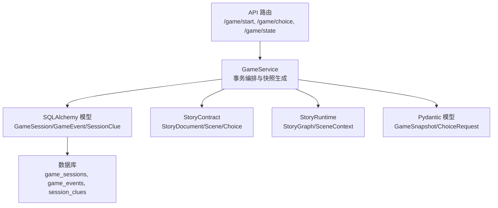
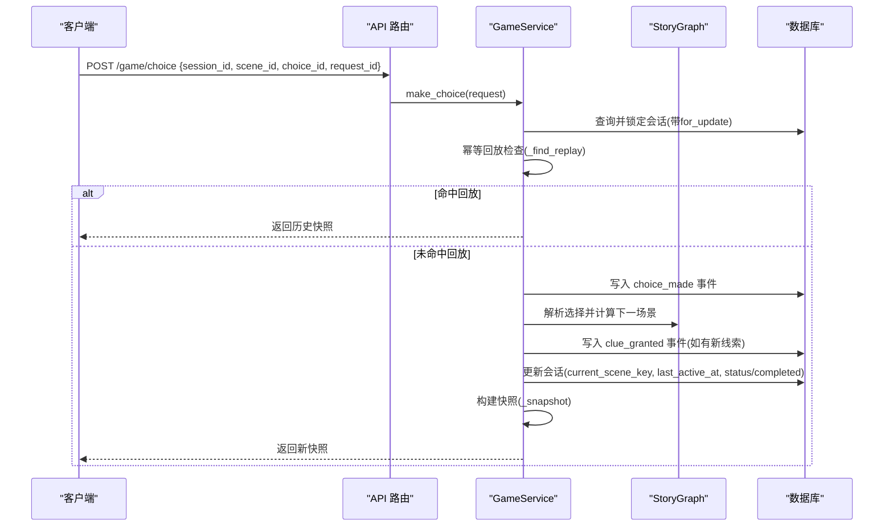
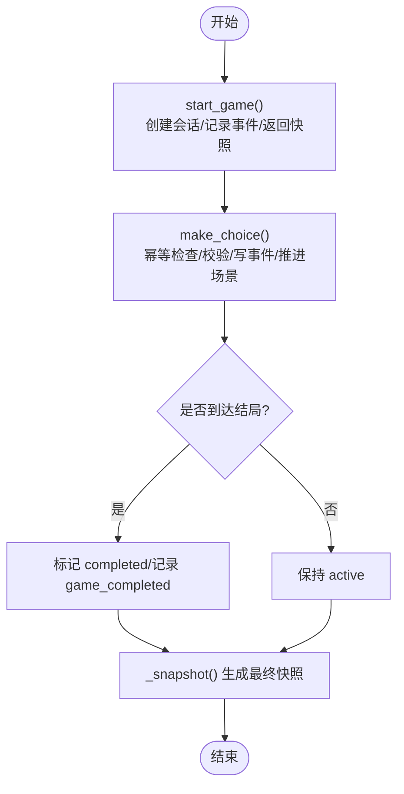
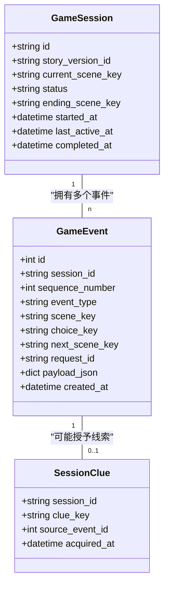
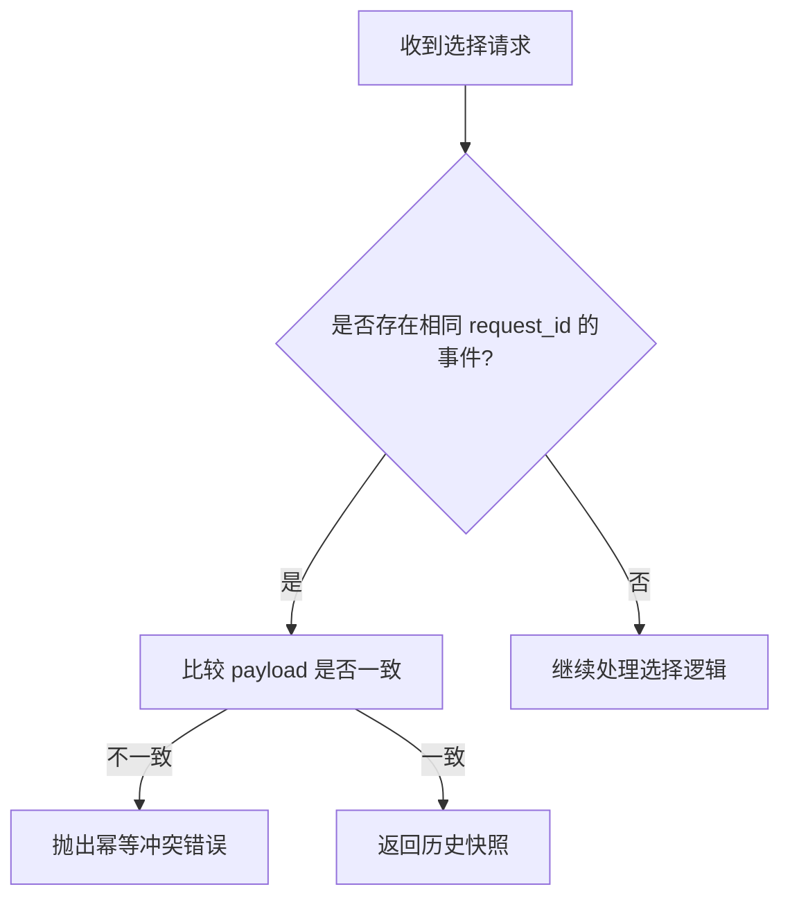
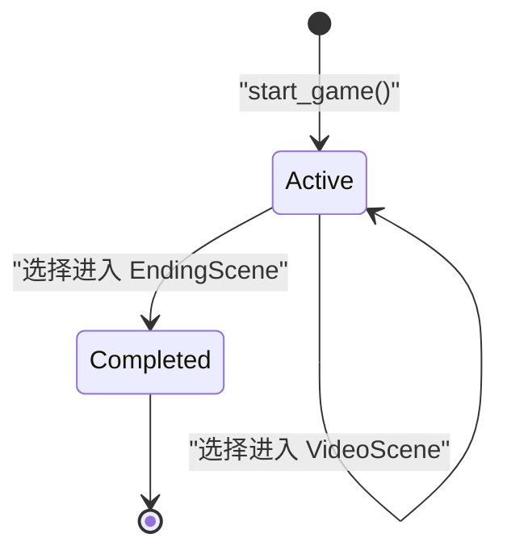
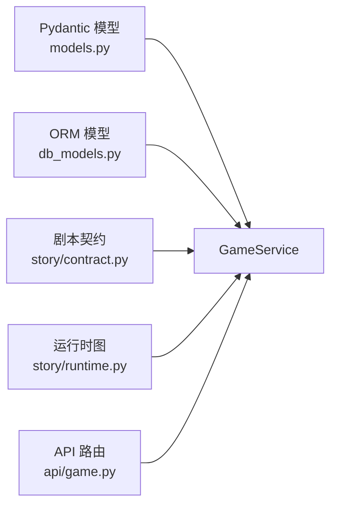

# 游戏状态数据模型

<cite>
**本文引用的文件**   
- [backend/app/models.py](file://backend/app/models.py)
- [backend/app/db_models.py](file://backend/app/db_models.py)
- [backend/app/game_service.py](file://backend/app/game_service.py)
- [backend/app/story/contract.py](file://backend/app/story/contract.py)
- [backend/app/story/runtime.py](file://backend/app/story/runtime.py)
- [backend/app/api/game.py](file://backend/app/api/game.py)
- [backend/app/game_errors.py](file://backend/app/game_errors.py)
- [backend/app/story/state.py](file://backend/app/story/state.py)
</cite>

## 目录
1. [简介](#简介)
2. [项目结构](#项目结构)
3. [核心组件](#核心组件)
4. [架构总览](#架构总览)
5. [详细组件分析](#详细组件分析)
6. [依赖关系分析](#依赖关系分析)
7. [性能考量](#性能考量)
8. [故障排查指南](#故障排查指南)
9. [结论](#结论)
10. [附录](#附录)

## 简介
本文件围绕“游戏状态数据模型”进行系统化说明，重点覆盖：
- GameState（别名 GameSnapshot）的字段定义、数据类型、取值范围与业务含义
- 会话生命周期管理（初始化、更新、持久化）
- 事件驱动的状态变更机制与幂等同步策略
- 状态序列化/反序列化的实现细节
- 状态验证规则与约束条件
- 与故事引擎、数据库等模块的交互方式
- 状态转换流程图与典型使用场景

## 项目结构
后端采用分层设计：API 层暴露 REST 接口；GameService 负责事务性流程编排；ORM 模型映射到数据库表；StoryContract/Runtime 提供剧本结构与运行时图解析；Pydantic 模型用于请求/响应校验与序列化。

**图表来源** 
- [backend/app/api/game.py:15-36](file://backend/app/api/game.py#L15-L36)
- [backend/app/game_service.py:31-386](file://backend/app/game_service.py#L31-L386)
- [backend/app/db_models.py:74-127](file://backend/app/db_models.py#L74-L127)
- [backend/app/story/contract.py:120-128](file://backend/app/story/contract.py#L120-L128)
- [backend/app/story/runtime.py:22-80](file://backend/app/story/runtime.py#L22-L80)
- [backend/app/models.py:72-92](file://backend/app/models.py#L72-L92)

**章节来源**
- [backend/app/api/game.py:15-36](file://backend/app/api/game.py#L15-L36)
- [backend/app/game_service.py:31-386](file://backend/app/game_service.py#L31-L386)
- [backend/app/db_models.py:74-127](file://backend/app/db_models.py#L74-L127)
- [backend/app/story/contract.py:120-128](file://backend/app/story/contract.py#L120-L128)
- [backend/app/story/runtime.py:22-80](file://backend/app/story/runtime.py#L22-L80)
- [backend/app/models.py:72-92](file://backend/app/models.py#L72-L92)

## 核心组件
- GameState（别名 GameSnapshot）：对外统一的状态快照，包含会话标识、状态、当前场景、线索、进度、结局等信息
- ChoiceRequest：玩家选择输入，含会话ID、场景ID、选项ID、幂等请求ID
- ORM 模型：GameSession、GameEvent、SessionClue 等，承载持久化状态与事件流
- StoryContract/Runtime：剧本文档与运行时图，决定场景跳转、线索授予与条件分支
- Pydantic 模型：对输入输出进行严格校验与序列化

**章节来源**
- [backend/app/models.py:72-92](file://backend/app/models.py#L72-L92)
- [backend/app/db_models.py:74-127](file://backend/app/db_models.py#L74-L127)
- [backend/app/story/contract.py:120-128](file://backend/app/story/contract.py#L120-L128)
- [backend/app/story/runtime.py:22-80](file://backend/app/story/runtime.py#L22-L80)

## 架构总览
下图展示从客户端发起选择到状态更新的完整调用链，包括幂等回放、事件记录、线索授予与快照生成。

**图表来源** 
- [backend/app/api/game.py:23-28](file://backend/app/api/game.py#L23-L28)
- [backend/app/game_service.py:70-193](file://backend/app/game_service.py#L70-L193)
- [backend/app/story/runtime.py:50-61](file://backend/app/story/runtime.py#L50-L61)
- [backend/app/db_models.py:93-112](file://backend/app/db_models.py#L93-L112)

## 详细组件分析

### GameState（GameSnapshot）字段定义与语义
- session_id: UUID，唯一会话标识
- status: 枚举值 "active" | "completed"，表示会话是否进行中或已完成
- story: 故事元信息（id/title/version），对应已发布版本
- scene: 当前场景详情（id/type/chapter/media/choices），type 为 "video" 或 "ending"
- clues: 已收集线索列表（id/title/description/icon/acquired_at）
- progress: 进度（current_chapter/total_chapters）
- awarded_clues: 本次新增线索（可选）
- ending: 结局信息（id/code），仅当处于 ending 场景时存在

字段类型与取值范围由 Pydantic 模型严格约束，确保前后端一致性与安全性。

**章节来源**
- [backend/app/models.py:72-92](file://backend/app/models.py#L72-L92)
- [backend/app/models.py:40-81](file://backend/app/models.py#L40-L81)

### 会话生命周期管理
- 初始化：start_game 根据已发布故事的 entry_scene 创建 GameSession，初始状态为 active，记录 game_started 事件，返回初始快照
- 更新：make_choice 在事务中执行，校验会话状态与场景一致性，写入事件、授予线索、推进场景，必要时标记 completed
- 读取：get_state 通过 session_id 获取会话并重建快照，支持断线恢复

**图表来源** 
- [backend/app/game_service.py:35-61](file://backend/app/game_service.py#L35-L61)
- [backend/app/game_service.py:70-193](file://backend/app/game_service.py#L70-L193)
- [backend/app/game_service.py:235-281](file://backend/app/game_service.py#L235-L281)

**章节来源**
- [backend/app/game_service.py:35-61](file://backend/app/game_service.py#L35-L61)
- [backend/app/game_service.py:70-193](file://backend/app/game_service.py#L70-L193)
- [backend/app/game_service.py:235-281](file://backend/app/game_service.py#L235-L281)

### 事件驱动的状态变更机制
- 事件表 game_events 记录每次关键操作：game_started、choice_made、clue_granted、game_completed
- 每个事件包含 sequence_number、event_type、scene_key、choice_key、next_scene_key、request_id、payload_json
- 通过 sequence_number 保证顺序性，request_id 保证幂等性

**图表来源** 
- [backend/app/db_models.py:74-127](file://backend/app/db_models.py#L74-L127)

**章节来源**
- [backend/app/db_models.py:93-127](file://backend/app/db_models.py#L93-L127)

### 状态同步与幂等策略
- 幂等键：request_id 唯一标识一次选择请求，重复提交直接返回历史快照
- 冲突检测：若同一 request_id 对应不同请求参数，则抛出幂等冲突错误
- 并发安全：使用 with_for_update 锁定会话行，避免竞态条件

**图表来源** 
- [backend/app/game_service.py:353-368](file://backend/app/game_service.py#L353-L368)
- [backend/app/game_service.py:84-98](file://backend/app/game_service.py#L84-L98)

**章节来源**
- [backend/app/game_service.py:353-368](file://backend/app/game_service.py#L353-L368)
- [backend/app/game_service.py:84-98](file://backend/app/game_service.py#L84-L98)

### 状态序列化与反序列化
- 输入校验：ChoiceRequest 使用 Pydantic 校验 session_id、scene_id、choice_id、request_id 格式与长度
- 输出序列化：_snapshot 将 ORM 对象与运行时上下文转换为 GameSnapshot，排除 None 字段
- 媒体与线索：根据 StoryDocument.clues 定义填充线索详情，媒体信息来自 Scene.media

**章节来源**
- [backend/app/models.py:83-92](file://backend/app/models.py#L83-L92)
- [backend/app/game_service.py:235-281](file://backend/app/game_service.py#L235-L281)
- [backend/app/game_service.py:327-337](file://backend/app/game_service.py#L327-L337)

### 状态验证规则与约束条件
- 会话状态：仅允许 "active" | "completed"，非活动状态禁止继续
- 场景一致性：提交的 scene_id 必须等于当前会话的 current_scene_key
- 选项有效性：choice_id 必须属于当前 VideoScene 的 choices
- 媒体就绪：生产环境要求视频媒体状态为 ready
- 剧本完整性：entry_scene 必须可解析且为 VideoScene

**章节来源**
- [backend/app/game_service.py:100-118](file://backend/app/game_service.py#L100-L118)
- [backend/app/game_service.py:227-234](file://backend/app/game_service.py#L227-L234)
- [backend/app/game_service.py:35-44](file://backend/app/game_service.py#L35-L44)

### 与其他模块的状态交互
- 故事引擎：StoryGraph 提供 resolve、choice、preview_choice 等方法，基于线索集合计算下一场景
- 数据库：GameService 通过 SQLAlchemy 异步会话读写 GameSession、GameEvent、SessionClue
- API 层：FastAPI 路由接收请求并委托给 GameService，返回 Pydantic 模型

**章节来源**
- [backend/app/story/runtime.py:22-80](file://backend/app/story/runtime.py#L22-L80)
- [backend/app/game_service.py:195-215](file://backend/app/game_service.py#L195-L215)
- [backend/app/api/game.py:15-36](file://backend/app/api/game.py#L15-L36)

### 状态转换流程图

**图表来源** 
- [backend/app/game_service.py:172-185](file://backend/app/game_service.py#L172-L185)

### 典型使用场景代码示例（路径引用）
- 启动游戏：[backend/app/api/game.py:15-20](file://backend/app/api/game.py#L15-L20)
- 做出选择：[backend/app/api/game.py:23-28](file://backend/app/api/game.py#L23-L28)
- 获取状态：[backend/app/api/game.py:31-36](file://backend/app/api/game.py#L31-L36)
- 前端调用示例：[frontend/src/lib/api.ts:84-108](file://frontend/src/lib/api.ts#L84-L108)

**章节来源**
- [backend/app/api/game.py:15-36](file://backend/app/api/game.py#L15-L36)
- [frontend/src/lib/api.ts:84-108](file://frontend/src/lib/api.ts#L84-L108)

## 依赖关系分析
- GameService 依赖：
  - models.ChoiceRequest、models.GameSnapshot 等 Pydantic 模型
  - db_models.GameSession、db_models.GameEvent、db_models.SessionClue
  - story.contract.StoryDocument、story.runtime.StoryGraph
- 外部依赖：
  - FastAPI 路由与异步会话注入
  - SQLAlchemy 异步会话与事务控制

**图表来源** 
- [backend/app/game_service.py:10-28](file://backend/app/game_service.py#L10-L28)
- [backend/app/models.py:72-92](file://backend/app/models.py#L72-L92)
- [backend/app/db_models.py:74-127](file://backend/app/db_models.py#L74-L127)
- [backend/app/story/contract.py:120-128](file://backend/app/story/contract.py#L120-L128)
- [backend/app/story/runtime.py:22-80](file://backend/app/story/runtime.py#L22-L80)
- [backend/app/api/game.py:1-36](file://backend/app/api/game.py#L1-36)

**章节来源**
- [backend/app/game_service.py:10-28](file://backend/app/game_service.py#L10-L28)
- [backend/app/models.py:72-92](file://backend/app/models.py#L72-L92)
- [backend/app/db_models.py:74-127](file://backend/app/db_models.py#L74-L127)
- [backend/app/story/contract.py:120-128](file://backend/app/story/contract.py#L120-L128)
- [backend/app/story/runtime.py:22-80](file://backend/app/story/runtime.py#L22-L80)
- [backend/app/api/game.py:1-36](file://backend/app/api/game.py#L1-36)

## 性能考量
- 事务粒度：选择逻辑在单个事务内完成，减少锁竞争与脏读
- 幂等回放：通过 request_id 避免重复计算与写入
- 预取媒体：生产环境提前校验媒体就绪，避免运行时阻塞
- 索引与约束：game_events.session_id + sequence_number/request_id 唯一约束保障查询效率与一致性

[本节为通用指导，不直接分析具体文件]

## 故障排查指南
- 常见错误码：
  - SESSION_NOT_FOUND：会话不存在
  - SESSION_COMPLETED：会话已结束
  - SESSION_NOT_ACTIVE：会话不可继续
  - STALE_SCENE：提交的场景不是当前场景
  - CHOICE_NOT_AVAILABLE：选项不属于当前场景
  - STORY_NOT_READY：故事或媒体尚未准备完成
  - IDENTITY_CONFLICT：幂等冲突
  - STORY_DATA_CORRUPTED：剧本数据异常
- 排查步骤：
  - 检查会话状态与场景一致性
  - 确认 request_id 的唯一性与 payload 一致性
  - 查看 game_events 事件流定位问题点
  - 验证 StoryDocument 与 StoryGraph 的可解析性

**章节来源**
- [backend/app/game_errors.py:7-20](file://backend/app/game_errors.py#L7-20)
- [backend/app/game_service.py:100-118](file://backend/app/game_service.py#L100-L118)
- [backend/app/game_service.py:353-368](file://backend/app/game_service.py#L353-L368)

## 结论
GameState（GameSnapshot）作为统一的状态快照，贯穿整个游戏生命周期。通过事件驱动与幂等机制，系统在保证一致性的同时提供了良好的容错与恢复能力。结合严格的 Pydantic 校验与 SQLAlchemy 事务，实现了高可靠的状态管理与持久化。

[本节为总结，不直接分析具体文件]

## 附录
- 早期状态模型参考（dataclass 实现）：[backend/app/story/state.py:7-54](file://backend/app/story/state.py#L7-L54)
- 前端状态接口定义：[frontend/src/lib/api.ts:69-78](file://frontend/src/lib/api.ts#L69-L78)

**章节来源**
- [backend/app/story/state.py:7-54](file://backend/app/story/state.py#L7-L54)
- [frontend/src/lib/api.ts:69-78](file://frontend/src/lib/api.ts#L69-L78)