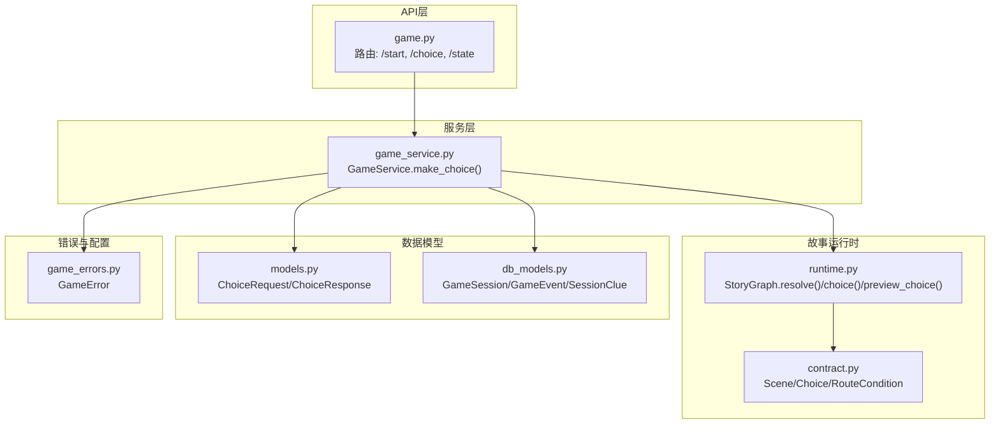
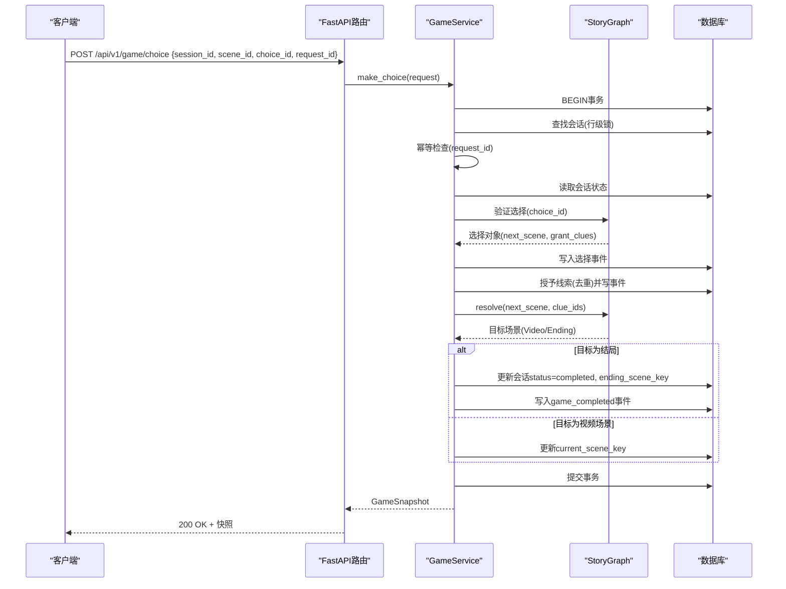
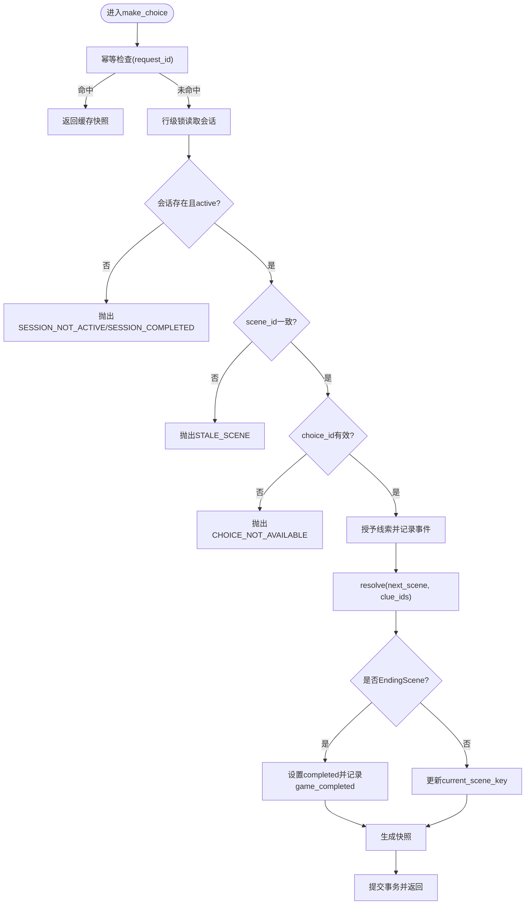
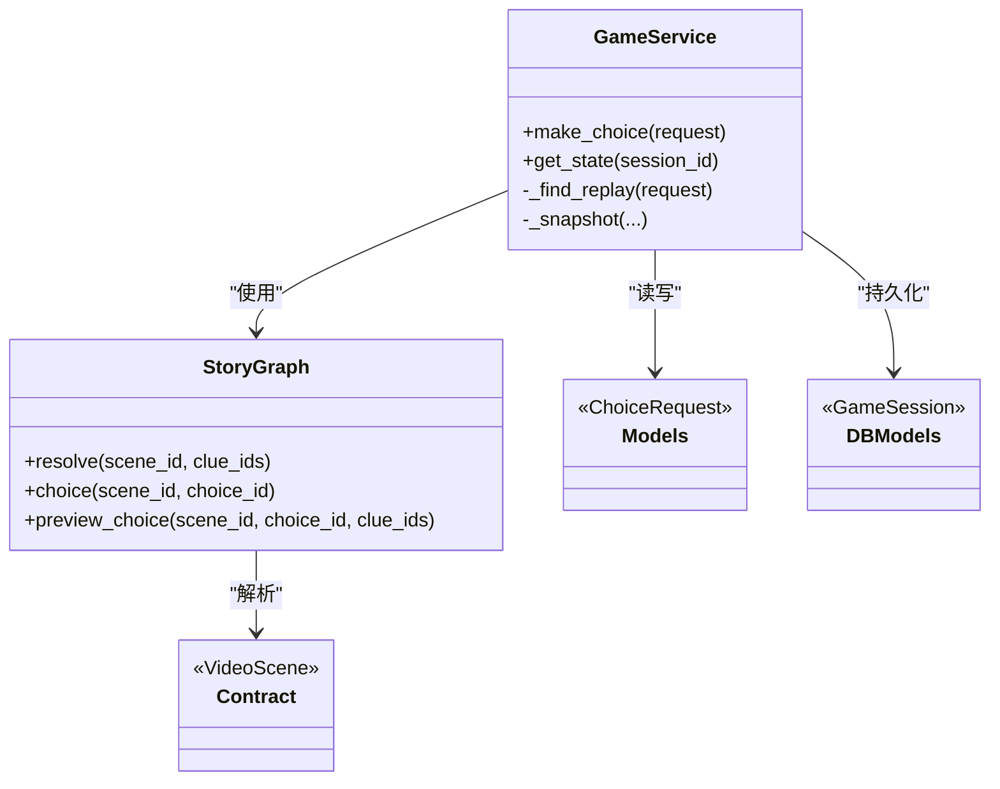
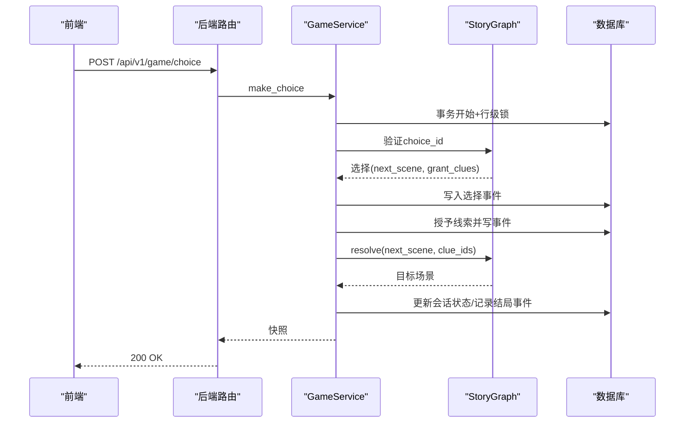

# 玩家选择交互API

<cite>
**本文引用的文件**   
- [backend/app/api/game.py](file://backend/app/api/game.py)
- [backend/app/game_service.py](file://backend/app/game_service.py)
- [backend/app/models.py](file://backend/app/models.py)
- [backend/app/story/runtime.py](file://backend/app/story/runtime.py)
- [backend/app/story/contract.py](file://backend/app/story/contract.py)
- [backend/app/db_models.py](file://backend/app/db_models.py)
- [backend/app/game_errors.py](file://backend/app/game_errors.py)
- [backend/tests/test_game_api.py](file://backend/tests/test_game_api.py)
- [frontend/src/lib/api.ts](file://frontend/src/lib/api.ts)
</cite>

## 目录
1. [简介](#简介)
2. [项目结构](#项目结构)
3. [核心组件](#核心组件)
4. [架构总览](#架构总览)
5. [详细组件分析](#详细组件分析)
6. [依赖关系分析](#依赖关系分析)
7. [性能考量](#性能考量)
8. [故障排查指南](#故障排查指南)
9. [结论](#结论)
10. [附录：API调用示例与数据流](#附录api调用示例与数据流)

## 简介
本文件面向“玩家选择交互”的POST /api/v1/game/choice接口，系统性说明其实现原理、请求体校验规则、响应数据结构、选择处理的核心算法（场景路由、条件判断、多分支推进）、错误处理策略以及与故事引擎状态机的集成和数据同步机制。文档同时提供端到端调用示例，帮助读者理解不同选择路径的数据流转过程。

## 项目结构
与选择交互相关的关键代码分布在以下模块：
- API层：FastAPI路由定义与参数绑定
- 服务层：事务性游戏推进、会话与事件持久化、幂等控制
- 故事运行时：图遍历、场景解析、条件匹配与路由跳转
- 数据模型：Pydantic契约、SQLAlchemy持久化模型
- 测试与前端：端到端用例与客户端封装

图表来源
- [backend/app/api/game.py:1-36](file://backend/app/api/game.py#L1-L36)
- [backend/app/game_service.py:70-193](file://backend/app/game_service.py#L70-L193)
- [backend/app/story/runtime.py:22-80](file://backend/app/story/runtime.py#L22-L80)
- [backend/app/story/contract.py:41-103](file://backend/app/story/contract.py#L41-L103)
- [backend/app/models.py:83-92](file://backend/app/models.py#L83-L92)
- [backend/app/db_models.py:74-126](file://backend/app/db_models.py#L74-L126)
- [backend/app/game_errors.py:7-20](file://backend/app/game_errors.py#L7-L20)

章节来源
- [backend/app/api/game.py:1-36](file://backend/app/api/game.py#L1-L36)
- [backend/app/game_service.py:70-193](file://backend/app/game_service.py#L70-L193)
- [backend/app/story/runtime.py:22-80](file://backend/app/story/runtime.py#L22-L80)
- [backend/app/models.py:83-92](file://backend/app/models.py#L83-L92)
- [backend/app/db_models.py:74-126](file://backend/app/db_models.py#L74-L126)
- [backend/app/game_errors.py:7-20](file://backend/app/game_errors.py#L7-L20)

## 核心组件
- ChoiceRequest/ChoiceResponse：请求与响应的Pydantic模型，包含字段校验与类型约束
- GameService：事务性选择处理、会话锁定、事件记录、线索授予、结局判定与快照生成
- StoryGraph：基于已发布剧本的运行时图，负责场景上下文、选择验证、条件路由与预览
- 数据库模型：GameSession、GameEvent、SessionClue用于会话状态、事件日志与线索收集

章节来源
- [backend/app/models.py:83-92](file://backend/app/models.py#L83-L92)
- [backend/app/game_service.py:70-193](file://backend/app/game_service.py#L70-L193)
- [backend/app/story/runtime.py:22-80](file://backend/app/story/runtime.py#L22-L80)
- [backend/app/db_models.py:74-126](file://backend/app/db_models.py#L74-L126)

## 架构总览
选择交互的整体流程如下：
- 客户端发起POST /api/v1/game/choice，携带session_id、scene_id、choice_id、request_id
- FastAPI路由将请求交由GameService.make_choice处理
- Service层在事务中完成：
  - 幂等检查（基于request_id）
  - 会话存在性与状态校验（active/completed）
  - 当前场景一致性校验（防止并发或过期场景提交）
  - 通过StoryGraph验证选择并计算目标场景
  - 授予线索并记录事件
  - 若目标为结局场景则标记会话完成
  - 返回统一快照（含下一场景、对话内容、线索获取、进度与结局信息）

图表来源
- [backend/app/api/game.py:23-28](file://backend/app/api/game.py#L23-L28)
- [backend/app/game_service.py:70-193](file://backend/app/game_service.py#L70-L193)
- [backend/app/story/runtime.py:50-62](file://backend/app/story/runtime.py#L50-L62)
- [backend/app/db_models.py:93-126](file://backend/app/db_models.py#L93-L126)

## 详细组件分析

### 接口定义与请求体验证
- 路由：POST /api/v1/game/choice，返回ChoiceResponse（即GameSnapshot）
- ChoiceRequest字段与校验：
  - session_id: UUID类型，必填
  - scene_id: 字符串，长度2-64，仅允许小写字母、数字与下划线
  - choice_id: 字符串，长度2-64，仅允许小写字母、数字与下划线
  - request_id: UUID类型，必填，用于幂等控制
- 非法输入会触发422 VALIDATION_ERROR

章节来源
- [backend/app/api/game.py:23-28](file://backend/app/api/game.py#L23-L28)
- [backend/app/models.py:83-92](file://backend/app/models.py#L83-L92)
- [backend/tests/test_game_api.py:181-183](file://backend/tests/test_game_api.py#L181-L183)

### 响应数据结构（GameSnapshot）
- session_id: 会话ID
- status: active | completed
- story: 故事元信息（id、title、version）
- scene: 当前场景详情（id、type、chapter、media、choices）
- clues: 已收集的线索列表（含标题、描述、图标、获取时间）
- progress: 当前章节与总章节数
- awarded_clues: 本次新增的线索（可选）
- ending: 结局信息（id、code），仅在结局场景时出现

章节来源
- [backend/app/models.py:72-92](file://backend/app/models.py#L72-L92)
- [backend/app/game_service.py:235-281](file://backend/app/game_service.py#L235-L281)

### 选择处理核心算法
- 幂等控制：根据request_id查询历史事件，若存在且请求负载一致则直接返回缓存响应；若不一致则报错冲突
- 会话与场景一致性：
  - 会话不存在：404 SESSION_NOT_FOUND
  - 会话已结束或不可继续：409 SESSION_COMPLETED / SESSION_NOT_ACTIVE
  - 提交的scene_id与当前会话不一致：409 STALE_SCENE（附带提交与当前scene_id）
- 选择有效性：
  - 当前场景必须为VideoScene
  - choice_id必须在当前场景choices中存在，否则409 CHOICE_NOT_AVAILABLE
- 线索授予：
  - 遍历选择的grant_clues，去重后写入SessionClue并记录clue_granted事件
- 场景路由与跳转：
  - 使用StoryGraph.resolve按clue_ids进行条件匹配，支持min_clue_count、all_clues、any_clues与default
  - 若目标为EndingScene，会话状态置为completed并记录game_completed事件
  - 若目标为VideoScene，更新current_scene_key
- 快照生成：
  - 组装scene、clues、progress、awarded_clues与ending等信息返回

图表来源
- [backend/app/game_service.py:84-193](file://backend/app/game_service.py#L84-L193)
- [backend/app/story/runtime.py:37-79](file://backend/app/story/runtime.py#L37-L79)

章节来源
- [backend/app/game_service.py:84-193](file://backend/app/game_service.py#L84-L193)
- [backend/app/story/runtime.py:37-79](file://backend/app/story/runtime.py#L37-L79)

### 场景路由与条件判断机制
- RouterScene的routes按priority排序，依次匹配when条件：
  - default: true表示兜底
  - min_clue_count: 要求当前线索数量不少于阈值
  - all_clues: 要求所有指定线索均已拥有
  - any_clues: 要求至少拥有一条指定线索
- 若无匹配路由，抛出运行时错误
- preview_choice用于前端预加载下一场景媒体资源

章节来源
- [backend/app/story/runtime.py:64-79](file://backend/app/story/runtime.py#L64-L79)
- [backend/app/story/contract.py:48-73](file://backend/app/story/contract.py#L48-L73)

### 与故事引擎的状态机集成与数据同步
- 状态机由StoryDocument与StoryGraph驱动，严格遵循v1契约
- 会话状态机：
  - active：可继续选择
  - completed：已结束，不可再选择
- 数据同步：
  - 每次选择写入GameEvent（含payload_json记录请求与响应）
  - 线索授予写入SessionClue并关联source_event_id
  - 会话状态与last_active_at实时更新
  - 幂等记录确保重复请求不产生副作用

章节来源
- [backend/app/db_models.py:74-126](file://backend/app/db_models.py#L74-L126)
- [backend/app/game_service.py:127-193](file://backend/app/game_service.py#L127-L193)

## 依赖关系分析
- API路由依赖GameService
- GameService依赖：
  - models（ChoiceRequest/Response）
  - db_models（会话、事件、线索）
  - story.runtime（StoryGraph）
  - story.contract（场景与选择契约）
  - game_errors（统一错误）
- 运行时依赖已发布的StoryVersion内容JSON，并通过validate_story_data校验

图表来源
- [backend/app/game_service.py:70-193](file://backend/app/game_service.py#L70-L193)
- [backend/app/story/runtime.py:22-80](file://backend/app/story/runtime.py#L22-L80)
- [backend/app/models.py:83-92](file://backend/app/models.py#L83-L92)
- [backend/app/db_models.py:74-126](file://backend/app/db_models.py#L74-L126)
- [backend/app/story/contract.py:76-103](file://backend/app/story/contract.py#L76-L103)

章节来源
- [backend/app/game_service.py:70-193](file://backend/app/game_service.py#L70-L193)
- [backend/app/story/runtime.py:22-80](file://backend/app/story/runtime.py#L22-L80)
- [backend/app/models.py:83-92](file://backend/app/models.py#L83-L92)
- [backend/app/db_models.py:74-126](file://backend/app/db_models.py#L74-L126)
- [backend/app/story/contract.py:76-103](file://backend/app/story/contract.py#L76-L103)

## 性能考量
- 事务与锁：
  - SQLite使用BEGIN IMMEDIATE保证并发安全
  - PostgreSQL使用with_for_update行级锁避免竞态
- 幂等优化：
  - 通过request_id快速命中历史事件，避免重复计算
- 预加载：
  - preview_choice提前计算下一场景媒体，减少首帧延迟
- 事件与线索写入：
  - 批量flush与最小化payload，降低IO开销

[本节为通用指导，无需特定文件引用]

## 故障排查指南
常见错误与处理建议：
- 422 VALIDATION_ERROR：请求体字段不符合校验规则（如session_id非UUID、scene_id/choice_id格式不符）
  - 检查字段类型与正则模式
- 404 SESSION_NOT_FOUND：会话不存在
  - 确认session_id正确且会话未被清理
- 409 SESSION_COMPLETED：会话已结束
  - 不再接受新的选择请求
- 409 SESSION_NOT_ACTIVE：会话不可继续
  - 检查会话状态是否为active
- 409 STALE_SCENE：提交的scene_id与当前不一致
  - 前端应使用最新快照中的scene_id
- 409 CHOICE_NOT_AVAILABLE：选择不在当前场景
  - 检查choice_id是否正确
- 409 IDEMPOTENCY_CONFLICT：request_id被用于不同的选择请求
  - 重新生成唯一request_id
- 500 STORY_DATA_CORRUPTED：已发布剧情数据异常
  - 检查版本内容与契约校验结果

章节来源
- [backend/app/game_errors.py:7-20](file://backend/app/game_errors.py#L7-L20)
- [backend/app/game_service.py:92-122](file://backend/app/game_service.py#L92-L122)
- [backend/app/game_service.py:353-368](file://backend/app/game_service.py#L353-L368)
- [backend/tests/test_game_api.py:172-183](file://backend/tests/test_game_api.py#L172-L183)

## 结论
POST /api/v1/game/choice以强一致的数据库事务与幂等机制保障选择处理的正确性与可靠性，结合严格的v1剧本契约与运行时图遍历，实现了灵活的条件分支与多结局推进。通过统一的快照响应，前端可稳定渲染场景、展示线索与进度，并在结局时获得明确的结束标识。

[本节为总结，无需特定文件引用]

## 附录：API调用示例与数据流

### 请求体结构（ChoiceRequest）
- session_id: UUID
- scene_id: 字符串（小写字母、数字、下划线，长度2-64）
- choice_id: 字符串（小写字母、数字、下划线，长度2-64）
- request_id: UUID（幂等键）

章节来源
- [backend/app/models.py:83-92](file://backend/app/models.py#L83-L92)

### 响应体结构（ChoiceResponse = GameSnapshot）
- session_id: UUID
- status: "active" | "completed"
- story: {id, title, version}
- scene: {id, type, chapter, media, choices}
- clues: [{id, title, description, icon?, acquired_at}]
- progress: {current_chapter, total_chapters}
- awarded_clues?: [{...}]
- ending?: {id, code}

章节来源
- [backend/app/models.py:72-92](file://backend/app/models.py#L72-L92)

### 典型调用序列（端到端）
- 启动游戏：POST /api/v1/game/start，返回初始快照（scene_start）
- 第一次选择：POST /api/v1/game/choice，传入scene_start的有效choice_id，可能获得线索并跳转到新场景
- 合并分支：根据已有线索，路由到合并场景
- 到达结局：选择进入EndingScene，status变为completed，返回ending信息
- 幂等回放：使用相同request_id再次提交，返回相同快照
- 并发保护：并发提交同一场景的不同选择，只有一个成功，另一个返回STALE_SCENE

章节来源
- [backend/tests/test_game_api.py:90-126](file://backend/tests/test_game_api.py#L90-L126)
- [backend/tests/test_game_api.py:186-209](file://backend/tests/test_game_api.py#L186-L209)

### 前端调用示例（TypeScript）
- 使用crypto.randomUUID()生成request_id
- 调用/ game/choice，传入session_id、scene_id、choice_id与request_id
- 处理返回的GameSnapshot，渲染scene.media与choices，累积clues

章节来源
- [frontend/src/lib/api.ts:92-106](file://frontend/src/lib/api.ts#L92-L106)

### 数据流转图（一次选择）

图表来源
- [backend/app/api/game.py:23-28](file://backend/app/api/game.py#L23-L28)
- [backend/app/game_service.py:127-193](file://backend/app/game_service.py#L127-L193)
- [backend/app/story/runtime.py:50-62](file://backend/app/story/runtime.py#L50-L62)
- [backend/app/db_models.py:93-126](file://backend/app/db_models.py#L93-L126)