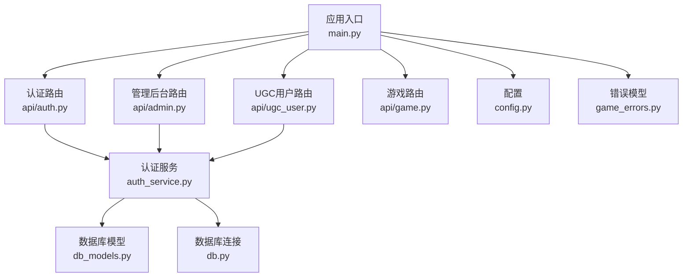
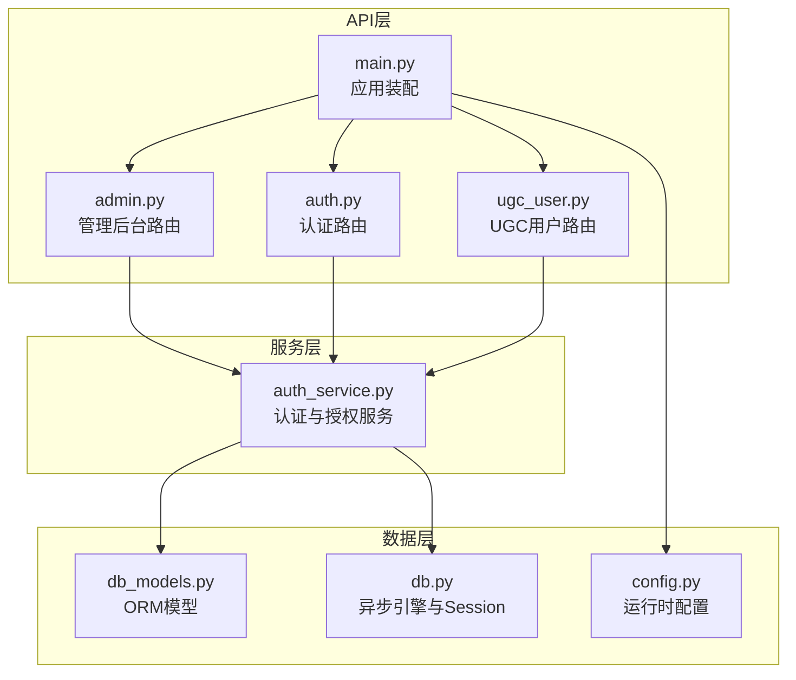
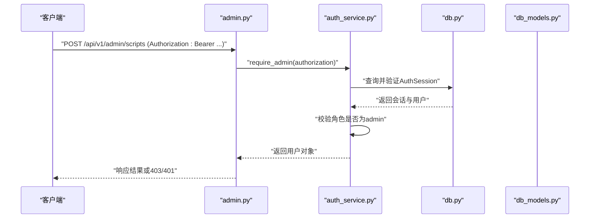
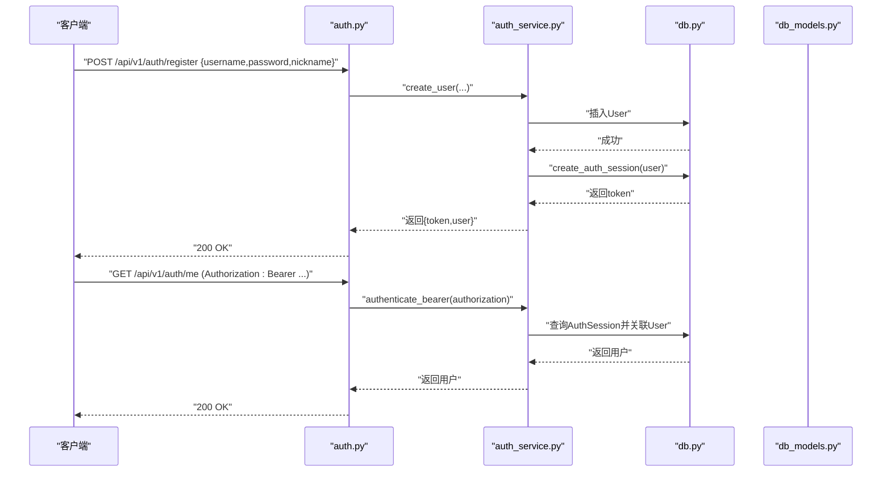
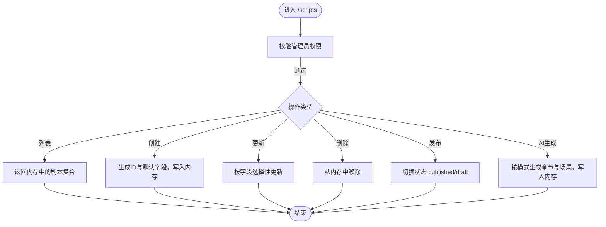
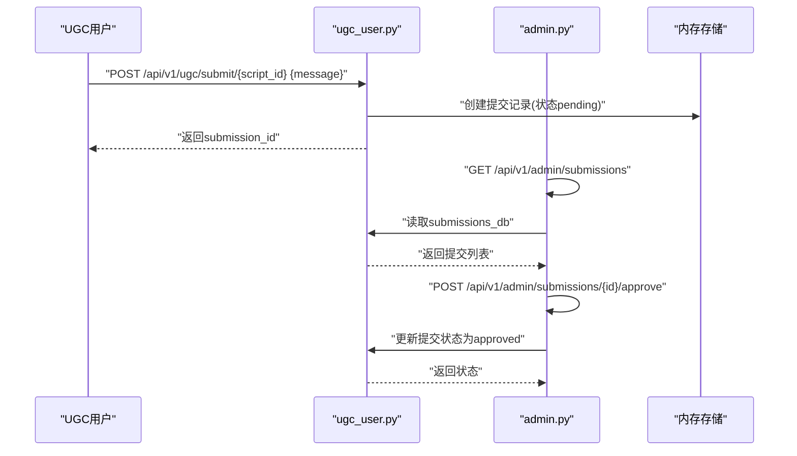
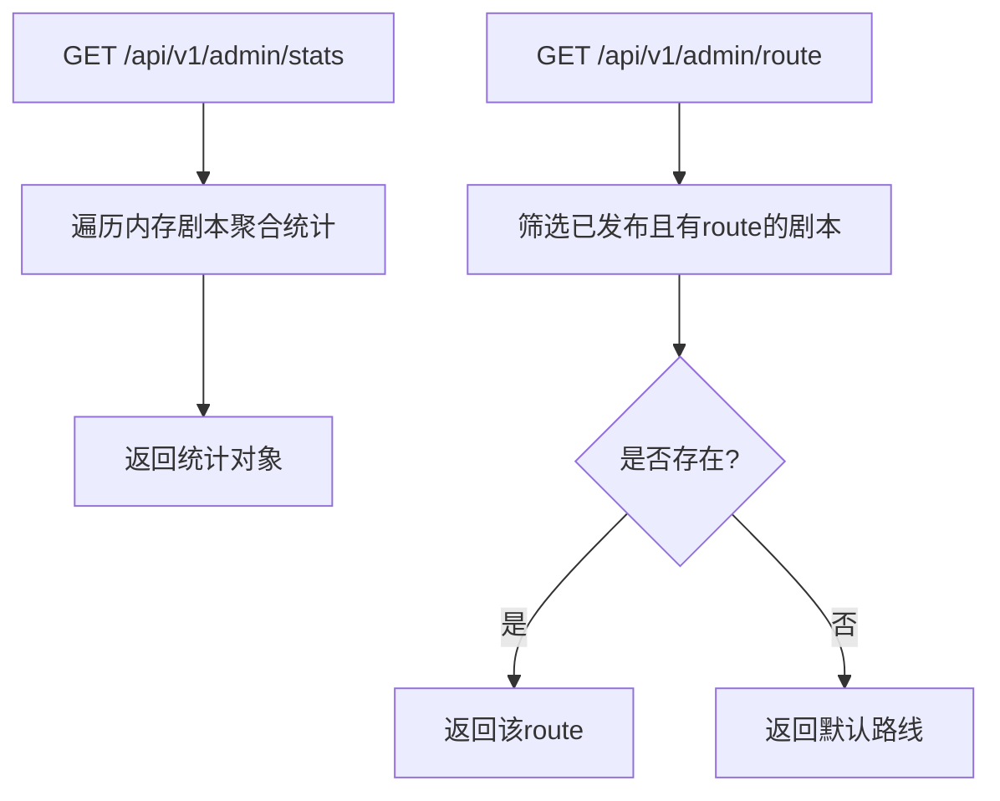
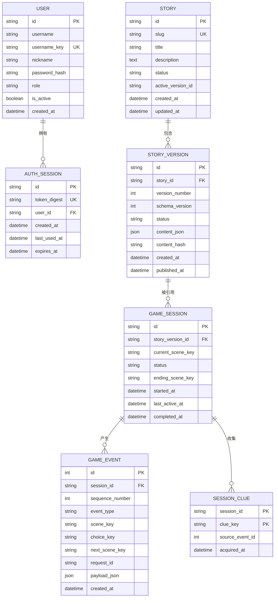
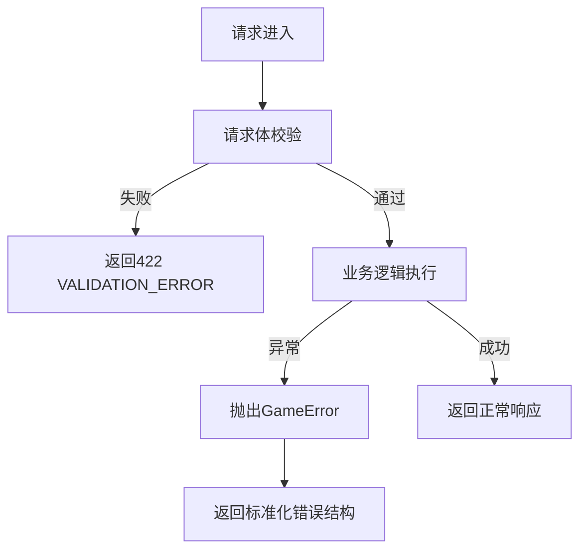
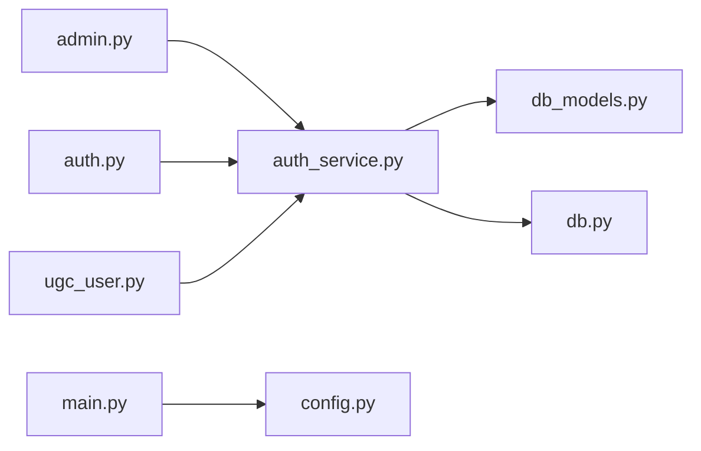

# 管理后台API

<cite>
**本文引用的文件**   
- [backend/app/main.py](file://backend/app/main.py)
- [backend/app/api/admin.py](file://backend/app/api/admin.py)
- [backend/app/api/auth.py](file://backend/app/api/auth.py)
- [backend/app/auth_service.py](file://backend/app/auth_service.py)
- [backend/app/db_models.py](file://backend/app/db_models.py)
- [backend/app/db.py](file://backend/app/db.py)
- [backend/app/config.py](file://backend/app/config.py)
- [backend/app/game_errors.py](file://backend/app/game_errors.py)
- [backend/app/api/ugc_user.py](file://backend/app/api/ugc_user.py)
- [backend/tests/test_auth_api.py](file://backend/tests/test_auth_api.py)
</cite>

## 目录
1. [简介](#简介)
2. [项目结构](#项目结构)
3. [核心组件](#核心组件)
4. [架构总览](#架构总览)
5. [详细组件分析](#详细组件分析)
6. [依赖关系分析](#依赖关系分析)
7. [性能考虑](#性能考虑)
8. [故障排查指南](#故障排查指南)
9. [结论](#结论)
10. [附录](#附录)

## 简介
本文件为“澳门神秘”项目的管理后台API完整技术文档，覆盖管理员认证、用户管理、剧本管理与系统配置等接口规范。重点说明：
- 管理员权限控制与鉴权流程（Bearer Token + 角色校验）
- 数据模型与持久化（用户、会话、故事与版本、游戏事件等）
- 剧本CRUD、AI生成、内容审核（UGC提交与审批）、统计与路线配置
- 安全访问控制、操作审计日志、健康检查与故障恢复机制
- 批量处理与数据导出能力（当前以内存存储实现，可扩展至数据库）
- 管理员工作流指导与常见问题解决方案

## 项目结构
后端基于FastAPI构建，采用模块化路由组织：
- 应用入口与全局异常处理、CORS、健康检查在应用层统一配置
- 各业务域通过独立Router暴露REST API，前缀按领域划分
- 认证与授权服务集中实现，支持用户名密码注册登录、Bearer Token校验与管理员角色校验
- 数据模型使用SQLAlchemy ORM定义，包含用户、会话、故事、版本、游戏会话与事件等
- 测试覆盖认证与会话持久化的关键路径

**图表来源** 
- [backend/app/main.py:17-106](file://backend/app/main.py#L17-L106)
- [backend/app/api/auth.py:24-96](file://backend/app/api/auth.py#L24-L96)
- [backend/app/api/admin.py:12-218](file://backend/app/api/admin.py#L12-L218)
- [backend/app/api/ugc_user.py:12-96](file://backend/app/api/ugc_user.py#L12-L96)
- [backend/app/auth_service.py:100-130](file://backend/app/auth_service.py#L100-L130)
- [backend/app/db_models.py:128-160](file://backend/app/db_models.py#L128-L160)
- [backend/app/db.py:12-42](file://backend/app/db.py#L12-L42)
- [backend/app/config.py:38-77](file://backend/app/config.py#L38-L77)
- [backend/app/game_errors.py:7-20](file://backend/app/game_errors.py#L7-L20)

**章节来源**
- [backend/app/main.py:17-106](file://backend/app/main.py#L17-L106)
- [backend/app/config.py:38-77](file://backend/app/config.py#L38-L77)

## 核心组件
- 应用生命周期与异常处理：统一注册GameError与请求校验异常处理器，返回标准化错误结构；启用CORS；挂载各模块路由与健康检查端点
- 认证与授权：提供用户名密码注册登录、Bearer Token签发与校验、管理员角色强制校验
- 数据模型：用户、认证会话、故事与版本、游戏会话与事件、线索等实体，含约束与索引
- 数据库连接：异步引擎与Session工厂，SQLite外键与忙超时配置，健康检查
- 配置：环境变量驱动，包括数据库URL、CORS、演示数据开关、Token TTL、演示账号等

**章节来源**
- [backend/app/main.py:17-106](file://backend/app/main.py#L17-L106)
- [backend/app/auth_service.py:27-130](file://backend/app/auth_service.py#L27-L130)
- [backend/app/db_models.py:24-160](file://backend/app/db_models.py#L24-L160)
- [backend/app/db.py:12-42](file://backend/app/db.py#L12-L42)
- [backend/app/config.py:38-77](file://backend/app/config.py#L38-L77)

## 架构总览
下图展示管理后台API的整体架构与调用关系，涵盖认证、授权、数据模型与外部依赖。

**图表来源** 
- [backend/app/main.py:84-96](file://backend/app/main.py#L84-L96)
- [backend/app/api/admin.py:12-218](file://backend/app/api/admin.py#L12-L218)
- [backend/app/api/auth.py:24-96](file://backend/app/api/auth.py#L24-L96)
- [backend/app/api/ugc_user.py:12-96](file://backend/app/api/ugc_user.py#L12-L96)
- [backend/app/auth_service.py:100-130](file://backend/app/auth_service.py#L100-L130)
- [backend/app/db_models.py:128-160](file://backend/app/db_models.py#L128-L160)
- [backend/app/db.py:12-42](file://backend/app/db.py#L12-L42)
- [backend/app/config.py:38-77](file://backend/app/config.py#L38-L77)

## 详细组件分析

### 管理员认证与授权
- 认证方式：Bearer Token（Authorization: Bearer <token>），服务端校验令牌有效性、过期时间与用户状态
- 授权策略：仅当用户角色为admin时允许访问管理后台接口；否则返回403
- 开发环境兼容：存在一个独立的ADMIN_TOKEN校验辅助（用于特定场景），但管理后台主要依赖Bearer Token+角色校验

**图表来源** 
- [backend/app/api/admin.py:66-68](file://backend/app/api/admin.py#L66-L68)
- [backend/app/auth_service.py:126-130](file://backend/app/auth_service.py#L126-L130)
- [backend/app/auth_service.py:100-123](file://backend/app/auth_service.py#L100-L123)
- [backend/app/db_models.py:147-160](file://backend/app/db_models.py#L147-L160)

**章节来源**
- [backend/app/api/admin.py:66-68](file://backend/app/api/admin.py#L66-L68)
- [backend/app/auth_service.py:100-130](file://backend/app/auth_service.py#L100-L130)
- [backend/app/db_models.py:147-160](file://backend/app/db_models.py#L147-L160)

### 用户管理（注册、登录、获取当前用户）
- 注册：用户名唯一性校验、昵称规范化、密码长度校验；成功后创建用户与认证会话，返回token与用户信息
- 登录：用户名大小写不敏感匹配、密码校验、活跃状态检查；成功后签发新会话token
- 获取当前用户：携带Bearer Token校验，返回用户基本信息

**图表来源** 
- [backend/app/api/auth.py:64-96](file://backend/app/api/auth.py#L64-L96)
- [backend/app/auth_service.py:63-97](file://backend/app/auth_service.py#L63-L97)
- [backend/app/auth_service.py:100-123](file://backend/app/auth_service.py#L100-L123)
- [backend/app/db_models.py:128-145](file://backend/app/db_models.py#L128-L145)

**章节来源**
- [backend/app/api/auth.py:28-96](file://backend/app/api/auth.py#L28-L96)
- [backend/app/auth_service.py:27-97](file://backend/app/auth_service.py#L27-L97)
- [backend/app/db_models.py:128-145](file://backend/app/db_models.py#L128-L145)

### 剧本管理（CRUD、发布、AI生成）
- 列表：返回所有剧本（当前内存存储）
- 创建：管理员权限校验后新增剧本，初始状态为草稿
- 更新：支持标题、描述、状态字段部分更新
- 删除：管理员权限校验后删除指定剧本
- 发布：切换状态为published/draft
- AI生成：根据输入快速或精修模式生成章节与场景模板，写入内存存储

**图表来源** 
- [backend/app/api/admin.py:71-168](file://backend/app/api/admin.py#L71-L168)

**章节来源**
- [backend/app/api/admin.py:16-168](file://backend/app/api/admin.py#L16-L168)

### 内容审核（UGC提交与审批）
- 用户提交：将公开剧本提交至官方审核队列，记录提交信息与时间
- 管理员查看：列出待审提交
- 管理员审批：批准或拒绝，更新提交状态

**图表来源** 
- [backend/app/api/ugc_user.py:56-77](file://backend/app/api/ugc_user.py#L56-L77)
- [backend/app/api/admin.py:185-209](file://backend/app/api/admin.py#L185-L209)

**章节来源**
- [backend/app/api/ugc_user.py:31-77](file://backend/app/api/ugc_user.py#L31-L77)
- [backend/app/api/admin.py:185-209](file://backend/app/api/admin.py#L185-L209)

### 统计与路线配置
- 统计：汇总剧本数量、玩家数、浏览量、已发布与草稿数量
- 路线配置：返回已发布剧本的路线，若无则返回默认路线

**图表来源** 
- [backend/app/api/admin.py:171-182](file://backend/app/api/admin.py#L171-L182)
- [backend/app/api/admin.py:212-218](file://backend/app/api/admin.py#L212-L218)

**章节来源**
- [backend/app/api/admin.py:171-182](file://backend/app/api/admin.py#L171-L182)
- [backend/app/api/admin.py:212-218](file://backend/app/api/admin.py#L212-L218)

### 数据模型与持久化
- 用户与认证会话：支持用户名唯一性、角色约束、会话过期与最后使用时间
- 故事与版本：支持多版本管理、内容哈希、状态约束
- 游戏会话与事件：记录选择、场景跳转、请求去重与序列号
- 线索：会话级线索收集与来源事件关联

**图表来源** 
- [backend/app/db_models.py:24-160](file://backend/app/db_models.py#L24-L160)

**章节来源**
- [backend/app/db_models.py:24-160](file://backend/app/db_models.py#L24-L160)

### 安全访问控制与错误处理
- 统一错误格式：自定义GameError与请求校验异常处理器，返回结构化error对象
- 健康检查：检测数据库可用性，返回状态码与版本信息
- CORS：允许前端跨域访问，支持凭据与通配方法头

**图表来源** 
- [backend/app/main.py:38-74](file://backend/app/main.py#L38-L74)
- [backend/app/game_errors.py:7-20](file://backend/app/game_errors.py#L7-L20)

**章节来源**
- [backend/app/main.py:38-74](file://backend/app/main.py#L38-L74)
- [backend/app/game_errors.py:7-20](file://backend/app/game_errors.py#L7-L20)

### 数据导出与批量处理
- 当前实现：剧本与UGC提交数据存储在内存字典中，可通过列表接口一次性获取全部数据，便于导出
- 扩展建议：将内存存储替换为数据库表，增加分页、过滤、排序与导出接口（CSV/JSON）

**章节来源**
- [backend/app/api/admin.py:16-39](file://backend/app/api/admin.py#L16-39)
- [backend/app/api/ugc_user.py:16-19](file://backend/app/api/ugc_user.py#L16-19)

## 依赖关系分析
- 路由依赖：admin、auth、ugc_user均依赖auth_service进行认证与授权
- 数据依赖：auth_service依赖db_models与db进行用户与会话的持久化
- 配置依赖：应用启动时加载Settings，影响演示数据初始化、CORS与Token TTL

**图表来源** 
- [backend/app/api/admin.py:12-218](file://backend/app/api/admin.py#L12-L218)
- [backend/app/api/auth.py:24-96](file://backend/app/api/auth.py#L24-L96)
- [backend/app/api/ugc_user.py:12-96](file://backend/app/api/ugc_user.py#L12-L96)
- [backend/app/auth_service.py:100-130](file://backend/app/auth_service.py#L100-L130)
- [backend/app/db_models.py:128-160](file://backend/app/db_models.py#L128-L160)
- [backend/app/db.py:12-42](file://backend/app/db.py#L12-L42)
- [backend/app/config.py:38-77](file://backend/app/config.py#L38-L77)

**章节来源**
- [backend/app/main.py:84-96](file://backend/app/main.py#L84-L96)
- [backend/app/auth_service.py:100-130](file://backend/app/auth_service.py#L100-L130)

## 性能考虑
- 内存存储：当前剧本与UGC提交使用内存字典，适合开发与演示；生产环境应迁移至数据库并引入缓存与分页
- 数据库连接：SQLite开启外键与忙超时，避免并发冲突；可考虑切换至PostgreSQL提升并发能力
- 认证会话：Token TTL可配置，合理设置过期时间平衡安全性与用户体验
- 健康检查：定期调用健康端点进行监控与告警

[本节为通用指导，不直接分析具体文件]

## 故障排查指南
- 认证失败（401/403）：检查Authorization头是否包含Bearer Token，确认Token未过期且用户处于活跃状态；管理员接口需角色为admin
- 重复用户名（409）：注册时用户名已存在，注意大小写不敏感规则
- 请求校验失败（422）：检查请求体字段类型与长度限制（如用户名、密码、昵称）
- 数据库不可用（503）：健康检查返回degraded，检查数据库连接与迁移状态
- 演示数据未初始化：确保BOOTSTRAP_DEMO_USERS或BOOTSTRAP_DEMO_STORY开关正确，并执行数据库迁移

**章节来源**
- [backend/tests/test_auth_api.py:130-174](file://backend/tests/test_auth_api.py#L130-L174)
- [backend/app/main.py:98-105](file://backend/app/main.py#L98-L105)

## 结论
本管理后台API以FastAPI为核心，结合统一的认证授权服务与清晰的ORM模型，实现了管理员认证、用户管理、剧本管理与内容审核等关键能力。当前内存存储适合演示与开发，生产部署建议迁移至数据库并增强分页、导出与审计功能。通过健康检查与标准化错误处理，系统具备良好的可观测性与可维护性。

[本节为总结，不直接分析具体文件]

## 附录
- 管理员工作流指导
  - 登录：使用管理员账号登录获取Bearer Token
  - 剧本管理：创建草稿、编辑内容、发布上线；必要时使用AI生成辅助
  - 内容审核：查看UGC提交，批准或拒绝，跟踪状态
  - 统计与路线：查看平台统计，配置默认路线
- 常见问题解决方案
  - 无法访问管理接口：确认角色为admin且Token有效
  - 注册失败：检查用户名唯一性与密码长度
  - 审核无数据：确认UGC脚本已设为公开并提交
  - 健康检查失败：检查数据库连接与迁移状态

[本节为概念性指导，不直接分析具体文件]