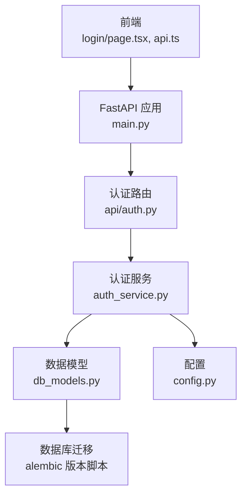
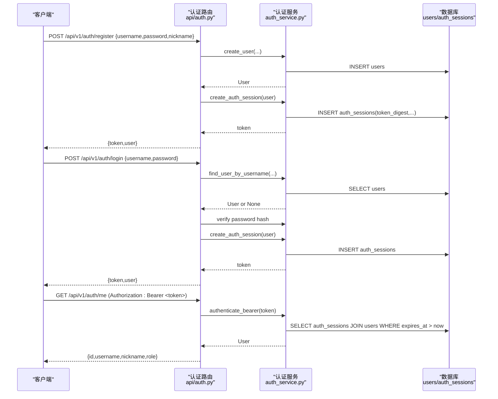
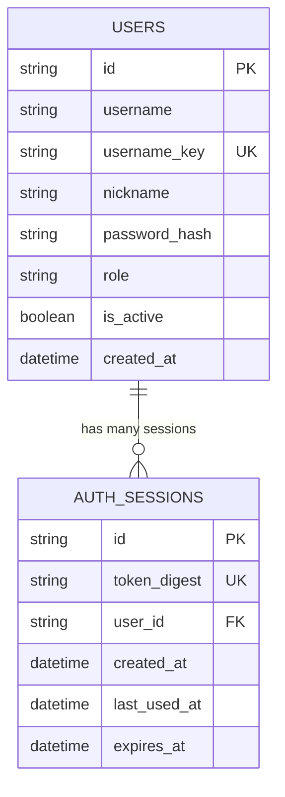
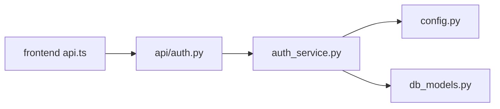

# 认证授权API

<cite>
**本文引用的文件**   
- [backend/app/api/auth.py](file://backend/app/api/auth.py)
- [backend/app/auth_service.py](file://backend/app/auth_service.py)
- [backend/app/db_models.py](file://backend/app/db_models.py)
- [backend/app/config.py](file://backend/app/config.py)
- [backend/app/main.py](file://backend/app/main.py)
- [backend/alembic/versions/20260804_0002_auth_persistence.py](file://backend/alembic/versions/20260804_0002_auth_persistence.py)
- [backend/tests/test_auth_api.py](file://backend/tests/test_auth_api.py)
- [frontend/src/lib/api.ts](file://frontend/src/lib/api.ts)
- [frontend/src/app/login/page.tsx](file://frontend/src/app/login/page.tsx)
</cite>

## 目录
1. [简介](#简介)
2. [项目结构](#项目结构)
3. [核心组件](#核心组件)
4. [架构总览](#架构总览)
5. [详细组件分析](#详细组件分析)
6. [依赖关系分析](#依赖关系分析)
7. [性能与安全考量](#性能与安全考量)
8. [故障排查指南](#故障排查指南)
9. [结论](#结论)
10. [附录：接口规范与示例](#附录接口规范与示例)

## 简介
本文件为“澳门神秘”平台的认证授权API完整文档，覆盖用户注册、登录、获取当前用户信息三大接口；详细说明HTTP方法、URL路径、请求参数校验规则、响应数据结构与错误码。同时阐述令牌生成机制（基于持久化会话的Bearer Token）、密码加密存储方案以及用户角色权限体系。文末提供前后端集成要点、常见错误与排错建议，并给出成功与失败场景的请求/响应示例。

## 项目结构
认证相关代码主要位于后端FastAPI应用中：
- API路由定义在 app/api/auth.py
- 认证与用户管理逻辑在 app/auth_service.py
- 数据模型与表结构在 app/db_models.py，迁移脚本在 alembic/versions/20260804_0002_auth_persistence.py
- 应用入口与路由挂载在 app/main.py
- 配置项（如令牌有效期）在 app/config.py
- 前端调用封装在 frontend/src/lib/api.ts，登录页面在 frontend/src/app/login/page.tsx

图表来源
- [backend/app/main.py:84-96](file://backend/app/main.py#L84-L96)
- [backend/app/api/auth.py:24-97](file://backend/app/api/auth.py#L24-L97)
- [backend/app/auth_service.py:59-131](file://backend/app/auth_service.py#L59-L131)
- [backend/app/db_models.py:128-160](file://backend/app/db_models.py#L128-L160)
- [backend/alembic/versions/20260804_0002_auth_persistence.py:17-46](file://backend/alembic/versions/20260804_0002_auth_persistence.py#L17-L46)

章节来源
- [backend/app/main.py:84-96](file://backend/app/main.py#L84-L96)
- [backend/app/api/auth.py:24-97](file://backend/app/api/auth.py#L24-L97)

## 核心组件
- 认证路由层：暴露 /api/v1/auth/register、/api/v1/auth/login、/api/v1/auth/me 三个接口，负责请求解析、参数校验与响应组装。
- 认证服务层：实现用户名/密码校验、昵称规范化、密码哈希、令牌生成与会话验证、管理员权限检查等。
- 数据模型层：定义 users 与 auth_sessions 两张表及其关系，约束角色取值范围与唯一性。
- 配置层：提供令牌有效期、CORS、演示账号等运行时配置。
- 前端层：封装认证API调用，自动附加 Authorization: Bearer <token> 头，并在本地存储 token 与 user。

章节来源
- [backend/app/api/auth.py:28-97](file://backend/app/api/auth.py#L28-L97)
- [backend/app/auth_service.py:27-131](file://backend/app/auth_service.py#L27-L131)
- [backend/app/db_models.py:128-160](file://backend/app/db_models.py#L128-L160)
- [backend/app/config.py:38-77](file://backend/app/config.py#L38-L77)
- [frontend/src/lib/api.ts:201-215](file://frontend/src/lib/api.ts#L201-L215)

## 架构总览
认证流程采用“服务端持久化会话 + Bearer Token”模式：
- 注册：校验用户名/密码/昵称 → 创建用户 → 生成令牌 → 返回 token 与用户信息
- 登录：校验用户名/密码 → 生成新令牌 → 返回 token 与用户信息
- 获取当前用户：从 Authorization 头提取 Bearer Token → 校验是否有效且未过期 → 返回用户信息

图表来源
- [backend/app/api/auth.py:64-97](file://backend/app/api/auth.py#L64-L97)
- [backend/app/auth_service.py:59-124](file://backend/app/auth_service.py#L59-L124)
- [backend/app/db_models.py:128-160](file://backend/app/db_models.py#L128-L160)

## 详细组件分析

### 用户注册接口
- 方法/路径：POST /api/v1/auth/register
- 请求体字段与校验规则：
  - username：必填，字母开头，长度3-32位，仅包含字母、数字、下划线；大小写不敏感（内部统一小写存储）
  - password：必填，长度6-128位
  - nickname：可选，默认回退为username；去除首尾空白后长度不超过64字符
- 业务逻辑：
  - 若用户名已存在或插入冲突，返回409
  - 密码使用推荐算法进行哈希存储
  - 成功后立即创建一条认证会话，返回 token 与用户信息
- 响应体：
  - token：字符串
  - user：{ id, username, nickname, role }
- 错误码：
  - 409：用户名已存在
  - 422：参数校验失败（例如密码过短、昵称过长）

章节来源
- [backend/app/api/auth.py:36-46](file://backend/app/api/auth.py#L36-L46)
- [backend/app/api/auth.py:75-87](file://backend/app/api/auth.py#L75-L87)
- [backend/app/auth_service.py:27-48](file://backend/app/auth_service.py#L27-L48)
- [backend/app/auth_service.py:63-80](file://backend/app/auth_service.py#L63-L80)
- [backend/tests/test_auth_api.py:57-81](file://backend/tests/test_auth_api.py#L57-L81)

### 用户登录接口
- 方法/路径：POST /api/v1/auth/login
- 请求体字段与校验规则：同注册接口的 username/password 校验
- 业务逻辑：
  - 根据用户名查找用户，校验 is_active 与密码哈希
  - 校验通过后生成新的认证会话令牌
- 响应体：
  - token：字符串
  - user：{ id, username, nickname, role }
- 错误码：
  - 401：凭据无效或用户未激活

章节来源
- [backend/app/api/auth.py:28-34](file://backend/app/api/auth.py#L28-L34)
- [backend/app/api/auth.py:64-73](file://backend/app/api/auth.py#L64-L73)
- [backend/tests/test_auth_api.py:83-93](file://backend/tests/test_auth_api.py#L83-L93)

### 获取当前用户接口
- 方法/路径：GET /api/v1/auth/me
- 请求头：
  - Authorization: Bearer <token>
- 业务逻辑：
  - 校验 Authorization 头格式与令牌有效性（未过期、用户处于激活状态）
  - 更新 last_used_at 时间戳
- 响应体：
  - { id, username, nickname, role }
- 错误码：
  - 401：未认证或令牌无效/过期

章节来源
- [backend/app/api/auth.py:90-97](file://backend/app/api/auth.py#L90-L97)
- [backend/app/auth_service.py:100-124](file://backend/app/auth_service.py#L100-L124)
- [backend/tests/test_auth_api.py:95-115](file://backend/tests/test_auth_api.py#L95-L115)

### 令牌生成与验证机制
- 令牌生成：
  - 随机生成安全令牌（URL-safe），计算SHA-256摘要存入 auth_sessions.token_digest
  - 记录 user_id、created_at、last_used_at、expires_at（由配置决定小时数）
- 令牌验证：
  - 从 Authorization 头提取 Bearer Token
  - 通过 token_digest 查询会话，要求 expires_at > now 且用户 is_active = true
  - 命中则更新 last_used_at 并返回关联用户
- 安全性：
  - 不在客户端存储明文密码
  - 服务端仅保存密码哈希与令牌摘要
  - 支持多设备/多会话并存（每次登录新增一条会话）

章节来源
- [backend/app/auth_service.py:51-97](file://backend/app/auth_service.py#L51-L97)
- [backend/app/auth_service.py:100-124](file://backend/app/auth_service.py#L100-L124)
- [backend/app/config.py:69-71](file://backend/app/config.py#L69-L71)
- [backend/alembic/versions/20260804_0002_auth_persistence.py:33-46](file://backend/alembic/versions/20260804_0002_auth_persistence.py#L33-L46)

### 密码加密存储
- 使用 pwdlib 的推荐算法对密码进行哈希存储
- 校验时通过哈希比对，避免明文比较
- 最小长度限制为6位，最大128位

章节来源
- [backend/app/auth_service.py:24](file://backend/app/auth_service.py#L24)
- [backend/app/auth_service.py:38-41](file://backend/app/auth_service.py#L38-L41)
- [backend/app/auth_service.py:63-80](file://backend/app/auth_service.py#L63-L80)

### 用户角色与权限系统
- 角色取值：admin、user（数据库约束）
- 默认角色：user
- 管理员保护：require_admin 中间函数用于需要管理员权限的接口，非管理员将返回403
- 测试覆盖了普通用户无法访问管理员接口，管理员可以访问的场景

章节来源
- [backend/app/db_models.py:128-144](file://backend/app/db_models.py#L128-L144)
- [backend/app/auth_service.py:126-131](file://backend/app/auth_service.py#L126-L131)
- [backend/tests/test_auth_api.py:130-161](file://backend/tests/test_auth_api.py#L130-L161)

### 数据模型与表结构
- users：用户基本信息、用户名键值（唯一索引）、昵称、密码哈希、角色、激活状态、创建时间
- auth_sessions：令牌摘要、所属用户、创建/最后使用/过期时间，外键级联删除

图表来源
- [backend/app/db_models.py:128-160](file://backend/app/db_models.py#L128-L160)
- [backend/alembic/versions/20260804_0002_auth_persistence.py:17-46](file://backend/alembic/versions/20260804_0002_auth_persistence.py#L17-L46)

## 依赖关系分析
- 路由层依赖服务层完成业务逻辑
- 服务层依赖配置获取令牌有效期
- 服务层依赖ORM模型读写数据库
- 前端通过统一的 request 封装自动注入 Authorization 头

图表来源
- [backend/app/api/auth.py:11-21](file://backend/app/api/auth.py#L11-L21)
- [backend/app/auth_service.py:15-17](file://backend/app/auth_service.py#L15-L17)
- [frontend/src/lib/api.ts:3-15](file://frontend/src/lib/api.ts#L3-L15)

章节来源
- [backend/app/api/auth.py:11-21](file://backend/app/api/auth.py#L11-L21)
- [backend/app/auth_service.py:15-17](file://backend/app/auth_service.py#L15-L17)
- [frontend/src/lib/api.ts:3-15](file://frontend/src/lib/api.ts#L3-L15)

## 性能与安全考量
- 性能
  - 令牌验证通过索引字段 token_digest 与 expires_at 快速匹配，减少全表扫描
  - 每次认证成功后更新 last_used_at，便于审计与清理策略
  - 数据库连接使用异步Session，提高并发能力
- 安全
  - 密码使用强哈希算法，禁止明文存储
  - 令牌以摘要形式存储，避免泄露原始令牌
  - 强制 Authorization: Bearer 前缀校验，防止空令牌
  - 支持用户激活状态控制，禁用账户即刻失效
  - CORS 白名单可配置，生产环境应严格限定来源
  - 建议在生产环境启用HTTPS、设置合理的令牌有效期、定期清理过期会话

[本节为通用指导，无需特定文件引用]

## 故障排查指南
- 401 未认证/令牌无效
  - 检查 Authorization 头是否为 "Bearer <token>"
  - 确认令牌未过期，必要时重新登录
  - 确认用户 is_active 为 true
- 409 用户名已存在
  - 注册时用户名重复（大小写不敏感），更换用户名或提示用户
- 422 参数校验失败
  - 用户名格式不符合（需字母开头，3-32位字母数字下划线）
  - 密码长度不在6-128位之间
  - 昵称超过64字符
- 403 权限不足
  - 尝试访问管理员接口但角色不是 admin

章节来源
- [backend/app/api/auth.py:64-97](file://backend/app/api/auth.py#L64-L97)
- [backend/app/auth_service.py:100-131](file://backend/app/auth_service.py#L100-L131)
- [backend/tests/test_auth_api.py:130-174](file://backend/tests/test_auth_api.py#L130-L174)

## 结论
本认证授权模块采用“持久化会话 + Bearer Token”的方案，具备清晰的接口规范、严格的参数校验、安全的密码与令牌处理机制，以及可扩展的角色权限体系。前端集成简单，仅需在请求中附带 Authorization 头即可。生产部署时应关注CORS、HTTPS、令牌有效期与会话清理等安全最佳实践。

[本节为总结，无需特定文件引用]

## 附录：接口规范与示例

### 接口清单
- 注册：POST /api/v1/auth/register
- 登录：POST /api/v1/auth/login
- 获取当前用户：GET /api/v1/auth/me

### 请求与响应结构
- 注册请求体
  - username：string，必填
  - password：string，必填
  - nickname：string，可选
- 登录请求体
  - username：string，必填
  - password：string，必填
- 获取当前用户请求头
  - Authorization：Bearer <token>
- 注册/登录响应体
  - token：string
  - user：{ id, username, nickname, role }
- 获取当前用户响应体
  - { id, username, nickname, role }

### 错误码说明
- 200：成功
- 401：未认证或凭据无效/令牌无效或过期
- 403：权限不足（非管理员访问管理员接口）
- 409：用户名已存在
- 422：请求参数校验失败

### 成功与失败示例（示意）
- 注册成功
  - 请求：POST /api/v1/auth/register
    - 请求体：{"username":"Explorer_1","password":"password1","nickname":"Visitor"}
  - 响应：{"token":"...","user":{"id":"...","username":"Explorer_1","nickname":"Visitor","role":"user"}}
- 注册失败（用户名已存在）
  - 响应：{"detail":"Username already exists"}，状态码 409
- 登录失败（密码错误）
  - 响应：{"detail":"Invalid credentials"}，状态码 401
- 获取当前用户成功
  - 请求头：Authorization: Bearer <token>
  - 响应：{"id":"...","username":"Explorer_1","nickname":"Visitor","role":"user"}
- 获取当前用户失败（令牌过期）
  - 响应：{"detail":"Invalid token"}，状态码 401

章节来源
- [backend/tests/test_auth_api.py:57-115](file://backend/tests/test_auth_api.py#L57-L115)
- [backend/tests/test_auth_api.py:130-174](file://backend/tests/test_auth_api.py#L130-L174)

### 前端集成要点
- 在发起任何受保护请求时，自动附加 Authorization: Bearer <token>
- 登录成功后将 token 与 user 写入本地存储
- 遇到 401 时引导用户重新登录
- 参考前端封装与登录页实现

章节来源
- [frontend/src/lib/api.ts:3-15](file://frontend/src/lib/api.ts#L3-L15)
- [frontend/src/lib/api.ts:201-215](file://frontend/src/lib/api.ts#L201-L215)
- [frontend/src/app/login/page.tsx:31-76](file://frontend/src/app/login/page.tsx#L31-L76)

### 安全最佳实践
- 密码强度：至少6位，建议更复杂策略（组合大小写字母、数字、特殊字符）
- 用户名唯一性：大小写不敏感，注册前查重
- 会话管理：合理设置令牌有效期，定期清理过期会话；支持多会话并存
- 传输安全：生产环境启用HTTPS
- CORS：严格限定允许的源
- 日志与审计：记录登录/登出与关键操作，便于追踪

[本节为通用指导，无需特定文件引用]