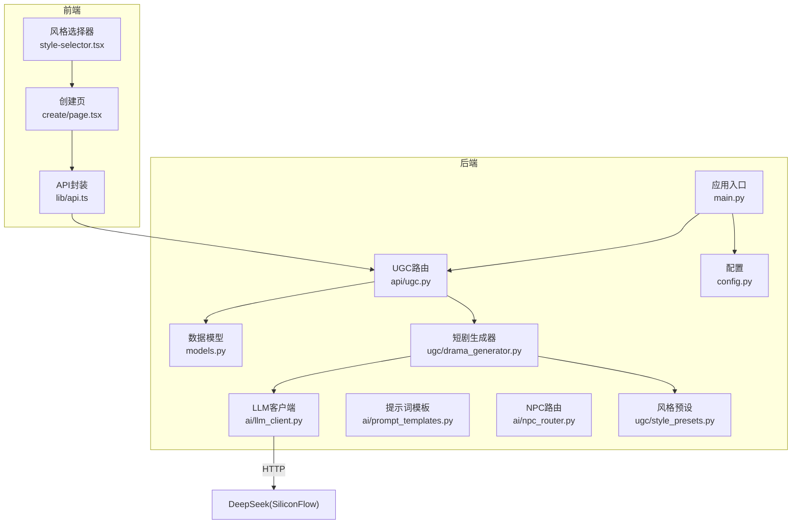
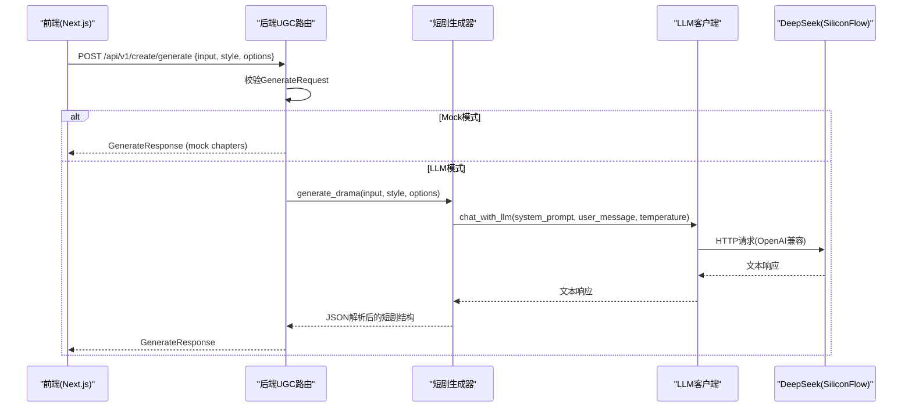
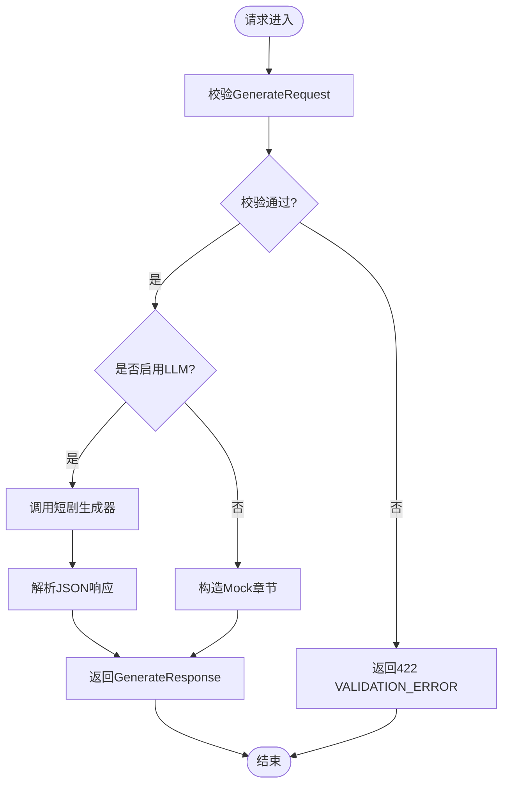
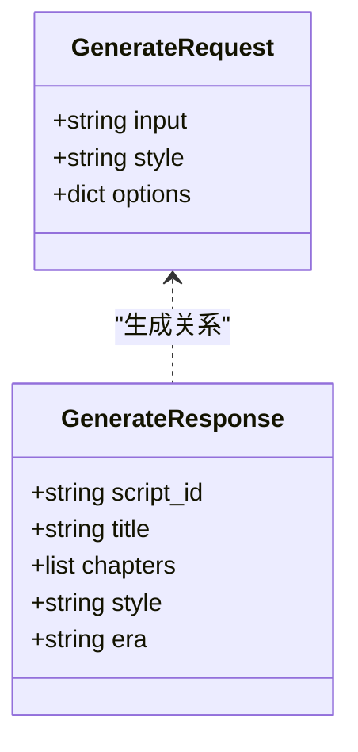
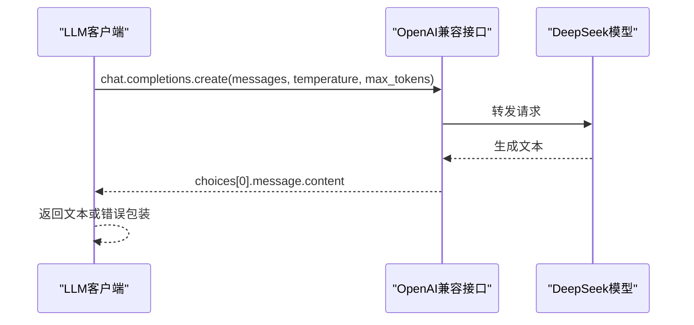
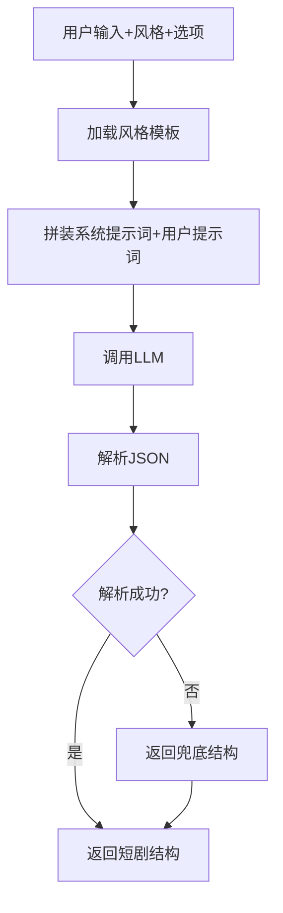
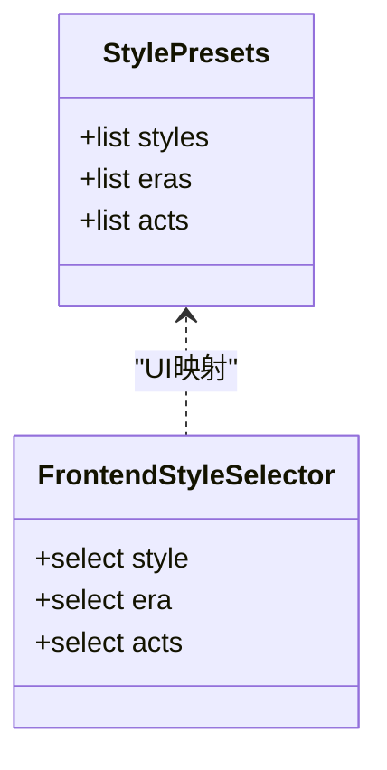
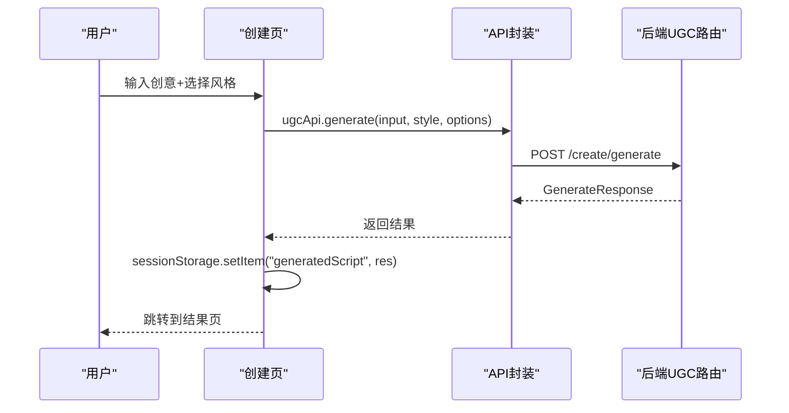
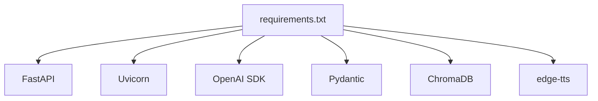

# AI剧本生成器

<cite>
**本文引用的文件**   
- [backend/app/api/ugc.py](file://backend/app/api/ugc.py)
- [backend/app/models.py](file://backend/app/models.py)
- [backend/app/main.py](file://backend/app/main.py)
- [backend/app/ai/llm_client.py](file://backend/app/ai/llm_client.py)
- [backend/app/ai/prompt_templates.py](file://backend/app/ai/prompt_templates.py)
- [backend/app/ai/npc_router.py](file://backend/app/ai/npc_router.py)
- [backend/app/config.py](file://backend/app/config.py)
- [backend/app/ugc/drama_generator.py](file://backend/app/ugc/drama_generator.py)
- [backend/app/ugc/style_presets.py](file://backend/app/ugc/style_presets.py)
- [frontend/src/lib/api.ts](file://frontend/src/lib/api.ts)
- [frontend/src/app/create/page.tsx](file://frontend/src/app/create/page.tsx)
- [frontend/src/components/style-selector.tsx](file://frontend/src/components/style-selector.tsx)
- [backend/requirements.txt](file://backend/requirements.txt)
- [README.md](file://README.md)
</cite>

## 目录
1. [简介](#简介)
2. [项目结构](#项目结构)
3. [核心组件](#核心组件)
4. [架构总览](#架构总览)
5. [详细组件分析](#详细组件分析)
6. [依赖关系分析](#依赖关系分析)
7. [性能考量](#性能考量)
8. [故障排查指南](#故障排查指南)
9. [结论](#结论)
10. [附录](#附录)

## 简介
本技术文档围绕“AI剧本生成器”展开，聚焦短剧生成算法的核心逻辑与工程实现。内容涵盖：
- 创意输入处理、章节结构生成与场景内容构建流程
- 当前Mock实现与未来DeepSeek集成的架构设计
- 生成请求的验证流程、参数处理与响应格式
- 生成策略配置、风格适配机制与质量优化方法
- API接口使用示例、错误处理策略与性能调优指南
- 面向开发者的扩展支持说明

本项目采用前后端分离架构：前端基于Next.js提供用户交互界面，后端基于FastAPI提供REST API，并通过OpenAI兼容接口调用DeepSeek（经SiliconFlow）完成LLM推理。UGC模块当前以Mock为主，预留了接入真实LLM的通道。

## 项目结构
- 后端（FastAPI）
  - API路由：游戏、AI、UGC、管理、认证等
  - AI服务：LLM客户端、NPC提示词模板、TTS服务
  - UGC：一句话短剧生成、风格预设
  - 配置与环境：数据库、CORS、启动引导
- 前端（Next.js）
  - 页面：创建短剧、结果展示、游戏、社区等
  - 组件：风格选择器、对话框、地图等
  - API封装：统一请求封装与类型定义

**图表来源** 
- [backend/app/main.py:17-96](file://backend/app/main.py#L17-L96)
- [backend/app/api/ugc.py:1-35](file://backend/app/api/ugc.py#L1-L35)
- [backend/app/models.py:111-123](file://backend/app/models.py#L111-L123)
- [backend/app/ai/llm_client.py:1-32](file://backend/app/ai/llm_client.py#L1-L32)
- [backend/app/ai/prompt_templates.py:1-37](file://backend/app/ai/prompt_templates.py#L1-L37)
- [backend/app/ai/npc_router.py:1-18](file://backend/app/ai/npc_router.py#L1-L18)
- [backend/app/config.py:1-77](file://backend/app/config.py#L1-L77)
- [backend/app/ugc/drama_generator.py:1-21](file://backend/app/ugc/drama_generator.py#L1-L21)
- [backend/app/ugc/style_presets.py:1-15](file://backend/app/ugc/style_presets.py#L1-L15)
- [frontend/src/lib/api.ts:132-154](file://frontend/src/lib/api.ts#L132-L154)
- [frontend/src/app/create/page.tsx:19-47](file://frontend/src/app/create/page.tsx#L19-L47)
- [frontend/src/components/style-selector.tsx:21-39](file://frontend/src/components/style-selector.tsx#L21-L39)

**章节来源**
- [backend/app/main.py:17-96](file://backend/app/main.py#L17-L96)
- [backend/app/api/ugc.py:1-35](file://backend/app/api/ugc.py#L1-L35)
- [backend/app/models.py:111-123](file://backend/app/models.py#L111-L123)
- [backend/app/ai/llm_client.py:1-32](file://backend/app/ai/llm_client.py#L1-L32)
- [backend/app/ai/prompt_templates.py:1-37](file://backend/app/ai/prompt_templates.py#L1-L37)
- [backend/app/ai/npc_router.py:1-18](file://backend/app/ai/npc_router.py#L1-L18)
- [backend/app/config.py:1-77](file://backend/app/config.py#L1-L77)
- [backend/app/ugc/drama_generator.py:1-21](file://backend/app/ugc/drama_generator.py#L1-L21)
- [backend/app/ugc/style_presets.py:1-15](file://backend/app/ugc/style_presets.py#L1-L15)
- [frontend/src/lib/api.ts:132-154](file://frontend/src/lib/api.ts#L132-L154)
- [frontend/src/app/create/page.tsx:19-47](file://frontend/src/app/create/page.tsx#L19-L47)
- [frontend/src/components/style-selector.tsx:21-39](file://frontend/src/components/style-selector.tsx#L21-L39)

## 核心组件
- UGC路由层：接收并校验生成请求，返回标准化响应
- 数据模型：定义请求与响应的字段、约束与默认值
- LLM客户端：通过OpenAI兼容接口调用DeepSeek（SiliconFlow）
- 短剧生成器：组装提示词、调用LLM、解析JSON输出
- 风格预设：提供风格、时代、幕数等可选配置
- 前端API封装：统一请求、鉴权头注入、错误抛出
- 前端页面：收集用户输入、风格选择、高级选项、跳转结果页

**章节来源**
- [backend/app/api/ugc.py:1-35](file://backend/app/api/ugc.py#L1-L35)
- [backend/app/models.py:111-123](file://backend/app/models.py#L111-L123)
- [backend/app/ai/llm_client.py:1-32](file://backend/app/ai/llm_client.py#L1-L32)
- [backend/app/ugc/drama_generator.py:1-21](file://backend/app/ugc/drama_generator.py#L1-L21)
- [backend/app/ugc/style_presets.py:1-15](file://backend/app/ugc/style_presets.py#L1-L15)
- [frontend/src/lib/api.ts:132-154](file://frontend/src/lib/api.ts#L132-L154)
- [frontend/src/app/create/page.tsx:19-47](file://frontend/src/app/create/page.tsx#L19-L47)

## 架构总览
整体流程：前端收集创意输入与风格参数，调用后端UGC接口；后端当前以Mock快速返回结构化短剧数据，同时预留LLM通道用于后续接入DeepSeek。系统通过统一的异常处理器与CORS中间件保障跨域与错误一致性。

**图表来源** 
- [backend/app/api/ugc.py:8-29](file://backend/app/api/ugc.py#L8-L29)
- [backend/app/models.py:111-123](file://backend/app/models.py#L111-L123)
- [backend/app/ai/llm_client.py:12-25](file://backend/app/ai/llm_client.py#L12-L25)
- [backend/app/ugc/drama_generator.py:5-20](file://backend/app/ugc/drama_generator.py#L5-L20)

## 详细组件分析

### UGC路由与请求处理
- 接口路径：POST /api/v1/create/generate
- 请求体：GenerateRequest（input、style、options）
- 响应体：GenerateResponse（script_id、title、chapters、style、era）
- 当前实现：直接构造Mock章节数据并返回，便于前端联调
- 未来扩展：可切换至LLM模式，由短剧生成器拼装提示词并调用LLM

**图表来源** 
- [backend/app/api/ugc.py:8-29](file://backend/app/api/ugc.py#L8-L29)
- [backend/app/models.py:111-123](file://backend/app/models.py#L111-L123)

**章节来源**
- [backend/app/api/ugc.py:1-35](file://backend/app/api/ugc.py#L1-L35)
- [backend/app/models.py:111-123](file://backend/app/models.py#L111-L123)

### 数据模型与校验
- GenerateRequest：包含创意输入、风格、可选参数（如时代、幕数、自定义提示词）
- GenerateResponse：包含脚本ID、标题、章节列表、风格与时代
- 校验规则：字段长度、正则匹配、必填项等由Pydantic自动校验
- 统一错误处理：非游戏类接口遵循FastAPI默认校验错误格式；游戏类接口有自定义错误结构

**图表来源** 
- [backend/app/models.py:111-123](file://backend/app/models.py#L111-L123)

**章节来源**
- [backend/app/models.py:111-123](file://backend/app/models.py#L111-L123)
- [backend/app/main.py:51-74](file://backend/app/main.py#L51-L74)

### LLM客户端与DeepSeek集成
- 客户端：基于AsyncOpenAI，通过环境变量配置API Key与Base URL
- 模型：默认deepseek-ai/DeepSeek-V3，可通过环境变量覆盖
- 调用方式：异步chat.completions.create，支持temperature与max_tokens
- 错误处理：捕获异常并返回友好错误信息

**图表来源** 
- [backend/app/ai/llm_client.py:1-32](file://backend/app/ai/llm_client.py#L1-L32)

**章节来源**
- [backend/app/ai/llm_client.py:1-32](file://backend/app/ai/llm_client.py#L1-L32)

### 短剧生成器与提示词工程
- 生成器职责：根据风格与选项拼装提示词，调用LLM，解析JSON为短剧结构
- 提示词模板：系统提示强调专业互动剧作家角色，要求返回JSON格式
- 风格适配：从风格预设获取温度等参数，结合时代与幕数定制提示词
- 容错处理：JSON解析失败时返回兜底结构，保证前端可用性

**图表来源** 
- [backend/app/ugc/drama_generator.py:5-20](file://backend/app/ugc/drama_generator.py#L5-L20)
- [backend/app/ai/prompt_templates.py:1-37](file://backend/app/ai/prompt_templates.py#L1-L37)

**章节来源**
- [backend/app/ugc/drama_generator.py:1-21](file://backend/app/ugc/drama_generator.py#L1-L21)
- [backend/app/ai/prompt_templates.py:1-37](file://backend/app/ai/prompt_templates.py#L1-L37)

### 风格预设与配置
- 风格预设：悬疑推理、爱情故事、喜剧冒险、悲剧史诗
- 时代预设：清代、民国、现代、架空
- 幕数选项：3幕、5幕、7幕
- 配置来源：前端组件与后端预设保持一致，确保参数语义一致

**图表来源** 
- [backend/app/ugc/style_presets.py:1-15](file://backend/app/ugc/style_presets.py#L1-L15)
- [frontend/src/components/style-selector.tsx:21-39](file://frontend/src/components/style-selector.tsx#L21-L39)

**章节来源**
- [backend/app/ugc/style_presets.py:1-15](file://backend/app/ugc/style_presets.py#L1-L15)
- [frontend/src/components/style-selector.tsx:21-39](file://frontend/src/components/style-selector.tsx#L21-L39)

### 前端交互与API调用
- 创建页：收集创意输入、风格、时代、幕数、自定义提示词
- API封装：统一请求头注入Authorization，错误抛出
- 结果存储：将生成结果存入sessionStorage，跳转结果页展示

**图表来源** 
- [frontend/src/app/create/page.tsx:30-47](file://frontend/src/app/create/page.tsx#L30-L47)
- [frontend/src/lib/api.ts:132-154](file://frontend/src/lib/api.ts#L132-L154)

**章节来源**
- [frontend/src/app/create/page.tsx:19-47](file://frontend/src/app/create/page.tsx#L19-L47)
- [frontend/src/lib/api.ts:132-154](file://frontend/src/lib/api.ts#L132-L154)

## 依赖关系分析
- 后端依赖：FastAPI、Uvicorn、OpenAI SDK、ChromaDB、edge-tts、Pydantic等
- 前端依赖：Next.js、Tailwind CSS、shadcn/ui、Leaflet.js
- 运行时配置：数据库URL、CORS源、演示数据开关、认证令牌有效期等

**图表来源** 
- [backend/requirements.txt:1-17](file://backend/requirements.txt#L1-L17)

**章节来源**
- [backend/requirements.txt:1-17](file://backend/requirements.txt#L1-L17)
- [backend/app/config.py:1-77](file://backend/app/config.py#L1-L77)

## 性能考量
- 异步I/O：后端使用异步FastAPI与AsyncOpenAI，提升并发处理能力
- 缓存策略：配置层使用lru_cache缓存Settings，减少重复初始化开销
- 超时与限流：建议在生产环境为LLM调用设置超时与重试策略
- 资源限制：合理设置max_tokens与temperature，控制输出长度与创造性
- 前端优化：结果缓存于sessionStorage，避免重复请求

[本节为通用指导，不直接分析具体文件]

## 故障排查指南
- 请求校验失败：检查GenerateRequest字段是否符合约束，查看VALIDATION_ERROR详情
- LLM调用失败：确认SILICONFLOW_API_KEY与BASE_URL配置正确，检查网络连通性
- JSON解析异常：生成器已提供兜底结构，但仍需检查LLM输出是否符合预期格式
- CORS问题：确认CORS_ORIGINS包含前端域名，允许方法与头部正确配置

**章节来源**
- [backend/app/main.py:51-74](file://backend/app/main.py#L51-L74)
- [backend/app/ai/llm_client.py:23-25](file://backend/app/ai/llm_client.py#L23-L25)
- [backend/app/ugc/drama_generator.py:17-20](file://backend/app/ugc/drama_generator.py#L17-L20)
- [backend/app/config.py:19-23](file://backend/app/config.py#L19-L23)

## 结论
本AI剧本生成器以UGC为核心，当前采用Mock实现快速交付，同时预留DeepSeek集成通道。通过清晰的模块划分、统一的模型校验与错误处理，以及前后端一致的参数约定，实现了可扩展、易维护的短剧生成能力。未来可在保持现有接口稳定的前提下，平滑切换至LLM模式，提升内容质量与多样性。

[本节为总结性内容，不直接分析具体文件]

## 附录
- API使用示例
  - 前端调用：参考前端API封装与创建页逻辑
  - 后端接口：POST /api/v1/create/generate，请求体包含input、style、options
  - 响应格式：GenerateResponse，包含script_id、title、chapters、style、era
- 扩展开发建议
  - 新增风格：在风格预设中添加新条目，并在前端组件中同步
  - 提示词优化：在提示词模板中调整系统提示与约束条件
  - LLM接入：在短剧生成器中替换Mock逻辑，调用LLM客户端并解析响应
  - 错误处理：完善异常捕获与降级策略，确保服务稳定性

**章节来源**
- [frontend/src/lib/api.ts:132-154](file://frontend/src/lib/api.ts#L132-L154)
- [backend/app/api/ugc.py:8-29](file://backend/app/api/ugc.py#L8-L29)
- [backend/app/ugc/style_presets.py:1-15](file://backend/app/ugc/style_presets.py#L1-L15)
- [backend/app/ai/prompt_templates.py:1-37](file://backend/app/ai/prompt_templates.py#L1-L37)
- [backend/app/ugc/drama_generator.py:5-20](file://backend/app/ugc/drama_generator.py#L5-L20)