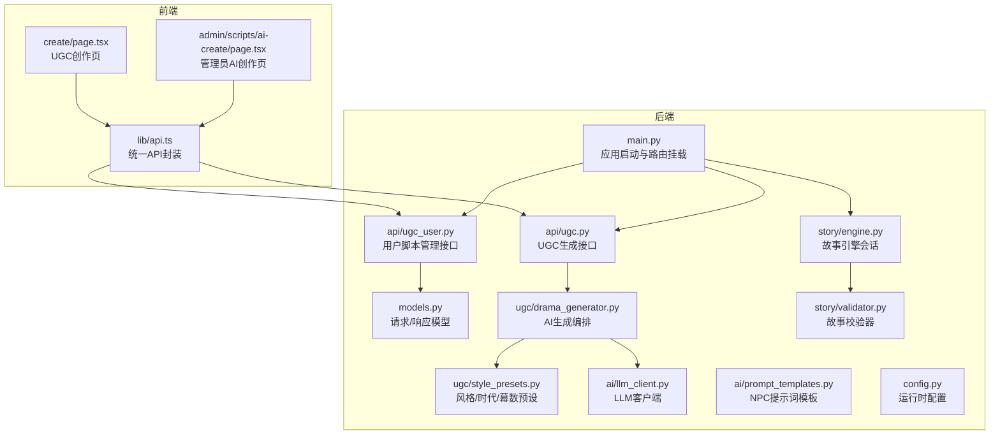
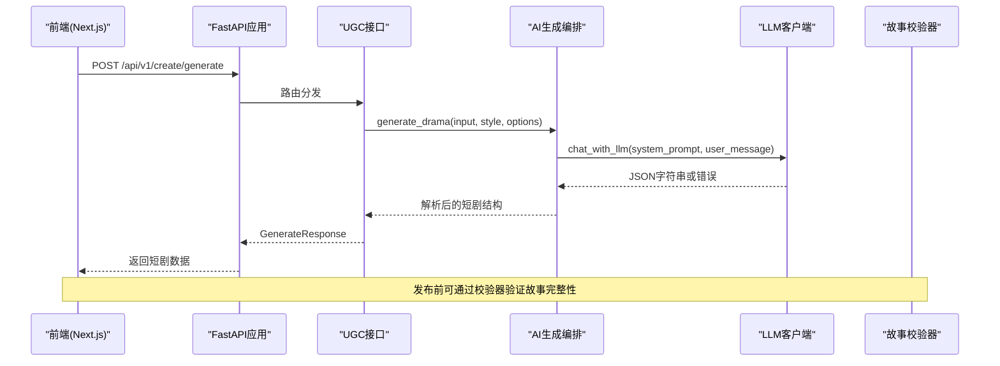
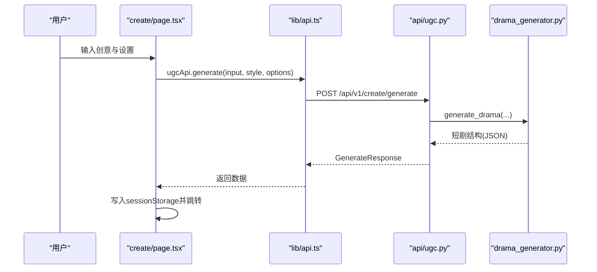
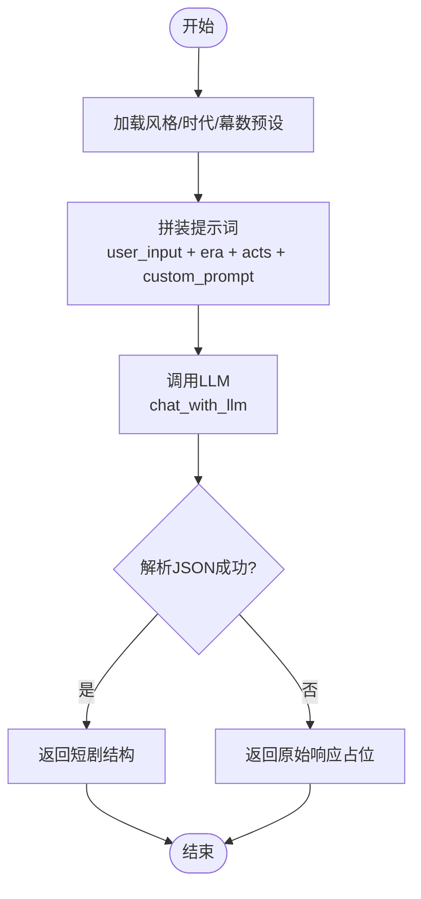
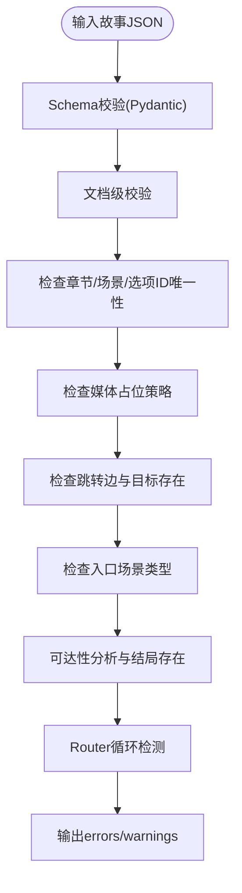
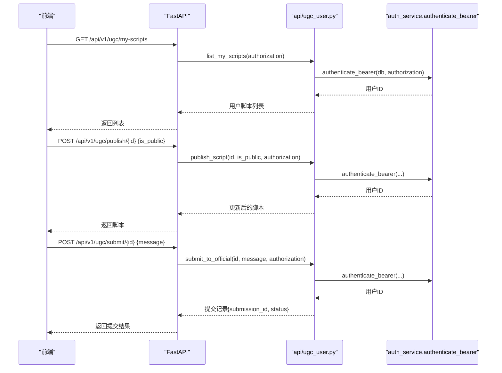
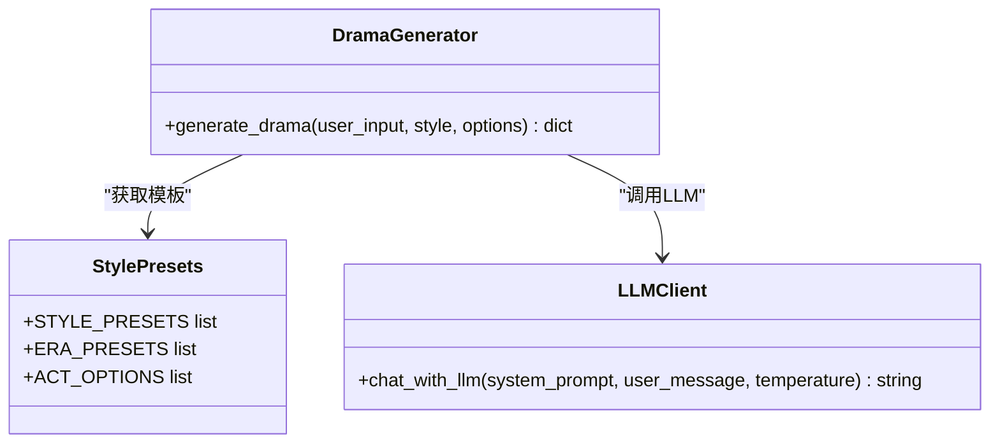
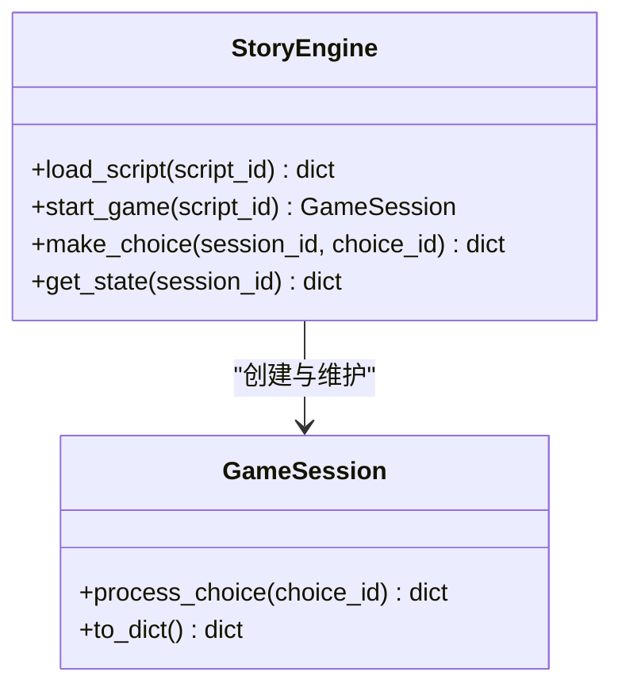
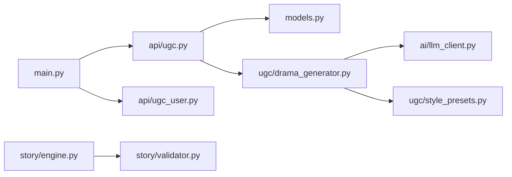

# UGC创作系统

<cite>
**本文引用的文件**   
- [backend/app/main.py](file://backend/app/main.py)
- [backend/app/api/ugc.py](file://backend/app/api/ugc.py)
- [backend/app/api/ugc_user.py](file://backend/app/api/ugc_user.py)
- [backend/app/models.py](file://backend/app/models.py)
- [backend/app/ugc/drama_generator.py](file://backend/app/ugc/drama_generator.py)
- [backend/app/ugc/style_presets.py](file://backend/app/ugc/style_presets.py)
- [backend/app/ai/llm_client.py](file://backend/app/ai/llm_client.py)
- [backend/app/ai/prompt_templates.py](file://backend/app/ai/prompt_templates.py)
- [backend/app/story/engine.py](file://backend/app/story/engine.py)
- [backend/app/story/validator.py](file://backend/app/story/validator.py)
- [backend/app/config.py](file://backend/app/config.py)
- [frontend/src/lib/api.ts](file://frontend/src/lib/api.ts)
- [frontend/src/app/create/page.tsx](file://frontend/src/app/create/page.tsx)
- [frontend/src/app/admin/scripts/ai-create/page.tsx](file://frontend/src/app/admin/scripts/ai-create/page.tsx)
</cite>

## 目录
1. [简介](#简介)
2. [项目结构](#项目结构)
3. [核心组件](#核心组件)
4. [架构总览](#架构总览)
5. [详细组件分析](#详细组件分析)
6. [依赖关系分析](#依赖关系分析)
7. [性能考量](#性能考量)
8. [故障排查指南](#故障排查指南)
9. [结论](#结论)
10. [附录](#附录)

## 简介
本技术文档面向“澳秘 Macau Mystery UGC创作系统”，聚焦以下能力：
- AI辅助剧本生成：基于用户一句话创意，结合风格预设与时代设定，调用大模型生成结构化短剧内容。
- 风格预设系统：提供悬疑、爱情、喜剧、悲剧等风格，以及清代、民国、现代、架空等时代选项，支持幕数与自定义提示词。
- 内容校验机制：对故事JSON进行结构与语义校验，确保场景可达、结局存在、路由无环、线索引用正确等。
- 短剧生成算法与优化：从创意输入到模板拼装、LLM调用、结果解析与容错处理的全链路流程。
- 用户内容管理CRUD与发布流程：用户的脚本列表、公开/私有状态切换、提交官方审核、公共列表展示。
- 版本管理与统计分享：通过统一数据模型承载脚本元信息、播放量、创建时间等；为后续扩展预留接口。
- UGC工作流与API使用：前端页面到后端路由的完整调用链，便于二次开发与集成。

## 项目结构
后端采用FastAPI模块化组织，按功能划分api、ai、ugc、story、knowledge等子模块；前端基于Next.js，提供创作页、结果页、社区与管理端入口。

图表来源 
- [backend/app/main.py:17-96](file://backend/app/main.py#L17-L96)
- [backend/app/api/ugc.py:1-35](file://backend/app/api/ugc.py#L1-L35)
- [backend/app/api/ugc_user.py:1-96](file://backend/app/api/ugc_user.py#L1-L96)
- [backend/app/models.py:111-146](file://backend/app/models.py#L111-L146)
- [backend/app/ugc/drama_generator.py:1-21](file://backend/app/ugc/drama_generator.py#L1-L21)
- [backend/app/ugc/style_presets.py:1-15](file://backend/app/ugc/style_presets.py#L1-L15)
- [backend/app/ai/llm_client.py:1-32](file://backend/app/ai/llm_client.py#L1-L32)
- [backend/app/ai/prompt_templates.py:1-37](file://backend/app/ai/prompt_templates.py#L1-L37)
- [backend/app/story/engine.py:1-37](file://backend/app/story/engine.py#L1-L37)
- [backend/app/story/validator.py:1-251](file://backend/app/story/validator.py#L1-L251)
- [backend/app/config.py:1-77](file://backend/app/config.py#L1-L77)
- [frontend/src/lib/api.ts:132-154](file://frontend/src/lib/api.ts#L132-L154)
- [frontend/src/app/create/page.tsx:1-136](file://frontend/src/app/create/page.tsx#L1-L136)
- [frontend/src/app/admin/scripts/ai-create/page.tsx:1-137](file://frontend/src/app/admin/scripts/ai-create/page.tsx#L1-L137)

章节来源
- [backend/app/main.py:17-96](file://backend/app/main.py#L17-L96)
- [backend/app/config.py:1-77](file://backend/app/config.py#L1-L77)

## 核心组件
- 应用入口与异常处理：统一注册业务异常与请求校验异常，返回标准化错误体；CORS跨域配置；健康检查端点。
- UGC生成接口：接收一句话创意与风格/时代/幕数等参数，返回结构化短剧（当前为Mock实现，预留接入DeepSeek）。
- 用户脚本管理：列出我的脚本、公开/私有发布、提交官方审核、公共脚本列表。
- AI生成编排：根据风格选择对应模板，组装提示词并调用LLM，解析JSON结果并容错。
- 故事引擎与校验：加载脚本、维护会话、推进剧情；对故事JSON进行结构与语义校验，保证可玩性与完整性。
- 配置中心：数据库、CORS、演示数据开关、认证Token有效期等。

章节来源
- [backend/app/main.py:17-106](file://backend/app/main.py#L17-L106)
- [backend/app/api/ugc.py:1-35](file://backend/app/api/ugc.py#L1-L35)
- [backend/app/api/ugc_user.py:1-96](file://backend/app/api/ugc_user.py#L1-L96)
- [backend/app/ugc/drama_generator.py:1-21](file://backend/app/ugc/drama_generator.py#L1-L21)
- [backend/app/story/engine.py:1-37](file://backend/app/story/engine.py#L1-L37)
- [backend/app/story/validator.py:1-251](file://backend/app/story/validator.py#L1-L251)
- [backend/app/config.py:1-77](file://backend/app/config.py#L1-L77)

## 架构总览
整体采用前后端分离架构：前端通过统一的API封装调用后端REST接口；后端以FastAPI为核心，聚合UGC、AI、故事引擎与校验模块；LLM通过OpenAI兼容客户端访问。

图表来源 
- [backend/app/main.py:84-96](file://backend/app/main.py#L84-L96)
- [backend/app/api/ugc.py:8-29](file://backend/app/api/ugc.py#L8-L29)
- [backend/app/ugc/drama_generator.py:5-21](file://backend/app/ugc/drama_generator.py#L5-L21)
- [backend/app/ai/llm_client.py:12-25](file://backend/app/ai/llm_client.py#L12-L25)
- [backend/app/story/validator.py:40-51](file://backend/app/story/validator.py#L40-L51)

## 详细组件分析

### UGC生成接口与前端交互
- 接口定义：POST /api/v1/create/generate，入参包含input、style、options（era、acts、custom_prompt），返回script_id、title、chapters、style、era。
- Mock实现：当前返回三段式章节，每章含场景、旁白、对话与选择项；后续将替换为真实LLM输出。
- 前端调用：create/page.tsx收集创意、风格、时代、幕数与自定义提示词，调用ugcApi.generate并将结果存入sessionStorage后跳转结果页。

图表来源 
- [frontend/src/app/create/page.tsx:30-47](file://frontend/src/app/create/page.tsx#L30-L47)
- [frontend/src/lib/api.ts:132-154](file://frontend/src/lib/api.ts#L132-L154)
- [backend/app/api/ugc.py:8-29](file://backend/app/api/ugc.py#L8-L29)
- [backend/app/ugc/drama_generator.py:5-21](file://backend/app/ugc/drama_generator.py#L5-L21)

章节来源
- [backend/app/api/ugc.py:1-35](file://backend/app/api/ugc.py#L1-L35)
- [frontend/src/app/create/page.tsx:1-136](file://frontend/src/app/create/page.tsx#L1-L136)
- [frontend/src/lib/api.ts:132-154](file://frontend/src/lib/api.ts#L132-L154)

### 风格预设系统与创意输入处理
- 风格预设：suspense、romance、comedy、tragedy；时代预设：qing、ming、modern、fantasy；幕数选项：3/5/7。
- 创意输入处理：drama_generator.py根据style获取模板，拼接user_input、era、acts，支持custom_prompt追加额外要求；temperature由模板决定。
- 前端样式选择：StyleSelector组件配合create/page.tsx传递style、era、acts与custom_prompt。

图表来源 
- [backend/app/ugc/style_presets.py:1-15](file://backend/app/ugc/style_presets.py#L1-L15)
- [backend/app/ugc/drama_generator.py:5-21](file://backend/app/ugc/drama_generator.py#L5-L21)
- [backend/app/ai/llm_client.py:12-25](file://backend/app/ai/llm_client.py#L12-L25)

章节来源
- [backend/app/ugc/style_presets.py:1-15](file://backend/app/ugc/style_presets.py#L1-L15)
- [backend/app/ugc/drama_generator.py:1-21](file://backend/app/ugc/drama_generator.py#L1-L21)

### 内容校验机制（故事JSON）
- 校验目标：结构合法性、ID唯一性、媒体占位策略、跳转目标存在性、入口场景类型、可达性与结局存在、路由优先级与默认规则、循环检测。
- 校验流程：先Pydantic模型校验，再深度语义校验，输出errors与warnings；允许placeholder媒体用于开发环境。
- 使用场景：发布前校验、导入时校验、编辑器实时校验。

图表来源 
- [backend/app/story/validator.py:40-51](file://backend/app/story/validator.py#L40-L51)
- [backend/app/story/validator.py:54-190](file://backend/app/story/validator.py#L54-L190)
- [backend/app/story/validator.py:193-251](file://backend/app/story/validator.py#L193-L251)

章节来源
- [backend/app/story/validator.py:1-251](file://backend/app/story/validator.py#L1-L251)

### 用户内容管理CRUD、发布与审核
- 我的脚本：GET /api/v1/ugc/my-scripts，基于Authorization头鉴权，返回当前用户脚本列表。
- 发布：POST /api/v1/ugc/publish/{script_id}，支持public/private状态切换。
- 提交官方：POST /api/v1/ugc/submit/{script_id}，仅公开脚本可提交，生成submission记录，状态pending。
- 公共列表：GET /api/v1/ugc/public，返回所有公开脚本的基本信息（标题、描述、风格、作者、浏览量、创建时间）。

图表来源 
- [backend/app/api/ugc_user.py:37-77](file://backend/app/api/ugc_user.py#L37-L77)
- [backend/app/api/ugc_user.py:79-94](file://backend/app/api/ugc_user.py#L79-L94)

章节来源
- [backend/app/api/ugc_user.py:1-96](file://backend/app/api/ugc_user.py#L1-L96)

### 短剧生成算法与结果优化策略
- 算法流程：模板选择→提示词拼装→LLM调用→JSON解析→容错回退。
- 优化策略：
  - 温度控制：不同风格模板设置不同temperature，平衡创意与稳定性。
  - 自定义提示词：支持追加额外约束，提升生成质量。
  - 容错处理：解析失败返回raw_response占位，避免崩溃。
  - 可扩展性：预留DeepSeek接入点，当前Mock快速迭代。

图表来源 
- [backend/app/ugc/drama_generator.py:1-21](file://backend/app/ugc/drama_generator.py#L1-L21)
- [backend/app/ugc/style_presets.py:1-15](file://backend/app/ugc/style_presets.py#L1-L15)
- [backend/app/ai/llm_client.py:12-25](file://backend/app/ai/llm_client.py#L12-L25)

章节来源
- [backend/app/ugc/drama_generator.py:1-21](file://backend/app/ugc/drama_generator.py#L1-L21)
- [backend/app/ai/llm_client.py:1-32](file://backend/app/ai/llm_client.py#L1-L32)

### 故事引擎与运行态
- 引擎职责：加载脚本、创建会话、推进选择、获取状态。
- 数据结构：GameSession维护当前场景、线索、进度、结局等；to_dict序列化快照。
- 使用场景：游戏运行时驱动剧情流转，与UGC生成的短剧结构对接。

图表来源 
- [backend/app/story/engine.py:9-37](file://backend/app/story/engine.py#L9-L37)

章节来源
- [backend/app/story/engine.py:1-37](file://backend/app/story/engine.py#L1-L37)

### 管理员AI创作页
- 模式：快速生成与精修思路两种模式，分别对应高随机性与低随机性。
- 调用：adminApi.aiGenerateScript(input, mode)，完成后跳转管理页。

章节来源
- [frontend/src/app/admin/scripts/ai-create/page.tsx:1-137](file://frontend/src/app/admin/scripts/ai-create/page.tsx#L1-L137)
- [frontend/src/lib/api.ts:181-185](file://frontend/src/lib/api.ts#L181-L185)

## 依赖关系分析
- 模块耦合：
  - main.py聚合各路由，低耦合高内聚。
  - ugc.py依赖models.py与ugc/drama_generator.py。
  - drama_generator.py依赖ai/llm_client.py与ugc/style_presets.py。
  - story/engine.py依赖story/state与story/contract（通过validator间接关联）。
- 外部依赖：
  - OpenAI兼容客户端访问SiliconFlow DeepSeek模型。
  - FastAPI中间件CORS、异常处理器。
  - Pydantic用于数据校验与序列化。

图表来源 
- [backend/app/main.py:84-96](file://backend/app/main.py#L84-L96)
- [backend/app/api/ugc.py:1-35](file://backend/app/api/ugc.py#L1-L35)
- [backend/app/ugc/drama_generator.py:1-21](file://backend/app/ugc/drama_generator.py#L1-L21)
- [backend/app/ai/llm_client.py:1-32](file://backend/app/ai/llm_client.py#L1-L32)
- [backend/app/ugc/style_presets.py:1-15](file://backend/app/ugc/style_presets.py#L1-L15)
- [backend/app/story/engine.py:1-37](file://backend/app/story/engine.py#L1-L37)
- [backend/app/story/validator.py:1-251](file://backend/app/story/validator.py#L1-L251)

章节来源
- [backend/app/main.py:84-96](file://backend/app/main.py#L84-L96)
- [backend/app/api/ugc.py:1-35](file://backend/app/api/ugc.py#L1-L35)
- [backend/app/ugc/drama_generator.py:1-21](file://backend/app/ugc/drama_generator.py#L1-L21)

## 性能考量
- LLM调用：建议增加重试与超时控制，缓存热门模板与常用提示词组合。
- 校验开销：大规模故事校验可采用增量校验与并行化；对placeholder媒体在开发环境放宽限制。
- 并发与会话：StoryEngine内存存储会话，生产环境需引入分布式会话存储（如Redis）。
- 前端体验：生成过程显示加载状态，错误提示友好；结果页预加载下一场景媒体。

## 故障排查指南
- 常见错误：
  - 请求校验失败：查看VALIDATION_ERROR详情，确认字段类型与格式。
  - LLM调用失败：检查环境变量SILICONFLOW_API_KEY与BASE_URL；关注返回的错误占位。
  - 故事校验失败：根据errors定位具体路径，修复ID重复、跳转目标缺失、入口非video、无结局等问题。
  - 鉴权失败：确认Authorization头Bearer token有效。
- 调试建议：
  - 启用详细日志，记录提示词与LLM响应。
  - 使用健康检查端点验证服务状态。
  - 本地运行alembic迁移确保数据库可用。

章节来源
- [backend/app/main.py:38-74](file://backend/app/main.py#L38-L74)
- [backend/app/ai/llm_client.py:12-25](file://backend/app/ai/llm_client.py#L12-L25)
- [backend/app/story/validator.py:40-51](file://backend/app/story/validator.py#L40-L51)

## 结论
本系统提供了完整的UGC创作闭环：从创意输入、风格预设、AI生成、内容校验到发布审核与分享。通过模块化设计与清晰的API契约，便于扩展与二次开发。未来可深化LLM接入、增强校验规则、完善统计与分享机制，进一步提升创作效率与用户体验。

## 附录
- API使用示例：
  - 生成短剧：POST /api/v1/create/generate，body包含input、style、options。
  - 我的脚本：GET /api/v1/ugc/my-scripts，Header Authorization: Bearer <token>。
  - 发布脚本：POST /api/v1/ugc/publish/{script_id}，body {is_public: boolean}。
  - 提交官方：POST /api/v1/ugc/submit/{script_id}，body {message: string}。
  - 公共列表：GET /api/v1/ugc/public。
- 扩展开发指南：
  - 新增风格：在style_presets.py添加新条目，并在drama_generator.py中适配模板。
  - 接入真实LLM：替换ugc.py中的Mock逻辑，调用drama_generator.generate_drama。
  - 增强校验：在validator.py中添加新的语义规则与错误码。
  - 前端集成：在api.ts中补充新接口封装，并在页面组件中调用。