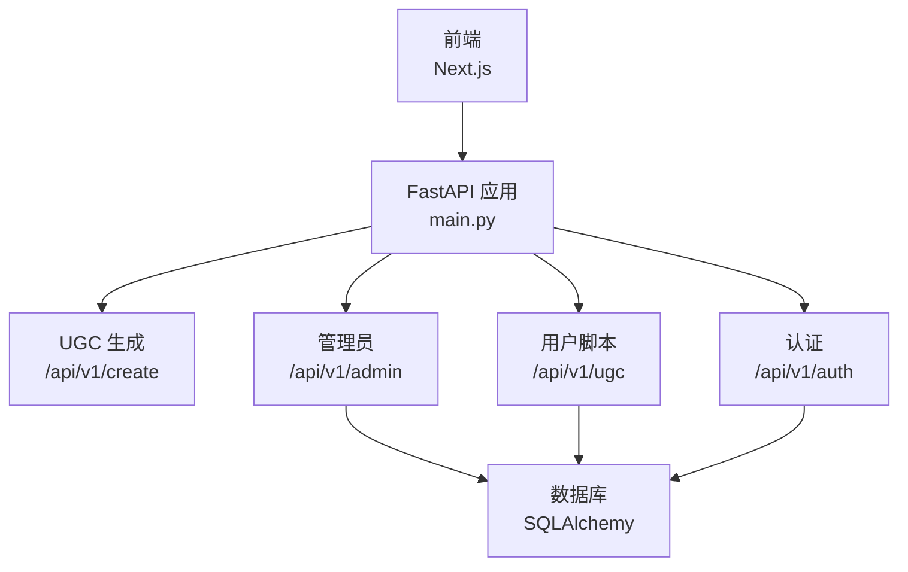
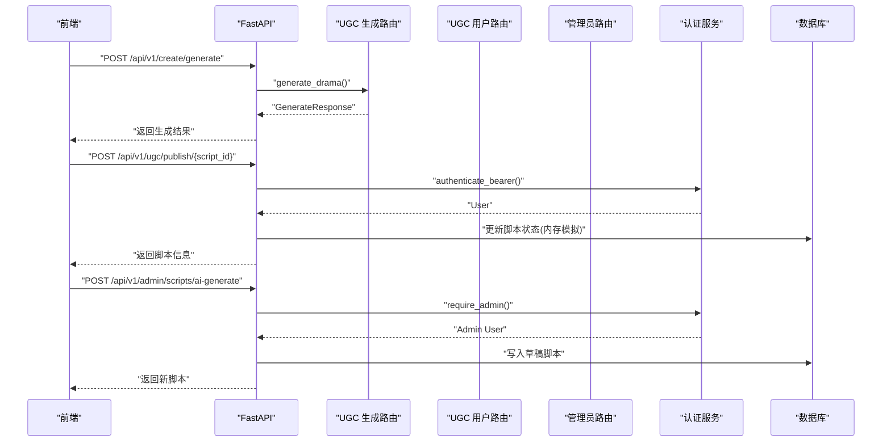
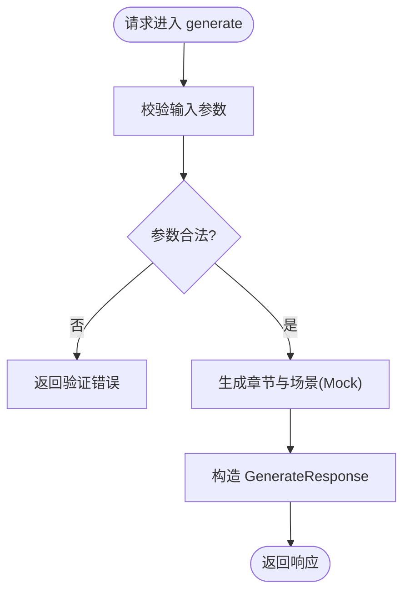
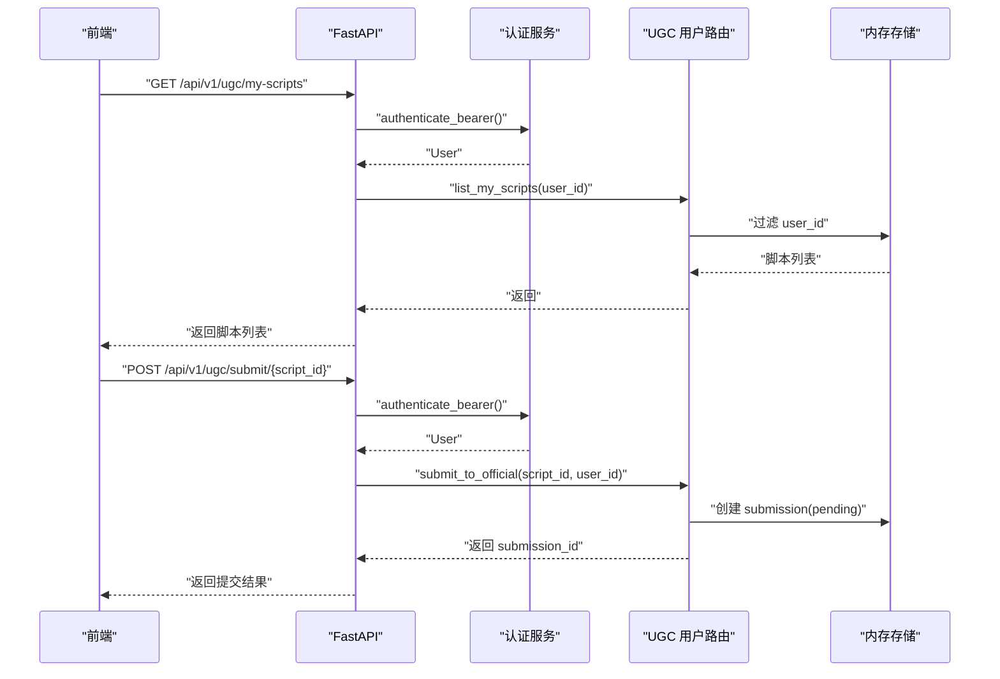
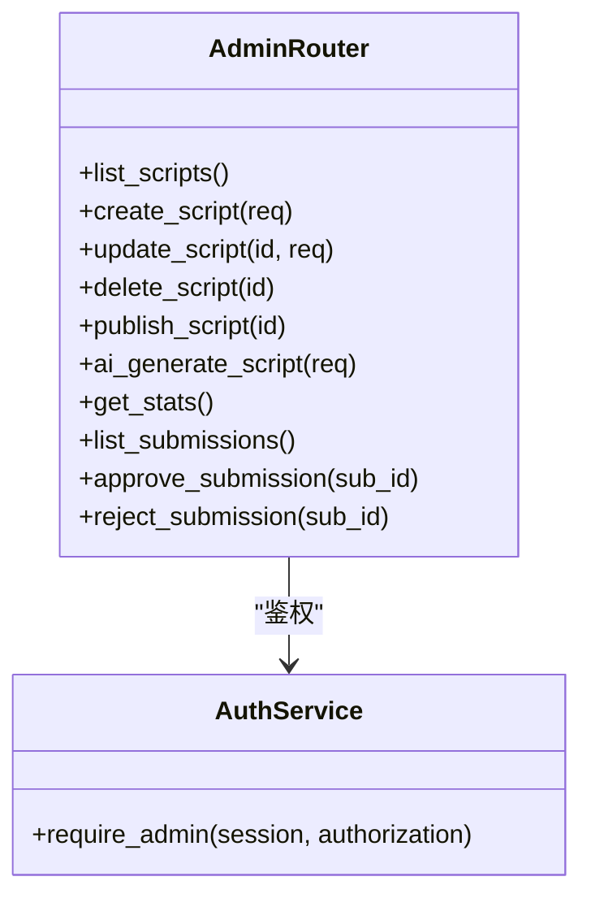
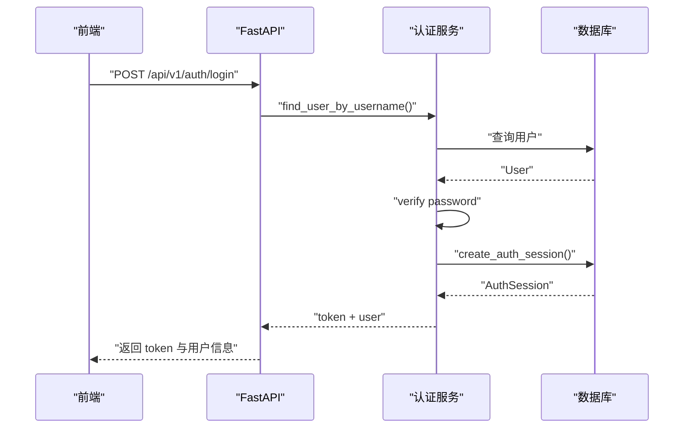
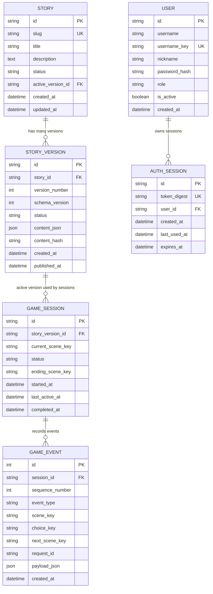
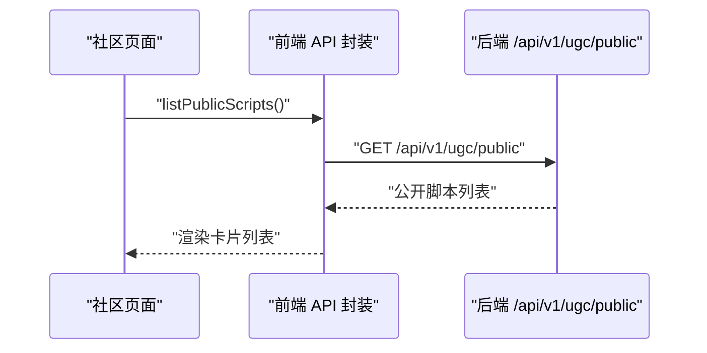
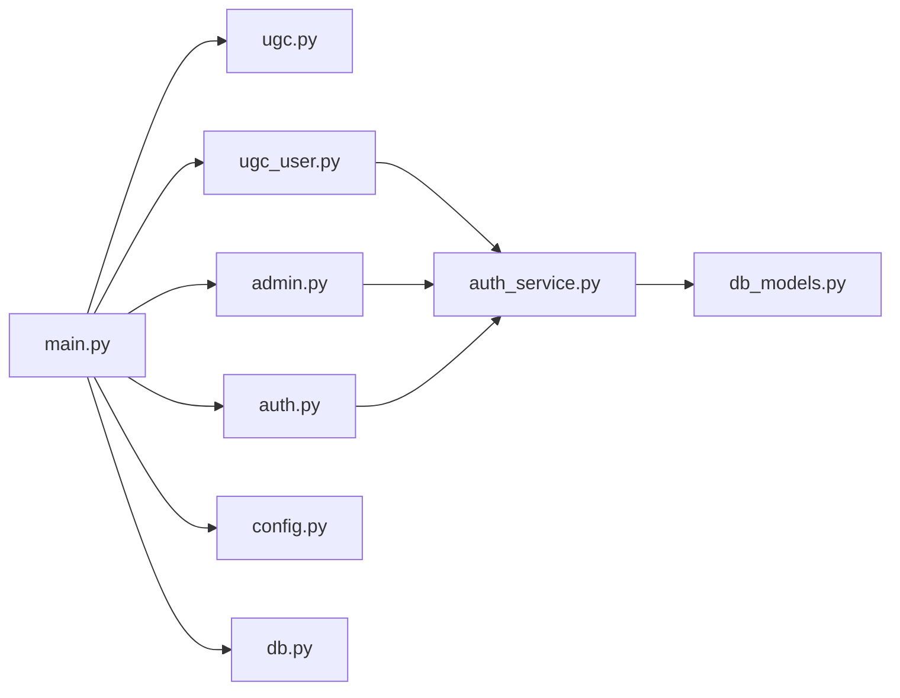

# 内容管理模块

<cite>
**本文引用的文件**   
- [backend/app/main.py](file://backend/app/main.py)
- [backend/app/api/ugc.py](file://backend/app/api/ugc.py)
- [backend/app/api/ugc_user.py](file://backend/app/api/ugc_user.py)
- [backend/app/api/admin.py](file://backend/app/api/admin.py)
- [backend/app/models.py](file://backend/app/models.py)
- [backend/app/db_models.py](file://backend/app/db_models.py)
- [backend/app/auth_service.py](file://backend/app/auth_service.py)
- [backend/app/db.py](file://backend/app/db.py)
- [backend/app/config.py](file://backend/app/config.py)
- [frontend/src/lib/api.ts](file://frontend/src/lib/api.ts)
- [frontend/src/app/community/page.tsx](file://frontend/src/app/community/page.tsx)
- [frontend/src/app/create/result/page.tsx](file://frontend/src/app/create/result/page.tsx)
</cite>

## 目录
1. [简介](#简介)
2. [项目结构](#项目结构)
3. [核心组件](#核心组件)
4. [架构总览](#架构总览)
5. [详细组件分析](#详细组件分析)
6. [依赖关系分析](#依赖关系分析)
7. [性能考虑](#性能考虑)
8. [故障排查指南](#故障排查指南)
9. [结论](#结论)
10. [附录](#附录)

## 简介
本技术文档围绕 UGC 内容管理模块，系统性阐述用户内容的创建、编辑、删除与版本控制，覆盖内容校验规则、安全过滤机制、版权保护策略、发布流程、审核状态管理与权限控制。同时补充搜索、分类标签、推荐算法的扩展设计，以及内容迁移工具、批量操作接口与统计分析报告的实现建议，为内容创作者提供完整的生命周期管理与协作支持。

## 项目结构
后端采用 FastAPI 模块化路由组织，UGC 相关能力分布在以下模块：
- 生成与再生成接口：/api/v1/create（ugc.py）
- 用户脚本管理（发布、提交官方审核、公开列表）：/api/v1/ugc（ugc_user.py）
- 管理员脚本 CRUD、AI 生成、审核处理与统计：/api/v1/admin（admin.py）
- 认证与鉴权：/api/v1/auth（auth.py），鉴权服务（auth_service.py）
- 数据模型与持久化：db_models.py（故事、版本、会话等）
- 应用入口与路由注册：main.py
- 配置与数据库连接：config.py、db.py
- 前端 API 调用封装与页面：frontend/src/lib/api.ts、community 与 create/result 页面

**图表来源** 
- [backend/app/main.py](file://backend/app/main.py)
- [backend/app/api/ugc.py](file://backend/app/api/ugc.py)
- [backend/app/api/ugc_user.py](file://backend/app/api/ugc_user.py)
- [backend/app/api/admin.py](file://backend/app/api/admin.py)
- [backend/app/api/auth.py](file://backend/app/api/auth.py)
- [backend/app/db_models.py](file://backend/app/db_models.py)
- [backend/app/db.py](file://backend/app/db.py)

**章节来源**
- [backend/app/main.py:1-111](file://backend/app/main.py#L1-L111)
- [backend/app/api/ugc.py:1-35](file://backend/app/api/ugc.py#L1-L35)
- [backend/app/api/ugc_user.py:1-96](file://backend/app/api/ugc_user.py#L1-L96)
- [backend/app/api/admin.py:1-218](file://backend/app/api/admin.py#L1-L218)
- [backend/app/api/auth.py:1-97](file://backend/app/api/auth.py#L1-L97)
- [backend/app/db_models.py:1-160](file://backend/app/db_models.py#L1-L160)
- [backend/app/db.py:1-42](file://backend/app/db.py#L1-L42)

## 核心组件
- UGC 生成与再生成接口：提供“一句话生成短剧”和“重新生成”能力，当前为 Mock 实现，后续可接入 LLM。
- 用户脚本管理：支持列出我的脚本、发布/私有化、提交官方审核、公开脚本列表。
- 管理员脚本管理：支持脚本 CRUD、发布切换、AI 生成草稿、审核通过/拒绝、统计数据。
- 认证与鉴权：基于 Bearer Token 的用户认证与角色校验（user/admin）。
- 数据模型：故事与版本、游戏会话与事件、用户与认证会话等 ORM 模型。

**章节来源**
- [backend/app/api/ugc.py:1-35](file://backend/app/api/ugc.py#L1-L35)
- [backend/app/api/ugc_user.py:1-96](file://backend/app/api/ugc_user.py#L1-L96)
- [backend/app/api/admin.py:1-218](file://backend/app/api/admin.py#L1-L218)
- [backend/app/auth_service.py:1-153](file://backend/app/auth_service.py#L1-L153)
- [backend/app/db_models.py:1-160](file://backend/app/db_models.py#L1-L160)

## 架构总览
系统以 FastAPI 为中心，按功能域划分路由模块；认证服务统一鉴权；ORM 模型定义持久化结构；前端通过 API 封装调用各端点。

**图表来源** 
- [backend/app/main.py:84-96](file://backend/app/main.py#L84-L96)
- [backend/app/api/ugc.py:8-29](file://backend/app/api/ugc.py#L8-L29)
- [backend/app/api/ugc_user.py:43-53](file://backend/app/api/ugc_user.py#L43-L53)
- [backend/app/api/admin.py:125-168](file://backend/app/api/admin.py#L125-L168)
- [backend/app/auth_service.py:100-124](file://backend/app/auth_service.py#L100-L124)

## 详细组件分析

### UGC 生成与再生成（/api/v1/create）
- 生成接口：接收输入、风格与选项，返回脚本 ID、标题、章节、风格与时代。当前为 Mock，后续可替换为 LLM 客户端。
- 再生成接口：根据 script_id 触发重新生成，返回状态。

**图表来源** 
- [backend/app/api/ugc.py:8-29](file://backend/app/api/ugc.py#L8-L29)
- [backend/app/models.py:111-123](file://backend/app/models.py#L111-L123)

**章节来源**
- [backend/app/api/ugc.py:1-35](file://backend/app/api/ugc.py#L1-L35)
- [backend/app/models.py:111-123](file://backend/app/models.py#L111-L123)

### 用户脚本管理（/api/v1/ugc）
- 列出我的脚本：基于 Bearer Token 获取用户 ID，过滤内存存储中的脚本。
- 发布/私有化：校验归属后更新 is_public 与 status。
- 提交官方审核：仅允许已公开的脚本提交，生成 submission 记录并标记 submitted。
- 公开脚本列表：返回所有 is_public 的脚本摘要。

**图表来源** 
- [backend/app/api/ugc_user.py:37-77](file://backend/app/api/ugc_user.py#L37-L77)
- [backend/app/auth_service.py:100-124](file://backend/app/auth_service.py#L100-L124)

**章节来源**
- [backend/app/api/ugc_user.py:1-96](file://backend/app/api/ugc_user.py#L1-L96)
- [backend/app/auth_service.py:100-124](file://backend/app/auth_service.py#L100-L124)

### 管理员脚本管理（/api/v1/admin）
- 脚本 CRUD：创建、更新、删除、列表。
- 发布切换：在 draft 与 published 之间切换。
- AI 生成：快速或润色模式生成草稿脚本。
- 审核处理：列出提交、批准/拒绝。
- 统计：汇总脚本数、玩家数、浏览量、已发布数量。

**图表来源** 
- [backend/app/api/admin.py:71-182](file://backend/app/api/admin.py#L71-L182)
- [backend/app/auth_service.py:126-130](file://backend/app/auth_service.py#L126-L130)

**章节来源**
- [backend/app/api/admin.py:1-218](file://backend/app/api/admin.py#L1-L218)
- [backend/app/auth_service.py:126-130](file://backend/app/auth_service.py#L126-L130)

### 认证与鉴权（/api/v1/auth 与 auth_service）
- 登录/注册：用户名密码校验、昵称规范化、哈希存储、生成 Bearer Token。
- 鉴权中间逻辑：Bearer Token 校验、过期检查、用户活跃状态、角色校验。

**图表来源** 
- [backend/app/api/auth.py:64-87](file://backend/app/api/auth.py#L64-L87)
- [backend/app/auth_service.py:59-97](file://backend/app/auth_service.py#L59-L97)
- [backend/app/db_models.py:128-160](file://backend/app/db_models.py#L128-L160)

**章节来源**
- [backend/app/api/auth.py:1-97](file://backend/app/api/auth.py#L1-L97)
- [backend/app/auth_service.py:1-153](file://backend/app/auth_service.py#L1-L153)
- [backend/app/db_models.py:128-160](file://backend/app/db_models.py#L128-L160)

### 数据模型与版本控制（db_models）
- Story 与 StoryVersion：支持多版本存储、活动版本引用、唯一约束与状态检查。
- GameSession 与 GameEvent：记录会话状态、事件序列、线索获取。
- User 与 AuthSession：用户信息与认证会话。

**图表来源** 
- [backend/app/db_models.py:24-71](file://backend/app/db_models.py#L24-L71)
- [backend/app/db_models.py:74-113](file://backend/app/db_models.py#L74-L113)
- [backend/app/db_models.py:128-160](file://backend/app/db_models.py#L128-L160)

**章节来源**
- [backend/app/db_models.py:1-160](file://backend/app/db_models.py#L1-L160)

### 前端集成（API 封装与页面）
- ugcApi：封装发布、提交官方审核、公开列表等调用。
- community 页面：加载公开脚本列表并展示。
- create/result 页面：显示生成结果、支持重新生成与提交审核。

**图表来源** 
- [frontend/src/lib/api.ts:147-154](file://frontend/src/lib/api.ts#L147-L154)
- [frontend/src/app/community/page.tsx:18-31](file://frontend/src/app/community/page.tsx#L18-L31)

**章节来源**
- [frontend/src/lib/api.ts:147-154](file://frontend/src/lib/api.ts#L147-L154)
- [frontend/src/app/community/page.tsx:1-76](file://frontend/src/app/community/page.tsx#L1-L76)
- [frontend/src/app/create/result/page.tsx:50-71](file://frontend/src/app/create/result/page.tsx#L50-L71)

## 依赖关系分析
- main.py 集中注册路由，将 UGC、管理员、认证等子路由挂载到对应前缀。
- ugc_user.py 与 admin.py 均依赖 auth_service 进行鉴权。
- db_models.py 定义 ORM 模型，被认证服务与可能的业务服务使用。
- config.py 与 db.py 提供运行时配置与异步数据库引擎。

**图表来源** 
- [backend/app/main.py:84-96](file://backend/app/main.py#L84-L96)
- [backend/app/api/ugc_user.py:9-13](file://backend/app/api/ugc_user.py#L9-L13)
- [backend/app/api/admin.py:9-13](file://backend/app/api/admin.py#L9-L13)
- [backend/app/auth_service.py:15-17](file://backend/app/auth_service.py#L15-L17)
- [backend/app/db_models.py:1-22](file://backend/app/db_models.py#L1-L22)
- [backend/app/config.py:56-77](file://backend/app/config.py#L56-L77)
- [backend/app/db.py:12-27](file://backend/app/db.py#L12-L27)

**章节来源**
- [backend/app/main.py:84-96](file://backend/app/main.py#L84-L96)
- [backend/app/api/ugc_user.py:9-13](file://backend/app/api/ugc_user.py#L9-L13)
- [backend/app/api/admin.py:9-13](file://backend/app/api/admin.py#L9-L13)
- [backend/app/auth_service.py:15-17](file://backend/app/auth_service.py#L15-L17)
- [backend/app/db_models.py:1-22](file://backend/app/db_models.py#L1-L22)
- [backend/app/config.py:56-77](file://backend/app/config.py#L56-L77)
- [backend/app/db.py:12-27](file://backend/app/db.py#L12-L27)

## 性能考虑
- 内存存储现状：ugc_user.py 与 admin.py 使用 dict 作为临时存储，适合开发演示，生产需替换为数据库持久化与分页查询。
- 数据库连接池：db.py 使用 async_sessionmaker，SQLite 下启用外键与 busy_timeout，提升并发稳定性。
- 鉴权开销：每次请求解析 Bearer Token 并查询 AuthSession，建议在热点路径引入缓存层（如 Redis）以减少重复查询。
- 生成接口：当前为 Mock，未来接入 LLM 时应增加限流、队列与重试机制，避免阻塞主线程。

[本节为通用指导，不直接分析具体文件]

## 故障排查指南
- 认证失败（401）：检查 Authorization 头是否包含 Bearer 令牌，确认令牌未过期且用户处于激活状态。
- 权限不足（403）：管理员接口需 admin 角色，确认用户角色与令牌有效。
- 资源未找到（404）：脚本 ID 不存在或不属于当前用户，核对 ID 与归属。
- 提交审核失败（400）：仅允许已公开的脚本提交，先执行发布再提交。
- 健康检查（/api/v1/health）：若数据库不可用，返回 degraded 状态，检查数据库连接与迁移。

**章节来源**
- [backend/app/api/ugc_user.py:43-77](file://backend/app/api/ugc_user.py#L43-L77)
- [backend/app/api/admin.py:108-122](file://backend/app/api/admin.py#L108-L122)
- [backend/app/auth_service.py:100-130](file://backend/app/auth_service.py#L100-L130)
- [backend/app/main.py:98-105](file://backend/app/main.py#L98-L105)

## 结论
当前 UGC 内容管理模块提供了基础的生成、发布、审核与管理能力，并通过认证服务保障访问安全。数据模型已具备版本控制与审计基础，但用户脚本与管理员脚本仍使用内存存储，生产环境应迁移至数据库并完善分页、索引与事务。建议逐步实现内容校验与安全过滤、版权保护、搜索与推荐、批量操作与统计报表，以提升平台能力与用户体验。

[本节为总结性内容，不直接分析具体文件]

## 附录

### 内容校验规则（建议）
- 标题与描述：长度限制、禁止恶意字符、敏感词过滤。
- 章节与场景：字段完整性校验、JSON Schema 验证、循环引用检测。
- 媒体资源：类型白名单、大小限制、病毒扫描。
- 用户输入：正则校验、XSS 防护、CSRF 防护（前后端配合）。

[本节为通用指导，不直接分析具体文件]

### 安全过滤机制（建议）
- 输入清洗：HTML 标签剥离、脚本注入防护。
- 输出编码：上下文相关的编码策略。
- 速率限制：防止滥用与暴力破解。
- 审计日志：关键操作留痕与告警。

[本节为通用指导，不直接分析具体文件]

### 版权保护措施（建议）
- 数字水印：文本与媒体嵌入不可见水印。
- 指纹校验：内容哈希比对与重复检测。
- 授权协议：强制选择许可类型与来源声明。
- 侵权举报：便捷举报通道与处理流程。

[本节为通用指导，不直接分析具体文件]

### 发布流程与审核状态管理（建议）
- 状态机：draft → pending_review → approved → published → retired。
- 审核队列：异步处理、优先级与重试。
- 通知机制：邮件/站内信通知作者与管理员。
- 回滚策略：版本回退与热修复流程。

[本节为通用指导，不直接分析具体文件]

### 权限控制逻辑（建议）
- 角色模型：user、editor、moderator、admin。
- 资源级权限：基于所有者与协作者矩阵。
- 细粒度控制：字段级读写权限。
- 审计追踪：权限变更与访问日志。

[本节为通用指导，不直接分析具体文件]

### 搜索、分类标签与推荐算法（建议）
- 搜索引擎：Elasticsearch 或向量检索（Chroma）结合全文与语义搜索。
- 标签体系：多级标签、同义词与权重。
- 推荐策略：协同过滤、内容相似度、热度与个性化。
- 冷启动：热门与编辑推荐兜底。

[本节为通用指导，不直接分析具体文件]

### 内容迁移工具与批量操作接口（建议）
- 迁移脚本：CSV/JSON 导入导出、增量同步。
- 批量接口：批量发布、批量下架、批量打标签。
- 幂等性：确保重复提交安全。
- 进度跟踪：任务队列与状态查询。

[本节为通用指导，不直接分析具体文件]

### 统计分析报告（建议）
- 指标维度：播放量、完播率、互动率、转化率。
- 可视化：趋势图、热力图、漏斗图。
- 导出能力：PDF/Excel 报告。
- 实时看板：关键指标监控与告警。

[本节为通用指导，不直接分析具体文件]