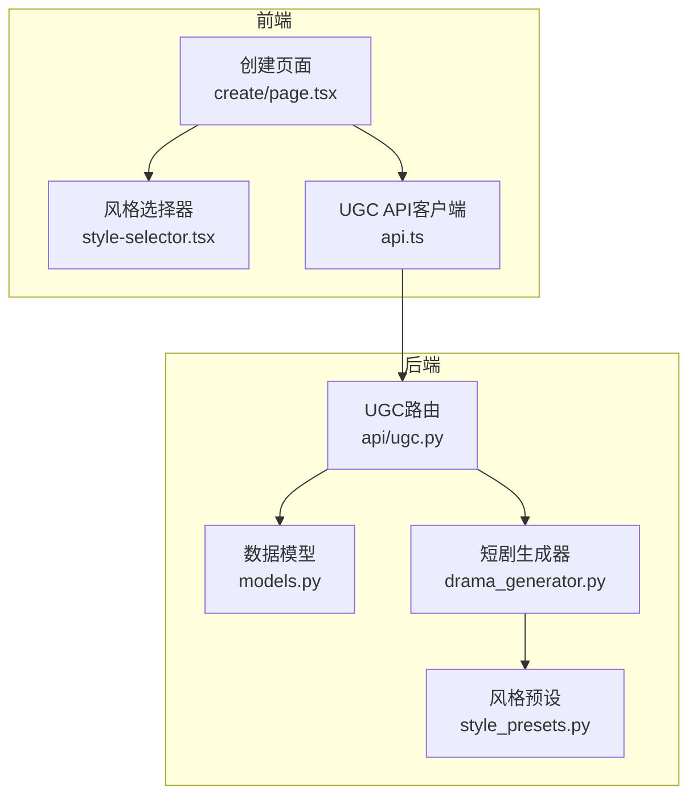
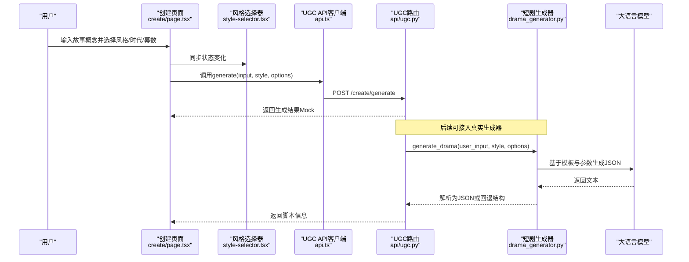
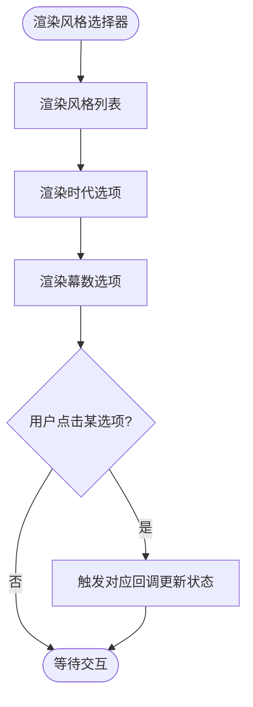
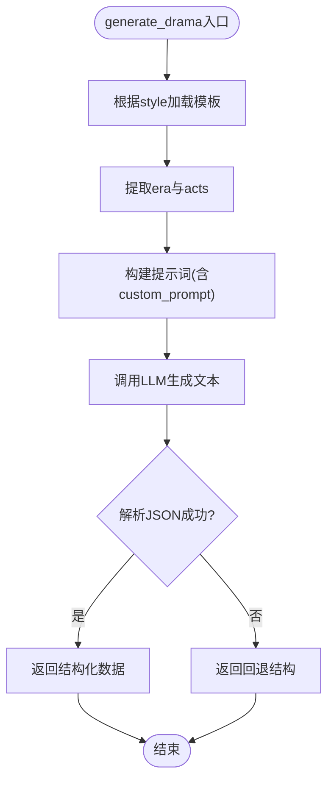
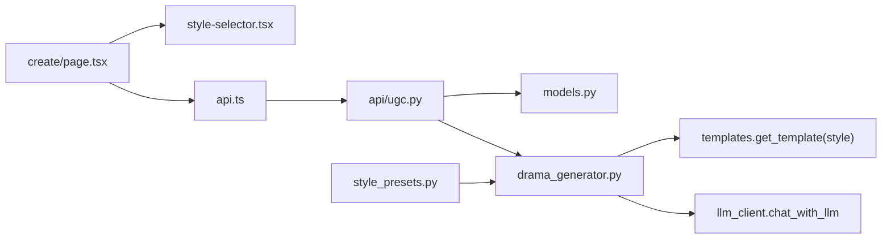

# 风格预设系统

<cite>
**本文引用的文件**   
- [backend/app/ugc/style_presets.py](file://backend/app/ugc/style_presets.py)
- [backend/app/ugc/drama_generator.py](file://backend/app/ugc/drama_generator.py)
- [backend/app/api/ugc.py](file://backend/app/api/ugc.py)
- [backend/app/models.py](file://backend/app/models.py)
- [frontend/src/components/style-selector.tsx](file://frontend/src/components/style-selector.tsx)
- [frontend/src/app/create/page.tsx](file://frontend/src/app/create/page.tsx)
- [frontend/src/lib/api.ts](file://frontend/src/lib/api.ts)
</cite>

## 目录
1. [引言](#引言)
2. [项目结构](#项目结构)
3. [核心组件](#核心组件)
4. [架构总览](#架构总览)
5. [详细组件分析](#详细组件分析)
6. [依赖关系分析](#依赖关系分析)
7. [性能考量](#性能考量)
8. [故障排查指南](#故障排查指南)
9. [结论](#结论)
10. [附录](#附录)

## 引言
本技术文档围绕“风格预设系统”展开，聚焦于不同创作风格的定义与配置（历史朝代、地域文化、艺术表现形式），以及风格参数的映射关系、模板结构与动态组合机制。同时说明预设风格的继承与扩展方式、兼容性处理、风格选择算法、效果预览能力与用户偏好学习机制的设计建议。文末提供配置示例、扩展开发指南与最佳实践，帮助用户进行个性化创作。

## 项目结构
风格预设系统贯穿前端交互、后端接口与生成逻辑：
- 前端样式选择器负责展示与收集用户的风格、时代背景与剧本长度等参数。
- 后端接口接收请求并返回结果（当前为Mock实现）。
- 生成器模块根据风格加载模板并调用LLM生成内容。
- 数据模型定义了请求与响应的结构。



**图示来源** 
- [frontend/src/app/create/page.tsx:1-135](file://frontend/src/app/create/page.tsx#L1-L135)
- [frontend/src/components/style-selector.tsx:1-121](file://frontend/src/components/style-selector.tsx#L1-L121)
- [frontend/src/lib/api.ts:132-154](file://frontend/src/lib/api.ts#L132-L154)
- [backend/app/api/ugc.py:1-35](file://backend/app/api/ugc.py#L1-L35)
- [backend/app/models.py:111-123](file://backend/app/models.py#L111-L123)
- [backend/app/ugc/drama_generator.py:1-21](file://backend/app/ugc/drama_generator.py#L1-L21)
- [backend/app/ugc/style_presets.py:1-15](file://backend/app/ugc/style_presets.py#L1-L15)

**章节来源**
- [frontend/src/app/create/page.tsx:1-135](file://frontend/src/app/create/page.tsx#L1-L135)
- [frontend/src/components/style-selector.tsx:1-121](file://frontend/src/components/style-selector.tsx#L1-L121)
- [frontend/src/lib/api.ts:132-154](file://frontend/src/lib/api.ts#L132-L154)
- [backend/app/api/ugc.py:1-35](file://backend/app/api/ugc.py#L1-L35)
- [backend/app/models.py:111-123](file://backend/app/models.py#L111-L123)
- [backend/app/ugc/drama_generator.py:1-21](file://backend/app/ugc/drama_generator.py#L1-L21)
- [backend/app/ugc/style_presets.py:1-15](file://backend/app/ugc/style_presets.py#L1-L15)

## 核心组件
- 风格预设常量：在后端集中定义风格ID、标签与图标；同时定义时代选项与幕数选项。
- 前端风格选择器：以卡片和按钮形式呈现风格、时代与幕数，并通过回调更新状态。
- UGC接口层：接收前端请求，返回结构化响应（当前为Mock）。
- 短剧生成器：根据风格获取模板，结合时代与幕数构造提示词，调用LLM生成JSON格式内容。
- 数据模型：定义GenerateRequest与GenerateResponse的字段约束。

**章节来源**
- [backend/app/ugc/style_presets.py:1-15](file://backend/app/ugc/style_presets.py#L1-L15)
- [frontend/src/components/style-selector.tsx:1-121](file://frontend/src/components/style-selector.tsx#L1-L121)
- [backend/app/api/ugc.py:1-35](file://backend/app/api/ugc.py#L1-L35)
- [backend/app/ugc/drama_generator.py:1-21](file://backend/app/ugc/drama_generator.py#L1-L21)
- [backend/app/models.py:111-123](file://backend/app/models.py#L111-L123)

## 架构总览
风格预设系统的端到端流程如下：
- 用户在创建页面输入故事概念，选择风格、时代与幕数。
- 前端通过UGC API发送请求，包含input、style与options（era、acts、custom_prompt）。
- 后端接口解析请求，调用生成器。
- 生成器根据风格加载模板，组装提示词，调用LLM生成JSON。
- 接口返回脚本元信息与章节结构（当前为Mock）。



**图示来源** 
- [frontend/src/app/create/page.tsx:30-47](file://frontend/src/app/create/page.tsx#L30-L47)
- [frontend/src/components/style-selector.tsx:41-118](file://frontend/src/components/style-selector.tsx#L41-L118)
- [frontend/src/lib/api.ts:132-154](file://frontend/src/lib/api.ts#L132-L154)
- [backend/app/api/ugc.py:8-29](file://backend/app/api/ugc.py#L8-L29)
- [backend/app/ugc/drama_generator.py:5-20](file://backend/app/ugc/drama_generator.py#L5-L20)

## 详细组件分析

### 风格预设常量（后端）
- STYLE_PRESETS：定义风格ID、标签与图标，如悬疑推理、爱情故事、喜剧冒险、悲剧史诗。
- ERA_PRESETS：定义时代背景，如清代、民国、现代、架空。
- ACT_OPTIONS：定义剧本长度（幕数），如3幕、5幕、7幕。

这些常量作为风格选择的权威来源，便于前后端保持一致。

**章节来源**
- [backend/app/ugc/style_presets.py:1-15](file://backend/app/ugc/style_presets.py#L1-L15)

### 前端风格选择器
- 展示风格、时代与幕数的可选项，使用卡片与按钮布局。
- 通过onStyleChange、onEraChange、onActsChange回调将用户选择传递到父组件。
- 支持图标与描述文案，提升用户体验。



**图示来源** 
- [frontend/src/components/style-selector.tsx:21-39](file://frontend/src/components/style-selector.tsx#L21-L39)
- [frontend/src/components/style-selector.tsx:41-118](file://frontend/src/components/style-selector.tsx#L41-L118)

**章节来源**
- [frontend/src/components/style-selector.tsx:1-121](file://frontend/src/components/style-selector.tsx#L1-L121)

### UGC接口层（后端）
- 提供POST /create/generate接口，当前返回Mock数据。
- 响应中包含script_id、title、chapters、style、era等字段。
- 预留regenerate接口用于重新生成。

```mermaid
classDiagram
class GenerateRequest {
+string input
+string style
+dict options
}
class GenerateResponse {
+string script_id
+string title
+list chapters
+string style
+string era
}
class UGCRouter {
+POST "/generate" GenerateResponse
+POST "/regenerate/{script_id}" dict
}
UGCRouter --> GenerateRequest : "接收"
UGCRouter --> GenerateResponse : "返回"
```

**图示来源** 
- [backend/app/models.py:111-123](file://backend/app/models.py#L111-L123)
- [backend/app/api/ugc.py:8-34](file://backend/app/api/ugc.py#L8-L34)

**章节来源**
- [backend/app/api/ugc.py:1-35](file://backend/app/api/ugc.py#L1-L35)
- [backend/app/models.py:111-123](file://backend/app/models.py#L111-L123)

### 短剧生成器（后端）
- 根据style获取模板，从options中提取era与acts。
- 使用模板prompt格式化user_input、era、acts，并追加custom_prompt（如有）。
- 调用LLM生成JSON，失败时返回回退结构。



**图示来源** 
- [backend/app/ugc/drama_generator.py:5-20](file://backend/app/ugc/drama_generator.py#L5-L20)

**章节来源**
- [backend/app/ugc/drama_generator.py:1-21](file://backend/app/ugc/drama_generator.py#L1-L21)

### 前端创建页面
- 管理用户输入、风格、时代、幕数与高级选项（自定义提示词）。
- 调用UGC API生成短剧，并将结果存入sessionStorage后跳转至结果页。
- 错误处理与加载状态反馈。

**章节来源**
- [frontend/src/app/create/page.tsx:1-135](file://frontend/src/app/create/page.tsx#L1-L135)

### 前端UGC API客户端
- 封装请求方法，统一添加Authorization头。
- 提供generate、regenerate、listMyScripts等方法。
- 与后端接口路径对齐。

**章节来源**
- [frontend/src/lib/api.ts:132-154](file://frontend/src/lib/api.ts#L132-L154)

## 依赖关系分析
- 前端创建页面依赖风格选择器与UGC API客户端。
- UGC API依赖数据模型与生成器。
- 生成器依赖模板与LLM客户端。
- 风格预设为常量数据源，供前后端共享语义。



**图示来源** 
- [frontend/src/app/create/page.tsx:1-135](file://frontend/src/app/create/page.tsx#L1-L135)
- [frontend/src/components/style-selector.tsx:1-121](file://frontend/src/components/style-selector.tsx#L1-L121)
- [frontend/src/lib/api.ts:132-154](file://frontend/src/lib/api.ts#L132-L154)
- [backend/app/api/ugc.py:1-35](file://backend/app/api/ugc.py#L1-L35)
- [backend/app/models.py:111-123](file://backend/app/models.py#L111-L123)
- [backend/app/ugc/drama_generator.py:1-21](file://backend/app/ugc/drama_generator.py#L1-L21)
- [backend/app/ugc/style_presets.py:1-15](file://backend/app/ugc/style_presets.py#L1-L15)

**章节来源**
- [frontend/src/app/create/page.tsx:1-135](file://frontend/src/app/create/page.tsx#L1-L135)
- [frontend/src/components/style-selector.tsx:1-121](file://frontend/src/components/style-selector.tsx#L1-L121)
- [frontend/src/lib/api.ts:132-154](file://frontend/src/lib/api.ts#L132-L154)
- [backend/app/api/ugc.py:1-35](file://backend/app/api/ugc.py#L1-L35)
- [backend/app/models.py:111-123](file://backend/app/models.py#L111-L123)
- [backend/app/ugc/drama_generator.py:1-21](file://backend/app/ugc/drama_generator.py#L1-L21)
- [backend/app/ugc/style_presets.py:1-15](file://backend/app/ugc/style_presets.py#L1-L15)

## 性能考量
- 模板加载与提示词构建应在服务端缓存，避免重复计算。
- LLM调用具有延迟与成本，建议增加重试与超时控制。
- Mock接口快速返回，便于前端开发与体验验证。
- 前端状态更新采用受控组件模式，减少不必要的重渲染。

[本节为通用指导，不直接分析具体文件]

## 故障排查指南
- JSON解析失败：生成器在LLM返回非JSON时会回退到默认结构，检查提示词与温度设置。
- 接口错误：前端请求封装会抛出HTTP错误，检查网络与后端路由。
- 风格不一致：确保前后端风格ID一致，必要时引入统一的风格枚举。

**章节来源**
- [backend/app/ugc/drama_generator.py:16-20](file://backend/app/ugc/drama_generator.py#L16-L20)
- [frontend/src/lib/api.ts:3-15](file://frontend/src/lib/api.ts#L3-L15)

## 结论
风格预设系统通过前后端协作实现了风格、时代与长度的灵活配置，并以模板驱动的方式对接LLM生成内容。当前后端接口为Mock实现，便于前端开发与测试。未来可扩展模板库、增强风格继承与组合机制，并加入用户偏好学习与效果预览功能，以提升个性化创作体验。

[本节为总结性内容，不直接分析具体文件]

## 附录

### 风格参数映射与模板结构
- 风格ID映射：suspense、romance、comedy、tragedy。
- 时代背景：qing、ming、modern、fantasy。
- 幕数选项：3、5、7。
- 模板结构：包含prompt与temperature字段，用于构造提示词与调节生成随机性。

**章节来源**
- [backend/app/ugc/style_presets.py:1-15](file://backend/app/ugc/style_presets.py#L1-L15)
- [backend/app/ugc/drama_generator.py:5-15](file://backend/app/ugc/drama_generator.py#L5-L15)

### 预设风格的继承与扩展
- 建议在模板系统中引入基类模板，子类模板继承并覆盖特定字段（如prompt片段、temperature）。
- 新增风格时，需在style_presets中注册ID与标签，并在模板库中添加对应模板。
- 兼容处理：当新风格未找到模板时，应回退到默认模板或抛出明确错误。

[本节为扩展设计建议，不直接分析具体文件]

### 风格选择算法与效果预览
- 选择算法：当前为直选模式，用户点击即生效。可扩展为评分或推荐算法，基于用户历史选择优化。
- 效果预览：可在生成前提供轻量预览（如标题、章节大纲），降低试错成本。

[本节为概念性设计，不直接分析具体文件]

### 用户偏好学习机制
- 记录用户对风格的选择与反馈（如收藏、评分）。
- 在服务端维护用户画像，用于推荐更匹配的风格与模板。
- 隐私保护：匿名化处理与用户授权。

[本节为概念性设计，不直接分析具体文件]

### 风格配置示例
- 基础配置：
  - style: suspense
  - era: qing
  - acts: 3
  - custom_prompt: 强调澳门历史元素与悬疑反转
- 进阶配置：
  - style: romance
  - era: modern
  - acts: 5
  - custom_prompt: 突出情感纠葛与现代都市背景

[本节为示例说明，不直接分析具体文件]

### 扩展开发指南与最佳实践
- 新增风格：
  - 在style_presets.py中注册新风格ID与标签。
  - 在模板库中添加对应模板，确保prompt与temperature合理。
- 兼容性：
  - 保持风格ID稳定，避免破坏现有前端与API契约。
  - 对旧版本模板提供迁移策略。
- 性能：
  - 缓存模板与LLM响应（在合规前提下）。
  - 异步处理与限流，避免服务过载。

[本节为开发指导，不直接分析具体文件]