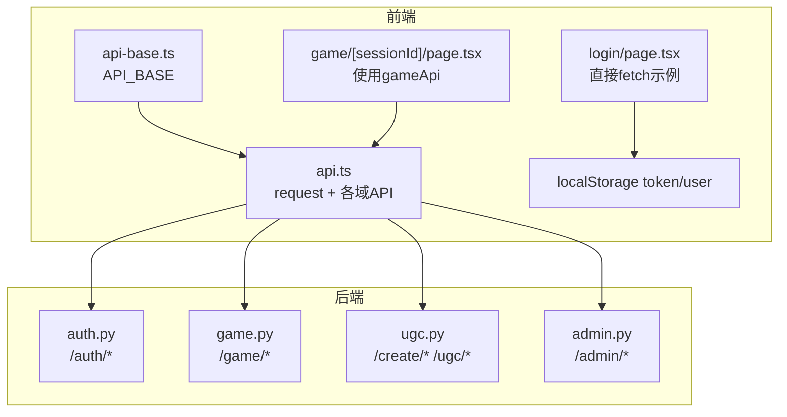
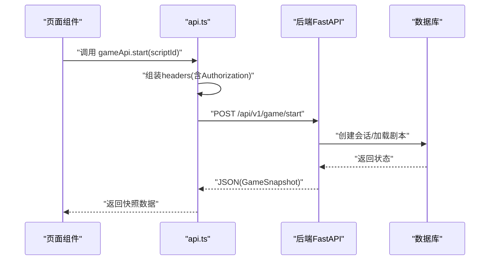
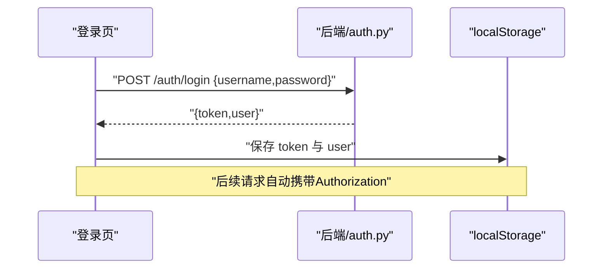
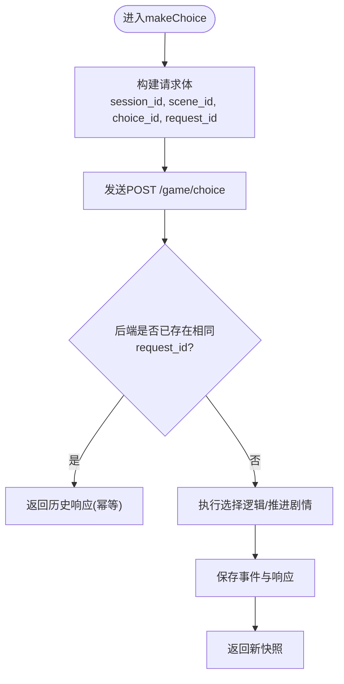
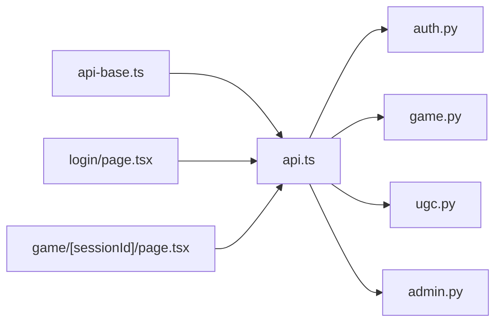

# API集成层

<cite>
**本文引用的文件**   
- [frontend/src/lib/api-base.ts](file://frontend/src/lib/api-base.ts)
- [frontend/src/lib/api.ts](file://frontend/src/lib/api.ts)
- [frontend/src/app/login/page.tsx](file://frontend/src/app/login/page.tsx)
- [frontend/src/app/game/[sessionId]/page.tsx](file://frontend/src/app/game/[sessionId]/page.tsx)
- [backend/app/api/auth.py](file://backend/app/api/auth.py)
- [backend/app/api/game.py](file://backend/app/api/game.py)
- [backend/app/api/ugc.py](file://backend/app/api/ugc.py)
- [backend/app/api/admin.py](file://backend/app/api/admin.py)
</cite>

## 目录
1. [简介](#简介)
2. [项目结构](#项目结构)
3. [核心组件](#核心组件)
4. [架构总览](#架构总览)
5. [详细组件分析](#详细组件分析)
6. [依赖关系分析](#依赖关系分析)
7. [性能考量](#性能考量)
8. [故障排查指南](#故障排查指南)
9. [结论](#结论)
10. [附录](#附录)

## 简介
本文件面向澳秘 Macau Mystery 的前端 API 集成层，系统性梳理 HTTP 请求封装、认证令牌管理、错误处理与响应数据转换，并给出重试策略、缓存机制、网络错误处理、超时控制与进度跟踪的落地方案。同时覆盖不同业务域（游戏、AI、UGC、管理员）的接口调用方式、参数校验与数据格式化规范，并提供调试工具、Mock 数据开发与性能监控建议，帮助开发者快速理解与扩展该集成层。

## 项目结构
前端 API 集成层位于 frontend/src/lib 下，采用“基础配置 + 统一请求封装 + 按业务域拆分”的组织方式：
- api-base.ts：集中定义后端基础地址，便于多环境切换。
- api.ts：统一的 request 函数与按业务域划分的 API 模块（game、ai、ugc、admin、auth），包含类型定义与参数构造。
- 页面组件通过导入对应模块进行调用，登录页演示了直接 fetch 的使用方式，游戏页演示了 gameApi 的使用。

图表来源
- [frontend/src/lib/api-base.ts:1-2](file://frontend/src/lib/api-base.ts#L1-L2)
- [frontend/src/lib/api.ts:1-216](file://frontend/src/lib/api.ts#L1-L216)
- [frontend/src/app/login/page.tsx:31-76](file://frontend/src/app/login/page.tsx#L31-L76)
- [frontend/src/app/game/[sessionId]/page.tsx:29-59](file://frontend/src/app/game/[sessionId]/page.tsx#L29-L59)
- [backend/app/api/auth.py:64-96](file://backend/app/api/auth.py#L64-L96)
- [backend/app/api/game.py:15-36](file://backend/app/api/game.py#L15-L36)
- [backend/app/api/ugc.py:8-34](file://backend/app/api/ugc.py#L8-L34)
- [backend/app/api/admin.py:71-217](file://backend/app/api/admin.py#L71-L217)

章节来源
- [frontend/src/lib/api-base.ts:1-2](file://frontend/src/lib/api-base.ts#L1-L2)
- [frontend/src/lib/api.ts:1-216](file://frontend/src/lib/api.ts#L1-L216)
- [frontend/src/app/login/page.tsx:31-76](file://frontend/src/app/login/page.tsx#L31-L76)
- [frontend/src/app/game/[sessionId]/page.tsx:29-59](file://frontend/src/app/game/[sessionId]/page.tsx#L29-L59)

## 核心组件
- 统一请求封装 request<T>(path, options)
  - 自动注入 Authorization: Bearer <token>（从 localStorage 读取）。
  - 默认 Content-Type: application/json。
  - 非 2xx 状态码抛出错误，错误信息包含状态码与文本。
  - 返回 JSON 解析结果，泛型 T 保证类型安全。
- 业务域 API 模块
  - gameApi：开始游戏、做出选择、获取状态。
  - aiApi：聊天与语音合成。
  - ugcApi：生成/再生成剧本、列表与发布。
  - adminApi：剧本 CRUD、审核、统计、路由配置。
  - authApi：登录、注册、当前用户。
- 类型定义
  - GameMedia、GameChoice、GameChapter、GameScene、GameClue、GameProgress、GameEnding、GameSnapshot 等，用于前后端数据结构对齐。

章节来源
- [frontend/src/lib/api.ts:3-15](file://frontend/src/lib/api.ts#L3-L15)
- [frontend/src/lib/api.ts:84-109](file://frontend/src/lib/api.ts#L84-L109)
- [frontend/src/lib/api.ts:115-126](file://frontend/src/lib/api.ts#L115-L126)
- [frontend/src/lib/api.ts:132-154](file://frontend/src/lib/api.ts#L132-L154)
- [frontend/src/lib/api.ts:160-195](file://frontend/src/lib/api.ts#L160-L195)
- [frontend/src/lib/api.ts:201-215](file://frontend/src/lib/api.ts#L201-L215)
- [frontend/src/lib/api.ts:21-78](file://frontend/src/lib/api.ts#L21-L78)

## 架构总览
前端通过统一的 request 发起 HTTP 请求，后端 FastAPI 提供 RESTful 接口。认证流程由后端鉴权中间逻辑完成，前端在登录后将 token 持久化到 localStorage，后续请求自动携带。

图表来源
- [frontend/src/lib/api.ts:3-15](file://frontend/src/lib/api.ts#L3-L15)
- [frontend/src/lib/api.ts:84-90](file://frontend/src/lib/api.ts#L84-L90)
- [backend/app/api/game.py:15-21](file://backend/app/api/game.py#L15-L21)

## 详细组件分析

### 统一请求封装与拦截器设计
- 功能要点
  - 自动附加 Authorization 头（Bearer Token）。
  - 统一 Content-Type。
  - 统一错误处理：非 2xx 抛错，便于上层捕获与提示。
  - 统一响应解析：res.json() 并泛型化返回类型。
- 可扩展点
  - 可在此处增加请求/响应日志、重试、超时 AbortController、进度上报、缓存拦截等。

章节来源
- [frontend/src/lib/api.ts:3-15](file://frontend/src/lib/api.ts#L3-L15)

### 认证令牌管理与鉴权流程
- 登录流程
  - 页面组件直接调用后端 /auth/login，成功后将 token 与 user 写入 localStorage。
  - 后续所有通过 api.ts 的请求都会自动带上 Authorization。
- 鉴权实现
  - 后端 /auth/me 支持从 Header 中读取 authorization 并验证。
  - 管理员接口通过 require_admin 校验角色。

图表来源
- [frontend/src/app/login/page.tsx:31-49](file://frontend/src/app/login/page.tsx#L31-L49)
- [backend/app/api/auth.py:64-72](file://backend/app/api/auth.py#L64-L72)
- [backend/app/api/auth.py:90-96](file://backend/app/api/auth.py#L90-L96)

章节来源
- [frontend/src/app/login/page.tsx:31-76](file://frontend/src/app/login/page.tsx#L31-L76)
- [backend/app/api/auth.py:64-96](file://backend/app/api/auth.py#L64-L96)

### 游戏域 API 调用与幂等性
- 调用方式
  - start：传入 script_id，返回 GameSnapshot。
  - makeChoice：传入 session_id、scene_id、choice_id 与 request_id，返回新的快照。
  - getState：根据 session_id 拉取当前状态。
- 幂等性
  - 后端基于 request_id 做幂等记录，避免重复提交导致的状态不一致。

图表来源
- [frontend/src/lib/api.ts:92-106](file://frontend/src/lib/api.ts#L92-L106)
- [backend/app/api/game.py:23-28](file://backend/app/api/game.py#L23-L28)

章节来源
- [frontend/src/lib/api.ts:84-109](file://frontend/src/lib/api.ts#L84-L109)
- [backend/app/api/game.py:15-36](file://backend/app/api/game.py#L15-L36)

### AI 域 API
- chat：对话接口，支持上下文传递，返回文本与可选音频链接。
- getTts：文本转语音，支持 voice 参数，返回音频链接。

章节来源
- [frontend/src/lib/api.ts:115-126](file://frontend/src/lib/api.ts#L115-L126)

### UGC 域 API
- generate：一句话生成短剧（当前为 Mock 实现），返回脚本结构与章节。
- regenerate：重新生成指定脚本。
- listMyScripts/listPublicScripts：列出我的/公开脚本。
- publishScript：发布或取消公开。
- submitToOfficial：提交至官方审核。

章节来源
- [frontend/src/lib/api.ts:132-154](file://frontend/src/lib/api.ts#L132-L154)
- [backend/app/api/ugc.py:8-34](file://backend/app/api/ugc.py#L8-L34)

### 管理员域 API
- 剧本管理：CRUD、发布、AI 生成草稿。
- 审核：查看提交、批准/拒绝。
- 统计：脚本总数、玩家数、浏览量、发布数量。
- 路由配置：获取已发布剧本的路线。

章节来源
- [frontend/src/lib/api.ts:160-195](file://frontend/src/lib/api.ts#L160-L195)
- [backend/app/api/admin.py:71-217](file://backend/app/api/admin.py#L71-L217)

### 认证域 API
- login/register：用户名密码登录与注册，返回 token 与用户信息。
- me：获取当前用户信息（需授权）。

章节来源
- [frontend/src/lib/api.ts:201-215](file://frontend/src/lib/api.ts#L201-L215)
- [backend/app/api/auth.py:64-96](file://backend/app/api/auth.py#L64-L96)

## 依赖关系分析
- 前端依赖
  - api.ts 依赖 api-base.ts 的基础地址。
  - 页面组件依赖各自 API 模块。
- 后端依赖
  - 各 API Router 依赖数据库会话与业务服务。
  - 管理员接口依赖管理员权限校验。

图表来源
- [frontend/src/lib/api-base.ts:1-2](file://frontend/src/lib/api-base.ts#L1-L2)
- [frontend/src/lib/api.ts:1-216](file://frontend/src/lib/api.ts#L1-L216)
- [backend/app/api/auth.py:1-96](file://backend/app/api/auth.py#L1-L96)
- [backend/app/api/game.py:1-36](file://backend/app/api/game.py#L1-L36)
- [backend/app/api/ugc.py:1-34](file://backend/app/api/ugc.py#L1-L34)
- [backend/app/api/admin.py:1-217](file://backend/app/api/admin.py#L1-L217)

章节来源
- [frontend/src/lib/api-base.ts:1-2](file://frontend/src/lib/api-base.ts#L1-L2)
- [frontend/src/lib/api.ts:1-216](file://frontend/src/lib/api.ts#L1-L216)

## 性能考量
- 当前实现未内置重试、超时与缓存，建议在 request 层扩展：
  - 重试策略：对 5xx 或网络异常进行指数退避重试，限制最大次数。
  - 超时控制：使用 AbortController 设置超时时间，避免长时间挂起。
  - 缓存机制：对 GET 类接口（如 /game/state/{id}）实施内存/浏览器缓存，结合 ETag/Last-Modified 或失效策略。
  - 并发控制：对高频请求（如视频预加载）进行队列与限流。
  - 资源优化：大对象分片传输、按需加载、图片/视频懒加载。
- 监控与埋点
  - 请求耗时、失败率、重试次数、缓存命中率等指标上报。
  - 关键路径（登录、开始游戏、选择）打点，辅助定位瓶颈。

[本节为通用指导，不直接分析具体文件]

## 故障排查指南
- 常见错误
  - 401/403：检查 localStorage 中的 token 是否存在且有效；确认后端鉴权逻辑。
  - 404：检查 API_BASE 是否正确拼接路径；核对后端路由前缀。
  - 5xx：查看后端日志，关注数据库连接、业务异常与幂等冲突。
- 调试建议
  - 浏览器 Network 面板查看请求头、响应体与状态码。
  - 在 request 层打印入参出参与耗时，便于定位问题。
  - 使用 Mock 数据隔离后端不稳定因素，优先验证前端逻辑。
- 恢复策略
  - 对可重试错误（网络抖动、5xx）进行有限次重试。
  - 对不可恢复错误（401、404）提示用户并引导刷新或重新登录。

章节来源
- [frontend/src/lib/api.ts:12-14](file://frontend/src/lib/api.ts#L12-L14)
- [frontend/src/app/login/page.tsx:31-49](file://frontend/src/app/login/page.tsx#L31-L49)

## 结论
当前 API 集成层以简洁统一的 request 封装为核心，配合按业务域拆分的 API 模块，实现了清晰的职责边界与良好的可扩展性。认证流程简单可靠，后端幂等机制保障了关键操作的一致性。未来可在请求层增强重试、超时、缓存与监控能力，进一步提升稳定性与性能。

[本节为总结性内容，不直接分析具体文件]

## 附录

### 接口清单与调用约定
- 认证
  - POST /auth/login：登录，返回 token 与用户信息。
  - POST /auth/register：注册，返回 token 与用户信息。
  - GET /auth/me：获取当前用户（需授权）。
- 游戏
  - POST /game/start：开始游戏，返回快照。
  - POST /game/choice：做出选择，返回新快照（含 request_id 幂等）。
  - GET /game/state/{session_id}：获取状态。
- AI
  - POST /ai/chat：对话，返回文本与可选音频链接。
  - GET /ai/tts：文本转语音，返回音频链接。
- UGC
  - POST /create/generate：生成短剧（Mock）。
  - POST /create/regenerate/{script_id}：重新生成。
  - GET /ugc/my-scripts：我的脚本列表。
  - GET /ugc/public：公开脚本列表。
  - POST /ugc/publish/{script_id}：发布/取消公开。
  - POST /ugc/submit/{script_id}：提交审核。
- 管理员
  - GET /admin/scripts：脚本列表。
  - POST /admin/scripts：创建脚本。
  - PUT /admin/scripts/{id}：更新脚本。
  - DELETE /admin/scripts/{id}：删除脚本。
  - POST /admin/scripts/{id}/publish：发布/取消发布。
  - POST /admin/scripts/ai-generate：AI 生成草稿。
  - GET /admin/submissions：提交列表。
  - POST /admin/submissions/{id}/approve：批准提交。
  - POST /admin/submissions/{id}/reject：拒绝提交。
  - GET /admin/stats：统计信息。
  - GET /admin/route：路线配置。

章节来源
- [backend/app/api/auth.py:64-96](file://backend/app/api/auth.py#L64-L96)
- [backend/app/api/game.py:15-36](file://backend/app/api/game.py#L15-L36)
- [backend/app/api/ugc.py:8-34](file://backend/app/api/ugc.py#L8-L34)
- [backend/app/api/admin.py:71-217](file://backend/app/api/admin.py#L71-L217)
- [frontend/src/lib/api.ts:84-195](file://frontend/src/lib/api.ts#L84-L195)

### 参数验证与数据格式化
- 前端
  - 使用 TypeScript 接口约束请求与响应结构，减少运行时错误。
  - 对必要字段进行空值检查与格式校验（如 URL、ID）。
- 后端
  - Pydantic 模型校验输入，确保字段类型与长度限制。
  - 返回统一的数据结构，便于前端解析与展示。

章节来源
- [backend/app/api/auth.py:28-57](file://backend/app/api/auth.py#L28-L57)
- [frontend/src/lib/api.ts:21-78](file://frontend/src/lib/api.ts#L21-L78)

### 网络错误处理、超时控制与进度跟踪
- 网络错误处理
  - 当前在非 2xx 时抛出错误，上层组件捕获并提示。
- 超时控制
  - 建议在 request 层引入 AbortController，设置合理超时时间。
- 进度跟踪
  - 对于长任务（如 AI 生成、TTS），可采用 SSE 或轮询返回进度。
  - 前端展示进度条与状态文案，提升用户体验。

章节来源
- [frontend/src/lib/api.ts:12-14](file://frontend/src/lib/api.ts#L12-L14)
- [frontend/src/app/game/[sessionId]/page.tsx:29-59](file://frontend/src/app/game/[sessionId]/page.tsx#L29-L59)

### 调试工具与 Mock 数据开发
- 调试工具
  - 浏览器 DevTools 的 Network、Console 与 Sources。
  - 在 request 层添加日志输出（入参、出参、耗时）。
- Mock 数据
  - 后端 ugc.generate 已提供 Mock 实现，便于前端联调。
  - 可通过环境变量切换 API_BASE，指向本地或测试服务器。

章节来源
- [backend/app/api/ugc.py:8-29](file://backend/app/api/ugc.py#L8-L29)
- [frontend/src/lib/api-base.ts:1-2](file://frontend/src/lib/api-base.ts#L1-L2)

### 性能监控方案
- 指标采集
  - 请求成功率、平均耗时、P95/P99 耗时、重试次数、缓存命中率。
- 上报策略
  - 异步上报，避免阻塞主流程。
  - 采样上报，降低开销。
- 可视化
  - 接入监控平台（如 Prometheus/Grafana）进行告警与看板展示。

[本节为通用指导，不直接分析具体文件]