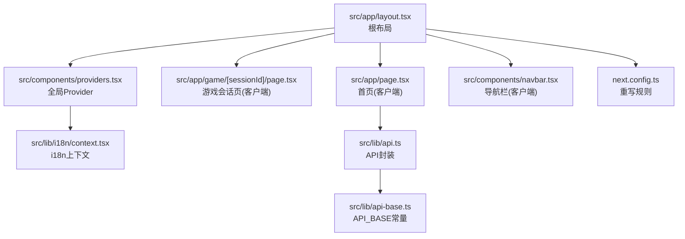
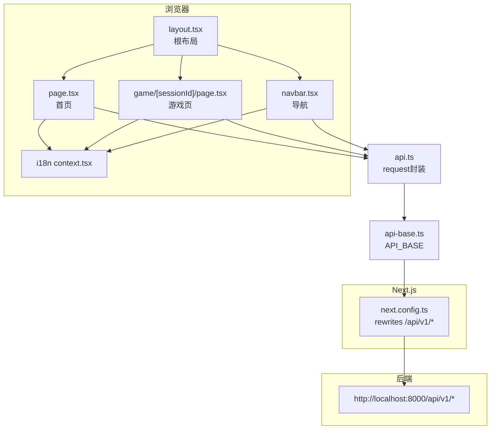
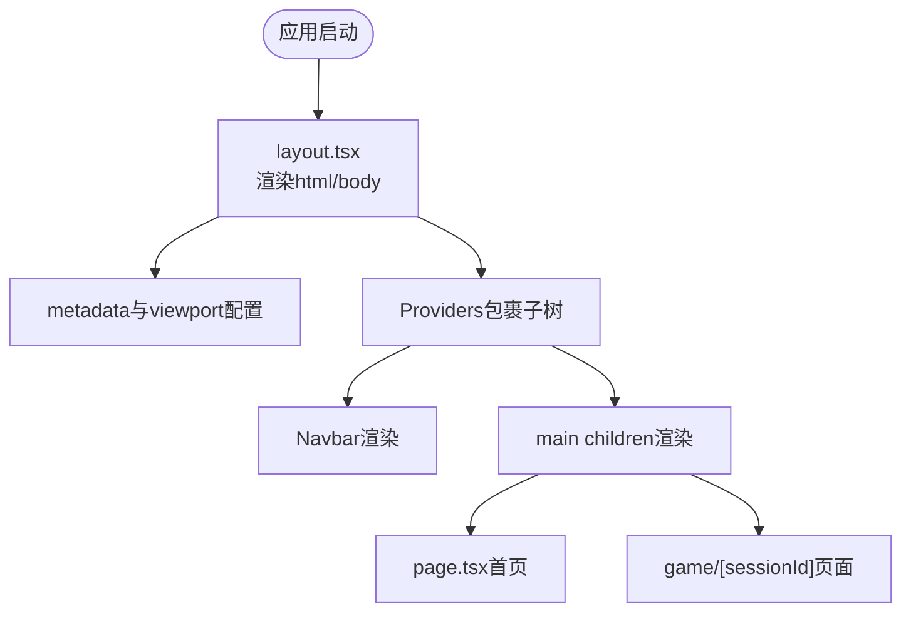
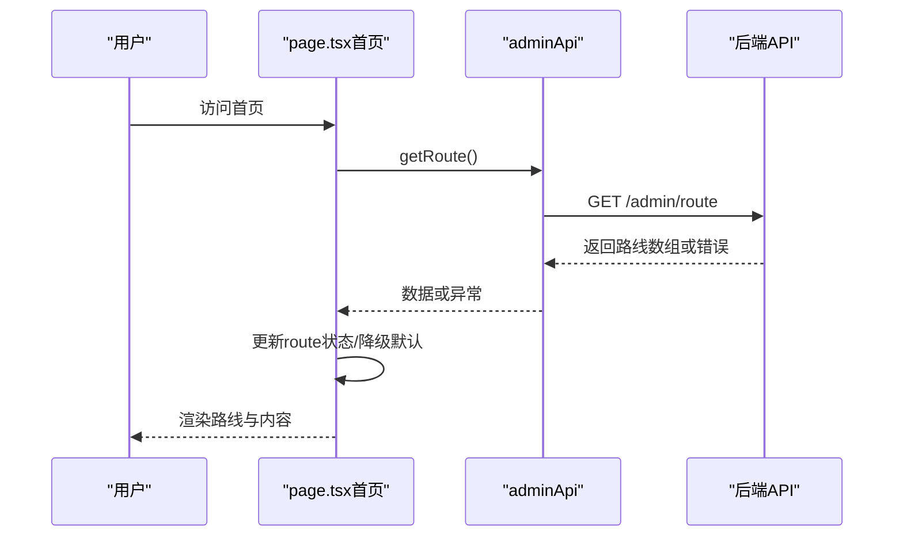
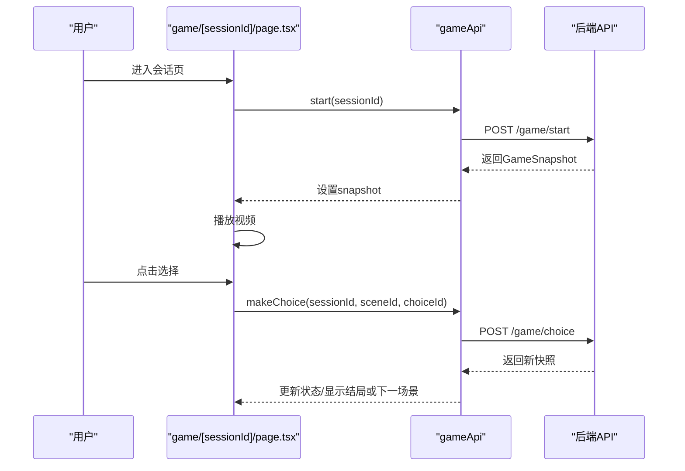
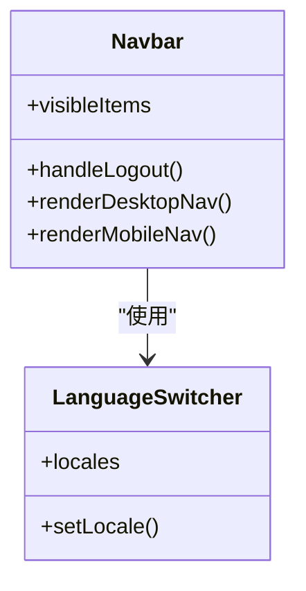
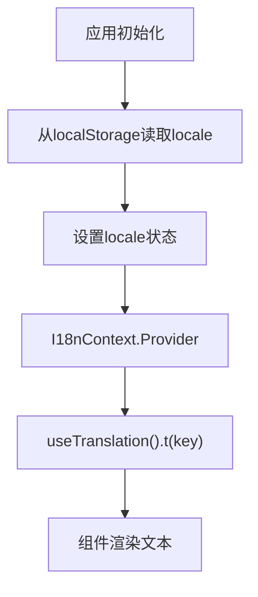
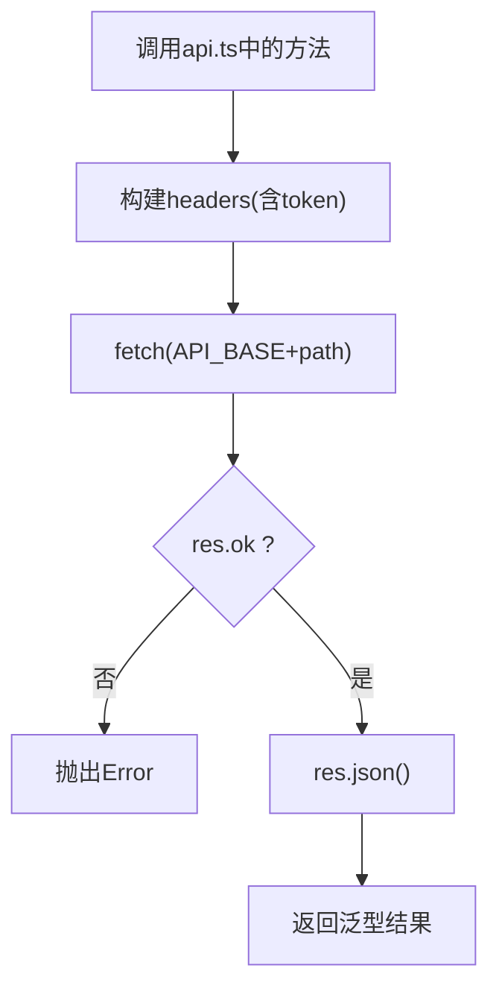
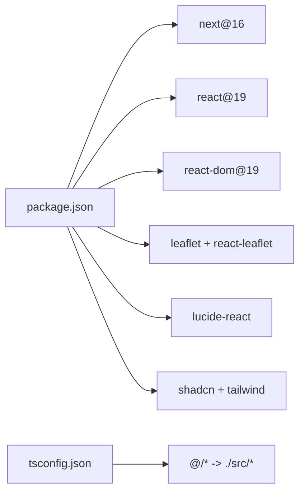

# Next.js应用架构

<cite>
**本文引用的文件**   
- [package.json](file://frontend/package.json)
- [next.config.ts](file://frontend/next.config.ts)
- [tsconfig.json](file://frontend/tsconfig.json)
- [layout.tsx](file://frontend/src/app/layout.tsx)
- [page.tsx](file://frontend/src/app/page.tsx)
- [providers.tsx](file://frontend/src/components/providers.tsx)
- [api.ts](file://frontend/src/lib/api.ts)
- [api-base.ts](file://frontend/src/lib/api-base.ts)
- [context.tsx](file://frontend/src/lib/i18n/context.tsx)
- [language-switcher.tsx](file://frontend/src/components/language-switcher.tsx)
- [navbar.tsx](file://frontend/src/components/navbar.tsx)
- "[sessionId]/page.tsx](file://frontend/src/app/game/[sessionId]/page.tsx)"
</cite>

## 目录
1. [简介](#简介)
2. [项目结构](#项目结构)
3. [核心组件](#核心组件)
4. [架构总览](#架构总览)
5. [详细组件分析](#详细组件分析)
6. [依赖关系分析](#依赖关系分析)
7. [性能考量](#性能考量)
8. [故障排查指南](#故障排查指南)
9. [结论](#结论)
10. [附录](#附录)

## 简介
本文件面向“澳秘 Macau Mystery”Next.js前端工程，系统化阐述基于Next.js 16的App Router架构设计、服务端与客户端组件策略、页面布局与组件层次组织、应用启动流程、中间件配置（当前未启用）、全局状态管理方案、TypeScript集成与模块导入规范、代码分割策略、SEO配置、多语言支持实现、开发环境配置、构建优化与生产部署最佳实践。文档以仓库实际源码为依据，辅以可视化图示帮助理解。

## 项目结构
前端采用Next.js App Router目录约定：
- src/app：路由与布局根节点，包含根布局、首页、游戏会话页等
- src/components：可复用UI与业务组件（导航栏、语言切换器、视频播放器等）
- src/lib：公共库（API封装、国际化上下文、工具函数）
- public：静态资源（图标、媒体等）

**图表来源** 
- [layout.tsx:1-62](file://frontend/src/app/layout.tsx#L1-L62)
- [page.tsx:1-453](file://frontend/src/app/page.tsx#L1-L453)
- "[sessionId]/page.tsx](file://frontend/src/app/game/[sessionId]/page.tsx#L1-L194)"
- [providers.tsx:1-8](file://frontend/src/components/providers.tsx#L1-L8)
- [context.tsx:1-56](file://frontend/src/lib/i18n/context.tsx#L1-L56)
- [navbar.tsx:1-186](file://frontend/src/components/navbar.tsx#L1-L186)
- [api.ts:1-216](file://frontend/src/lib/api.ts#L1-L216)
- [api-base.ts:1-2](file://frontend/src/lib/api-base.ts#L1-L2)
- [next.config.ts:1-15](file://frontend/next.config.ts#L1-L15)

**章节来源**
- [package.json:1-37](file://frontend/package.json#L1-L37)
- [next.config.ts:1-15](file://frontend/next.config.ts#L1-L15)
- [tsconfig.json:1-35](file://frontend/tsconfig.json#L1-L35)
- [layout.tsx:1-62](file://frontend/src/app/layout.tsx#L1-L62)

## 核心组件
- 根布局 layout.tsx：定义全局元数据、视口、字体变量、Providers包裹、导航与主内容区域
- 首页 page.tsx：客户端组件，使用i18n、调用adminApi获取路线信息，展示英雄区、特性、路线时间线等
- 游戏会话页 game/[sessionId]/page.tsx：客户端组件，加载并推进游戏状态，播放视频、展示选择项
- 导航栏 navbar.tsx：客户端组件，响应式导航、用户态、语言切换入口
- Providers：注入LanguageProvider作为全局状态容器
- i18n context.tsx：提供locale、setLocale、t方法，持久化到localStorage
- API封装 api.ts：统一请求封装、类型定义、各域API（game/ai/ugc/admin/auth）
- API基础 api-base.ts：API_BASE环境变量或默认值

**章节来源**
- [layout.tsx:1-62](file://frontend/src/app/layout.tsx#L1-L62)
- [page.tsx:1-453](file://frontend/src/app/page.tsx#L1-L453)
- "[sessionId]/page.tsx](file://frontend/src/app/game/[sessionId]/page.tsx#L1-L194)"
- [navbar.tsx:1-186](file://frontend/src/components/navbar.tsx#L1-L186)
- [providers.tsx:1-8](file://frontend/src/components/providers.tsx#L1-L8)
- [context.tsx:1-56](file://frontend/src/lib/i18n/context.tsx#L1-L56)
- [api.ts:1-216](file://frontend/src/lib/api.ts#L1-L216)
- [api-base.ts:1-2](file://frontend/src/lib/api-base.ts#L1-L2)

## 架构总览
Next.js 16 App Router下，所有页面均为客户端组件（通过"use client"），由根布局统一渲染并提供全局上下文。API请求通过统一的request封装，自动附加Authorization头；后端接口通过next.config.ts的rewrites代理至本地后端服务。

**图表来源** 
- [layout.tsx:1-62](file://frontend/src/app/layout.tsx#L1-L62)
- [page.tsx:1-453](file://frontend/src/app/page.tsx#L1-L453)
- "[sessionId]/page.tsx](file://frontend/src/app/game/[sessionId]/page.tsx#L1-L194)"
- [navbar.tsx:1-186](file://frontend/src/components/navbar.tsx#L1-L186)
- [context.tsx:1-56](file://frontend/src/lib/i18n/context.tsx#L1-L56)
- [api.ts:1-216](file://frontend/src/lib/api.ts#L1-L216)
- [api-base.ts:1-2](file://frontend/src/lib/api-base.ts#L1-L2)
- [next.config.ts:1-15](file://frontend/next.config.ts#L1-L15)

## 详细组件分析

### 根布局与SEO配置
- 根布局设置标题、描述、关键词与图标，定义viewport，注入字体变量，包裹Providers，挂载MouseFollower与Navbar
- SEO关键元数据在根布局中集中声明，利于首屏渲染与搜索引擎抓取

**图表来源** 
- [layout.tsx:1-62](file://frontend/src/app/layout.tsx#L1-L62)

**章节来源**
- [layout.tsx:1-62](file://frontend/src/app/layout.tsx#L1-L62)

### 首页（客户端组件）
- 使用"use client"，通过useTranslation进行多语言渲染
- 调用adminApi.getRoute获取路线数据，失败时回退默认路线
- 展示英雄区、特性卡片、路线时间线与登录引导

**图表来源** 
- [page.tsx:1-453](file://frontend/src/app/page.tsx#L1-L453)
- [api.ts:1-216](file://frontend/src/lib/api.ts#L1-L216)

**章节来源**
- [page.tsx:1-453](file://frontend/src/app/page.tsx#L1-L453)
- [api.ts:1-216](file://frontend/src/lib/api.ts#L1-L216)

### 游戏会话页（客户端组件）
- 使用useParams读取sessionId，调用gameApi.start初始化快照
- 播放视频后根据scene.choices展示选项，选择后调用makeChoice推进状态
- 处理加载、错误与结束场景

**图表来源** 
- "[sessionId]/page.tsx](file://frontend/src/app/game/[sessionId]/page.tsx#L1-L194)"
- [api.ts:1-216](file://frontend/src/lib/api.ts#L1-L216)

**章节来源**
- "[sessionId]/page.tsx](file://frontend/src/app/game/[sessionId]/page.tsx#L1-L194)"
- [api.ts:1-216](file://frontend/src/lib/api.ts#L1-L216)

### 导航栏与权限控制
- 导航项按角色过滤（adminOnly），从localStorage恢复用户态
- 移动端使用Sheet抽屉菜单，支持语言切换与登出

**图表来源** 
- [navbar.tsx:1-186](file://frontend/src/components/navbar.tsx#L1-L186)
- [language-switcher.tsx:1-59](file://frontend/src/components/language-switcher.tsx#L1-L59)

**章节来源**
- [navbar.tsx:1-186](file://frontend/src/components/navbar.tsx#L1-L186)
- [language-switcher.tsx:1-59](file://frontend/src/components/language-switcher.tsx#L1-L59)

### 全局状态与多语言
- LanguageProvider维护locale与t方法，持久化到localStorage
- 组件通过useTranslation消费上下文，无侵入式切换语言

**图表来源** 
- [context.tsx:1-56](file://frontend/src/lib/i18n/context.tsx#L1-L56)

**章节来源**
- [context.tsx:1-56](file://frontend/src/lib/i18n/context.tsx#L1-L56)
- [providers.tsx:1-8](file://frontend/src/components/providers.tsx#L1-L8)

### API封装与请求流
- request统一处理Content-Type、Authorization头、错误抛出与JSON解析
- 各域API（game/ai/ugc/admin/auth）暴露简洁方法，便于页面调用

**图表来源** 
- [api.ts:1-216](file://frontend/src/lib/api.ts#L1-L216)
- [api-base.ts:1-2](file://frontend/src/lib/api-base.ts#L1-L2)

**章节来源**
- [api.ts:1-216](file://frontend/src/lib/api.ts#L1-L216)
- [api-base.ts:1-2](file://frontend/src/lib/api-base.ts#L1-L2)

## 依赖关系分析
- 运行时依赖：next@16、react@19、react-dom@19、leaflet/react-leaflet、lucide-react、shadcn/ui相关包
- 开发依赖：typescript、eslint、tailwindcss、@tailwindcss/postcss
- 模块路径别名：tsconfig.json中paths将@/*映射到./src/*，简化导入

**图表来源** 
- [package.json:1-37](file://frontend/package.json#L1-L37)
- [tsconfig.json:1-35](file://frontend/tsconfig.json#L1-L35)

**章节来源**
- [package.json:1-37](file://frontend/package.json#L1-L37)
- [tsconfig.json:1-35](file://frontend/tsconfig.json#L1-L35)

## 性能考量
- 客户端组件策略：当前页面均标注"use client"，适合交互密集场景；若存在纯展示页面，可考虑服务端组件减少客户端体积
- 代码分割：Next.js默认按路由与动态导入进行分包；建议对重型第三方库按需引入
- 图片与媒体：视频优先懒加载与预加载策略结合，避免首屏阻塞
- API请求：统一封装已处理鉴权与错误；可进一步增加重试、缓存与去抖
- CSS与字体：Geist字体通过next/font加载，减少FOIT；Tailwind按需生成样式
- 构建优化：开启增量编译与isolatedModules，提升开发体验

[本节为通用指导，不直接分析具体文件]

## 故障排查指南
- API请求失败：检查API_BASE与环境变量NEXT_PUBLIC_API_URL；确认后端服务端口与rewrites规则
- 认证问题：确认localStorage中存在token且格式正确；检查Authorization头拼接逻辑
- 国际化缺失：确保translations中包含对应key与locale；fallback机制会回退到en或原key
- 路由参数错误：game/[sessionId]需保证sessionId有效；控制台查看useParams返回值
- 构建错误：检查TypeScript严格模式与模块解析配置；确保路径别名生效

**章节来源**
- [api.ts:1-216](file://frontend/src/lib/api.ts#L1-L216)
- [api-base.ts:1-2](file://frontend/src/lib/api-base.ts#L1-L2)
- [context.tsx:1-56](file://frontend/src/lib/i18n/context.tsx#L1-L56)
- "[sessionId]/page.tsx](file://frontend/src/app/game/[sessionId]/page.tsx#L1-L194)"

## 结论
本项目基于Next.js 16的App Router实现了清晰的前端架构：根布局统一管理SEO与全局上下文，客户端组件负责交互与数据获取，API层统一封装与类型约束，i18n提供轻量多语言支持。通过rewrites代理后端接口，开发体验良好。后续可在服务端组件、缓存策略与性能监控方面持续优化。

[本节为总结性内容，不直接分析具体文件]

## 附录
- 开发环境配置
  - 脚本命令：dev/build/start/lint
  - 环境变量：NEXT_PUBLIC_API_URL（默认http://localhost:8000/api/v1）
- 构建与部署
  - 使用next build生成静态产物，next start运行生产服务
  - 建议在容器环境中固定Node版本与依赖锁定文件
- 中间件
  - 当前未启用middleware；如需鉴权或日志，可在src/middleware.ts添加

**章节来源**
- [package.json:1-37](file://frontend/package.json#L1-L37)
- [api-base.ts:1-2](file://frontend/src/lib/api-base.ts#L1-L2)