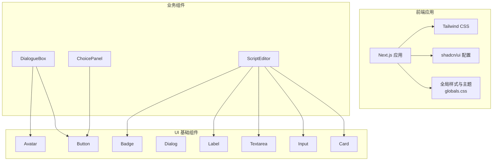
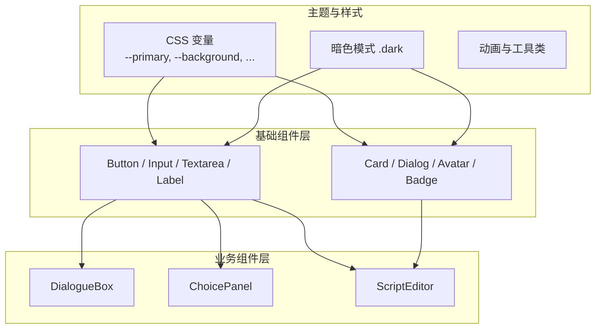
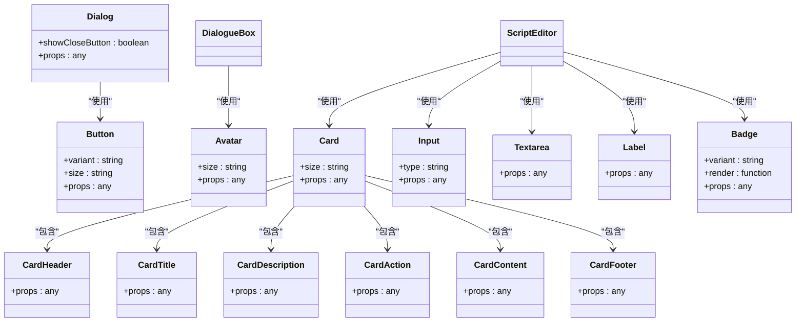
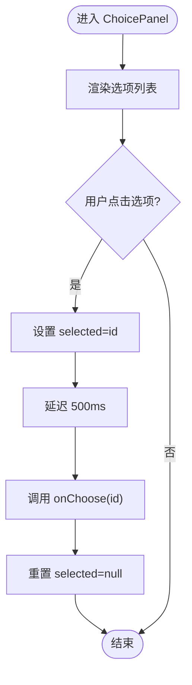
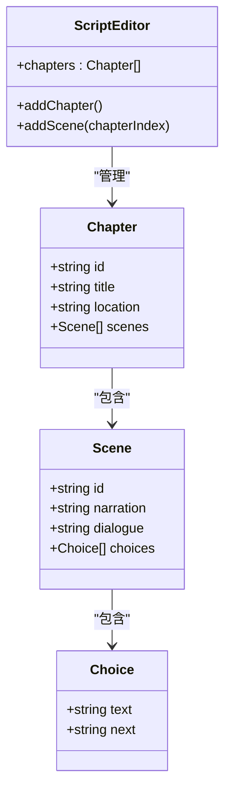
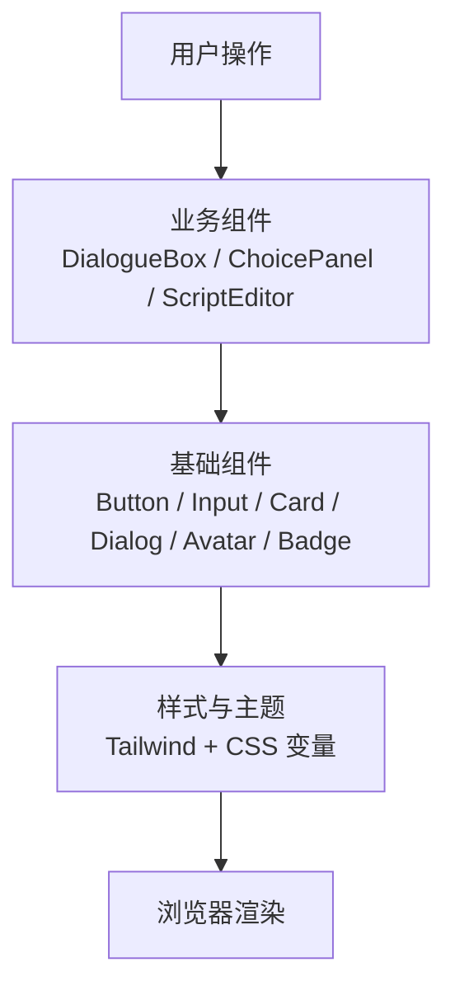
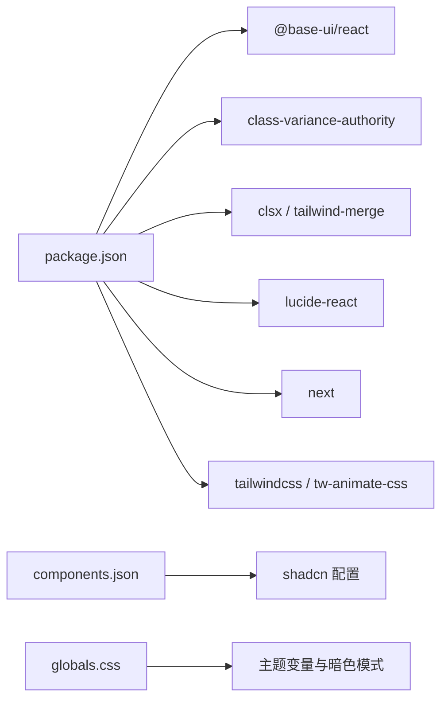

# UI组件系统

<cite>
**本文引用的文件**   
- [button.tsx](file://frontend/src/components/ui/button.tsx)
- [card.tsx](file://frontend/src/components/ui/card.tsx)
- [input.tsx](file://frontend/src/components/ui/input.tsx)
- [dialog.tsx](file://frontend/src/components/ui/dialog.tsx)
- [avatar.tsx](file://frontend/src/components/ui/avatar.tsx)
- [badge.tsx](file://frontend/src/components/ui/badge.tsx)
- [textarea.tsx](file://frontend/src/components/ui/textarea.tsx)
- [label.tsx](file://frontend/src/components/ui/label.tsx)
- [utils.ts](file://frontend/src/lib/utils.ts)
- [components.json](file://frontend/components.json)
- [globals.css](file://frontend/src/app/globals.css)
- [package.json](file://frontend/package.json)
- [dialogue-box.tsx](file://frontend/src/components/dialogue-box.tsx)
- [choice-panel.tsx](file://frontend/src/components/choice-panel.tsx)
- [script-editor.tsx](file://frontend/src/components/script-editor.tsx)
</cite>

## 目录
1. [简介](#简介)
2. [项目结构](#项目结构)
3. [核心组件](#核心组件)
4. [架构总览](#架构总览)
5. [详细组件分析](#详细组件分析)
6. [依赖分析](#依赖分析)
7. [性能考虑](#性能考虑)
8. [故障排查指南](#故障排查指南)
9. [结论](#结论)
10. [附录](#附录)

## 简介
本文件系统化梳理澳秘 Macau Mystery 前端 UI 组件体系，围绕基于 shadcn/ui 的基础组件库与业务组件展开。内容涵盖：
- 基础组件（Button、Card、Input、Dialog、Avatar、Badge、Textarea、Label）的设计模式、Props 接口、样式定制与主题系统
- 业务组件（DialogueBox、ChoicePanel、ScriptEditor）的复用策略、事件处理机制与交互流程
- 响应式设计与无障碍访问支持
- 组件开发规范、测试策略与性能优化建议

## 项目结构
前端采用 Next.js + React + Tailwind CSS + shadcn/ui 的技术栈。UI 组件集中在 components/ui 目录，业务组件位于 components 目录，全局样式与主题变量定义在 app/globals.css，shadcn 配置在 components.json，依赖管理在 package.json。



图表来源
- [components.json:1-26](file://frontend/components.json#L1-L26)
- [globals.css:1-331](file://frontend/src/app/globals.css#L1-L331)
- [package.json:1-37](file://frontend/package.json#L1-L37)

章节来源
- [components.json:1-26](file://frontend/components.json#L1-L26)
- [globals.css:1-331](file://frontend/src/app/globals.css#L1-L331)
- [package.json:1-37](file://frontend/package.json#L1-L37)

## 核心组件
本节聚焦基础组件的实现要点、Props 约定、样式变体与主题映射。

- Button
  - 设计模式：基于 @base-ui/react/button 的原语封装，使用 class-variance-authority 管理 variant 与 size 变体，统一通过 cn 合并类名
  - Props 接口：继承原语 Props，扩展 VariantProps；默认 variant=default、size=default
  - 样式定制：通过 cva 声明多套样式，覆盖 hover、focus-visible、disabled、aria-invalid 等状态
  - 无障碍：保留 focus-visible 与 aria-* 语义，确保键盘可达性与屏幕阅读器友好
  - 参考路径：[button.tsx:1-59](file://frontend/src/components/ui/button.tsx#L1-L59)

- Card
  - 设计模式：组合式子组件（Header、Title、Description、Action、Content、Footer），通过 data-slot 标记语义区块
  - Props 接口：根组件支持 size="default|sm"，子组件透传原生 div props
  - 样式定制：使用 CSS 变量 --card-spacing 控制内边距，配合容器查询与网格布局适配
  - 参考路径：[card.tsx:1-104](file://frontend/src/components/ui/card.tsx#L1-L104)

- Input
  - 设计模式：基于 @base-ui/react/input 的原语封装，统一输入控件样式与焦点态
  - Props 接口：透传原生 input props，支持 type 等属性
  - 样式定制：包含 placeholder、disabled、aria-invalid、dark 模式等样式分支
  - 参考路径：[input.tsx:1-21](file://frontend/src/components/ui/input.tsx#L1-L21)

- Dialog
  - 设计模式：基于 @base-ui/react/dialog 的完整对话框套件（Root、Trigger、Portal、Close、Overlay、Popup、Header、Footer、Title、Description）
  - Props 接口：各子组件透传对应原语 Props；DialogContent 提供 showCloseButton 开关
  - 样式定制：居中弹窗、动画过渡、移动端最大宽度限制、关闭按钮位置
  - 无障碍：内置 Close 按钮与 sr-only 文本，确保可访问性
  - 参考路径：[dialog.tsx:1-161](file://frontend/src/components/ui/dialog.tsx#L1-L161)

- Avatar
  - 设计模式：头像、图片、占位符、徽章、分组与计数组合，支持 size 变体
  - Props 接口：根组件支持 size="default|sm|lg"，其余透传原语 props
  - 样式定制：暗色混合模式、组内间距、徽章尺寸随父级 size 变化
  - 参考路径：[avatar.tsx:1-110](file://frontend/src/components/ui/avatar.tsx#L1-L110)

- Badge
  - 设计模式：标签组件，基于 useRender 与 mergeProps 渲染，支持多种 variant
  - Props 接口：支持 render 自定义渲染与 VariantProps
  - 样式定制：hover、focus-visible、aria-invalid、暗色模式等
  - 参考路径：[badge.tsx:1-53](file://frontend/src/components/ui/badge.tsx#L1-L53)

- Textarea
  - 设计模式：原生 textarea 封装，统一边框、焦点态、禁用态与暗色模式
  - Props 接口：透传原生 textarea props
  - 参考路径：[textarea.tsx:1-19](file://frontend/src/components/ui/textarea.tsx#L1-L19)

- Label
  - 设计模式：原生 label 封装，强调字体与对齐，支持禁用态
  - Props 接口：透传原生 label props
  - 参考路径：[label.tsx:1-21](file://frontend/src/components/ui/label.tsx#L1-L21)

- 工具函数
  - cn：基于 clsx 与 tailwind-merge 的类名合并工具，避免冲突并提升可读性
  - 参考路径：[utils.ts:1-7](file://frontend/src/lib/utils.ts#L1-L7)

章节来源
- [button.tsx:1-59](file://frontend/src/components/ui/button.tsx#L1-L59)
- [card.tsx:1-104](file://frontend/src/components/ui/card.tsx#L1-L104)
- [input.tsx:1-21](file://frontend/src/components/ui/input.tsx#L1-L21)
- [dialog.tsx:1-161](file://frontend/src/components/ui/dialog.tsx#L1-L161)
- [avatar.tsx:1-110](file://frontend/src/components/ui/avatar.tsx#L1-L110)
- [badge.tsx:1-53](file://frontend/src/components/ui/badge.tsx#L1-L53)
- [textarea.tsx:1-19](file://frontend/src/components/ui/textarea.tsx#L1-L19)
- [label.tsx:1-21](file://frontend/src/components/ui/label.tsx#L1-L21)
- [utils.ts:1-7](file://frontend/src/lib/utils.ts#L1-L7)

## 架构总览
整体架构以 shadcn/ui 为基础，结合 @base-ui/react 原语与 Tailwind CSS 原子化样式，形成“基础组件 → 业务组件”的分层结构。主题系统通过 CSS 变量集中管理，支持明暗模式切换。



图表来源
- [globals.css:1-331](file://frontend/src/app/globals.css#L1-L331)
- [button.tsx:1-59](file://frontend/src/components/ui/button.tsx#L1-L59)
- [card.tsx:1-104](file://frontend/src/components/ui/card.tsx#L1-L104)
- [dialog.tsx:1-161](file://frontend/src/components/ui/dialog.tsx#L1-L161)

## 详细组件分析

### 基础组件类图
展示基础组件之间的关系与职责划分。



图表来源
- [card.tsx:1-104](file://frontend/src/components/ui/card.tsx#L1-L104)
- [dialog.tsx:1-161](file://frontend/src/components/ui/dialog.tsx#L1-L161)
- [avatar.tsx:1-110](file://frontend/src/components/ui/avatar.tsx#L1-L110)
- [badge.tsx:1-53](file://frontend/src/components/ui/badge.tsx#L1-L53)
- [input.tsx:1-21](file://frontend/src/components/ui/input.tsx#L1-L21)
- [textarea.tsx:1-19](file://frontend/src/components/ui/textarea.tsx#L1-L19)
- [label.tsx:1-21](file://frontend/src/components/ui/label.tsx#L1-L21)
- [button.tsx:1-59](file://frontend/src/components/ui/button.tsx#L1-L59)

章节来源
- [card.tsx:1-104](file://frontend/src/components/ui/card.tsx#L1-L104)
- [dialog.tsx:1-161](file://frontend/src/components/ui/dialog.tsx#L1-L161)
- [avatar.tsx:1-110](file://frontend/src/components/ui/avatar.tsx#L1-L110)
- [badge.tsx:1-53](file://frontend/src/components/ui/badge.tsx#L1-L53)
- [input.tsx:1-21](file://frontend/src/components/ui/input.tsx#L1-L21)
- [textarea.tsx:1-19](file://frontend/src/components/ui/textarea.tsx#L1-L19)
- [label.tsx:1-21](file://frontend/src/components/ui/label.tsx#L1-L21)
- [button.tsx:1-59](file://frontend/src/components/ui/button.tsx#L1-L59)

### 业务组件：DialogueBox
- 功能概述：显示 NPC 对话文本，支持打字机效果与可选音频播放按钮
- Props 接口：npc、avatar、text、audioUrl
- 事件处理：内部使用 useEffect 与 setInterval 实现逐字显示；完成后清除定时器
- 样式与主题：使用 Card 风格背景、Avatar 头像、Button 图标按钮；遵循主题变量
- 无障碍：文本与图标按钮具备基本语义，未来可补充 aria-live 区域播报
- 参考路径：[dialogue-box.tsx:1-63](file://frontend/src/components/dialogue-box.tsx#L1-L63)

```mermaid
sequenceDiagram
participant Parent as "父组件"
participant Box as "DialogueBox"
participant Timer as "定时器"
Parent->>Box : 传入 {npc, avatar, text, audioUrl}
Box->>Box : 初始化 displayedText="" 与 isTyping=true
Box->>Timer : 启动间隔更新文本
Timer-->>Box : 逐步追加字符
Box-->>Parent : 渲染当前文本与光标闪烁
Timer-->>Box : 完成时停止并设置 isTyping=false
```

图表来源
- [dialogue-box.tsx:1-63](file://frontend/src/components/dialogue-box.tsx#L1-L63)

章节来源
- [dialogue-box.tsx:1-63](file://frontend/src/components/dialogue-box.tsx#L1-L63)

### 业务组件：ChoicePanel
- 功能概述：渲染玩家选择项，点击后延迟触发回调并重置选中状态
- Props 接口：choices（id、text）、onChoose(id)
- 事件处理：本地 selected 状态控制视觉反馈；setTimeout 延迟调用 onChoose
- 样式与主题：使用 Button 的 outline/default 变体，选中时缩放与主色调
- 参考路径：[choice-panel.tsx:1-47](file://frontend/src/components/choice-panel.tsx#L1-L47)



图表来源
- [choice-panel.tsx:1-47](file://frontend/src/components/choice-panel.tsx#L1-L47)

章节来源
- [choice-panel.tsx:1-47](file://frontend/src/components/choice-panel.tsx#L1-L47)

### 业务组件：ScriptEditor
- 功能概述：可视化编辑剧本章节与场景，支持增删章节、场景与选择项
- 数据结构：Chapter（id、title、location、scenes[]）、Scene（id、narration、dialogue、choices[]）
- 事件处理：addChapter、addScene 等通过不可变更新 state；输入框使用 defaultValue
- 样式与主题：基于 Card、Badge、Input、Textarea、Label 组合布局
- 参考路径：[script-editor.tsx:1-167](file://frontend/src/components/script-editor.tsx#L1-L167)



图表来源
- [script-editor.tsx:1-167](file://frontend/src/components/script-editor.tsx#L1-L167)

章节来源
- [script-editor.tsx:1-167](file://frontend/src/components/script-editor.tsx#L1-L167)

### 概念总览
以下流程图展示从基础组件到业务组件的典型数据流与交互路径，便于理解整体协作方式。



（此图为概念示意，不直接映射具体源码文件）

## 依赖分析
- 运行时依赖
  - @base-ui/react：提供可访问性友好的基础原语（Button、Input、Dialog、Avatar 等）
  - class-variance-authority：用于声明式变体管理
  - clsx + tailwind-merge：类名合并工具
  - lucide-react：图标库
  - react / react-dom：React 运行时
- 构建与样式
  - next：框架
  - tailwindcss + tw-animate-css：样式与动画
  - shadcn：组件生成与配置
- 配置文件
  - components.json：shadcn 配置（别名、样式、图标库等）
  - globals.css：主题变量、暗色模式、动画与工具类
  - package.json：依赖版本与脚本



图表来源
- [package.json:1-37](file://frontend/package.json#L1-L37)
- [components.json:1-26](file://frontend/components.json#L1-L26)
- [globals.css:1-331](file://frontend/src/app/globals.css#L1-L331)

章节来源
- [package.json:1-37](file://frontend/package.json#L1-L37)
- [components.json:1-26](file://frontend/components.json#L1-L26)
- [globals.css:1-331](file://frontend/src/app/globals.css#L1-L331)

## 性能考虑
- 减少重渲染
  - 将稳定对象或数组作为 props 缓存（如 useMemo），避免子组件不必要的更新
  - 对长列表（如 ScriptEditor 的场景列表）进行虚拟化或分页渲染
- 定时器与副作用
  - DialogueBox 的打字机效果需确保清理定时器，避免内存泄漏
  - 对高频事件（如输入）进行防抖或节流
- 样式与动画
  - 合理使用 will-change 与 transform 提升合成层性能
  - 避免过度使用复杂滤镜与阴影
- 资源加载
  - 图片与音频按需懒加载，优先使用 WebP/AVIF
  - 第三方库按需引入，减小包体积

（本节为通用指导，不直接分析具体文件）

## 故障排查指南
- 样式冲突
  - 检查 cn 合并是否正确，避免重复或冲突类名
  - 确认 Tailwind 配置与 shadcn 配置一致（颜色变量、前缀等）
- 主题未生效
  - 确认 globals.css 中 :root 与 .dark 变量已正确定义并被引用
  - 检查 html/body 是否应用了正确的类名
- 表单与无障碍
  - 确保 Input/Textarea 与 Label 关联，使用 htmlFor/id 或嵌套方式
  - 验证 focus-visible 与 aria-* 属性是否存在且合理
- 对话框行为
  - 检查 Portal 与 Overlay 层级，避免被其他元素遮挡
  - 确认 Close 按钮与 ESC 键关闭逻辑正常
- 调试建议
  - 使用 React DevTools 检查组件树与状态
  - 控制台打印关键 props 与事件参数，定位问题链路

章节来源
- [dialog.tsx:1-161](file://frontend/src/components/ui/dialog.tsx#L1-L161)
- [input.tsx:1-21](file://frontend/src/components/ui/input.tsx#L1-L21)
- [textarea.tsx:1-19](file://frontend/src/components/ui/textarea.tsx#L1-L19)
- [label.tsx:1-21](file://frontend/src/components/ui/label.tsx#L1-L21)
- [globals.css:1-331](file://frontend/src/app/globals.css#L1-L331)

## 结论
本项目以 shadcn/ui 为核心，结合 @base-ui/react 与 Tailwind CSS，构建了清晰分层、可复用、可主题的 UI 组件系统。基础组件通过变体与工具函数统一管理样式，业务组件在此基础上实现交互与编排。通过合理的主题变量、响应式与无障碍设计，系统具备良好的可扩展性与可维护性。建议在后续迭代中持续完善测试覆盖、性能监控与国际化支持。

## 附录
- 组件开发规范
  - 使用 @base-ui/react 原语封装，保持可访问性
  - 通过 cva 声明变体，统一命名与默认值
  - 使用 cn 合并类名，避免冲突
  - 明确 Props 类型，尽量使用 TypeScript 接口
  - 添加必要的 aria-* 与键盘交互支持
- 测试策略
  - 单元测试：对业务组件的状态与事件进行断言（如 ChoicePanel 的 onChoose 调用）
  - 交互测试：模拟用户操作（点击、输入、键盘）验证 UI 反馈
  - 快照测试：对复杂布局（如 ScriptEditor）进行快照对比
  - 无障碍测试：使用 axe-core 或类似工具检测可访问性问题
- 主题系统配置
  - 在 globals.css 中定义 :root 与 .dark 变量，覆盖 primary、background、card、ring 等
  - 通过 shadcn 配置统一别名与样式风格
  - 使用 CSS 变量驱动组件样式，确保一致性

（本节为通用指导，不直接分析具体文件）