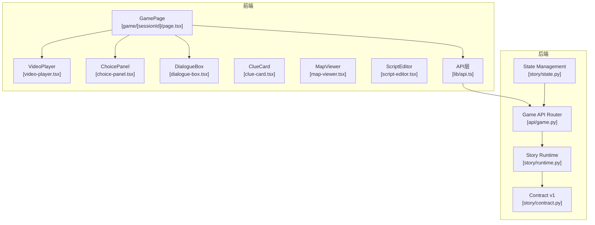
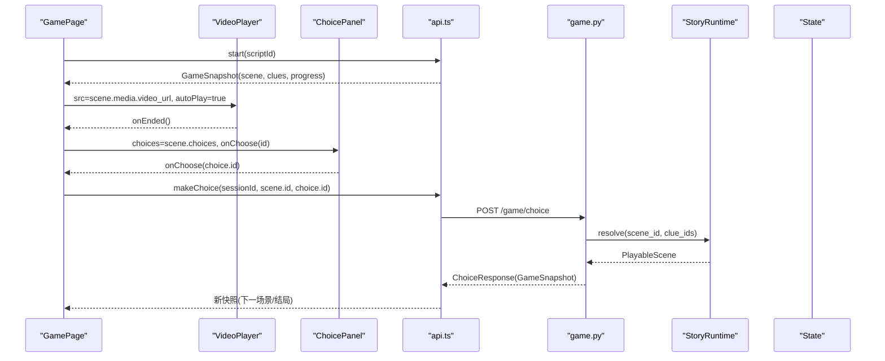
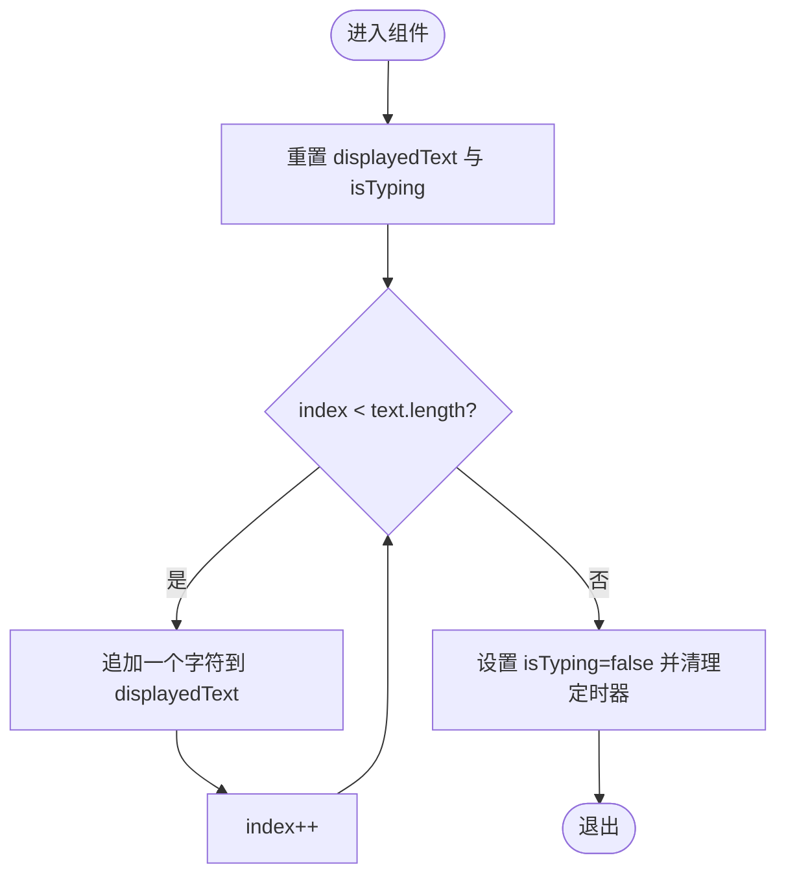
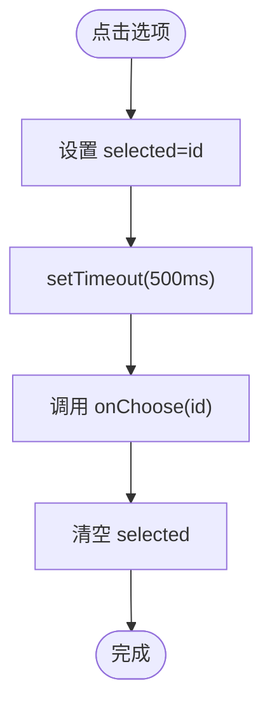
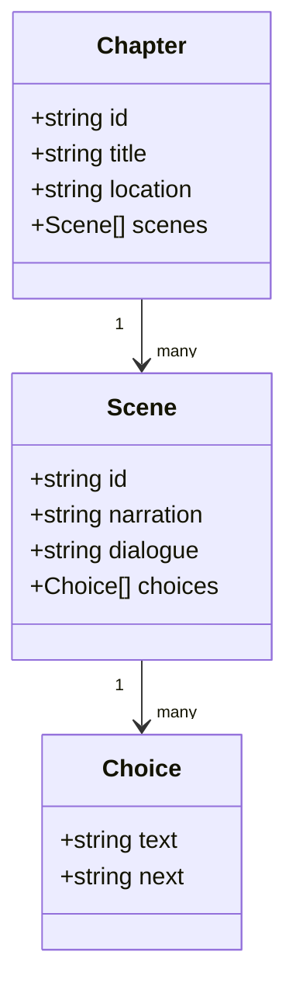
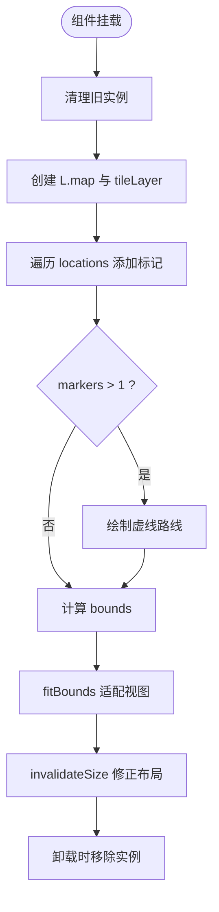
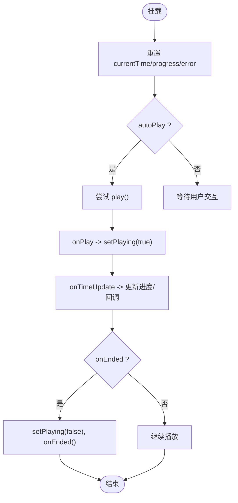
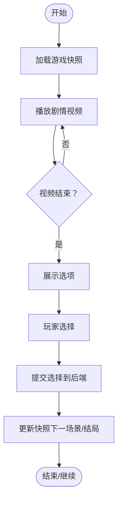
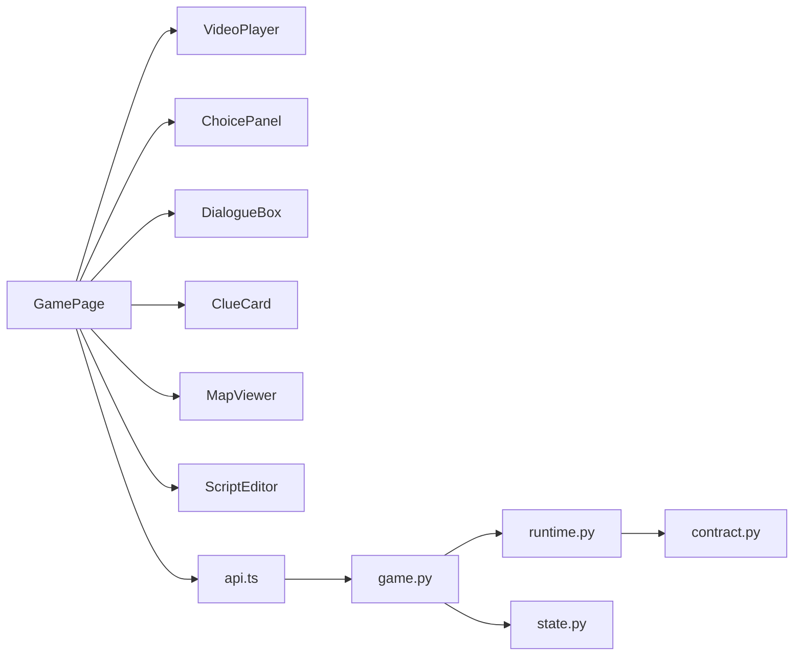

# 业务组件

<cite>
**本文引用的文件**   
- [dialogue-box.tsx](file://frontend/src/components/dialogue-box.tsx)
- [choice-panel.tsx](file://frontend/src/components/choice-panel.tsx)
- [script-editor.tsx](file://frontend/src/components/script-editor.tsx)
- [clue-card.tsx](file://frontend/src/components/clue-card.tsx)
- [map-viewer.tsx](file://frontend/src/components/map-viewer.tsx)
- [video-player.tsx](file://frontend/src/components/video-player.tsx)
- [api.ts](file://frontend/src/lib/api.ts)
- [page.tsx（游戏页）](file://frontend/src/app/game/[sessionId]/page.tsx)
- [page.tsx（线索页）](file://frontend/src/app/game/clues/page.tsx)
- [page.tsx（地图页）](file://frontend/src/app/game/map/page.tsx)
- [runtime.py](file://backend/app/story/runtime.py)
- [state.py](file://backend/app/story/state.py)
- [contract.py](file://backend/app/story/contract.py)
- [game.py（后端API路由）](file://backend/app/api/game.py)
</cite>

## 目录
1. [简介](#简介)
2. [项目结构](#项目结构)
3. [核心组件](#核心组件)
4. [架构总览](#架构总览)
5. [详细组件分析](#详细组件分析)
6. [依赖关系分析](#依赖关系分析)
7. [性能考量](#性能考量)
8. [故障排查指南](#故障排查指南)
9. [结论](#结论)
10. [附录：接口与扩展点](#附录接口与扩展点)

## 简介
本文件面向澳秘 Macau Mystery 项目的“业务组件”进行系统化文档化，覆盖对话、选择、剧本编辑、线索卡片、地图查看器与视频播放器等关键前端组件，并结合后端故事运行时与状态管理，解释组件间通信机制、状态管理与数据流设计。文档同时提供 Props 接口说明、事件回调约定、自定义扩展点以及集成示例路径，帮助开发者快速理解并扩展这些组件。

## 项目结构
前端采用 Next.js + React 的客户端组件模式，业务组件集中在 components 目录；页面级容器在 app/game 下组织，负责组合业务组件并与 API 交互。后端使用 FastAPI 暴露游戏相关 API，并通过 story 模块实现严格的版本化剧本契约与运行时解析。

图表来源 
- [page.tsx（游戏页）:1-194](file://frontend/src/app/game/[sessionId]/page.tsx#L1-L194)
- [video-player.tsx:1-148](file://frontend/src/components/video-player.tsx#L1-L148)
- [choice-panel.tsx:1-47](file://frontend/src/components/choice-panel.tsx#L1-L47)
- [dialogue-box.tsx:1-63](file://frontend/src/components/dialogue-box.tsx#L1-L63)
- [clue-card.tsx:1-56](file://frontend/src/components/clue-card.tsx#L1-L56)
- [map-viewer.tsx:1-102](file://frontend/src/components/map-viewer.tsx#L1-L102)
- [script-editor.tsx:1-167](file://frontend/src/components/script-editor.tsx#L1-L167)
- [api.ts:1-216](file://frontend/src/lib/api.ts#L1-L216)
- [game.py（后端API路由）:1-37](file://backend/app/api/game.py#L1-L37)
- [runtime.py:1-80](file://backend/app/story/runtime.py#L1-L80)
- [state.py:1-54](file://backend/app/story/state.py#L1-L54)
- [contract.py:1-128](file://backend/app/story/contract.py#L1-L128)

章节来源
- [page.tsx（游戏页）:1-194](file://frontend/src/app/game/[sessionId]/page.tsx#L1-L194)
- [api.ts:1-216](file://frontend/src/lib/api.ts#L1-L216)
- [game.py（后端API路由）:1-37](file://backend/app/api/game.py#L1-L37)
- [runtime.py:1-80](file://backend/app/story/runtime.py#L1-L80)
- [state.py:1-54](file://backend/app/story/state.py#L1-L54)
- [contract.py:1-128](file://backend/app/story/contract.py#L1-L128)

## 核心组件
本节对六大业务组件逐一进行职责、Props、事件与扩展点的说明，并给出与页面容器的集成方式。

- DialogueBox（对话框）
  - 职责：以打字机效果展示 NPC 对话文本，支持头像与可选音频播放按钮。
  - Props：npc（角色名）、avatar（头像标识或字符）、text（对话文本）、audioUrl（可选音频地址）。
  - 事件：无对外事件，内部通过定时器驱动文本逐字显示。
  - 扩展点：可接入 TTS 服务，点击音频按钮时调用 aiApi.getTts 获取语音并播放。
  - 使用场景：剧情对话展示、NPC 互动提示。

- ChoicePanel（选择面板）
  - 职责：渲染选项列表，处理用户选择并延迟触发回调，避免重复提交。
  - Props：choices（选项数组，含 id 与 text）、onChoose（选择回调）。
  - 事件：onChoose(id) 在选中后延迟触发，内部维护 selected 状态防止连击。
  - 扩展点：可在 onChoose 中结合 gameApi.makeChoice 推进剧情。
  - 使用场景：分支剧情选择、条件跳转。

- ScriptEditor（剧本编辑器）
  - 职责：可视化编辑章节、场景、描述、对话与选项跳转，用于 UGC 创作。
  - Props：无外部 Props（内部维护 chapters 状态）。
  - 事件：增删章节/场景、编辑字段；可扩展保存/校验/导出 JSON。
  - 扩展点：对接 ugcApi 或 adminApi 进行脚本创建、发布与预览。
  - 使用场景：创作者后台、AI 生成后的编辑界面。

- ClueCard（线索卡片）
  - 职责：展示已收集或未解锁的线索信息，包含标题、描述、位置与图标。
  - Props：id、title、description、location、collected、icon。
  - 事件：无对外事件，仅根据 collected 控制样式与内容。
  - 扩展点：点击可展开详情或跳转到对应地点。
  - 使用场景：线索背包页、收集进度展示。

- MapViewer（地图查看器）
  - 职责：基于 Leaflet 渲染澳门历史城区地点标记、路线与弹窗信息。
  - Props：locations（地点数组，含 id、name、lat、lng、status、description）。
  - 事件：无对外事件，内部监听 locations 变化重建地图实例。
  - 扩展点：可添加点击导航、当前定位高亮、动态更新标记状态。
  - 使用场景：探案路线地图、地点导览。

- VideoPlayer（视频播放器）
  - 职责：封装 HTML5 视频播放，提供自动播放、进度条、静音切换、错误回退。
  - Props：src、poster、onEnded、onTimeUpdate、autoPlay、className。
  - 事件：onEnded()、onTimeUpdate(currentTime, duration)。
  - 扩展点：可接入字幕、倍速、全屏、预加载策略。
  - 使用场景：剧情视频播放、结尾画面。

章节来源
- [dialogue-box.tsx:1-63](file://frontend/src/components/dialogue-box.tsx#L1-L63)
- [choice-panel.tsx:1-47](file://frontend/src/components/choice-panel.tsx#L1-L47)
- [script-editor.tsx:1-167](file://frontend/src/components/script-editor.tsx#L1-L167)
- [clue-card.tsx:1-56](file://frontend/src/components/clue-card.tsx#L1-L56)
- [map-viewer.tsx:1-102](file://frontend/src/components/map-viewer.tsx#L1-L102)
- [video-player.tsx:1-148](file://frontend/src/components/video-player.tsx#L1-L148)

## 架构总览
前端 GamePage 作为容器，组合 VideoPlayer、ChoicePanel、DialogueBox 等业务组件，并通过 api.ts 调用后端 /game/* 接口。后端由 FastAPI 路由转发到 GameService，StoryRuntime 依据 contract 定义的 v1 剧本结构解析场景与选择，state.py 维护会话状态。

图表来源 
- [page.tsx（游戏页）:1-194](file://frontend/src/app/game/[sessionId]/page.tsx#L1-L194)
- [video-player.tsx:1-148](file://frontend/src/components/video-player.tsx#L1-L148)
- [choice-panel.tsx:1-47](file://frontend/src/components/choice-panel.tsx#L1-L47)
- [api.ts:1-216](file://frontend/src/lib/api.ts#L1-L216)
- [game.py（后端API路由）:1-37](file://backend/app/api/game.py#L1-L37)
- [runtime.py:1-80](file://backend/app/story/runtime.py#L1-L80)
- [state.py:1-54](file://backend/app/story/state.py#L1-L54)

## 详细组件分析

### DialogueBox（对话框）
- 设计模式：受控文本展示 + 定时器动画。
- 数据结构：本地 displayedText、isTyping 状态。
- 复杂度：O(n) 文本逐字渲染，n 为文本长度。
- 错误处理：无外部依赖，异常概率低。
- 性能优化：文本过长时可分段渲染或限制最大长度。
- 扩展建议：增加暂停/继续、跳过、音量控制、TTS 集成。

图表来源 
- [dialogue-box.tsx:1-63](file://frontend/src/components/dialogue-box.tsx#L1-L63)

章节来源
- [dialogue-box.tsx:1-63](file://frontend/src/components/dialogue-box.tsx#L1-L63)

### ChoicePanel（选择面板）
- 设计模式：受控选择 + 防抖延迟回调。
- 数据结构：selected 状态防止重复选择。
- 复杂度：O(m) 渲染 m 个选项。
- 错误处理：禁用已选按钮，避免重复提交。
- 性能优化：大列表可虚拟滚动。
- 扩展建议：支持多选、条件禁用、键盘导航。

图表来源 
- [choice-panel.tsx:1-47](file://frontend/src/components/choice-panel.tsx#L1-L47)

章节来源
- [choice-panel.tsx:1-47](file://frontend/src/components/choice-panel.tsx#L1-L47)

### ScriptEditor（剧本编辑器）
- 设计模式：表单驱动的状态编辑，层级结构（章节-场景-选项）。
- 数据结构：chapters 数组，每个 chapter 包含 scenes 与 location/title。
- 复杂度：增删改 O(1)/O(n) 取决于操作位置。
- 错误处理：基础输入占位符，可扩展校验规则。
- 性能优化：大剧本可分页编辑或懒加载。
- 扩展建议：JSON 导入/导出、版本对比、AI 辅助生成。

图表来源 
- [script-editor.tsx:1-167](file://frontend/src/components/script-editor.tsx#L1-L167)

章节来源
- [script-editor.tsx:1-167](file://frontend/src/components/script-editor.tsx#L1-L167)

### ClueCard（线索卡片）
- 设计模式：纯展示组件，按 collected 切换视觉状态。
- 数据结构：props 直接驱动 UI。
- 复杂度：O(1)。
- 错误处理：无外部依赖。
- 性能优化：批量渲染时使用 key 稳定 ID。
- 扩展建议：点击展开详情、收藏/分享、搜索过滤。

章节来源
- [clue-card.tsx:1-56](file://frontend/src/components/clue-card.tsx#L1-L56)

### MapViewer（地图查看器）
- 设计模式：副作用驱动（useEffect），生命周期内初始化/销毁 Leaflet 实例。
- 数据结构：locations 数组驱动标记与路线绘制。
- 复杂度：O(k) 标记数量。
- 错误处理：严格模式双挂载清理、容器尺寸修正。
- 性能优化：按需加载地图库、标记聚合。
- 扩展建议：地理围栏、实时定位、图层切换。

图表来源 
- [map-viewer.tsx:1-102](file://frontend/src/components/map-viewer.tsx#L1-L102)

章节来源
- [map-viewer.tsx:1-102](file://frontend/src/components/map-viewer.tsx#L1-L102)

### VideoPlayer（视频播放器）
- 设计模式：受控媒体播放，状态包括 playing/muted/progress/error。
- 数据结构：videoRef 引用原生 video 元素。
- 复杂度：事件驱动，O(1) 状态更新。
- 错误处理：autoplay 失败回退、错误态兜底 UI。
- 性能优化：预加载策略、节流时间更新。
- 扩展建议：字幕轨道、画中画、截图分享。

图表来源 
- [video-player.tsx:1-148](file://frontend/src/components/video-player.tsx#L1-L148)

章节来源
- [video-player.tsx:1-148](file://frontend/src/components/video-player.tsx#L1-L148)

### 概念性概览
以下流程图展示玩家从开始游戏到做出选择的整体流程，不绑定具体代码文件。

## 依赖关系分析
- 前端组件依赖：
  - GamePage 依赖 VideoPlayer、ChoicePanel、DialogueBox、ClueCard、MapViewer、ScriptEditor。
  - 所有组件通过 api.ts 统一访问后端接口。
- 后端依赖：
  - game.py 路由依赖 GameService（未在本仓库列出实现），StoryRuntime 依赖 contract 定义。
  - state.py 提供会话状态模型。

图表来源 
- [page.tsx（游戏页）:1-194](file://frontend/src/app/game/[sessionId]/page.tsx#L1-L194)
- [api.ts:1-216](file://frontend/src/lib/api.ts#L1-L216)
- [game.py（后端API路由）:1-37](file://backend/app/api/game.py#L1-L37)
- [runtime.py:1-80](file://backend/app/story/runtime.py#L1-L80)
- [state.py:1-54](file://backend/app/story/state.py#L1-L54)
- [contract.py:1-128](file://backend/app/story/contract.py#L1-L128)

章节来源
- [page.tsx（游戏页）:1-194](file://frontend/src/app/game/[sessionId]/page.tsx#L1-L194)
- [api.ts:1-216](file://frontend/src/lib/api.ts#L1-L216)
- [game.py（后端API路由）:1-37](file://backend/app/api/game.py#L1-L37)
- [runtime.py:1-80](file://backend/app/story/runtime.py#L1-L80)
- [state.py:1-54](file://backend/app/story/state.py#L1-L54)
- [contract.py:1-128](file://backend/app/story/contract.py#L1-L128)

## 性能考量
- DialogueBox：长文本打字动画可能阻塞主线程，建议分片渲染或使用 requestAnimationFrame。
- ChoicePanel：大量选项时应考虑虚拟化列表与键盘可达性。
- ScriptEditor：大剧本编辑需分页/懒加载，避免一次性渲染过多 DOM。
- MapViewer：Leaflet 标记过多时需聚合或按需加载；严格模式下确保清理实例避免内存泄漏。
- VideoPlayer：频繁 onTimeUpdate 应节流；启用 preload 与合适的编码格式提升首帧速度。
- 网络请求：合并请求、缓存快照、错误重试与降级策略。

## 故障排查指南
- 视频无法自动播放：检查浏览器策略与用户交互要求，参考 VideoPlayer 的 catch 分支。
- 地图渲染异常：确认容器尺寸与 invalidateSize 调用时机，检查 locations 数据有效性。
- 选择无效：核对 choice.id 与后端 scene.choices 是否匹配，检查 StoryRuntime 的路由条件。
- 线索未解锁：确认 collected 状态与后端授予逻辑一致。
- 国际化文案缺失：检查 i18n context 的 translations 键值是否存在。

章节来源
- [video-player.tsx:1-148](file://frontend/src/components/video-player.tsx#L1-L148)
- [map-viewer.tsx:1-102](file://frontend/src/components/map-viewer.tsx#L1-L102)
- [runtime.py:1-80](file://backend/app/story/runtime.py#L1-L80)
- [i18n/context.tsx:1-56](file://frontend/src/lib/i18n/context.tsx#L1-L56)

## 结论
Macau Mystery 的业务组件围绕“视频叙事 + 分支选择 + 线索收集 + 地图探索”的核心体验构建，前端组件职责清晰、接口简洁，后端通过严格的合同与运行时保证剧情一致性。建议在后续迭代中增强性能优化、可访问性与扩展点，以提升创作与游玩体验。

## 附录：接口与扩展点

### 前端 API 类型与调用
- GameMedia：视频与海报元数据。
- GameChoice：选项与预加载场景/媒体。
- GameChapter/Scene：章节与场景结构。
- GameClue/GameProgress/GameEnding/GameSnapshot：线索、进度、结局与完整快照。
- 调用方法：
  - gameApi.start(scriptId)：开始游戏。
  - gameApi.makeChoice(sessionId, sceneId, choiceId)：提交选择。
  - gameApi.getState(sessionId)：获取状态。

章节来源
- [api.ts:1-216](file://frontend/src/lib/api.ts#L1-L216)

### 后端契约与运行时
- contract.py：v1 剧本严格模型，定义 Media、Choice、RouteCondition、VideoScene、EndingScene、RouterScene、Chapter、ClueDefinition、StoryDocument。
- runtime.py：StoryGraph 解析场景、路由与选择，支持条件匹配与循环检测。
- state.py：GameSession 维护章节/场景索引、线索与选择历史。

章节来源
- [contract.py:1-128](file://backend/app/story/contract.py#L1-L128)
- [runtime.py:1-80](file://backend/app/story/runtime.py#L1-L80)
- [state.py:1-54](file://backend/app/story/state.py#L1-L54)

### 页面集成示例（路径）
- 游戏主流程：[page.tsx（游戏页）:1-194](file://frontend/src/app/game/[sessionId]/page.tsx#L1-L194)
- 线索背包：[page.tsx（线索页）:1-68](file://frontend/src/app/game/clues/page.tsx#L1-L68)
- 地图导览：[page.tsx（地图页）:1-59](file://frontend/src/app/game/map/page.tsx#L1-L59)

章节来源
- [page.tsx（游戏页）:1-194](file://frontend/src/app/game/[sessionId]/page.tsx#L1-L194)
- [page.tsx（线索页）:1-68](file://frontend/src/app/game/clues/page.tsx#L1-L68)
- [page.tsx（地图页）:1-59](file://frontend/src/app/game/map/page.tsx#L1-L59)