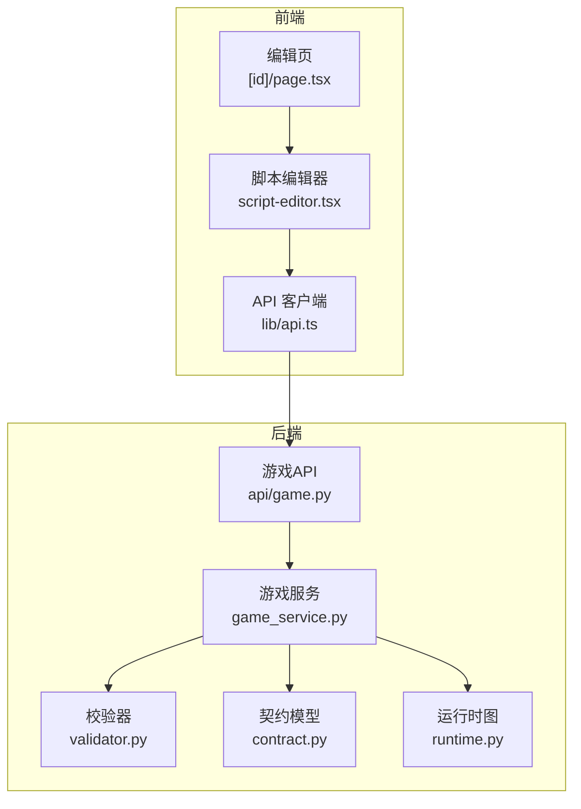
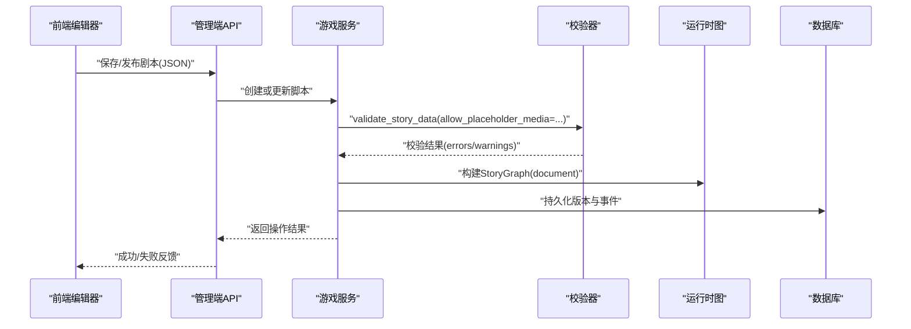
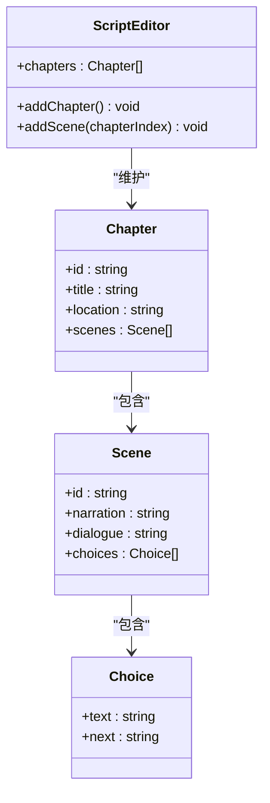
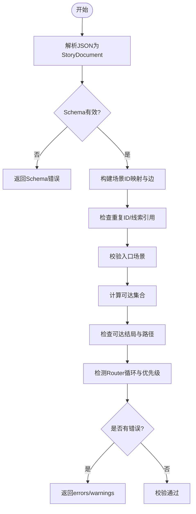
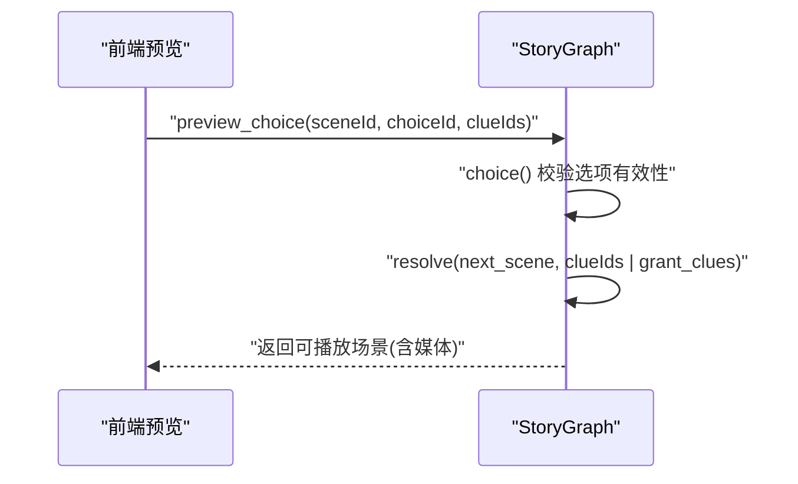
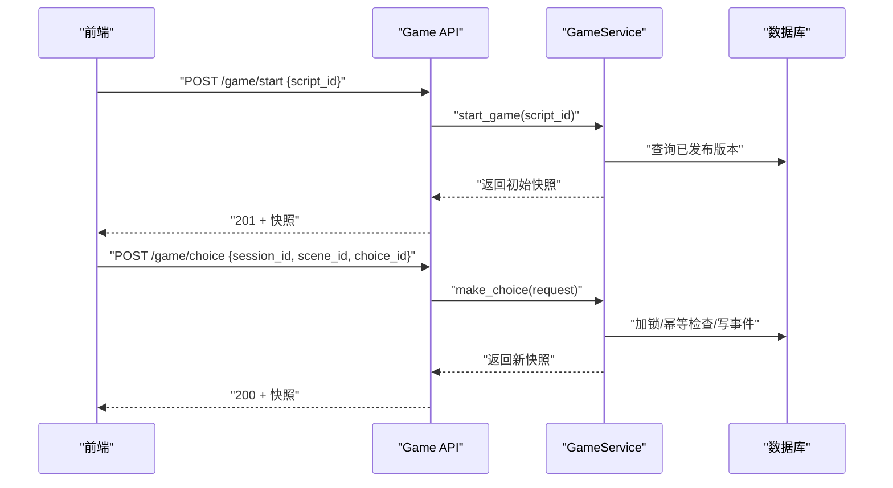
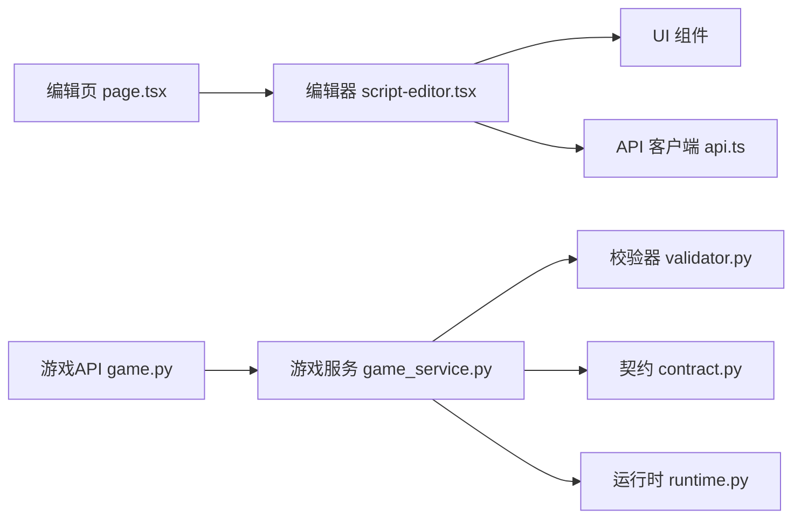

# 剧本编辑器组件 (ScriptEditor)

<cite>
**本文引用的文件**   
- [script-editor.tsx](file://frontend/src/components/script-editor.tsx)
- [page.tsx](file://frontend/src/app/admin/scripts/[id]/page.tsx)
- [api.ts](file://frontend/src/lib/api.ts)
- [validator.py](file://backend/app/story/validator.py)
- [contract.py](file://backend/app/story/contract.py)
- [runtime.py](file://backend/app/story/runtime.py)
- [engine.py](file://backend/app/story/engine.py)
- [game_service.py](file://backend/app/game_service.py)
- [game.py](file://backend/app/api/game.py)
</cite>

## 目录
1. [简介](#简介)
2. [项目结构](#项目结构)
3. [核心组件](#核心组件)
4. [架构总览](#架构总览)
5. [详细组件分析](#详细组件分析)
6. [依赖关系分析](#依赖关系分析)
7. [性能与可用性考量](#性能与可用性考量)
8. [故障排查指南](#故障排查指南)
9. [结论](#结论)
10. [附录：使用示例与扩展指南](#附录使用示例与扩展指南)

## 简介
本文件围绕前端“剧本编辑器组件”（ScriptEditor）进行系统化文档化，重点覆盖以下方面：
- 富文本编辑能力、JSON 格式校验、实时预览等核心特性
- 组件状态管理与数据绑定机制
- 错误处理与用户提示系统
- 高级功能：代码高亮、自动补全、版本对比的实现思路与集成方式
- 与后端 API 的数据同步流程与最佳实践
- 自定义主题配置、快捷键支持与导出功能的落地方案

说明：当前仓库中的 ScriptEditor 为轻量级可视化编辑器，提供章节/场景的增删改与基础字段编辑。后续章节将结合后端验证与运行时契约，给出增强型实现的指导与参考路径。

## 项目结构
- 前端
  - 页面层：admin/scripts/[id]/page.tsx 作为编辑页入口，嵌入 ScriptEditor
  - 组件层：components/script-editor.tsx 实现编辑器 UI 与本地状态
  - 接口层：lib/api.ts 封装了游戏、UGC、管理端等 API 调用
- 后端
  - 故事契约与校验：story/contract.py、story/validator.py
  - 运行时图与解析：story/runtime.py
  - 引擎与状态：story/engine.py、story/state.py
  - 服务与API：app/game_service.py、app/api/game.py

图表来源
- [page.tsx:1-61](file://frontend/src/app/admin/scripts/[id]/page.tsx#L1-L61)
- [script-editor.tsx:1-167](file://frontend/src/components/script-editor.tsx#L1-L167)
- [api.ts:1-216](file://frontend/src/lib/api.ts#L1-L216)
- [validator.py:1-251](file://backend/app/story/validator.py#L1-L251)
- [contract.py:1-128](file://backend/app/story/contract.py#L1-L128)
- [runtime.py:1-80](file://backend/app/story/runtime.py#L1-L80)
- [game_service.py:1-386](file://backend/app/game_service.py#L1-L386)
- [game.py:1-37](file://backend/app/api/game.py#L1-L37)

章节来源
- [page.tsx:1-61](file://frontend/src/app/admin/scripts/[id]/page.tsx#L1-L61)
- [script-editor.tsx:1-167](file://frontend/src/components/script-editor.tsx#L1-L167)
- [api.ts:1-216](file://frontend/src/lib/api.ts#L1-L216)

## 核心组件
- ScriptEditor 组件职责
  - 维护章节与场景的本地状态（标题、地点、描述、对话、选项）
  - 提供添加/删除章节与场景的交互
  - 渲染表单控件（输入框、文本域）并展示基础元信息
- 数据结构
  - Chapter：包含 id、title、location、scenes
  - Scene：包含 id、narration、dialogue、choices（text、next）
- 交互流程
  - 点击“添加章节”生成新章节
  - 点击“添加场景”在当前章节追加场景
  - 各字段通过默认值初始化，便于快速编辑

章节来源
- [script-editor.tsx:18-73](file://frontend/src/components/script-editor.tsx#L18-L73)
- [script-editor.tsx:75-166](file://frontend/src/components/script-editor.tsx#L75-L166)

## 架构总览
从编辑器到运行时的整体链路如下：
- 前端编辑器负责结构化数据的采集与展示
- 后端通过严格的 Pydantic 契约定义 JSON 结构
- 校验器对结构完整性、跳转目标、可达性、循环等进行全面检查
- 运行时图根据线索与路由规则解析下一场景
- 游戏服务在事务中推进会话状态，返回快照供前端渲染

图表来源
- [api.ts:160-195](file://frontend/src/lib/api.ts#L160-L195)
- [game_service.py:195-226](file://backend/app/game_service.py#L195-L226)
- [validator.py:40-51](file://backend/app/story/validator.py#L40-L51)
- [runtime.py:22-48](file://backend/app/story/runtime.py#L22-L48)

## 详细组件分析

### ScriptEditor 组件分析
- 状态管理
  - 使用 React useState 维护 chapters 数组
  - 新增章节/场景时采用不可变更新策略，确保渲染一致性
- 数据绑定
  - 表单控件以 defaultValue 初始化，适合一次性编辑；如需双向绑定可改为受控组件
- 错误处理与提示
  - 当前未集成后端校验结果；建议增加“校验并提示”按钮，将 errors/warnings 映射为界面提示
- 可扩展点
  - 引入富文本编辑器（如 TipTap/Quill）支持格式化
  - 接入 JSON Schema 校验库，实现实时语法与语义提示
  - 增加“实时预览”面板，基于 runtime.preview_choice 预取下一场景媒体

图表来源
- [script-editor.tsx:18-73](file://frontend/src/components/script-editor.tsx#L18-L73)

章节来源
- [script-editor.tsx:1-167](file://frontend/src/components/script-editor.tsx#L1-L167)

### 后端契约与校验
- 契约模型（contract.py）
  - 严格定义 StoryDocument、Chapter、Scene（Video/Ending/Router）、Choice、Route、ClueDefinition 等
  - 使用 Pydantic 的 Literal、Field、model_validator 等约束类型与业务规则
- 校验器（validator.py）
  - 校验重复 ID、未知线索引用、缺失跳转目标、入口场景合法性、可达性与结局存在性
  - 检测 Router 循环与默认路由优先级
  - 输出 ValidationIssue 列表（code/path/message），便于前端定位问题

图表来源
- [validator.py:40-190](file://backend/app/story/validator.py#L40-L190)
- [contract.py:10-128](file://backend/app/story/contract.py#L10-L128)

章节来源
- [validator.py:1-251](file://backend/app/story/validator.py#L1-L251)
- [contract.py:1-128](file://backend/app/story/contract.py#L1-L128)

### 运行时图与选择解析
- StoryGraph
  - 维护 scene_id -> SceneContext 的映射
  - resolve(scene_id, clue_ids) 按路由规则解析最终可播放场景
  - preview_choice(scene_id, choice_id, clue_ids) 用于前端预览下一场景
- 路由匹配
  - 支持 min_clue_count、all_clues、any_clues、default 条件
  - 按 priority 排序选择匹配路由

图表来源
- [runtime.py:37-61](file://backend/app/story/runtime.py#L37-L61)

章节来源
- [runtime.py:1-80](file://backend/app/story/runtime.py#L1-L80)

### 游戏服务与API
- GameService
  - start_game：加载已发布版本，校验入口场景，创建会话并记录事件
  - make_choice：幂等处理、并发锁、奖励线索、推进状态、生成快照
  - get_state：返回当前会话快照
- API 路由
  - /game/start、/game/choice、/game/state/{session_id}

图表来源
- [game.py:15-36](file://backend/app/api/game.py#L15-L36)
- [game_service.py:35-61](file://backend/app/game_service.py#L35-L61)
- [game_service.py:70-193](file://backend/app/game_service.py#L70-L193)

章节来源
- [game_service.py:1-386](file://backend/app/game_service.py#L1-L386)
- [game.py:1-37](file://backend/app/api/game.py#L1-L37)

## 依赖关系分析
- 前端依赖
  - 页面层依赖编辑器组件与 UI 基础组件
  - 编辑器组件依赖 UI 组件（Button/Input/Textarea/Card/Badge）
  - API 客户端统一封装请求头、鉴权与错误抛出
- 后端依赖
  - 服务层依赖校验器、契约模型与运行时图
  - API 路由依赖服务层，服务层依赖数据库会话

图表来源
- [page.tsx:1-61](file://frontend/src/app/admin/scripts/[id]/page.tsx#L1-L61)
- [script-editor.tsx:1-167](file://frontend/src/components/script-editor.tsx#L1-L167)
- [api.ts:1-216](file://frontend/src/lib/api.ts#L1-L216)
- [game.py:1-37](file://backend/app/api/game.py#L1-L37)
- [game_service.py:1-386](file://backend/app/game_service.py#L1-L386)
- [validator.py:1-251](file://backend/app/story/validator.py#L1-L251)
- [contract.py:1-128](file://backend/app/story/contract.py#L1-L128)
- [runtime.py:1-80](file://backend/app/story/runtime.py#L1-L80)

章节来源
- [api.ts:1-216](file://frontend/src/lib/api.ts#L1-L216)
- [game_service.py:1-386](file://backend/app/game_service.py#L1-L386)

## 性能与可用性考量
- 编辑器性能
  - 大文档场景下避免频繁重渲染，建议使用不可变更新与局部 key 优化
  - 富文本编辑器应启用增量更新与防抖保存
- 校验与预览
  - 将耗时校验放在后端，前端仅做轻量 Schema 校验与即时提示
  - 预览调用需限制频率，必要时缓存 preview_choice 结果
- 网络与幂等
  - 使用 request_id 保证幂等，避免重复提交导致的状态不一致
  - 错误重试与超时控制需合理设置

## 故障排查指南
- 常见校验错误
  - 重复 ID、未知线索引用、缺失跳转目标、入口场景不合法、无可达结局、Router 循环等
- 运行时错误
  - 未知场景、非 Video 场景选择、Router 循环、超过最大跳数
- 服务层错误
  - 会话不存在、会话已完成、场景不匹配、幂等冲突、故事数据损坏
- 前端处理建议
  - 将后端 errors/warnings 映射为 Toast 或行内提示
  - 对 4xx/5xx 进行分级提示与重试策略

章节来源
- [validator.py:40-190](file://backend/app/story/validator.py#L40-L190)
- [runtime.py:37-80](file://backend/app/story/runtime.py#L37-L80)
- [game_service.py:70-193](file://backend/app/game_service.py#L70-L193)

## 结论
当前 ScriptEditor 提供了基础的章节/场景编辑能力，配合后端的严格契约与校验体系，可实现可靠的剧本管理与运行。下一步建议：
- 引入富文本与 JSON Schema 校验，提升编辑体验与数据质量
- 集成实时预览与错误提示，缩短排错路径
- 完善导出与版本对比功能，支撑协作与审计需求

## 附录：使用示例与扩展指南

### 与后端 API 的数据同步
- 保存/更新剧本
  - 使用 adminApi.createScript/updateScript 提交结构化 JSON
  - 接收后端返回的操作结果，并在编辑器中显示校验消息
- 发布与预览
  - 使用 adminApi.publishScript 发布版本
  - 使用 gameApi.start 启动游戏，获取初始快照
  - 使用 gameApi.makeChoice 推进剧情，实时更新预览面板

章节来源
- [api.ts:160-195](file://frontend/src/lib/api.ts#L160-L195)
- [api.ts:84-109](file://frontend/src/lib/api.ts#L84-L109)

### 自定义主题配置
- 基于 UI 组件的主题变量（颜色、圆角、间距）进行全局定制
- 编辑器卡片、输入框、按钮样式可通过 className 覆盖
- 建议在 providers 或全局样式文件中集中管理主题

章节来源
- [card.tsx:1-104](file://frontend/src/components/ui/card.tsx#L1-L104)
- [button.tsx:1-59](file://frontend/src/components/ui/button.tsx#L1-L59)

### 快捷键支持
- 为常用操作（新建章节、保存、校验、导出）绑定键盘快捷键
- 使用浏览器事件监听与组合键（Ctrl/Cmd + S）触发保存
- 注意与浏览器默认行为冲突的处理

### 导出功能
- 导出为 JSON：序列化 chapters 结构，下载文件
- 导出为 Markdown：将章节与场景转换为可读文本
- 导出为 PDF：借助第三方库生成打印友好的文档

### 代码高亮与自动补全
- 富文本编辑器：集成 TipTap/Quill，启用 JSON/Markdown 模式
- 自动补全：基于 contract.py 的结构定义，提供字段与枚举提示
- 实时校验：对接 validator.py 的错误码，即时标注问题位置

### 版本对比
- 对比两个版本的 JSON 差异，突出新增/修改/删除的场景与选项
- 使用 diff 算法（如 json-diff）生成可视化的变更报告
- 支持回滚与合并冲突解决

### 实时预览
- 基于 runtime.preview_choice 预取下一场景媒体与内容
- 在编辑器右侧展示预览面板，随编辑内容动态更新
- 对预览结果进行缓存，减少重复请求