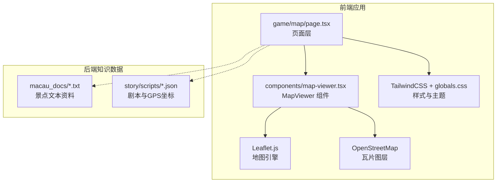
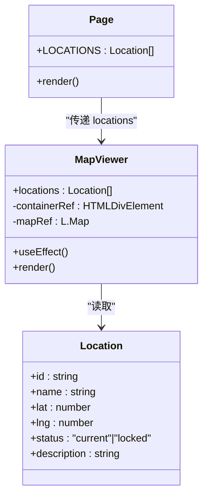
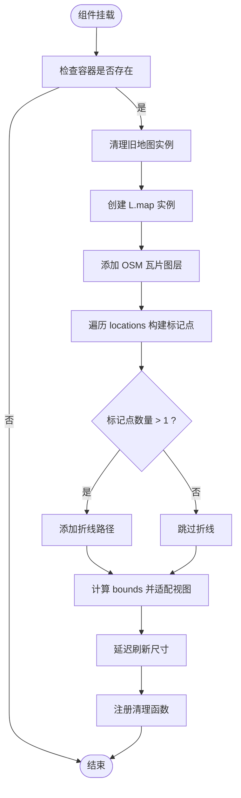
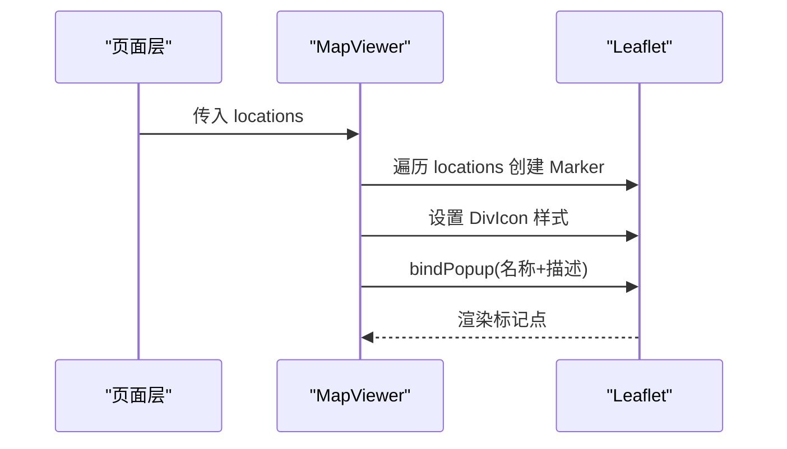
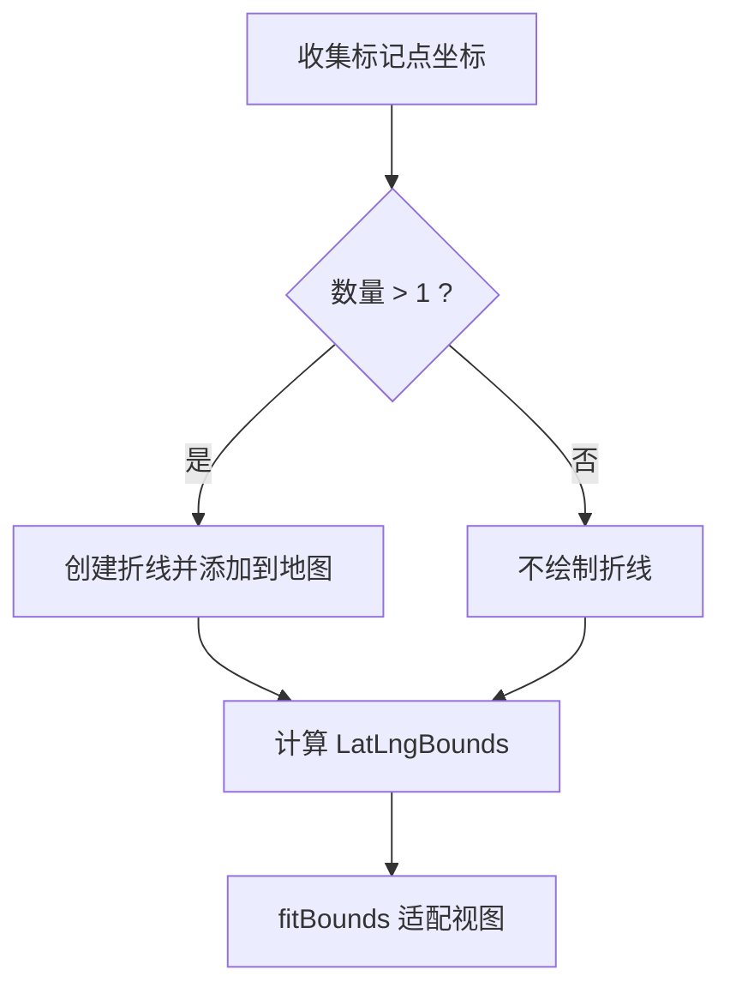
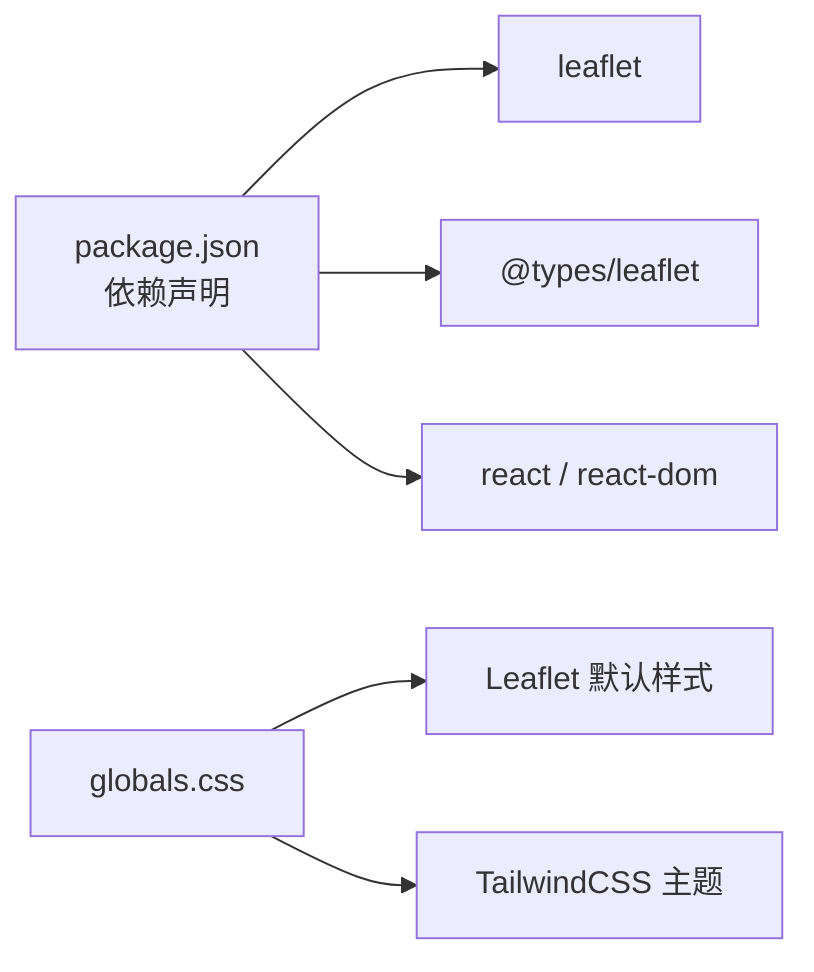

# 地图查看器组件 (MapViewr)

<cite>
**本文引用的文件**   
- [map-viewer.tsx](file://frontend/src/components/map-viewer.tsx)
- [page.tsx](file://frontend/src/app/game/map/page.tsx)
- [globals.css](file://frontend/src/app/globals.css)
- [package.json](file://frontend/package.json)
- [a_ma_temple.txt](file://backend/app/knowledge/macau_docs/a_ma_temple.txt)
- [ruins_of_st_paul.txt](file://backend/app/knowledge/macau_docs/ruins_of_st_paul.txt)
- [macau_mystery_01.json](file://backend/app/story/scripts/macau_mystery_01.json)
</cite>

## 目录
1. [简介](#简介)
2. [项目结构](#项目结构)
3. [核心组件](#核心组件)
4. [架构总览](#架构总览)
5. [详细组件分析](#详细组件分析)
6. [依赖关系分析](#依赖关系分析)
7. [性能考量](#性能考量)
8. [故障排查指南](#故障排查指南)
9. [结论](#结论)
10. [附录：使用示例与扩展指南](#附录使用示例与扩展指南)

## 简介
本文件面向“澳门历史城区”探案游戏的前端地图查看器组件 MapViewer，基于 Leaflet.js 实现。文档将系统阐述地图初始化、标记点管理、路径绘制、状态管理与事件处理机制，以及与游戏场景坐标映射关系；并给出交互能力（缩放、平移、点击、路线规划）的实现说明，以及自定义图层、热力图效果与移动端适配的实践建议。同时提供集成澳门历史城区景点数据的实际使用方式与代码片段路径指引。

## 项目结构
MapViewer 位于前端 Next.js 应用中，作为客户端组件动态加载，避免服务端渲染 Leaflet 导致的兼容问题。页面层负责数据准备与布局，组件层封装 Leaflet 的初始化与渲染逻辑。样式通过全局 CSS 引入 Leaflet 默认样式，并结合 TailwindCSS 进行主题化。

图表来源 
- [page.tsx:1-59](file://frontend/src/app/game/map/page.tsx#L1-L59)
- [map-viewer.tsx:1-102](file://frontend/src/components/map-viewer.tsx#L1-L102)
- [globals.css:1-5](file://frontend/src/app/globals.css#L1-L5)
- [package.json:11-25](file://frontend/package.json#L11-L25)

章节来源
- [page.tsx:1-59](file://frontend/src/app/game/map/page.tsx#L1-L59)
- [map-viewer.tsx:1-102](file://frontend/src/components/map-viewer.tsx#L1-L102)
- [globals.css:1-5](file://frontend/src/app/globals.css#L1-L5)
- [package.json:11-25](file://frontend/package.json#L11-L25)

## 核心组件
MapViewer 是一个纯客户端 React 组件，职责包括：
- 在容器元素中初始化 Leaflet 地图实例
- 添加 OpenStreetMap 瓦片图层
- 根据传入 locations 数组创建标记点（含自定义图标与弹窗）
- 按顺序绘制虚线折线路径
- 自动适配视图范围以包含所有标记点
- 清理与尺寸修复，确保在 React Strict Mode 与动态导入下稳定运行

关键数据结构 Location 定义：
- id: string
- name: string
- lat: number
- lng: number
- status: "current" | "locked"
- description: string

组件对外暴露 props：
- locations: Location[]

章节来源
- [map-viewer.tsx:6-17](file://frontend/src/components/map-viewer.tsx#L6-L17)
- [map-viewer.tsx:19-92](file://frontend/src/components/map-viewer.tsx#L19-L92)

## 架构总览
MapViewer 采用“页面层数据准备 + 组件层渲染”的分层模式。页面层提供景点坐标与状态，组件层专注地图渲染与交互。地图引擎为 Leaflet，瓦片服务为 OpenStreetMap。样式通过全局 CSS 引入 Leaflet 样式，并使用 TailwindCSS 构建界面。

图表来源 
- [map-viewer.tsx:6-17](file://frontend/src/components/map-viewer.tsx#L6-L17)
- [map-viewer.tsx:19-92](file://frontend/src/components/map-viewer.tsx#L19-L92)
- [page.tsx:11-18](file://frontend/src/app/game/map/page.tsx#L11-L18)

章节来源
- [page.tsx:1-59](file://frontend/src/app/game/map/page.tsx#L1-L59)
- [map-viewer.tsx:1-102](file://frontend/src/components/map-viewer.tsx#L1-L102)

## 详细组件分析

### 地图初始化与生命周期
- 使用 useRef 保存容器与地图实例，避免重复挂载导致内存泄漏
- useEffect 内完成：
  - 清理旧实例（应对 React Strict Mode 双重挂载）
  - 创建 L.map 实例，设置中心点与缩放级别，禁用滚轮缩放
  - 添加 OpenStreetMap 瓦片图层
  - 遍历 locations 生成标记点与折线
  - 计算 bounds 并调用 fitBounds 展示全部标记点
  - 延迟调用 invalidateSize 修复动态导入与容器尺寸变化导致的渲染问题
- 返回清理函数，移除定时器与地图实例

图表来源 
- [map-viewer.tsx:23-92](file://frontend/src/components/map-viewer.tsx#L23-L92)

章节来源
- [map-viewer.tsx:23-92](file://frontend/src/components/map-viewer.tsx#L23-L92)

### 标记点管理与弹窗
- 每个地点生成一个 L.marker，使用 L.divIcon 自定义圆形图标，颜色由 status 决定（当前点绿色，锁定点灰色）
- 绑定弹窗显示名称与描述信息
- 标记点坐标来源于 locations 的 lat/lng

图表来源 
- [map-viewer.tsx:45-62](file://frontend/src/components/map-viewer.tsx#L45-L62)

章节来源
- [map-viewer.tsx:45-62](file://frontend/src/components/map-viewer.tsx#L45-L62)

### 路径绘制与视图适配
- 当标记点数量大于 1 时，使用 L.polyline 按顺序连接各点，形成虚线路径
- 使用 L.latLngBounds 计算边界，并通过 map.fitBounds 自适应视图，预留内边距

图表来源 
- [map-viewer.tsx:64-78](file://frontend/src/components/map-viewer.tsx#L64-L78)

章节来源
- [map-viewer.tsx:64-78](file://frontend/src/components/map-viewer.tsx#L64-L78)

### 事件处理与交互能力
- 当前实现未显式监听地图事件（如 click、moveend），但具备基础交互能力：
  - 缩放：支持鼠标滚轮缩放（已禁用）、工具栏缩放
  - 平移：支持拖拽平移
  - 标记点点击：弹出名称与描述信息
- 如需增强交互（如点击标记跳转剧情、路线规划），可在组件内添加事件监听并在回调中触发业务逻辑

章节来源
- [map-viewer.tsx:33-37](file://frontend/src/components/map-viewer.tsx#L33-L37)
- [map-viewer.tsx:59-62](file://frontend/src/components/map-viewer.tsx#L59-L62)

### 与游戏场景的坐标映射关系
- 页面层 LOCATIONS 直接提供经纬度坐标，对应真实地理坐标（WGS84）
- 后端故事脚本 macau_mystery_01.json 中包含各章节的 GPS 坐标，可用于驱动地图定位与剧情推进
- 景点文本资料（如 a_ma_temple.txt、ruins_of_st_paul.txt）提供背景信息，可与弹窗内容或侧边列表结合展示

章节来源
- [page.tsx:11-18](file://frontend/src/app/game/map/page.tsx#L11-L18)
- [macau_mystery_01.json:1-33](file://backend/app/story/scripts/macau_mystery_01.json#L1-L33)
- [a_ma_temple.txt:1-7](file://backend/app/knowledge/macau_docs/a_ma_temple.txt#L1-L7)
- [ruins_of_st_paul.txt:1-1](file://backend/app/knowledge/macau_docs/ruins_of_st_paul.txt#L1-L1)

## 依赖关系分析
- 运行时依赖：
  - leaflet: 地图引擎
  - @types/leaflet: TypeScript 类型定义
  - react / react-dom: 组件框架
- 样式依赖：
  - globals.css 引入 Leaflet 默认样式
  - TailwindCSS 用于 UI 布局与主题变量

图表来源 
- [package.json:11-25](file://frontend/package.json#L11-L25)
- [globals.css:1-5](file://frontend/src/app/globals.css#L1-L5)

章节来源
- [package.json:11-25](file://frontend/package.json#L11-L25)
- [globals.css:1-5](file://frontend/src/app/globals.css#L1-L5)

## 性能考量
- 动态导入 MapViewer 避免 SSR 阶段加载 Leaflet，减少首屏体积与兼容性风险
- 使用 useRef 保存地图实例，避免重复创建与内存泄漏
- 仅在 locations 变化时重新渲染地图，降低不必要的重绘
- 使用 setTimeout 延迟 invalidateSize，确保容器尺寸稳定后再刷新，避免布局抖动
- 禁用滚轮缩放可减少频繁重绘，提升滚动体验

[本节为通用指导，无需引用具体文件]

## 故障排查指南
- 地图空白或尺寸异常：
  - 确认容器存在且具备高度（组件设置了 minHeight）
  - 检查是否调用了 invalidateSize 修复尺寸
- 标记点不显示：
  - 检查 locations 数据是否包含有效 lat/lng
  - 确认瓦片图层成功加载（网络与跨域）
- 弹窗内容为空：
  - 检查 location.name 与 description 字段是否正确传入
- 样式错乱：
  - 确认 globals.css 引入了 Leaflet 样式
  - 检查 Tailwind 配置与主题变量

章节来源
- [map-viewer.tsx:80-92](file://frontend/src/components/map-viewer.tsx#L80-L92)
- [globals.css:1-5](file://frontend/src/app/globals.css#L1-L5)

## 结论
MapViewer 组件以简洁清晰的职责划分实现了基于 Leaflet 的地图可视化功能，涵盖初始化、标记点管理、路径绘制与视图适配等核心能力。通过与页面层的数据协作及后端故事脚本的坐标支撑，能够很好地服务于“澳门历史城区”探案游戏的地图展示需求。后续可在此基础上扩展事件处理、自定义图层、热力图与移动端优化，进一步提升用户体验。

[本节为总结性内容，无需引用具体文件]

## 附录：使用示例与扩展指南

### 基本用法（集成景点数据）
- 在页面层准备 locations 数组，包含 id、name、lat、lng、status、description
- 将数组作为 props 传递给 MapViewer
- 组件会自动渲染地图、标记点与折线路径

参考路径：
- [page.tsx:11-18](file://frontend/src/app/game/map/page.tsx#L11-L18)
- [map-viewer.tsx:15-17](file://frontend/src/components/map-viewer.tsx#L15-L17)

### 与故事脚本坐标联动
- 从 macau_mystery_01.json 中读取章节的 GPS 坐标，驱动地图定位与剧情推进
- 可将当前章节坐标作为 center 与 zoom，或在标记点点击后切换至对应位置

参考路径：
- [macau_mystery_01.json:1-33](file://backend/app/story/scripts/macau_mystery_01.json#L1-L33)

### 自定义图层
- 替换瓦片图层 URL 以接入其他地图源（如高德、天地图）
- 添加叠加图层（如卫星图、地形图）

参考路径：
- [map-viewer.tsx:40-43](file://frontend/src/components/map-viewer.tsx#L40-L43)

### 热力图效果
- 引入 leaflet.heat 插件，将热点数据转换为热力图层叠加到地图
- 注意性能优化，按需更新热点数据

参考路径：
- [map-viewer.tsx:40-43](file://frontend/src/components/map-viewer.tsx#L40-L43)

### 移动端适配
- 启用触摸缩放与平移（默认支持）
- 调整 marker 大小与弹窗样式以适应小屏幕
- 考虑禁用滚轮缩放，避免误触

参考路径：
- [map-viewer.tsx:33-37](file://frontend/src/components/map-viewer.tsx#L33-L37)

### 事件处理增强
- 为标记点添加点击事件，跳转到对应剧情或展示详情
- 监听地图移动/缩放事件，记录用户浏览轨迹

参考路径：
- [map-viewer.tsx:59-62](file://frontend/src/components/map-viewer.tsx#L59-L62)