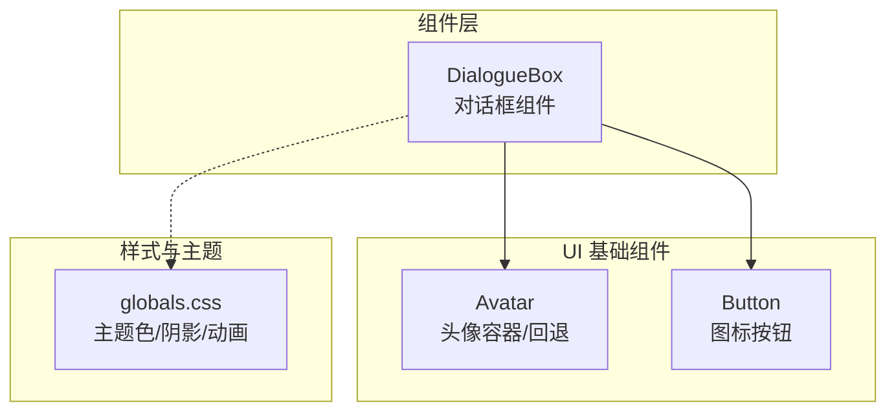
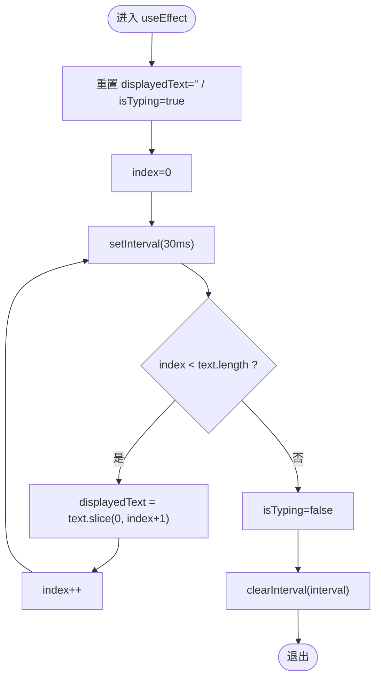
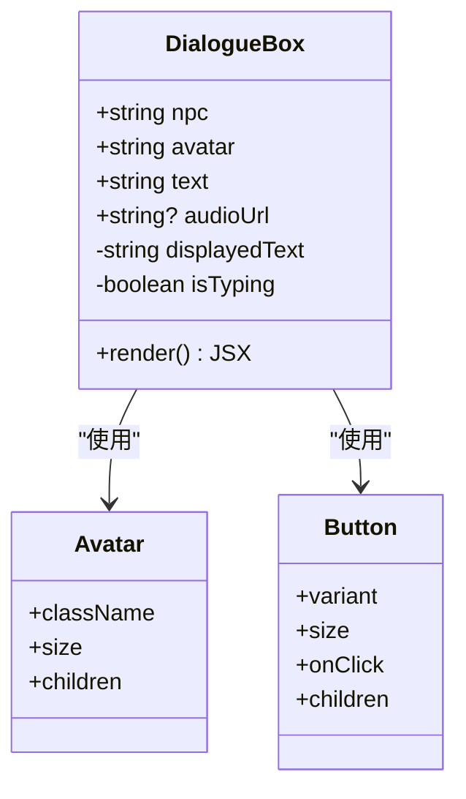
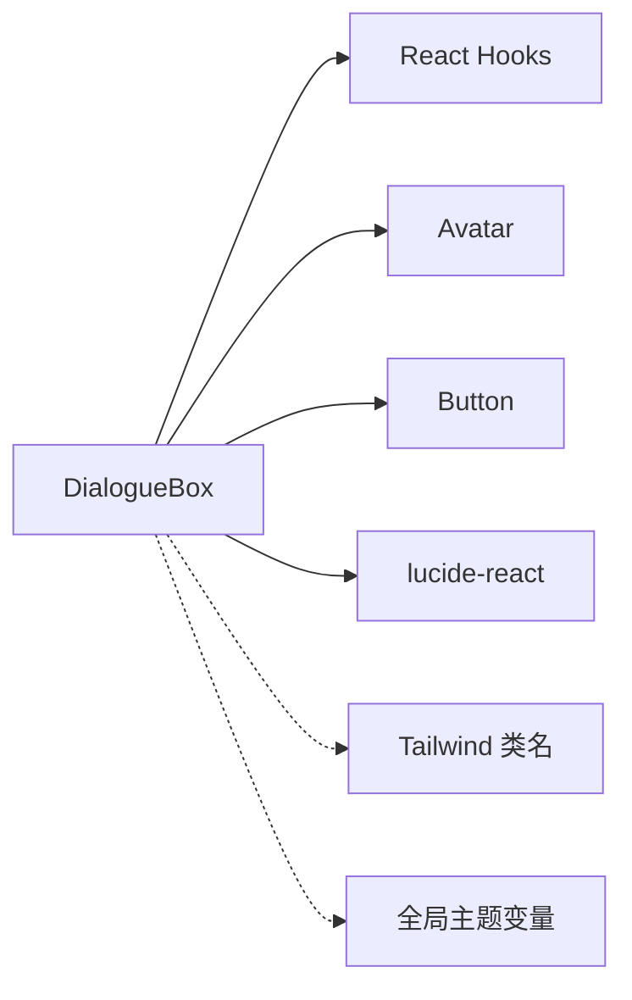

# 对话框组件 (DialogueBox)

<cite>
**本文引用的文件**   
- [dialogue-box.tsx](file://frontend/src/components/dialogue-box.tsx)
- [avatar.tsx](file://frontend/src/components/ui/avatar.tsx)
- [button.tsx](file://frontend/src/components/ui/button.tsx)
- [globals.css](file://frontend/src/app/globals.css)
</cite>

## 目录
1. [简介](#简介)
2. [项目结构](#项目结构)
3. [核心组件](#核心组件)
4. [架构总览](#架构总览)
5. [详细组件分析](#详细组件分析)
6. [依赖关系分析](#依赖关系分析)
7. [性能考量](#性能考量)
8. [故障排查指南](#故障排查指南)
9. [结论](#结论)
10. [附录](#附录)

## 简介
本文件面向开发者与策划，系统化阐述 DialogueBox（对话框）组件的实现原理与使用方式。该组件用于在游戏中展示 NPC 对话文本，具备打字机效果、NPC 头像显示、可选音频播放入口等能力。文档将深入解析 Props 接口定义、状态管理机制、定时器控制逻辑、视觉效果实现，并提供集成示例与扩展建议。

## 项目结构
DialogueBox 位于前端组件目录中，依赖 UI 基础组件 Avatar、Button，以及全局样式主题变量。其职责单一：渲染一段带头像的对话文本，并以打字机动画逐步呈现内容；当传入音频地址时，提供音频播放按钮入口（当前为占位交互）。



图表来源 
- [dialogue-box.tsx:1-63](file://frontend/src/components/dialogue-box.tsx#L1-L63)
- [avatar.tsx:1-110](file://frontend/src/components/ui/avatar.tsx#L1-L110)
- [button.tsx:1-59](file://frontend/src/components/ui/button.tsx#L1-L59)
- [globals.css:1-331](file://frontend/src/app/globals.css#L1-L331)

章节来源
- [dialogue-box.tsx:1-63](file://frontend/src/components/dialogue-box.tsx#L1-L63)

## 核心组件
- 组件名称：DialogueBox
- 功能要点：
  - 打字机效果：按固定间隔逐字追加文本，完成后停止并隐藏光标。
  - NPC 头像：通过 Avatar + AvatarFallback 展示首字符或占位图。
  - 音频入口：当存在 audioUrl 时，显示音量图标按钮（当前未实现播放逻辑）。
  - 视觉风格：卡片式容器、边框、圆角、阴影、响应式布局。

章节来源
- [dialogue-box.tsx:8-13](file://frontend/src/components/dialogue-box.tsx#L8-L13)
- [dialogue-box.tsx:15-33](file://frontend/src/components/dialogue-box.tsx#L15-L33)
- [dialogue-box.tsx:35-62](file://frontend/src/components/dialogue-box.tsx#L35-L62)

## 架构总览
DialogueBox 是一个无副作用的纯展示型组件，内部维护两个本地状态：
- displayedText：当前已显示的文本片段
- isTyping：是否处于打字过程中

文本更新由 useEffect 中的 setInterval 驱动，每 30ms 推进一个字符，直到完整输出后清理定时器并结束打字状态。

```mermaid
sequenceDiagram
participant Parent as "父组件"
participant Box as "DialogueBox"
participant Timer as "setInterval"
participant UI as "Avatar/Button"
Parent->>Box : 传入 {npc, avatar, text, audioUrl}
Box->>Box : 初始化 displayedText="" / isTyping=true
Box->>Timer : 启动定时器(30ms)
loop 每次计时
Timer-->>Box : 回调
Box->>Box : 追加一个字符到 displayedText
alt 文本未完成
Box->>Box : isTyping=true
else 文本完成
Box->>Box : isTyping=false
Box->>Timer : clearInterval()
end
end
Box->>UI : 渲染头像、名称、文本、可选音频按钮
```

图表来源 
- [dialogue-box.tsx:15-33](file://frontend/src/components/dialogue-box.tsx#L15-L33)
- [dialogue-box.tsx:35-62](file://frontend/src/components/dialogue-box.tsx#L35-L62)

## 详细组件分析

### Props 接口定义
- npc: string — NPC 名称
- avatar: string — 头像标识（当前以首字符作为回退显示）
- text: string — 要展示的对话文本
- audioUrl?: string — 可选的音频地址（用于后续播放）

章节来源
- [dialogue-box.tsx:8-13](file://frontend/src/components/dialogue-box.tsx#L8-L13)

### 状态管理与定时器逻辑
- 状态
  - displayedText：初始为空字符串，随定时器递增拼接文本
  - isTyping：初始为 true，文本输出完毕后置为 false
- 定时器
  - 触发频率：30ms
  - 行为：每次截取 text.slice(0, index+1) 更新 displayedText，index++
  - 终止条件：index >= text.length 时，设置 isTyping=false 并清除定时器
  - 清理：组件卸载或依赖变化时清理定时器，避免内存泄漏



图表来源 
- [dialogue-box.tsx:19-33](file://frontend/src/components/dialogue-box.tsx#L19-L33)

章节来源
- [dialogue-box.tsx:15-33](file://frontend/src/components/dialogue-box.tsx#L15-L33)

### 视觉效果与样式实现
- 容器样式
  - 背景：bg-card
  - 边框：border
  - 圆角：rounded-lg
  - 内边距：p-4
  - 阴影：shadow-sm
- 头像区域
  - 尺寸：h-10 w-10
  - 边框：border
  - 回退：AvatarFallback 显示 avatar 的首字符，背景色 primary/10
- 文本区域
  - 字体大小：text-sm
  - 行高：leading-relaxed
  - 打字光标：isTyping 为真时显示闪烁光标（animate-pulse）
- 音频按钮
  - 仅当 audioUrl 存在时显示
  - 图标：Volume2
  - 按钮样式：ghost、icon 尺寸

章节来源
- [dialogue-box.tsx:35-62](file://frontend/src/components/dialogue-box.tsx#L35-L62)
- [avatar.tsx:8-26](file://frontend/src/components/ui/avatar.tsx#L8-L26)
- [avatar.tsx:41-55](file://frontend/src/components/ui/avatar.tsx#L41-L55)
- [button.tsx:6-41](file://frontend/src/components/ui/button.tsx#L6-L41)
- [globals.css:59-97](file://frontend/src/app/globals.css#L59-L97)
- [globals.css:138-212](file://frontend/src/app/globals.css#L138-L212)

### 音频播放功能现状与建议
- 现状：组件内包含音频按钮 UI，但未实现实际播放逻辑。
- 建议扩展：
  - 新增 state：audioPlaying（布尔）、audioError（布尔）
  - 使用 HTMLAudioElement 或 Web Audio API 管理播放、暂停、错误处理
  - 在点击按钮时根据 audioUrl 创建/复用 Audio 实例，处理跨域与自动播放策略
  - 提供加载态与错误提示（如网络失败、格式不支持）

章节来源
- [dialogue-box.tsx:46-50](file://frontend/src/components/dialogue-box.tsx#L46-L50)

### 类与依赖关系图


图表来源 
- [dialogue-box.tsx:15-62](file://frontend/src/components/dialogue-box.tsx#L15-L62)
- [avatar.tsx:8-26](file://frontend/src/components/ui/avatar.tsx#L8-L26)
- [button.tsx:43-56](file://frontend/src/components/ui/button.tsx#L43-L56)

章节来源
- [dialogue-box.tsx:15-62](file://frontend/src/components/dialogue-box.tsx#L15-L62)

## 依赖关系分析
- 直接依赖
  - React Hooks：useState、useEffect
  - UI 组件：Avatar、AvatarFallback、Button
  - 图标库：lucide-react（Volume2）
- 样式依赖
  - Tailwind 原子类：颜色、间距、阴影、动画
  - 全局主题变量：primary、card、foreground、ring 等
- 外部资源
  - 音频 URL（可选）：需确保可访问且支持浏览器播放



图表来源 
- [dialogue-box.tsx:1-6](file://frontend/src/components/dialogue-box.tsx#L1-L6)
- [globals.css:9-56](file://frontend/src/app/globals.css#L9-L56)

章节来源
- [dialogue-box.tsx:1-6](file://frontend/src/components/dialogue-box.tsx#L1-L6)
- [globals.css:9-56](file://frontend/src/app/globals.css#L9-L56)

## 性能考量
- 定时器开销：30ms 间隔对短文本影响较小；长文本建议考虑按需增量渲染或节流。
- 重渲染优化：仅在 displayedText 和 isTyping 变化时触发；若文本较长，可考虑 memo 包裹子树或使用 useRef 缓存中间结果。
- 资源释放：useEffect 返回清理函数确保卸载时清除定时器，避免内存泄漏。
- 音频播放：避免重复创建 Audio 实例，建议使用单例或池化策略，并在组件卸载时释放。

[本节为通用指导，不直接分析具体文件]

## 故障排查指南
- 文本不显示或卡住
  - 检查 text 是否为空或不可见字符
  - 确认 useEffect 依赖数组包含 text，避免闭包过期
- 定时器未清理导致内存泄漏
  - 确保 return () => clearInterval(interval) 执行
- 头像显示异常
  - 检查 avatar 是否为空；AvatarFallback 会显示首字符
- 音频按钮无效
  - 当前未实现播放逻辑；如需启用，需补充 Audio 生命周期与错误处理
- 样式错乱
  - 检查 Tailwind 配置与全局主题变量是否正确注入
  - 确认 dark 模式下的颜色变量覆盖

章节来源
- [dialogue-box.tsx:19-33](file://frontend/src/components/dialogue-box.tsx#L19-L33)
- [dialogue-box.tsx:35-62](file://frontend/src/components/dialogue-box.tsx#L35-L62)
- [globals.css:59-136](file://frontend/src/app/globals.css#L59-L136)

## 结论
DialogueBox 组件以简洁的状态与定时器机制实现了稳定的打字机效果，并通过 Avatar 与 Button 组合提供了良好的可扩展性。当前音频播放功能为预留入口，建议在后续迭代中完善播放逻辑与错误处理。整体代码结构清晰，易于集成与定制。

[本节为总结性内容，不直接分析具体文件]

## 附录

### 使用场景与集成示例（概念说明）
- 在游戏场景中，将 DialogueBox 置于视频播放器下方或选择面板上方，用于展示 NPC 对话。
- 典型数据流：父组件从后端获取 scene 数据，提取 npc、avatar、text、audioUrl，传递给 DialogueBox。
- 交互流程：文本输出完成后，用户可选择下一步操作（如继续剧情、查看线索）。

[本节为概念性说明，不直接分析具体文件]

### 自定义扩展点与样式定制指南
- 扩展点
  - 音频播放：在按钮 onClick 中接入 Audio 实例，增加播放/暂停、进度条、错误提示
  - 打字速度：调整 setInterval 时间间隔，或根据文本长度动态计算速度
  - 头像渲染：支持图片 URL 或 SVG 图标，替换 AvatarFallback 为 AvatarImage
  - 多语言：结合 i18n 上下文，动态切换 npc 与 text
- 样式定制
  - 容器：修改 bg-card、border、rounded-lg、shadow-sm 等类名
  - 头像：调整 h-10 w-10、border、AvatarFallback 的背景色
  - 文本：调整 text-sm、leading-relaxed、光标样式 animate-pulse
  - 主题：通过 globals.css 的 CSS 变量统一调整颜色与半径

章节来源
- [dialogue-box.tsx:35-62](file://frontend/src/components/dialogue-box.tsx#L35-L62)
- [globals.css:59-136](file://frontend/src/app/globals.css#L59-L136)