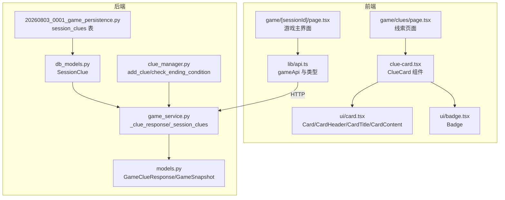
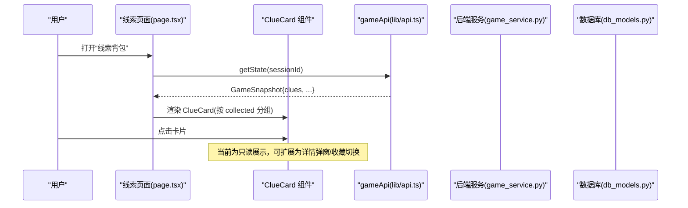
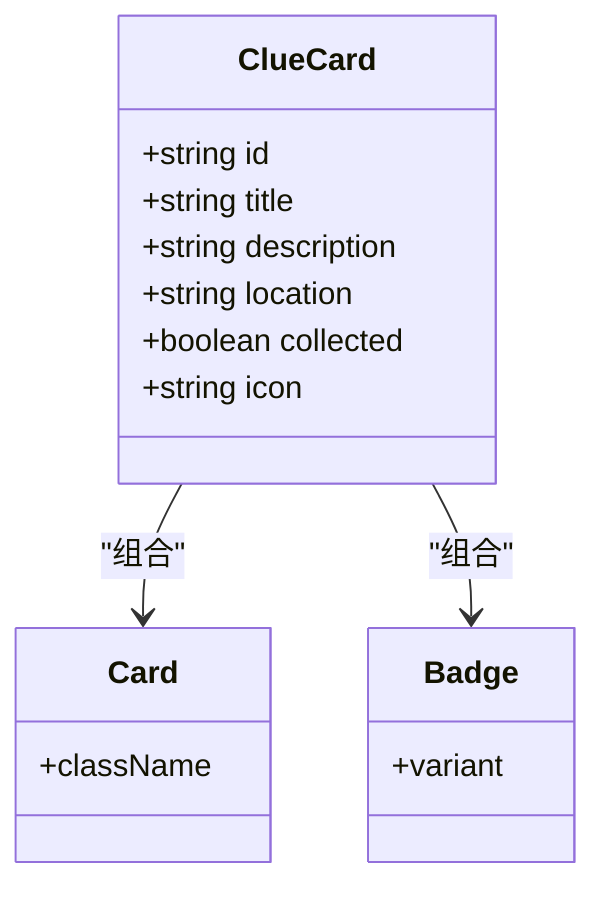
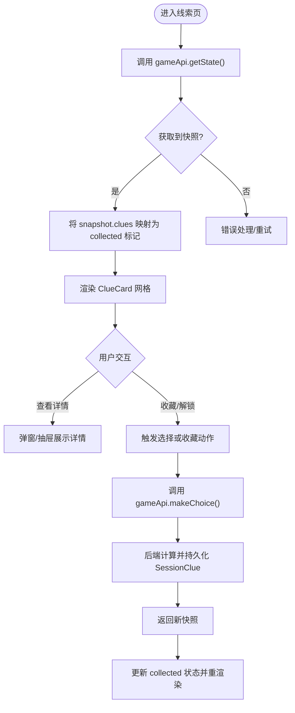
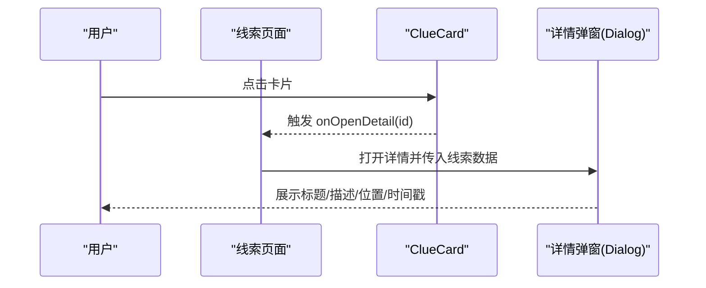
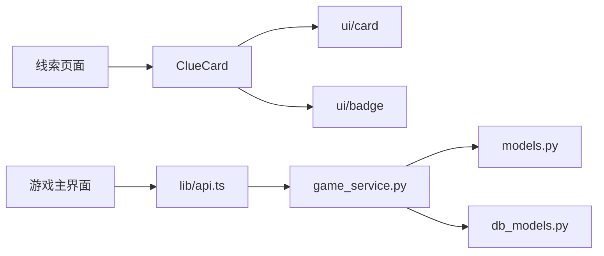

# 线索卡片组件 (ClueCard)

<cite>
**本文引用的文件**   
- [clue-card.tsx](file://frontend/src/components/clue-card.tsx)
- [page.tsx（线索页面）](file://frontend/src/app/game/clues/page.tsx)
- [card.tsx（UI 卡片）](file://frontend/src/components/ui/card.tsx)
- [badge.tsx（徽章）](file://frontend/src/components/ui/badge.tsx)
- [api.ts（前端 API 类型与调用）](file://frontend/src/lib/api.ts)
- [page.tsx（游戏主界面）](file://frontend/src/app/game/[sessionId]/page.tsx)
- [game_service.py（后端服务：线索响应/查询）](file://backend/app/game_service.py)
- [models.py（后端数据模型：GameClueResponse/GameSnapshot）](file://backend/app/models.py)
- [db_models.py（数据库模型：SessionClue）](file://backend/app/db_models.py)
- [20260803_0001_game_persistence.py（迁移：session_clues 表）](file://backend/alembic/versions/20260803_0001_game_persistence.py)
- [clue_manager.py（线索管理工具）](file://backend/app/story/clue_manager.py)
</cite>

## 目录
1. [简介](#简介)
2. [项目结构](#项目结构)
3. [核心组件](#核心组件)
4. [架构总览](#架构总览)
5. [详细组件分析](#详细组件分析)
6. [依赖关系分析](#依赖关系分析)
7. [性能考虑](#性能考虑)
8. [故障排查指南](#故障排查指南)
9. [结论](#结论)
10. [附录](#附录)

## 简介
本文件围绕“线索卡片组件 ClueCard”进行系统化文档化，涵盖其设计模式、Props 接口、数据模型、与游戏状态的双向绑定机制、交互行为（点击展开、拖拽排序、批量操作）、动画与响应式布局、以及自定义样式实现细节。同时给出在线索收集界面中的集成示例与最佳实践，帮助读者快速理解并扩展该组件。

## 项目结构
ClueCard 位于前端组件目录，配合 UI 基础组件 Card 与 Badge 使用；线索页面通过网格布局渲染已收集与未解锁两类线索卡片。后端提供线索数据结构与持久化能力，前端通过 API 类型定义与调用获取/更新游戏快照，从而驱动卡片展示。

图表来源 
- [clue-card.tsx:1-55](file://frontend/src/components/clue-card.tsx#L1-L55)
- [card.tsx（UI 卡片）:1-104](file://frontend/src/components/ui/card.tsx#L1-L104)
- [badge.tsx（徽章）:1-53](file://frontend/src/components/ui/badge.tsx#L1-L53)
- [page.tsx（线索页面）:1-67](file://frontend/src/app/game/clues/page.tsx#L1-L67)
- [page.tsx（游戏主界面）:1-194](file://frontend/src/app/game/[sessionId]/page.tsx#L1-L194)
- [api.ts（前端 API 类型与调用）:1-216](file://frontend/src/lib/api.ts#L1-L216)
- [game_service.py（后端服务：线索响应/查询）:317-351](file://backend/app/game_service.py#L317-L351)
- [models.py（后端数据模型：GameClueResponse/GameSnapshot）:54-81](file://backend/app/models.py#L54-L81)
- [db_models.py（数据库模型：SessionClue）:115-126](file://backend/app/db_models.py#L115-L126)
- [20260803_0001_game_persistence.py（迁移：session_clues 表）:103-112](file://backend/alembic/versions/20260803_0001_game_persistence.py#L103-L112)
- [clue_manager.py（线索管理工具）:1-13](file://backend/app/story/clue_manager.py#L1-L13)

章节来源
- [clue-card.tsx:1-55](file://frontend/src/components/clue-card.tsx#L1-L55)
- [page.tsx（线索页面）:1-67](file://frontend/src/app/game/clues/page.tsx#L1-L67)
- [card.tsx（UI 卡片）:1-104](file://frontend/src/components/ui/card.tsx#L1-L104)
- [badge.tsx（徽章）:1-53](file://frontend/src/components/ui/badge.tsx#L1-L53)
- [api.ts（前端 API 类型与调用）:51-109](file://frontend/src/lib/api.ts#L51-L109)
- [page.tsx（游戏主界面）:92-123](file://frontend/src/app/game/[sessionId]/page.tsx#L92-L123)
- [game_service.py（后端服务：线索响应/查询）:327-345](file://backend/app/game_service.py#L327-L345)
- [models.py（后端数据模型：GameClueResponse/GameSnapshot）:54-81](file://backend/app/models.py#L54-L81)
- [db_models.py（数据库模型：SessionClue）:115-126](file://backend/app/db_models.py#L115-L126)
- [20260803_0001_game_persistence.py（迁移：session_clues 表）:103-112](file://backend/alembic/versions/20260803_0001_game_persistence.py#L103-L112)
- [clue_manager.py（线索管理工具）:1-13](file://backend/app/story/clue_manager.py#L1-L13)

## 核心组件
- ClueCard：纯展示型组件，接收 id、title、description、location、collected、icon 等 Props，根据 collected 切换视觉状态（已收集/未解锁），并通过 Badge 显示位置标签。
- 线索页面：将 MOCK_CLUES 分为已收集与未解锁两组，分别渲染为卡片网格。
- UI 基础组件：Card、CardHeader、CardTitle、CardContent、Badge 提供样式与语义化结构。

章节来源
- [clue-card.tsx:10-55](file://frontend/src/components/clue-card.tsx#L10-L55)
- [page.tsx（线索页面）:1-67](file://frontend/src/app/game/clues/page.tsx#L1-L67)
- [card.tsx（UI 卡片）:1-104](file://frontend/src/components/ui/card.tsx#L1-L104)
- [badge.tsx（徽章）:1-53](file://frontend/src/components/ui/badge.tsx#L1-L53)

## 架构总览
ClueCard 作为视图层组件，由上层页面负责数据装配与状态管理。当前线索页面使用本地模拟数据；未来可对接 gameApi.getState 或 makeChoice 返回的 GameSnapshot.clues，实现与后端状态的同步。

图表来源 
- [page.tsx（线索页面）:1-67](file://frontend/src/app/game/clues/page.tsx#L1-L67)
- [api.ts（前端 API 类型与调用）:84-109](file://frontend/src/lib/api.ts#L84-L109)
- [game_service.py（后端服务：线索响应/查询）:327-345](file://backend/app/game_service.py#L327-L345)
- [db_models.py（数据库模型：SessionClue）:115-126](file://backend/app/db_models.py#L115-L126)

## 详细组件分析

### ClueCard 组件设计与 Props
- Props 接口
  - id: string — 唯一标识
  - title: string — 标题
  - description: string — 描述
  - location: string — 位置标签
  - collected: boolean — 是否已收集
  - icon: string — 图标字符
- 可视化规则
  - 已收集：显示图标、标题、描述与位置标签，具备悬停阴影与指针样式
  - 未解锁：显示锁图标、标题“未解锁”、提示文案，整体半透明并去色
- 交互现状
  - 当前为只读展示，cursor-pointer 预留点击态，便于后续接入详情弹窗或收藏切换

图表来源 
- [clue-card.tsx:10-55](file://frontend/src/components/clue-card.tsx#L10-L55)
- [card.tsx（UI 卡片）:1-104](file://frontend/src/components/ui/card.tsx#L1-L104)
- [badge.tsx（徽章）:1-53](file://frontend/src/components/ui/badge.tsx#L1-L53)

章节来源
- [clue-card.tsx:10-55](file://frontend/src/components/clue-card.tsx#L10-L55)

### 数据模型与双向绑定机制
- 前端类型
  - GameClue：id、title、description、icon?、acquired_at
  - GameSnapshot：包含 clues 列表、进度、场景等信息
- 后端模型
  - GameClueResponse：与前端 GameClue 对应
  - SessionClue：会话级线索记录，含 acquired_at
  - session_clues 表：持久化线索集合
- 双向绑定思路
  - 读取：通过 gameApi.getState 获取快照，映射到 ClueCard 的 collected 字段（例如比较当前线索是否在 clues 列表中）
  - 写入：通过 gameApi.makeChoice 推进剧情，服务端在事务中追加 SessionClue，下一次快照即反映 collected 变化

图表来源 
- [api.ts（前端 API 类型与调用）:84-109](file://frontend/src/lib/api.ts#L84-L109)
- [game_service.py（后端服务：线索响应/查询）:327-345](file://backend/app/game_service.py#L327-L345)
- [db_models.py（数据库模型：SessionClue）:115-126](file://backend/app/db_models.py#L115-L126)
- [20260803_0001_game_persistence.py（迁移：session_clues 表）:103-112](file://backend/alembic/versions/20260803_0001_game_persistence.py#L103-L112)

章节来源
- [api.ts（前端 API 类型与调用）:51-109](file://frontend/src/lib/api.ts#L51-L109)
- [models.py（后端数据模型：GameClueResponse/GameSnapshot）:54-81](file://backend/app/models.py#L54-L81)
- [db_models.py（数据库模型：SessionClue）:115-126](file://backend/app/db_models.py#L115-L126)
- [20260803_0001_game_persistence.py（迁移：session_clues 表）:103-112](file://backend/alembic/versions/20260803_0001_game_persistence.py#L103-L112)

### 交互行为与扩展方案
- 点击展开
  - 当前仅预留 cursor-pointer，建议增加 onClick 回调，弹出详情面板（可使用 Dialog/Sheet）
- 拖拽排序
  - 可在外层容器引入拖拽库（如 dnd-kit），对 collected 与 locked 两组分别维护顺序，并将新顺序持久化至本地存储或后端
- 批量操作
  - 可增加多选模式，支持批量标记为已收集/删除，调用后端批量接口或逐条触发 makeChoice

图表来源 
- [clue-card.tsx:19-55](file://frontend/src/components/clue-card.tsx#L19-L55)
- [page.tsx（线索页面）:46-67](file://frontend/src/app/game/clues/page.tsx#L46-L67)

章节来源
- [clue-card.tsx:19-55](file://frontend/src/components/clue-card.tsx#L19-L55)
- [page.tsx（线索页面）:46-67](file://frontend/src/app/game/clues/page.tsx#L46-L67)

### 动画效果、响应式布局与自定义样式
- 动画
  - transition-all 提供平滑过渡；hover:shadow-md 增强交互反馈；opacity-50 grayscale 表示未解锁状态
- 响应式
  - 使用 Tailwind 网格 grid-cols-1 sm:grid-cols-2 md:grid-cols-3 适配不同屏幕尺寸
- 自定义样式
  - 通过 className 覆盖默认样式；Badge variant="outline" 用于位置标签；Lock 图标来自 lucide-react

章节来源
- [clue-card.tsx:27-52](file://frontend/src/components/clue-card.tsx#L27-L52)
- [page.tsx（线索页面）:57-64](file://frontend/src/app/game/clues/page.tsx#L57-L64)
- [badge.tsx（徽章）:7-28](file://frontend/src/components/ui/badge.tsx#L7-L28)

### 与游戏状态的双向绑定示例
- 读取状态
  - 在游戏主界面中，snapshot.clues 可直接用于构建线索列表；线索页面可复用相同逻辑
- 更新状态
  - 当玩家做出选择后，后端会生成新的快照，其中 clues 可能新增；前端需刷新快照以更新 collected 标记

章节来源
- [page.tsx（游戏主界面）:92-123](file://frontend/src/app/game/[sessionId]/page.tsx#L92-L123)
- [api.ts（前端 API 类型与调用）:84-109](file://frontend/src/lib/api.ts#L84-L109)

## 依赖关系分析
- 组件依赖
  - ClueCard 依赖 ui/card 与 ui/badge，图标来自 lucide-react
- 页面依赖
  - 线索页面依赖 ClueCard，并使用 Tailwind 网格布局
- 前后端契约
  - 前端 GameClue/GameSnapshot 与后端 GameClueResponse/GameSnapshot 对齐
  - 后端通过 _clue_response 构造线索响应，从 SessionClue 读取 acquired_at 与 clue_key

图表来源 
- [clue-card.tsx:1-55](file://frontend/src/components/clue-card.tsx#L1-L55)
- [card.tsx（UI 卡片）:1-104](file://frontend/src/components/ui/card.tsx#L1-L104)
- [badge.tsx（徽章）:1-53](file://frontend/src/components/ui/badge.tsx#L1-L53)
- [page.tsx（线索页面）:1-67](file://frontend/src/app/game/clues/page.tsx#L1-L67)
- [page.tsx（游戏主界面）:1-194](file://frontend/src/app/game/[sessionId]/page.tsx#L1-L194)
- [api.ts（前端 API 类型与调用）:1-216](file://frontend/src/lib/api.ts#L1-L216)
- [game_service.py（后端服务：线索响应/查询）:327-345](file://backend/app/game_service.py#L327-L345)
- [models.py（后端数据模型：GameClueResponse/GameSnapshot）:54-81](file://backend/app/models.py#L54-L81)
- [db_models.py（数据库模型：SessionClue）:115-126](file://backend/app/db_models.py#L115-L126)

章节来源
- [clue-card.tsx:1-55](file://frontend/src/components/clue-card.tsx#L1-L55)
- [page.tsx（线索页面）:1-67](file://frontend/src/app/game/clues/page.tsx#L1-L67)
- [api.ts（前端 API 类型与调用）:1-216](file://frontend/src/lib/api.ts#L1-L216)
- [game_service.py（后端服务：线索响应/查询）:327-345](file://backend/app/game_service.py#L327-L345)
- [models.py（后端数据模型：GameClueResponse/GameSnapshot）:54-81](file://backend/app/models.py#L54-L81)
- [db_models.py（数据库模型：SessionClue）:115-126](file://backend/app/db_models.py#L115-L126)

## 性能考虑
- 渲染优化
  - 对大量线索建议使用虚拟滚动或分页加载，避免一次性渲染过多 DOM
- 状态更新
  - 合并多次状态变更，减少重渲染；必要时使用 React.memo 包裹 ClueCard
- 网络请求
  - 合理缓存快照，避免重复请求；失败时提供重试机制

[本节为通用指导，不直接分析具体文件]

## 故障排查指南
- 线索不更新
  - 检查是否正确调用 gameApi.getState 或 makeChoice 并更新 snapshot.clues
- 样式异常
  - 确认 Tailwind 类名与主题变量生效；检查 Card/Badge 的 className 覆盖
- 后端数据不一致
  - 核对 SessionClue 是否存在；查看 _clue_response 是否能正确映射 title/description/icon/acquired_at

章节来源
- [api.ts（前端 API 类型与调用）:84-109](file://frontend/src/lib/api.ts#L84-L109)
- [game_service.py（后端服务：线索响应/查询）:327-345](file://backend/app/game_service.py#L327-L345)
- [db_models.py（数据库模型：SessionClue）:115-126](file://backend/app/db_models.py#L115-L126)

## 结论
ClueCard 是一个简洁而可扩展的线索展示组件，结合 UI 基础组件与 Tailwind 样式实现了清晰的视觉层次与响应式布局。通过与 gameApi 和后端模型的契约对齐，可实现与游戏状态的双向绑定。建议在现有基础上逐步完善交互（详情弹窗、拖拽排序、批量操作），并结合性能优化策略提升用户体验。

[本节为总结性内容，不直接分析具体文件]

## 附录
- 实际使用场景示例（代码片段路径）
  - 线索页面渲染已收集与未解锁卡片：[page.tsx（线索页面）:57-64](file://frontend/src/app/game/clues/page.tsx#L57-L64)
  - 游戏主界面展示线索数量与导航入口：[page.tsx（游戏主界面）:102-123](file://frontend/src/app/game/[sessionId]/page.tsx#L102-L123)
  - 前端类型定义与 API 调用：[api.ts（前端 API 类型与调用）:51-109](file://frontend/src/lib/api.ts#L51-L109)
  - 后端线索响应构造与查询：[game_service.py（后端服务：线索响应/查询）:327-345](file://backend/app/game_service.py#L327-L345)
  - 数据库线索表结构与约束：[20260803_0001_game_persistence.py（迁移：session_clues 表）:103-112](file://backend/alembic/versions/20260803_0001_game_persistence.py#L103-L112)

章节来源
- [page.tsx（线索页面）:57-64](file://frontend/src/app/game/clues/page.tsx#L57-L64)
- [page.tsx（游戏主界面）:102-123](file://frontend/src/app/game/[sessionId]/page.tsx#L102-L123)
- [api.ts（前端 API 类型与调用）:51-109](file://frontend/src/lib/api.ts#L51-L109)
- [game_service.py（后端服务：线索响应/查询）:327-345](file://backend/app/game_service.py#L327-L345)
- [20260803_0001_game_persistence.py（迁移：session_clues 表）:103-112](file://backend/alembic/versions/20260803_0001_game_persistence.py#L103-L112)