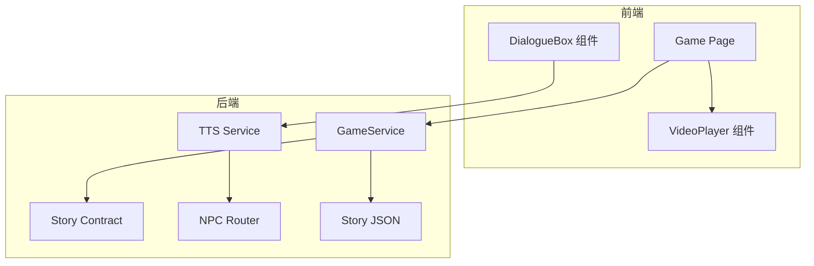
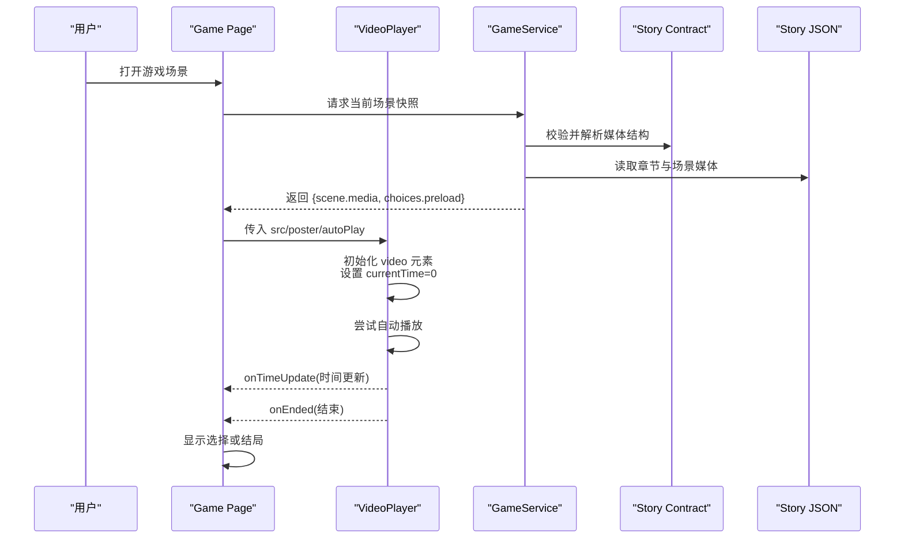
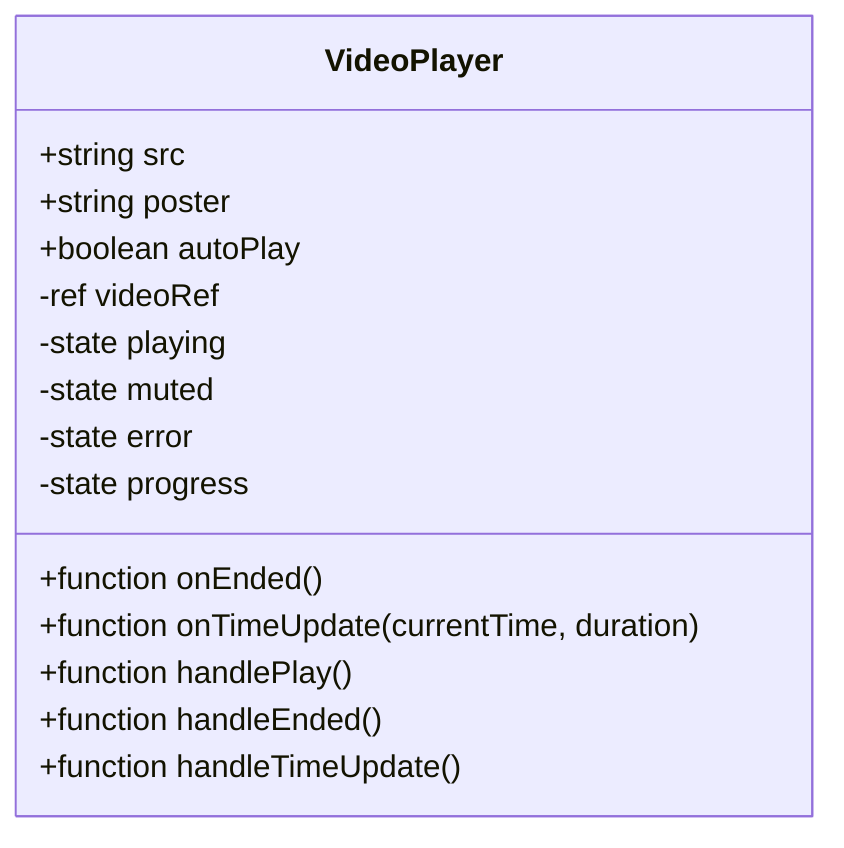
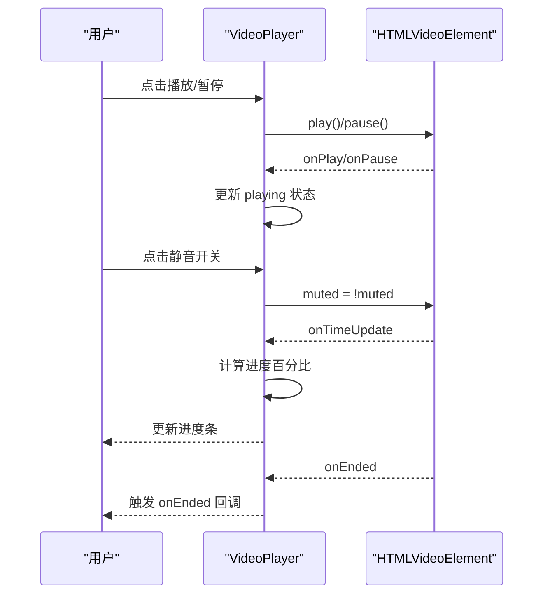
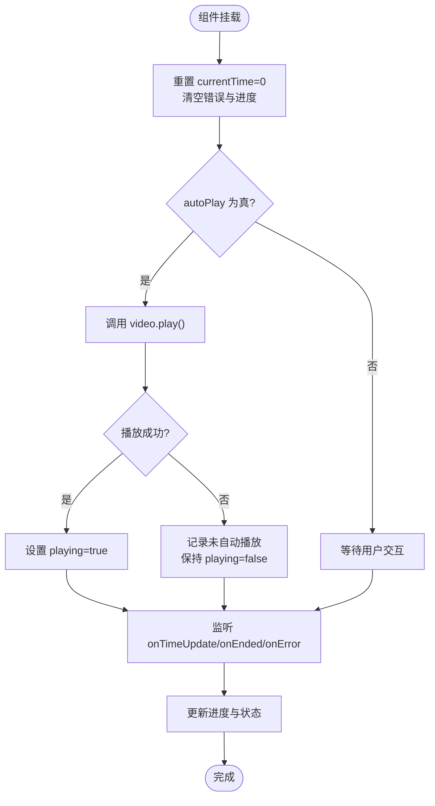
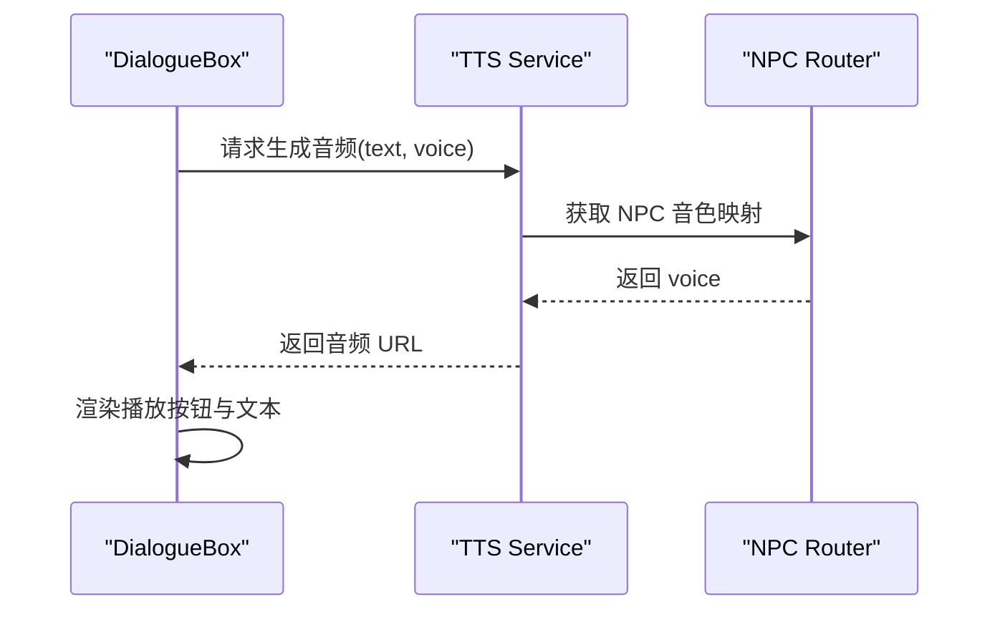
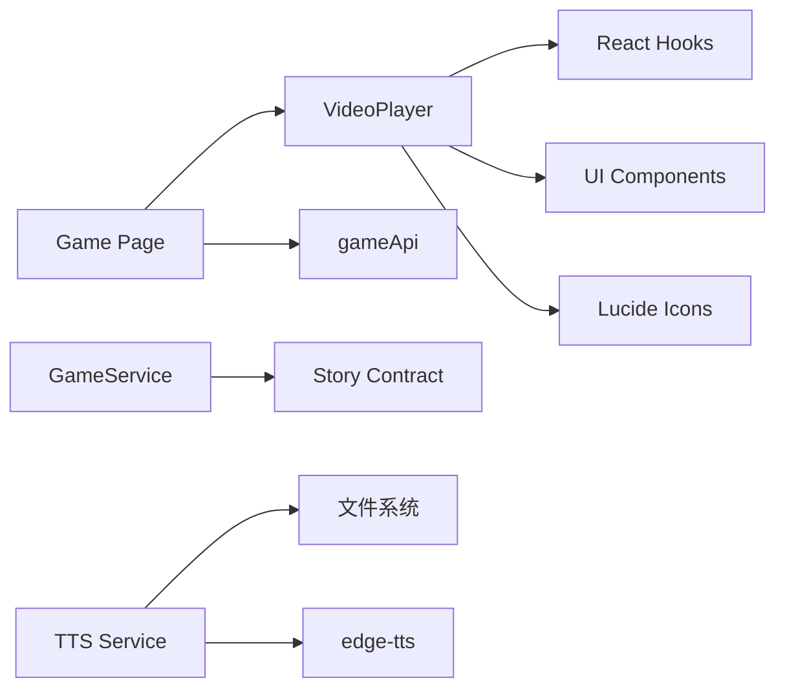

# 视频播放器组件 (VideoPlayer)

<cite>
**本文引用的文件**   
- [video-player.tsx](file://frontend/src/components/video-player.tsx)
- [page.tsx](file://frontend/src/app/game/[sessionId]/page.tsx)
- [dialogue-box.tsx](file://frontend/src/components/dialogue-box.tsx)
- [contract.py](file://backend/app/story/contract.py)
- [game_service.py](file://backend/app/game_service.py)
- [tts_service.py](file://backend/app/ai/tts_service.py)
- [npc_router.py](file://backend/app/ai/npc_router.py)
- [macau_mystery_demo.json](file://backend/app/story/scripts/macau_mystery_demo.json)
</cite>

## 目录
1. [简介](#简介)
2. [项目结构](#项目结构)
3. [核心组件](#核心组件)
4. [架构总览](#架构总览)
5. [详细组件分析](#详细组件分析)
6. [依赖关系分析](#依赖关系分析)
7. [性能与缓存策略](#性能与缓存策略)
8. [跨浏览器兼容性](#跨浏览器兼容性)
9. [故障排查指南](#故障排查指南)
10. [结论](#结论)
11. [附录：使用示例与最佳实践](#附录使用示例与最佳实践)

## 简介
本文件为“澳门悬案”项目中前端视频播放器组件 VideoPlayer 的完整技术文档。内容覆盖组件的实现原理（视频加载、播放控制、进度管理）、Props 接口定义、事件回调机制、与 AI 语音服务（TTS）的集成方式，以及 UI 控件设计、全屏模式与字幕支持等扩展方向。同时提供在游戏场景中嵌入剧情视频和 NPC 对话音频的实际用法说明，并给出性能优化、缓存策略与跨浏览器兼容性的实现建议。

## 项目结构
- 前端
  - 组件层：video-player.tsx 为核心播放器；dialogue-box.tsx 用于 NPC 对话展示与音频入口。
  - 页面层：game/[sessionId]/page.tsx 负责游戏场景渲染，集成 VideoPlayer 并处理选择分支。
- 后端
  - 故事契约：story/contract.py 定义 Media、VideoScene 等严格的数据结构。
  - 游戏服务：game_service.py 将剧本中的媒体信息组装为响应，包含当前场景与可选预加载场景。
  - AI 语音：ai/tts_service.py 提供 TTS 生成与 NPC 音色映射；ai/npc_router.py 提供 NPC 路由与音色选择。
  - 剧本数据：story/scripts/macau_mystery_demo.json 提供演示剧情与媒体占位信息。

图表来源
- [video-player.tsx:1-148](file://frontend/src/components/video-player.tsx#L1-L148)
- [page.tsx:1-194](file://frontend/src/app/game/[sessionId]/page.tsx#L1-L194)
- [dialogue-box.tsx:1-63](file://frontend/src/components/dialogue-box.tsx#L1-L63)
- [contract.py:1-128](file://backend/app/story/contract.py#L1-L128)
- [game_service.py:283-315](file://backend/app/game_service.py#L283-L315)
- [tts_service.py:1-25](file://backend/app/ai/tts_service.py#L1-L25)
- [npc_router.py:1-18](file://backend/app/ai/npc_router.py#L1-L18)
- [macau_mystery_demo.json:1-149](file://backend/app/story/scripts/macau_mystery_demo.json#L1-L149)

章节来源
- [video-player.tsx:1-148](file://frontend/src/components/video-player.tsx#L1-L148)
- [page.tsx:1-194](file://frontend/src/app/game/[sessionId]/page.tsx#L1-L194)
- [contract.py:1-128](file://backend/app/story/contract.py#L1-L128)
- [game_service.py:283-315](file://backend/app/game_service.py#L283-L315)
- [tts_service.py:1-25](file://backend/app/ai/tts_service.py#L1-L25)
- [npc_router.py:1-18](file://backend/app/ai/npc_router.py#L1-L18)
- [macau_mystery_demo.json:1-149](file://backend/app/story/scripts/macau_mystery_demo.json#L1-L149)

## 核心组件
- VideoPlayer 组件
  - 功能要点：基于原生 HTMLVideoElement，封装播放/暂停、静音切换、进度条、错误态回退、自动播放控制。
  - Props 接口：src、poster、onEnded、onTimeUpdate、autoPlay、className。
  - 事件回调：onEnded 在视频结束时触发；onTimeUpdate 实时推送 currentTime 与 duration。
  - UI 控件：播放/暂停按钮、静音开关、底部进度条；错误态显示海报与重试按钮。
  - 状态管理：playing、muted、error、progress。

章节来源
- [video-player.tsx:7-14](file://frontend/src/components/video-player.tsx#L7-L14)
- [video-player.tsx:24-44](file://frontend/src/components/video-player.tsx#L24-L44)
- [video-player.tsx:46-69](file://frontend/src/components/video-player.tsx#L46-L69)
- [video-player.tsx:71-96](file://frontend/src/components/video-player.tsx#L71-L96)
- [video-player.tsx:98-147](file://frontend/src/components/video-player.tsx#L98-L147)

## 架构总览
VideoPlayer 作为独立可复用组件，被 Game Page 调用以渲染剧情视频。后端通过 Story Contract 定义媒体数据结构，GameService 将当前场景与可选分支的预加载媒体返回给前端。AI 语音服务根据 NPC 身份生成对应音色的音频，供 DialogueBox 播放。

图表来源
- [page.tsx:29-66](file://frontend/src/app/game/[sessionId]/page.tsx#L29-L66)
- [video-player.tsx:30-44](file://frontend/src/components/video-player.tsx#L30-L44)
- [game_service.py:283-315](file://backend/app/game_service.py#L283-L315)
- [contract.py:25-38](file://backend/app/story/contract.py#L25-L38)
- [macau_mystery_demo.json:14-23](file://backend/app/story/scripts/macau_mystery_demo.json#L14-L23)

## 详细组件分析

### VideoPlayer 组件类图

图表来源
- [video-player.tsx:7-14](file://frontend/src/components/video-player.tsx#L7-L14)
- [video-player.tsx:24-28](file://frontend/src/components/video-player.tsx#L24-L28)
- [video-player.tsx:46-69](file://frontend/src/components/video-player.tsx#L46-L69)

章节来源
- [video-player.tsx:1-148](file://frontend/src/components/video-player.tsx#L1-L148)

### 播放控制时序图

图表来源
- [video-player.tsx:46-69](file://frontend/src/components/video-player.tsx#L46-L69)
- [video-player.tsx:98-147](file://frontend/src/components/video-player.tsx#L98-L147)

### 复杂逻辑流程图（自动播放与错误回退）

图表来源
- [video-player.tsx:30-44](file://frontend/src/components/video-player.tsx#L30-L44)
- [video-player.tsx:63-69](file://frontend/src/components/video-player.tsx#L63-L69)

章节来源
- [video-player.tsx:30-44](file://frontend/src/components/video-player.tsx#L30-L44)
- [video-player.tsx:63-69](file://frontend/src/components/video-player.tsx#L63-L69)

### 与 AI 语音服务的集成
- 后端 TTS 服务
  - generate_tts(text, voice)：生成 MP3 音频并返回静态路径。
  - get_voice_for_npc(npc_id)：根据 NPC ID 返回对应音色。
- NPC 路由
  - npc_router.py 维护 NPC 身份、位置与音色映射。
- 前端 DialogueBox
  - 支持 audioUrl 参数，预留播放入口（图标按钮），可与 TTS 生成的音频链接结合。

图表来源
- [tts_service.py:14-20](file://backend/app/ai/tts_service.py#L14-L20)
- [npc_router.py:10-17](file://backend/app/ai/npc_router.py#L10-L17)
- [dialogue-box.tsx:8-13](file://frontend/src/components/dialogue-box.tsx#L8-L13)

章节来源
- [tts_service.py:1-25](file://backend/app/ai/tts_service.py#L1-L25)
- [npc_router.py:1-18](file://backend/app/ai/npc_router.py#L1-L18)
- [dialogue-box.tsx:1-63](file://frontend/src/components/dialogue-box.tsx#L1-L63)

### 数据契约与媒体结构
- Media 字段：status、video_url、poster_url、mime_type、duration_ms。
- VideoScene：type="video"，包含 media 与 choices。
- EndingScene：type="ending"，无 choices。
- RouteCondition：default/min_clue_count/all_clues/any_clues。

章节来源
- [contract.py:25-38](file://backend/app/story/contract.py#L25-L38)
- [contract.py:76-94](file://backend/app/story/contract.py#L76-L94)
- [contract.py:48-67](file://backend/app/story/contract.py#L48-L67)

### 游戏场景集成
- Game Page 调用 VideoPlayer，传入 scene.media.video_url 与 poster_url，并监听 onEnded 以显示选择或结局。
- 后端 GameService 组装 scene.media 与 choices.preload，便于前端提前准备下一场景媒体。

章节来源
- [page.tsx:128-134](file://frontend/src/app/game/[sessionId]/page.tsx#L128-L134)
- [page.tsx:61-66](file://frontend/src/app/game/[sessionId]/page.tsx#L61-L66)
- [game_service.py:283-315](file://backend/app/game_service.py#L283-L315)

## 依赖关系分析
- 组件内依赖
  - React Hooks：useRef、useEffect、useState。
  - UI 库：Button、Avatar 等基础组件。
  - 图标库：lucide-react 的 Play/Pause/Volume 图标。
- 页面级依赖
  - Next.js 路由与 i18n 上下文。
  - gameApi 用于获取游戏快照与提交选择。
- 后端依赖
  - Pydantic 模型校验（StrictModel、Field、validator）。
  - edge-tts 生成音频。
  - 文件系统写入静态音频目录。

图表来源
- [video-player.tsx:3-5](file://frontend/src/components/video-player.tsx#L3-L5)
- [page.tsx:1-11](file://frontend/src/app/game/[sessionId]/page.tsx#L1-L11)
- [contract.py:1-17](file://backend/app/story/contract.py#L1-L17)
- [tts_service.py:1-11](file://backend/app/ai/tts_service.py#L1-L11)

章节来源
- [video-player.tsx:1-148](file://frontend/src/components/video-player.tsx#L1-L148)
- [page.tsx:1-194](file://frontend/src/app/game/[sessionId]/page.tsx#L1-L194)
- [contract.py:1-128](file://backend/app/story/contract.py#L1-L128)
- [tts_service.py:1-25](file://backend/app/ai/tts_service.py#L1-L25)

## 性能与缓存策略
- 视频加载与缓冲
  - 使用 playsInline 避免移动端全屏跳转开销。
  - 利用 poster 快速呈现封面，提升首帧感知速度。
  - 通过 onTimeUpdate 仅更新必要状态，避免频繁重渲染。
- 预加载与缓存
  - 后端 choices.preload 提供下一场景媒体信息，前端可在空闲时预取资源（如创建 Image/Audio/Video 对象进行预加载）。
  - 浏览器 HTTP 缓存由服务端 Cache-Control 与 ETag 控制，建议在 CDN 层启用强缓存与协商缓存。
- 内存与资源释放
  - 组件卸载时确保移除事件监听（React useEffect 清理）。
  - 避免重复创建 video 实例，复用 ref。
- 编码与格式
  - 推荐 H.264/AAC 编码的 MP4，保证广泛兼容。
  - 合理码率与分辨率（例如 720p/1080p 自适应），降低带宽占用。

[本节为通用指导，不直接分析具体文件]

## 跨浏览器兼容性
- 自动播放策略
  - 现代浏览器要求用户交互后才能自动播放带声音的视频；组件已捕获 play() 失败并回退到暂停状态。
- 静音默认
  - 初始 muted 状态可由父组件控制，满足自动播放限制。
- 移动端适配
  - playsInline 确保内联播放，避免全屏切换导致的布局抖动。
- 字幕支持
  - 当前组件未内置字幕轨道；可通过添加 track 元素与自定义字幕面板扩展。

章节来源
- [video-player.tsx:38-44](file://frontend/src/components/video-player.tsx#L38-L44)
- [video-player.tsx:105-106](file://frontend/src/components/video-player.tsx#L105-L106)

## 故障排查指南
- 视频不可用
  - 现象：显示“Video unavailable”与重试按钮。
  - 原因：src 无效、网络错误、MIME 类型不支持。
  - 处理：检查 URL 可达性、CORS、CDN 配置；确认 MIME 类型正确。
- 自动播放失败
  - 现象：组件进入 paused 状态。
  - 原因：浏览器阻止自动播放。
  - 处理：提示用户点击播放；或先静音后自动播放。
- 进度不同步
  - 现象：进度条跳动或不更新。
  - 原因：duration 为 0 或流式视频尚未就绪。
  - 处理：在 onLoadedMetadata 后再更新进度；对直播流采用特殊处理。
- TTS 音频无法播放
  - 现象：点击播放无响应或报错。
  - 原因：音频路径错误或权限问题。
  - 处理：检查静态资源目录与服务器配置；确认 CORS 允许访问。

章节来源
- [video-player.tsx:71-96](file://frontend/src/components/video-player.tsx#L71-L96)
- [tts_service.py:14-20](file://backend/app/ai/tts_service.py#L14-L20)

## 结论
VideoPlayer 组件以简洁可靠的封装实现了剧情视频播放的核心能力，并与游戏流程紧密集成。通过后端严格的媒体契约与预加载机制，前端能够高效地组织媒体资源。AI 语音服务为 NPC 对话提供了个性化音色支持。未来可扩展字幕、全屏模式、多语言与更精细的缓存策略，以提升用户体验与性能表现。

[本节为总结，不直接分析具体文件]

## 附录：使用示例与最佳实践

### 在游戏场景中嵌入剧情视频
- 步骤
  - 从后端获取当前场景快照，提取 scene.media.video_url 与 poster_url。
  - 将上述字段传入 VideoPlayer，并设置 autoPlay 为 true。
  - 监听 onEnded，当视频结束时显示选择或结局。
- 参考路径
  - [page.tsx:128-134](file://frontend/src/app/game/[sessionId]/page.tsx#L128-L134)
  - [page.tsx:61-66](file://frontend/src/app/game/[sessionId]/page.tsx#L61-L66)

### NPC 对话音频集成
- 步骤
  - 根据 NPC ID 调用 TTS 服务生成音频，返回音频 URL。
  - 在 DialogueBox 中传入 audioUrl，并提供播放按钮。
- 参考路径
  - [tts_service.py:14-20](file://backend/app/ai/tts_service.py#L14-L20)
  - [npc_router.py:10-17](file://backend/app/ai/npc_router.py#L10-L17)
  - [dialogue-box.tsx:8-13](file://frontend/src/components/dialogue-box.tsx#L8-L13)

### 性能优化清单
- 使用合适的视频编码与码率，优先 H.264/AAC MP4。
- 启用 CDN 缓存与 HTTP 缓存头（Cache-Control、ETag）。
- 利用 choices.preload 进行下一场景媒体预取。
- 减少不必要的状态更新，合并 onTimeUpdate 频率。
- 在移动端使用 playsInline 避免全屏切换。

[本节为通用指导，不直接分析具体文件]

### 字幕支持扩展建议
- 在 video 元素中添加 track 标签，指向 .vtt 字幕文件。
- 提供字幕开关与样式定制面板。
- 多语言字幕切换通过动态修改 track.src 实现。

[本节为概念性扩展，不直接分析具体文件]

### 全屏模式扩展建议
- 使用 Fullscreen API 实现全屏切换。
- 适配横竖屏与键盘快捷键（如 F 键切换全屏）。
- 在全屏模式下隐藏非必要的 UI 控件，提升沉浸感。

[本节为概念性扩展，不直接分析具体文件]