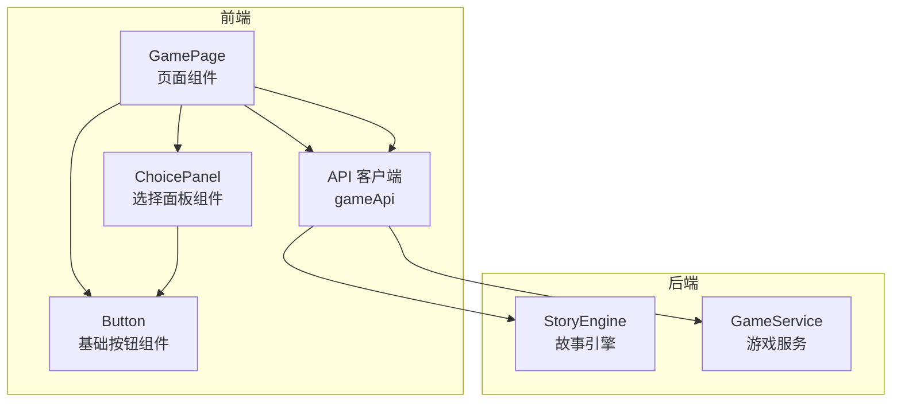
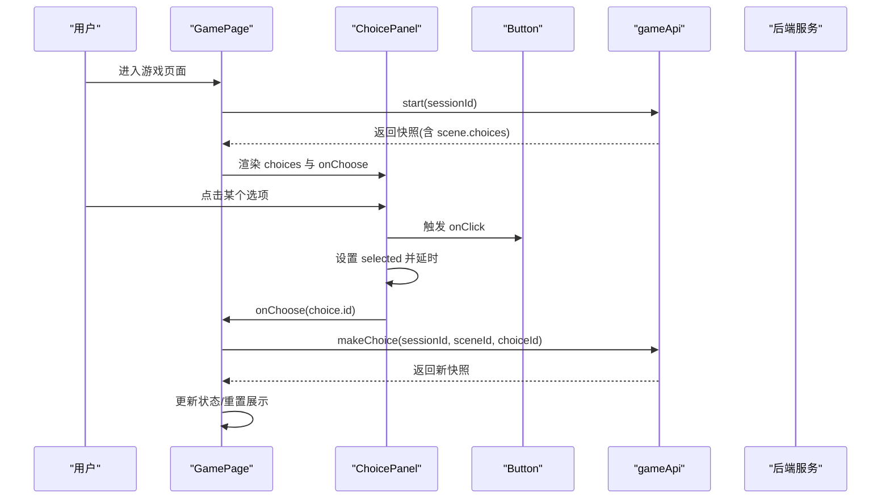
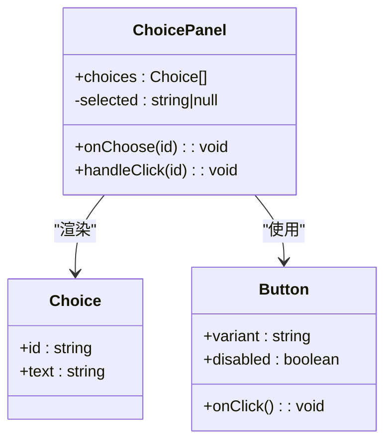
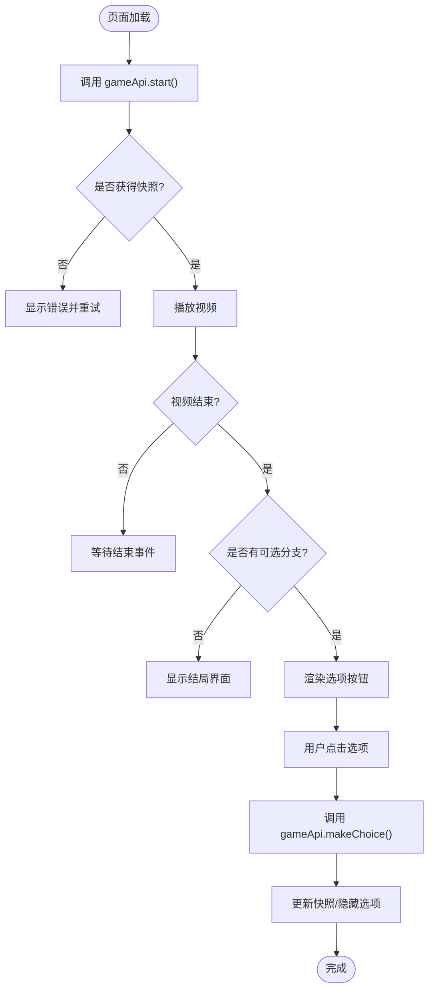
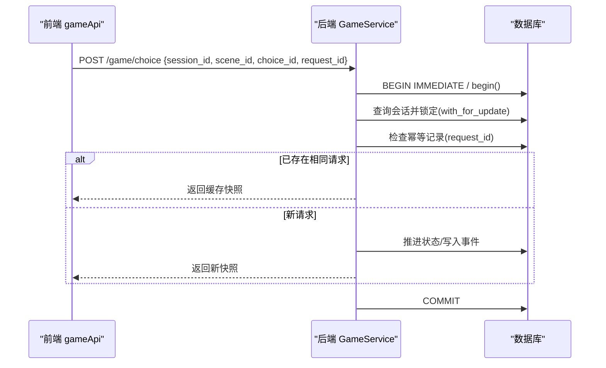
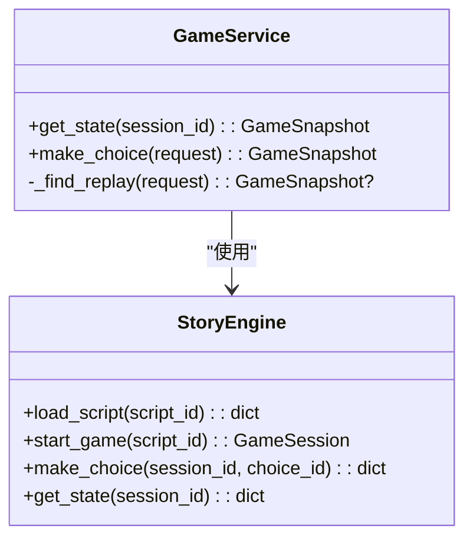
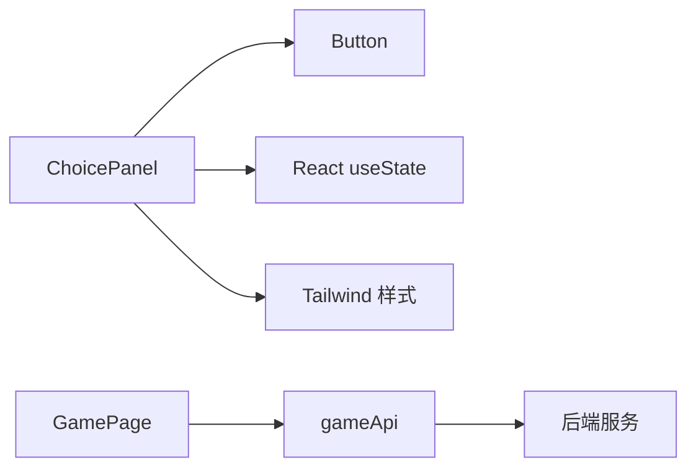

# 选择面板组件 (ChoicePanel)

<cite>
**本文引用的文件**   
- [choice-panel.tsx](file://frontend/src/components/choice-panel.tsx)
- [button.tsx](file://frontend/src/components/ui/button.tsx)
- [api.ts](file://frontend/src/lib/api.ts)
- [page.tsx](file://frontend/src/app/game/[sessionId]/page.tsx)
- [engine.py](file://backend/app/story/engine.py)
- [game_service.py](file://backend/app/game_service.py)
</cite>

## 目录
1. [简介](#简介)
2. [项目结构](#项目结构)
3. [核心组件](#核心组件)
4. [架构总览](#架构总览)
5. [详细组件分析](#详细组件分析)
6. [依赖分析](#依赖分析)
7. [性能考虑](#性能考虑)
8. [故障排查指南](#故障排查指南)
9. [结论](#结论)
10. [附录](#附录)

## 简介
本文件面向 ChoicePanel 选择面板组件，系统性阐述其设计模式、实现原理与使用方式。内容覆盖选项渲染、用户交互处理、选择结果回调、Props 接口定义、事件机制、与游戏引擎的数据通信、动态生成逻辑、选中状态视觉反馈、键盘导航支持、响应式设计与无障碍访问等关键特性，并提供与后端 API 集成的实际使用场景说明。

## 项目结构
ChoicePanel 位于前端组件目录中，作为可复用的 UI 组件被页面层调用；页面层负责与后端 API 交互并驱动数据流。后端提供故事引擎与游戏服务，用于处理会话与选择推进。

图表来源 
- [page.tsx:1-194](file://frontend/src/app/game/[sessionId]/page.tsx#L1-L194)
- [choice-panel.tsx:1-47](file://frontend/src/components/choice-panel.tsx#L1-L47)
- [button.tsx:1-59](file://frontend/src/components/ui/button.tsx#L1-L59)
- [api.ts:1-216](file://frontend/src/lib/api.ts#L1-L216)
- [engine.py:1-37](file://backend/app/story/engine.py#L1-L37)
- [game_service.py:63-385](file://backend/app/game_service.py#L63-L385)

章节来源
- [page.tsx:1-194](file://frontend/src/app/game/[sessionId]/page.tsx#L1-L194)
- [choice-panel.tsx:1-47](file://frontend/src/components/choice-panel.tsx#L1-L47)
- [button.tsx:1-59](file://frontend/src/components/ui/button.tsx#L1-L59)
- [api.ts:1-216](file://frontend/src/lib/api.ts#L1-L216)
- [engine.py:1-37](file://backend/app/story/engine.py#L1-L37)
- [game_service.py:63-385](file://backend/app/game_service.py#L63-L385)

## 核心组件
ChoicePanel 是一个无状态驱动的纯展示型组件，通过 props 接收选项列表与选择回调，内部维护短暂的“选中”状态以提供点击反馈。它基于 Button 组件构建，利用 Tailwind CSS 类名实现样式与过渡动画。

- Props 接口
  - choices: 选项数组，每项包含 id 与 text
  - onChoose: 选择回调函数，传入所选选项的 id
- 内部状态
  - selected: 当前选中的选项 id（短暂显示）
- 交互流程
  - 点击任一选项：立即设置 selected 为对应 id，触发视觉高亮与禁用其他选项
  - 延迟 500ms 后调用 onChoose(id)，随后清除 selected 恢复初始态

章节来源
- [choice-panel.tsx:1-47](file://frontend/src/components/choice-panel.tsx#L1-L47)

## 架构总览
ChoicePanel 在整体系统中的角色是“用户选择输入”的 UI 层。页面层 GamePage 负责加载游戏快照、控制选项展示时机，并在用户选择时调用 gameApi.makeChoice 向后端发起请求，更新快照并驱动后续剧情。

图表来源 
- [page.tsx:1-194](file://frontend/src/app/game/[sessionId]/page.tsx#L1-L194)
- [choice-panel.tsx:1-47](file://frontend/src/components/choice-panel.tsx#L1-L47)
- [api.ts:1-216](file://frontend/src/lib/api.ts#L1-L216)
- [game_service.py:63-385](file://backend/app/game_service.py#L63-L385)

## 详细组件分析

### ChoicePanel 组件分析
ChoicePanel 采用“受控 + 短暂本地状态”的模式：
- 受控：choices 由父组件传入，onChoose 将选择结果回传
- 短暂本地状态：selected 仅用于即时视觉反馈，不持久化业务状态

图表来源 
- [choice-panel.tsx:1-47](file://frontend/src/components/choice-panel.tsx#L1-L47)
- [button.tsx:1-59](file://frontend/src/components/ui/button.tsx#L1-L59)

#### 选项渲染与动态生成
- 动态生成：根据传入的 choices 数组进行 map 渲染，key 使用 choice.id
- 文本展示：每个选项的 text 通过 span 包裹并以小字号呈现
- 布局：外层容器使用间距类保证选项之间的垂直间隔

#### 用户交互处理
- 点击处理：onClick 绑定到 handleClick，设置 selected 并延时调用 onChoose
- 防重复提交：selected !== null 时禁用所有按钮，避免重复选择

#### 选择结果回调
- onChoose(id) 由父组件实现，通常用于调用 gameApi.makeChoice 并更新快照

#### 选中状态的视觉反馈
- 样式切换：selected === choice.id 时使用 default 变体，否则 outline
- 高亮与缩放：选中项应用背景色、前景色与 scale 变换，增强触觉反馈
- 过渡动画：transition-all 使样式变化平滑

#### 键盘导航支持
- 当前实现依赖 Button 的基础行为，未显式添加键盘导航（如方向键或 Enter/Space 选择）
- 建议扩展：增加 onKeyDown 监听 Enter/Space 触发选择，或使用具备内置无障碍支持的 Select 组件

章节来源
- [choice-panel.tsx:1-47](file://frontend/src/components/choice-panel.tsx#L1-L47)
- [button.tsx:1-59](file://frontend/src/components/ui/button.tsx#L1-L59)

### 页面集成与数据流（GamePage）
GamePage 负责：
- 初始化加载：调用 gameApi.start 获取快照
- 视频播放结束：触发 handleVideoEnded，决定是否展示选项
- 选择处理：handleChoice 调用 gameApi.makeChoice，更新快照并重置展示状态

图表来源 
- [page.tsx:1-194](file://frontend/src/app/game/[sessionId]/page.tsx#L1-L194)
- [api.ts:1-216](file://frontend/src/lib/api.ts#L1-L216)

章节来源
- [page.tsx:1-194](file://frontend/src/app/game/[sessionId]/page.tsx#L1-L194)
- [api.ts:1-216](file://frontend/src/lib/api.ts#L1-L216)

### 与后端 API 的通信
- 启动游戏：POST /game/start，携带 script_id
- 做出选择：POST /game/choice，携带 session_id、scene_id、choice_id、request_id
- 幂等性：后端通过 request_id 去重，防止并发重复推进

图表来源 
- [api.ts:1-216](file://frontend/src/lib/api.ts#L1-L216)
- [game_service.py:63-385](file://backend/app/game_service.py#L63-L385)

章节来源
- [api.ts:1-216](file://frontend/src/lib/api.ts#L1-L216)
- [game_service.py:63-385](file://backend/app/game_service.py#L63-L385)

### 与游戏引擎的数据通信
- StoryEngine 负责加载剧本、创建会话与处理选择
- GameService 封装了事务、幂等性与并发安全，确保选择推进的一致性

图表来源 
- [engine.py:1-37](file://backend/app/story/engine.py#L1-L37)
- [game_service.py:63-385](file://backend/app/game_service.py#L63-L385)

章节来源
- [engine.py:1-37](file://backend/app/story/engine.py#L1-L37)
- [game_service.py:63-385](file://backend/app/game_service.py#L63-L385)

## 依赖分析
ChoicePanel 的依赖关系清晰且内聚：
- 直接依赖：Button 组件（UI 基础能力）、React 状态管理
- 间接依赖：Tailwind 样式系统、父组件提供的 choices 与 onChoose
- 页面层依赖：gameApi 与后端服务，负责数据获取与选择推进

图表来源 
- [choice-panel.tsx:1-47](file://frontend/src/components/choice-panel.tsx#L1-L47)
- [button.tsx:1-59](file://frontend/src/components/ui/button.tsx#L1-L59)
- [api.ts:1-216](file://frontend/src/lib/api.ts#L1-L216)
- [page.tsx:1-194](file://frontend/src/app/game/[sessionId]/page.tsx#L1-L194)

章节来源
- [choice-panel.tsx:1-47](file://frontend/src/components/choice-panel.tsx#L1-L47)
- [button.tsx:1-59](file://frontend/src/components/ui/button.tsx#L1-L59)
- [api.ts:1-216](file://frontend/src/lib/api.ts#L1-L216)
- [page.tsx:1-194](file://frontend/src/app/game/[sessionId]/page.tsx#L1-L194)

## 性能考虑
- 渲染开销：choices 数量较少时，map 渲染开销可忽略；若选项较多，建议虚拟化或分页
- 交互延迟：500ms 延时用于视觉反馈，不影响用户体验；如需更短反馈，可降低延时
- 网络请求：makeChoice 为异步操作，应避免重复提交（已通过 disabled 与 selected 控制）
- 样式计算：Tailwind 类名拼接在运行时计算，影响极小；可使用 memo 优化父组件重渲染

[本节为通用指导，无需引用具体文件]

## 故障排查指南
- 选项不显示
  - 检查父组件是否正确传递 choices 与 onChoose
  - 确认 snapshot.scene.choices 非空
- 选择无效或无响应
  - 检查 gameApi.makeChoice 参数是否正确（session_id、scene_id、choice_id）
  - 查看后端日志，确认是否存在幂等冲突或会话不存在
- 视觉反馈异常
  - 确认 Button variant 与 Tailwind 主题变量可用
  - 检查 selected 状态是否被意外重置

章节来源
- [page.tsx:1-194](file://frontend/src/app/game/[sessionId]/page.tsx#L1-L194)
- [api.ts:1-216](file://frontend/src/lib/api.ts#L1-L216)
- [game_service.py:63-385](file://backend/app/game_service.py#L63-L385)

## 结论
ChoicePanel 以简洁的 Props 接口与短暂本地状态实现了直观的选择交互，配合页面层的 API 调用与后端服务的幂等保障，形成完整的选择推进链路。建议在现有基础上增强键盘导航与无障碍支持，以提升可访问性与用户体验。

[本节为总结性内容，无需引用具体文件]

## 附录

### Props 接口定义
- choices: 选项数组，每项包含 id 与 text
- onChoose: 选择回调函数，传入所选选项的 id

章节来源
- [choice-panel.tsx:1-47](file://frontend/src/components/choice-panel.tsx#L1-L47)

### 事件处理机制
- onClick：绑定到 Button，触发 handleClick
- onKeyDown（建议）：监听 Enter/Space 触发选择，提升键盘可达性

章节来源
- [choice-panel.tsx:1-47](file://frontend/src/components/choice-panel.tsx#L1-L47)

### 与后端 API 集成示例（描述性）
- 启动游戏：调用 gameApi.start(scriptId) 获取快照
- 选择分支：调用 gameApi.makeChoice(sessionId, sceneId, choiceId) 推进剧情
- 错误处理：捕获异常并提示重试

章节来源
- [api.ts:1-216](file://frontend/src/lib/api.ts#L1-L216)
- [page.tsx:1-194](file://frontend/src/app/game/[sessionId]/page.tsx#L1-L194)

### 响应式设计
- 使用 Tailwind 的响应式类（如 w-full、grid gap-3）适配不同屏幕尺寸
- 按钮高度与内边距自适应，确保移动端触控友好

章节来源
- [choice-panel.tsx:1-47](file://frontend/src/components/choice-panel.tsx#L1-L47)
- [page.tsx:1-194](file://frontend/src/app/game/[sessionId]/page.tsx#L1-L194)

### 无障碍访问（A11y）
- 当前实现依赖 Button 的基础无障碍属性
- 建议补充：aria-label、role="listbox"、键盘导航（上下箭头移动焦点，Enter/Space 选择）

章节来源
- [button.tsx:1-59](file://frontend/src/components/ui/button.tsx#L1-L59)
- [choice-panel.tsx:1-47](file://frontend/src/components/choice-panel.tsx#L1-L47)