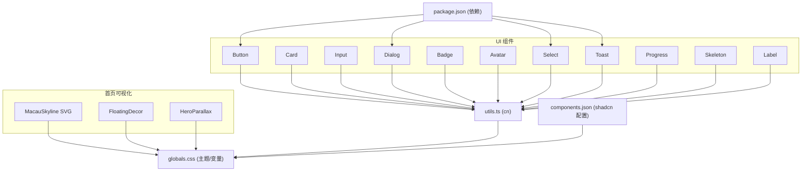
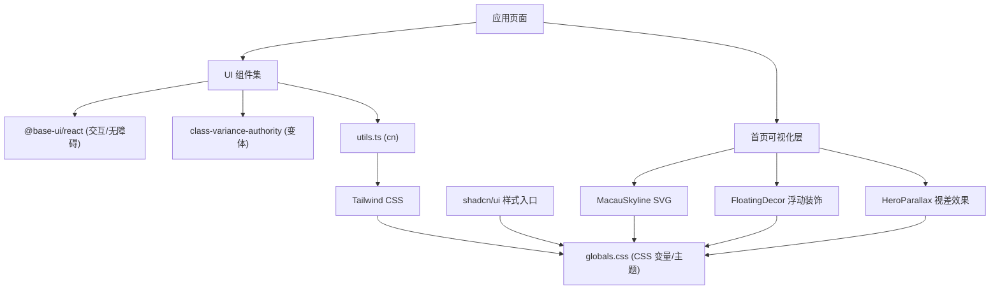
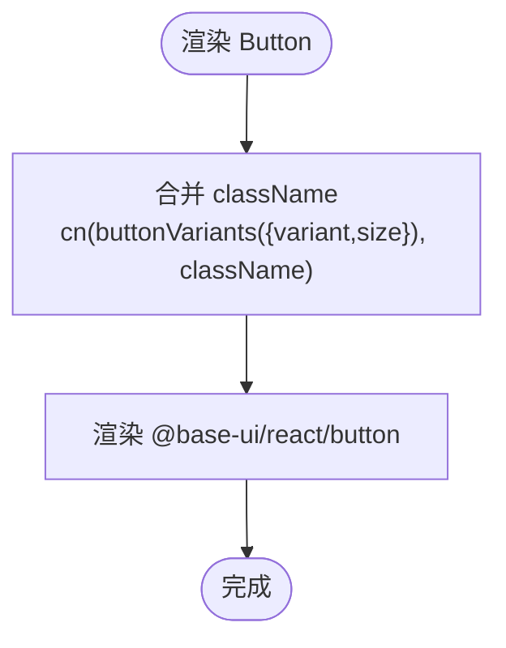
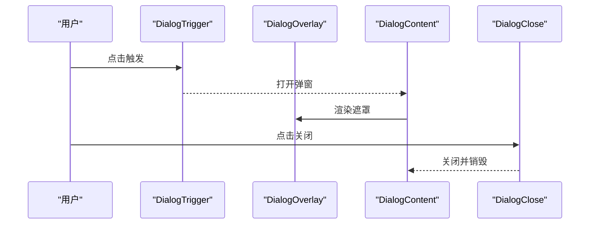
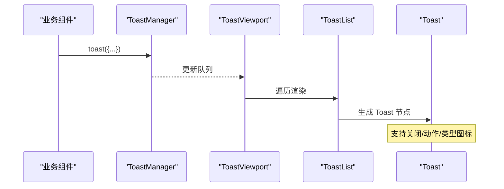
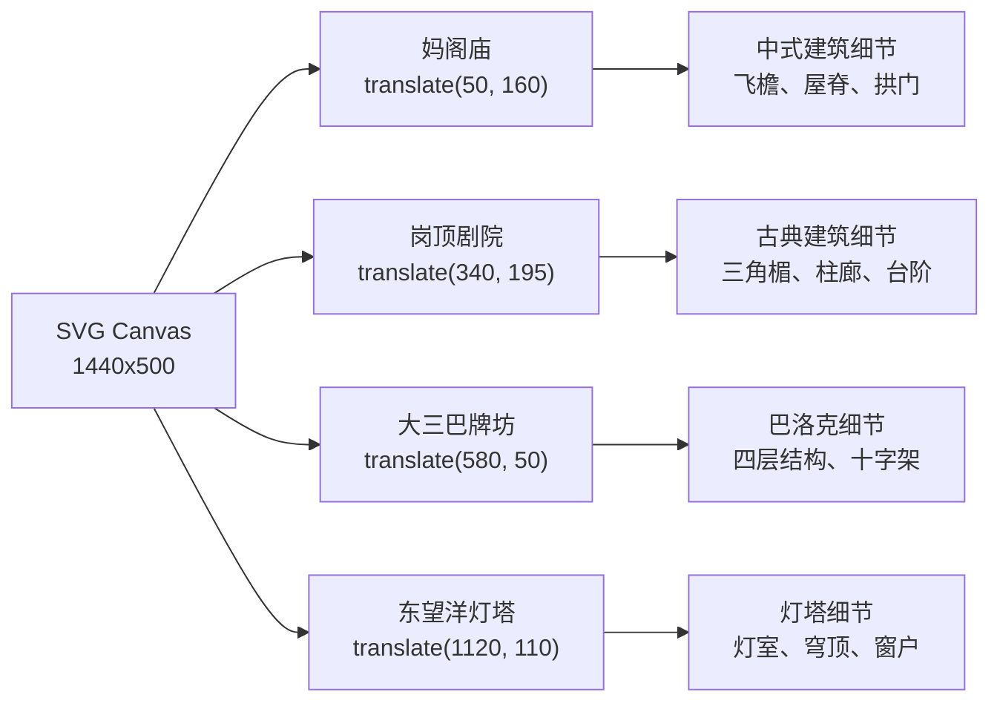
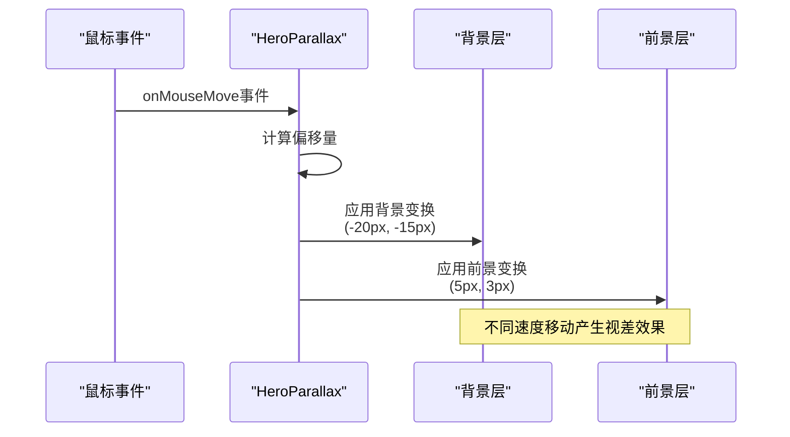
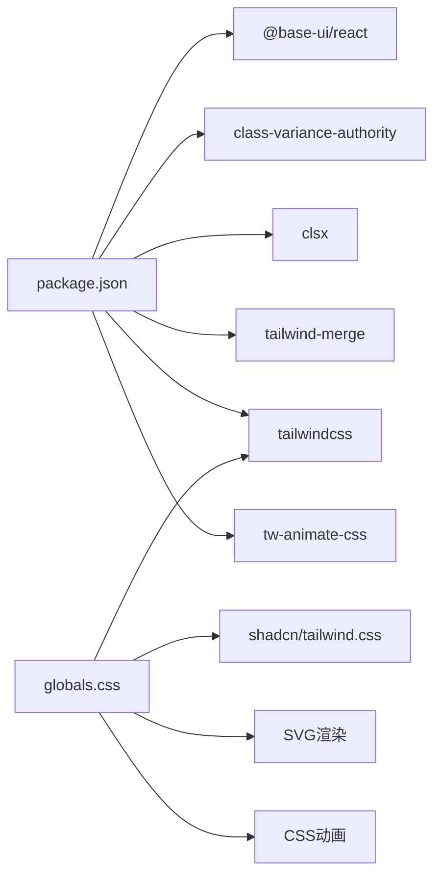

# 基础组件库

<cite>
**本文引用的文件**   
- [frontend/src/components/ui/button.tsx](file://frontend/src/components/ui/button.tsx)
- [frontend/src/components/ui/card.tsx](file://frontend/src/components/ui/card.tsx)
- [frontend/src/components/ui/input.tsx](file://frontend/src/components/ui/input.tsx)
- [frontend/src/components/ui/dialog.tsx](file://frontend/src/components/ui/dialog.tsx)
- [frontend/src/components/ui/badge.tsx](file://frontend/src/components/ui/badge.tsx)
- [frontend/src/components/ui/avatar.tsx](file://frontend/src/components/ui/avatar.tsx)
- [frontend/src/components/ui/select.tsx](file://frontend/src/components/ui/select.tsx)
- [frontend/src/components/ui/toast.tsx](file://frontend/src/components/ui/toast.tsx)
- [frontend/src/components/ui/progress.tsx](file://frontend/src/components/ui/progress.tsx)
- [frontend/src/components/ui/skeleton.tsx](file://frontend/src/components/ui/skeleton.tsx)
- [frontend/src/components/ui/label.tsx](file://frontend/src/components/ui/label.tsx)
- [frontend/src/lib/utils.ts](file://frontend/src/lib/utils.ts)
- [frontend/src/app/globals.css](file://frontend/src/app/globals.css)
- [frontend/src/app/page.tsx](file://frontend/src/app/page.tsx)
- [frontend/components.json](file://frontend/components.json)
- [frontend/package.json](file://frontend/package.json)
</cite>

## 更新摘要
**所做更改**   
- 更新了首页SVG天际线可视化部分，增强了澳门地标建筑的详细程度和文化准确性
- 新增了妈阁庙、岗顶剧院、大三巴牌坊和东望洋灯塔的详细SVG实现
- 改进了建筑细节和颜色渐变效果
- 更新了主题系统以支持新的视觉元素

## 目录
1. [简介](#简介)
2. [项目结构](#项目结构)
3. [核心组件](#核心组件)
4. [架构总览](#架构总览)
5. [详细组件分析](#详细组件分析)
6. [依赖关系分析](#依赖关系分析)
7. [性能考量](#性能考量)
8. [故障排查指南](#故障排查指南)
9. [结论](#结论)
10. [附录](#附录)

## 简介
本文件为澳秘 Macau Mystery 前端基础组件库的技术文档，聚焦基于 shadcn/ui 与 @base-ui/react 构建的 UI 原子组件。内容涵盖 Button、Card、Input、Dialog、Badge、Avatar 等核心组件的设计模式、API 接口、class-variance-authority 变体系统、样式定制与主题配置、Props 设计原则、事件处理机制、无障碍访问支持、响应式实现、性能优化策略与复用最佳实践，并提供使用指引与示例路径。

**更新** 新增了首页SVG天际线可视化的详细说明，包括澳门地标建筑的SVG实现和主题系统的增强。

## 项目结构
- 组件位于 frontend/src/components/ui，采用"按功能拆分"的组织方式，每个组件独立文件，便于维护与按需引入。
- 样式通过 Tailwind CSS 与 CSS 变量驱动，全局主题在 globals.css 中定义，shadcn/ui 的样式入口由 components.json 指定。
- 工具函数 cn 用于合并类名，确保 Tailwind 类优先级正确覆盖。
- 首页包含复杂的SVG天际线可视化，展示了澳门文化遗产地标。

**图表来源** 
- [frontend/src/components/ui/button.tsx:1-59](file://frontend/src/components/ui/button.tsx#L1-L59)
- [frontend/src/components/ui/card.tsx:1-104](file://frontend/src/components/ui/card.tsx#L1-L104)
- [frontend/src/components/ui/input.tsx:1-21](file://frontend/src/components/ui/input.tsx#L1-L21)
- [frontend/src/components/ui/dialog.tsx:1-161](file://frontend/src/components/ui/dialog.tsx#L1-L161)
- [frontend/src/components/ui/badge.tsx:1-53](file://frontend/src/components/ui/badge.tsx#L1-L53)
- [frontend/src/components/ui/avatar.tsx:1-110](file://frontend/src/components/ui/avatar.tsx#L1-L110)
- [frontend/src/components/ui/select.tsx:1-202](file://frontend/src/components/ui/select.tsx#L1-L202)
- [frontend/src/components/ui/toast.tsx:1-235](file://frontend/src/components/ui/toast.tsx#L1-L235)
- [frontend/src/components/ui/progress.tsx:1-84](file://frontend/src/components/ui/progress.tsx#L1-L84)
- [frontend/src/components/ui/skeleton.tsx:1-14](file://frontend/src/components/ui/skeleton.tsx#L1-L14)
- [frontend/src/components/ui/label.tsx:1-21](file://frontend/src/components/ui/label.tsx#L1-L21)
- [frontend/src/app/page.tsx:38-224](file://frontend/src/app/page.tsx#L38-L224)
- [frontend/src/lib/utils.ts:1-7](file://frontend/src/lib/utils.ts#L1-L7)
- [frontend/src/app/globals.css:1-331](file://frontend/src/app/globals.css#L1-L331)
- [frontend/components.json:1-26](file://frontend/components.json#L1-L26)
- [frontend/package.json:1-37](file://frontend/package.json#L1-L37)

**章节来源**
- [frontend/src/components/ui/button.tsx:1-59](file://frontend/src/components/ui/button.tsx#L1-L59)
- [frontend/src/components/ui/card.tsx:1-104](file://frontend/src/components/ui/card.tsx#L1-L104)
- [frontend/src/components/ui/input.tsx:1-21](file://frontend/src/components/ui/input.tsx#L1-L21)
- [frontend/src/components/ui/dialog.tsx:1-161](file://frontend/src/components/ui/dialog.tsx#L1-L161)
- [frontend/src/components/ui/badge.tsx:1-53](file://frontend/src/components/ui/badge.tsx#L1-L53)
- [frontend/src/components/ui/avatar.tsx:1-110](file://frontend/src/components/ui/avatar.tsx#L1-L110)
- [frontend/src/components/ui/select.tsx:1-202](file://frontend/src/components/ui/select.tsx#L1-L202)
- [frontend/src/components/ui/toast.tsx:1-235](file://frontend/src/components/ui/toast.tsx#L1-L235)
- [frontend/src/components/ui/progress.tsx:1-84](file://frontend/src/components/ui/progress.tsx#L1-L84)
- [frontend/src/components/ui/skeleton.tsx:1-14](file://frontend/src/components/ui/skeleton.tsx#L1-L14)
- [frontend/src/components/ui/label.tsx:1-21](file://frontend/src/components/ui/label.tsx#L1-L21)
- [frontend/src/app/page.tsx:38-224](file://frontend/src/app/page.tsx#L38-L224)
- [frontend/src/lib/utils.ts:1-7](file://frontend/src/lib/utils.ts#L1-L7)
- [frontend/src/app/globals.css:1-331](file://frontend/src/app/globals.css#L1-L331)
- [frontend/components.json:1-26](file://frontend/components.json#L1-L26)
- [frontend/package.json:1-37](file://frontend/package.json#L1-L37)

## 核心组件
- Button：基于 @base-ui/react/button，使用 cva 定义 variant 与 size 变体，统一焦点、禁用、图标尺寸与可访问性状态。
- Card：组合 CardHeader/CardTitle/CardDescription/CardAction/CardContent/CardFooter，通过 data-size 控制间距与排版。
- Input：基于 @base-ui/react/input，内置 focus、disabled、aria-invalid 等状态样式，适配暗色主题。
- Dialog：封装 Root/Trigger/Portal/Close/Overlay/Popup/Header/Footer/Title/Description，提供关闭按钮与动画过渡。
- Badge：基于 useRender + mergeProps，支持多种 variant，默认标签为 span，适合轻量标记。
- Avatar：Root/Image/Fallback/Badge/Group/GroupCount，支持多尺寸与叠加徽章。
- Select：完整下拉选择器，含分组、分隔符、滚动箭头、定位与动画。
- Toast：消息通知，支持类型化图标、动作按钮、关闭、视口与列表渲染。
- Progress：进度条轨道与指示器，支持标签与数值显示。
- Skeleton：骨架屏占位，配合加载态提升感知性能。
- Label：表单标签，与 peer 状态联动。

**更新** 新增了首页SVG天际线可视化组件，包括MacauSkyline、FloatingDecor和HeroParallax三个核心可视化组件。

**章节来源**
- [frontend/src/components/ui/button.tsx:1-59](file://frontend/src/components/ui/button.tsx#L1-L59)
- [frontend/src/components/ui/card.tsx:1-104](file://frontend/src/components/ui/card.tsx#L1-L104)
- [frontend/src/components/ui/input.tsx:1-21](file://frontend/src/components/ui/input.tsx#L1-L21)
- [frontend/src/components/ui/dialog.tsx:1-161](file://frontend/src/components/ui/dialog.tsx#L1-L161)
- [frontend/src/components/ui/badge.tsx:1-53](file://frontend/src/components/ui/badge.tsx#L1-L53)
- [frontend/src/components/ui/avatar.tsx:1-110](file://frontend/src/components/ui/avatar.tsx#L1-L110)
- [frontend/src/components/ui/select.tsx:1-202](file://frontend/src/components/ui/select.tsx#L1-L202)
- [frontend/src/components/ui/toast.tsx:1-波浪图案:1-235](file://frontend/src/components/ui/toast.tsx#L1-L235)
- [frontend/src/components/ui/progress.tsx:1-84](file://frontend/src/components/ui/progress.tsx#L1-L84)
- [frontend/src/components/ui/skeleton.tsx:1-14](file://frontend/src/components/ui/skeleton.tsx#L1-L14)
- [frontend/src/components/ui/label.tsx:1-21](file://frontend/src/components/ui/label.tsx#L1-L21)
- [frontend/src/app/page.tsx:38-224](file://frontend/src/app/page.tsx#L38-L224)

## 架构总览
组件层以 @base-ui/react 为交互与可访问性基座，通过 shadcn/ui 的样式约定与 Tailwind 原子类进行外观定制；class-variance-authority 负责变体管理；cn 工具保证类名合并与覆盖顺序；CSS 变量承载主题色板与圆角等设计令牌。

**更新** 新增了首页可视化架构，包含SVG天际线、浮动装饰和视差效果的层次结构。

**图表来源** 
- [frontend/src/components/ui/button.tsx:1-59](file://frontend/src/components/ui/button.tsx#L1-L59)
- [frontend/src/components/ui/dialog.tsx:1-161](file://frontend/src/components/ui/dialog.tsx#L1-L161)
- [frontend/src/components/ui/badge.tsx:1-53](file://frontend/src/components/ui/badge.tsx#L1-L53)
- [frontend/src/lib/utils.ts:1-7](file://frontend/src/lib/utils.ts#L1-L7)
- [frontend/src/app/globals.css:1-331](file://frontend/src/app/globals.css#L1-L331)
- [frontend/src/app/page.tsx:38-224](file://frontend/src/app/page.tsx#L38-L224)
- [frontend/components.json:1-26](file://frontend/components.json#L1-L26)

## 详细组件分析

### Button（按钮）
- 设计要点
  - 使用 cva 定义 variant（default、outline、secondary、ghost、destructive、link）与 size（default、xs、sm、lg、icon、icon-xs、icon-sm、icon-lg）。
  - 通过 data-slot 与 group 语义组织样式，支持图标尺寸自适应与禁用态。
  - 焦点环、无效态（aria-invalid）与暗色主题样式完备。
- Props 与 API
  - 接受 VariantProps<typeof buttonVariants> 与 @base-ui/react/button 的原始 Props。
  - className 可通过 cn 合并扩展。
- 事件与无障碍
  - 透传所有原生按钮事件；focus-visible 与 aria-invalid 状态由底层提供。
- 响应式与主题
  - 颜色与边框通过 CSS 变量映射到 primary/foreground 等语义色。
- 使用示例路径
  - [button.tsx:1-59](file://frontend/src/components/ui/button.tsx#L1-L59)

**图表来源** 
- [frontend/src/components/ui/button.tsx:1-59](file://frontend/src/components/ui/button.tsx#L1-L59)

**章节来源**
- [frontend/src/components/ui/button.tsx:1-59](file://frontend/src/components/ui/button.tsx#L1-L59)

### Card（卡片）
- 设计要点
  - 复合组件：Card、CardHeader、CardTitle、CardDescription、CardAction、CardContent、CardFooter。
  - 通过 data-size="default|sm" 控制间距与字号，图片首尾自动圆角。
- Props 与 API
  - Card 接受 div 属性与 size；子组件均透传对应 HTML 元素属性。
- 无障碍
  - 语义化结构，标题与描述分离，便于屏幕阅读器解析。
- 使用示例路径
  - [card.tsx:1-104](file://frontend/src/components/ui/card.tsx#L1-L104)

**章节来源**
- [frontend/src/components/ui/card.tsx:1-104](file://frontend/src/components/ui/card.tsx#L1-L104)

### Input（输入框）
- 设计要点
  - 基于 @base-ui/react/input，统一高度、内边距、边框与焦点环。
  - 支持 disabled、placeholder、aria-invalid 与暗色背景。
- Props 与 API
  - 透传 input 原生属性，type 显式传递。
- 使用示例路径
  - [input.tsx:1-21](file://frontend/src/components/ui/input.tsx#L1-L21)

**章节来源**
- [frontend/src/components/ui/input.tsx:1-21](file://frontend/src/components/ui/input.tsx#L1-L21)

### Dialog（对话框）
- 设计要点
  - 封装 Root/Trigger/Portal/Close/Overlay/Popup/Header/Footer/Title/Description。
  - 默认提供右上角关闭按钮与淡入缩放动画。
- Props 与 API
  - showCloseButton 控制是否渲染关闭按钮；各子组件透传对应 @base-ui/react/dialog 属性。
- 事件与无障碍
  - 使用 Portal 弹出层，Focus Trap 与 Backdrop 行为由底层保障。
- 使用示例路径
  - [dialog.tsx:1-161](file://frontend/src/components/ui/dialog.tsx#L1-L161)

**图表来源** 
- [frontend/src/components/ui/dialog.tsx:1-161](file://frontend/src/components/ui/dialog.tsx#L1-L161)

**章节来源**
- [frontend/src/components/ui/dialog.tsx:1-161](file://frontend/src/components/ui/dialog.tsx#L1-L161)

### Badge（标签）
- 设计要点
  - 使用 useRender + mergeProps，默认渲染 span，支持多种 variant。
  - 图标插槽与无效态样式一致。
- Props 与 API
  - 接受 render 自定义渲染与 VariantProps。
- 使用示例路径
  - [badge.tsx:1-53](file://frontend/src/components/ui/badge.tsx#L1-L53)

**章节来源**
- [frontend/src/components/ui/badge.tsx:1-53](file://frontend/src/components/ui/badge.tsx#L1-L53)

### Avatar（头像）
- 设计要点
  - Root/Image/Fallback/Badge/Group/GroupCount，支持 sm/default/lg 尺寸。
  - Group 自动负外边距堆叠，GroupCount 显示总数。
- Props 与 API
  - 各子组件透传对应 @base-ui/react/avatar 或 HTML 属性。
- 使用示例路径
  - [avatar.tsx:1-110](file://frontend/src/components/ui/avatar.tsx#L1-L110)

**章节来源**
- [frontend/src/components/ui/avatar.tsx:1-110](file://frontend/src/components/ui/avatar.tsx#L1-L110)

### Select（选择器）
- 设计要点
  - 包含 Trigger/Value/Content/Item/Group/Label/Separator/ScrollUp/Down。
  - Positioner 控制弹出位置与对齐，支持滑入动画。
- Props 与 API
  - Trigger 支持 size；Content 支持 side、sideOffset、align、alignOffset、alignItemWithTrigger。
- 使用示例路径
  - [select.tsx:1-202](file://frontend/src/components/ui/select.tsx#L1-L202)

**章节来源**
- [frontend/src/components/ui/select.tsx:1-202](file://frontend/src/components/ui/select.tsx#L1-L202)

### Toast（消息提示）
- 设计要点
  - 基于 createToastManager 管理消息队列，Viewport 固定定位，List 渲染多条。
  - 支持 success/info/warning/error/loading 类型图标与动作按钮。
- Props 与 API
  - Toaster 作为 Provider，toast() 调用创建消息。
- 使用示例路径
  - [toast.tsx:1-235](file://frontend/src/components/ui/toast.tsx#L1-L235)

**图表来源** 
- [frontend/src/components/ui/toast.tsx:1-235](file://frontend/src/components/ui/toast.tsx#L1-L235)

**章节来源**
- [frontend/src/components/ui/toast.tsx:1-235](file://frontend/src/components/ui/toast.tsx#L1-L235)

### Progress（进度条）
- 设计要点
  - Root/Track/Indicator/Label/Value 组合，轨道与指示器分离。
- Props 与 API
  - value 驱动指示器宽度，Label/Value 展示文本。
- 使用示例路径
  - [progress.tsx:1-84](file://frontend/src/components/ui/progress.tsx#L1-L84)

**章节来源**
- [frontend/src/components/ui/progress.tsx:1-84](file://frontend/src/components/ui/progress.tsx#L1-L84)

### Skeleton（骨架屏）
- 设计要点
  - 简单占位容器，带脉冲动画与圆角。
- 使用示例路径
  - [skeleton.tsx:1-14](file://frontend/src/components/ui/skeleton.tsx#L1-L14)

**章节来源**
- [frontend/src/components/ui/skeleton.tsx:1-14](file://frontend/src/components/ui/skeleton.tsx#L1-L14)

### Label（标签）
- 设计要点
  - 与 peer 状态联动，禁用态透明与不可点。
- 使用示例路径
  - [label.tsx:1-21](file://frontend/src/components/ui/label.tsx#L1-L21)

**章节来源**
- [frontend/src/components/ui/label.tsx:1-21](file://frontend/src/components/ui/label.tsx#L1-L21)

### MacauSkyline（澳门天际线SVG）
- 设计要点
  - 使用SVG绘制澳门文化遗产地标，包括妈阁庙、岗顶剧院、大三巴牌坊和东望洋灯塔。
  - 采用半透明填充和CSS变量颜色，支持明暗主题切换。
  - 包含详细的建筑特征：飞檐翘角、古典柱廊、巴洛克立面、圆柱形塔楼等。
- 技术实现
  - 使用SVG path、rect、ellipse等基本形状组合复杂建筑轮廓。
  - 通过transform属性精确定位各个地标建筑。
  - 利用linearGradient创建渐变色效果。
- 文化准确性
  - 妈阁庙：传统中式建筑风格，包含飞檐、屋脊装饰和拱门。
  - 岗顶剧院：新古典主义风格，三角楣饰和多立克柱式。
  - 大三巴牌坊：巴洛克风格立面，四层结构和十字架顶部。
  - 东望洋灯塔：圆柱形塔楼，玻璃灯室和穹顶结构。
- 使用示例路径
  - [page.tsx:38-224](file://frontend/src/app/page.tsx#L38-L224)

**图表来源** 
- [frontend/src/app/page.tsx:38-224](file://frontend/src/app/page.tsx#L38-L224)

**章节来源**
- [frontend/src/app/page.tsx:38-224](file://frontend/src/app/page.tsx#L38-L224)

### FloatingDecor（浮动装饰）
- 设计要点
  - 纯CSS几何形状装饰元素，营造动态视觉效果。
  - 包含菱形、圆形等几何图形，使用不同颜色和透明度。
  - 通过CSS动画实现浮动和脉冲发光效果。
- 技术实现
  - 使用绝对定位和transform旋转创建菱形效果。
  - 结合animate-float、animate-pulse-glow等关键帧动画。
  - 利用CSS变量控制颜色和透明度。
- 使用示例路径
  - [page.tsx:17-36](file://frontend/src/app/page.tsx#L17-L36)

**章节来源**
- [frontend/src/app/page.tsx:17-36](file://frontend/src/app/page.tsx#L17-L36)

### HeroParallax（视差效果）
- 设计要点
  - 实现鼠标跟随的视差滚动效果，增强用户体验。
  - 背景层和内容层以不同速度移动，创造深度感。
  - 使用React hooks管理状态和事件处理。
- 技术实现
  - 通过useRef获取DOM元素引用。
  - 使用useState存储鼠标偏移量。
  - 计算鼠标位置相对于容器的比例。
  - 应用不同的transform值给背景和前景层。
- 性能优化
  - 使用will-change提示浏览器优化合成层。
  - 合理的动画缓动函数避免卡顿。
- 使用示例路径
  - [page.tsx:227-265](file://frontend/src/app/page.tsx#L227-L265)

**图表来源** 
- [frontend/src/app/page.tsx:227-265](file://frontend/src/app/page.tsx#L227-L265)

**章节来源**
- [frontend/src/app/page.tsx:227-265](file://frontend/src/app/page.tsx#L227-L265)

## 依赖关系分析
- 运行时依赖
  - @base-ui/react：提供无头组件与无障碍能力。
  - class-variance-authority：变体系统。
  - clsx + tailwind-merge：类名合并与覆盖。
  - lucide-react：图标。
- 样式依赖
  - tailwindcss + tw-animate-css：原子类与动画。
  - shadcn/tailwind.css：样式入口。
  - globals.css：主题变量与自定义动画。
- 配置
  - components.json：shadcn 配置（样式风格、RSC、别名、图标库）。
  - package.json：依赖版本与脚本。

**更新** 新增了首页可视化相关的依赖，包括SVG渲染和CSS动画库。

**图表来源** 
- [frontend/package.json:1-37](file://frontend/package.json#L1-L37)
- [frontend/components.json:1-26](file://frontend/components.json#L1-L26)
- [frontend/src/app/globals.css:1-331](file://frontend/src/app/globals.css#L1-L331)

**章节来源**
- [frontend/package.json:1-37](file://frontend/package.json#L1-L37)
- [frontend/components.json:1-26](file://frontend/components.json#L1-L26)
- [frontend/src/app/globals.css:1-331](file://frontend/src/app/globals.css#L1-L331)

## 性能考量
- 类名合并
  - 使用 cn 将 clsx 与 tailwind-merge 结合，避免重复与冲突类名，减少重排。
- 条件渲染与懒加载
  - Dialog/Select/Toast 等弹出层使用 Portal 与按需渲染，降低首屏负担。
- 动画与过渡
  - 使用 CSS 动画与 will-change 优化合成层，避免布局抖动。
- 图标与资源
  - 使用 lucide-react 矢量图标，按需引入，减小体积。
- 主题变量
  - 通过 CSS 变量切换明暗主题，避免大量分支判断。
- SVG优化
  - SVG天际线使用半透明填充和CSS变量，避免重复计算。
  - 合理使用preserveAspectRatio确保响应式显示。
- 视差效果优化
  - 使用requestAnimationFrame优化鼠标事件处理。
  - 合理的transform值避免过度重绘。

**更新** 新增了SVG渲染和视差效果的性能优化策略。

## 故障排查指南
- 样式未生效
  - 检查 cn 是否正确合并类名；确认 Tailwind 已导入 shadcn/tailwind.css。
  - 查看 globals.css 中的 CSS 变量是否被覆盖。
- 主题切换无效
  - 确认 html/body 上 dark 类切换逻辑存在；变量在 :root 与 .dark 下均已定义。
- 无障碍问题
  - 确保使用 @base-ui/react 提供的组件，不要移除必要的 aria-* 与 role。
- Dialog/Select/Toast 无法弹出
  - 确认已在应用根挂载 Toaster 或相关 Provider；Portal 层级未被 z-index 覆盖。
- 表单控件状态异常
  - 检查 disabled、aria-invalid 状态是否与业务状态同步。
- SVG显示问题
  - 检查SVG viewBox和preserveAspectRatio设置。
  - 确认CSS变量在SVG中使用正确。
- 视差效果异常
  - 检查ref引用是否正确获取DOM元素。
  - 验证鼠标事件监听器是否正确绑定。

**更新** 新增了SVG和视差效果相关的故障排查指南。

**章节来源**
- [frontend/src/lib/utils.ts:1-7](file://frontend/src/lib/utils.ts#L1-L7)
- [frontend/src/app/globals.css:1-331](file://frontend/src/app/globals.css#L1-L331)
- [frontend/src/components/ui/dialog.tsx:1-161](file://frontend/src/components/ui/dialog.tsx#L1-L161)
- [frontend/src/components/ui/select.tsx:1-202](file://frontend/src/components/ui/select.tsx#L1-L202)
- [frontend/src/components/ui/toast.tsx:1-235](file://frontend/src/components/ui/toast.tsx#L1-L235)
- [frontend/src/app/page.tsx:38-224](file://frontend/src/app/page.tsx#L38-L224)

## 结论
本基础组件库以 @base-ui/react 为核心，结合 shadcn/ui 的样式约定与 Tailwind 原子类，构建了高内聚、低耦合、可复用的 UI 组件集合。通过 class-variance-authority 的变体系统与 CSS 变量的主题体系，实现了灵活的样式定制与一致的视觉语言。组件遵循无障碍与响应式设计原则，具备完善的错误处理与性能优化策略，适用于复杂业务场景的快速迭代。

**更新** 新增的首页SVG天际线可视化展示了澳门文化遗产地标，通过精确的SVG绘制和CSS动画效果，为用户提供了沉浸式的文化体验。视差效果和浮动装饰进一步增强了页面的视觉层次感和交互性。

## 附录

### 主题与样式定制
- 主题变量
  - 在 globals.css 中定义 --primary、--background、--ring 等变量，并在 :root 与 .dark 下分别设置。
  - 新增澳门主题色彩：azulejo（蓝色）、jade（绿色）、lacquer（红色）、brass（金色）、limestone（米色）。
- 组件级定制
  - 通过 className 传入覆盖默认样式；或使用 cn 合并新增类名。
  - SVG组件使用CSS变量实现主题切换。
- 变体扩展
  - 在 Button/Badge 等使用 cva 的组件中新增 variant 值，保持命名一致性。

**更新** 新增了澳门主题色彩系统和SVG组件的主题定制方法。

**章节来源**
- [frontend/src/app/globals.css:1-331](file://frontend/src/app/globals.css#L1-L331)
- [frontend/src/components/ui/button.tsx:1-59](file://frontend/src/components/ui/button.tsx#L1-L59)
- [frontend/src/components/ui/badge.tsx:1-53](file://frontend/src/components/ui/badge.tsx#L1-L53)
- [frontend/src/app/page.tsx:38-224](file://frontend/src/app/page.tsx#L38-L224)

### 响应式设计与最佳实践
- 断点与容器
  - 使用 Tailwind 断点与 @container 查询实现弹性布局。
  - SVG使用viewBox和preserveAspectRatio确保跨设备显示。
- 弹出层定位
  - Select/Dialog/Toast 使用 Positioner/Portal 确保在不同视口下的正确显示。
- 组件复用
  - 将常用组合封装为高阶组件或模板，减少重复代码。
- SVG优化
  - 使用半透明填充和CSS变量减少渲染开销。
  - 合理组织SVG结构，使用group元素批量变换。

**更新** 新增了SVG响应式设计和优化最佳实践。

**章节来源**
- [frontend/src/components/ui/select.tsx:1-202](file://frontend/src/components/ui/select.tsx#L1-L202)
- [frontend/src/components/ui/dialog.tsx:1-161](file://frontend/src/components/ui/dialog.tsx#L1-L161)
- [frontend/src/components/ui/toast.tsx:1-235](file://frontend/src/components/ui/toast.tsx#L1-L235)
- [frontend/src/app/page.tsx:38-224](file://frontend/src/app/page.tsx#L38-L224)

### 无障碍访问支持
- 语义化标签
  - 使用合适的 HTML 元素与 aria-* 属性，确保屏幕阅读器可读。
  - SVG添加aria-hidden属性避免干扰屏幕阅读器。
- 键盘导航
  - 依赖 @base-ui/react 的 Focus Management，保证 Tab/Enter/Escape 等行为。
- 状态反馈
  - 通过 aria-invalid、aria-expanded 等状态提供即时反馈。
- 对比度保证
  - SVG使用适当的透明度确保在不同背景下的可读性。

**更新** 新增了SVG和无障碍访问的相关指导。

**章节来源**
- [frontend/src/components/ui/dialog.tsx:1-161](file://frontend/src/components/ui/dialog.tsx#L1-L161)
- [frontend/src/components/ui/input.tsx:1-21](file://frontend/src/components/ui/input.tsx#L1-L21)
- [frontend/src/components/ui/select.tsx:1-202](file://frontend/src/components/ui/select.tsx#L1-L202)
- [frontend/src/app/page.tsx:38-224](file://frontend/src/app/page.tsx#L38-L224)

### 首页可视化组件详解
- MacauSkyline组件
  - 包含四个主要地标建筑的SVG实现
  - 使用CSS变量实现主题切换
  - 支持响应式缩放和裁剪
- FloatingDecor组件  
  - 纯CSS几何装饰元素
  - 多种动画效果组合
  - 半透明和渐变效果
- HeroParallax组件
  - 鼠标跟随视差效果
  - 背景层和前景层分离
  - 性能优化的动画实现

**新增** 首页可视化组件的详细技术说明。

**章节来源**
- [frontend/src/app/page.tsx:38-224](file://frontend/src/app/page.tsx#L38-L224)
- [frontend/src/app/page.tsx:17-36](file://frontend/src/app/page.tsx#L17-L36)
- [frontend/src/app/page.tsx:227-265](file://frontend/src/app/page.tsx#L227-L265)