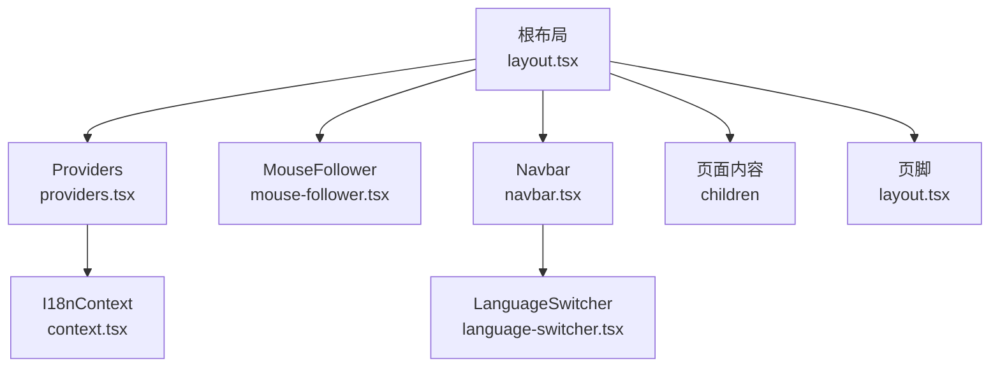
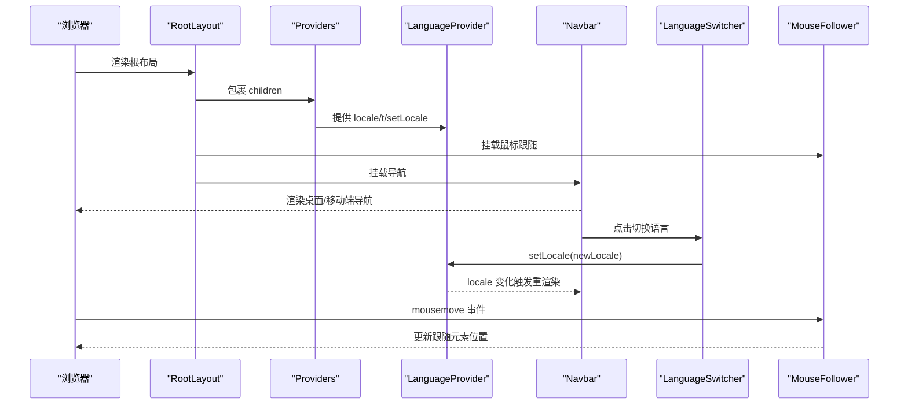
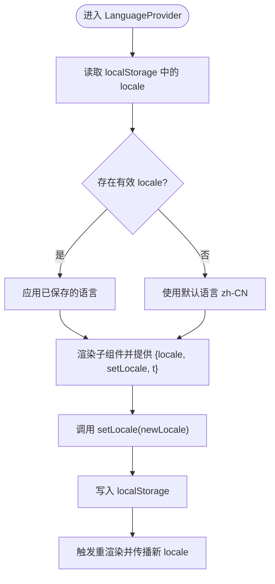
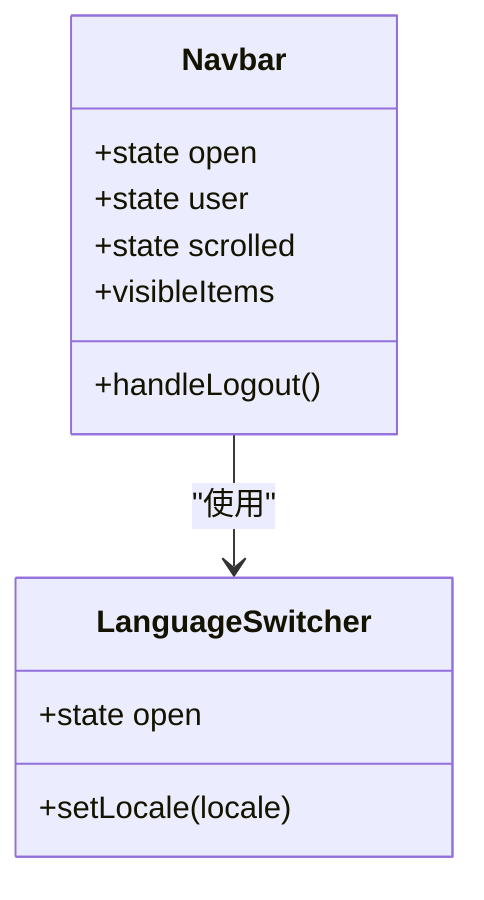
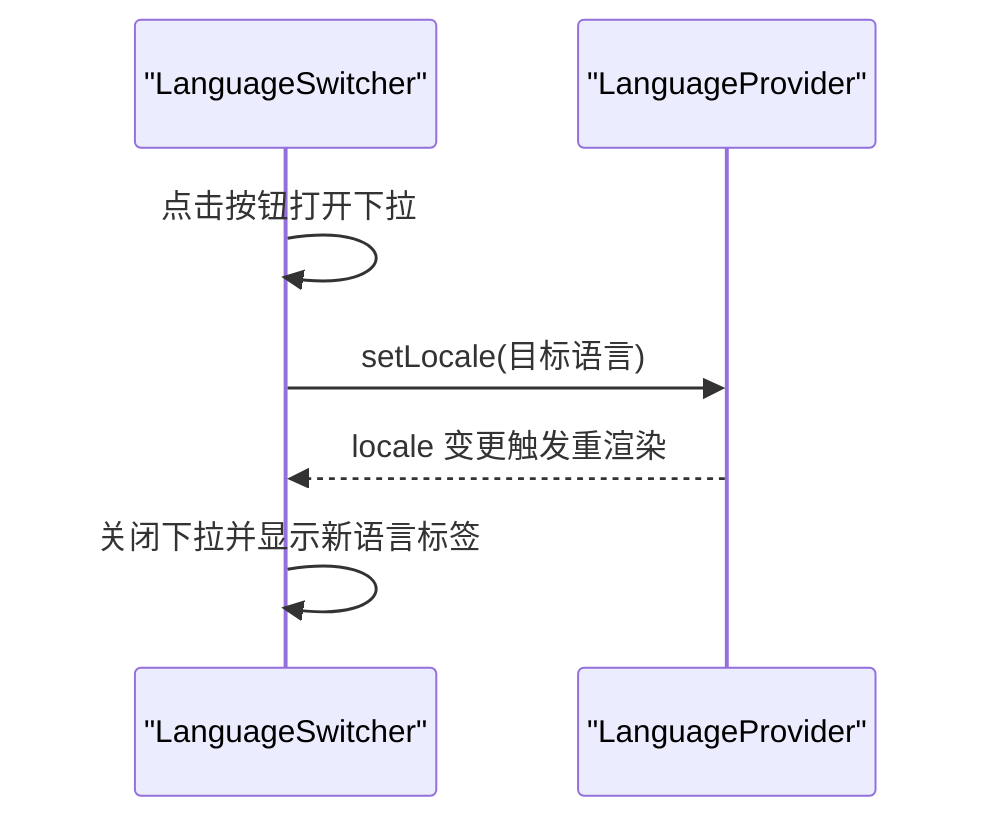
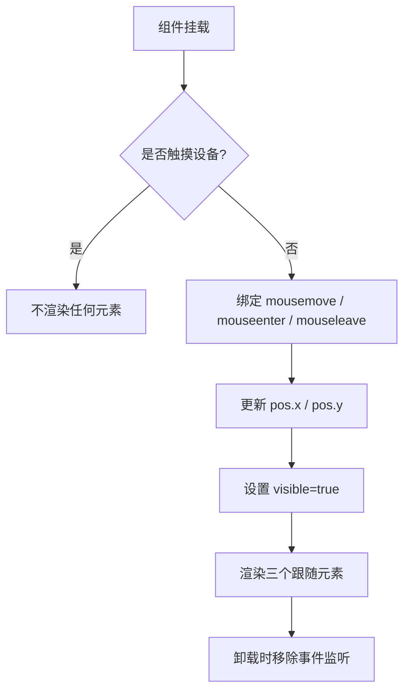
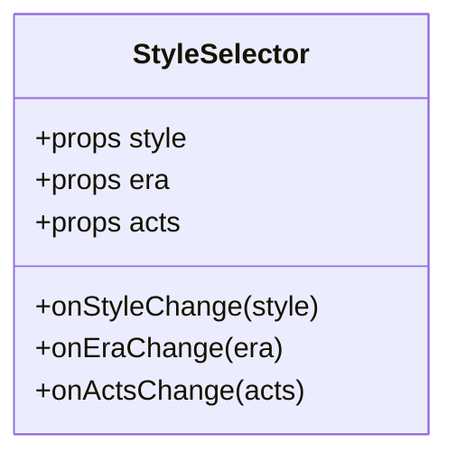
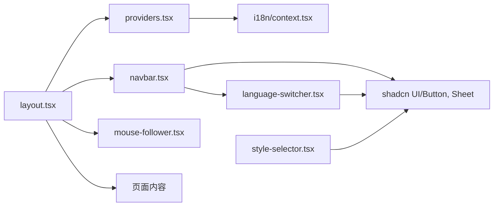

# 布局组件

<cite>
**本文引用的文件**   
- [frontend/src/app/layout.tsx](file://frontend/src/app/layout.tsx)
- [frontend/src/components/navbar.tsx](file://frontend/src/components/navbar.tsx)
- [frontend/src/components/providers.tsx](file://frontend/src/components/providers.tsx)
- [frontend/src/components/language-switcher.tsx](file://frontend/src/components/language-switcher.tsx)
- [frontend/src/components/mouse-follower.tsx](file://frontend/src/components/mouse-follower.tsx)
- [frontend/src/components/style-selector.tsx](file://frontend/src/components/style-selector.tsx)
- [frontend/src/lib/i18n/context.tsx](file://frontend/src/lib/i18n/context.tsx)
- [frontend/src/app/globals.css](file://frontend/src/app/globals.css)
- [frontend/package.json](file://frontend/package.json)
</cite>

## 目录
1. [简介](#简介)
2. [项目结构](#项目结构)
3. [核心组件](#核心组件)
4. [架构总览](#架构总览)
5. [详细组件分析](#详细组件分析)
6. [依赖关系分析](#依赖关系分析)
7. [性能考量](#性能考量)
8. [故障排查指南](#故障排查指南)
9. [结论](#结论)
10. [附录](#附录)

## 简介
本文件面向澳秘 Macau Mystery 的前端布局与体验增强组件，系统性解析以下能力：
- 导航栏 Navbar：响应式、权限过滤、登录态展示、移动端抽屉菜单。
- 应用提供者 Providers：统一注入国际化上下文。
- 语言切换器 LanguageSwitcher：基于本地存储的持久化语言选择。
- 全局状态管理：通过 React Context 实现轻量级跨组件共享（当前为语言）。
- 国际化支持：键值翻译与回退策略。
- 主题切换：CSS 变量 + dark 类驱动的明暗主题。
- 鼠标跟随器 MouseFollower：客户端渲染的装饰性光标效果。
- 风格选择器 StyleSelector：用于创作页的风格/时代/幕数选择。
- 响应式与移动端优化：Tailwind 断点、Sheet 抽屉、滚动吸附等。
- 性能调优：事件监听去抖/节流建议、动画与合成层优化、按需渲染。

## 项目结构
布局由根布局文件组合各子组件构成，整体采用 Next.js App Router 的 layout 模式，将 Providers、MouseFollower、Navbar 作为全局包裹，确保所有页面共享一致的导航、主题与国际化能力。

**图表来源** 
- [frontend/src/app/layout.tsx:37-61](file://frontend/src/app/layout.tsx#L37-L61)
- [frontend/src/components/providers.tsx:5-7](file://frontend/src/components/providers.tsx#L5-L7)
- [frontend/src/lib/i18n/context.tsx:18-48](file://frontend/src/lib/i18n/context.tsx#L18-L48)
- [frontend/src/components/mouse-follower.tsx:11-36](file://frontend/src/components/mouse-follower.tsx#L11-L36)
- [frontend/src/components/navbar.tsx:26-56](file://frontend/src/components/navbar.tsx#L26-L56)
- [frontend/src/components/language-switcher.tsx:8-24](file://frontend/src/components/language-switcher.tsx#L8-L24)

**章节来源**
- [frontend/src/app/layout.tsx:1-62](file://frontend/src/app/layout.tsx#L1-L62)
- [frontend/src/components/providers.tsx:1-8](file://frontend/src/components/providers.tsx#L1-L8)

## 核心组件
- 根布局 RootLayout：定义元数据、视口、字体变量、主题 CSS 变量注入，并挂载 Providers、MouseFollower、Navbar 与主内容区。
- Providers：仅包裹 LanguageProvider，集中提供国际化能力。
- Navbar：桌面/移动端双形态导航，包含品牌标识、路由按钮、语言切换、用户信息与登出逻辑。
- LanguageSwitcher：下拉式语言选择，持久化到 localStorage。
- MouseFollower：仅在客户端生效的鼠标跟随装饰元素。
- StyleSelector：创作流程中的风格/时代/幕数选择面板。

**章节来源**
- [frontend/src/app/layout.tsx:18-35](file://frontend/src/app/layout.tsx#L18-L35)
- [frontend/src/components/providers.tsx:5-7](file://frontend/src/components/providers.tsx#L5-L7)
- [frontend/src/components/navbar.tsx:16-24](file://frontend/src/components/navbar.tsx#L16-L24)
- [frontend/src/components/language-switcher.tsx:24-56](file://frontend/src/components/language-switcher.tsx#L24-L56)
- [frontend/src/components/mouse-follower.tsx:11-36](file://frontend/src/components/mouse-follower.tsx#L11-L36)
- [frontend/src/components/style-selector.tsx:41-48](file://frontend/src/components/style-selector.tsx#L41-L48)

## 架构总览
下图展示了布局层级与关键交互：根布局注入 Provider 与全局装饰；Navbar 消费国际化与路由；LanguageSwitcher 更新语言并持久化；MouseFollower 监听鼠标移动；StyleSelector 通过回调向父组件暴露配置。

**图表来源** 
- [frontend/src/app/layout.tsx:42-57](file://frontend/src/app/layout.tsx#L42-L57)
- [frontend/src/components/providers.tsx:5-7](file://frontend/src/components/providers.tsx#L5-L7)
- [frontend/src/lib/i18n/context.tsx:18-48](file://frontend/src/lib/i18n/context.tsx#L18-L48)
- [frontend/src/components/navbar.tsx:26-56](file://frontend/src/components/navbar.tsx#L26-L56)
- [frontend/src/components/language-switcher.tsx:24-56](file://frontend/src/components/language-switcher.tsx#L24-L56)
- [frontend/src/components/mouse-follower.tsx:15-33](file://frontend/src/components/mouse-follower.tsx#L15-L33)

## 详细组件分析

### 根布局 RootLayout
- 职责：设置文档元信息、视口、字体变量、主题 CSS 变量，挂载全局组件。
- 关键点：
  - 使用 Google Fonts 注入字体变量，便于 Tailwind 主题引用。
  - viewport 限制缩放，利于移动端体验。
  - 通过 Providers 包裹所有子组件，确保国际化可用。
  - 在 body 上应用背景与前景色变量，配合 dark 类实现主题切换。

**章节来源**
- [frontend/src/app/layout.tsx:1-16](file://frontend/src/app/layout.tsx#L1-L16)
- [frontend/src/app/layout.tsx:18-35](file://frontend/src/app/layout.tsx#L18-L35)
- [frontend/src/app/layout.tsx:42-57](file://frontend/src/app/layout.tsx#L42-L57)

### 应用提供者 Providers
- 职责：集中注入 LanguageProvider，简化上层组件对国际化的接入。
- 设计要点：
  - 单一职责，避免在多个页面重复包裹 Provider。
  - 未来可扩展（如主题、错误边界、查询客户端等）。

**章节来源**
- [frontend/src/components/providers.tsx:5-7](file://frontend/src/components/providers.tsx#L5-L7)

### 国际化上下文 LanguageProvider
- 职责：维护当前 locale、提供 t(key) 翻译函数、持久化语言到 localStorage。
- 行为：
  - 初始化时从 localStorage 恢复语言。
  - setLocale 同时更新状态与持久化。
  - t 优先返回当前语言文本，回退到英文，再回退到 key 本身。

**图表来源** 
- [frontend/src/lib/i18n/context.tsx:18-48](file://frontend/src/lib/i18n/context.tsx#L18-L48)
- [frontend/src/lib/i18n/context.tsx:36-41](file://frontend/src/lib/i18n/context.tsx#L36-L41)

**章节来源**
- [frontend/src/lib/i18n/context.tsx:1-56](file://frontend/src/lib/i18n/context.tsx#L1-L56)

### 导航栏 Navbar
- 职责：展示品牌、导航项、语言切换、用户信息与登出。
- 功能特性：
  - 根据用户角色过滤“管理员”入口。
  - 滚动监听实现吸顶玻璃态样式。
  - 桌面端水平导航，移动端右侧抽屉 Sheet。
  - 集成 LanguageSwitcher，保持多端一致。
  - 登出清理 token 与用户信息并重定向首页。

**图表来源** 
- [frontend/src/components/navbar.tsx:26-56](file://frontend/src/components/navbar.tsx#L26-L56)
- [frontend/src/components/language-switcher.tsx:8-24](file://frontend/src/components/language-switcher.tsx#L8-L24)

**章节来源**
- [frontend/src/components/navbar.tsx:16-24](file://frontend/src/components/navbar.tsx#L16-L24)
- [frontend/src/components/navbar.tsx:34-50](file://frontend/src/components/navbar.tsx#L34-L50)
- [frontend/src/components/navbar.tsx:52-54](file://frontend/src/components/navbar.tsx#L52-L54)
- [frontend/src/components/navbar.tsx:57-63](file://frontend/src/components/navbar.tsx#L57-L63)
- [frontend/src/components/navbar.tsx:129-181](file://frontend/src/components/navbar.tsx#L129-L181)

### 语言切换器 LanguageSwitcher
- 职责：以弹出式列表切换语言，点击外部关闭。
- 行为：
  - 使用 ref 监听 document mousedown 关闭下拉。
  - 调用 setLocale 更新语言并持久化。
  - 高亮当前语言项。

**图表来源** 
- [frontend/src/components/language-switcher.tsx:14-22](file://frontend/src/components/language-switcher.tsx#L14-L22)
- [frontend/src/components/language-switcher.tsx:46-52](file://frontend/src/components/language-switcher.tsx#L46-L52)
- [frontend/src/lib/i18n/context.tsx:21-24](file://frontend/src/lib/i18n/context.tsx#L21-L24)

**章节来源**
- [frontend/src/components/language-switcher.tsx:8-24](file://frontend/src/components/language-switcher.tsx#L8-L24)
- [frontend/src/components/language-switcher.tsx:24-56](file://frontend/src/components/language-switcher.tsx#L24-L56)

### 鼠标跟随器 MouseFollower
- 职责：在桌面端提供柔和光晕与两块“瓷砖”装饰跟随鼠标。
- 行为：
  - 监听 window mousemove 与 document enter/leave。
  - 检测触摸设备直接不渲染。
  - 使用固定定位与 will-change 提升动画性能。

**图表来源** 
- [frontend/src/components/mouse-follower.tsx:15-33](file://frontend/src/components/mouse-follower.tsx#L15-L33)
- [frontend/src/components/mouse-follower.tsx:35-36](file://frontend/src/components/mouse-follower.tsx#L35-L36)
- [frontend/src/components/mouse-follower.tsx:38-67](file://frontend/src/components/mouse-follower.tsx#L38-L67)

**章节来源**
- [frontend/src/components/mouse-follower.tsx:11-36](file://frontend/src/components/mouse-follower.tsx#L11-L36)
- [frontend/src/components/mouse-follower.tsx:38-67](file://frontend/src/components/mouse-follower.tsx#L38-L67)

### 风格选择器 StyleSelector
- 职责：提供风格、时代、幕数的选择界面，供创作流程使用。
- 行为：
  - 通过 props 接收当前选择值与回调函数。
  - 使用卡片+按钮网格组织选项，选中态高亮。
  - 无内部状态，纯受控组件。

**图表来源** 
- [frontend/src/components/style-selector.tsx:12-19](file://frontend/src/components/style-selector.tsx#L12-L19)
- [frontend/src/components/style-selector.tsx:41-48](file://frontend/src/components/style-selector.tsx#L41-L48)

**章节来源**
- [frontend/src/components/style-selector.tsx:21-39](file://frontend/src/components/style-selector.tsx#L21-L39)
- [frontend/src/components/style-selector.tsx:41-121](file://frontend/src/components/style-selector.tsx#L41-L121)

### 主题与样式系统
- 主题变量：通过 CSS 自定义属性定义明/暗两套配色，html 或 body 上切换 dark 类即可切换主题。
- 动画与特效：定义了浮动、闪烁、渐变、玻璃态等常用动画工具类。
- 鼠标跟随样式：cursor-glow、cursor-tile、cursor-tile-sm 使用 fixed 定位与缓动曲线，will-change 优化合成层。

**章节来源**
- [frontend/src/app/globals.css:59-136](file://frontend/src/app/globals.css#L59-L136)
- [frontend/src/app/globals.css:138-212](file://frontend/src/app/globals.css#L138-L212)
- [frontend/src/app/globals.css:227-278](file://frontend/src/app/globals.css#L227-L278)
- [frontend/src/app/globals.css:280-301](file://frontend/src/app/globals.css#L280-L301)

## 依赖关系分析
- 组件耦合：
  - Navbar 依赖 i18n context 与 shadcn UI（Button、Sheet）。
  - LanguageSwitcher 依赖 i18n context。
  - Providers 仅依赖 i18n context。
  - MouseFollower 无业务依赖，仅依赖 DOM 事件与 CSS。
  - StyleSelector 依赖 shadcn UI（Card、Button）。
- 外部依赖：Next.js、React、Tailwind、shadcn、lucide-react 图标库。

**图表来源** 
- [frontend/src/app/layout.tsx:42-57](file://frontend/src/app/layout.tsx#L42-L57)
- [frontend/src/components/providers.tsx:5-7](file://frontend/src/components/providers.tsx#L5-L7)
- [frontend/src/lib/i18n/context.tsx:18-48](file://frontend/src/lib/i18n/context.tsx#L18-L48)
- [frontend/src/components/navbar.tsx:1-15](file://frontend/src/components/navbar.tsx#L1-L15)
- [frontend/src/components/language-switcher.tsx:1-6](file://frontend/src/components/language-switcher.tsx#L1-L6)
- [frontend/src/components/style-selector.tsx:1-10](file://frontend/src/components/style-selector.tsx#L1-L10)
- [frontend/package.json:11-25](file://frontend/package.json#L11-L25)

**章节来源**
- [frontend/package.json:11-25](file://frontend/package.json#L11-L25)

## 性能考量
- 事件监听优化：
  - 为 scroll 事件添加 passive:true，减少阻塞。
  - 鼠标移动事件可考虑 requestAnimationFrame 节流，降低高频重排。
- 渲染优化：
  - MouseFollower 在触摸设备直接不渲染，避免无效开销。
  - LanguageProvider 使用 useCallback 缓存 t 与 setLocale，减少不必要的重渲染。
- 动画与合成层：
  - 使用 will-change 与 transform 驱动动画，利用 GPU 加速。
  - 控制透明度与尺寸变化幅度，避免大区域重绘。
- 资源加载：
  - 字体与图标按需引入，避免未用代码。
  - 图片与媒体资源懒加载（适用于后续扩展）。

[本节为通用指导，不直接分析具体文件]

## 故障排查指南
- 语言切换无效：
  - 检查 localStorage 中是否存在 locale 键且值为合法语言。
  - 确认 LanguageProvider 的 setLocale 被调用且 state 更新。
  - 验证 t(key) 的回退逻辑是否命中预期。
- 导航项不显示：
  - 检查用户角色是否为 admin，adminOnly 项需具备相应权限。
  - 确认路由路径与 navItems 配置一致。
- 鼠标跟随不出现：
  - 确认运行环境非触摸设备。
  - 检查全局样式是否被覆盖或 z-index 冲突。
- 主题切换异常：
  - 检查 html/body 是否包含 dark 类。
  - 确认 CSS 变量在 dark 块中正确覆盖。

**章节来源**
- [frontend/src/lib/i18n/context.tsx:21-34](file://frontend/src/lib/i18n/context.tsx#L21-L34)
- [frontend/src/components/navbar.tsx:52-54](file://frontend/src/components/navbar.tsx#L52-L54)
- [frontend/src/components/mouse-follower.tsx:35-36](file://frontend/src/components/mouse-follower.tsx#L35-L36)
- [frontend/src/app/globals.css:99-136](file://frontend/src/app/globals.css#L99-L136)

## 结论
本布局体系以 Next.js 根布局为核心，结合 Providers 与 i18n 上下文，实现了统一的国际化与主题能力。Navbar 提供跨端一致的导航体验，LanguageSwitcher 保证语言选择的便捷性与持久化，MouseFollower 与 StyleSelector 分别增强了视觉表现与创作流程。通过 CSS 变量与 Tailwind 的组合，主题与动画具备良好的可维护性与性能表现。建议在后续迭代中继续完善权限模型、扩展更多语言包，并对高频事件进行更细粒度的性能优化。

[本节为总结性内容，不直接分析具体文件]

## 附录
- 最佳实践
  - 将全局能力集中在 Providers，避免在各页面重复包裹。
  - 使用受控组件（如 StyleSelector）传递状态与回调，保持数据流清晰。
  - 对频繁触发的 DOM 事件进行节流/防抖，必要时使用 requestAnimationFrame。
  - 使用 CSS 变量统一管理主题，dark 类切换优于 JS 动态样式。
- 自定义配置选项
  - Navbar：可在 navItems 中扩展链接、权限标记与文案键。
  - LanguageSwitcher：可通过 LOCALE_LABELS 扩展语言显示名。
  - StyleSelector：可按需扩展 STYLES/ERAS/ACTIONS 配置。
  - 主题：在 globals.css 的 :root 与 .dark 块中调整颜色与半径等变量。

[本节为通用指导，不直接分析具体文件]