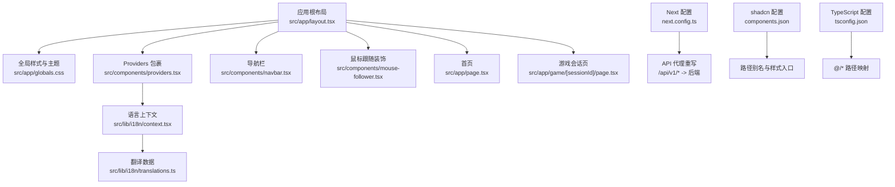
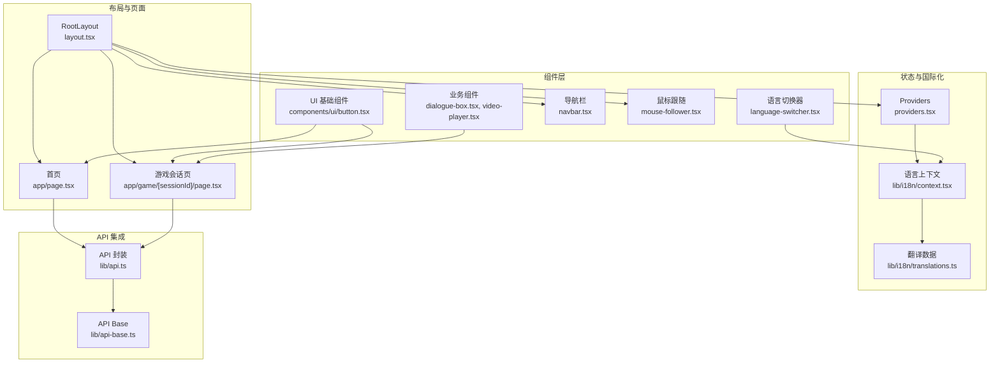
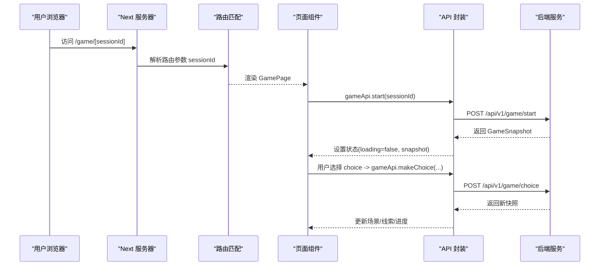
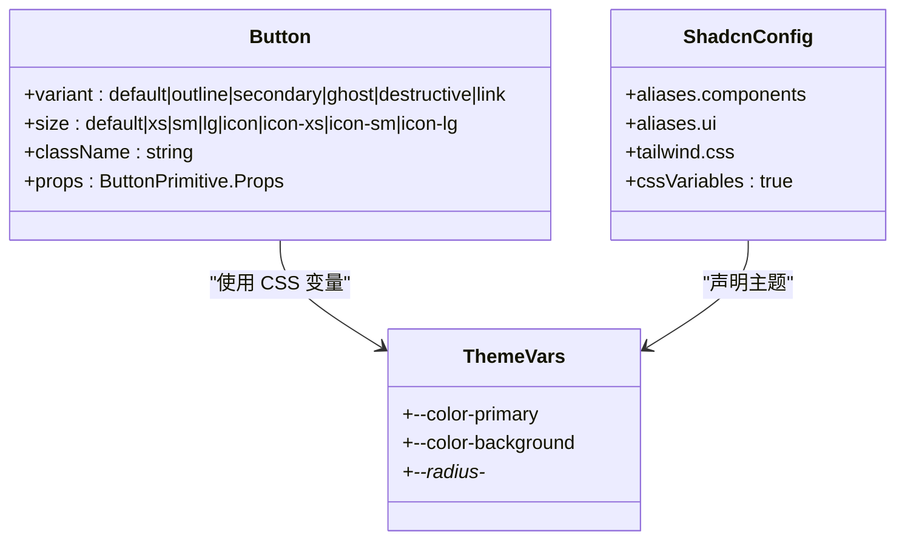
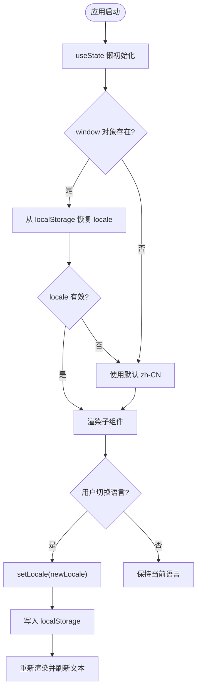
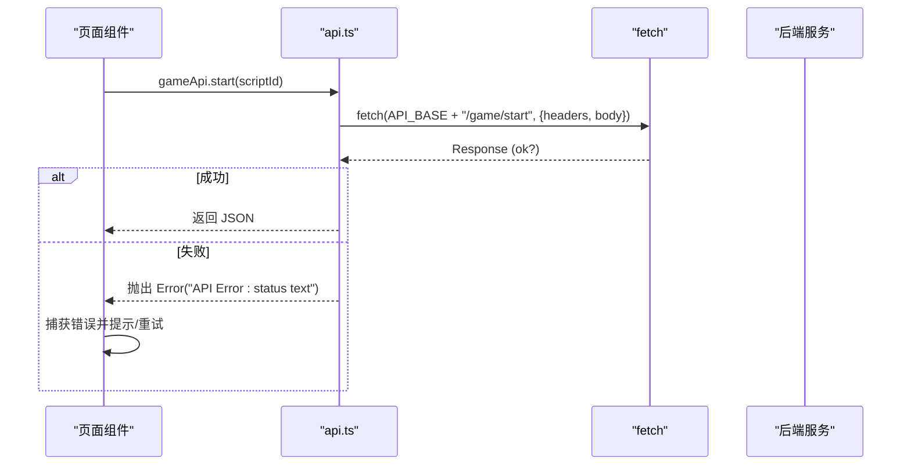
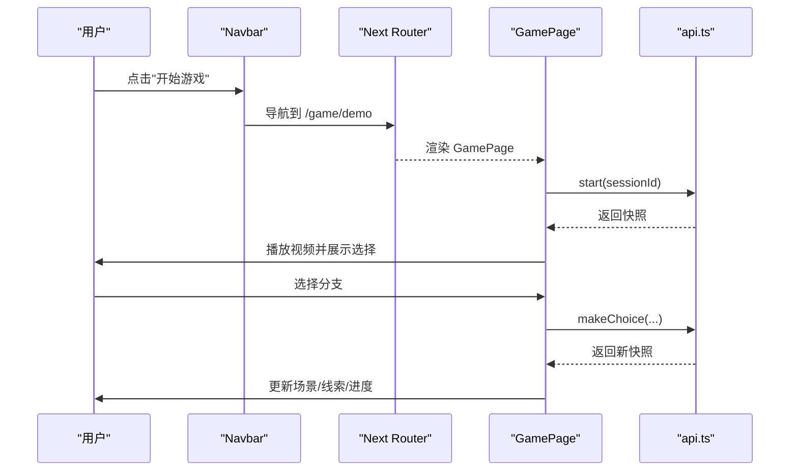
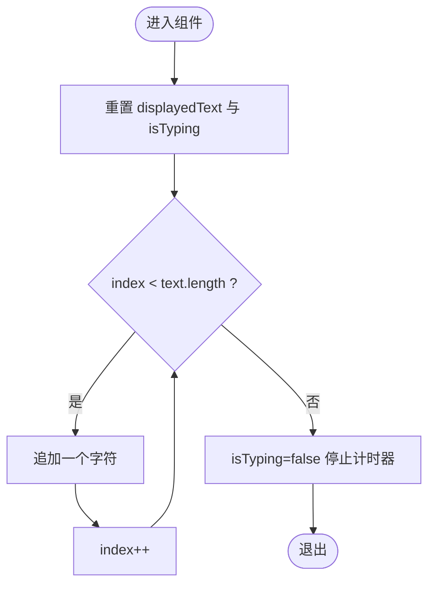
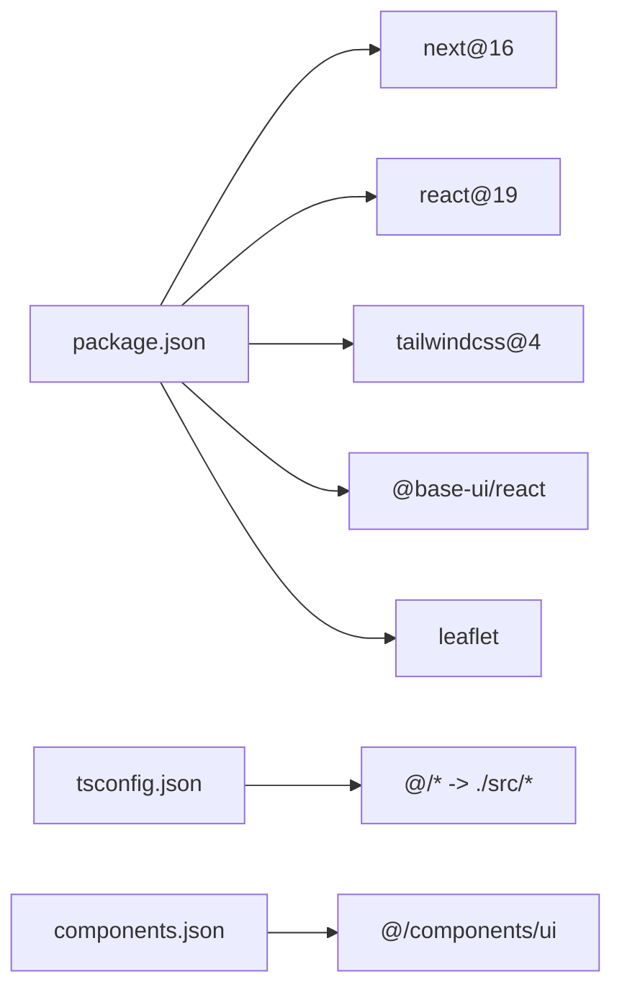

# 前端架构

<cite>
**本文引用的文件**   
- [package.json](file://frontend/package.json)
- [next.config.ts](file://frontend/next.config.ts)
- [components.json](file://frontend/components.json)
- [tsconfig.json](file://frontend/tsconfig.json)
- [globals.css](file://frontend/src/app/globals.css)
- [layout.tsx](file://frontend/src/app/layout.tsx)
- [page.tsx](file://frontend/src/app/page.tsx)
- [providers.tsx](file://frontend/src/components/providers.tsx)
- [navbar.tsx](file://frontend/src/components/navbar.tsx)
- [mouse-follower.tsx](file://frontend/src/components/mouse-follower.tsx)
- [api-base.ts](file://frontend/src/lib/api-base.ts)
- [api.ts](file://frontend/src/lib/api.ts)
- [context.tsx](file://frontend/src/lib/i18n/context.tsx)
- [translations.ts](file://frontend/src/lib/i18n/translations.ts)
- [language-switcher.tsx](file://frontend/src/components/language-switcher.tsx)
- [button.tsx](file://frontend/src/components/ui/button.tsx)
- [game/[sessionId]/page.tsx](file://frontend/src/app/game/[sessionId]/page.tsx)
</cite>

## 更新摘要
**变更内容**   
- 国际化系统增强：使用 useState 懒初始化替代 useEffect 方法，消除时序问题
- 翻译内容更新：支持三种语言（英语、简体中文、繁体中文），新增导航项和游戏相关内容
- 语言检测机制优化：改进 locale 检测逻辑，提升初始化性能

## 目录
1. [简介](#简介)
2. [项目结构](#项目结构)
3. [核心组件](#核心组件)
4. [架构总览](#架构总览)
5. [详细组件分析](#详细组件分析)
6. [依赖关系分析](#依赖关系分析)
7. [性能考量](#性能考量)
8. [故障排查指南](#故障排查指南)
9. [结论](#结论)
10. [附录](#附录)

## 简介
本文件为澳秘 Macau Mystery 前端架构的技术文档，聚焦 Next.js 16 + React 19 的应用架构设计。内容涵盖 App Router 路由系统、组件层次结构与状态管理策略；基于 shadcn/ui 的 UI 组件库设计（基础组件、业务组件与布局组件）；API 集成层封装、错误处理机制与响应式适配方案；页面路由设计与导航逻辑、用户交互流程；以及组件开发规范、样式管理策略与性能优化最佳实践。

**最新更新**：国际化系统经过重大优化，采用 useState 懒初始化机制替代原有的 useEffect 方法，显著提升了语言切换的性能和用户体验。

## 项目结构
前端采用 Next.js App Router 组织页面与布局，全局样式与主题通过 Tailwind CSS 与 CSS 变量统一管理，UI 组件基于 shadcn/ui 生成并扩展，国际化通过 Context 提供。

**图表来源** 
- [layout.tsx:1-62](file://frontend/src/app/layout.tsx#L1-L62)
- [globals.css:1-331](file://frontend/src/app/globals.css#L1-L331)
- [providers.tsx:1-8](file://frontend/src/components/providers.tsx#L1-L8)
- [context.tsx:1-52](file://frontend/src/lib/i18n/context.tsx#L1-L52)
- [translations.ts:1-496](file://frontend/src/lib/i18n/translations.ts#L1-L496)
- [navbar.tsx:1-186](file://frontend/src/components/navbar.tsx#L1-L186)
- [mouse-follower.tsx:1-70](file://frontend/src/components/mouse-follower.tsx#L1-L70)
- [page.tsx:1-453](file://frontend/src/app/page.tsx#L1-L453)
- [game/[sessionId]/page.tsx:1-194](file://frontend/src/app/game/[sessionId]/page.tsx#L1-L194)
- [next.config.ts:1-15](file://frontend/next.config.ts#L1-L15)
- [components.json:1-26](file://frontend/components.json#L1-L26)
- [tsconfig.json:1-35](file://frontend/tsconfig.json#L1-L35)

**章节来源**
- [layout.tsx:1-62](file://frontend/src/app/layout.tsx#L1-L62)
- [next.config.ts:1-15](file://frontend/next.config.ts#L1-L15)
- [components.json:1-26](file://frontend/components.json#L1-L26)
- [tsconfig.json:1-35](file://frontend/tsconfig.json#L1-L35)

## 核心组件
- 根布局与元信息：定义站点标题、描述、图标与视口，注入字体变量，挂载 Providers、MouseFollower、Navbar 与主内容区。
- 全局样式与主题：Tailwind v4 + shadcn 样式导入，CSS 变量定义澳门文化配色（azulejo/jade/lacquer/brass/limestone），暗色模式切换，动画关键帧与工具类。
- **增强的国际化上下文**：LanguageProvider 使用 useState 懒初始化维护 locale 与 t(key)，持久化到 localStorage，默认回退英文，消除了 useEffect 时序问题。
- 导航栏：响应式导航，移动端抽屉菜单，按角色过滤管理端入口，登录/登出与用户信息显示。
- 鼠标跟随：纯客户端装饰效果，三元素跟随光标，触屏设备自动禁用。
- 首页：Hero 区域含 SVG 地标剪影与视差背景，功能卡片与路线时间线，调用 adminApi.getRoute 获取路线数据。
- 游戏会话页：加载场景快照、播放视频、展示选择项、推进剧情至结局或下一场景。

**章节来源**
- [layout.tsx:1-62](file://frontend/src/app/layout.tsx#L1-L62)
- [globals.css:1-331](file://frontend/src/app/globals.css#L1-L331)
- [context.tsx:1-52](file://frontend/src/lib/i18n/context.tsx#L1-L52)
- [navbar.tsx:1-186](file://frontend/src/components/navbar.tsx#L1-L186)
- [mouse-follower.tsx:1-70](file://frontend/src/components/mouse-follower.tsx#L1-L70)
- [page.tsx:1-453](file://frontend/src/app/page.tsx#L1-L453)
- [game/[sessionId]/page.tsx:1-194](file://frontend/src/app/game/[sessionId]/page.tsx#L1-L194)

## 架构总览
整体采用"布局 + 页面 + 组件 + 服务层"的分层结构：
- 布局层：RootLayout 统一注入 Providers、全局样式、导航与页脚。
- 页面层：App Router 路由映射，如 /、/game/[sessionId]、/create、/admin 等。
- 组件层：ui 基础组件（Button 等）、业务组件（DialogueBox、VideoPlayer 等）、布局组件（Navbar）。
- 服务层：api.ts 封装所有 API 调用，统一请求头、鉴权与错误抛出。

**图表来源** 
- [layout.tsx:1-62](file://frontend/src/app/layout.tsx#L1-L62)
- [page.tsx:1-453](file://frontend/src/app/page.tsx#L1-L453)
- [game/[sessionId]/page.tsx:1-194](file://frontend/src/app/game/[sessionId]/page.tsx#L1-L194)
- [button.tsx:1-59](file://frontend/src/components/ui/button.tsx#L1-L59)
- [dialogue-box.tsx:1-63](file://frontend/src/components/dialogue-box.tsx#L1-L63)
- [navbar.tsx:1-186](file://frontend/src/components/navbar.tsx#L1-L186)
- [mouse-follower.tsx:1-70](file://frontend/src/components/mouse-follower.tsx#L1-L70)
- [language-switcher.tsx:1-59](file://frontend/src/components/language-switcher.tsx#L1-L59)
- [providers.tsx:1-8](file://frontend/src/components/providers.tsx#L1-L8)
- [context.tsx:1-52](file://frontend/src/lib/i18n/context.tsx#L1-L52)
- [translations.ts:1-496](file://frontend/src/lib/i18n/translations.ts#L1-L496)
- [api.ts:1-216](file://frontend/src/lib/api.ts#L1-L216)
- [api-base.ts:1-2](file://frontend/src/lib/api-base.ts#L1-L2)

## 详细组件分析

### App Router 路由系统与布局
- 根布局：设置 lang=zh-CN、字体变量、视口、站点元信息，挂载 Providers、MouseFollower、Navbar 与 main 内容区。
- 页面路由：
  - 首页 /：展示品牌、功能与路线时间线，调用 adminApi.getRoute 获取路线。
  - 游戏会话 /game/[sessionId]：根据 sessionId 启动游戏，加载场景快照，播放视频，展示选择项，推进剧情。
- 重定向与代理：next.config.ts 将 /api/v1/* 重写至后端地址，便于本地开发与跨域规避。

**图表来源** 
- [next.config.ts:1-15](file://frontend/next.config.ts#L1-L15)
- [game/[sessionId]/page.tsx:1-194](file://frontend/src/app/game/[sessionId]/page.tsx#L1-L194)
- [api.ts:1-216](file://frontend/src/lib/api.ts#L1-L216)

**章节来源**
- [layout.tsx:1-62](file://frontend/src/app/layout.tsx#L1-L62)
- [page.tsx:1-453](file://frontend/src/app/page.tsx#L1-L453)
- [game/[sessionId]/page.tsx:1-194](file://frontend/src/app/game/[sessionId]/page.tsx#L1-L194)
- [next.config.ts:1-15](file://frontend/next.config.ts#L1-L15)

### UI 组件库（基于 shadcn/ui）
- 基础组件：Button 使用 @base-ui/react 与 class-variance-authority 组合，支持 variant/size 变体与焦点/无障碍属性。
- 样式系统：Tailwind v4 + shadcn tailwind.css 导入，CSS 变量定义主题色与半径，暗色模式覆盖。
- 路径别名：components.json 配置 aliases，@/components/ui 指向 ui 组件目录，utils 指向 lib/utils。

**图表来源** 
- [button.tsx:1-59](file://frontend/src/components/ui/button.tsx#L1-L59)
- [globals.css:1-331](file://frontend/src/app/globals.css#L1-L331)
- [components.json:1-26](file://frontend/components.json#L1-L26)

**章节来源**
- [button.tsx:1-59](file://frontend/src/components/ui/button.tsx#L1-L59)
- [globals.css:1-331](file://frontend/src/app/globals.css#L1-L331)
- [components.json:1-26](file://frontend/components.json#L1-L26)

### 状态管理与国际化
- **增强的 LanguageProvider**：使用 useState 懒初始化替代 useEffect，在组件首次渲染时从 localStorage 恢复 locale，避免时序问题。
- **优化的语言检测**：在 useState 初始化函数中检查 window 对象是否存在，确保服务端渲染安全。
- **完整的翻译支持**：translations.ts 包含英语、简体中文、繁体中文三种语言的完整翻译内容。
- Providers：在 RootLayout 中包裹 LanguageProvider，确保全应用可用。
- LanguageSwitcher：下拉切换 en/zh-CN/zh-TW，点击外部关闭。

**图表来源** 
- [context.tsx:1-52](file://frontend/src/lib/i18n/context.tsx#L1-L52)
- [translations.ts:1-496](file://frontend/src/lib/i18n/translations.ts#L1-L496)
- [providers.tsx:1-8](file://frontend/src/components/providers.tsx#L1-L8)
- [language-switcher.tsx:1-59](file://frontend/src/components/language-switcher.tsx#L1-L59)

**章节来源**
- [context.tsx:1-52](file://frontend/src/lib/i18n/context.tsx#L1-L52)
- [translations.ts:1-496](file://frontend/src/lib/i18n/translations.ts#L1-L496)
- [providers.tsx:1-8](file://frontend/src/components/providers.tsx#L1-L8)
- [language-switcher.tsx:1-59](file://frontend/src/components/language-switcher.tsx#L1-L59)

### API 集成层与错误处理
- 统一请求：request<T>(path, options) 组装 headers（Content-Type、Authorization），拼接 API_BASE，抛错统一 Error。
- 模块划分：gameApi、aiApi、ugcApi、adminApi、authApi 分别封装对应接口。
- 环境变量：API_BASE 优先读取 NEXT_PUBLIC_API_URL，否则默认 localhost:8000/api/v1。
- 错误处理：非 ok 响应直接抛错，页面组件捕获后显示重试按钮或提示。

**图表来源** 
- [api.ts:1-216](file://frontend/src/lib/api.ts#L1-L216)
- [api-base.ts:1-2](file://frontend/src/lib/api-base.ts#L1-L2)

**章节来源**
- [api.ts:1-216](file://frontend/src/lib/api.ts#L1-L216)
- [api-base.ts:1-2](file://frontend/src/lib/api-base.ts#L1-L2)

### 导航与用户交互流程
- Navbar：桌面端水平导航，移动端 Sheet 抽屉；根据用户角色过滤管理端入口；滚动时玻璃态背景；登出清理 token 与 user。
- 首页：CTA 按钮跳转游戏与创作页；路线时间线动态加载；访客引导登录。
- 游戏会话页：加载快照、播放视频、展示选择项、推进剧情至结局或下一场景。

**图表来源** 
- [navbar.tsx:1-186](file://frontend/src/components/navbar.tsx#L1-L186)
- [page.tsx:1-453](file://frontend/src/app/page.tsx#L1-L453)
- [game/[sessionId]/page.tsx:1-194](file://frontend/src/app/game/[sessionId]/page.tsx#L1-L194)
- [api.ts:1-216](file://frontend/src/lib/api.ts#L1-L216)

**章节来源**
- [navbar.tsx:1-186](file://frontend/src/components/navbar.tsx#L1-L186)
- [page.tsx:1-453](file://frontend/src/app/page.tsx#L1-L453)
- [game/[sessionId]/page.tsx:1-194](file://frontend/src/app/game/[sessionId]/page.tsx#L1-L194)

### 复杂逻辑组件：对话打字机效果
- DialogueBox：接收 npc/avatar/text/audioUrl，使用 setInterval 逐字显示，完成后停止计时器并移除闪烁光标。

**图表来源** 
- [dialogue-box.tsx:1-63](file://frontend/src/components/dialogue-box.tsx#L1-L63)

**章节来源**
- [dialogue-box.tsx:1-63](file://frontend/src/components/dialogue-box.tsx#L1-L63)

## 依赖关系分析
- 运行时依赖：Next 16、React 19、Leaflet、Base UI、shadcn、Tailwind v4、Lucide 图标。
- 构建与类型：TypeScript 5、ESLint、PostCSS、Tailwind PostCSS。
- 路径与别名：tsconfig.json 配置 @/* -> ./src/*，components.json 配置 components/ui 别名。

**图表来源** 
- [package.json:1-37](file://frontend/package.json#L1-L37)
- [tsconfig.json:1-35](file://frontend/tsconfig.json#L1-L35)
- [components.json:1-26](file://frontend/components.json#L1-L26)

**章节来源**
- [package.json:1-37](file://frontend/package.json#L1-L37)
- [tsconfig.json:1-35](file://frontend/tsconfig.json#L1-L35)
- [components.json:1-26](file://frontend/components.json#L1-L26)

## 性能考量
- 首屏优化：
  - 使用 Next Font 预加载 Geist 字体，减少 FOIT/FOUT。
  - Hero 区域使用 CSS 动画与 SVG 矢量图形，避免大图资源。
  - 延迟加载路线数据，仅在需要时发起请求。
- 渲染优化：
  - 组件内状态最小化，避免不必要的重渲染。
  - 使用 useMemo/useCallback 缓存回调与计算结果（如 t(key)、handleMouse）。
  - **国际化性能优化**：useState 懒初始化避免了不必要的 useEffect 执行，提升初始渲染速度。
- 网络优化：
  - 统一 request 封装，集中处理鉴权与错误。
  - 合理分页与懒加载（未来可扩展）。
- 样式与动画：
  - 使用 will-change 与 transform 提升合成层性能。
  - 控制动画数量与复杂度，避免阻塞主线程。

## 故障排查指南
- API 错误：
  - 检查 next.config.ts 的 rewrites 是否正确指向后端。
  - 确认 API_BASE 环境变量是否设置正确。
  - 查看控制台抛出的 Error 信息，定位接口与状态码。
- 认证问题：
  - 确认 localStorage 中的 token 是否存在且有效。
  - 检查 Authorization 头是否正确附加。
- **国际化问题**：
  - 检查 translations.ts 中是否包含对应 key，必要时回退英文。
  - 确认 useState 懒初始化逻辑正常工作。
  - 验证 localStorage 中的 locale 值是否有效。
- 导航异常：
  - 检查 usePathname 与 useRouter 的使用是否符合 Next 16 规范。
  - 移动端抽屉菜单打开/关闭逻辑是否正常。

**章节来源**
- [next.config.ts:1-15](file://frontend/next.config.ts#L1-L15)
- [api-base.ts:1-2](file://frontend/src/lib/api-base.ts#L1-L2)
- [api.ts:1-216](file://frontend/src/lib/api.ts#L1-L216)
- [context.tsx:1-52](file://frontend/src/lib/i18n/context.tsx#L1-L52)
- [translations.ts:1-496](file://frontend/src/lib/i18n/translations.ts#L1-L496)
- [navbar.tsx:1-186](file://frontend/src/components/navbar.tsx#L1-L186)

## 结论
本项目以 Next.js App Router 为核心，结合 React 19 与 Tailwind v4，构建了清晰的前端架构。UI 层基于 shadcn/ui 实现一致的设计系统，API 层统一封装保障稳定性与可维护性。**最新的国际化系统优化**采用 useState 懒初始化机制，显著提升了性能和用户体验。国际化与主题系统完善，性能与用户体验兼顾。后续可在分页、缓存与更细粒度的状态管理上持续优化。

## 附录
- 开发脚本：dev/build/start/lint 命令位于 package.json。
- 样式入口：globals.css 引入 Tailwind、shadcn 与自定义主题。
- 路径别名：tsconfig.json 与 components.json 共同定义 @/* 与 @/components/ui。
- **国际化配置**：translations.ts 包含完整的三语言翻译内容，支持英语、简体中文、繁体中文。

**章节来源**
- [package.json:1-37](file://frontend/package.json#L1-L37)
- [globals.css:1-331](file://frontend/src/app/globals.css#L1-L331)
- [tsconfig.json:1-35](file://frontend/tsconfig.json#L1-L35)
- [components.json:1-26](file://frontend/components.json#L1-L26)
- [translations.ts:1-496](file://frontend/src/lib/i18n/translations.ts#L1-L496)