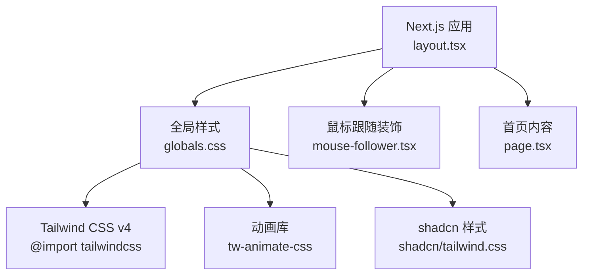
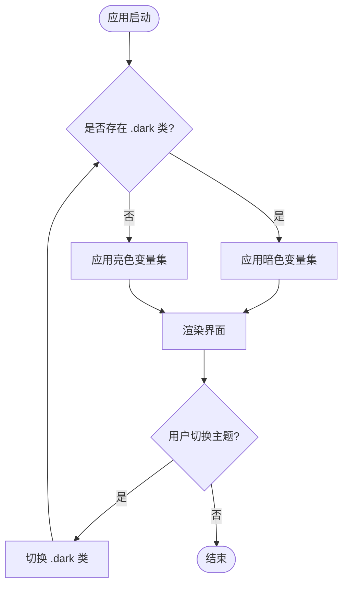
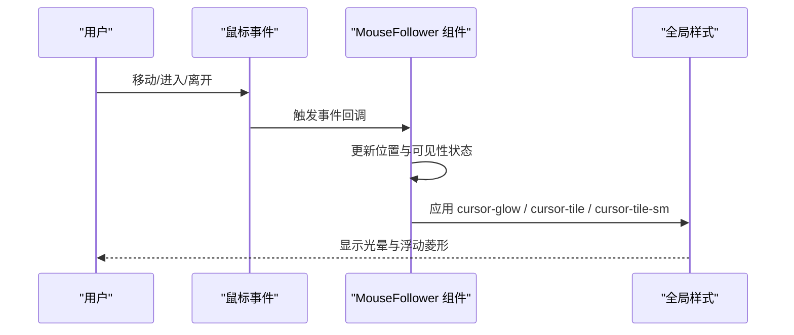
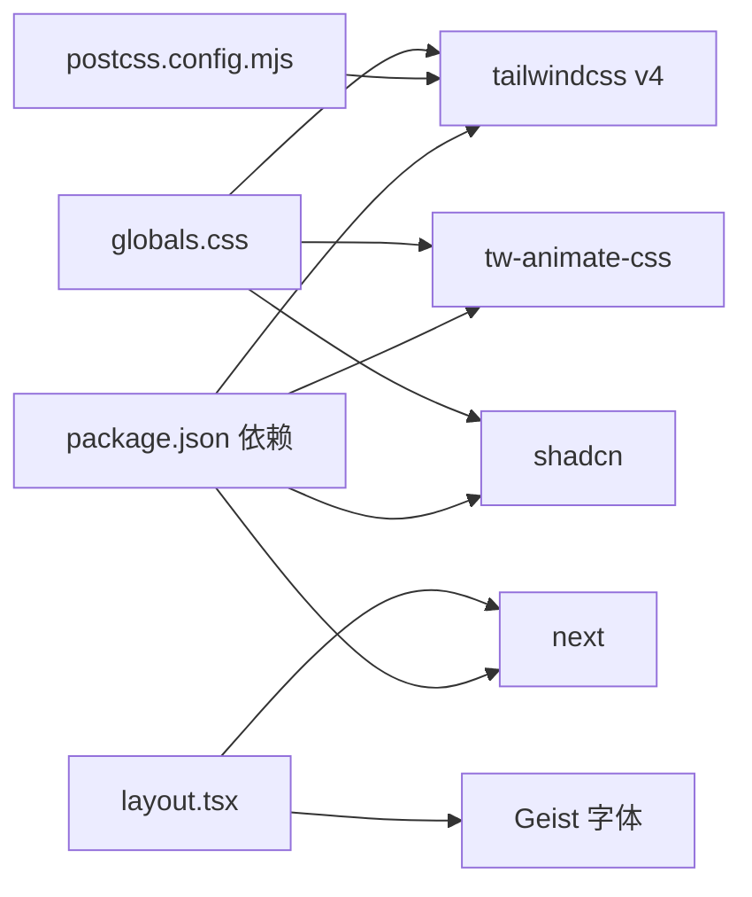

# 样式与主题

<cite>
**本文引用的文件**   
- [globals.css](file://frontend/src/app/globals.css)
- [postcss.config.mjs](file://frontend/postcss.config.mjs)
- [package.json](file://frontend/package.json)
- [components.json](file://frontend/components.json)
- [layout.tsx](file://frontend/src/app/layout.tsx)
- [page.tsx](file://frontend/src/app/page.tsx)
- [mouse-follower.tsx](file://frontend/src/components/mouse-follower.tsx)
</cite>

## 目录
1. [简介](#简介)
2. [项目结构](#项目结构)
3. [核心组件](#核心组件)
4. [架构总览](#架构总览)
5. [详细组件分析](#详细组件分析)
6. [依赖关系分析](#依赖关系分析)
7. [性能考量](#性能考量)
8. [故障排查指南](#故障排查指南)
9. [结论](#结论)
10. [附录](#附录)

## 简介
本文件系统性梳理“澳秘 Macau Mystery”的样式与主题体系，围绕 Tailwind CSS v4 的配置与使用、自定义颜色系统、字体设置、动画效果、澳门文化主题视觉（Azulejo 瓷砖图案、翡翠绿与古铜色配色）、响应式策略、移动端适配与跨浏览器兼容、CSS 模块化与样式隔离、性能优化、主题切换与暗色模式支持、可访问性设计等维度展开。文档以代码级事实为依据，辅以可视化图示，帮助开发者快速理解并扩展主题系统。

## 项目结构
前端采用 Next.js + Tailwind CSS v4 + PostCSS 构建，样式入口为全局 CSS，通过 @import 引入 Tailwind、动画库与 shadcn 样式；主题变量在 :root 与 .dark 中集中定义，并通过 @theme inline 映射到 Tailwind 的设计令牌。布局层通过 layout.tsx 注入字体变量与基础类名，页面层 page.tsx 使用主题色与动画组合呈现澳门历史氛围。



图表来源 
- [layout.tsx:1-62](file://frontend/src/app/layout.tsx#L1-L62)
- [globals.css:1-10](file://frontend/src/app/globals.css#L1-L10)
- [mouse-follower.tsx:1-40](file://frontend/src/components/mouse-follower.tsx#L1-L40)
- [page.tsx:240-280](file://frontend/src/app/page.tsx#L240-L280)

章节来源
- [layout.tsx:1-62](file://frontend/src/app/layout.tsx#L1-L62)
- [globals.css:1-10](file://frontend/src/app/globals.css#L1-L10)
- [postcss.config.mjs:1-8](file://frontend/postcss.config.mjs#L1-L8)
- [components.json:1-26](file://frontend/components.json#L1-L26)

## 核心组件
- 全局样式与主题变量：在 globals.css 中集中定义明/暗两套色彩令牌，覆盖背景、前景、主色、辅助色、边框、输入、图表、侧边栏等，确保全站点一致性。
- Tailwind 设计令牌映射：通过 @theme inline 将 CSS 变量映射为 Tailwind 可用的 design tokens，如 --color-primary、--color-accent、--radius-* 等。
- 字体系统：layout.tsx 通过 next/font/google 加载 Geist Sans/Mono，并以 CSS 变量注入，供 Tailwind 的 font-sans 与 font-mono 引用。
- 动画与动效：globals.css 内定义 keyframes 与实用类，配合 tw-animate-css 提供丰富的过渡与入场效果。
- 鼠标跟随装饰：mouse-follower.tsx 提供 Azulejo 风格的浮动菱形与光晕，增强沉浸感。
- 首页视觉：page.tsx 使用渐变背景、Azulejo 纹理叠加、SVG 天际线剪影与主题色点缀，营造澳门历史氛围。

章节来源
- [globals.css:9-56](file://frontend/src/app/globals.css#L9-L56)
- [globals.css:59-136](file://frontend/src/app/globals.css#L59-L136)
- [layout.tsx:8-16](file://frontend/src/app/layout.tsx#L8-L16)
- [mouse-follower.tsx:1-40](file://frontend/src/components/mouse-follower.tsx#L1-L40)
- [page.tsx:240-280](file://frontend/src/app/page.tsx#L240-L280)

## 架构总览
样式架构遵循“变量驱动 + 框架映射 + 组件复用”的分层模式：
- 变量层：CSS 变量定义明/暗主题色板与半径等设计令牌。
- 映射层：@theme inline 将变量暴露给 Tailwind 工具类。
- 组件层：UI 组件基于 shadcn 与 Tailwind 组合，统一风格。
- 动效层：keyframes 与实用类提供统一的动效语义。
- 交互层：鼠标跟随与页面装饰提升体验。

```mermaid
classDiagram
class 主题变量 {
"+--azulejo"
"+--jade"
"+--lacquer"
"+--brass"
"+--limestone"
"+--background"
"+--foreground"
"+--primary"
"+--accent"
"+--destructive"
"+--border"
"+--input"
"+--ring"
"+--chart-1..5"
"+--sidebar.*"
"+--radius*"
}
class Tailwind令牌映射 {
"+--color-*"
"+--font-*"
"+--radius-*"
}
class 字体系统 {
"+--font-sans"
"+--font-mono"
}
class 动画系统 {
"+--float"
"+--shimmer"
"+--pulse-glow"
"+--hero-gradient"
"+--tile-pattern"
"+--fade-in-up"
"+--slide-in-left"
"+--scale-in"
}
主题变量 <.. Tailwind令牌映射 : "通过 @theme inline 映射"
字体系统 <.. Tailwind令牌映射 : "变量注入"
动画系统 <.. Tailwind令牌映射 : "实用类暴露"
```

图表来源 
- [globals.css:9-56](file://frontend/src/app/globals.css#L9-L56)
- [globals.css:59-136](file://frontend/src/app/globals.css#L59-L136)
- [globals.css:138-212](file://frontend/src/app/globals.css#L138-L212)

## 详细组件分析

### 颜色系统与主题切换
- 明色主题：以翡翠绿为主色，搭配 Azulejo 蓝、古铜金、朱红漆器色与石灰岩米白，形成清新而富有历史感的基调。
- 暗色主题：提高对比度与饱和度，保持色彩语义一致，确保可读性与层次感。
- 主题切换机制：通过在根节点添加或移除 .dark 类实现；自定义 dark 变体已启用，便于 Tailwind 中使用 dark:* 前缀。



章节来源
- [globals.css:7](file://frontend/src/app/globals.css#L7)
- [globals.css:59-97](file://frontend/src/app/globals.css#L59-L97)
- [globals.css:99-136](file://frontend/src/app/globals.css#L99-L136)

### 字体设置与排版
- 字体加载：layout.tsx 使用 next/font/google 加载 Geist Sans 与 Geist Mono，并以 CSS 变量注入。
- 字体映射：globals.css 的 @theme inline 将 --font-sans 与 --font-mono 映射至 Tailwind 的 font-sans 与 font-mono。
- 基类设置：@layer base 中为 html/body 设置默认字体与文本颜色，保证全站一致性。

章节来源
- [layout.tsx:8-16](file://frontend/src/app/layout.tsx#L8-L16)
- [globals.css:17-18](file://frontend/src/app/globals.css#L17-L18)
- [globals.css:320-330](file://frontend/src/app/globals.css#L320-L330)

### 动画效果与 Azulejo 纹理
- Keyframes：定义了 float、shimmer、pulse-glow、hero-gradient、tile-pattern、fade-in-up、slide-in-left、scale-in 等关键帧，用于悬浮、光泽、脉冲、渐变、旋转缩放、淡入上移、滑入、缩放等动效。
- 实用类：为每个 keyframes 提供对应的 animate-* 类，便于在组件中直接调用。
- Azulejo 纹理：通过 CSS 径向与线性渐变模拟瓷砖纹理，避免图片资源，提升加载性能。
- 按钮闪烁：btn-shimmer 利用伪元素与 shimmer 动画实现光泽扫过效果。
- 卡片悬停：card-hover 提供上浮与阴影变化，增强交互反馈。

章节来源
- [globals.css:138-212](file://frontend/src/app/globals.css#L138-L212)
- [globals.css:214-225](file://frontend/src/app/globals.css#L214-L225)
- [globals.css:281-301](file://frontend/src/app/globals.css#L281-L301)

### 鼠标跟随装饰（Azulejo 风格）
- 功能：跟随鼠标移动的光晕与两个不同延迟的 Azulejo 风格菱形，增强沉浸感。
- 实现：mouse-follower.tsx 监听 mousemove/mouseenter/mouseleave，更新位置与可见性；在触摸设备上自动禁用以避免干扰。
- 样式：cursor-glow、cursor-tile、cursor-tile-sm 在 globals.css 中定义，使用 will-change 与贝塞尔曲线过渡优化性能。



图表来源 
- [mouse-follower.tsx:15-33](file://frontend/src/components/mouse-follower.tsx#L15-L33)
- [globals.css:241-278](file://frontend/src/app/globals.css#L241-L278)

章节来源
- [mouse-follower.tsx:1-40](file://frontend/src/components/mouse-follower.tsx#L1-L40)
- [globals.css:241-278](file://frontend/src/app/globals.css#L241-L278)

### 首页视觉与澳门文化主题
- 渐变背景：hero-gradient 动画配合大尺寸背景图，营造流动感。
- Azulejo 纹理叠加：azulejo-pattern 以半透明斜线网格模拟瓷砖纹理。
- SVG 天际线：MacauSkyline 使用渐变与透明度绘制地标剪影，强化地域文化。
- 主题色点缀：使用 azulejo、jade、brass、lacquer 等色进行线条与圆点装饰，呼应主题。

章节来源
- [page.tsx:240-280](file://frontend/src/app/page.tsx#L240-L280)
- [page.tsx:38-50](file://frontend/src/app/page.tsx#L38-L50)
- [globals.css:165-174](file://frontend/src/app/globals.css#L165-L174)
- [globals.css:214-225](file://frontend/src/app/globals.css#L214-L225)

### 响应式设计与移动端适配
- 栅格与断点：广泛使用 Tailwind 的 grid-cols-* 与 sm/md/lg 断点，实现从手机到桌面的自适应布局。
- 导航与抽屉：navbar 在移动端隐藏主导航，使用 Sheet 组件提供抽屉菜单。
- 地图与卡片：map 页面在不同断点下调整高度与列数，保证信息密度与可用性。
- 字体与间距：通过 text-* 与 p-/m-* 控制字号与间距，确保小屏可读性。

章节来源
- [page.tsx:260-283](file://frontend/src/app/page.tsx#L260-L283)
- [page.tsx:313-316](file://frontend/src/app/page.tsx#L313-L316)
- [page.tsx:396-398](file://frontend/src/app/page.tsx#L396-L398)

### 跨浏览器兼容性
- 回退滤镜：glass 类同时提供 backdrop-filter 与 -webkit-backdrop-filter，确保 Safari 兼容。
- 动画降级：关键帧与实用类在主流浏览器均受支持，必要时可通过减少复杂动画提升兼容性。
- 视口与缩放：viewport 配置限制最大缩放，避免移动端误操作。

章节来源
- [globals.css:228-238](file://frontend/src/app/globals.css#L228-L238)
- [layout.tsx:31-35](file://frontend/src/app/layout.tsx#L31-L35)

### CSS 模块化与样式隔离
- 全局入口：globals.css 作为唯一样式入口，集中管理变量、主题、动画与通用类。
- 组件样式：UI 组件基于 shadcn 与 Tailwind 组合，避免重复样式；通过 className 传递与合并，确保局部可控。
- 命名约定：使用语义化类名（如 azulejo-bg、azulejo-pattern、cursor-glow），便于维护与检索。

章节来源
- [components.json:1-26](file://frontend/components.json#L1-L26)
- [globals.css:1-10](file://frontend/src/app/globals.css#L1-L10)

### 性能优化技巧
- 无图纹理：Azulejo 纹理与渐变完全由 CSS 生成，减少 HTTP 请求与图片解码开销。
- will-change：对频繁更新的元素（光标跟随）使用 will-change 提示浏览器优化合成层。
- 动画节流：合理设置 animation-delay 与 duration，避免同时大量动画导致卡顿。
- 按需引入：PostCSS 仅引入必要的插件，减少构建产物体积。

章节来源
- [globals.css:241-278](file://frontend/src/app/globals.css#L241-L278)
- [postcss.config.mjs:1-8](file://frontend/postcss.config.mjs#L1-L8)

### 主题切换功能与暗色模式支持
- 切换方式：在根节点切换 .dark 类即可切换主题；可在任意组件中通过状态管理控制。
- 变量覆盖：.dark 块覆盖所有相关 CSS 变量，确保 UI 组件与自定义样式同步切换。
- 无障碍建议：提供键盘可达的主题切换入口，并确保焦点可见性。

章节来源
- [globals.css:7](file://frontend/src/app/globals.css#L7)
- [globals.css:99-136](file://frontend/src/app/globals.css#L99-L136)

### 可访问性设计指南
- 语义化标签：合理使用 section、nav、main、footer 等语义元素。
- 对比度：明/暗主题均保证文本与背景对比度符合 WCAG 标准。
- 焦点可见性：outline-ring 与 focus-visible 确保键盘导航可见。
- 非交互元素：装饰元素使用 aria-hidden="true"，避免屏幕阅读器读取。

章节来源
- [globals.css:320-330](file://frontend/src/app/globals.css#L320-L330)
- [page.tsx:41-42](file://frontend/src/app/page.tsx#L41-L42)

## 依赖关系分析
- Tailwind CSS v4：通过 @import 引入，提供原子化样式与设计令牌映射。
- PostCSS：仅启用 @tailwindcss/postcss 插件，简化构建流程。
- 动画库：tw-animate-css 提供额外动画能力，与自定义 keyframes 互补。
- shadcn：提供高质量 UI 组件与样式基础，与主题变量无缝集成。
- Next.js：负责字体加载、路由与页面渲染，注入全局样式与布局。



图表来源 
- [package.json:11-35](file://frontend/package.json#L11-L35)
- [postcss.config.mjs:1-8](file://frontend/postcss.config.mjs#L1-L8)
- [layout.tsx:1-10](file://frontend/src/app/layout.tsx#L1-L10)
- [globals.css:1-6](file://frontend/src/app/globals.css#L1-L6)

章节来源
- [package.json:11-35](file://frontend/package.json#L11-L35)
- [postcss.config.mjs:1-8](file://frontend/postcss.config.mjs#L1-L8)

## 性能考量
- 构建优化：仅引入必要插件，减少 CSS 输出体积。
- 运行时优化：will-change 与 transform 动画降低重排重绘成本。
- 资源优化：纯 CSS 纹理与 SVG 剪影替代位图，提升加载速度。
- 渲染优化：避免过度嵌套与复杂选择器，保持样式计算高效。

[本节为通用指导，不直接分析具体文件]

## 故障排查指南
- 主题未生效：检查根节点是否包含 .dark 类；确认 CSS 变量是否正确覆盖。
- 动画不播放：确认 keyframes 与 animate-* 类是否匹配；检查浏览器是否支持相关属性。
- 玻璃态失效：确认 backdrop-filter 与 -webkit-backdrop-filter 同时存在；检查容器层级与 z-index。
- 字体未加载：检查 next/font 配置与 CSS 变量注入；确认网络可访问 Google Fonts。

章节来源
- [globals.css:99-136](file://frontend/src/app/globals.css#L99-L136)
- [globals.css:228-238](file://frontend/src/app/globals.css#L228-L238)
- [layout.tsx:8-16](file://frontend/src/app/layout.tsx#L8-L16)

## 结论
本项目通过 CSS 变量驱动的主题系统、Tailwind v4 的设计令牌映射、丰富的动画与 Azulejo 纹理，成功构建了具有澳门文化特色的沉浸式视觉体验。响应式策略与跨浏览器兼容确保了多端一致性，性能优化与可访问性设计提升了用户体验与维护效率。建议在后续迭代中继续完善主题切换的用户引导与无障碍支持，并持续优化动画与资源加载策略。

[本节为总结性内容，不直接分析具体文件]

## 附录
- 主题色板说明：
  - Azulejo（蓝）：#1a6fa0（亮）/#71b6d8（暗）
  - Jade（翡翠绿）：#1a8a6e（亮）/#67c3aa（暗）
  - Lacquer（朱红漆器）：#c44536（亮）/#e87464（暗）
  - Brass（古铜金）：#c9942e（亮）/#e5c35e（暗）
  - Limestone（石灰岩米白）：#f0e8d8（亮）/#2a2520（暗）
- 常用动画类：animate-float、animate-shimmer、animate-pulse-glow、animate-hero-gradient、animate-fade-in-up、animate-slide-in-left、animate-scale-in
- 纹理类：azulejo-bg、azulejo-pattern
- 交互类：cursor-glow、cursor-tile、cursor-tile-sm、btn-shimmer、card-hover

章节来源
- [globals.css:59-136](file://frontend/src/app/globals.css#L59-L136)
- [globals.css:138-212](file://frontend/src/app/globals.css#L138-L212)
- [globals.css:214-225](file://frontend/src/app/globals.css#L214-L225)
- [globals.css:241-301](file://frontend/src/app/globals.css#L241-L301)