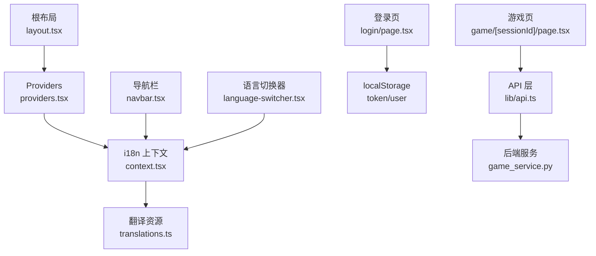
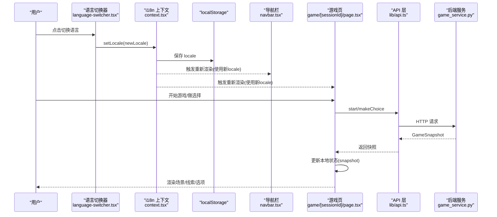
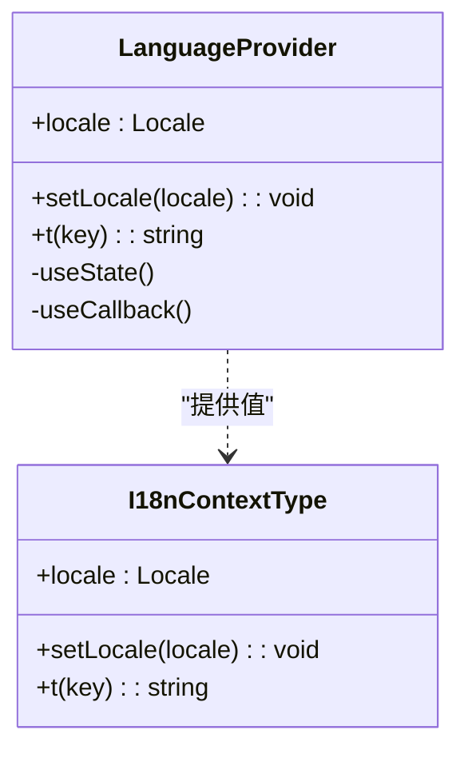
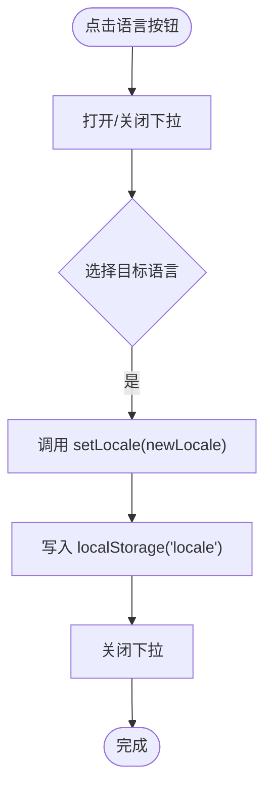
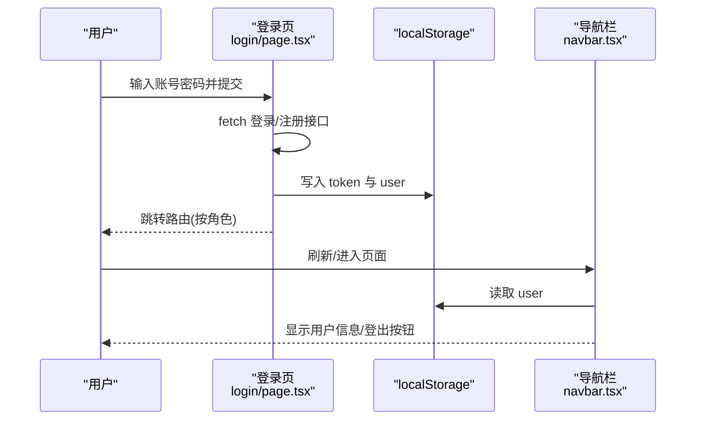
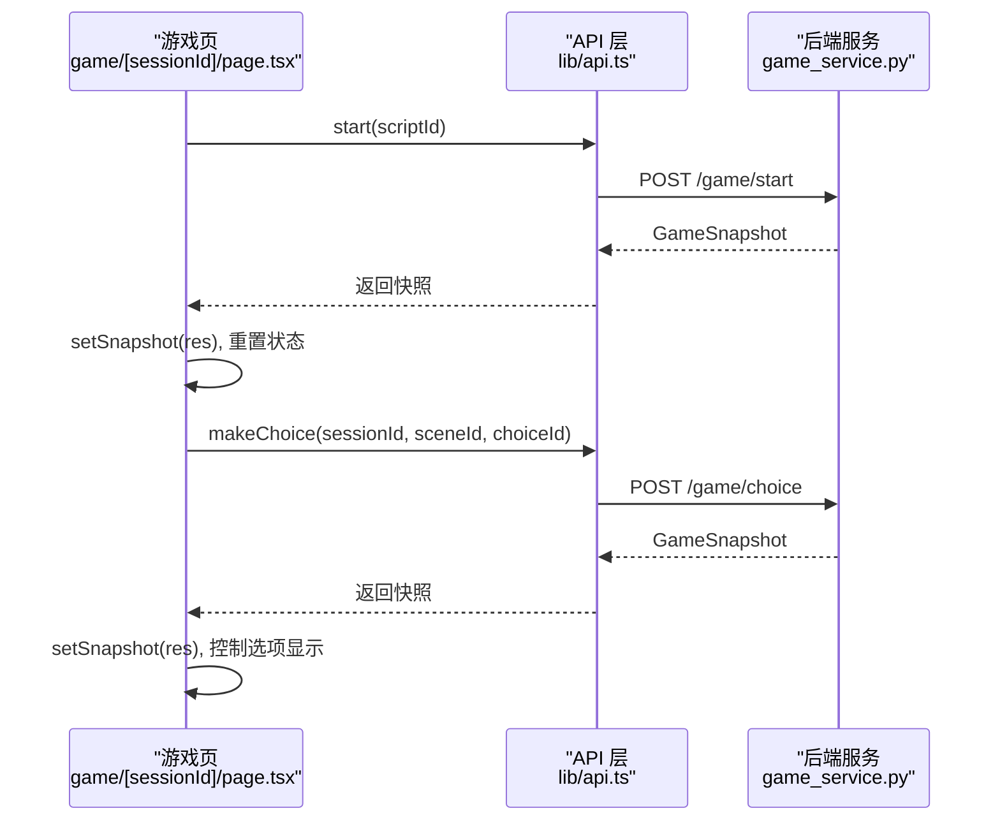
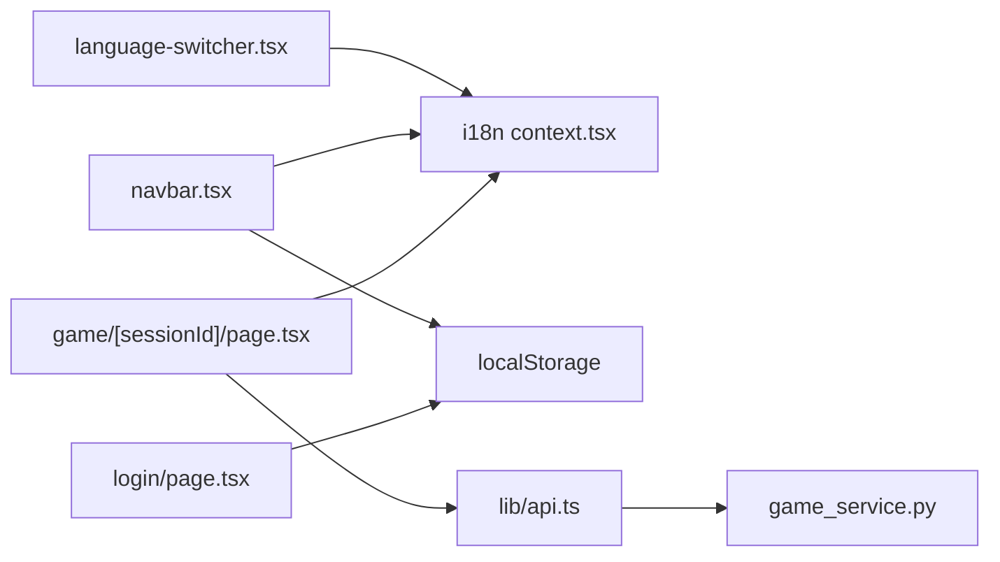

# 状态管理

<cite>
**本文引用的文件**   
- [frontend/src/components/providers.tsx](file://frontend/src/components/providers.tsx)
- [frontend/src/app/layout.tsx](file://frontend/src/app/layout.tsx)
- [frontend/src/lib/i18n/context.tsx](file://frontend/src/lib/i18n/context.tsx)
- [frontend/src/lib/i18n/translations.ts](file://frontend/src/lib/i18n/translations.ts)
- [frontend/src/components/language-switcher.tsx](file://frontend/src/components/language-switcher.tsx)
- [frontend/src/components/navbar.tsx](file://frontend/src/components/navbar.tsx)
- [frontend/src/app/login/page.tsx](file://frontend/src/app/login/page.tsx)
- [frontend/src/app/game/[sessionId]/page.tsx](file://frontend/src/app/game/[sessionId]/page.tsx)
- [frontend/src/lib/api.ts](file://frontend/src/lib/api.ts)
- [backend/app/game_service.py](file://backend/app/game_service.py)
- [backend/app/story/state.py](file://backend/app/story/state.py)
</cite>

## 目录
1. [简介](#简介)
2. [项目结构](#项目结构)
3. [核心组件](#核心组件)
4. [架构总览](#架构总览)
5. [详细组件分析](#详细组件分析)
6. [依赖分析](#依赖分析)
7. [性能考虑](#性能考虑)
8. [故障排查指南](#故障排查指南)
9. [结论](#结论)
10. [附录](#附录)

## 简介
本文件系统化梳理澳秘 Macau Mystery 在前端的状态管理模式，重点围绕 React Context 的使用与扩展：全局语言状态、用户认证状态、游戏会话状态。文档涵盖 Provider 设计、状态更新策略、本地存储集成与持久化同步机制，并给出调试工具、性能优化与内存管理最佳实践，以及复杂状态场景的处理方案与迁移策略。

## 项目结构
前端采用 Next.js App Router，根布局通过自定义 Providers 注入全局上下文；语言切换由 i18n Context 提供；导航栏与登录页直接读写 localStorage 维护认证态；游戏页面通过 API 层与后端交互，获取并维护游戏快照（GameSnapshot）。

**图表来源** 
- [frontend/src/app/layout.tsx:37-61](file://frontend/src/app/layout.tsx#L37-L61)
- [frontend/src/components/providers.tsx:1-8](file://frontend/src/components/providers.tsx#L1-L8)
- [frontend/src/lib/i18n/context.tsx:1-56](file://frontend/src/lib/i18n/context.tsx#L1-L56)
- [frontend/src/lib/i18n/translations.ts:1-464](file://frontend/src/lib/i18n/translations.ts#L1-L464)
- [frontend/src/components/navbar.tsx:1-186](file://frontend/src/components/navbar.tsx#L1-L186)
- [frontend/src/components/language-switcher.tsx:1-59](file://frontend/src/components/language-switcher.tsx#L1-L59)
- [frontend/src/app/login/page.tsx:1-182](file://frontend/src/app/login/page.tsx#L1-L182)
- [frontend/src/app/game/[sessionId]/page.tsx:1-88](file://frontend/src/app/game/[sessionId]/page.tsx#L1-L88)
- [frontend/src/lib/api.ts:52-110](file://frontend/src/lib/api.ts#L52-L110)
- [backend/app/game_service.py:31-351](file://backend/app/game_service.py#L31-L351)

**章节来源**
- [frontend/src/app/layout.tsx:37-61](file://frontend/src/app/layout.tsx#L37-L61)
- [frontend/src/components/providers.tsx:1-8](file://frontend/src/components/providers.tsx#L1-L8)

## 核心组件
- 语言上下文（I18nContext）：集中管理当前语言、翻译函数 t，并通过 localStorage 持久化语言偏好。
- 认证状态：登录/注册后写入 token 与 user 到 localStorage，导航栏据此渲染用户信息与权限菜单。
- 游戏会话状态：游戏页通过 gameApi 调用后端接口，获取 GameSnapshot 并在组件内以 useState 维护，驱动 UI 展示场景、线索与选项。

**章节来源**
- [frontend/src/lib/i18n/context.tsx:1-56](file://frontend/src/lib/i18n/context.tsx#L1-L56)
- [frontend/src/components/navbar.tsx:34-54](file://frontend/src/components/navbar.tsx#L34-L54)
- [frontend/src/app/login/page.tsx:31-76](file://frontend/src/app/login/page.tsx#L31-L76)
- [frontend/src/app/game/[sessionId]/page.tsx:13-88](file://frontend/src/app/game/[sessionId]/page.tsx#L13-L88)
- [frontend/src/lib/api.ts:84-109](file://frontend/src/lib/api.ts#L84-L109)

## 架构总览
React Context 作为全局状态载体，结合本地存储实现跨组件共享与持久化；API 层封装网络请求，将后端返回的 GameSnapshot 映射为前端状态；导航与认证态通过 localStorage 直接读写，保证简单场景下的低耦合与高性能。

**图表来源** 
- [frontend/src/components/language-switcher.tsx:1-59](file://frontend/src/components/language-switcher.tsx#L1-L59)
- [frontend/src/lib/i18n/context.tsx:18-48](file://frontend/src/lib/i18n/context.tsx#L18-L48)
- [frontend/src/components/navbar.tsx:1-186](file://frontend/src/components/navbar.tsx#L1-L186)
- [frontend/src/app/game/[sessionId]/page.tsx:24-59](file://frontend/src/app/game/[sessionId]/page.tsx#L24-L59)
- [frontend/src/lib/api.ts:84-109](file://frontend/src/lib/api.ts#L84-L109)
- [backend/app/game_service.py:35-83](file://backend/app/game_service.py#L35-L83)

## 详细组件分析

### 语言上下文（I18nContext）
- 职责：提供当前语言、设置语言、翻译函数；在挂载时从 localStorage 恢复语言；变更语言时写回 localStorage。
- 数据结构：locale、setLocale、t。
- 复杂度：t 查找为 O(1)，setLocale 包含一次 localStorage 写入。
- 错误处理：当 locale 不存在或翻译缺失时回退到默认语言键。

**图表来源** 
- [frontend/src/lib/i18n/context.tsx:6-16](file://frontend/src/lib/i18n/context.tsx#L6-L16)
- [frontend/src/lib/i18n/context.tsx:18-48](file://frontend/src/lib/i18n/context.tsx#L18-L48)

**章节来源**
- [frontend/src/lib/i18n/context.tsx:1-56](file://frontend/src/lib/i18n/context.tsx#L1-L56)
- [frontend/src/lib/i18n/translations.ts:1-464](file://frontend/src/lib/i18n/translations.ts#L1-L464)

### 语言切换器（LanguageSwitcher）
- 职责：下拉菜单切换语言，调用 useTranslation().setLocale，关闭菜单。
- 交互：点击外部区域关闭下拉；根据当前 locale 高亮选中项。

**图表来源** 
- [frontend/src/components/language-switcher.tsx:8-58](file://frontend/src/components/language-switcher.tsx#L8-L58)
- [frontend/src/lib/i18n/context.tsx:21-24](file://frontend/src/lib/i18n/context.tsx#L21-L24)

**章节来源**
- [frontend/src/components/language-switcher.tsx:1-59](file://frontend/src/components/language-switcher.tsx#L1-L59)

### 认证状态（登录/注册）
- 职责：提交用户名/密码进行登录或注册，成功后将 token 与 user 写入 localStorage，并按角色跳转路由。
- 持久化：localStorage 中 key 包括 token 与 user。
- 退出：清除 token 与 user，重定向至首页。

**图表来源** 
- [frontend/src/app/login/page.tsx:31-76](file://frontend/src/app/login/page.tsx#L31-L76)
- [frontend/src/components/navbar.tsx:34-50](file://frontend/src/components/navbar.tsx#L34-L50)

**章节来源**
- [frontend/src/app/login/page.tsx:1-182](file://frontend/src/app/login/page.tsx#L1-L182)
- [frontend/src/components/navbar.tsx:1-186](file://frontend/src/components/navbar.tsx#L1-L186)

### 游戏会话状态（Game Snapshot）
- 职责：加载游戏快照、处理玩家选择、播放视频后展示选项。
- 数据流：gameApi.start/makeChoice 返回 GameSnapshot，组件用 useState 维护 snapshot、loading、error、showChoices、videoEnded。
- 后端契约：GameService 提供 start_game、get_state、make_choice，返回统一快照结构。

**图表来源** 
- [frontend/src/app/game/[sessionId]/page.tsx:24-59](file://frontend/src/app/game/[sessionId]/page.tsx#L24-L59)
- [frontend/src/lib/api.ts:84-109](file://frontend/src/lib/api.ts#L84-L109)
- [backend/app/game_service.py:35-83](file://backend/app/game_service.py#L35-L83)

**章节来源**
- [frontend/src/app/game/[sessionId]/page.tsx:1-88](file://frontend/src/app/game/[sessionId]/page.tsx#L1-L88)
- [frontend/src/lib/api.ts:52-110](file://frontend/src/lib/api.ts#L52-L110)
- [backend/app/game_service.py:31-351](file://backend/app/game_service.py#L31-L351)

### 根布局与 Providers
- 根布局包裹 Providers，确保全应用可用语言上下文。
- Providers 目前仅注入 LanguageProvider，便于后续扩展其他全局上下文（如认证、主题等）。

**章节来源**
- [frontend/src/app/layout.tsx:37-61](file://frontend/src/app/layout.tsx#L37-L61)
- [frontend/src/components/providers.tsx:1-8](file://frontend/src/components/providers.tsx#L1-L8)

## 依赖分析
- 组件依赖：
  - language-switcher 依赖 i18n context。
  - navbar 依赖 i18n context 与 localStorage。
  - login 页面直接操作 localStorage，不依赖上下文。
  - 游戏页依赖 api 层与 i18n context（用于文案）。
- 后端依赖：
  - game_service 提供会话生命周期管理与选择推进，返回统一快照。

**图表来源** 
- [frontend/src/components/language-switcher.tsx:1-59](file://frontend/src/components/language-switcher.tsx#L1-L59)
- [frontend/src/components/navbar.tsx:1-186](file://frontend/src/components/navbar.tsx#L1-L186)
- [frontend/src/app/login/page.tsx:1-182](file://frontend/src/app/login/page.tsx#L1-L182)
- [frontend/src/app/game/[sessionId]/page.tsx:1-88](file://frontend/src/app/game/[sessionId]/page.tsx#L1-L88)
- [frontend/src/lib/api.ts:52-110](file://frontend/src/lib/api.ts#L52-L110)
- [backend/app/game_service.py:31-351](file://backend/app/game_service.py#L31-L351)

**章节来源**
- [frontend/src/lib/api.ts:52-110](file://frontend/src/lib/api.ts#L52-L110)
- [backend/app/game_service.py:31-351](file://backend/app/game_service.py#L31-L351)

## 性能考虑
- 避免不必要的重渲染：
  - 将 setLocale 与 t 通过 useCallback 稳定引用，减少子组件重渲染。
  - 对频繁更新的局部状态（如 loading、error、showChoices）保持细粒度 state，避免全局污染。
- 本地存储访问：
  - 仅在必要时机读写 localStorage（如语言切换、登录/登出），避免在高频渲染路径中重复读取。
- 网络请求：
  - 使用 request_id 去重（makeChoice 已生成随机 id），防止重复提交。
  - 合理缓存 GameSnapshot，必要时结合 sessionStorage 跨页面传递结果。
- 内存管理：
  - 及时清理事件监听（如 language-switcher 的外部点击监听）。
  - 避免在 useEffect 中创建大对象或闭包捕获不必要变量。

[本节为通用指导，无需特定文件引用]

## 故障排查指南
- 语言切换无效：
  - 检查 context.tsx 中 setLocale 是否成功写入 localStorage，且 translations 中存在对应 locale。
  - 确认各组件正确调用 useTranslation 并使用 t(key)。
- 登录后导航异常：
  - 检查 login/page.tsx 是否正确写入 token 与 user，navbar.tsx 是否能读取 user。
  - 确认路由跳转逻辑与角色判断。
- 游戏状态不同步：
  - 核对 gameApi.makeChoice 的请求参数（session_id、scene_id、choice_id、request_id）。
  - 检查后端 game_service 的事务与并发保护（with_for_update）。
- 视频播放与选项显示：
  - 确认 handleVideoEnded 触发后 showChoices 被设置为 true，且 snapshot.scene.choices 非空。

**章节来源**
- [frontend/src/lib/i18n/context.tsx:21-34](file://frontend/src/lib/i18n/context.tsx#L21-L34)
- [frontend/src/components/language-switcher.tsx:14-22](file://frontend/src/components/language-switcher.tsx#L14-L22)
- [frontend/src/app/login/page.tsx:31-76](file://frontend/src/app/login/page.tsx#L31-L76)
- [frontend/src/components/navbar.tsx:34-50](file://frontend/src/components/navbar.tsx#L34-L50)
- [frontend/src/app/game/[sessionId]/page.tsx:43-66](file://frontend/src/app/game/[sessionId]/page.tsx#L43-L66)
- [frontend/src/lib/api.ts:92-106](file://frontend/src/lib/api.ts#L92-L106)
- [backend/app/game_service.py:84-92](file://backend/app/game_service.py#L84-L92)

## 结论
本项目通过 React Context 实现了轻量而可扩展的全局状态管理：语言切换具备持久化与跨组件一致性；认证态通过 localStorage 直接读写，满足简单场景的高效需求；游戏会话状态集中在页面级，配合 API 层与后端服务形成清晰的单向数据流。未来可在 Providers 中引入统一的认证上下文、主题上下文与错误边界，进一步提升可维护性与可观测性。

[本节为总结，无需特定文件引用]

## 附录
- 状态迁移策略建议：
  - 逐步将分散的 localStorage 读写收敛到统一上下文（例如 AuthContext），提供 set/get 方法与副作用隔离。
  - 对复杂状态（如多步骤表单、游戏进度）引入状态机或不可变更新模式，提升可测试性与可回溯性。
  - 为关键状态增加日志与埋点，便于定位问题与性能分析。
- 调试工具建议：
  - 浏览器 DevTools 的 Storage 面板查看 localStorage/sessionStorage。
  - 使用 React DevTools 观察组件状态变化与重渲染次数。
  - 在网络面板监控 API 请求与响应，验证 GameSnapshot 结构一致性。

[本节为通用指导，无需特定文件引用]