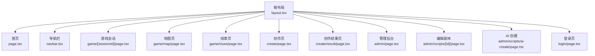
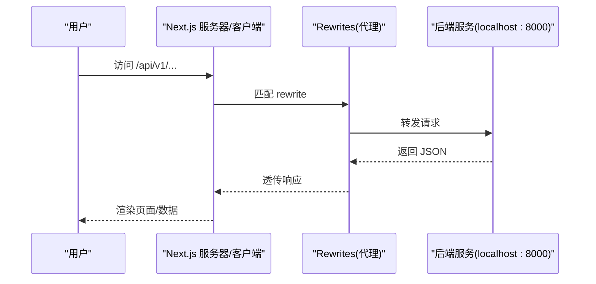
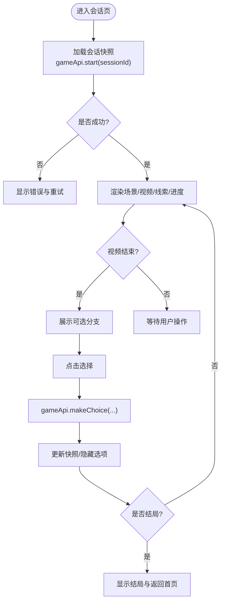
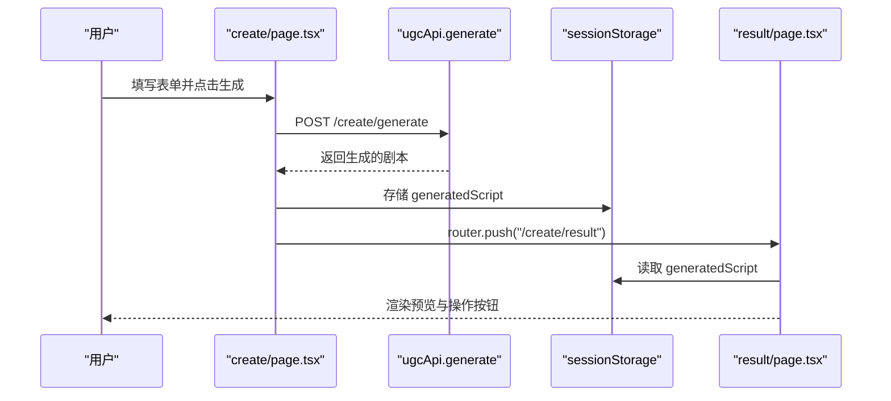
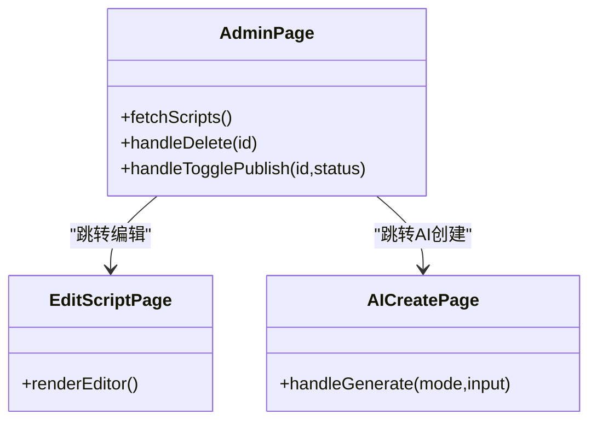
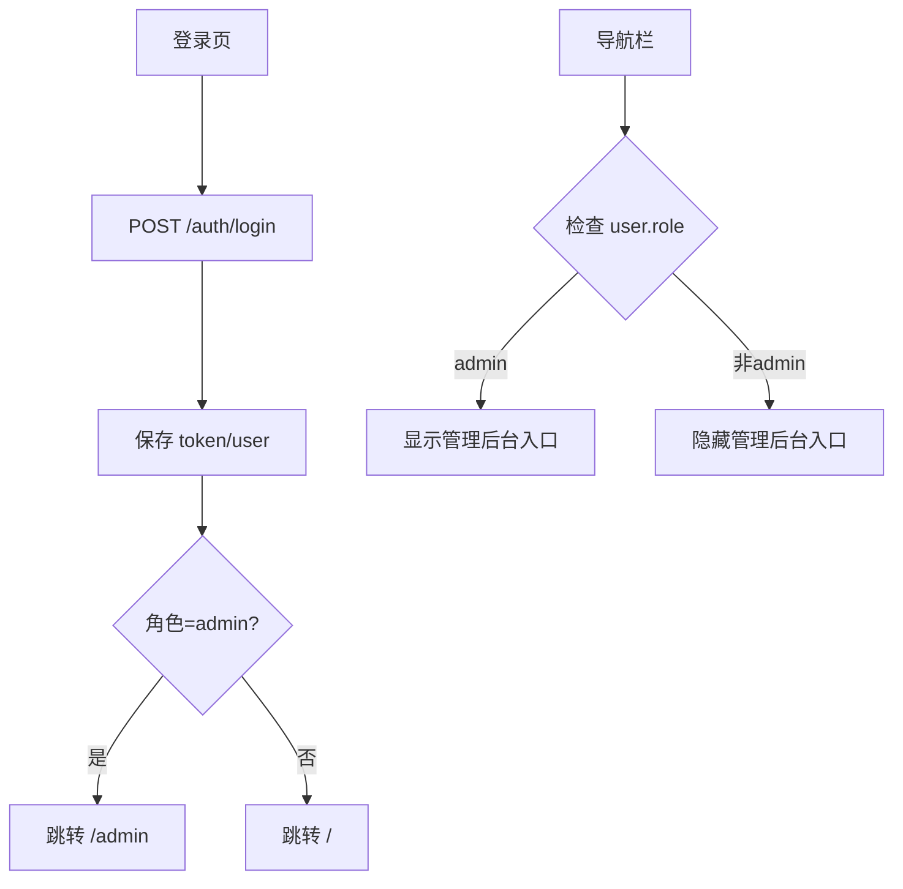
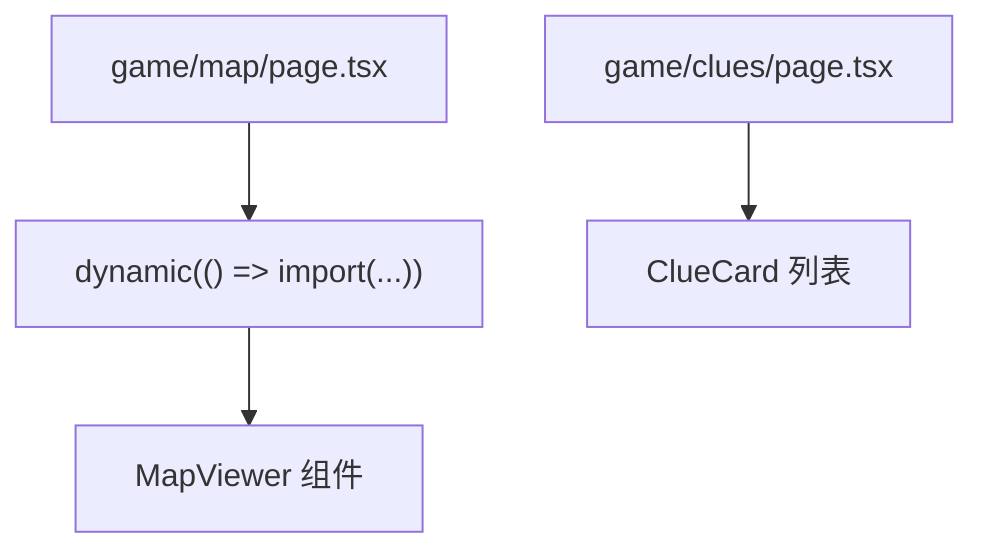
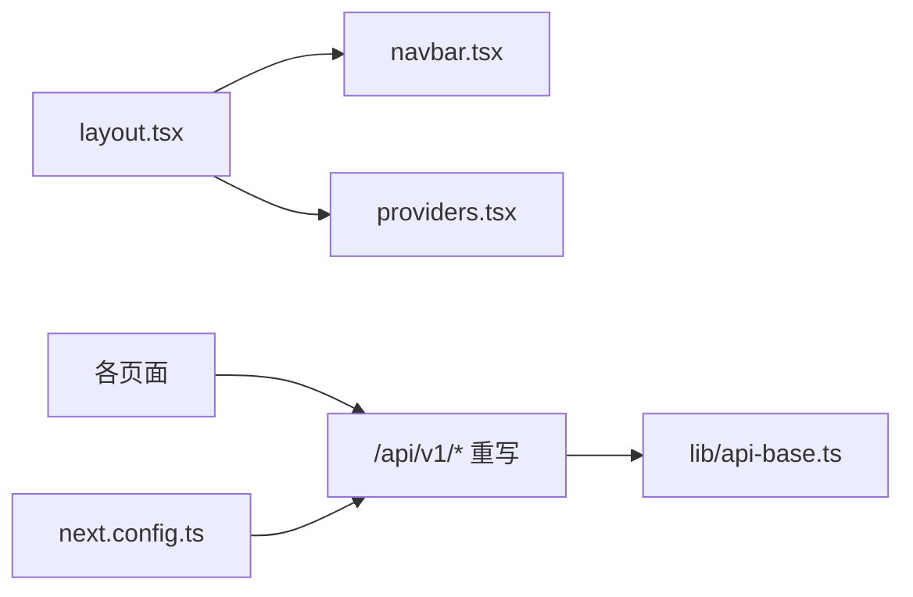

# 路由与导航

<cite>
**本文引用的文件**   
- [frontend/src/app/layout.tsx](file://frontend/src/app/layout.tsx)
- [frontend/src/app/page.tsx](file://frontend/src/app/page.tsx)
- [frontend/src/components/navbar.tsx](file://frontend/src/components/navbar.tsx)
- [frontend/src/components/providers.tsx](file://frontend/src/components/providers.tsx)
- [frontend/src/app/game/[sessionId]/page.tsx](file://frontend/src/app/game/[sessionId]/page.tsx)
- [frontend/src/app/game/map/page.tsx](file://frontend/src/app/game/map/page.tsx)
- [frontend/src/app/game/clues/page.tsx](file://frontend/src/app/game/clues/page.tsx)
- [frontend/src/app/create/page.tsx](file://frontend/src/app/create/page.tsx)
- [frontend/src/app/create/result/page.tsx](file://frontend/src/app/create/result/page.tsx)
- [frontend/src/app/admin/page.tsx](file://frontend/src/app/admin/page.tsx)
- [frontend/src/app/admin/scripts/[id]/page.tsx](file://frontend/src/app/admin/scripts/[id]/page.tsx)
- [frontend/src/app/admin/scripts/ai-create/page.tsx](file://frontend/src/app/admin/scripts/ai-create/page.tsx)
- [frontend/src/app/login/page.tsx](file://frontend/src/app/login/page.tsx)
- [frontend/src/lib/api.ts](file://frontend/src/lib/api.ts)
- [frontend/src/lib/api-base.ts](file://frontend/src/lib/api-base.ts)
- [frontend/next.config.ts](file://frontend/next.config.ts)
</cite>

## 目录
1. [简介](#简介)
2. [项目结构](#项目结构)
3. [核心组件](#核心组件)
4. [架构总览](#架构总览)
5. [详细组件分析](#详细组件分析)
6. [依赖关系分析](#依赖关系分析)
7. [性能考虑](#性能考虑)
8. [故障排查指南](#故障排查指南)
9. [结论](#结论)
10. [附录](#附录)

## 简介
本文件系统性梳理澳秘 Macau Mystery 前端基于 Next.js App Router 的路由与导航体系，覆盖：
- 路由约定与动态路由（游戏会话、创作页、管理后台）
- 导航组件实现、权限控制与路由守卫策略
- 页面间数据传递、参数获取与查询字符串处理
- 路由懒加载、预取优化与错误边界处理
- 移动端适配与 SEO 优化策略

## 项目结构
Next.js App Router 以文件系统即路由为核心。关键目录与职责：
- app 根布局与元信息：layout.tsx 定义全局字体、SEO、视口、全局 Provider 与 Navbar
- 首页：page.tsx 作为入口，提供 CTA 跳转至游戏与创作
- 游戏模块：game/[sessionId] 为动态会话页；map、clues 为辅助页
- 创作模块：create 与 create/result 构成 UGC 生成流程
- 管理后台：admin 及其子路由 scripts/[id]、scripts/ai-create
- 登录：login 完成鉴权与角色分流

**图示来源** 
- [frontend/src/app/layout.tsx:1-62](file://frontend/src/app/layout.tsx#L1-L62)
- [frontend/src/app/page.tsx:1-453](file://frontend/src/app/page.tsx#L1-L453)
- [frontend/src/components/navbar.tsx:1-186](file://frontend/src/components/navbar.tsx#L1-L186)
- [frontend/src/app/game/[sessionId]/page.tsx:1-194](file://frontend/src/app/game/[sessionId]/page.tsx#L1-L194)
- [frontend/src/app/game/map/page.tsx:1-59](file://frontend/src/app/game/map/page.tsx#L1-L59)
- [frontend/src/app/game/clues/page.tsx:1-68](file://frontend/src/app/game/clues/page.tsx#L1-L68)
- [frontend/src/app/create/page.tsx:1-136](file://frontend/src/app/create/page.tsx#L1-L136)
- [frontend/src/app/create/result/page.tsx:1-227](file://frontend/src/app/create/result/page.tsx#L1-L227)
- [frontend/src/app/admin/page.tsx:1-214](file://frontend/src/app/admin/page.tsx#L1-L214)
- [frontend/src/app/admin/scripts/[id]/page.tsx:1-61](file://frontend/src/app/admin/scripts/[id]/page.tsx#L1-L61)
- [frontend/src/app/admin/scripts/ai-create/page.tsx:1-137](file://frontend/src/app/admin/scripts/ai-create/page.tsx#L1-L137)
- [frontend/src/app/login/page.tsx:1-182](file://frontend/src/app/login/page.tsx#L1-L182)

**章节来源**
- [frontend/src/app/layout.tsx:1-62](file://frontend/src/app/layout.tsx#L1-L62)
- [frontend/src/app/page.tsx:1-453](file://frontend/src/app/page.tsx#L1-L453)

## 核心组件
- 根布局与 SEO
  - 定义站点标题、描述、图标与视口，确保移动端缩放与基础 SEO
  - 注入全局 Providers（语言环境）、MouseFollower、Navbar 与 Footer
- 导航栏
  - 响应式桌面/移动端菜单，滚动吸顶效果
  - 根据用户角色过滤“管理后台”等受限项
  - 集成语言切换与登录/登出逻辑
- 语言与上下文
  - Providers 包裹 LanguageProvider，使全应用可访问 i18n

**章节来源**
- [frontend/src/app/layout.tsx:1-62](file://frontend/src/app/layout.tsx#L1-L62)
- [frontend/src/components/navbar.tsx:1-186](file://frontend/src/components/navbar.tsx#L1-L186)
- [frontend/src/components/providers.tsx:1-8](file://frontend/src/components/providers.tsx#L1-L8)

## 架构总览
Next.js App Router 将文件系统映射为 URL，配合客户端组件与 API 层完成交互。API 通过 next.config.ts 的 rewrites 转发到后端服务。

**图示来源** 
- [frontend/next.config.ts:1-15](file://frontend/next.config.ts#L1-L15)

**章节来源**
- [frontend/next.config.ts:1-15](file://frontend/next.config.ts#L1-L15)

## 详细组件分析

### 游戏会话路由 game/[sessionId]
- 动态路由：使用 useParams 获取 sessionId，调用 gameApi.start 初始化会话快照
- 选择分支：makeChoice 提交选择并刷新快照，支持视频播放结束自动展示选项
- 状态与错误：loading/error 状态机，重试机制与结束场景处理

**图示来源** 
- [frontend/src/app/game/[sessionId]/page.tsx:1-194](file://frontend/src/app/game/[sessionId]/page.tsx#L1-L194)
- [frontend/src/lib/api.ts:84-109](file://frontend/src/lib/api.ts#L84-L109)

**章节来源**
- [frontend/src/app/game/[sessionId]/page.tsx:1-194](file://frontend/src/app/game/[sessionId]/page.tsx#L1-L194)
- [frontend/src/lib/api.ts:84-109](file://frontend/src/lib/api.ts#L84-L109)

### 创作流程 create 与 create/result
- 输入与风格：create 页收集一句话描述、风格、时代、幕数与自定义提示词
- 生成与持久化：调用 ugcApi.generate，将结果写入 sessionStorage，并跳转到 result
- 结果页：读取 sessionStorage 渲染预览，支持重新生成、发布、公开设置与提交官方审核

**图示来源** 
- [frontend/src/app/create/page.tsx:1-136](file://frontend/src/app/create/page.tsx#L1-L136)
- [frontend/src/app/create/result/page.tsx:1-227](file://frontend/src/app/create/result/page.tsx#L1-L227)
- [frontend/src/lib/api.ts:132-154](file://frontend/src/lib/api.ts#L132-L154)

**章节来源**
- [frontend/src/app/create/page.tsx:1-136](file://frontend/src/app/create/page.tsx#L1-L136)
- [frontend/src/app/create/result/page.tsx:1-227](file://frontend/src/app/create/result/page.tsx#L1-L227)
- [frontend/src/lib/api.ts:132-154](file://frontend/src/lib/api.ts#L132-L154)

### 管理后台 admin 与脚本编辑
- 列表与统计：admin/page.tsx 拉取脚本列表、统计与状态切换
- 动态编辑：admin/scripts/[id] 打开编辑器进行内容修改
- AI 快速创建：admin/scripts/ai-create 提供两种模式（快速生成/润色构思）

**图示来源** 
- [frontend/src/app/admin/page.tsx:1-214](file://frontend/src/app/admin/page.tsx#L1-L214)
- [frontend/src/app/admin/scripts/[id]/page.tsx:1-61](file://frontend/src/app/admin/scripts/[id]/page.tsx#L1-L61)
- [frontend/src/app/admin/scripts/ai-create/page.tsx:1-137](file://frontend/src/app/admin/scripts/ai-create/page.tsx#L1-L137)

**章节来源**
- [frontend/src/app/admin/page.tsx:1-214](file://frontend/src/app/admin/page.tsx#L1-L214)
- [frontend/src/app/admin/scripts/[id]/page.tsx:1-61](file://frontend/src/app/admin/scripts/[id]/page.tsx#L1-L61)
- [frontend/src/app/admin/scripts/ai-create/page.tsx:1-137](file://frontend/src/app/admin/scripts/ai-create/page.tsx#L1-L137)

### 登录与权限控制
- 登录/注册：login 页直接调用后端接口，成功后保存 token 与 user 到 localStorage
- 导航守卫：navbar 根据 localStorage.user.role 决定是否显示“管理后台”等受限项
- 登出：清除本地凭证并跳转首页

**图示来源** 
- [frontend/src/app/login/page.tsx:1-182](file://frontend/src/app/login/page.tsx#L1-L182)
- [frontend/src/components/navbar.tsx:1-186](file://frontend/src/components/navbar.tsx#L1-L186)

**章节来源**
- [frontend/src/app/login/page.tsx:1-182](file://frontend/src/app/login/page.tsx#L1-L182)
- [frontend/src/components/navbar.tsx:1-186](file://frontend/src/components/navbar.tsx#L1-L186)

### 地图与线索页
- 地图页：使用 next/dynamic 懒加载 MapViewer 组件，避免 SSR 依赖问题
- 线索页：展示已收集与未解锁线索卡片

**图示来源** 
- [frontend/src/app/game/map/page.tsx:1-59](file://frontend/src/app/game/map/page.tsx#L1-L59)
- [frontend/src/app/game/clues/page.tsx:1-68](file://frontend/src/app/game/clues/page.tsx#L1-L68)

**章节来源**
- [frontend/src/app/game/map/page.tsx:1-59](file://frontend/src/app/game/map/page.tsx#L1-L59)
- [frontend/src/app/game/clues/page.tsx:1-68](file://frontend/src/app/game/clues/page.tsx#L1-L68)

### 首页与路由引导
- 首页提供“开始游戏”和“创作短剧”两个主入口，分别跳转到游戏与创作流程
- 路线时间线从后端获取，支持多语言映射

**章节来源**
- [frontend/src/app/page.tsx:1-453](file://frontend/src/app/page.tsx#L1-L453)

## 依赖关系分析
- 路由与组件耦合
  - layout.tsx 聚合全局 UI 与 Providers
  - navbar.tsx 依赖 usePathname/useRouter 与 i18n
  - 各页面通过 lib/api.ts 统一访问后端
- API 层与配置
  - api-base.ts 提供 BASE_URL，支持环境变量
  - next.config.ts 将 /api/v1/* 重写至后端服务

**图示来源** 
- [frontend/src/app/layout.tsx:1-62](file://frontend/src/app/layout.tsx#L1-L62)
- [frontend/src/components/navbar.tsx:1-186](file://frontend/src/components/navbar.tsx#L1-L186)
- [frontend/src/components/providers.tsx:1-8](file://frontend/src/components/providers.tsx#L1-L8)
- [frontend/src/lib/api.ts:1-216](file://frontend/src/lib/api.ts#L1-L216)
- [frontend/src/lib/api-base.ts:1-2](file://frontend/src/lib/api-base.ts#L1-L2)
- [frontend/next.config.ts:1-15](file://frontend/next.config.ts#L1-L15)

**章节来源**
- [frontend/src/lib/api.ts:1-216](file://frontend/src/lib/api.ts#L1-L216)
- [frontend/src/lib/api-base.ts:1-2](file://frontend/src/lib/api-base.ts#L1-L2)
- [frontend/next.config.ts:1-15](file://frontend/next.config.ts#L1-L15)

## 性能考虑
- 路由懒加载
  - 地图页使用 dynamic(ssr:false) 避免服务端渲染第三方库导致的兼容问题
- 预取与缓存
  - 使用 Link 默认开启 prefetch，提升导航体验
  - 对热点资源（如地图组件）可按需延迟加载
- 首屏优化
  - 根布局仅引入必要字体与样式，减少无关代码
- 错误边界
  - 当前页面级错误通过 loading/error 状态处理；建议在全局添加 Error Boundary 捕获渲染异常

[本节为通用指导，不直接分析具体文件]

## 故障排查指南
- API 请求失败
  - 检查 next.config.ts 的 rewrites 是否正确指向后端地址
  - 确认 API_BASE 环境变量或默认值正确
- 登录与权限
  - 确认 localStorage 中 token/user 是否存在且格式正确
  - 检查 navbar 的角色判断逻辑是否生效
- 动态路由参数
  - 使用 useParams 获取参数时注意类型断言与空值处理
- 网络与跨域
  - 开发环境下确保后端服务运行在指定端口并可被前端访问

**章节来源**
- [frontend/next.config.ts:1-15](file://frontend/next.config.ts#L1-L15)
- [frontend/src/lib/api-base.ts:1-2](file://frontend/src/lib/api-base.ts#L1-L2)
- [frontend/src/components/navbar.tsx:1-186](file://frontend/src/components/navbar.tsx#L1-L186)
- [frontend/src/app/game/[sessionId]/page.tsx:1-194](file://frontend/src/app/game/[sessionId]/page.tsx#L1-L194)

## 结论
本项目基于 Next.js App Router 实现了清晰、可扩展的前端路由与导航体系：
- 通过文件系统组织路由，结合动态路由满足游戏会话、创作与管理后台需求
- 导航组件集中处理权限与国际化，保证一致的用户体验
- API 层统一封装，配合 rewrites 简化前后端联调
- 采用懒加载与状态机提升性能与稳定性

[本节为总结性内容，不直接分析具体文件]

## 附录
- 路由清单与用途
  - /：首页与入口引导
  - /game/[sessionId]：游戏会话页（动态路由）
  - /game/map：地图页（懒加载）
  - /game/clues：线索背包页
  - /create：创作输入页
  - /create/result：创作结果页（sessionStorage 数据）
  - /admin：管理后台
  - /admin/scripts/[id]：编辑剧本（动态路由）
  - /admin/scripts/ai-create：AI 快速创建
  - /login：登录/注册

- 参数与数据传递
  - 路径参数：useParams 获取 sessionId、script id
  - 页面间数据：sessionStorage 用于创作结果临时传递
  - 查询字符串：当前未显式使用，可在需要时通过 useRouter().query 扩展

- SEO 与移动端
  - 根布局设置 title、description、icons 与 viewport
  - 响应式布局与移动端菜单适配

[本节为补充说明，不直接分析具体文件]