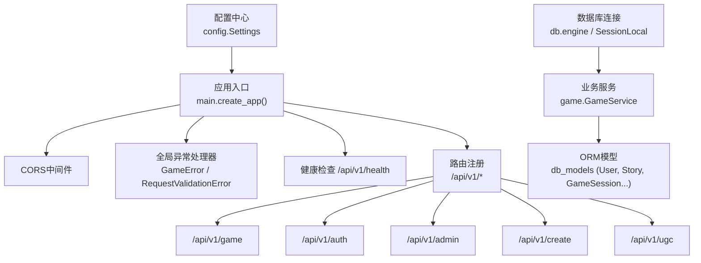
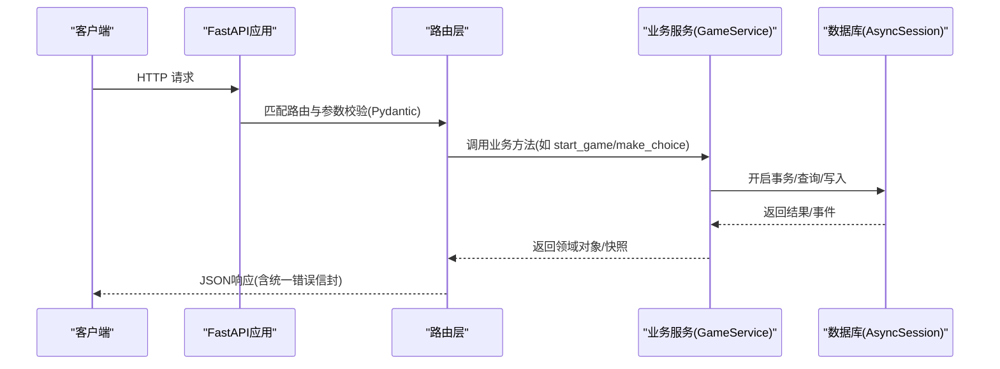
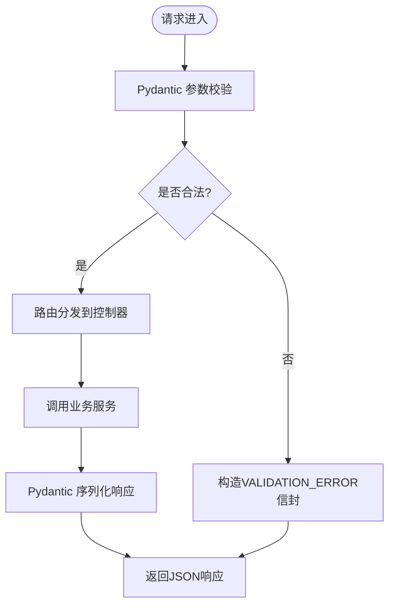
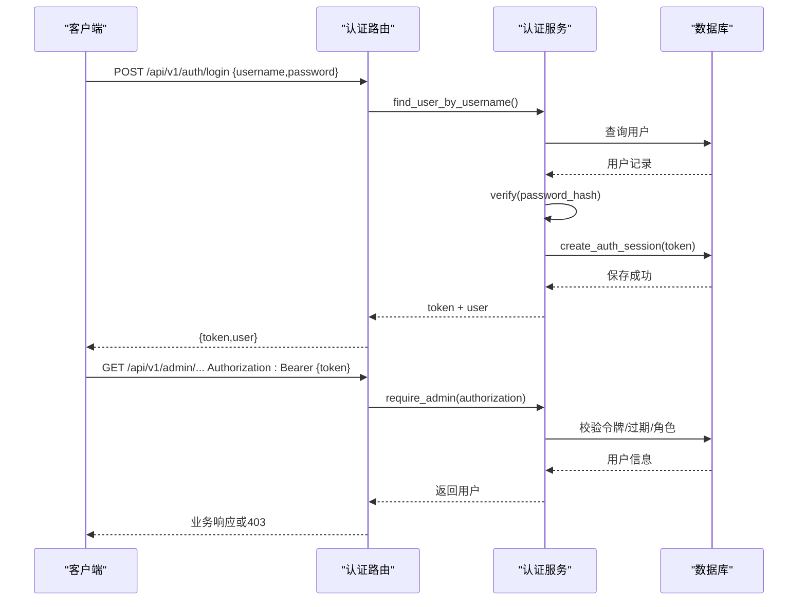
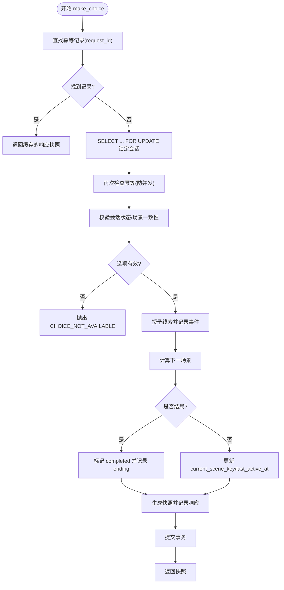
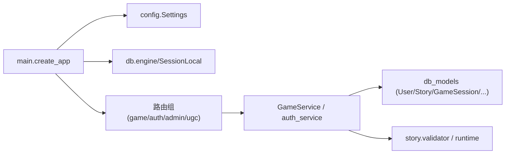

# API层设计

<cite>
**本文引用的文件**   
- [backend/app/main.py](file://backend/app/main.py)
- [backend/app/config.py](file://backend/app/config.py)
- [backend/app/models.py](file://backend/app/models.py)
- [backend/app/auth_service.py](file://backend/app/auth_service.py)
- [backend/app/db.py](file://backend/app/db.py)
- [backend/app/game_errors.py](file://backend/app/game_errors.py)
- [backend/app/game_service.py](file://backend/app/game_service.py)
- [backend/app/api/game.py](file://backend/app/api/game.py)
- [backend/app/api/auth.py](file://backend/app/api/auth.py)
- [backend/app/api/admin.py](file://backend/app/api/admin.py)
- [backend/app/api/ugc.py](file://backend/app/api/ugc.py)
- [backend/app/api/ugc_user.py](file://backend/app/api/ugc_user.py)
- [backend/tests/test_auth_api.py](file://backend/tests/test_auth_api.py)
- [backend/tests/test_game_api.py](file://backend/tests/test_game_api.py)
</cite>

## 目录
1. [简介](#简介)
2. [项目结构](#项目结构)
3. [核心组件](#核心组件)
4. [架构总览](#架构总览)
5. [详细组件分析](#详细组件分析)
6. [依赖关系分析](#依赖关系分析)
7. [性能考量](#性能考量)
8. [故障排查指南](#故障排查指南)
9. [结论](#结论)
10. [附录](#附录)

## 简介
本文件面向后端API层的设计与实现，系统性阐述RESTful接口规范、路由组织模式、请求处理流程、Pydantic模型校验与序列化机制、API版本控制策略、错误码规范与响应格式标准化、认证中间件集成、权限验证流程与跨域配置。同时提供最佳实践、性能优化建议与调试方法，帮助读者快速理解并高效扩展系统能力。

## 项目结构
后端采用FastAPI构建，按功能域划分路由模块：游戏（game）、AI（ai）、UGC（create/ugc）、管理员（admin）、认证（auth）。应用入口负责生命周期管理、全局异常处理、CORS配置与路由注册。数据库通过SQLAlchemy异步引擎与会话工厂提供，配置集中管理环境变量。

图表来源
- [backend/app/main.py:17-107](file://backend/app/main.py#L17-L107)
- [backend/app/config.py:38-77](file://backend/app/config.py#L38-L77)
- [backend/app/db.py:12-42](file://backend/app/db.py#L12-L42)

章节来源
- [backend/app/main.py:17-107](file://backend/app/main.py#L17-L107)
- [backend/app/config.py:38-77](file://backend/app/config.py#L38-L77)
- [backend/app/db.py:12-42](file://backend/app/db.py#L12-L42)

## 核心组件
- 应用装配与生命周期：创建FastAPI实例、注册异常处理器、CORS、挂载各子路由与健康检查端点。
- 配置管理：基于数据类的Settings，从环境变量加载数据库URL、CORS源、演示数据开关、令牌TTL等。
- 数据库访问：异步引擎与会话工厂，SQLite特殊PRAGMA配置，健康检查查询。
- 认证服务：用户名/密码校验、哈希存储、Bearer令牌签发与校验、管理员权限校验、演示账户初始化。
- 游戏服务：故事版本锁定、会话状态机、选择推进、线索发放、幂等重放、快照序列化。
- Pydantic模型：统一的请求/响应契约，字段校验、类型约束、可选字段与枚举。
- 统一错误封装：GameError定义稳定错误码，全局处理器输出一致的错误信封。

章节来源
- [backend/app/main.py:17-107](file://backend/app/main.py#L17-L107)
- [backend/app/config.py:38-77](file://backend/app/config.py#L38-L77)
- [backend/app/db.py:12-42](file://backend/app/db.py#L12-L42)
- [backend/app/auth_service.py:27-153](file://backend/app/auth_service.py#L27-L153)
- [backend/app/game_service.py:31-386](file://backend/app/game_service.py#L31-L386)
- [backend/app/models.py:8-146](file://backend/app/models.py#L8-L146)
- [backend/app/game_errors.py:7-20](file://backend/app/game_errors.py#L7-L20)

## 架构总览
整体采用“路由层 -> 服务层 -> 数据层”的分层架构。路由层仅做参数绑定与响应建模；服务层承载业务逻辑与事务边界；数据层通过SQLAlchemy进行持久化。认证与权限在路由层通过依赖注入或显式调用认证服务完成。

图表来源
- [backend/app/main.py:84-96](file://backend/app/main.py#L84-L96)
- [backend/app/api/game.py:15-36](file://backend/app/api/game.py#L15-L36)
- [backend/app/game_service.py:35-193](file://backend/app/game_service.py#L35-L193)
- [backend/app/db.py:30-42](file://backend/app/db.py#L30-L42)

## 详细组件分析

### RESTful API设计与路由组织
- 版本化前缀：所有对外API以/api/v1为统一前缀，便于后续演进与兼容。
- 资源命名：使用名词复数或动宾结构表达资源与动作，例如：
  - 认证：/api/v1/auth/login、/api/v1/auth/register、/api/v1/auth/me
  - 游戏：/api/v1/game/start、/api/v1/game/choice、/api/v1/game/state/{session_id}
  - UGC创作：/api/v1/create/generate、/api/v1/create/regenerate/{script_id}
  - 用户UGC：/api/v1/ugc/my-scripts、/api/v1/ugc/publish/{script_id}、/api/v1/ugc/submit/{script_id}、/api/v1/ugc/public
  - 管理后台：/api/v1/admin/scripts、/api/v1/admin/submissions、/api/v1/admin/stats、/api/v1/admin/route
- 标签分组：路由注册时设置tags，便于文档生成与分类展示。

章节来源
- [backend/app/main.py:84-96](file://backend/app/main.py#L84-L96)
- [backend/app/api/auth.py:24-97](file://backend/app/api/auth.py#L24-L97)
- [backend/app/api/game.py:12-36](file://backend/app/api/game.py#L12-L36)
- [backend/app/api/ugc.py:5-35](file://backend/app/api/ugc.py#L5-L35)
- [backend/app/api/ugc_user.py:12-96](file://backend/app/api/ugc_user.py#L12-L96)
- [backend/app/api/admin.py:12-218](file://backend/app/api/admin.py#L12-L218)

### 请求处理流程与Pydantic校验
- 请求进入FastAPI后，由Pydantic对请求体进行强类型校验与转换，非法输入触发RequestValidationError。
- 针对游戏接口路径，自定义校验错误响应，将错误信息统一封装为error.code/message/details结构。
- 响应使用response_model与exclude_none=True，确保输出精简且类型安全。

图表来源
- [backend/app/main.py:51-74](file://backend/app/main.py#L51-L74)
- [backend/app/api/game.py:15-36](file://backend/app/api/game.py#L15-L36)

章节来源
- [backend/app/main.py:51-74](file://backend/app/main.py#L51-L74)
- [backend/app/models.py:8-146](file://backend/app/models.py#L8-L146)

### 认证与权限验证
- 登录/注册：
  - 用户名需符合正则规则，密码长度限制，昵称规范化。
  - 注册成功后立即签发Bearer令牌并存入AuthSession表。
- 鉴权：
  - 通过Authorization头携带Bearer令牌，服务端校验令牌有效性、过期与用户状态。
  - 管理员接口通过require_admin强制角色校验，非管理员返回403。
- 测试覆盖：
  - 包含重复注册、无效凭证、过期令牌、角色守卫等场景。

图表来源
- [backend/app/api/auth.py:64-97](file://backend/app/api/auth.py#L64-L97)
- [backend/app/auth_service.py:100-131](file://backend/app/auth_service.py#L100-L131)
- [backend/tests/test_auth_api.py:130-156](file://backend/tests/test_auth_api.py#L130-L156)

章节来源
- [backend/app/api/auth.py:24-97](file://backend/app/api/auth.py#L24-L97)
- [backend/app/auth_service.py:27-153](file://backend/app/auth_service.py#L27-L153)
- [backend/tests/test_auth_api.py:130-156](file://backend/tests/test_auth_api.py#L130-L156)

### 游戏API与状态机
- 启动游戏：
  - 校验脚本存在且已发布，加载活跃版本，解析入口场景，创建会话与初始事件，返回快照。
- 做出选择：
  - 幂等保护：通过request_id去重，避免重复推进。
  - 并发安全：对会话行加锁，防止竞态条件。
  - 状态校验：检查会话状态、当前场景一致性、选项可用性。
  - 线索发放：根据选项grant_clues增量授予，记录事件序列号。
  - 结局判定：若目标场景为结局，更新会话状态为completed并记录ending。
- 获取状态：
  - 根据session_id恢复快照，不包含awarded_clues。

图表来源
- [backend/app/game_service.py:70-193](file://backend/app/game_service.py#L70-L193)

章节来源
- [backend/app/api/game.py:15-36](file://backend/app/api/game.py#L15-L36)
- [backend/app/game_service.py:35-193](file://backend/app/game_service.py#L35-L193)
- [backend/tests/test_game_api.py:90-149](file://backend/tests/test_game_api.py#L90-L149)

### UGC与管理后台
- UGC创作：
  - 提供一句话生成短剧接口，当前为Mock实现，后续接入LLM。
  - 支持重新生成指定脚本。
- 用户UGC：
  - 列出我的脚本、公开/私有切换、提交至官方审核。
  - 公开列表接口用于前端展示。
- 管理后台：
  - 剧本CRUD、AI生成、统计、提交审核、路线配置。
  - 全部受管理员权限保护。

章节来源
- [backend/app/api/ugc.py:5-35](file://backend/app/api/ugc.py#L5-L35)
- [backend/app/api/ugc_user.py:12-96](file://backend/app/api/ugc_user.py#L12-L96)
- [backend/app/api/admin.py:12-218](file://backend/app/api/admin.py#L12-L218)

### 配置与跨域(CORS)
- CORS配置：
  - 通过环境变量CORS_ORIGINS设置允许的源，默认允许本地开发地址。
  - 启用allow_credentials，允许携带Cookie等凭据。
- 其他配置：
  - DATABASE_URL、APP_ENV、演示数据开关、令牌有效期等。

章节来源
- [backend/app/main.py:76-82](file://backend/app/main.py#L76-L82)
- [backend/app/config.py:19-24](file://backend/app/config.py#L19-L24)
- [backend/app/config.py:56-77](file://backend/app/config.py#L56-L77)

### 健康检查
- /api/v1/health：
  - 检测数据库连通性，返回ok或degraded状态及版本号。

章节来源
- [backend/app/main.py:98-105](file://backend/app/main.py#L98-L105)
- [backend/app/db.py:35-42](file://backend/app/db.py#L35-L42)

## 依赖关系分析
- 路由层依赖：
  - game路由依赖GameService与数据库会话。
  - auth路由依赖auth_service与数据库会话。
  - admin/ugc路由依赖认证服务与内存/数据库存储。
- 服务层依赖：
  - GameService依赖ORM模型、故事运行时与校验器。
  - auth_service依赖配置、数据库会话与密码哈希库。
- 配置与基础设施：
  - main依赖config与db，注册中间件与路由。
  - db提供engine与SessionLocal，SQLite特殊PRAGMA。

图表来源
- [backend/app/main.py:84-96](file://backend/app/main.py#L84-L96)
- [backend/app/game_service.py:31-386](file://backend/app/game_service.py#L31-L386)
- [backend/app/auth_service.py:1-153](file://backend/app/auth_service.py#L1-153)

章节来源
- [backend/app/main.py:84-96](file://backend/app/main.py#L84-L96)
- [backend/app/game_service.py:31-386](file://backend/app/game_service.py#L31-L386)
- [backend/app/auth_service.py:1-153](file://backend/app/auth_service.py#L1-153)

## 性能考量
- 数据库连接池与超时：
  - SQLite启用busy_timeout与外键约束，减少锁竞争与数据不一致风险。
- 事务与并发：
  - 选择操作使用FOR UPDATE锁定会话行，避免并发推进导致的状态错乱。
  - SQLite下显式BEGIN IMMEDIATE提升写并发稳定性。
- 幂等与重放：
  - request_id保证重复请求不产生副作用，提升网络重试安全性。
- 序列化优化：
  - response_model_exclude_none=True减少响应体积。
- 健康检查与降级：
  - health端点快速反馈数据库可用性，便于负载均衡与健康探针。

章节来源
- [backend/app/db.py:12-23](file://backend/app/db.py#L12-L23)
- [backend/app/game_service.py:70-193](file://backend/app/game_service.py#L70-L193)
- [backend/app/main.py:98-105](file://backend/app/main.py#L98-L105)

## 故障排查指南
- 常见错误码与含义：
  - VALIDATION_ERROR：请求字段、类型或格式不合法（422）。
  - STORY_NOT_FOUND：故事不存在（404）。
  - SESSION_NOT_FOUND：会话不存在（404）。
  - SESSION_COMPLETED：会话已结束（409）。
  - STALE_SCENE：提交的场景不是当前场景（409）。
  - CHOICE_NOT_AVAILABLE：选项不属于当前场景（409）。
  - IDEMPOTENCY_CONFLICT：request_id已用于不同请求（409）。
  - STORY_NOT_READY：故事媒体未就绪（503）。
  - STORY_DATA_CORRUPTED：剧情数据异常（500）。
- 定位步骤：
  - 查看响应error.code与details，确认问题来源。
  - 检查日志中事务与事件记录，确认幂等与并发行为。
  - 使用健康检查端点确认数据库状态。
  - 在测试用例中复现问题，验证修复效果。

章节来源
- [backend/app/game_errors.py:7-20](file://backend/app/game_errors.py#L7-L20)
- [backend/app/game_service.py:195-234](file://backend/app/game_service.py#L195-L234)
- [backend/tests/test_game_api.py:172-184](file://backend/tests/test_game_api.py#L172-L184)

## 结论
本API层设计以FastAPI为核心，结合Pydantic强类型校验、SQLAlchemy异步持久化与清晰的分层架构，实现了稳定、可扩展且易于维护的RESTful服务。通过统一的错误封装、幂等与并发控制、严格的认证与权限校验，以及完善的测试覆盖，确保了生产环境下的可靠性与可观测性。建议在后续迭代中持续完善监控、限流与缓存策略，进一步提升性能与用户体验。

## 附录
- 最佳实践：
  - 保持路由简洁，业务逻辑下沉至服务层。
  - 使用Pydantic严格定义契约，避免隐式类型转换。
  - 对所有外部输入进行校验与白名单过滤。
  - 使用事务边界明确数据一致性。
  - 通过单元测试与集成测试保障变更质量。
- 调试技巧：
  - 使用TestClient模拟请求，快速验证接口行为。
  - 打印关键路径的事件序列号与快照差异。
  - 利用健康检查与数据库查询工具辅助定位问题。