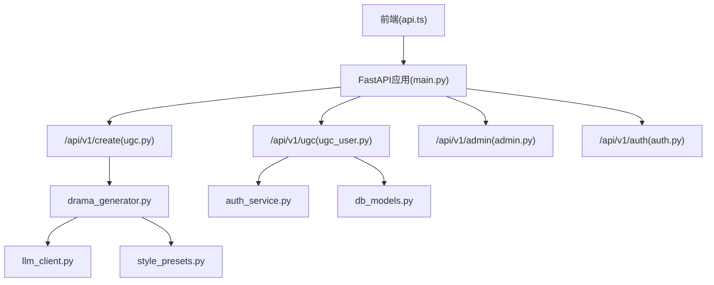
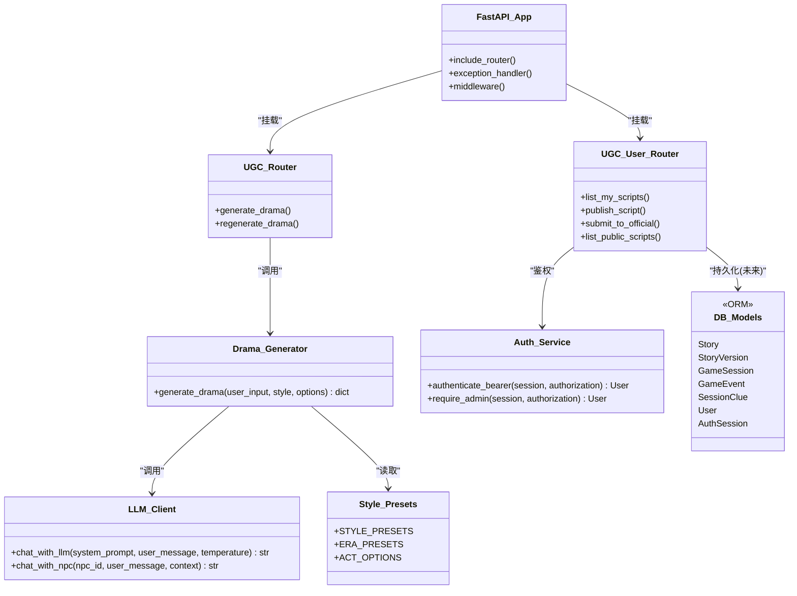
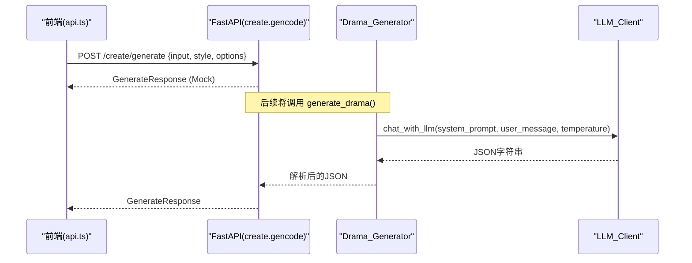
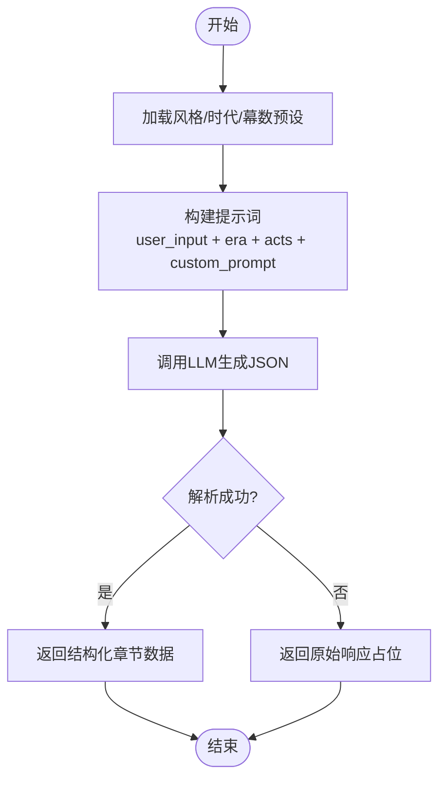
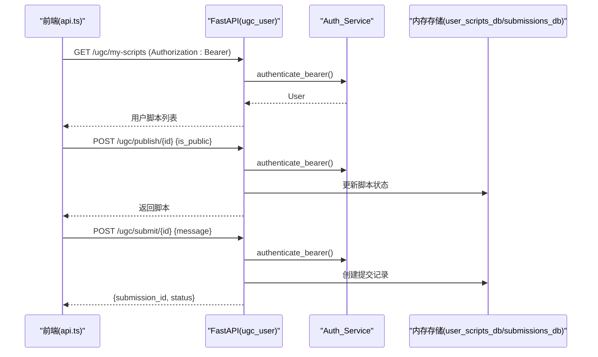
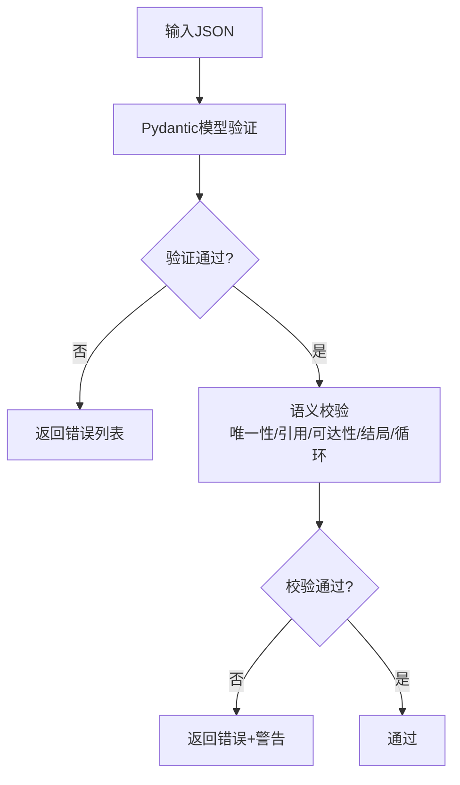
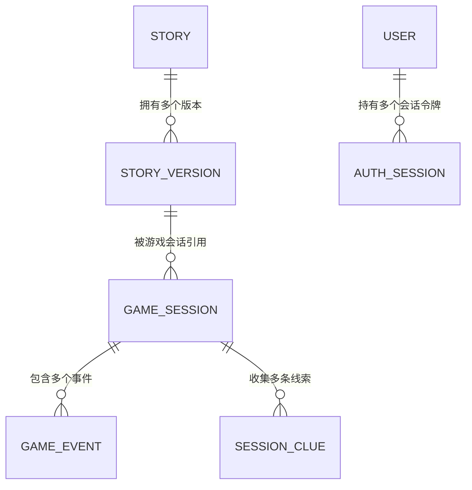
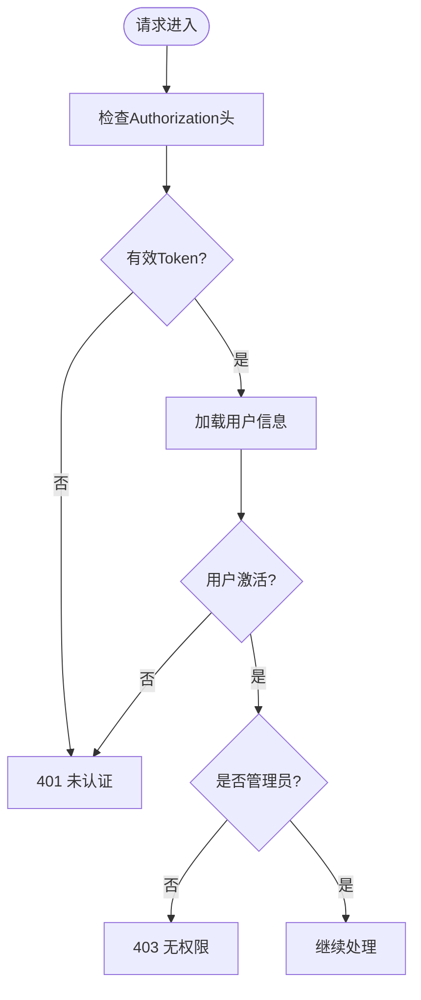
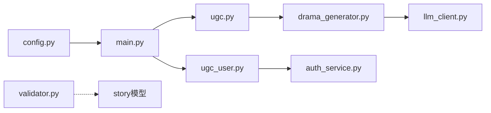

# UGC创作API接口

<cite>
**本文引用的文件**   
- [main.py](file://backend/app/main.py)
- [ugc.py](file://backend/app/api/ugc.py)
- [ugc_user.py](file://backend/app/api/ugc_user.py)
- [drama_generator.py](file://backend/app/ugc/drama_generator.py)
- [style_presets.py](file://backend/app/ugc/style_presets.py)
- [llm_client.py](file://backend/app/ai/llm_client.py)
- [prompt_templates.py](file://backend/app/ai/prompt_templates.py)
- [models.py](file://backend/app/models.py)
- [validator.py](file://backend/app/story/validator.py)
- [auth_service.py](file://backend/app/auth_service.py)
- [db_models.py](file://backend/app/db_models.py)
- [config.py](file://backend/app/config.py)
- [api.ts](file://frontend/src/lib/api.ts)
</cite>

## 目录
1. [简介](#简介)
2. [项目结构](#项目结构)
3. [核心组件](#核心组件)
4. [架构总览](#架构总览)
5. [详细组件分析](#详细组件分析)
6. [依赖关系分析](#依赖关系分析)
7. [性能考虑](#性能考虑)
8. [故障排查指南](#故障排查指南)
9. [结论](#结论)
10. [附录](#附录)

## 简介
本文件面向UGC（用户生成内容）创作API，覆盖以下目标：
- 用户内容生成、AI辅助创作与内容管理的RESTful API设计说明
- 剧本生成算法、风格预设系统与内容校验机制的深入解析
- 用户内容CRUD操作、版本控制与审核流程
- 完整创作工作流、AI集成模式与性能优化策略
- 创作者工具集成指南、批量处理方法与质量评估标准

本项目后端基于FastAPI，提供“创建”和“UGC”两大API域；前端通过统一的请求封装调用后端接口。当前“一句话生成短剧”为Mock实现，预留接入LLM（DeepSeek via SiliconFlow）的能力。

## 项目结构
- 后端入口与路由挂载：应用启动时注册各模块路由，统一前缀划分
- UGC创作域：/api/v1/create（生成/重生成）、/api/v1/ugc（发布、提交审核、公开列表）
- AI能力：LLM客户端、NPC对话模板、TTS服务（预留）
- 数据模型与校验：Pydantic模型、故事文档校验器
- 认证与权限：Bearer Token鉴权、管理员权限校验
- 数据库模型：故事版本化、游戏会话、事件与线索等

**图表来源** 
- [main.py:84-96](file://backend/app/main.py#L84-L96)
- [ugc.py:1-35](file://backend/app/api/ugc.py#L1-L35)
- [ugc_user.py:1-96](file://backend/app/api/ugc_user.py#L1-L96)
- [drama_generator.py:1-21](file://backend/app/ugc/drama_generator.py#L1-L21)
- [style_presets.py:1-15](file://backend/app/ugc/style_presets.py#L1-L15)
- [llm_client.py:1-32](file://backend/app/ai/llm_client.py#L1-L32)
- [auth_service.py:1-153](file://backend/app/auth_service.py#L1-L153)
- [db_models.py:1-160](file://backend/app/db_models.py#L1-L160)

**章节来源**
- [main.py:17-111](file://backend/app/main.py#L17-L111)

## 核心组件
- 生成接口：POST /api/v1/create/generate，接收输入、风格与选项，返回脚本ID、标题、章节、风格与时代
- 重生成接口：POST /api/v1/create/regenerate/{script_id}
- 用户脚本管理：GET /api/v1/ugc/my-scripts、POST /api/v1/ugc/publish/{script_id}、POST /api/v1/ugc/submit/{script_id}、GET /api/v1/ugc/public
- AI集成：LLM聊天、NPC对话、TTS（预留）
- 内容校验：故事JSON结构、语义约束、可达性与结局完整性检查
- 认证鉴权：Bearer Token校验、管理员权限校验

**章节来源**
- [ugc.py:8-34](file://backend/app/api/ugc.py#L8-L34)
- [ugc_user.py:37-95](file://backend/app/api/ugc_user.py#L37-L95)
- [drama_generator.py:5-21](file://backend/app/ugc/drama_generator.py#L5-L21)
- [llm_client.py:12-32](file://backend/app/ai/llm_client.py#L12-L32)
- [validator.py:40-190](file://backend/app/story/validator.py#L40-L190)
- [auth_service.py:100-130](file://backend/app/auth_service.py#L100-L130)

## 架构总览
整体采用分层架构：
- 表现层：FastAPI路由与请求/响应模型
- 业务层：UGC生成、用户脚本管理、审核提交
- 能力层：LLM客户端、提示词模板、风格预设
- 数据层：SQLAlchemy ORM模型、异步Session
- 横切关注点：CORS、异常处理、认证鉴权、配置管理

**图表来源** 
- [main.py:84-96](file://backend/app/main.py#L84-L96)
- [ugc.py:1-35](file://backend/app/api/ugc.py#L1-L35)
- [ugc_user.py:1-96](file://backend/app/api/ugc_user.py#L1-L96)
- [drama_generator.py:1-21](file://backend/app/ugc/drama_generator.py#L1-L21)
- [llm_client.py:1-32](file://backend/app/ai/llm_client.py#L1-L32)
- [style_presets.py:1-15](file://backend/app/ugc/style_presets.py#L1-L15)
- [auth_service.py:1-153](file://backend/app/auth_service.py#L1-L153)
- [db_models.py:1-160](file://backend/app/db_models.py#L1-L160)

## 详细组件分析

### 生成接口与AI集成
- 接口定义：POST /api/v1/create/generate
- 请求体：GenerateRequest（input、style、options）
- 响应体：GenerateResponse（script_id、title、chapters、style、era）
- 当前实现：Mock返回三幕示例章节，后续替换为LLM生成
- AI集成路径：drama_generator.py -> llm_client.py（SiliconFlow/DeepSeek）

**图表来源** 
- [ugc.py:8-29](file://backend/app/api/ugc.py#L8-L29)
- [drama_generator.py:5-21](file://backend/app/ugc/drama_generator.py#L5-L21)
- [llm_client.py:12-25](file://backend/app/ai/llm_client.py#L12-L25)
- [api.ts:132-140](file://frontend/src/lib/api.ts#L132-L140)

**章节来源**
- [ugc.py:8-34](file://backend/app/api/ugc.py#L8-L34)
- [drama_generator.py:5-21](file://backend/app/ugc/drama_generator.py#L5-L21)
- [llm_client.py:12-32](file://backend/app/ai/llm_client.py#L12-L32)
- [models.py:111-123](file://backend/app/models.py#L111-L123)

### 风格预设系统
- 风格枚举：悬疑推理、爱情故事、喜剧冒险、悲剧史诗
- 时代预设：清代、民国、现代、架空
- 幕数选项：3幕、5幕、7幕
- 使用方式：在生成时传入style与options（如era、acts、custom_prompt）

**图表来源** 
- [style_presets.py:2-14](file://backend/app/ugc/style_presets.py#L2-L14)
- [drama_generator.py:5-21](file://backend/app/ugc/drama_generator.py#L5-L21)

**章节来源**
- [style_presets.py:1-15](file://backend/app/ugc/style_presets.py#L1-L15)
- [drama_generator.py:5-21](file://backend/app/ugc/drama_generator.py#L5-L21)

### 用户内容CRUD与审核流程
- 列出我的脚本：GET /api/v1/ugc/my-scripts（需鉴权）
- 发布/私有化：POST /api/v1/ugc/publish/{script_id}（需鉴权，更新is_public与status）
- 提交官方审核：POST /api/v1/ugc/submit/{script_id}（需鉴权，仅公开脚本可提交）
- 公开列表：GET /api/v1/ugc/public（无需鉴权）
- 审核管理：admin子域提供提交列表、批准/拒绝接口

**图表来源** 
- [ugc_user.py:37-95](file://backend/app/api/ugc_user.py#L37-L95)
- [auth_service.py:100-130](file://backend/app/auth_service.py#L100-L130)
- [api.ts:142-154](file://frontend/src/lib/api.ts#L142-L154)

**章节来源**
- [ugc_user.py:37-95](file://backend/app/api/ugc_user.py#L37-L95)
- [auth_service.py:100-130](file://backend/app/auth_service.py#L100-L130)

### 内容校验机制
- 结构校验：Pydantic模型验证StoryDocument
- 语义校验：场景ID唯一性、跳转目标存在性、默认路由优先级、可达性与结局完整性
- 媒体占位符控制：允许/禁止placeholder媒体
- 循环检测：RouterScene链路的环检测

**图表来源** 
- [validator.py:40-190](file://backend/app/story/validator.py#L40-L190)

**章节来源**
- [validator.py:40-190](file://backend/app/story/validator.py#L40-L190)

### 版本控制与数据模型
- 故事与版本：Story与StoryVersion关联，支持active_version_id指向活跃版本
- 游戏会话与事件：GameSession与GameEvent记录交互序列
- 线索收集：SessionClue记录获取时间与来源事件
- 用户与会话：User与AuthSession管理认证令牌与过期时间

**图表来源** 
- [db_models.py:24-71](file://backend/app/db_models.py#L24-L71)
- [db_models.py:74-160](file://backend/app/db_models.py#L74-L160)

**章节来源**
- [db_models.py:24-71](file://backend/app/db_models.py#L24-L71)
- [db_models.py:74-160](file://backend/app/db_models.py#L74-L160)

### 认证与权限
- 用户名/密码校验：长度与格式限制
- Bearer Token鉴权：校验token有效性、过期时间、用户激活状态
- 管理员权限：require_admin确保角色为admin

**图表来源** 
- [auth_service.py:100-130](file://backend/app/auth_service.py#L100-L130)

**章节来源**
- [auth_service.py:100-130](file://backend/app/auth_service.py#L100-L130)

## 依赖关系分析
- 路由依赖：main.py集中挂载各子路由，形成清晰的API边界
- 生成链路：ugc.py -> drama_generator.py -> llm_client.py
- 用户脚本：ugc_user.py依赖auth_service进行鉴权，当前使用内存存储，可扩展至数据库
- 校验器：validator.py独立于业务逻辑，提供通用校验能力
- 配置：config.py提供运行时配置，包括CORS、数据库URL、演示数据开关等

**图表来源** 
- [main.py:84-96](file://backend/app/main.py#L84-L96)
- [ugc.py:1-35](file://backend/app/api/ugc.py#L1-L35)
- [drama_generator.py:1-21](file://backend/app/ugc/drama_generator.py#L1-L21)
- [llm_client.py:1-32](file://backend/app/ai/llm_client.py#L1-L32)
- [auth_service.py:1-153](file://backend/app/auth_service.py#L1-L153)
- [config.py:1-77](file://backend/app/config.py#L1-L77)

**章节来源**
- [main.py:84-96](file://backend/app/main.py#L84-L96)
- [config.py:1-77](file://backend/app/config.py#L1-L77)

## 性能考虑
- 生成接口当前为Mock，延迟极低；接入LLM后建议引入缓存与重试机制
- LLM调用参数temperature与max_tokens可调，避免过长响应导致超时
- CORS与异常处理器已启用，减少跨域与校验失败带来的额外开销
- 内存存储适合开发环境，生产应迁移至数据库并添加索引与分页

[本节为通用指导，不直接分析具体文件]

## 故障排查指南
- 请求校验失败：查看全局异常处理器返回的错误结构，定位字段与类型问题
- LLM调用失败：检查环境变量SILICONFLOW_API_KEY与BASE_URL，确认网络连通
- 鉴权失败：确认Authorization头格式为Bearer <token>，且token未过期
- 内容校验错误：根据validator返回的错误码与路径定位JSON结构问题

**章节来源**
- [main.py:51-74](file://backend/app/main.py#L51-L74)
- [llm_client.py:12-25](file://backend/app/ai/llm_client.py#L12-L25)
- [auth_service.py:100-130](file://backend/app/auth_service.py#L100-L130)
- [validator.py:40-190](file://backend/app/story/validator.py#L40-L190)

## 结论
本UGC创作API提供了从生成到发布、审核的完整闭环，结合风格预设与AI能力，支持快速产出互动短剧。当前生成接口为Mock，预留LLM集成路径；用户脚本管理采用内存存储，便于开发调试。建议在生产环境中完善数据库持久化、增加缓存与限流、强化内容校验与审核流程，以提升稳定性与安全性。

[本节为总结，不直接分析具体文件]

## 附录
- 前端集成要点：使用api.ts中的ugcApi方法调用后端接口，自动附加Bearer Token
- 批量处理建议：对生成任务引入队列与异步处理，避免阻塞主线程
- 质量评估标准：基于validator的错误率、可达性覆盖率、结局多样性、用户反馈评分

**章节来源**
- [api.ts:132-154](file://frontend/src/lib/api.ts#L132-L154)
- [validator.py:40-190](file://backend/app/story/validator.py#L40-L190)