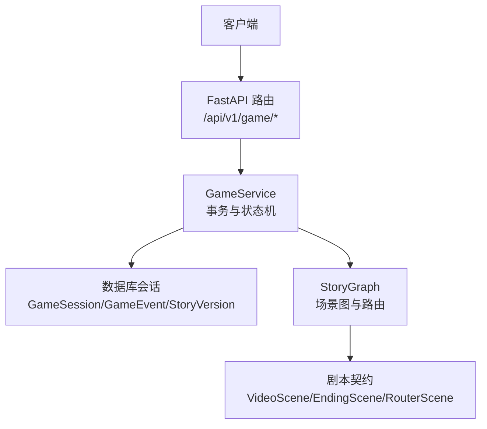
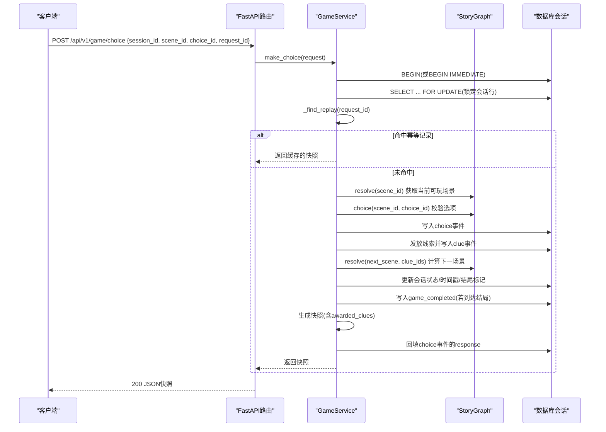
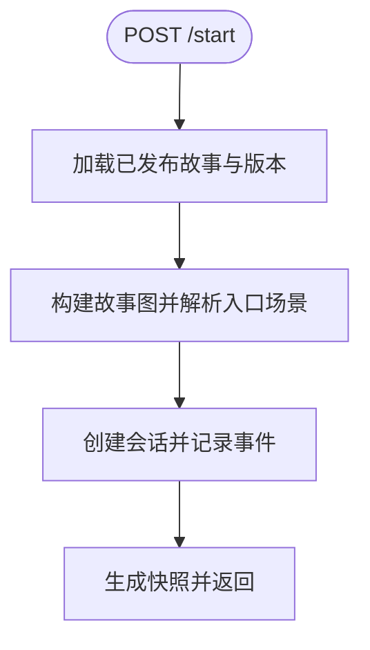
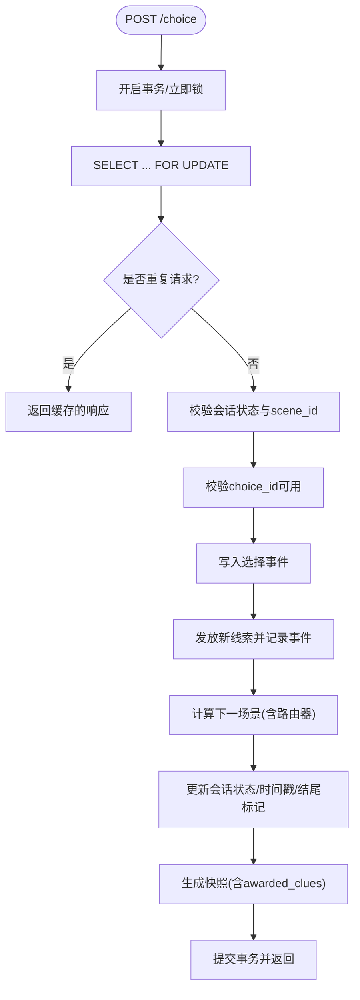
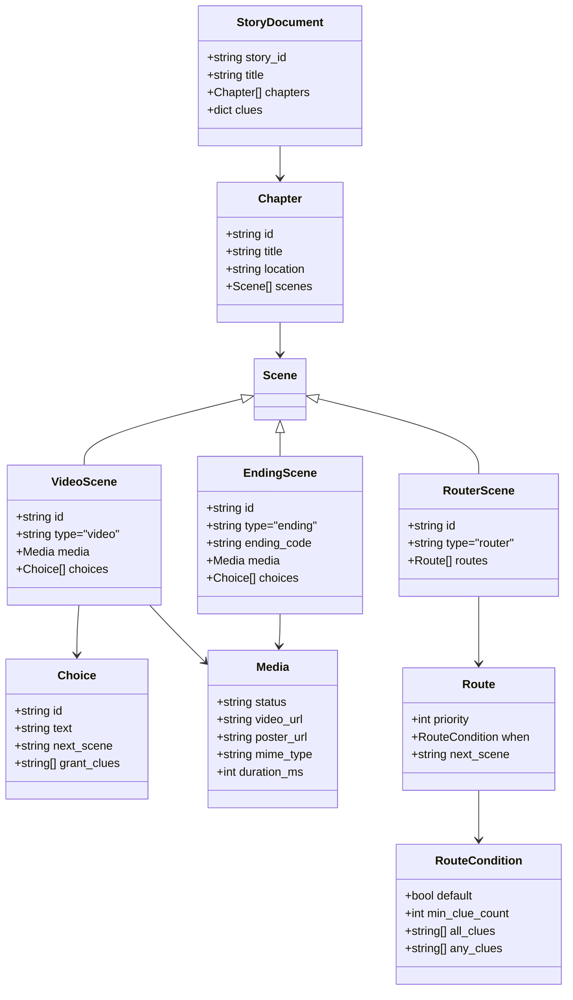
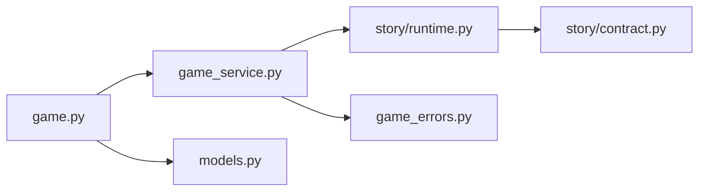

# 游戏API接口

<cite>
**本文引用的文件**   
- [backend/app/api/game.py](file://backend/app/api/game.py)
- [backend/app/models.py](file://backend/app/models.py)
- [backend/app/game_service.py](file://backend/app/game_service.py)
- [backend/app/story/runtime.py](file://backend/app/story/runtime.py)
- [backend/app/story/contract.py](file://backend/app/story/contract.py)
- [backend/app/game_errors.py](file://backend/app/game_errors.py)
- [backend/tests/test_game_api.py](file://backend/tests/test_game_api.py)
- [frontend/src/lib/api.ts](file://frontend/src/lib/api.ts)
- [backend/app/story/scripts/macau_mystery_demo.json](file://backend/app/story/scripts/macau_mystery_demo.json)
</cite>

## 目录
1. [简介](#简介)
2. [项目结构](#项目结构)
3. [核心组件](#核心组件)
4. [架构总览](#架构总览)
5. [详细组件分析](#详细组件分析)
6. [依赖关系分析](#依赖关系分析)
7. [性能考虑](#性能考虑)
8. [故障排查指南](#故障排查指南)
9. [结论](#结论)
10. [附录](#附录)

## 简介
本文件为“澳门悬疑”游戏的RESTful API文档，聚焦于游戏会话管理、选择处理与状态查询。文档涵盖：
- REST端点设计与请求/响应模型（GameStartRequest、ChoiceRequest、GameState等）
- 字段定义与校验规则
- 游戏启动流程、分支选择逻辑、状态同步机制
- 完整的请求/响应示例、错误码说明与异常处理策略
- 客户端集成指南、性能优化建议与调试方法

## 项目结构
后端采用FastAPI提供REST接口，业务逻辑集中在服务层，数据持久化通过SQLAlchemy异步会话完成；故事内容以JSON脚本驱动，运行时由图解析器进行场景跳转与路由计算。前端通过统一的API封装调用后端接口。

**图表来源** 
- [backend/app/api/game.py:15-36](file://backend/app/api/game.py#L15-L36)
- [backend/app/game_service.py:31-193](file://backend/app/game_service.py#L31-L193)
- [backend/app/story/runtime.py:22-80](file://backend/app/story/runtime.py#L22-L80)
- [backend/app/story/contract.py:76-128](file://backend/app/story/contract.py#L76-L128)

**章节来源**
- [backend/app/api/game.py:1-37](file://backend/app/api/game.py#L1-L37)
- [backend/app/game_service.py:1-386](file://backend/app/game_service.py#L1-L386)
- [backend/app/story/runtime.py:1-80](file://backend/app/story/runtime.py#L1-L80)
- [backend/app/story/contract.py:1-128](file://backend/app/story/contract.py#L1-L128)

## 核心组件
- 路由层：暴露三个REST端点，负责参数绑定与返回模型序列化
- 服务层：实现事务性会话管理、选择推进、快照生成、幂等重放
- 运行时：基于验证后的故事文档构建场景图，支持视频/结局/路由器场景与条件路由
- 数据模型：Pydantic严格模型，统一校验与序列化

**章节来源**
- [backend/app/api/game.py:15-36](file://backend/app/api/game.py#L15-L36)
- [backend/app/game_service.py:31-193](file://backend/app/game_service.py#L31-L193)
- [backend/app/story/runtime.py:22-80](file://backend/app/story/runtime.py#L22-L80)
- [backend/app/models.py:12-92](file://backend/app/models.py#L12-L92)

## 架构总览
下图展示一次“选择”请求的完整调用链，包括并发控制、幂等重放、线索发放与状态更新。

**图表来源** 
- [backend/app/api/game.py:23-28](file://backend/app/api/game.py#L23-L28)
- [backend/app/game_service.py:70-193](file://backend/app/game_service.py#L70-L193)
- [backend/app/story/runtime.py:37-61](file://backend/app/story/runtime.py#L37-L61)

## 详细组件分析

### REST端点定义
- POST /api/v1/game/start
  - 请求体：GameStartRequest
  - 响应：GameStartResponse（即GameSnapshot）
  - 行为：激活已发布的剧本版本，创建会话，记录初始事件，返回首个场景快照
- POST /api/v1/game/choice
  - 请求体：ChoiceRequest
  - 响应：ChoiceResponse（即GameSnapshot）
  - 行为：在事务中推进选择、发放线索、计算下一场景、幂等重放
- GET /api/v1/game/state/{session_id}
  - 路径参数：session_id(UUID)
  - 响应：GameState（即GameSnapshot）
  - 行为：读取会话当前状态与场景，不包含awarded_clues

**章节来源**
- [backend/app/api/game.py:15-36](file://backend/app/api/game.py#L15-L36)

### 数据模型与校验规则
- GameStartRequest
  - script_id：字符串，长度2-64，仅允许小写字母、数字与下划线，且首字符为字母
- ChoiceRequest
  - session_id：UUID
  - scene_id：字符串，长度2-64，同上命名规范
  - choice_id：字符串，长度2-64，同上命名规范
  - request_id：UUID，用于幂等重放
- GameState/ChoiceResponse/GameStartResponse
  - 均为GameSnapshot别名，包含会话ID、状态、故事信息、当前场景、线索集合、进度、可选的awarded_clues与ending
- 其他相关模型
  - GameMediaResponse：媒体元数据（视频URL、海报URL、MIME类型、时长）
  - GamePreloadResponse：预加载目标场景及媒体
  - GameChoiceResponse：选项文本与预加载信息
  - GameChapterResponse：章节标题与地点
  - GameSceneResponse：场景类型(video/ending)、所属章节、媒体与选项列表
  - GameClueResponse：线索标题、描述、图标、获得时间
  - GameProgressResponse：当前章节与总章节数
  - GameEndingResponse：结局ID与代码

**章节来源**
- [backend/app/models.py:12-92](file://backend/app/models.py#L12-L92)

### 游戏启动流程
- 校验并获取已发布的故事与版本
- 从故事文档构建图，解析入口场景
- 创建会话，记录“游戏开始”事件
- 返回首个场景快照（包含选项预加载信息）

**图表来源** 
- [backend/app/game_service.py:35-61](file://backend/app/game_service.py#L35-L61)

**章节来源**
- [backend/app/game_service.py:35-61](file://backend/app/game_service.py#L35-L61)

### 选择分支处理逻辑
- 事务内锁定会话行，避免并发冲突
- 检查会话状态与当前场景一致性
- 校验选择的可用性，记录选择事件
- 根据选择的grant_clues发放线索（去重）
- 计算下一场景（可能经过路由器场景的条件路由）
- 若到达结局，更新会话状态为completed并记录结束事件
- 支持幂等重放：相同request_id的请求直接返回历史响应

**图表来源** 
- [backend/app/game_service.py:70-193](file://backend/app/game_service.py#L70-L193)
- [backend/app/story/runtime.py:37-61](file://backend/app/story/runtime.py#L37-L61)

**章节来源**
- [backend/app/game_service.py:70-193](file://backend/app/game_service.py#L70-L193)
- [backend/app/story/runtime.py:37-61](file://backend/app/story/runtime.py#L37-L61)

### 状态同步机制
- 每次选择推进后，客户端可通过GET /state/{session_id}拉取最新快照
- 快照包含当前场景、线索集合与进度，便于UI同步
- 幂等重放确保重复提交不会导致状态不一致

**章节来源**
- [backend/app/game_service.py:63-68](file://backend/app/game_service.py#L63-L68)
- [backend/tests/test_game_api.py:129-149](file://backend/tests/test_game_api.py#L129-L149)

### 类关系图（运行时与模型）

**图表来源** 
- [backend/app/story/contract.py:76-128](file://backend/app/story/contract.py#L76-L128)

## 依赖关系分析
- 路由层依赖服务层，服务层依赖数据库会话与运行时图解析器
- 运行时图解析器依赖严格的剧本契约模型
- 错误处理通过自定义异常与全局异常处理器统一输出

**图表来源** 
- [backend/app/api/game.py:1-37](file://backend/app/api/game.py#L1-L37)
- [backend/app/game_service.py:1-386](file://backend/app/game_service.py#L1-L386)
- [backend/app/story/runtime.py:1-80](file://backend/app/story/runtime.py#L1-L80)
- [backend/app/story/contract.py:1-128](file://backend/app/story/contract.py#L1-L128)
- [backend/app/game_errors.py:1-20](file://backend/app/game_errors.py#L1-L20)
- [backend/app/models.py:1-146](file://backend/app/models.py#L1-L146)

**章节来源**
- [backend/app/api/game.py:1-37](file://backend/app/api/game.py#L1-L37)
- [backend/app/game_service.py:1-386](file://backend/app/game_service.py#L1-L386)
- [backend/app/story/runtime.py:1-80](file://backend/app/story/runtime.py#L1-L80)
- [backend/app/story/contract.py:1-128](file://backend/app/story/contract.py#L1-L128)
- [backend/app/game_errors.py:1-20](file://backend/app/game_errors.py#L1-L20)
- [backend/app/models.py:1-146](file://backend/app/models.py#L1-L146)

## 性能考虑
- 并发安全：选择处理使用FOR UPDATE锁定会话行，SQLite使用BEGIN IMMEDIATE保证原子推进
- 幂等重放：通过request_id去重，避免重复推进与重复发放线索
- 预加载：选项返回preload信息，客户端可提前加载下一场景媒体，减少等待
- 媒体就绪检查：生产环境强制媒体ready，避免播放失败
- 数据库索引：建议对GameEvent(session_id, request_id)建立唯一索引以提升幂等查找效率

[本节为通用指导，不直接分析具体文件]

## 故障排查指南
- 常见错误码与含义
  - 404 SESSION_NOT_FOUND：会话不存在
  - 409 SESSION_COMPLETED：会话已结束，不可继续
  - 409 SESSION_NOT_ACTIVE：会话当前不可继续
  - 409 STALE_SCENE：提交的场景不是当前场景
  - 409 CHOICE_NOT_AVAILABLE：选项不属于当前场景
  - 409 IDEMPOTENCY_CONFLICT：request_id已用于不同的选择请求
  - 422 VALIDATION_ERROR：请求字段、类型或格式不合法
  - 503 STORY_NOT_READY：故事尚未准备完成（媒体未就绪或版本不可用）
  - 500 STORY_DATA_CORRUPTED：已发布剧情数据异常
- 异常处理策略
  - 自定义GameError被全局异常处理器捕获，统一输出error信封
  - 请求校验错误在/game路由下返回标准化VALIDATION_ERROR
- 调试建议
  - 使用测试用例中的端到端流程验证启动、选择、合并、结局与重放
  - 通过GET /state/{session_id}拉取快照对比状态变化
  - 检查数据库事件表确认事件顺序与payload

**章节来源**
- [backend/app/game_errors.py:7-20](file://backend/app/game_errors.py#L7-L20)
- [backend/app/main.py:36-74](file://backend/app/main.py#L36-L74)
- [backend/tests/test_game_api.py:172-184](file://backend/tests/test_game_api.py#L172-L184)
- [backend/tests/test_game_api.py:129-149](file://backend/tests/test_game_api.py#L129-L149)

## 结论
该API以强约束的数据模型与事务性服务层为核心，结合运行时图解析与幂等重放机制，提供了稳定、可扩展的游戏会话管理能力。通过预加载与媒体就绪检查，提升了用户体验与系统健壮性。

[本节为总结性内容，不直接分析具体文件]

## 附录

### REST端点与请求/响应示例

- 启动游戏
  - 请求
    - 方法：POST
    - 路径：/api/v1/game/start
    - 请求体：{ "script_id": "macau_mystery_demo" }
  - 响应（201）
    - 状态：active
    - 场景：scene_start
    - 选项：inspect_letter、leave_quietly（均含preload）
- 做出选择
  - 请求
    - 方法：POST
    - 路径：/api/v1/game/choice
    - 请求体：{ "session_id": "<uuid>", "scene_id": "scene_start", "choice_id": "inspect_letter", "request_id": "<uuid>" }
  - 响应（200）
    - 状态：active
    - 场景：scene_letter
    - awarded_clues：包含letter_fragment
- 查询状态
  - 方法：GET
  - 路径：/api/v1/game/state/{session_id}
  - 响应（200）
    - 快照：不含awarded_clues，但包含clues、progress与scene

**章节来源**
- [backend/tests/test_game_api.py:72-88](file://backend/tests/test_game_api.py#L72-L88)
- [backend/tests/test_game_api.py:90-127](file://backend/tests/test_game_api.py#L90-L127)
- [backend/tests/test_game_api.py:129-149](file://backend/tests/test_game_api.py#L129-L149)

### 客户端集成指南（前端）
- 基础封装
  - 统一请求函数自动附加Authorization头
  - 错误时抛出异常，需在上层捕获并显示用户提示
- 游戏API方法
  - start(scriptId)：返回GameSnapshot
  - makeChoice(sessionId, sceneId, choiceId)：返回GameSnapshot，自动生成request_id
  - getState(sessionId)：返回GameSnapshot
- 类型定义
  - 前端定义了与后端一致的TypeScript接口，便于类型安全

**章节来源**
- [frontend/src/lib/api.ts:1-109](file://frontend/src/lib/api.ts#L1-L109)

### 剧本结构与示例
- 最小演示剧本包含一个章节，多个视频场景、路由器场景与两个结局
- 通过grant_clues与all_clues条件实现分支汇合与多结局

**章节来源**
- [backend/app/story/scripts/macau_mystery_demo.json:1-149](file://backend/app/story/scripts/macau_mystery_demo.json#L1-L149)