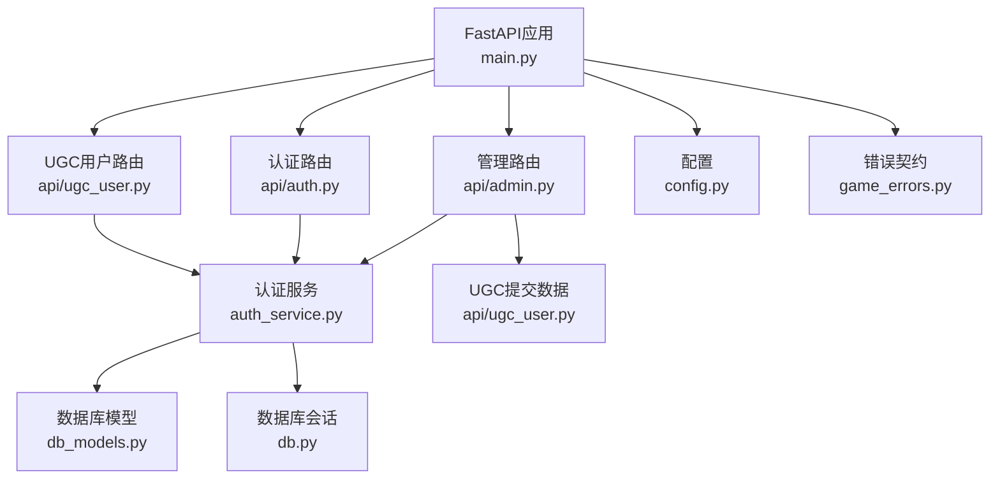
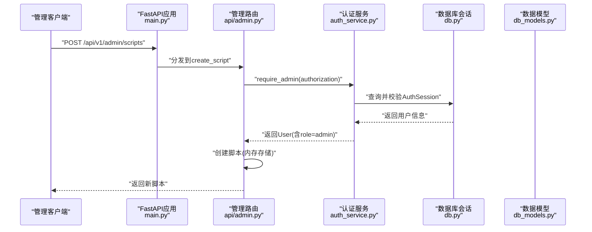
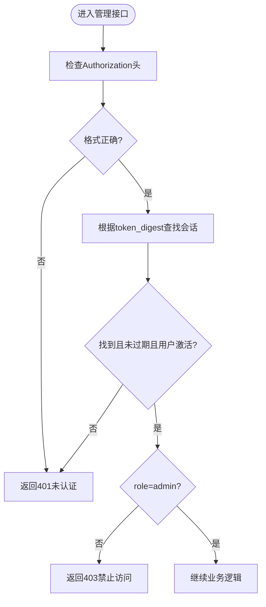
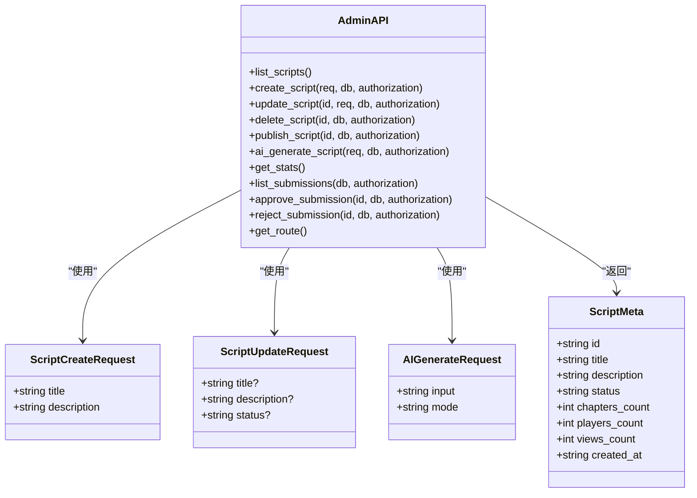
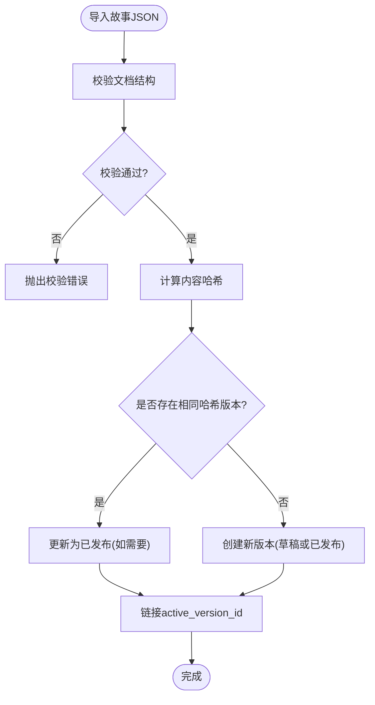
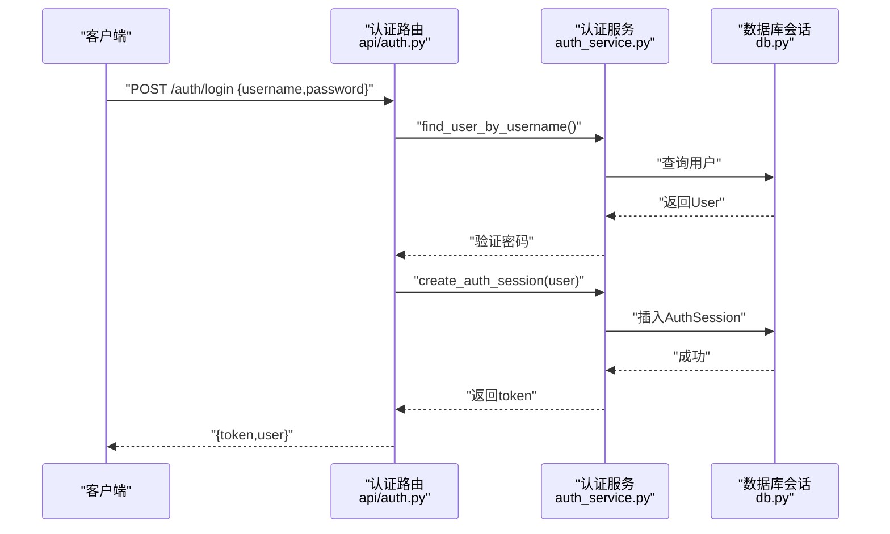
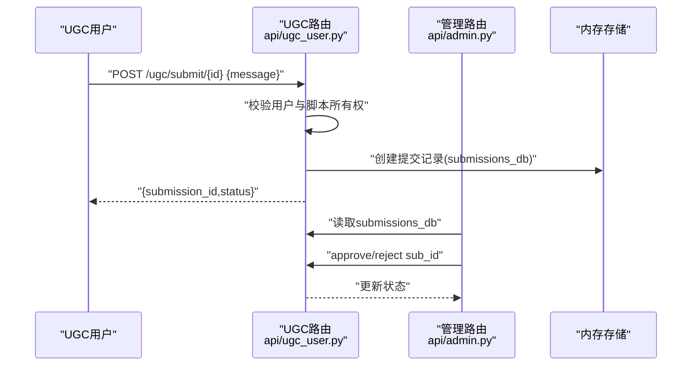
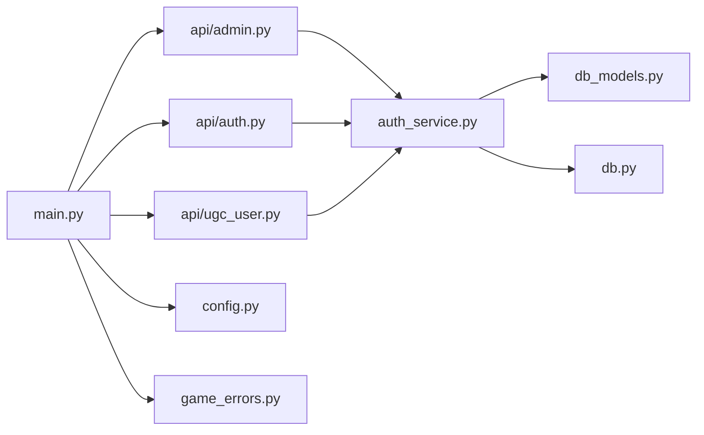

# 管理API接口

<cite>
**本文引用的文件**   
- [main.py](file://backend/app/main.py)
- [admin.py](file://backend/app/api/admin.py)
- [auth_service.py](file://backend/app/auth_service.py)
- [config.py](file://backend/app/config.py)
- [db_models.py](file://backend/app/db_models.py)
- [db.py](file://backend/app/db.py)
- [game_errors.py](file://backend/app/game_errors.py)
- [auth.py](file://backend/app/api/auth.py)
- [ugc_user.py](file://backend/app/api/ugc_user.py)
- [script_loader.py](file://backend/app/story/script_loader.py)
- [importer.py](file://backend/app/story/importer.py)
- [test_auth_api.py](file://backend/tests/test_auth_api.py)
</cite>

## 目录
1. [简介](#简介)
2. [项目结构](#项目结构)
3. [核心组件](#核心组件)
4. [架构总览](#架构总览)
5. [详细组件分析](#详细组件分析)
6. [依赖关系分析](#依赖关系分析)
7. [性能考虑](#性能考虑)
8. [故障排除指南](#故障排除指南)
9. [结论](#结论)
10. [附录](#附录)

## 简介
本文件面向“澳门悬疑游戏”平台的管理端API，系统性说明管理员认证、剧本管理与系统配置的RESTful接口设计。重点覆盖：
- 管理员权限验证与角色控制（基于Bearer Token的RBAC）
- 操作审计与错误响应规范
- 剧本CRUD、版本管理与发布流程
- 安全策略、监控日志与可观测性建议
- 管理后台集成指南、批量操作方法与常见问题排查

## 项目结构
后端采用FastAPI模块化路由组织，管理相关能力集中在以下模块：
- 应用入口与全局异常处理、CORS、健康检查：main.py
- 管理API路由与脚本管理、统计、提交审核、路线配置：api/admin.py
- 用户认证与会话管理、角色校验：api/auth.py、auth_service.py
- 数据库模型（故事、版本、会话、事件、用户、认证会话）：db_models.py
- 异步数据库引擎与Session依赖：db.py
- 运行时配置与环境变量：config.py
- 错误契约：game_errors.py
- 剧本导入与版本化：story/importer.py、story/script_loader.py
- UGC用户侧脚本与提交审核数据：api/ugc_user.py

**图表来源** 
- [main.py:76-96](file://backend/app/main.py#L76-L96)
- [admin.py:1-20](file://backend/app/api/admin.py#L1-L20)
- [auth.py:1-25](file://backend/app/api/auth.py#L1-L25)
- [ugc_user.py:1-20](file://backend/app/api/ugc_user.py#L1-L20)
- [auth_service.py:100-130](file://backend/app/auth_service.py#L100-L130)
- [db_models.py:128-160](file://backend/app/db_models.py#L128-L160)
- [db.py:26-33](file://backend/app/db.py#L26-L33)
- [config.py:38-77](file://backend/app/config.py#L38-L77)
- [game_errors.py:1-20](file://backend/app/game_errors.py#L1-L20)

**章节来源**
- [main.py:17-111](file://backend/app/main.py#L17-L111)
- [admin.py:1-218](file://backend/app/api/admin.py#L1-L218)
- [auth_service.py:1-153](file://backend/app/auth_service.py#L1-L153)
- [config.py:1-77](file://backend/app/config.py#L1-L77)
- [db_models.py:1-160](file://backend/app/db_models.py#L1-L160)
- [db.py:1-42](file://backend/app/db.py#L1-L42)
- [game_errors.py:1-20](file://backend/app/game_errors.py#L1-L20)

## 核心组件
- 应用生命周期与异常处理：统一GameError与请求校验错误格式，便于前端一致解析
- 认证与会话：基于Bearer Token持久化会话，支持过期校验与活跃状态
- 角色控制：require_admin强制admin角色访问管理接口
- 剧本管理：内存存储的CRUD与发布切换，AI生成草稿，统计汇总
- 提交审核：UGC用户提交至官方审核，管理员批准/拒绝
- 配置与健康检查：环境变量驱动行为，健康探针检测数据库可用性

**章节来源**
- [main.py:38-74](file://backend/app/main.py#L38-L74)
- [auth_service.py:100-130](file://backend/app/auth_service.py#L100-L130)
- [admin.py:66-122](file://backend/app/api/admin.py#L66-L122)
- [ugc_user.py:56-77](file://backend/app/api/ugc_user.py#L56-L77)
- [config.py:56-77](file://backend/app/config.py#L56-L77)
- [db.py:35-42](file://backend/app/db.py#L35-L42)

## 架构总览
管理API通过FastAPI路由注册，所有管理端点位于/api/v1/admin前缀下，受统一的认证中间件与异常处理器保护。

**图表来源** 
- [main.py:84-96](file://backend/app/main.py#L84-L96)
- [admin.py:75-91](file://backend/app/api/admin.py#L75-L91)
- [auth_service.py:100-130](file://backend/app/auth_service.py#L100-L130)
- [db.py:30-33](file://backend/app/db.py#L30-L33)
- [db_models.py:128-160](file://backend/app/db_models.py#L128-L160)

## 详细组件分析

### 管理员认证与权限控制
- 认证方式：Authorization: Bearer <token>
- 令牌校验：authenticate_bearer从数据库校验token有效性、是否过期、用户是否激活
- 角色控制：require_admin确保当前用户role为admin，否则返回403
- 开发环境兼容：admin/auth.py提供简单ADMIN_TOKEN校验（仅用于特定场景），但管理API主要使用基于用户的Bearer Token

**图表来源** 
- [auth_service.py:100-130](file://backend/app/auth_service.py#L100-L130)
- [admin.py:66-68](file://backend/app/api/admin.py#L66-L68)

**章节来源**
- [auth_service.py:100-130](file://backend/app/auth_service.py#L100-L130)
- [admin.py:66-68](file://backend/app/api/admin.py#L66-L68)
- [auth.py:90-96](file://backend/app/api/auth.py#L90-L96)

### 剧本管理API（CRUD与发布）
- 列表：GET /api/v1/admin/scripts
- 创建：POST /api/v1/admin/scripts（需admin）
- 更新：PUT /api/v1/admin/scripts/{script_id}（需admin）
- 删除：DELETE /api/v1/admin/scripts/{script_id}（需admin）
- 发布切换：POST /api/v1/admin/scripts/{script_id}/publish（需admin）
- AI生成：POST /api/v1/admin/scripts/ai-generate（需admin）
- 统计：GET /api/v1/admin/stats
- 提交审核：GET /api/v1/admin/submissions；批准/拒绝：POST /api/v1/admin/submissions/{sub_id}/approve|reject
- 路线配置：GET /api/v1/admin/route

注意：当前实现使用内存字典scripts_db与submissions_db进行演示，生产应替换为数据库持久化。

**图表来源** 
- [admin.py:42-64](file://backend/app/api/admin.py#L42-L64)
- [admin.py:71-122](file://backend/app/api/admin.py#L71-L122)
- [admin.py:125-168](file://backend/app/api/admin.py#L125-L168)
- [admin.py:171-218](file://backend/app/api/admin.py#L171-L218)

**章节来源**
- [admin.py:71-122](file://backend/app/api/admin.py#L71-L122)
- [admin.py:125-168](file://backend/app/api/admin.py#L125-L168)
- [admin.py:171-218](file://backend/app/api/admin.py#L171-L218)

### 版本管理与发布流程（故事导入）
- 导入接口：import_story_data/import_story_file
- 版本化：StoryVersion记录content_hash、version_number、status、published_at
- 幂等性：相同content_hash不重复创建版本，可直接标记为已发布
- 发布：将active_version_id指向新版本，并更新Story.status

**图表来源** 
- [importer.py:59-135](file://backend/app/story/importer.py#L59-L135)
- [db_models.py:24-71](file://backend/app/db_models.py#L24-L71)

**章节来源**
- [importer.py:59-135](file://backend/app/story/importer.py#L59-L135)
- [db_models.py:24-71](file://backend/app/db_models.py#L24-L71)

### 用户认证与会话管理
- 登录：POST /api/v1/auth/login
- 注册：POST /api/v1/auth/register
- 获取当前用户：GET /api/v1/auth/me
- 会话持久化：AuthSession表记录token_digest、expires_at、last_used_at

**图表来源** 
- [auth.py:64-72](file://backend/app/api/auth.py#L64-L72)
- [auth_service.py:83-97](file://backend/app/auth_service.py#L83-L97)
- [db.py:30-33](file://backend/app/db.py#L30-L33)

**章节来源**
- [auth.py:64-96](file://backend/app/api/auth.py#L64-L96)
- [auth_service.py:83-97](file://backend/app/auth_service.py#L83-L97)
- [db_models.py:147-160](file://backend/app/db_models.py#L147-L160)

### UGC用户脚本与提交审核
- 我的脚本：GET /api/v1/ugc/my-scripts（需认证）
- 发布/私有：POST /api/v1/ugc/publish/{script_id}（需认证）
- 提交官方审核：POST /api/v1/ugc/submit/{script_id}（需认证，脚本必须公开）
- 公开脚本列表：GET /api/v1/ugc/public
- 管理端审核：GET /api/v1/admin/submissions；批准/拒绝

**图表来源** 
- [ugc_user.py:56-77](file://backend/app/api/ugc_user.py#L56-L77)
- [admin.py:185-209](file://backend/app/api/admin.py#L185-L209)

**章节来源**
- [ugc_user.py:37-96](file://backend/app/api/ugc_user.py#L37-L96)
- [admin.py:185-209](file://backend/app/api/admin.py#L185-L209)

### 系统配置与健康检查
- 健康检查：GET /api/v1/health（检查数据库连接）
- 配置项：DATABASE_URL、CORS_ORIGINS、APP_ENV、BOOTSTRAP_DEMO_STORY、BOOTSTRAP_DEMO_USERS、AUTH_TOKEN_TTL_HOURS、DEMO_*_USERNAME/PASSWORD

**章节来源**
- [main.py:98-105](file://backend/app/main.py#L98-L105)
- [config.py:56-77](file://backend/app/config.py#L56-L77)
- [db.py:35-42](file://backend/app/db.py#L35-L42)

## 依赖关系分析
- 路由层依赖认证服务，认证服务依赖数据库会话与模型
- 管理路由依赖UGC提交数据（内存字典）
- 应用启动时加载各路由，注册异常处理器与CORS

**图表来源** 
- [main.py:84-96](file://backend/app/main.py#L84-L96)
- [admin.py:1-20](file://backend/app/api/admin.py#L1-L20)
- [auth.py:1-25](file://backend/app/api/auth.py#L1-L25)
- [ugc_user.py:1-20](file://backend/app/api/ugc_user.py#L1-L20)
- [auth_service.py:100-130](file://backend/app/auth_service.py#L100-L130)
- [db_models.py:128-160](file://backend/app/db_models.py#L128-L160)
- [db.py:26-33](file://backend/app/db.py#L26-L33)
- [config.py:56-77](file://backend/app/config.py#L56-L77)
- [game_errors.py:1-20](file://backend/app/game_errors.py#L1-L20)

**章节来源**
- [main.py:84-96](file://backend/app/main.py#L84-L96)
- [auth_service.py:100-130](file://backend/app/auth_service.py#L100-L130)

## 性能考虑
- 数据库连接池：使用SQLAlchemy异步引擎与pool_pre_ping，SQLite启用外键与busy_timeout
- 会话复用：AsyncSession在请求内复用，避免频繁创建销毁
- 内存存储限制：当前admin与ugc使用dict存储，适合演示，生产应迁移至数据库以支持并发与持久化
- 缓存策略：配置使用lru_cache，减少重复解析
- 健康检查：快速探测数据库可用性，避免无效请求

[本节为通用指导，无需引用具体文件]

## 故障排除指南
- 401未认证：检查Authorization头是否为Bearer格式，token是否有效且未过期
- 403禁止访问：确认用户role为admin；测试用例覆盖了非admin访问管理接口的情况
- 404资源不存在：脚本ID或提交ID不存在
- 422请求校验失败：检查字段类型与格式，错误体包含errors数组
- 503服务降级：健康检查返回degraded表示数据库不可用，检查DATABASE_URL与迁移状态

**章节来源**
- [test_auth_api.py:145-173](file://backend/tests/test_auth_api.py#L145-L173)
- [main.py:51-74](file://backend/app/main.py#L51-L74)
- [main.py:98-105](file://backend/app/main.py#L98-L105)

## 结论
管理API围绕Bearer Token认证与RBAC构建，提供完整的剧本CRUD、版本化管理、UGC审核与系统配置能力。当前实现以内存存储为主，便于演示与快速迭代；生产环境建议迁移至数据库持久化，增强并发与可靠性。统一异常处理与健康检查提升了可观测性与稳定性。

[本节为总结，无需引用具体文件]

## 附录

### 管理后台集成指南
- 登录流程：调用/api/v1/auth/login获取token，后续请求携带Authorization: Bearer <token>
- 管理端点：所有/api/v1/admin/*需admin角色
- 前端示例：参考frontend/src/lib/api.ts中的adminApi与authApi调用方式

**章节来源**
- [auth.py:64-96](file://backend/app/api/auth.py#L64-L96)
- [admin.py:71-122](file://backend/app/api/admin.py#L71-L122)

### 批量操作方法
- 当前未提供批量接口，可通过循环调用单个接口实现
- 建议在后续版本增加批量创建/更新接口以提升效率

[本节为概念性内容，无需引用具体文件]

### 监控日志建议
- 记录关键操作：登录、登出、剧本创建/更新/删除、发布、审核批准/拒绝
- 记录错误：认证失败、权限不足、校验错误、数据库异常
- 指标收集：QPS、延迟、错误率、数据库连接数

[本节为通用指导，无需引用具体文件]