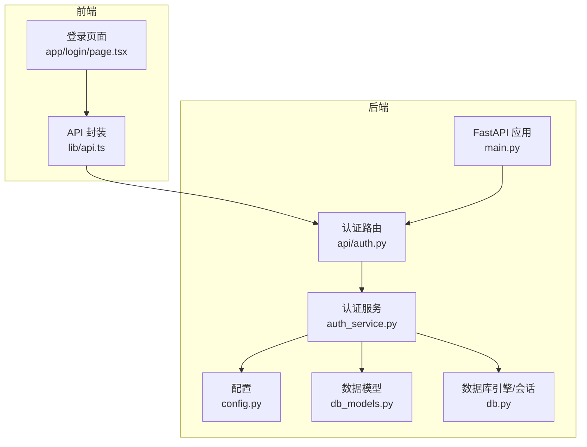
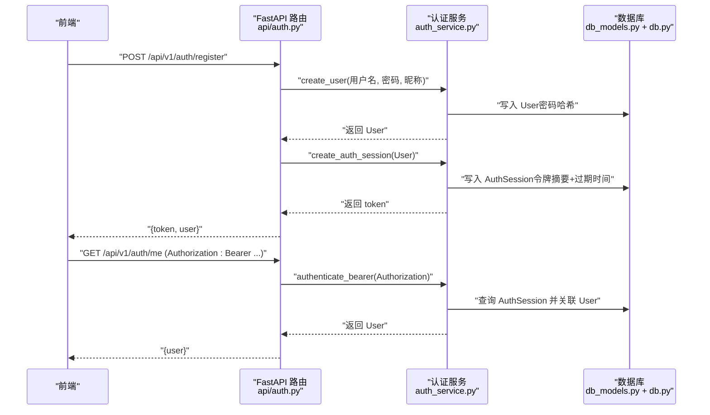
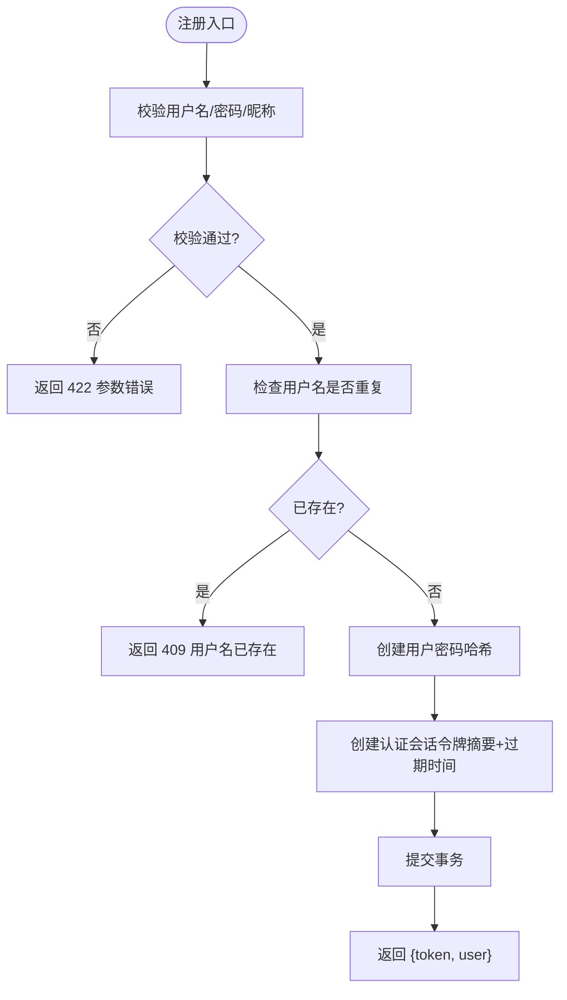
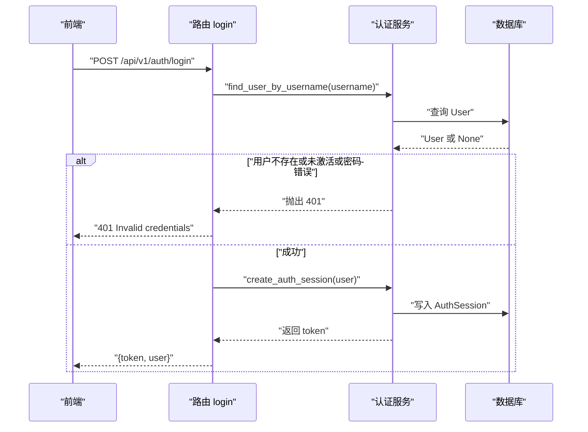
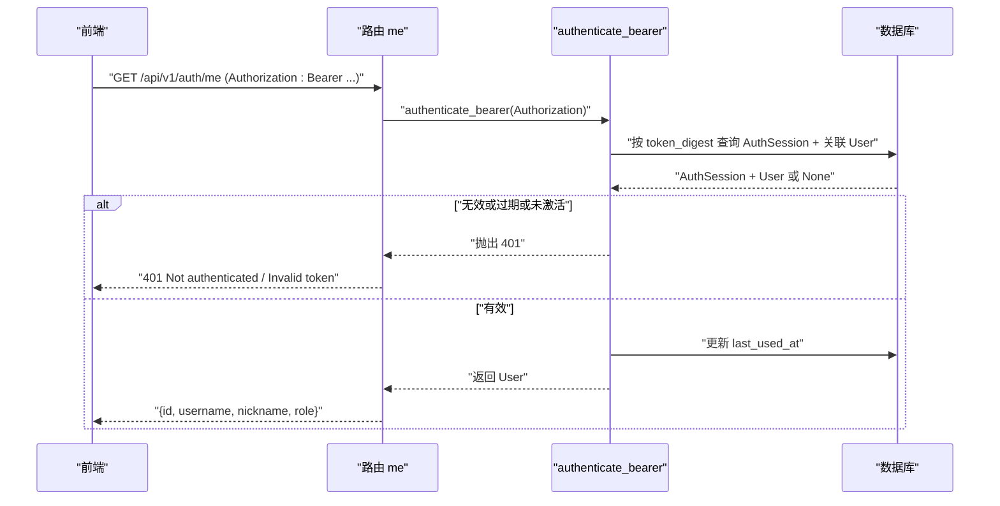
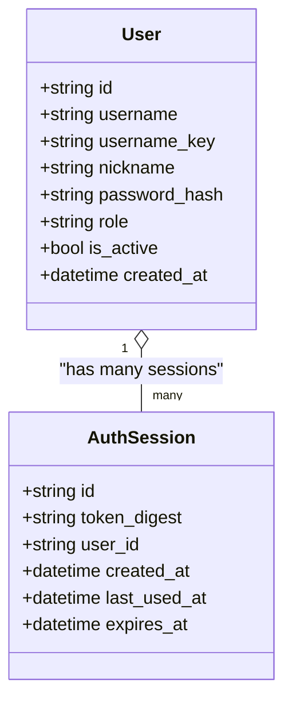
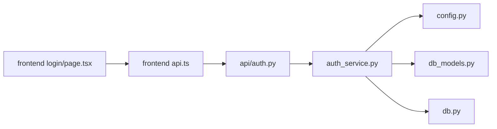

# 认证API接口

<cite>
**本文引用的文件**   
- [backend/app/api/auth.py](file://backend/app/api/auth.py)
- [backend/app/auth_service.py](file://backend/app/auth_service.py)
- [backend/app/config.py](file://backend/app/config.py)
- [backend/app/db_models.py](file://backend/app/db_models.py)
- [backend/app/main.py](file://backend/app/main.py)
- [backend/app/db.py](file://backend/app/db.py)
- [backend/tests/test_auth_api.py](file://backend/tests/test_auth_api.py)
- [frontend/src/lib/api.ts](file://frontend/src/lib/api.ts)
- [frontend/src/app/login/page.tsx](file://frontend/src/app/login/page.tsx)
</cite>

## 目录
1. [简介](#简介)
2. [项目结构](#项目结构)
3. [核心组件](#核心组件)
4. [架构总览](#架构总览)
5. [详细组件分析](#详细组件分析)
6. [依赖关系分析](#依赖关系分析)
7. [性能考量](#性能考量)
8. [故障排查指南](#故障排查指南)
9. [结论](#结论)
10. [附录：API规范与客户端集成](#附录api规范与客户端集成)

## 简介
本文件面向“澳门神秘”项目的认证子系统，提供完整的认证API文档。内容涵盖用户注册、登录、获取当前用户信息、令牌（Bearer Token）的生成与验证机制、密码加密存储、会话管理与权限控制实现。同时给出安全最佳实践、防攻击措施、客户端集成示例、错误处理策略与调试技巧。

本项目采用基于数据库持久化的 Bearer Token 认证方案，未使用 JWT。每次登录或注册都会生成新的随机令牌并持久化到数据库，服务端通过校验令牌摘要、有效期与用户状态完成鉴权。

## 项目结构
认证相关代码主要分布在后端 FastAPI 应用与前端 Next.js 应用中：
- 后端路由与请求模型定义位于 backend/app/api/auth.py
- 认证核心逻辑（用户创建、密码哈希、令牌生成与验证、角色守卫）位于 backend/app/auth_service.py
- 配置项（如令牌TTL、CORS等）位于 backend/app/config.py
- 数据模型（User、AuthSession）位于 backend/app/db_models.py
- 应用启动与路由挂载位于 backend/app/main.py
- 数据库引擎与会话管理位于 backend/app/db.py
- 前端 API 封装与登录页面分别位于 frontend/src/lib/api.ts 与 frontend/src/app/login/page.tsx

图表来源
- [backend/app/main.py:17-96](file://backend/app/main.py#L17-L96)
- [backend/app/api/auth.py:24-96](file://backend/app/api/auth.py#L24-L96)
- [backend/app/auth_service.py:83-130](file://backend/app/auth_service.py#L83-L130)
- [backend/app/config.py:38-77](file://backend/app/config.py#L38-L77)
- [backend/app/db_models.py:128-160](file://backend/app/db_models.py#L128-L160)
- [backend/app/db.py:26-32](file://backend/app/db.py#L26-L32)
- [frontend/src/lib/api.ts:201-215](file://frontend/src/lib/api.ts#L201-L215)
- [frontend/src/app/login/page.tsx:31-76](file://frontend/src/app/login/page.tsx#L31-L76)

章节来源
- [backend/app/main.py:17-96](file://backend/app/main.py#L17-L96)
- [backend/app/api/auth.py:24-96](file://backend/app/api/auth.py#L24-L96)
- [backend/app/auth_service.py:83-130](file://backend/app/auth_service.py#L83-L130)
- [backend/app/config.py:38-77](file://backend/app/config.py#L38-L77)
- [backend/app/db_models.py:128-160](file://backend/app/db_models.py#L128-L160)
- [backend/app/db.py:26-32](file://backend/app/db.py#L26-L32)
- [frontend/src/lib/api.ts:201-215](file://frontend/src/lib/api.ts#L201-L215)
- [frontend/src/app/login/page.tsx:31-76](file://frontend/src/app/login/page.tsx#L31-L76)

## 核心组件
- 认证路由（/api/v1/auth）
  - POST /register：用户注册，返回 token 与用户信息
  - POST /login：用户登录，返回 token 与用户信息
  - GET /me：获取当前用户信息，需要携带 Authorization: Bearer <token>
- 认证服务（auth_service）
  - 用户名与密码校验、昵称规范化
  - 密码哈希存储（推荐算法）
  - 令牌生成与摘要存储（SHA-256），有效期由配置决定
  - Bearer 令牌验证（检查摘要、过期时间、用户激活状态）
  - 管理员权限守卫（require_admin）
- 数据模型
  - User：用户基本信息、角色、激活状态、创建时间
  - AuthSession：令牌摘要、关联用户、创建/最后使用/过期时间
- 配置
  - AUTH_TOKEN_TTL_HOURS：令牌有效期（小时）
  - CORS_ORIGINS、APP_ENV、演示账号初始化开关等

章节来源
- [backend/app/api/auth.py:28-96](file://backend/app/api/auth.py#L28-L96)
- [backend/app/auth_service.py:27-130](file://backend/app/auth_service.py#L27-L130)
- [backend/app/db_models.py:128-160](file://backend/app/db_models.py#L128-L160)
- [backend/app/config.py:38-77](file://backend/app/config.py#L38-L77)

## 架构总览
认证流程从前端发起 HTTP 请求，经 FastAPI 路由进入认证服务，最终访问数据库进行用户与令牌校验。所有敏感操作均通过异步 SQLAlchemy 会话完成。

图表来源
- [backend/app/api/auth.py:64-96](file://backend/app/api/auth.py#L64-L96)
- [backend/app/auth_service.py:83-123](file://backend/app/auth_service.py#L83-L123)
- [backend/app/db_models.py:128-160](file://backend/app/db_models.py#L128-L160)
- [backend/app/db.py:30-32](file://backend/app/db.py#L30-L32)

## 详细组件分析

### 用户注册（POST /api/v1/auth/register）
- 输入模型：username、password、nickname（可选，默认回退为 username）
- 校验规则：
  - 用户名：字母开头，长度3-32位，仅包含字母、数字、下划线
  - 密码：长度6-128位
  - 昵称：去除首尾空白后不超过64字符
- 业务逻辑：
  - 若用户名已存在，返回 409
  - 使用推荐算法对密码进行哈希存储
  - 创建用户并立即生成一个认证会话（令牌）
  - 事务内提交，确保一致性
- 响应：{ token, user }

图表来源
- [backend/app/api/auth.py:75-87](file://backend/app/api/auth.py#L75-L87)
- [backend/app/auth_service.py:63-80](file://backend/app/auth_service.py#L63-L80)
- [backend/app/auth_service.py:83-97](file://backend/app/auth_service.py#L83-L97)

章节来源
- [backend/app/api/auth.py:36-46](file://backend/app/api/auth.py#L36-L46)
- [backend/app/auth_service.py:27-48](file://backend/app/auth_service.py#L27-L48)
- [backend/app/auth_service.py:63-97](file://backend/app/auth_service.py#L63-L97)

### 用户登录（POST /api/v1/auth/login）
- 输入模型：username、password
- 校验规则：用户名与密码格式校验
- 业务逻辑：
  - 根据用户名查找用户（忽略大小写）
  - 校验用户是否激活且密码正确
  - 成功后创建新的认证会话（令牌）
- 响应：{ token, user }

图表来源
- [backend/app/api/auth.py:64-72](file://backend/app/api/auth.py#L64-L72)
- [backend/app/auth_service.py:59-61](file://backend/app/auth_service.py#L59-L61)
- [backend/app/auth_service.py:83-97](file://backend/app/auth_service.py#L83-L97)

章节来源
- [backend/app/api/auth.py:28-33](file://backend/app/api/auth.py#L28-L33)
- [backend/app/auth_service.py:59-61](file://backend/app/auth_service.py#L59-L61)
- [backend/app/auth_service.py:83-97](file://backend/app/auth_service.py#L83-L97)

### 获取当前用户（GET /api/v1/auth/me）
- 鉴权方式：Authorization: Bearer <token>
- 业务逻辑：
  - 解析并校验 Bearer 令牌
  - 查询对应的认证会话，检查是否过期且用户处于激活状态
  - 更新 last_used_at 时间戳
- 响应：{ id, username, nickname, role }

图表来源
- [backend/app/api/auth.py:90-96](file://backend/app/api/auth.py#L90-L96)
- [backend/app/auth_service.py:100-123](file://backend/app/auth_service.py#L100-L123)

章节来源
- [backend/app/api/auth.py:90-96](file://backend/app/api/auth.py#L90-L96)
- [backend/app/auth_service.py:100-123](file://backend/app/auth_service.py#L100-L123)

### 令牌与密码安全机制
- 令牌生成与验证
  - 令牌：使用安全的随机字符串生成器生成不可预测的令牌
  - 存储：将令牌的 SHA-256 摘要存入数据库，避免明文存储
  - 验证：比较请求中的令牌摘要、检查 expires_at 是否大于当前时间、检查用户 is_active
  - 使用追踪：每次验证成功更新 last_used_at
- 密码加密存储
  - 使用推荐的密码哈希库进行哈希，支持自动升级算法
  - 不存储明文密码，验证时比对哈希值
- 会话管理
  - 每个用户可拥有多个活跃会话（多设备登录）
  - 令牌有效期由配置项 AUTH_TOKEN_TTL_HOURS 控制
  - 无登出接口；如需强制失效需删除对应 AuthSession 记录

图表来源
- [backend/app/db_models.py:128-160](file://backend/app/db_models.py#L128-L160)

章节来源
- [backend/app/auth_service.py:51-56](file://backend/app/auth_service.py#L51-L56)
- [backend/app/auth_service.py:83-97](file://backend/app/auth_service.py#L83-L97)
- [backend/app/auth_service.py:100-123](file://backend/app/auth_service.py#L100-L123)
- [backend/app/config.py:69-71](file://backend/app/config.py#L69-L71)

### 权限控制（角色守卫）
- 角色字段：role ∈ {"admin", "user"}
- 管理员守卫函数 require_admin：
  - 先执行 Bearer 令牌验证
  - 再校验用户角色是否为 admin
  - 否则返回 403
- 测试覆盖：普通用户访问管理员接口返回 403，管理员访问返回 200

章节来源
- [backend/app/auth_service.py:126-130](file://backend/app/auth_service.py#L126-L130)
- [backend/tests/test_auth_api.py:145-156](file://backend/tests/test_auth_api.py#L145-L156)

## 依赖关系分析
- 路由层依赖认证服务提供的用户与令牌方法
- 认证服务依赖配置（令牌TTL）、数据库模型（User、AuthSession）、数据库会话
- 前端通过统一的 API 封装调用认证接口，并在本地存储 token 与用户信息

图表来源
- [backend/app/api/auth.py:11-21](file://backend/app/api/auth.py#L11-L21)
- [backend/app/auth_service.py:15-17](file://backend/app/auth_service.py#L15-L17)
- [backend/app/config.py:56-77](file://backend/app/config.py#L56-L77)
- [backend/app/db_models.py:128-160](file://backend/app/db_models.py#L128-L160)
- [backend/app/db.py:26-32](file://backend/app/db.py#L26-L32)
- [frontend/src/lib/api.ts:201-215](file://frontend/src/lib/api.ts#L201-L215)
- [frontend/src/app/login/page.tsx:31-76](file://frontend/src/app/login/page.tsx#L31-L76)

章节来源
- [backend/app/api/auth.py:11-21](file://backend/app/api/auth.py#L11-L21)
- [backend/app/auth_service.py:15-17](file://backend/app/auth_service.py#L15-L17)
- [backend/app/config.py:56-77](file://backend/app/config.py#L56-L77)
- [backend/app/db_models.py:128-160](file://backend/app/db_models.py#L128-L160)
- [backend/app/db.py:26-32](file://backend/app/db.py#L26-L32)
- [frontend/src/lib/api.ts:201-215](file://frontend/src/lib/api.ts#L201-L215)
- [frontend/src/app/login/page.tsx:31-76](file://frontend/src/app/login/page.tsx#L31-L76)

## 性能考量
- 数据库索引
  - users.username_key 唯一索引加速用户名查找
  - auth_sessions.token_digest 唯一索引与 user_id 索引加速令牌验证与会话查询
- 连接池与超时
  - SQLite 启用外键约束与忙超时，提升并发稳定性
- 令牌有效期
  - 合理设置 AUTH_TOKEN_TTL_HOURS，平衡安全性与用户体验
- 查询优化
  - authenticate_bearer 使用 joinedload 一次性加载用户，减少 N+1 查询

章节来源
- [backend/app/db_models.py:128-160](file://backend/app/db_models.py#L128-L160)
- [backend/app/db.py:12-23](file://backend/app/db.py#L12-L23)
- [backend/app/auth_service.py:108-123](file://backend/app/auth_service.py#L108-L123)

## 故障排查指南
- 常见错误码
  - 401：未认证或令牌无效（缺少 Authorization、令牌为空、令牌过期、用户未激活）
  - 403：权限不足（非管理员访问管理员接口）
  - 409：用户名已存在（注册冲突）
  - 422：请求参数校验失败（用户名/密码/昵称不符合规则）
- 调试建议
  - 确认前端是否正确设置 Authorization 头
  - 检查数据库中是否存在对应 AuthSession 且 expires_at 未过期
  - 核对用户名大小写归一化（username_key 小写）
  - 查看健康检查接口 /api/v1/health 确认数据库可用
- 日志与异常
  - 自定义 RequestValidationError 处理器统一返回结构化错误
  - GameError 统一处理业务异常

章节来源
- [backend/app/api/auth.py:64-96](file://backend/app/api/auth.py#L64-L96)
- [backend/app/auth_service.py:100-130](file://backend/app/auth_service.py#L100-L130)
- [backend/app/main.py:51-74](file://backend/app/main.py#L51-L74)
- [backend/app/main.py:98-105](file://backend/app/main.py#L98-L105)

## 结论
该认证系统采用数据库持久化的 Bearer Token 方案，具备完善的用户注册、登录、身份核验与权限控制能力。密码使用推荐算法哈希存储，令牌以摘要形式保存并带有效期，结合索引与连接池优化保证性能。前端集成简单清晰，适合快速接入。由于未实现登出接口，如需强制失效可通过删除对应会话记录实现。

## 附录：API规范与客户端集成

### RESTful API 规范
- 基础路径：/api/v1
- 认证前缀：/api/v1/auth

端点列表
- POST /api/v1/auth/register
  - 请求体：{ username, password, nickname? }
  - 成功响应：{ token, user: { id, username, nickname, role } }
  - 错误：409（用户名已存在）、422（参数校验失败）
- POST /api/v1/auth/login
  - 请求体：{ username, password }
  - 成功响应：{ token, user: { id, username, nickname, role } }
  - 错误：401（凭证无效）
- GET /api/v1/auth/me
  - 头部：Authorization: Bearer <token>
  - 成功响应：{ id, username, nickname, role }
  - 错误：401（未认证/令牌无效）

章节来源
- [backend/app/api/auth.py:64-96](file://backend/app/api/auth.py#L64-L96)
- [backend/tests/test_auth_api.py:57-127](file://backend/tests/test_auth_api.py#L57-L127)

### 客户端集成示例（前端）
- 在 lib/api.ts 中封装了 authApi.login、authApi.register、authApi.me
- 登录页在 login/page.tsx 中直接调用后端接口，成功后将 token 与 user 存入 localStorage
- 后续请求通过 request 函数自动附加 Authorization 头

章节来源
- [frontend/src/lib/api.ts:201-215](file://frontend/src/lib/api.ts#L201-L215)
- [frontend/src/app/login/page.tsx:31-76](file://frontend/src/app/login/page.tsx#L31-L76)

### 安全最佳实践与防攻击措施
- 密码安全
  - 使用强哈希算法（pwdlib 推荐）
  - 限制密码长度范围，防止过短或过长
- 令牌安全
  - 使用不可预测的随机令牌
  - 仅存储令牌摘要，避免泄露风险
  - 设置合理的过期时间，定期轮换
- 输入校验
  - 严格校验用户名、密码、昵称格式与长度
  - 对用户输入进行去空白与大小写归一化处理
- 权限控制
  - 基于角色的访问控制（admin/user）
  - 管理员接口需额外校验角色
- 防暴力破解
  - 建议在网关或中间件层增加速率限制与账户锁定策略（当前未实现）
- 传输安全
  - 生产环境应使用 HTTPS，避免令牌在网络中被窃听
- 会话管理
  - 多设备登录支持，但缺乏登出接口；如需登出，应在服务端删除对应会话记录

章节来源
- [backend/app/auth_service.py:27-48](file://backend/app/auth_service.py#L27-L48)
- [backend/app/auth_service.py:51-56](file://backend/app/auth_service.py#L51-L56)
- [backend/app/auth_service.py:100-130](file://backend/app/auth_service.py#L100-L130)
- [backend/app/config.py:69-71](file://backend/app/config.py#L69-L71)

### 错误处理策略
- 参数校验错误：返回 422 并附带详细的错误信息
- 认证失败：返回 401，提示未认证或令牌无效
- 权限不足：返回 403，提示需要管理员权限
- 资源冲突：返回 409，提示用户名已存在

章节来源
- [backend/app/main.py:51-74](file://backend/app/main.py#L51-L74)
- [backend/tests/test_auth_api.py:76-127](file://backend/tests/test_auth_api.py#L76-L127)